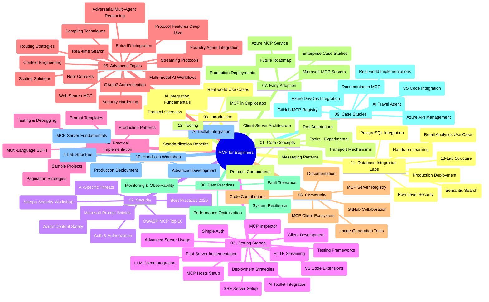

# Model Context Protocol (MCP) for Beginners - Study Guide

This study guide provides an overview of the repository structure and content for the "Model Context Protocol (MCP) for Beginners" curriculum. Use this guide to navigate the repository efficiently and make the most of the available resources.

## Repository Overview

The Model Context Protocol (MCP) is a standardized framework for interactions between AI models and client applications. Initially created by Anthropic, MCP is now maintained by the broader MCP community through the official GitHub organization. This repository provides a comprehensive curriculum with hands-on code examples in C#, Java, JavaScript, Python, and TypeScript, designed for AI developers, system architects, and software engineers.

## Visual Curriculum Map

## Repository Structure

The repository is organized into twelve main sections, each focusing on different aspects of MCP:

1. **Introduction (00-Introduction/)**
   - Overview of the Model Context Protocol
   - Why standardization matters in AI pipelines
   - Practical use cases and benefits

2. **Core Concepts (01-CoreConcepts/)**
   - Client-server architecture
   - Key protocol components
   - Messaging patterns in MCP
   - Forward-looking: [What's Changing in MCP: The 2026-07-28 Release Candidate](./01-CoreConcepts/mcp-2026-07-28-release-candidate.md) — the stateless protocol core, Extensions framework, and Roots/Sampling/Logging deprecations expected in the next specification version

3. **Security (02-Security/)**
   - Security threats in MCP-based systems
   - Best practices for securing implementations
   - Authentication and authorization strategies
   - **Comprehensive Security Documentation**:
     - MCP Security Best Practices 2025
     - Azure Content Safety Implementation Guide
     - MCP Security Controls and Techniques
     - MCP Best Practices Quick Reference
   - **Key Security Topics**:
     - Prompt injection and tool poisoning attacks
     - Session hijacking and confused deputy problems
     - Token passthrough vulnerabilities
     - Excessive permissions and access control
     - Supply chain security for AI components
     - Microsoft Prompt Shields integration

4. **Getting Started (03-GettingStarted/)**
   - Environment setup and configuration
   - Creating basic MCP servers and clients
   - Integration with existing applications
   - Includes sections for:
     - First server implementation
     - Client development
     - LLM client integration
     - VS Code integration
     - Server-Sent Events (SSE) server
     - Advanced server usage
     - HTTP streaming
     - AI Toolkit integration
     - Testing strategies
     - Deployment guidelines

5. **Practical Implementation (04-PracticalImplementation/)**
   - Using SDKs across different programming languages
   - Debugging, testing, and validation techniques
   - Crafting reusable prompt templates and workflows
   - Sample projects with implementation examples

6. **Advanced Topics (05-AdvancedTopics/)**
   - Context engineering techniques
   - Foundry agent integration
   - Multi-modal AI workflows 
   - OAuth2 authentication demos
   - Real-time search capabilities
   - Real-time streaming
   - Root contexts implementation
   - Routing strategies
   - Sampling techniques
   - Scaling approaches
   - Security considerations
   - Entra ID security integration
   - Web search integration
   - Adversarial multi-agent reasoning (debate patterns)

7. **Community Contributions (06-CommunityContributions/)**
   - How to contribute code and documentation
   - Collaborating via GitHub
   - Community-driven enhancements and feedback
   - Using various MCP clients (Claude Desktop, Cline, VSCode)
   - Working with popular MCP servers including image generation

8. **Lessons from Early Adoption (07-LessonsfromEarlyAdoption/)**
   - Real-world implementations and success stories
   - Building and deploying MCP-based solutions
   - Trends and future roadmap
   - **Microsoft MCP Servers Guide**: Comprehensive guide to 10 production-ready Microsoft MCP servers including:
     - Microsoft Learn Docs MCP Server
     - Azure MCP Server (15+ specialized connectors)
     - GitHub MCP Server
     - Azure DevOps MCP Server
     - MarkItDown MCP Server
     - SQL Server MCP Server
     - Playwright MCP Server
     - Dev Box MCP Server
     - Microsoft Foundry MCP Server
     - Microsoft 365 Agents Toolkit MCP Server

9. **Best Practices (08-BestPractices/)**
   - Performance tuning and optimization
   - Designing fault-tolerant MCP systems
   - Testing and resilience strategies

10. **Case Studies (09-CaseStudy/)**
    - **Seven comprehensive case studies** demonstrating MCP versatility across diverse scenarios:
    - **Azure AI Travel Agents**: Multi-agent orchestration with Azure OpenAI and AI Search
    - **Azure DevOps Integration**: Automating workflow processes with YouTube data updates
    - **Real-Time Documentation Retrieval**: Python console client with streaming HTTP
    - **Interactive Study Plan Generator**: Chainlit web app with conversational AI
    - **In-Editor Documentation**: VS Code integration with GitHub Copilot workflows
    - **Azure API Management**: Enterprise API integration with MCP server creation
    - **GitHub MCP Registry**: Ecosystem development and agentic integration platform
    - Implementation examples spanning enterprise integration, developer productivity, and ecosystem development

11. **Hands-on Workshop (10-StreamliningAIWorkflowsBuildingAnMCPServerWithAIToolkit/)**
    - Comprehensive hands-on workshop combining MCP with AI Toolkit
    - Building intelligent applications bridging AI models with real-world tools
    - Practical modules covering fundamentals, custom server development, and production deployment strategies
    - **Lab Structure**:
      - Lab 1: MCP Server Fundamentals
      - Lab 2: Advanced MCP Server Development
      - Lab 3: AI Toolkit Integration
      - Lab 4: Production Deployment and Scaling
    - Lab-based learning approach with step-by-step instructions

12. **MCP Server Database Integration Labs (11-MCPServerHandsOnLabs/)**
    - **Comprehensive 13-lab learning path** for building production-ready MCP servers with PostgreSQL integration
    - **Real-world retail analytics implementation** using the Zava Retail use case
    - **Enterprise-grade patterns** including Row Level Security (RLS), semantic search, and multi-tenant data access
    - **Complete Lab Structure**:
      - **Labs 00-03: Foundations** - Introduction, Architecture, Security, Environment Setup
      - **Labs 04-06: Building the MCP Server** - Database Design, MCP Server Implementation, Tool Development
      - **Labs 07-09: Advanced Features** - Semantic Search, Testing & Debugging, VS Code Integration
      - **Labs 10-12: Production & Best Practices** - Deployment, Monitoring, Optimization
    - **Technologies Covered**: FastMCP framework, PostgreSQL, Azure OpenAI, Azure Container Apps, Application Insights
    - **Learning Outcomes**: Production-ready MCP servers, database integration patterns, AI-powered analytics, enterprise security

13. **Tooling (12-tooling/)**
    - Learn how to use MCP in Copilot app and other tools

## Additional Resources

The repository includes supporting resources:

- **Images folder**: Contains diagrams and illustrations used throughout the curriculum
- **Translations**: Multi-language support with automated translations of documentation
- **Official MCP Resources**:
  - [MCP Documentation](https://modelcontextprotocol.io/)
  - [MCP Specification](https://spec.modelcontextprotocol.io/)
  - [MCP GitHub Repository](https://github.com/modelcontextprotocol)

## How to Use This Repository

1. **Sequential Learning**: Follow the chapters in order (00 through 11) for a structured learning experience.
2. **Language-Specific Focus**: If you're interested in a particular programming language, explore the samples directories for implementations in your preferred language.
3. **Practical Implementation**: Start with the "Getting Started" section to set up your environment and create your first MCP server and client.
4. **Advanced Exploration**: Once comfortable with the basics, dive into the advanced topics to expand your knowledge.
5. **Community Engagement**: Join the MCP community through GitHub discussions and Discord channels to connect with experts and fellow developers.

## MCP Clients and Tools

The curriculum covers various MCP clients and tools:

1. **Official Clients**:
   - Visual Studio Code 
   - MCP in Visual Studio Code
   - Claude Desktop
   - Claude in VSCode 
   - Claude API

2. **Community Clients**:
   - Cline (terminal-based)
   - Cursor (code editor)
   - ChatMCP
   - Windsurf

3. **MCP Management Tools**:
   - MCP CLI
   - MCP Manager
   - MCP Linker
   - MCP Router

## Popular MCP Servers

The repository introduces various MCP servers, including:

1. **Official Microsoft MCP Servers**:
   - Microsoft Learn Docs MCP Server
   - Azure MCP Server (15+ specialized connectors)
   - GitHub MCP Server
   - Azure DevOps MCP Server
   - MarkItDown MCP Server
   - SQL Server MCP Server
   - Playwright MCP Server
   - Dev Box MCP Server
   - Microsoft Foundry MCP Server
   - Microsoft 365 Agents Toolkit MCP Server

2. **Official Reference Servers**:
   - Filesystem
   - Fetch
   - Memory
   - Sequential Thinking

3. **Image Generation**:
   - Azure OpenAI DALL-E 3
   - Stable Diffusion WebUI
   - Replicate

4. **Development Tools**:
   - Git MCP
   - Terminal Control
   - Code Assistant

5. **Specialized Servers**:
   - Salesforce
   - Microsoft Teams
   - Jira & Confluence

## Contributing

This repository welcomes contributions from the community. See the Community Contributions section for guidance on how to contribute effectively to the MCP ecosystem.

----

*This study guide was last updated on February 5, 2026, reflecting the latest MCP Specification 2025-11-25 and provides an overview of the repository as of that date. Repository content may be updated after this date.*

*Addendum (July 2, 2026): a lesson on the `2026-07-28` MCP Specification Release Candidate was added under [01-CoreConcepts](./01-CoreConcepts/mcp-2026-07-28-release-candidate.md); the curriculum baseline remains 2025-11-25 until the new specification ships.*

---

<!-- CO-OP TRANSLATOR DISCLAIMER START -->
**Disclaimer**:
This document has been translated using AI translation service [Co-op Translator](https://github.com/Azure/co-op-translator). While we strive for accuracy, please be aware that automated translations may contain errors or inaccuracies. The original document in its native language should be considered the authoritative source. For critical information, professional human translation is recommended. We are not liable for any misunderstandings or misinterpretations arising from the use of this translation.
<!-- CO-OP TRANSLATOR DISCLAIMER END -->