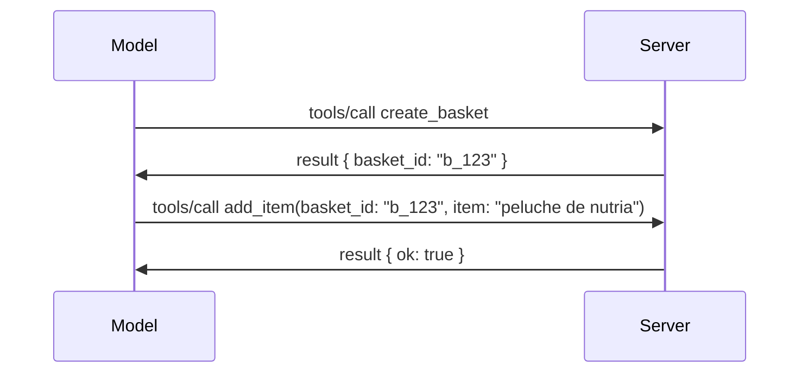

# Qué cambia en MCP: La versión candidata del 2026-07-28

> **Estado:** Versión candidata. La especificación `2026-07-28` no es definitiva al momento de escribir. Se anunció el 21 de mayo de 2026 y está programada para lanzarse el 28 de julio de 2026. Todo en esta lección describe la versión candidata; consulta la [especificación en borrador](https://modelcontextprotocol.io/specification/draft) y su [registro de cambios](https://modelcontextprotocol.io/specification/draft/changelog) para conocer el estado más reciente antes de construir con ella. El resto de este currículo está escrito con la versión estable actual, **Especificación MCP 2025-11-25**, y se actualizará una vez que `2026-07-28` sea lanzada.

## Resumen

`2026-07-28` es la revisión más grande de MCP desde su lanzamiento. Seis Propuestas de Mejora de la Especificación (SEP) eliminan las sesiones a nivel de protocolo y hacen que MCP sea sin estado en la capa de transporte, las extensiones se convierten en un mecanismo principal y versionado, y varias características que aprendiste antes en este currículo (Raíces, Muestreo, Registro) se marcan como obsoletas bajo una nueva política de ciclo de vida. Esta lección resume qué cambia, por qué importa y qué significa para el código que ya has escrito contra `2025-11-25`.

Fuente: [La Versión Candidata de la Especificación MCP 2026-07-28](https://blog.modelcontextprotocol.io/posts/2026-07-28-release-candidate/) (Blog Model Context Protocol, David Soria Parra y Den Delimarsky).

## Objetivos de aprendizaje

Al final de esta lección, podrás:

- Explicar por qué MCP avanza hacia un núcleo de protocolo sin estado y qué problema resuelve para implementaciones escaladas horizontalmente.
- Describir cómo se reemplazan el saludo `initialize`/`initialized` y el encabezado `Mcp-Session-Id`.
- Identificar los nuevos encabezados `Mcp-Method` y `Mcp-Name` y los metadatos de caché `ttlMs`/`cacheScope`.
- Reconocer el marco de extensiones y las dos extensiones que se lanzan con esta versión: MCP Apps y Tasks.
- Enumerar las seis SEP de autorización que refuerzan la alineación con OAuth 2.0 / OIDC.
- Identificar qué características centrales (Raíces, Muestreo, Registro) están ahora obsoletas y qué significa eso en práctica.
- Explicar el cambio al JSON Schema completo 2020-12 para `inputSchema`/`outputSchema` de herramientas.

## Un protocolo sin estado

El cambio principal: MCP se vuelve sin estado en la capa de protocolo.

### Antes (2025-11-25): las sesiones te atan a una instancia de servidor

Llamar a una herramienta vía Streamable HTTP comienza con un saludo `initialize`. El servidor responde con un encabezado `Mcp-Session-Id` que cada solicitud subsecuente debe llevar:

```http
POST /mcp HTTP/1.1
Mcp-Session-Id: 1868a90c-3a3f-4f5b
Content-Type: application/json

{"jsonrpc":"2.0","id":2,"method":"tools/call",
 "params":{"name":"search","arguments":{"q":"otters"}}}
```

Debido a que la sesión está vinculada a la instancia de servidor que la emitió, las implementaciones escaladas horizontalmente necesitan **enrutamiento persistente** en el balanceador de carga y una **tienda de sesiones compartida** entre instancias.

### Después (2026-07-28): cada solicitud es autónoma

```http
POST /mcp HTTP/1.1
MCP-Protocol-Version: 2026-07-28
Mcp-Method: tools/call
Mcp-Name: search
Content-Type: application/json

{"jsonrpc":"2.0","id":1,"method":"tools/call",
 "params":{"name":"search","arguments":{"q":"otters"},
           "_meta":{"io.modelcontextprotocol/clientInfo":{"name":"my-app","version":"1.0"}}}}
```

Cualquier instancia de servidor puede manejar esta solicitud. Cambios clave:

- **Se elimina el saludo `initialize`/`initialized`** ([SEP-2575](https://github.com/modelcontextprotocol/modelcontextprotocol/pull/2575)). La versión del protocolo, información del cliente y capacidades del cliente se mueven a `_meta` en cada solicitud. Un nuevo método `server/discover` permite que un cliente obtenga capacidades del servidor por adelantado cuando las necesite.
- **Se elimina el encabezado `Mcp-Session-Id` y la sesión a nivel de protocolo** ([SEP-2567](https://github.com/modelcontextprotocol/modelcontextprotocol/pull/2567)). Ya no se requiere enrutamiento persistente ni tiendas de sesiones compartidas a nivel de protocolo.

### Protocolo sin estado, aplicaciones con estado

Quitar la sesión a nivel de protocolo no significa que tu servidor no pueda tener estado. El patrón recomendado es el mismo que siempre han usado las APIs HTTP: generar un identificador explícito (un `basket_id`, un `browser_id`) desde una llamada a una herramienta, y hacer que el modelo pase ese identificador como un argumento común en llamadas posteriores.



Esto hace que el estado sea visible y razonable para el modelo en lugar de ocultarlo en metadatos de transporte, y permite que cualquier instancia de servidor maneje cualquier llamada.

### Solicitudes servidor-a-cliente, reestructuradas

Un protocolo sin estado aún necesita una manera para que el servidor le pida algo al cliente a mitad de llamada (por ejemplo, un aviso de solicitación):

- **Las solicitudes iniciadas por el servidor sólo pueden emitirse mientras el servidor procesa activamente una solicitud del cliente** ([SEP-2260](https://github.com/modelcontextprotocol/modelcontextprotocol/pull/2260)) — antes era una recomendación, ahora es obligatorio. Nunca se le pide algo al usuario "de la nada".
- **Las Solicitudes Multivuelta** ([SEP-2322](https://github.com/modelcontextprotocol/modelcontextprotocol/pull/2322)) reemplazan mantener un flujo SSE abierto. En cambio, el servidor devuelve un `InputRequiredResult`:

  ```json
  {
    "resultType": "inputRequired",
    "inputRequests": {
      "confirm": {
        "type": "elicitation",
        "message": "Delete 3 files?",
        "schema": { "type": "boolean" }
      }
    },
    "requestState": "eyJzdGVwIjoxLCJmaWxlcyI6WyJhIiwiYiIsImMiXX0="
  }
  ```

  El cliente recopila las respuestas y vuelve a emitir la llamada original con `inputResponses` más el `requestState` repetido. Cualquier instancia del servidor puede atender el reintento porque todo lo necesario está en la carga útil.

### Enrutables, cacheables, rastreables

Tres cambios menores hacen que el tráfico sin estado sea más sencillo de operar:

- **Los encabezados `Mcp-Method` y `Mcp-Name` son obligatorios en Streamable HTTP** ([SEP-2243](https://github.com/modelcontextprotocol/modelcontextprotocol/pull/2243)), para que balanceadores de carga, gateways y limitadores de tasa puedan enrutar según la operación sin inspeccionar el cuerpo JSON. Los servidores rechazan solicitudes donde encabezados y cuerpo no coinciden.
- **`tools/list` y los resultados de lectura de recursos llevan `ttlMs` y `cacheScope`** ([SEP-2549](https://github.com/modelcontextprotocol/modelcontextprotocol/pull/2549)), modelados en `Cache-Control` de HTTP. Los clientes saben cuánto tiempo un resultado de lista está fresco y si es seguro compartirlo entre usuarios, sin necesitar un flujo SSE de larga duración para conocer cambios.
- **Se documenta la propagación W3C Trace Context en `_meta`** ([SEP-414](https://github.com/modelcontextprotocol/modelcontextprotocol/pull/414)), corrigiendo los nombres clave `traceparent`, `tracestate` y `baggage` para que una traza distribuida pueda seguir una llamada a través del SDK cliente, el servidor MCP y sistemas descendentes en un backend compatible con [OpenTelemetry](https://opentelemetry.io/).

## Las extensiones se convierten en una característica principal

Las extensiones existían informalmente en `2025-11-25`. [SEP-2133](https://github.com/modelcontextprotocol/modelcontextprotocol/pull/2133) las formaliza:

- Las extensiones se identifican por IDs al estilo DNS inverso.
- Se negocian mediante un mapa `extensions` en las capacidades del cliente y del servidor.
- Viven en sus propios repositorios `ext-*` con mantenedores delegados y versionan de forma independiente a la especificación central.
- Una nueva pista de Extensiones en el proceso SEP les da un camino de experimental a oficial.

Esta versión lanza dos extensiones oficiales.

### MCP Apps: interfaces de usuario renderizadas en el servidor

[MCP Apps](https://blog.modelcontextprotocol.io/posts/2026-01-26-mcp-apps/) ([SEP-1865](https://github.com/modelcontextprotocol/modelcontextprotocol/pull/1865)) permite a los servidores enviar interfaces HTML interactivas que los hosts renderizan en un iframe sandbox. Las herramientas declaran sus plantillas de UI con anticipación para que los hosts puedan realizar prefetching, cachear y revisar la seguridad antes de ejecutar nada. Ya cubriste los fundamentos en [Lección 15: MCP Apps](../03-GettingStarted/15-mcp-apps/README.md) — bajo el marco de Extensiones, MCP Apps ahora es formalmente una extensión y no una característica experimental central.

### Tasks asciende a extensión

Tasks se lanzó como característica experimental central en `2025-11-25`. El uso en producción reveló tanto rediseño que su lugar correcto es una extensión: la [extensión Tasks](https://github.com/modelcontextprotocol/modelcontextprotocol/pull/2663) remodela el ciclo de vida alrededor del modelo sin estado — un servidor puede responder a `tools/call` con un identificador de tarea y el cliente la impulsa con `tasks/get`, `tasks/update` y `tasks/cancel`. La creación de tareas es dirigida por el servidor: el cliente anuncia la extensión y el servidor decide cuándo una llamada debe ejecutarse como tarea. `tasks/list` se elimina completamente porque no puede escoparse de forma segura sin sesiones.

> **Nota de migración:** si implementaste la API experimental Tasks `2025-11-25`, tendrás que migrar al nuevo ciclo de vida de la extensión — no es compatible hacia atrás.

## Refuerzo de la autorización

Seis SEP refuerzan la [especificación de autorización](https://modelcontextprotocol.io/specification/draft/basic/authorization) para alinearse mejor con implementaciones reales de OAuth 2.0 / OpenID Connect:

| SEP | Cambio |
|---|---|
| [SEP-2468](https://github.com/modelcontextprotocol/modelcontextprotocol/pull/2468) | Los clientes deben validar el parámetro `iss` en respuestas de autorización según [RFC 9207](https://www.rfc-editor.org/rfc/rfc9207), mitigando ataques de confusión comunes en el patrón MCP de un cliente único, muchos servidores. Una versión futura requerirá rechazar respuestas sin `iss`. |
| [SEP-837](https://github.com/modelcontextprotocol/modelcontextprotocol/pull/837) | Los clientes declaran su `application_type` de OpenID Connect durante el Registro Dinámico de Cliente, evitando que servidores de autorización asignen por defecto a un cliente de escritorio/CLI como `"web"` y rechacen su URI de redirección localhost. |
| [SEP-2352](https://github.com/modelcontextprotocol/modelcontextprotocol/pull/2352) | Los clientes vinculan credenciales registradas al `issuer` del servidor de autorización emisor y se vuelven a registrar cuando un recurso migra entre servidores de autorización. |
| [SEP-2207](https://github.com/modelcontextprotocol/modelcontextprotocol/pull/2207) | Documenta cómo solicitar tokens de actualización de servidores de autorización estilo OpenID Connect. |
| [SEP-2350](https://github.com/modelcontextprotocol/modelcontextprotocol/pull/2350) | Aclara la acumulación de scopes durante la autorización escalonada. |
| [SEP-2351](https://github.com/modelcontextprotocol/modelcontextprotocol/pull/2351) | Aclara el sufijo de descubrimiento `.well-known`. |

Si hoy estás construyendo un servidor de autorización para MCP, comienza a enviar `iss` en las respuestas de autorización — consulta [02-Security](../02-Security/README.md) para la guía de autorización actual sobre la cual se basará esto.

## Raíces, Muestreo y Registro están obsoletos

Bajo la nueva [política de ciclo de vida de características](https://github.com/modelcontextprotocol/modelcontextprotocol/pull/2577) ([SEP-2577](https://github.com/modelcontextprotocol/modelcontextprotocol/pull/2577)), tres primitivas centrales de cliente que aprendiste en [Conceptos centrales](./README.md#roots) pasan a estado de **Obsoleto**:

| Característica | Reemplazo recomendado |
|---|---|
| Raíces | Parámetros de herramienta, URIs de recursos, o configuración del servidor |
| Muestreo | Integración directa con APIs de proveedores LLM |
| Registro | `stderr` para transportes stdio; OpenTelemetry para observabilidad estructurada |

Estas son **depreciaciones sólo de anotación**: los métodos, tipos y flags de capacidad siguen funcionando en esta versión y en toda versión publicada hasta un año después. Eliminar cualquiera requerirá un SEP separado bajo la política de ciclo de vida — así que nada se rompe en tus [muestras de Muestreo](../03-GettingStarted/14-sampling/README.md) hoy, pero los nuevos servidores deben preferir los patrones de reemplazo arriba.

## JSON Schema completo 2020-12 para herramientas

Los `inputSchema` y `outputSchema` de herramientas se actualizan al completo [JSON Schema 2020-12](https://json-schema.org/draft/2020-12) ([SEP-2106](https://github.com/modelcontextprotocol/modelcontextprotocol/pull/2106)):

- Los esquemas de entrada mantienen la restricción raíz `type: "object"` pero ahora permiten composición (`oneOf`, `anyOf`, `allOf`), condicionales y referencias (`$ref`, `$defs`).
- Los esquemas de salida son irrestrictos, y `structuredContent` puede ahora ser cualquier valor JSON en lugar de solo un objeto.
- Las implementaciones no deben autodereferenciar URIs externas `$ref` y deberían limitar la profundidad y tiempo de validación del esquema (consideración para evitar denegaciones de servicio si validas esquemas en el servidor).

Por separado, el código de error por recurso faltante cambia del personalizado MCP `-32002` al estándar JSON-RPC `-32602` (Parametros Inválidos) ([SEP-2164](https://github.com/modelcontextprotocol/modelcontextprotocol/pull/2164)). Si tu cliente hace match con el valor literal `-32002`, necesitarás actualizarlo.

## Cómo evoluciona el protocolo desde aquí

Esta versión contiene cambios que rompen compatibilidad, que los mantenedores de MCP no planean que sean la norma a futuro. Tres SEP de gobernanza buscan evitar repeticiones:

- La **política de ciclo de vida de características** da a cada característica un camino Activo → Obsoleto → Eliminado con al menos doce meses entre obsolescencia y posible eliminación.
- El **marco de Extensiones** permite que nuevas capacidades se lancen como extensiones opt-in y se estabilicen ahí antes (si acaso) de pasar a la especificación central.

- Un SEP de tipo Standards Track ya no puede alcanzar el estado Final hasta que un escenario correspondiente aparezca en el [conformance suite](https://github.com/modelcontextprotocol/conformance) ([SEP-2484](https://github.com/modelcontextprotocol/modelcontextprotocol/pull/2484)) — el mismo suite contra el que el [sistema de niveles SDK](https://github.com/modelcontextprotocol/modelcontextprotocol/pull/1777) evalúa los SDK oficiales.

## Línea de Tiempo de Lanzamiento y Validación

- El candidato a lanzamiento se cerró el 21 de mayo de 2026.
- La especificación final está programada para el 28 de julio de 2026.
- La ventana de diez semanas entre ambas fechas permite a los mantenedores de SDK y a los implementadores clientes validar los cambios con cargas de trabajo reales; se espera que los SDK de Nivel 1 lancen soporte dentro de esta ventana bajo el [sistema de niveles SDK](https://modelcontextprotocol.io/docs/sdk).
- Sigue el conjunto completo de cambios en la [especificación borrador](https://modelcontextprotocol.io/specification/draft) y su [registro de cambios](https://modelcontextprotocol.io/specification/draft/changelog).

## Qué Significa Esto para Este Currículum

Todo lo que has aprendido hasta ahora en este curso está dirigido a **2025-11-25**, que sigue siendo la especificación estable actual hasta que se publique la versión `2026-07-28`. Concretamente:

- **Las sesiones y el saludo `initialize`** (cubierto en [Conceptos Básicos](./README.md) y [Lección 6: Streaming HTTP](../03-GettingStarted/06-http-streaming/README.md)) siguen funcionando como se documenta hoy, pero espera que sean reemplazados por el modelo stateless request mencionado arriba una vez que actualices a SDKs compatibles con `2026-07-28`.
- **Muestreo y Raíces** (también cubierto en [Conceptos Básicos](./README.md)) permanecen completamente funcionales pero están obsoletos — los nuevos diseños deben preferir los patrones de reemplazo listados arriba.
- **La característica experimental de Tareas (Tasks)**, si la has usado, necesitará migrarse al nuevo ciclo de vida de la extensión Tasks.
- **Las aplicaciones MCP** ([Lección 15](../03-GettingStarted/15-mcp-apps/README.md)) no se ven afectadas en la práctica; simplemente se vuelven parte del marco formal de Extensiones.

## Recursos Adicionales

- [El candidato a lanzamiento de la especificación MCP 2026-07-28 (entrada de blog)](https://blog.modelcontextprotocol.io/posts/2026-07-28-release-candidate/)
- [El Futuro de los Transportes MCP](https://blog.modelcontextprotocol.io/posts/2025-12-19-mcp-transport-future/)
- [Especificación Borrador MCP](https://modelcontextprotocol.io/specification/draft)
- [Registro de Cambios Borrador MCP](https://modelcontextprotocol.io/specification/draft/changelog)
- [Guías SEP](https://modelcontextprotocol.io/community/sep-guidelines)
- [Sistema de Niveles SDK MCP](https://modelcontextprotocol.io/docs/sdk)

## Próximos Pasos

Regresa a [Conceptos Básicos](./README.md) o continúa a [Seguridad](../02-Security/README.md) para ver cómo la guía actual `2025-11-25` se relaciona con lo que viene.

---

<!-- CO-OP TRANSLATOR DISCLAIMER START -->
**Descargo de responsabilidad**:
Este documento ha sido traducido utilizando el servicio de traducción automática [Co-op Translator](https://github.com/Azure/co-op-translator). Aunque nos esforzamos por la precisión, tenga en cuenta que las traducciones automatizadas pueden contener errores o inexactitudes. El documento original en su idioma nativo debe considerarse la fuente autorizada. Para información crítica, se recomienda una traducción profesional humana. No somos responsables de cualquier malentendido o interpretación errónea que surja del uso de esta traducción.
<!-- CO-OP TRANSLATOR DISCLAIMER END -->