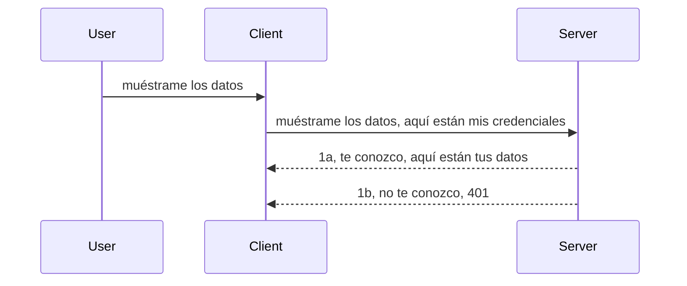

# Autenticación simple

Los SDK de MCP soportan el uso de OAuth 2.1 que, para ser justos, es un proceso bastante complejo que involucra conceptos como servidor de autenticación, servidor de recursos, envío de credenciales, obtención de un código, intercambio del código por un token portador hasta finalmente obtener los datos del recurso. Si no estás acostumbrado a OAuth, que es algo excelente para implementar, es buena idea empezar con un nivel básico de autenticación y avanzar hacia una seguridad cada vez mejor. Por eso existe este capítulo, para prepararte para una autenticación más avanzada.

## Autenticación, ¿qué queremos decir?

La autenticación es la abreviatura de autenticación y autorización. La idea es que necesitamos hacer dos cosas:

- **Autenticación**, que es el proceso de determinar si permitimos que una persona entre a nuestra casa, que tiene derecho a estar "aquí", es decir, tiene acceso a nuestro servidor de recursos donde viven las funcionalidades del MCP Server.
- **Autorización**, es el proceso de averiguar si un usuario debe tener acceso a estos recursos específicos que está solicitando, por ejemplo, estos pedidos o estos productos o si está autorizado a leer el contenido pero no a borrar, solo como ejemplo.

## Credenciales: cómo le decimos al sistema quiénes somos

Bueno, la mayoría de los desarrolladores web piensan en términos de proporcionar una credencial al servidor, usualmente un secreto que indica si se le permite estar aquí ("Autenticación"). Esta credencial suele ser una versión codificada en base64 de usuario y contraseña o una clave API que identifica de manera única a un usuario específico. 

Esto implica enviarla a través de un encabezado llamado "Authorization" de esta forma:

```json
{ "Authorization": "secret123" }
```

Esto suele llamarse autenticación básica. El flujo general funciona entonces de la siguiente manera:



Ahora que entendemos cómo funciona desde el punto de vista del flujo, ¿cómo lo implementamos? Bueno, la mayoría de servidores web tienen un concepto llamado middleware, un fragmento de código que se ejecuta como parte de la solicitud y puede verificar credenciales, y si las credenciales son válidas puede dejar pasar la solicitud. Si la solicitud no tiene credenciales válidas, obtienes un error de autenticación. Veamos cómo se puede implementar esto:

**Python**

```python
class AuthMiddleware(BaseHTTPMiddleware):
    async def dispatch(self, request, call_next):

        has_header = request.headers.get("Authorization")
        if not has_header:
            print("-> Missing Authorization header!")
            return Response(status_code=401, content="Unauthorized")

        if not valid_token(has_header):
            print("-> Invalid token!")
            return Response(status_code=403, content="Forbidden")

        print("Valid token, proceeding...")
       
        response = await call_next(request)
        # agregar cualquier encabezado personalizado del cliente o cambiar la respuesta de alguna manera
        return response


starlette_app.add_middleware(CustomHeaderMiddleware)
```

Aquí tenemos: 

- Se creó un middleware llamado `AuthMiddleware` donde su método `dispatch` es invocado por el servidor web. 
- Se agregó el middleware al servidor web:

    ```python
    starlette_app.add_middleware(AuthMiddleware)
    ```

- Se escribió lógica de validación que comprueba si el encabezado Authorization está presente y si el secreto enviado es válido:

    ```python
    has_header = request.headers.get("Authorization")
    if not has_header:
        print("-> Missing Authorization header!")
        return Response(status_code=401, content="Unauthorized")

    if not valid_token(has_header):
        print("-> Invalid token!")
        return Response(status_code=403, content="Forbidden")
    ```

    si el secreto está presente y es válido, entonces dejamos pasar la solicitud llamando a `call_next` y devolvemos la respuesta.

    ```python
    response = await call_next(request)
    # agregar cualquier encabezado de cliente o cambiar la respuesta de alguna manera
    return response
    ```

Cómo funciona es que si se realiza una solicitud web hacia el servidor, el middleware será invocado y dada su implementación, permitirá pasar la solicitud o devolverá un error que indica que el cliente no está autorizado a continuar.

**TypeScript**

Aquí creamos un middleware con el popular framework Express e interceptamos la solicitud antes de que llegue al MCP Server. Aquí está el código para eso:

```typescript
function isValid(secret) {
    return secret === "secret123";
}

app.use((req, res, next) => {
    // 1. ¿Cabecera de autorización presente?
    if(!req.headers["Authorization"]) {
        res.status(401).send('Unauthorized');
    }
    
    let token = req.headers["Authorization"];

    // 2. Comprobar validez.
    if(!isValid(token)) {
        res.status(403).send('Forbidden');
    }

   
    console.log('Middleware executed');
    // 3. Pasa la solicitud al siguiente paso en la cadena de solicitud.
    next();
});
```

En este código:

1. Comprobamos si el encabezado Authorization está presente; si no, enviamos un error 401.
2. Nos aseguramos que la credencial/token sea válido; si no, enviamos un error 403.
3. Finalmente deja pasar la solicitud en la cadena y devuelve el recurso solicitado.

## Ejercicio: Implementar autenticación

Pongamos nuestro conocimiento en práctica y tratemos de implementarlo. Este es el plan:

Servidor

- Crear un servidor web y una instancia de MCP.
- Implementar un middleware para el servidor.

Cliente 

- Enviar solicitud web, con credencial, vía encabezado.

### -1- Crear un servidor web y una instancia MCP

> **Mirando hacia adelante:** el ejemplo de TypeScript abajo rastrea los transportes HTTP en un mapa `transports` claveado por `mcp-session-id`, según la **Especificación MCP 2025-11-25**. La versión candidata `2026-07-28` elimina el apretón de manos `initialize` y el ID de sesión completamente, por lo que este mapa por sesión desaparece y se pasa a solicitudes sin estado y autónomas. Vea [Qué Cambia en MCP: La versión candidata 2026-07-28](../../01-CoreConcepts/mcp-2026-07-28-release-candidate.md).

En nuestro primer paso, necesitamos crear la instancia del servidor web y el MCP Server.

**Python**

Aquí creamos una instancia de un servidor MCP, creamos una app web starlette y la hospedamos con uvicorn.

```python
# creando servidor MCP

app = FastMCP(
    name="MCP Resource Server",
    instructions="Resource Server that validates tokens via Authorization Server introspection",
    host=settings["host"],
    port=settings["port"],
    debug=True
)

# creando aplicación web starlette
starlette_app = app.streamable_http_app()

# sirviendo aplicación a través de uvicorn
async def run(starlette_app):
    import uvicorn
    config = uvicorn.Config(
            starlette_app,
            host=app.settings.host,
            port=app.settings.port,
            log_level=app.settings.log_level.lower(),
        )
    server = uvicorn.Server(config)
    await server.serve()

run(starlette_app)
```

En este código:

- Creamos el MCP Server.
- Construimos la app web starlette a partir del MCP Server, `app.streamable_http_app()`.
- Hospedamos y servimos la app web usando uvicorn con `server.serve()`.

**TypeScript**

Aquí creamos una instancia del MCP Server.

```typescript
const server = new McpServer({
      name: "example-server",
      version: "1.0.0"
    });

    // ... configurar recursos del servidor, herramientas y avisos ...
```

Esta creación del MCP Server necesitará ocurrir dentro de nuestra definición de ruta POST /mcp, así que tomemos el código anterior y lo movemos así:

```typescript
import express from "express";
import { randomUUID } from "node:crypto";
import { McpServer } from "@modelcontextprotocol/sdk/server/mcp.js";
import { StreamableHTTPServerTransport } from "@modelcontextprotocol/sdk/server/streamableHttp.js";
import { isInitializeRequest } from "@modelcontextprotocol/sdk/types.js"

const app = express();
app.use(express.json());

// Mapa para almacenar transportes por ID de sesión
const transports: { [sessionId: string]: StreamableHTTPServerTransport } = {};

// Manejar solicitudes POST para comunicación de cliente a servidor
app.post('/mcp', async (req, res) => {
  // Verificar si existe ID de sesión
  const sessionId = req.headers['mcp-session-id'] as string | undefined;
  let transport: StreamableHTTPServerTransport;

  if (sessionId && transports[sessionId]) {
    // Reutilizar transporte existente
    transport = transports[sessionId];
  } else if (!sessionId && isInitializeRequest(req.body)) {
    // Nueva solicitud de inicialización
    transport = new StreamableHTTPServerTransport({
      sessionIdGenerator: () => randomUUID(),
      onsessioninitialized: (sessionId) => {
        // Almacenar el transporte por ID de sesión
        transports[sessionId] = transport;
      },
      // La protección contra rebinding DNS está deshabilitada por defecto para compatibilidad con versiones anteriores. Si estás ejecutando este servidor
      // localmente, asegúrate de establecer:
      // enableDnsRebindingProtection: true,
      // allowedHosts: ['127.0.0.1'],
    });

    // Limpiar el transporte cuando se cierre
    transport.onclose = () => {
      if (transport.sessionId) {
        delete transports[transport.sessionId];
      }
    };
    const server = new McpServer({
      name: "example-server",
      version: "1.0.0"
    });

    // ... configurar recursos, herramientas y avisos del servidor ...

    // Conectarse al servidor MCP
    await server.connect(transport);
  } else {
    // Solicitud inválida
    res.status(400).json({
      jsonrpc: '2.0',
      error: {
        code: -32000,
        message: 'Bad Request: No valid session ID provided',
      },
      id: null,
    });
    return;
  }

  // Manejar la solicitud
  await transport.handleRequest(req, res, req.body);
});

// Manejador reutilizable para solicitudes GET y DELETE
const handleSessionRequest = async (req: express.Request, res: express.Response) => {
  const sessionId = req.headers['mcp-session-id'] as string | undefined;
  if (!sessionId || !transports[sessionId]) {
    res.status(400).send('Invalid or missing session ID');
    return;
  }
  
  const transport = transports[sessionId];
  await transport.handleRequest(req, res);
};

// Manejar solicitudes GET para notificaciones del servidor al cliente vía SSE
app.get('/mcp', handleSessionRequest);

// Manejar solicitudes DELETE para terminación de sesión
app.delete('/mcp', handleSessionRequest);

app.listen(3000);
```

Ahora ves cómo la creación del MCP Server fue movida dentro de `app.post("/mcp")`.

Pasemos al siguiente paso de crear el middleware para poder validar la credencial entrante.

### -2- Implementar un middleware para el servidor

Vamos a la parte del middleware. Aquí crearemos un middleware que busca una credencial en el encabezado `Authorization` y la valida. Si es aceptable, la solicitud avanzará para hacer lo que necesite (por ejemplo, listar herramientas, leer un recurso o cualquier funcionalidad MCP que el cliente solicite).

**Python**

Para crear el middleware, necesitamos crear una clase que herede de `BaseHTTPMiddleware`. Hay dos piezas interesantes:

- La solicitud `request`, de la que leemos la información del encabezado.
- `call_next`, la función de retrollamada que necesitamos invocar si el cliente presentó una credencial que aceptamos.

Primero, debemos manejar el caso si falta el encabezado `Authorization`:

```python
has_header = request.headers.get("Authorization")

# no hay encabezado presente, fallo con 401, de lo contrario continuar.
if not has_header:
    print("-> Missing Authorization header!")
    return Response(status_code=401, content="Unauthorized")
```

Aquí enviamos un mensaje 401 no autorizado pues el cliente está fallando en autenticación.

Luego, si se envió una credencial, necesitamos verificar su validez así:

```python
 if not valid_token(has_header):
    print("-> Invalid token!")
    return Response(status_code=403, content="Forbidden")
```

Nótese que enviamos un mensaje 403 prohibido arriba. Veamos el middleware completo que implementa todo lo mencionado:

```python
class AuthMiddleware(BaseHTTPMiddleware):
    async def dispatch(self, request, call_next):

        has_header = request.headers.get("Authorization")
        if not has_header:
            print("-> Missing Authorization header!")
            return Response(status_code=401, content="Unauthorized")

        if not valid_token(has_header):
            print("-> Invalid token!")
            return Response(status_code=403, content="Forbidden")

        print("Valid token, proceeding...")
        print(f"-> Received {request.method} {request.url}")
        response = await call_next(request)
        response.headers['Custom'] = 'Example'
        return response

```

Genial, ¿pero qué pasa con la función `valid_token`? Aquí está abajo:

```python
# NO usar en producción - ¡mejorarlo!
def valid_token(token: str) -> bool:
    # eliminar el prefijo "Bearer "
    if token.startswith("Bearer "):
        token = token[7:]
        return token == "secret-token"
    return False
```

Esto obviamente debería mejorar. 

IMPORTANTE: Nunca deberías tener secretos como este en el código. Idealmente deberías obtener el valor a comparar desde una fuente de datos o de un IDP (proveedor de servicio de identidad) o mejor aún, dejar que el IDP realice la validación.

**TypeScript**

Para implementar esto con Express, necesitamos llamar al método `use` que acepta funciones middleware.

Necesitamos:

- Interactuar con la variable request para comprobar la credencial pasada en la propiedad `Authorization`.
- Validar la credencial, y si es válida dejar continuar la solicitud y que la petición MCP del cliente realice lo que debe (por ejemplo listar herramientas, leer recurso o cualquier otra función MCP).

Aquí, verificamos si el encabezado `Authorization` está presente y si no, detenemos la solicitud:

```typescript
if(!req.headers["authorization"]) {
    res.status(401).send('Unauthorized');
    return;
}
```

Si el encabezado no se envía en primer lugar, recibes un 401.

Luego, verificamos si la credencial es válida, si no, nuevamente detenemos la solicitud pero con un mensaje ligeramente diferente:

```typescript
if(!isValid(token)) {
    res.status(403).send('Forbidden');
    return;
} 
```

Nótese que ahora recibes un error 403.

Aquí está el código completo:

```typescript
app.use((req, res, next) => {
    console.log('Request received:', req.method, req.url, req.headers);
    console.log('Headers:', req.headers["authorization"]);
    if(!req.headers["authorization"]) {
        res.status(401).send('Unauthorized');
        return;
    }
    
    let token = req.headers["authorization"];

    if(!isValid(token)) {
        res.status(403).send('Forbidden');
        return;
    }  

    console.log('Middleware executed');
    next();
});
```

Hemos configurado el servidor web para aceptar un middleware que verifica la credencial que el cliente nos envía supuestamente. ¿Y qué hay del cliente?

### -3- Enviar solicitud web con credencial vía encabezado

Necesitamos asegurarnos de que el cliente pase la credencial a través del encabezado. Como vamos a usar un cliente MCP para esto, necesitamos averiguar cómo se hace.

**Python**

Para el cliente, necesitamos pasar un encabezado con nuestra credencial así:

```python
# NO codifiques el valor, tenlo como mínimo en una variable de entorno o en un almacenamiento más seguro
token = "secret-token"

async with streamablehttp_client(
        url = f"http://localhost:{port}/mcp",
        headers = {"Authorization": f"Bearer {token}"}
    ) as (
        read_stream,
        write_stream,
        session_callback,
    ):
        async with ClientSession(
            read_stream,
            write_stream
        ) as session:
            await session.initialize()
      
            # TODO, lo que quieres que se haga en el cliente, por ejemplo listar herramientas, llamar a herramientas, etc.
```

Nota cómo llenamos la propiedad `headers` así: ` headers = {"Authorization": f"Bearer {token}"}`.

**TypeScript**

Podemos resolver esto en dos pasos:

1. Llenar un objeto de configuración con nuestra credencial.
2. Pasar el objeto de configuración al transporte.

```typescript

// NO codifiques el valor como se muestra aquí. Como mínimo, tenlo como una variable de entorno y usa algo como dotenv (en modo desarrollo).
let token = "secret123"

// define un objeto de opción de transporte para el cliente
let options: StreamableHTTPClientTransportOptions = {
  sessionId: sessionId,
  requestInit: {
    headers: {
      "Authorization": "secret123"
    }
  }
};

// pasa el objeto de opciones al transporte
async function main() {
   const transport = new StreamableHTTPClientTransport(
      new URL(serverUrl),
      options
   );
```

Aquí ves arriba cómo tuvimos que crear un objeto `options` y colocar nuestros encabezados bajo la propiedad `requestInit`.

IMPORTANTE: ¿Cómo mejoramos esto desde aquí? Bueno, la implementación actual tiene algunos problemas. Primero, pasar una credencial así es bastante riesgoso a menos que al menos tengas HTTPS. Aun así, la credencial puede ser robada, por lo que necesitas un sistema donde puedas revocar fácilmente el token y agregar controles adicionales como desde dónde en el mundo viene, si la solicitud ocurre con demasiada frecuencia (comportamiento de bot), en resumen, hay todo un conjunto de preocupaciones.

Sin embargo, debe decirse que para APIs muy simples donde no quieres que nadie llame a tu API sin estar autenticado, lo que tenemos aquí es un buen comienzo.

Dicho esto, intentemos fortalecer un poco la seguridad usando un formato estandarizado como JSON Web Token, también conocidos como tokens JWT o "JOT".

## JSON Web Tokens, JWT

Entonces, estamos tratando de mejorar las cosas desde enviar credenciales muy simples. ¿Cuáles son las mejoras inmediatas que obtenemos al adoptar JWT?

- **Mejoras de seguridad**. En autenticación básica, envías el nombre de usuario y contraseña como un token codificado en base64 (o envías una clave API) una y otra vez, lo que aumenta el riesgo. Con JWT, envías tu nombre de usuario y contraseña y obtienes un token a cambio y también está limitado en el tiempo, es decir, expira. JWT te permite fácilmente usar control de acceso granular mediante roles, ámbitos y permisos.
- **Sin estado y escalabilidad**. Los JWT son autosuficientes, llevan toda la información del usuario y eliminan la necesidad de almacenar sesiones en el servidor. El token también puede validarse localmente.
- **Interoperabilidad y federación**. Los JWT son centrales para Open ID Connect y se usan con proveedores de identidad conocidos como Entra ID, Google Identity y Auth0. También hacen posible usar inicio de sesión único y mucho más, haciendo que sea apto para empresas.
- **Modularidad y flexibilidad**. Los JWT también se pueden usar con API Gateways como Azure API Management, NGINX y más. También soporta escenarios de autenticación y comunicación servidor a servicio, incluyendo escenarios de suplantación y delegación.
- **Rendimiento y caché**. Los JWT pueden ser almacenados en caché después de decodificarlos, lo que reduce la necesidad de análisis. Esto ayuda especialmente con aplicaciones de alto tráfico, ya que mejora el rendimiento y reduce la carga en tu infraestructura.
- **Funciones avanzadas**. También soporta introspección (comprobar validez en el servidor) y revocación (hacer que un token sea inválido).

Con todos estos beneficios, veamos cómo podemos llevar nuestra implementación al siguiente nivel.

## Transformando la autenticación básica en JWT

Entonces, los cambios que necesitamos hacer a nivel general son:

- **Aprender a construir un token JWT** y dejarlo listo para ser enviado del cliente al servidor.
- **Validar un token JWT**, y si es válido, dejar que el cliente acceda a nuestros recursos.
- **Almacenamiento seguro de tokens**. Cómo almacenamos este token.
- **Proteger las rutas**. Necesitamos proteger las rutas, en nuestro caso proteger rutas y funcionalidades específicas de MCP.
- **Agregar tokens de actualización**. Asegurar que creamos tokens de corta duración pero tokens de actualización de larga duración que pueden usarse para adquirir nuevos tokens si expiran. También asegurarnos que hay un endpoint de actualización y una estrategia de rotación.

### -1- Construir un token JWT

Primero, un token JWT tiene las siguientes partes:

- **cabecera**, algoritmo usado y tipo de token.
- **carga útil**, declaraciones, como sub (el usuario o entidad que el token representa, en un escenario de autenticación es típicamente el id de usuario), exp (cuándo expira), rol (el rol)
- **firma**, firmada con un secreto o clave privada.

Para esto, necesitaremos construir la cabecera, la carga útil y el token codificado.

**Python**

```python

import jwt
import jwt
from jwt.exceptions import ExpiredSignatureError, InvalidTokenError
import datetime

# Clave secreta utilizada para firmar el JWT
secret_key = 'your-secret-key'

header = {
    "alg": "HS256",
    "typ": "JWT"
}

# la información del usuario, sus reclamos y tiempo de expiración
payload = {
    "sub": "1234567890",               # Sujeto (ID del usuario)
    "name": "User Userson",                # Reclamo personalizado
    "admin": True,                     # Reclamo personalizado
    "iat": datetime.datetime.utcnow(),# Emitido en
    "exp": datetime.datetime.utcnow() + datetime.timedelta(hours=1)  # Expiración
}

# codificarlo
encoded_jwt = jwt.encode(payload, secret_key, algorithm="HS256", headers=header)
```

En el código anterior hemos:

- Definido una cabecera usando HS256 como algoritmo y tipo JWT.
- Construido una carga útil que contiene un sujeto o id de usuario, un nombre de usuario, un rol, cuándo fue emitido y cuándo expirará, implementando así el aspecto temporal que mencionamos antes.

**TypeScript**

Aquí necesitaremos algunas dependencias que nos ayudarán a construir el token JWT.

Dependencias

```sh

npm install jsonwebtoken
npm install --save-dev @types/jsonwebtoken
```

Ahora que tenemos eso, vamos a crear la cabecera, carga útil y a través de eso crear el token codificado.

```typescript
import jwt from 'jsonwebtoken';

const secretKey = 'your-secret-key'; // Usa variables de entorno en producción

// Define la carga útil
const payload = {
  sub: '1234567890',
  name: 'User usersson',
  admin: true,
  iat: Math.floor(Date.now() / 1000), // Emitido en
  exp: Math.floor(Date.now() / 1000) + 60 * 60 // Expira en 1 hora
};

// Define el encabezado (opcional, jsonwebtoken establece valores predeterminados)
const header = {
  alg: 'HS256',
  typ: 'JWT'
};

// Crea el token
const token = jwt.sign(payload, secretKey, {
  algorithm: 'HS256',
  header: header
});

console.log('JWT:', token);
```

Este token es:

Firmado usando HS256
Válido por 1 hora
Incluye declaraciones como sub, name, admin, iat y exp.

### -2- Validar un token

También necesitaremos validar un token, esto es algo que deberíamos hacer en el servidor para asegurarnos de que lo que el cliente nos está enviando es en efecto válido. Hay muchas comprobaciones que deberíamos hacer aquí, desde validar su estructura hasta su validez. También se recomienda añadir otras comprobaciones, por ejemplo, verificar si el usuario está en tu sistema y más.

Para validar un token, necesitamos decodificarlo para poder leerlo y luego empezar a verificar su validez:

**Python**

```python

# Decodificar y verificar el JWT
try:
    decoded = jwt.decode(token, secret_key, algorithms=["HS256"])
    print("✅ Token is valid.")
    print("Decoded claims:")
    for key, value in decoded.items():
        print(f"  {key}: {value}")
except ExpiredSignatureError:
    print("❌ Token has expired.")
except InvalidTokenError as e:
    print(f"❌ Invalid token: {e}")

```


En este código, llamamos a `jwt.decode` usando el token, la clave secreta y el algoritmo elegido como entrada. Fíjate cómo usamos una construcción try-catch ya que una validación fallida provoca que se genere un error.

**TypeScript**

Aquí necesitamos llamar a `jwt.verify` para obtener una versión decodificada del token que podamos analizar más a fondo. Si esta llamada falla, significa que la estructura del token es incorrecta o que ya no es válido.

```typescript

try {
  const decoded = jwt.verify(token, secretKey);
  console.log('Decoded Payload:', decoded);
} catch (err) {
  console.error('Token verification failed:', err);
}
```

NOTA: como se mencionó anteriormente, deberíamos realizar chequeos adicionales para asegurar que este token identifica a un usuario en nuestro sistema y verificar que el usuario tenga los derechos que dice tener.

A continuación, veamos el control de acceso basado en roles, también conocido como RBAC.

## Añadiendo control de acceso basado en roles

La idea es que queremos expresar que diferentes roles tienen diferentes permisos. Por ejemplo, asumimos que un administrador puede hacer todo, un usuario normal puede leer/escribir y un invitado solo puede leer. Por lo tanto, aquí hay algunos niveles posibles de permisos:

- Admin.Write 
- User.Read
- Guest.Read

Veamos cómo podemos implementar tal control con middleware. Los middlewares pueden añadirse por ruta así como para todas las rutas.

**Python**

```python
from starlette.middleware.base import BaseHTTPMiddleware
from starlette.responses import JSONResponse
import jwt

# NO tengas el secreto en el código como este, esto es solo para fines de demostración. Léeo de un lugar seguro.
SECRET_KEY = "your-secret-key" # pon esto en una variable de entorno
REQUIRED_PERMISSION = "User.Read"

class JWTPermissionMiddleware(BaseHTTPMiddleware):
    async def dispatch(self, request, call_next):
        auth_header = request.headers.get("Authorization")
        if not auth_header or not auth_header.startswith("Bearer "):
            return JSONResponse({"error": "Missing or invalid Authorization header"}, status_code=401)

        token = auth_header.split(" ")[1]
        try:
            decoded = jwt.decode(token, SECRET_KEY, algorithms=["HS256"])
        except jwt.ExpiredSignatureError:
            return JSONResponse({"error": "Token expired"}, status_code=401)
        except jwt.InvalidTokenError:
            return JSONResponse({"error": "Invalid token"}, status_code=401)

        permissions = decoded.get("permissions", [])
        if REQUIRED_PERMISSION not in permissions:
            return JSONResponse({"error": "Permission denied"}, status_code=403)

        request.state.user = decoded
        return await call_next(request)


```

Hay varias maneras diferentes de añadir el middleware como se muestra a continuación:

```python

# Alternativa 1: agregar middleware mientras se construye la aplicación starlette
middleware = [
    Middleware(JWTPermissionMiddleware)
]

app = Starlette(routes=routes, middleware=middleware)

# Alternativa 2: agregar middleware después de que la aplicación starlette ya está construida
starlette_app.add_middleware(JWTPermissionMiddleware)

# Alternativa 3: agregar middleware por ruta
routes = [
    Route(
        "/mcp",
        endpoint=..., # manejador
        middleware=[Middleware(JWTPermissionMiddleware)]
    )
]
```

**TypeScript**

Podemos usar `app.use` y un middleware que se ejecutará para todas las peticiones.

```typescript
app.use((req, res, next) => {
    console.log('Request received:', req.method, req.url, req.headers);
    console.log('Headers:', req.headers["authorization"]);

    // 1. Comprobar si se ha enviado el encabezado de autorización

    if(!req.headers["authorization"]) {
        res.status(401).send('Unauthorized');
        return;
    }
    
    let token = req.headers["authorization"];

    // 2. Comprobar si el token es válido
    if(!isValid(token)) {
        res.status(403).send('Forbidden');
        return;
    }  

    // 3. Comprobar si el usuario del token existe en nuestro sistema
    if(!isExistingUser(token)) {
        res.status(403).send('Forbidden');
        console.log("User does not exist");
        return;
    }
    console.log("User exists");

    // 4. Verificar que el token tenga los permisos correctos
    if(!hasScopes(token, ["User.Read"])){
        res.status(403).send('Forbidden - insufficient scopes');
    }

    console.log("User has required scopes");

    console.log('Middleware executed');
    next();
});

```

Hay varias cosas que podemos dejar que nuestro middleware haga y que DEBE hacer, a saber:

1. Comprobar si el encabezado de autorización está presente
2. Comprobar si el token es válido, llamamos a `isValid` que es un método que escribimos que verifica la integridad y validez del token JWT.
3. Verificar que el usuario exista en nuestro sistema, debemos comprobarlo.

   ```typescript
    // usuarios en la BD
   const users = [
     "user1",
     "User usersson",
   ]

   function isExistingUser(token) {
     let decodedToken = verifyToken(token);

     // TODO, verificar si el usuario existe en la BD
     return users.includes(decodedToken?.name || "");
   }
   ```

   Arriba, hemos creado una lista muy simple de `users`, que obviamente debería estar en una base de datos.

4. Además, también debemos comprobar que el token tiene los permisos correctos.

   ```typescript
   if(!hasScopes(token, ["User.Read"])){
        res.status(403).send('Forbidden - insufficient scopes');
   }
   ```

   En este código de arriba del middleware, comprobamos que el token contiene el permiso User.Read, si no enviamos un error 403. A continuación está el método auxiliar `hasScopes`.

   ```typescript
   function hasScopes(scope: string, requiredScopes: string[]) {
     let decodedToken = verifyToken(scope);
    return requiredScopes.every(scope => decodedToken?.scopes.includes(scope));
  }
   ```

Have a think which additional checks you should be doing, but these are the absolute minimum of checks you should be doing.

Using Express as a web framework is a common choice. There are helpers library when you use JWT so you can write less code.

- `express-jwt`, helper library that provides a middleware that helps decode your token.
- `express-jwt-permissions`, this provides a middleware `guard` that helps check if a certain permission is on the token.

Here's what these libraries can look like when used:

```typescript
const express = require('express');
const jwt = require('express-jwt');
const guard = require('express-jwt-permissions')();

const app = express();
const secretKey = 'your-secret-key'; // put this in env variable

// Decode JWT and attach to req.user
app.use(jwt({ secret: secretKey, algorithms: ['HS256'] }));

// Check for User.Read permission
app.use(guard.check('User.Read'));

// multiple permissions
// app.use(guard.check(['User.Read', 'Admin.Access']));

app.get('/protected', (req, res) => {
  res.json({ message: `Welcome ${req.user.name}` });
});

// Error handler
app.use((err, req, res, next) => {
  if (err.code === 'permission_denied') {
    return res.status(403).send('Forbidden');
  }
  next(err);
});

```

Ahora que has visto cómo el middleware puede usarse tanto para autenticación como para autorización, ¿qué hay del MCP?, ¿cambia cómo hacemos la autenticación? Descubrámoslo en la siguiente sección.

### -3- Añadir RBAC al MCP

Has visto hasta ahora cómo puedes añadir RBAC mediante middleware, sin embargo, para MCP no hay una forma sencilla de añadir RBAC por característica de MCP, entonces, ¿qué hacemos? Bueno, simplemente tenemos que agregar código como este que verifica en este caso si el cliente tiene los derechos para llamar a una herramienta específica:

Tienes varias opciones diferentes para lograr un RBAC por característica, aquí están algunas:

- Añadir una comprobación para cada herramienta, recurso, prompt donde necesites verificar el nivel de permiso.

   **python**

   ```python
   @tool()
   def delete_product(id: int):
      try:
          check_permissions(role="Admin.Write", request)
      catch:
        pass # el cliente falló en la autorización, generar error de autorización
   ```

   **typescript**

   ```typescript
   server.registerTool(
    "delete-product",
    {
      title: Delete a product",
      description: "Deletes a product",
      inputSchema: { id: z.number() }
    },
    async ({ id }) => {
      
      try {
        checkPermissions("Admin.Write", request);
        // todo, enviar id a productService y entrada remota
      } catch(Exception e) {
        console.log("Authorization error, you're not allowed");  
      }

      return {
        content: [{ type: "text", text: `Deletected product with id ${id}` }]
      };
    }
   );
   ```


- Usar un enfoque avanzado de servidor y los manejadores de solicitudes para minimizar los lugares donde necesitas hacer la comprobación.

   **Python**

   ```python
   
   tool_permission = {
      "create_product": ["User.Write", "Admin.Write"],
      "delete_product": ["Admin.Write"]
   }

   def has_permission(user_permissions, required_permissions) -> bool:
      # user_permissions: lista de permisos que tiene el usuario
      # required_permissions: lista de permisos requeridos para la herramienta
      return any(perm in user_permissions for perm in required_permissions)

   @server.call_tool()
   async def handle_call_tool(
     name: str, arguments: dict[str, str] | None
   ) -> list[types.TextContent]:
    # Suponga que request.user.permissions es una lista de permisos para el usuario
     user_permissions = request.user.permissions
     required_permissions = tool_permission.get(name, [])
     if not has_permission(user_permissions, required_permissions):
        # Generar error "No tienes permiso para usar la herramienta {name}"
        raise Exception(f"You don't have permission to call tool {name}")
     # continuar y llamar a la herramienta
     # ...
   ```   
   

   **TypeScript**

   ```typescript
   function hasPermission(userPermissions: string[], requiredPermissions: string[]): boolean {
       if (!Array.isArray(userPermissions) || !Array.isArray(requiredPermissions)) return false;
       // Retornar verdadero si el usuario tiene al menos un permiso requerido
       
       return requiredPermissions.some(perm => userPermissions.includes(perm));
   }
  
   server.setRequestHandler(CallToolRequestSchema, async (request) => {
      const { params: { name } } = request;
  
      let permissions = request.user.permissions;
  
      if (!hasPermission(permissions, toolPermissions[name])) {
         return new Error(`You don't have permission to call ${name}`);
      }
  
      // continuar..
   });
   ```

   Nota, tendrás que asegurarte de que tu middleware asigne un token decodificado a la propiedad user de la request para que el código anterior sea sencillo.

### Resumen

Ahora que hemos discutido cómo añadir soporte para RBAC en general y para MCP en particular, es momento de intentar implementar seguridad por tu cuenta para asegurarte de que entendiste los conceptos que te fueron presentados.

## Tarea 1: Construir un servidor mcp y un cliente mcp usando autenticación básica

Aquí usarás lo que aprendiste respecto al envío de credenciales a través de encabezados.

## Solución 1

[Solución 1](./code/basic/README.md)

## Tarea 2: Mejorar la solución de la Tarea 1 para usar JWT

Toma la primera solución pero esta vez, mejoremos sobre ella.

En lugar de usar Basic Auth, usemos JWT.

## Solución 2

[Solución 2](./solution/jwt-solution/README.md)

## Desafío

Añade el RBAC por herramienta que describimos en la sección "Añadir RBAC al MCP".

## Resumen

Esperamos que hayas aprendido mucho en este capítulo, desde no tener seguridad, pasando por seguridad básica, hasta JWT y cómo se puede agregar a MCP.

Hemos construido una base sólida con JWT personalizados, pero a medida que escalamos, nos dirigimos hacia un modelo de identidad basado en estándares. Adoptar un IdP como Entra o Keycloak nos permite delegar la emisión, validación y gestión del ciclo de vida de tokens a una plataforma confiable — liberándonos para enfocarnos en la lógica de la aplicación y la experiencia del usuario.

Para eso, tenemos un capítulo más [avanzado sobre Entra](../../05-AdvancedTopics/mcp-security-entra/README.md)

## Qué sigue

- Siguiente: [Configurando Hosts MCP](../12-mcp-hosts/README.md)

---

<!-- CO-OP TRANSLATOR DISCLAIMER START -->
**Descargo de responsabilidad**:
Este documento ha sido traducido utilizando el servicio de traducción automática [Co-op Translator](https://github.com/Azure/co-op-translator). Aunque nos esforzamos por la precisión, tenga en cuenta que las traducciones automatizadas pueden contener errores o inexactitudes. El documento original en su idioma nativo debe considerarse la fuente autorizada. Para información crítica, se recomienda una traducción profesional humana. No somos responsables de cualquier malentendido o interpretación errónea que surja del uso de esta traducción.
<!-- CO-OP TRANSLATOR DISCLAIMER END -->