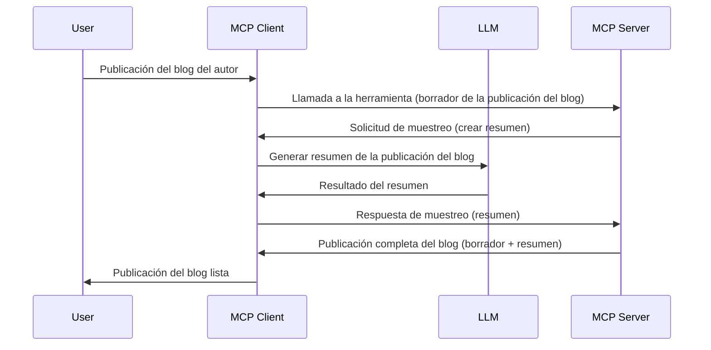

# Sampling - delegar funciones al Cliente

> **Aviso de desaprobación:** el candidato a la especificación MCP `2026-07-28` marca Sampling como obsoleto en favor de la integración directa con las API del proveedor de LLM. Sampling sigue funcionando en `2025-11-25` y al menos un año después de cualquier desaprobación formal, por lo que todo en esta lección sigue siendo válido, pero los nuevos diseños de servidor deben evaluar el patrón de reemplazo. Véase [Qué cambia en MCP: Candidato a Release 2026-07-28](../../01-CoreConcepts/mcp-2026-07-28-release-candidate.md).

A veces, necesitas que el Cliente MCP y el Servidor MCP colaboren para lograr un objetivo común. Podrías tener un caso donde el Servidor necesita la ayuda de un LLM que reside en el cliente. Para esta situación, sampling es lo que debes usar.

Exploremos algunos casos de uso y cómo construir una solución que involucre sampling.

## Visión general

En esta lección, nos centramos en explicar cuándo y dónde usar Sampling y cómo configurarlo.

## Objetivos de aprendizaje

En este capítulo, vamos a:

- Explicar qué es Sampling y cuándo usarlo.
- Mostrar cómo configurar Sampling en MCP.
- Proporcionar ejemplos de Sampling en acción.

## ¿Qué es Sampling y por qué usarlo?

Sampling es una función avanzada que funciona de la siguiente manera:



### Solicitud de Sampling

Bien, ahora que tenemos una visión panorámica de un escenario creíble, hablemos de la solicitud de sampling que el servidor envía de vuelta al cliente. Así podría verse tal solicitud en formato JSON-RPC:

```json
{
  "jsonrpc": "2.0",
  "id": 1,
  "method": "sampling/createMessage",
  "params": {
    "messages": [
      {
        "role": "user",
        "content": {
          "type": "text",
          "text": "Create a blog post summary of the following blog post: <BLOG POST>"
        }
      }
    ],
    "modelPreferences": {
      "hints": [
        {
          "name": "claude-3-sonnet"
        }
      ],
      "intelligencePriority": 0.8,
      "speedPriority": 0.5
    },
    "systemPrompt": "You are a helpful assistant.",
    "maxTokens": 100
  }
}
```

Hay algunas cosas aquí que vale la pena destacar:

- Prompt, bajo content -> text, es nuestro prompt que es una instrucción para que el LLM resuma contenido de una entrada de blog.

- **modelPreferences**. Esta sección es justamente eso, una preferencia, una recomendación de qué configuración usar con el LLM. El usuario puede escoger seguir estas recomendaciones o modificarlas. En este caso hay recomendaciones sobre qué modelo usar y prioridades de velocidad e inteligencia.
- **systemPrompt**, este es tu prompt normal de sistema que le da a tu LLM una personalidad y contiene instrucciones de guía.
- **maxTokens**, esta es otra propiedad que se usa para indicar cuántos tokens se recomiendan usar para esta tarea.

### Respuesta de Sampling

Esta respuesta es lo que el Cliente MCP termina enviando de vuelta al Servidor MCP y es el resultado de que el cliente llama al LLM, espera la respuesta y luego construye este mensaje. Así podría verse en JSON-RPC:

```json
{
  "jsonrpc": "2.0",
  "id": 1,
  "result": {
    "role": "assistant",
    "content": {
      "type": "text",
      "text": "Here's your abstract <ABSTRACT>"
    },
    "model": "gpt-5",
    "stopReason": "endTurn"
  }
}
```

Observa cómo la respuesta es un abstracto del post del blog justo como pedimos. También observa cómo el `model` usado no es el que pedimos sino "gpt-5" en lugar de "claude-3-sonnet". Esto es para ilustrar que el usuario puede cambiar de opinión sobre qué usar y que tu solicitud de sampling es una recomendación.

Bien, ahora que entendemos el flujo principal, y una tarea útil para usarlo "creación de entrada de blog + resumen", veamos qué necesitamos hacer para que funcione.

### Tipos de mensajes

Los mensajes de Sampling no están limitados solo a texto sino que también puedes enviar imágenes y audio. Así es cómo el JSON-RPC se ve diferente:

**Texto**

```json
{
  "type": "text",
  "text": "The message content"
}
```

**Contenido de imagen**

```json
{
  "type": "image",
  "data": "base64-encoded-image-data",
  "mimeType": "image/jpeg"
}
```

**Contenido de audio**

```json
{
  "type": "audio",
  "data": "base64-encoded-audio-data",
  "mimeType": "audio/wav"
}
```

> NOTA: para información más detallada sobre Sampling, consulta la [documentación oficial](https://modelcontextprotocol.io/specification/2025-11-25/client/sampling)

## Cómo configurar Sampling en el Cliente

> Nota: si solo construyes un servidor, no necesitas hacer mucho aquí.

En un cliente, necesitas especificar la siguiente función así:

```json
{
  "capabilities": {
    "sampling": {}
  }
}
```

Esto será detectado cuando tu cliente elegido se inicialice con el servidor.

## Ejemplo de Sampling en acción - Crear una entrada de blog

Programemos un servidor sampling juntos, necesitaremos hacer lo siguiente:

1. Crear una herramienta en el Servidor.
1. Dicha herramienta debe crear una solicitud de sampling
1. La herramienta debe esperar a que se responda la solicitud de sampling del cliente.
1. Entonces debe producir el resultado de la herramienta.

Veamos el código paso a paso:

### -1- Crear la herramienta

**python**

```python
@mcp.tool()
async def create_blog(title: str, content: str, ctx: Context[ServerSession, None]) -> str:
    """Create a blog post and generate a summary"""

```

### -2- Crear una solicitud de sampling

Extiende tu herramienta con el siguiente código:

**python**

```python
post = BlogPost(
        id=len(posts) + 1,
        title=title,
        content=content,
        abstract=""
    )

prompt = f"Create an abstract of the following blog post: title: {title} and draft: {content} "

result = await ctx.session.create_message(
        messages=[
            SamplingMessage(
                role="user",
                content=TextContent(type="text", text=prompt),
            )
        ],
        max_tokens=100,
)

```

### -3- Esperar la respuesta y devolver la respuesta

**python**

```python
post.abstract = result.content.text

posts.append(post)

# devolver el producto completo
return json.dumps({
    "id": post.title,
    "abstract": post.abstract
})
```

### -4- Código completo

**python**

```python
from starlette.applications import Starlette
from starlette.routing import Mount, Host

from mcp.server.fastmcp import Context, FastMCP

from mcp.server.session import ServerSession
from mcp.types import SamplingMessage, TextContent

import json


from uuid import uuid4
from typing import List
from pydantic import BaseModel


mcp = FastMCP("Blog post generator")

# app = FastAPI()

posts = []

class BlogPost(BaseModel):
    id: int
    title: str
    content: str
    abstract: str

posts: List[BlogPost] = []

@mcp.tool()
async def create_blog(title: str, content: str, ctx: Context[ServerSession, None]) -> str:
    """Create a blog post and generate a summary"""

    post = BlogPost(
        id=len(posts) + 1,
        title=title,
        content=content,
        abstract=""
    )

    prompt = f"Create an abstract of the following blog post: title: {title} and draft: {content} "

    result = await ctx.session.create_message(
        messages=[
            SamplingMessage(
                role="user",
                content=TextContent(type="text", text=prompt),
            )
        ],
        max_tokens=100,
    )

    post.abstract = result.content.text

    posts.append(post)

    # devuelve la entrada completa del blog
    return json.dumps({
        "id": post.title,
        "abstract": post.abstract
    })

if __name__ == "__main__":
    print("Starting server...")
    # mcp.run()
    mcp.run(transport="streamable-http")

# ejecutar la aplicación con: python server.py
```

### -5- Probarlo en Visual Studio Code

Para probar esto en Visual Studio Code, haz lo siguiente:

1. Inicia el servidor en la terminal
1. Agrégalo a *mcp.json* (y asegúrate de que esté iniciado) algo como esto:

   ```json
   "servers": {
      "blog-server": {
        "type": "http",
        "url": "http://localhost:8000/mcp"
      }
   }
   ```

1. Escribe un prompt:

   ```text
   create a blog post named "Where Python comes from", the content is "Python is actually named after Monty Python Flying Circus"
   ```

1. Permite que ocurra el sampling. La primera vez que pruebas esto se te presentará un diálogo adicional que deberás aceptar, luego verás el diálogo normal para solicitar que ejecutes una herramienta

1. Inspecciona los resultados. Verás los resultados tanto renderizados adecuadamente en GitHub Copilot Chat como también podrás inspeccionar la respuesta JSON cruda.

**Bonus**. Las herramientas de Visual Studio Code tienen un gran soporte para sampling. Puedes configurar el acceso a Sampling en tu servidor instalado navegando así:

1. Navega a la sección de extensiones.
1. Selecciona el icono de engranaje para tu servidor instalado en la sección "MCP SERVERS - INSTALLED".
1 Selecciona "Configurar acceso a modelos", aquí puedes seleccionar qué Modelos puede usar GitHub Copilot cuando realiza sampling. También puedes ver todas las solicitudes de sampling recientes seleccionando "Mostrar solicitudes de Sampling".

## Tarea

En esta tarea, construirás un Sampling ligeramente diferente, concretamente una integración de sampling que soporte generar una descripción de producto. Este es tu escenario:

**Escenario**: el trabajador del back office en un e-commerce necesita ayuda, le toma demasiado tiempo generar descripciones de producto. Por ello, debes construir una solución en la que puedas llamar a una herramienta "create_product" con "title" y "keywords" como argumentos y que debe producir un producto completo incluyendo un campo "description" que debe ser poblado por un LLM del cliente.

CONSEJO: usa lo que aprendiste antes para construir este servidor y su herramienta usando una solicitud de sampling.

## Solución

[Solución](./solution/README.md)

## Puntos clave

Sampling es una función poderosa que permite al servidor delegar tareas al cliente cuando necesita la ayuda de un LLM.

## Qué sigue

- [Capítulo 4 - Implementación práctica](../../04-PracticalImplementation/README.md)

---

<!-- CO-OP TRANSLATOR DISCLAIMER START -->
**Descargo de responsabilidad**:
Este documento ha sido traducido utilizando el servicio de traducción automática [Co-op Translator](https://github.com/Azure/co-op-translator). Aunque nos esforzamos por la precisión, tenga en cuenta que las traducciones automatizadas pueden contener errores o inexactitudes. El documento original en su idioma nativo debe considerarse la fuente autorizada. Para información crítica, se recomienda una traducción profesional humana. No somos responsables de cualquier malentendido o interpretación errónea que surja del uso de esta traducción.
<!-- CO-OP TRANSLATOR DISCLAIMER END -->