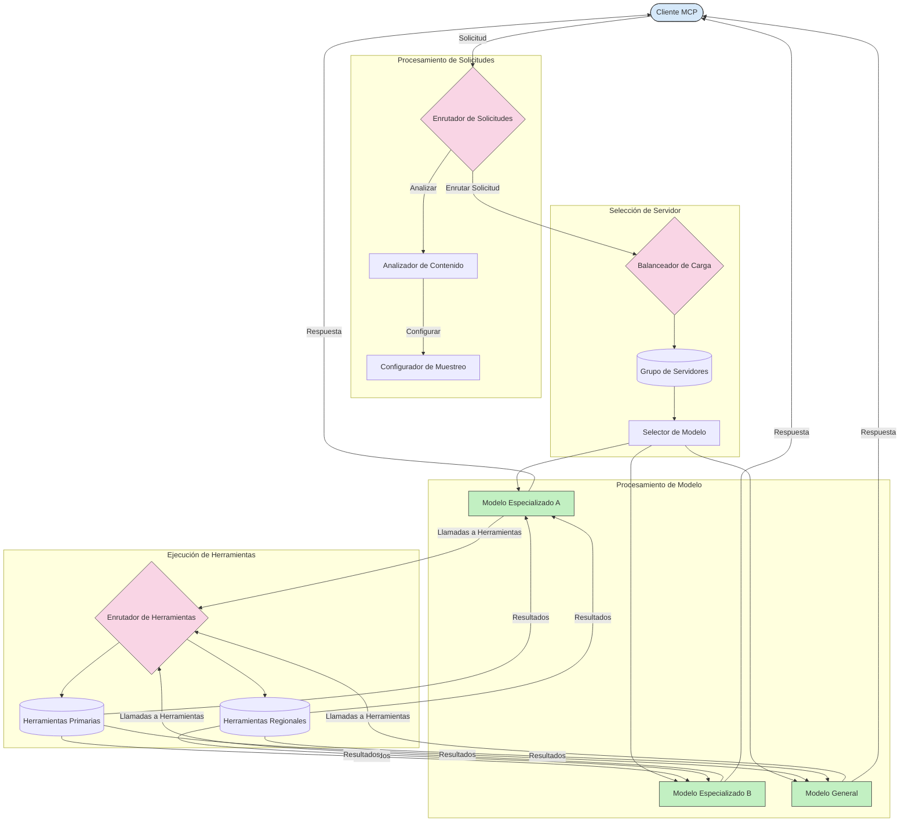

# Enrutamiento en el Protocolo de Contexto del Modelo

El enrutamiento es esencial para dirigir las solicitudes a los modelos, herramientas o servicios apropiados dentro de un ecosistema MCP.

## Introducción

El enrutamiento en el Protocolo de Contexto del Modelo (MCP) implica dirigir las solicitudes a los modelos o servicios más adecuados según varios criterios como el tipo de contenido, el contexto del usuario y la carga del sistema. Esto garantiza un procesamiento eficiente y una utilización óptima de los recursos.

## Objetivos de aprendizaje

Al final de esta lección, podrás:

- Entender los principios del enrutamiento en MCP.
- Implementar enrutamiento basado en contenido para dirigir solicitudes a servicios especializados.
- Aplicar estrategias inteligentes de balanceo de carga para optimizar la utilización de recursos.
- Implementar enrutamiento dinámico de herramientas basado en el contexto de la solicitud.

## Enrutamiento basado en contenido

El enrutamiento basado en contenido dirige las solicitudes a servicios especializados según el contenido de la solicitud. Por ejemplo, las solicitudes relacionadas con la generación de código pueden ser enviadas a un modelo especializado en código, mientras que las solicitudes de escritura creativa pueden enviarse a un modelo de escritura creativa.

Veamos un ejemplo de implementación en diferentes lenguajes de programación.

<details>
<summary>.NET</summary>

```csharp
// .NET Example: Content-based routing in MCP
public class ContentBasedRouter
{
    private readonly Dictionary<string, McpClient> _specializedClients;
    private readonly RoutingClassifier _classifier;
    
    public ContentBasedRouter()
    {
        // Initialize specialized clients for different domains
        _specializedClients = new Dictionary<string, McpClient>
        {
            ["code"] = new McpClient("https://code-specialized-mcp.com"),
            ["creative"] = new McpClient("https://creative-specialized-mcp.com"),
            ["scientific"] = new McpClient("https://scientific-specialized-mcp.com"),
            ["general"] = new McpClient("https://general-mcp.com")
        };
        
        // Initialize content classifier
        _classifier = new RoutingClassifier();
    }
    
    public async Task<McpResponse> RouteAndProcessAsync(string prompt, IDictionary<string, object> parameters = null)
    {
        // Classify the prompt to determine the best specialized service
        string category = await _classifier.ClassifyPromptAsync(prompt);
        
        // Get the appropriate client or fall back to general
        var client = _specializedClients.ContainsKey(category) 
            ? _specializedClients[category] 
            : _specializedClients["general"];
            
        Console.WriteLine($"Routing request to {category} specialized service");
        
        // Send request to the selected service
        return await client.SendPromptAsync(prompt, parameters);
    }
    
    // Simple classifier for routing decisions
    private class RoutingClassifier
    {
        public Task<string> ClassifyPromptAsync(string prompt)
        {
            prompt = prompt.ToLowerInvariant();
            
            if (prompt.Contains("code") || prompt.Contains("function") || 
                prompt.Contains("program") || prompt.Contains("algorithm"))
            {
                return Task.FromResult("code");
            }
            
            if (prompt.Contains("story") || prompt.Contains("creative") || 
                prompt.Contains("imagine") || prompt.Contains("design"))
            {
                return Task.FromResult("creative");
            }
            
            if (prompt.Contains("science") || prompt.Contains("research") || 
                prompt.Contains("analyze") || prompt.Contains("study"))
            {
                return Task.FromResult("scientific");
            }
            
            return Task.FromResult("general");
        }
    }
}
```

En el código anterior, hemos:

- Creado una clase `ContentBasedRouter` que enruta las solicitudes según el contenido del prompt.
- Inicializado clientes especializados para diferentes dominios (código, creativo, científico, general).
- Implementado un clasificador simple que determina la categoría del prompt y lo enruta al servicio especializado adecuado.
- Utilizado un mecanismo de respaldo para enrutar solicitudes a un servicio general si no hay servicio especializado disponible.
- Implementado procesamiento asíncrono para manejar las solicitudes de manera eficiente.
- Usado un diccionario para mapear categorías de contenido a clientes especializados MCP.
- Implementado un clasificador simple que analiza el prompt y devuelve la categoría apropiada.
- Usado el cliente especializado para enviar la solicitud y recibir una respuesta.
- Manejado casos donde el prompt no corresponde a ninguna categoría especializada enroutando a un servicio general.

</details>

## Balanceo de carga inteligente

El balanceo de carga optimiza la utilización de recursos y garantiza alta disponibilidad para los servicios MCP. Hay diferentes maneras de implementar balanceo de carga, como round-robin, tiempo de respuesta ponderado o estrategias conscientes del contenido.

Veamos a continuación un ejemplo de implementación que utiliza las siguientes estrategias:

- **Round Robin**: Distribuye las solicitudes de manera uniforme entre los servidores disponibles.
- **Tiempo de Respuesta Ponderado**: Enruta las solicitudes a los servidores según su tiempo promedio de respuesta.
- **Consciente del Contenido**: Enruta las solicitudes a servidores especializados basados en el contenido de la solicitud.

<details>
<summary>Java</summary>

```java
// Ejemplo en Java: Balanceo de carga inteligente para servidores MCP
public class McpLoadBalancer {
    private final List<McpServerNode> serverNodes;
    private final LoadBalancingStrategy strategy;
    
    public McpLoadBalancer(List<McpServerNode> nodes, LoadBalancingStrategy strategy) {
        this.serverNodes = new ArrayList<>(nodes);
        this.strategy = strategy;
    }
    
    public McpResponse processRequest(McpRequest request) {
        // Seleccionar el mejor servidor según la estrategia
        McpServerNode selectedNode = strategy.selectNode(serverNodes, request);
        
        try {
            // Enrutar la solicitud al nodo seleccionado
            return selectedNode.processRequest(request);
        } catch (Exception e) {
            // Manejar fallos - implementar lógica de reintento o reserva
            System.err.println("Error processing request on node " + selectedNode.getId() + ": " + e.getMessage());
            
            // Marcar el nodo como potencialmente no saludable
            selectedNode.recordFailure();
            
            // Probar el siguiente mejor nodo como reserva
            List<McpServerNode> remainingNodes = new ArrayList<>(serverNodes);
            remainingNodes.remove(selectedNode);
            
            if (!remainingNodes.isEmpty()) {
                McpServerNode fallbackNode = strategy.selectNode(remainingNodes, request);
                return fallbackNode.processRequest(request);
            } else {
                throw new RuntimeException("All MCP server nodes failed to process the request");
            }
        }
    }
    
    // Tarea de verificación de salud del nodo
    public void startHealthChecks(Duration interval) {
        ScheduledExecutorService scheduler = Executors.newScheduledThreadPool(1);
        scheduler.scheduleAtFixedRate(() -> {
            for (McpServerNode node : serverNodes) {
                try {
                    boolean isHealthy = node.checkHealth();
                    System.out.println("Node " + node.getId() + " health status: " + 
                                      (isHealthy ? "HEALTHY" : "UNHEALTHY"));
                } catch (Exception e) {
                    System.err.println("Health check failed for node " + node.getId());
                    node.setHealthy(false);
                }
            }
        }, 0, interval.toMillis(), TimeUnit.MILLISECONDS);
    }
    
    // Interfaz para estrategias de balanceo de carga
    public interface LoadBalancingStrategy {
        McpServerNode selectNode(List<McpServerNode> nodes, McpRequest request);
    }
    
    // Estrategia round-robin
    public static class RoundRobinStrategy implements LoadBalancingStrategy {
        private AtomicInteger counter = new AtomicInteger(0);
        
        @Override
        public McpServerNode selectNode(List<McpServerNode> nodes, McpRequest request) {
            List<McpServerNode> healthyNodes = nodes.stream()
                .filter(McpServerNode::isHealthy)
                .collect(Collectors.toList());
            
            if (healthyNodes.isEmpty()) {
                throw new RuntimeException("No healthy nodes available");
            }
            
            int index = counter.getAndIncrement() % healthyNodes.size();
            return healthyNodes.get(index);
        }
    }
    
    // Estrategia basada en tiempo de respuesta ponderado
    public static class ResponseTimeStrategy implements LoadBalancingStrategy {
        @Override
        public McpServerNode selectNode(List<McpServerNode> nodes, McpRequest request) {
            return nodes.stream()
                .filter(McpServerNode::isHealthy)
                .min(Comparator.comparing(McpServerNode::getAverageResponseTime))
                .orElseThrow(() -> new RuntimeException("No healthy nodes available"));
        }
    }
    
    // Estrategia consciente del contenido
    public static class ContentAwareStrategy implements LoadBalancingStrategy {
        @Override
        public McpServerNode selectNode(List<McpServerNode> nodes, McpRequest request) {
            // Determinar características de la solicitud
            boolean isCodeRequest = request.getPrompt().contains("code") || 
                                   request.getAllowedTools().contains("codeInterpreter");
            
            boolean isCreativeRequest = request.getPrompt().contains("creative") || 
                                       request.getPrompt().contains("story");
            
            // Encontrar nodos especializados
            Optional<McpServerNode> specializedNode = nodes.stream()
                .filter(McpServerNode::isHealthy)
                .filter(node -> {
                    if (isCodeRequest && node.getSpecialization().equals("code")) {
                        return true;
                    }
                    if (isCreativeRequest && node.getSpecialization().equals("creative")) {
                        return true;
                    }
                    return false;
                })
                .findFirst();
            
            // Retornar nodo especializado o nodo con menor carga
            return specializedNode.orElse(
                nodes.stream()
                    .filter(McpServerNode::isHealthy)
                    .min(Comparator.comparing(McpServerNode::getCurrentLoad))
                    .orElseThrow(() -> new RuntimeException("No healthy nodes available"))
            );
        }
    }
}
```

En el código anterior, hemos:

- Creado una clase `McpLoadBalancer` que maneja una lista de nodos de servidores MCP y enruta las solicitudes según la estrategia de balanceo de carga seleccionada.
- Implementado diferentes estrategias de balanceo de carga: `RoundRobinStrategy`, `ResponseTimeStrategy` y `ContentAwareStrategy`.
- Usado un `ScheduledExecutorService` para revisar periódicamente la salud de los nodos del servidor.
- Implementado un mecanismo de chequeo de salud que marca los nodos como saludables o no saludables según su respuesta a las pruebas.
- Manejado el procesamiento de solicitudes con manejo de errores y lógica de respaldo para garantizar alta disponibilidad.
- Usado una clase `McpServerNode` para representar nodos individuales del servidor MCP, incluyendo su estado de salud, tiempo promedio de respuesta y carga actual.
- Implementado una clase `McpRequest` para encapsular detalles de la solicitud como el prompt y las herramientas permitidas.
- Usado Java Streams para filtrar y seleccionar nodos según su estado de salud y especialización.

</details>

## Enrutamiento dinámico de herramientas

El enrutamiento de herramientas asegura que las llamadas a herramientas se dirijan al servicio más apropiado según el contexto. Por ejemplo, una llamada a una herramienta de clima puede necesitar ser dirigida a un punto regional según la ubicación del usuario, o una calculadora puede necesitar usar una versión específica de la API.

Veamos un ejemplo de implementación que demuestra enrutamiento dinámico de herramientas basado en análisis de solicitudes, puntos regionales y soporte de versiones.

<details>
<summary>Python</summary>

```python
# Ejemplo en Python: Enrutamiento dinámico de herramientas basado en el análisis de la solicitud
class McpToolRouter:
    def __init__(self):
        # Registrar los puntos finales disponibles de la herramienta
        self.tool_endpoints = {
            "weatherTool": "https://weather-service.example.com/api",
            "calculatorTool": "https://calculator-service.example.com/compute",
            "databaseTool": "https://database-service.example.com/query",
            "searchTool": "https://search-service.example.com/search"
        }
        
        # Puntos finales regionales para distribución global
        self.regional_endpoints = {
            "us": {
                "weatherTool": "https://us-west.weather-service.example.com/api",
                "searchTool": "https://us.search-service.example.com/search"
            },
            "europe": {
                "weatherTool": "https://eu.weather-service.example.com/api",
                "searchTool": "https://eu.search-service.example.com/search"
            },
            "asia": {
                "weatherTool": "https://asia.weather-service.example.com/api",
                "searchTool": "https://asia.search-service.example.com/search"
            }
        }
        
        # Soporte para versionado de herramientas
        self.tool_versions = {
            "weatherTool": {
                "default": "v2",
                "v1": "https://weather-service.example.com/api/v1",
                "v2": "https://weather-service.example.com/api/v2",
                "beta": "https://weather-service.example.com/api/beta"
            }
        }
    
    async def route_tool_request(self, tool_name, parameters, user_context=None):
        """Route a tool request to the appropriate endpoint based on context"""
        endpoint = self._select_endpoint(tool_name, parameters, user_context)
        
        if not endpoint:
            raise ValueError(f"No endpoint available for tool: {tool_name}")
        
        # Realizar la solicitud real al punto final seleccionado
        return await self._execute_tool_request(endpoint, tool_name, parameters)
    
    def _select_endpoint(self, tool_name, parameters, user_context=None):
        """Select the most appropriate endpoint based on context"""
        # Punto final base del registro
        if tool_name not in self.tool_endpoints:
            return None
            
        base_endpoint = self.tool_endpoints[tool_name]
        
        # Verificar si necesitamos usar una versión específica de la herramienta
        if tool_name in self.tool_versions:
            version_info = self.tool_versions[tool_name]
            
            # Usar la versión especificada o la predeterminada
            requested_version = parameters.get("_version", version_info["default"])
            if requested_version in version_info:
                base_endpoint = version_info[requested_version]
        
        # Verificar el enrutamiento regional si se conoce la región del usuario
        if user_context and "region" in user_context:
            user_region = user_context["region"]
            
            if user_region in self.regional_endpoints:
                regional_tools = self.regional_endpoints[user_region]
                
                if tool_name in regional_tools:
                    # Usar punto final específico de la región
                    return regional_tools[tool_name]
        
        # Verificar los requisitos de residencia de datos
        if user_context and "data_residency" in user_context:
            # Esto implementaría la lógica para asegurar que los datos permanezcan en la jurisdicción especificada
            pass
        
        # Verificar el enrutamiento basado en latencia
        if user_context and "latency_sensitive" in user_context and user_context["latency_sensitive"]:
            # Esto implementaría la lógica para seleccionar el punto final con menor latencia
            pass
            
        return base_endpoint
        
    async def _execute_tool_request(self, endpoint, tool_name, parameters):
        """Execute the actual tool request to the selected endpoint"""
        try:
            async with aiohttp.ClientSession() as session:
                async with session.post(
                    endpoint,
                    json={"toolName": tool_name, "parameters": parameters},
                    headers={"Content-Type": "application/json"}
                ) as response:
                    if response.status == 200:
                        result = await response.json()
                        return result
                    else:
                        error_text = await response.text()
                        raise Exception(f"Tool execution failed: {error_text}")
        except Exception as e:
            # Implementar lógica de reintento o estrategia de respaldo
            print(f"Error executing tool {tool_name} at {endpoint}: {str(e)}")
            raise
```

En el código anterior, hemos:

- Creado una clase `McpToolRouter` que gestiona el enrutamiento de herramientas basado en análisis de solicitudes, puntos regionales y soporte de versiones.
- Registrado puntos finales disponibles para herramientas y puntos regionales para distribución global.
- Implementado lógica de enrutamiento dinámica que selecciona el punto final apropiado basado en el contexto del usuario, como región y requisitos de residencia de datos.
- Implementado soporte de versiones para herramientas, permitiendo a los usuarios especificar qué versión de una herramienta desean usar.
- Usado solicitudes HTTP asincrónicas para ejecutar llamadas a herramientas y manejar respuestas.

</details>

## Muestreo y arquitectura de enrutamiento en MCP

El muestreo es un componente crítico del Protocolo de Contexto del Modelo (MCP) que permite un procesamiento eficiente de solicitudes y enrutamiento. Involucra analizar las solicitudes entrantes para determinar el modelo o servicio más apropiado para manejarlas, basándose en varios criterios como tipo de contenido, contexto del usuario y carga del sistema.

El muestreo y el enrutamiento pueden combinarse para crear una arquitectura robusta que optimice la utilización de recursos y garantice alta disponibilidad. El proceso de muestreo puede usarse para clasificar solicitudes, mientras que el enrutamiento las dirige a los modelos o servicios adecuados.

El diagrama a continuación ilustra cómo el muestreo y el enrutamiento trabajan juntos en una arquitectura integral de MCP:



## Qué sigue

- [5.6 Muestreo](../mcp-sampling/README.md)

---

<!-- CO-OP TRANSLATOR DISCLAIMER START -->
**Descargo de responsabilidad**:
Este documento ha sido traducido utilizando el servicio de traducción automática [Co-op Translator](https://github.com/Azure/co-op-translator). Aunque nos esforzamos por la precisión, tenga en cuenta que las traducciones automatizadas pueden contener errores o inexactitudes. El documento original en su idioma nativo debe considerarse la fuente autorizada. Para información crítica, se recomienda una traducción profesional humana. No somos responsables de cualquier malentendido o interpretación errónea que surja del uso de esta traducción.
<!-- CO-OP TRANSLATOR DISCLAIMER END -->