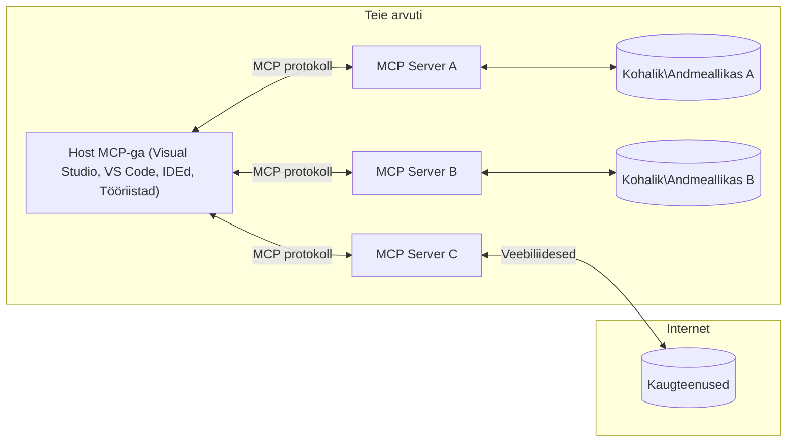

# MCP põhimõisted: Model Context Protocol'i valdamine tehisintellekti integreerimiseks

[](https://youtu.be/earDzWGtE84)

_(Selle õppetunni video vaatamiseks klõpsake ülaloleval pildil)_

[Model Context Protocol (MCP)](https://github.com/modelcontextprotocol) on võimas ja standardiseeritud raamistik, mis optimeerib suhtlust Suurte Keelemudelite (LLM-ide) ning väliste tööriistade, rakenduste ja andmeallikate vahel. 
See juhend viib teid MCP põhimõistete juurde. Õpite selle kliendi-serveri arhitektuuri, oluliste komponentide, suhtlusmehhanismi ja parimate rakenduspraktikate kohta.

- **Kasutaja selge nõusolek**: Kõik andmetele ligipääs ja toimingud nõuavad enne täitmist kasutaja selget heakskiitu. Kasutajad peavad selgelt mõistma, milliseid andmeid päästakse ja milliseid toiminguid tehakse, võimaldades detailset kontrolli õiguste ja volituste üle.

- **Andmete privaatsuskaitse**: Kasutaja andmeid eksponeeritakse ainult selge nõusoleku alusel ning neid tuleb kogu suhtluse elutsükli vältel kaitsta kindlate ligipääsukontrollidega. Rakendused peavad takistama volitamata andmeedastust ning hoida ranget privaatsuse piiri.

- **Tööriistade täitmise turvalisus**: Iga tööriista käivitamine vajab selget kasutaja nõusolekut, kus kasutatakse tööriista funktsionaalsuse, parameetrite ja võimaliku mõju selgitamist. Kindlad turvapiirid peavad vältima ettenähtud kasutuseta, ohtlikke või pahatahtlikke käivitusi.

- **Transporditaseme turvalisus**: Kõik kommunikatsioonikanalid peaksid kasutama sobivaid krüpteerimis- ja autentimismehhanisme. Kaugühendused peaksid rakendama turvalisi transpordiprotokolle ja korrektset mandaadi haldust.

#### Rakendamise juhised:

- **Õiguste haldamine**: Rakendage peenhäälestatud õiguste süsteeme, mis võimaldavad kasutajatel määrata, millised serverid, tööriistad ja ressursid on kättesaadavad
- **Autentimine ja autoriseerimine**: Kasutage turvalisi autentimismeetodeid (OAuth, API-võtmed) koos korraliku tokeni halduse ja aegumisega  
- **Sisendite valideerimine**: Kontrollige kõiki parameetreid ja sisendeid määratletud skeemide järgi, et vältida süstimisrünnakuid
- **Auditilogid**: Hoiustage kõigi toimingute täielikke logisid turvaseire ja vastavuse tagamiseks

## Ülevaade

Selles õppetunnis uuritakse põhilist arhitektuuri ja komponente, mis moodustavad Model Context Protocoli (MCP) ökosüsteemi. Õpite tundma kliendi-serveri arhitektuuri, põhikomponente ja suhtlusmehhanisme, mis toetavad MCP-l põhinevaid interaktsioone.

## Peamised õpieesmärgid

Selle õppetunni lõpuks:

- Mõistate MCP kliendi-serveri arhitektuuri.
- Tuletate meelde Hostide, Kliendi ja Serverite rolle ja vastutusi.
- Analüüsite põhifunktsioone, mis teevad MCP-st paindliku integreerimiskihi.
- Õpite, kuidas info MCP ökosüsteemis voolab.
- Saate praktilisi teadmisi näidiskoodide kaudu .NET, Java, Python ja JavaScripti keeltes.

## MCP arhitektuur: Sügavamat pilku

MCP ökosüsteem baseerub kliendi-serveri mudelil. See moodulpõhine ülesehitus võimaldab AI rakendustel tõhusalt suhelda tööriistade, andmebaaside, API-de ja kontekstuaalsete ressurssidega. Vaatame selle arhitektuuri põhikomponentide kaupa.

MCP põhineb kliendi-serveri arhitektuuril, kus hostrakendus saab ühendada mitme serveriga:



- **MCP Hosts (hostid)**: Programmid nagu VSCode, Claude Desktop, IDEd või AI tööriistad, mis soovivad andmetele MCP kaudu ligi pääseda
- **MCP Clients (kliendid)**: Protokolli kliendid, kes hoiavad 1:1 ühendust serveritega
- **MCP Servers (serverid)**: Kerged programmid, mis igal üksikul pakuvad konkreetseid funktsioone läbi Model Context Protocolli standardi
- **Kohalikud andmeallikad**: Teie arvuti failid, andmebaasid ja teenused, millele MCP serverid saavad turvaliselt ligi pääseda
- **Kaugteenused**: Välised süsteemid internetis, millele MCP serverid saavad API-de kaudu ühendust luua.

MCP protokoll on arenev standard, kasutades kuupõhist versioonihaldust (formaat YYYY-MM-DD). Praegune protokolli versioon on **2025-11-25**. Viimased muudatused leiate [protokolli spetsifikatsiooni](https://modelcontextprotocol.io/specification/2025-11-25/) lehelt.

> **Tulevikku vaadates:** järgmise spetsifikatsiooni versiooni **2026-07-28** versiooni vabaväljaanne teatati 2026. aasta mais ning see on planeeritud välja tulema 28. juulil 2026. See teeb protokolli transporditaseme olekuta (eemaldades `initialize` käepigistuse ja sessiooni ID-d), formaliseerib laienduste raamistiku ning deprekeerib Roots, Sampling ja Logging kasutades selle asemel uuemaid mustreid. Täieliku ülevaate leiate [MCP muudatustest: 2026-07-28 vabaväljaanne](./mcp-2026-07-28-release-candidate.md).

### 1. Hostid

Model Context Protocol'is (MCP) on **hostid** AI rakendused, mis toimivad peamise liidesena, mille kaudu kasutajad protokolliga suhtlevad. Hostid koordineerivad ja haldavad ühendusi mitmete MCP serveritega luues iga serveri ühenduse jaoks pühendatud MCP kliendid. Näited hostidest:

- **AI rakendused**: Claude Desktop, Visual Studio Code, Claude Code
- **Arendus keskkonnad**: IDEd ja koodiredaktorid MCP integratsiooniga  
- **Kohandatud rakendused**: Eesmärgipõhised AI agendid ja tööriistad

**Hostid** on rakendused, mis koordineerivad AI mudelitega suhtlemist. Nad:

- **Orkestreerivad AI mudeleid**: Käivitavad või suhtlevad LLM-ide kaudu, et genereerida vastuseid ja korraldada AI töövooge
- **Halda kliendiühendusi**: Loovad ja hoiavad ühe MCP kliendi igale MCP serveriga ühendusele
- **Juhivad kasutajaliidest**: Käsitlevad vestluse voogu, kasutajate suhtlusi ja vastuste kuvamist  
- **Tagavad turvalisuse**: Juhtivad lubasid, turvapiiranguid ja autentimist
- **Haldavad kasutajaluba**: Juhtivad kasutaja nõusolekut andmete jagamiseks ja tööriistade täitmiseks


### 2. Kliendid

**Kliendid** on olulised komponendid, mis hoiavad pühendatud ühe-ühe vastu ühendusi Hostide ja MCP serverite vahel. Iga MCP klient luuakse Host'i poolt, et ühendada konkreetse MCP serveriga, tagades organiseeritud ja turvalise suhtluskanali. Mitme kliendi olemasolu võimaldab Hostidel samaaegselt ühenduda mitme serveriga.

**Kliendid** on ühenduskomponendid hostrakenduse sees. Nad:

- **Protokolli suhtlus**: Saadavad JSON-RPC 2.0 päringuid serveritele koos promptide ja juhistega
- **Võimekuse läbirääkimine**: Läbiräägivad toetatud funktsioone ja protokolli versioone serveritega initsialiseerimisel
- **Tööriistade käivitamine**: Halda mudelitelt tööriistade käivitamisettekandeid ja töötle vastuseid
- **Reaalajas uuendused**: Töötlevad serverite teavitusi ja reaalajas uuendusi
- **Vastuste töötlemine**: Töötlevad ja vormindavad serveri vastuseid kasutajale kuvamiseks

### 3. Serverid

**Serverid** on programmid, mis annavad MCP klientidele konteksti, tööriistu ja funktsionaalsust. Nad võivad töötada lokaalselt (samal arvutil kui host) või kaugelt (välimistel platvormidel), ning vastutavad kliendi päringute töötlemise ja struktureeritud vastuste pakkumise eest. Serverid eksponeerivad konkreetset funktsionaalsust standardiseeritud Model Context Protocolli kaudu.

**Serverid** on teenused, mis pakuvad konteksti ja võimekust. Nad:

- **Funktsioonide registreerimine**: Registreerivad ja eksponeerivad klientidele saadaolevaid primitiive (ressursse, prompt’e, tööriistu)
- **Päringute töötlemine**: Võtavad vastu ja käivitavad tööriistakutseid, ressursi- ja prompti päringuid klientidelt
- **Konteksti pakkumine**: Annavad kontekstuaalset infot ja andmeid mudeli vastuste rikastamiseks
- **Oleku haldus**: Hoiavad sessiooni olekut ja haldavad vajadusel oleku põhiseid interaktsioone
- **Reaalajas teavitused**: Saadavad teavitusi võimekuse muutustest ja uuendustest ühendatud klientidele

Serverid võivad olla arendatud ükskõik kellegi poolt, et laiendada mudelite võimekust spetsialiseeritud toimingutega ning toetavad nii lokaalseid kui ka kaugjuurutuse stsenaariume.

### 4. Serveri primitiivid

Model Context Protocolli (MCP) serverid pakuvad kolme põhikomponenti ehk **primitiivi**, mis määratlevad rikkalike interaktsioonide ehituskivid klientide, hostide ja keelemudelite vahel. Need primitiivid määratlevad protokolli kaudu kättesaadava kontekstuaalse info ja toimingutüüpe.

MCP serverid võivad pakkuda ükskõik millist järgmistest põhilistest primitiividest:

#### Ressursid

**Ressursid** on andmeallikad, mis annavad tehisintellekti rakendustele kontekstuaalset infot. Need esindavad staatilist või dünaamilist sisu, mis võib parandada mudeli mõistmist ja otsuste tegemist:

- **Kontekstuaalsed andmed**: Struktureeritud info ja kontekst AI mudeli tarbeks
- **Teadmusbaasid**: Dokumentide arhiivid, artiklid, juhendid ja teadustööd
- **Kohalikud andmeallikad**: Failid, andmebaasid ja lokaalsüsteemi info  
- **Välised andmed**: API vastused, veebiteenused ja kaugelt pärit süsteemi info
- **Dünaamiline sisu**: Reaalajas andmed, mis muutuvad väliste tingimuste põhjal

Ressursid identifitseeritakse URI-dega ning toetavad avastamist `resources/list` ja pärimist `resources/read` meetodite kaudu:

```text
file://documents/project-spec.md
database://production/users/schema
api://weather/current
```

#### Prompt’id

**Prompt’id** on korduvkasutatavad mallid, mis aitavad keelemudelitega suhtlust struktureerida. Need pakuvad standardiseeritud suhtlusmustreid ja mallipõhiseid töövooge:

- **Mallipõhised suhtlused**: Eelstruktureeritud sõnumid ja vestluse algatamised
- **Töövoogude mallid**: Standardiseeritud jadad korduvateks ülesanneteks ja suhtlusteks
- **Näidispõhised mallid**: Näidispõhised juhised mudelile
- **Süsteemi prompt’id**: Põhiprompt’id, mis määratlevad mudeli käitumist ja konteksti
- **Dünaamilised mallid**: Parameetriseeritud prompt’id, mis kohanevad konkreetse kontekstiga

Prompt’id toetavad muutujate asendamist ning neid saab leida `prompts/list` ja pärida `prompts/get` kaudu:

```markdown
Generate a {{task_type}} for {{product}} targeting {{audience}} with the following requirements: {{requirements}}
```

#### Tööriistad

**Tööriistad** on täidetavad funktsioonid, mida tehisintellekti mudelid saavad käivitada konkreetsete toimingute tegemiseks. Need esindavad MCP ökosüsteemi "teisendeid", võimaldades mudelitel suhelda välissüsteemidega:

- **Täidetavad funktsioonid**: Diskreetsed operatsioonid, mida mudelid saavad konkreetsete parameetritega käivitada
- **Välissüsteemide integratsioon**: API kõned, andmebaasi päringud, failioperatsioonid, arvutused
- **Unikaalne identiteet**: Igal tööriistal on eriline nimi, kirjeldus ja parameetrite skeem
- **Struktureeritud sisend/väljund**: Tööriistad aktsepteerivad valideeritud parameetreid ning tagastavad struktureeritud, tüübitud vastuseid
- **Toimingute võimekus**: Võimaldab mudelitel teha reaalseid toiminguid ja pärida reaalajas andmeid

Tööriistu määratletakse JSON Skeemiga parameetrite valideerimiseks ning neid leitakse `tools/list` ja käivitatakse `tools/call` meetodite kaudu. Tööriistad võivad sisaldada ka **ikoonidena** täiendavat metaandmestikku parema kasutajaliidese esituse jaoks.

**Tööriistade annotatsioonid**: Tööriistad toetavad käitumuslikke annotatsioone (nt `readOnlyHint`, `destructiveHint`), mis kirjeldavad, kas tööriist on ainult lugemiseks või destruktiivne, aidates klientidel teha teadlikke otsuseid tööriista käivitamiseks.

Näide tööriista definitsioonist:

```typescript
server.tool(
  "search_products", 
  {
    query: z.string().describe("Search query for products"),
    category: z.string().optional().describe("Product category filter"),
    max_results: z.number().default(10).describe("Maximum results to return")
  }, 
  async (params) => {
    // Tee otsing ja tagasta struktureeritud tulemused
    return await productService.search(params);
  }
);
```

## Kliendi primitiivid

Model Context Protocolli (MCP) puhul võivad **kliendid** eksponeerida primitiive, mis võimaldavad serveritel taotleda hostrakenduselt täiendavaid funktsionaalsusi. Need kliendipoolsed primitiivid võimaldavad rikkalikke ja interaktiivseid serveri rakendusi, mis pääsevad ligi AI mudelite võimekusele ja kasutajate interaktsioonidele.

### Valimine

> **Allakäigu teade:** `2026-07-28` vabaväljaanne märgib Valimise (Sampling) deprecated'iks AI mudelite otsepöördumisega läbi LLM pakkujate API-de. See jätkab tööd versioonis `2025-11-25` ja vähemalt aasta pärast allakäiku, kuid uued lahendused peaksid eelistama asendavat mustrit. Vaata [MCP muudatused: 2026-07-28 vabaväljaanne](./mcp-2026-07-28-release-candidate.md).

**Valimine** võimaldab serveritel paluda kliendi AI rakenduselt keelemudeli täitmisi. See primitiiv võimaldab serveritel kasutada LLM võimekust ilma, et peaksid enda mudeleid integreerima:

- **Mudelist sõltumatu juurdepääs**: Serverid saavad pärida täitmisi ilma, et peaksid ise LLM SDK-sid kaasama või mudeli ligipääsu haldama
- **Serveripoolne AI initsieerimine**: Võimaldab serveritel iseseisvalt genereerida sisu kasutades kliendi AI mudelit
- **Rekursiivsed LLM suhtlused**: Toetab keerukaid stsenaariume, kus serveritel on vaja AI abi töötlemiseks
- **Dünaamiline sisu genereerimine**: Võimaldab serveritel luua kontekstuaalseid vastuseid, kasutades hosti mudelit
- **Tööriistakutse tugi**: Serverid saavad lisada `tools` ja `toolChoice` parameetreid, võimaldades kliendi mudelil tööriistu Valimise käigus kutsuda

Valimine initsieeritakse `sampling/complete` meetodi kaudu, kus serverid saadavad täitmisettekanded klientidele.

### Roots

> **Allakäigu teade:** `2026-07-28` vabaväljaanne märgib Roots'i deprecated'iks tööriistaparameetrite, ressursi URI-de või serveri konfiguratsiooni kasuks. See jätkab tööd versioonis `2025-11-25` ja vähemalt aasta pärast allakäiku. Vaata [MCP muudatused: 2026-07-28 vabaväljaanne](./mcp-2026-07-28-release-candidate.md).

**Roots** pakuvad standardiseeritud viisi klientide poolt failisüsteemi piiride avaldamiseks serveritele, aidates serveritel mõista, millised kaustad ja failid on nende jaoks kättesaadavad:

- **Failisüsteemi piirid**: Määratlevad alad, kus serverid võivad failisüsteemis tegutseda
- **Juurdepääsukontroll**: Aitavad serveritel mõista, millistele kaustadele ja failidele neil on ligipääsuload
- **Dünaamilised uuendused**: Kliendid saavad teavitada servereid, kui Rootsade nimekiri muutub
- **URI-põhine identifitseerimine**: Roots'id kasutavad `file://` URI-sid, et tuvastada ligipääsetavaid katalooge ja faile

Roots avaldatakse `roots/list` meetodi kaudu, kliendid saadavad `notifications/roots/list_changed` teateid Roots muutumisel.

### Info pärimine

**Info pärimine** võimaldab serveritel taotleda täiendavat infot või kasutajalt kinnitust läbi kliendi liidese:

- **Kasutajasisendi päringud**: Serverid võivad küsida lisainfot, kui see on vajalik tööriista täitmiseks
- **Kinnituskasted**: Paluvad kasutajalt nõusolekut tundlike või mõjusate toimingute jaoks
- **Interaktiivsed töövood**: Võimaldavad serveritel luua samm-sammulisi kasutajate interaktsioone
- **Dünaamiline parameetrite kogumine**: Koguvad puuduvaid või valikulisi parameetreid tööriista täitmise käigus

Info pärimise taotlusi tehakse `elicitation/request` meetodi abil kasutajaliidese kaudu.

**URL režiimi pärimine**: Serverid saavad samuti taotleda URL-põhist kasutajate suhtlust, suunates kasutajaid välistele veebilehtedele autentimiseks, kinnitamiseks või andmesisestuseks.

### Logimine
> **Keeldumise teade:** `2026-07-28` väljalaske kandidaat märgib Logging'i kasutuse lõppemise eelistatult `stderr` kasutamise kasuks stdio transpordiks ja OpenTelemetry kasutamise struktureeritud jälgimise jaoks. See jätkab töötamist `2025-11-25` ja vähemalt aasta pärast mis tahes keeldumist. Vaata [Mis muutub MCP-s: 2026-07-28 väljalaske kandidaat](./mcp-2026-07-28-release-candidate.md).

**Logging** võimaldab serveritel saata klientidele struktureeritud logisõnumeid silumise, monitoorimise ja operatiivse nähtavuse jaoks:

- **Silumise tugi**: Võimaldab serveritel pakkuda detailseid täitmispäevikuid tõrkeotsinguks
- **Operatiivne monitooring**: Saadab kliendile olekuuuendusi ja jõudlusmõõdikuid
- **Veaaruandlus**: Esitab detailse veakonteksti ja diagnostika info
- **Auditirajad**: Loob põhjalikke serveri toimingute ja otsuste logisid

Logisõnumeid saadetakse klientidele, et pakkuda läbipaistvust serveri toimingutesse ja hõlbustada silumist.

## Informatsiooni voog MCP-s

Model Context Protocol (MCP) määratleb struktureeritud info voolu hostide, klientide, serverite ja mudelite vahel. Selle voo mõistmine aitab selgitada, kuidas kasutajapäringud töödeldakse ja kuidas välised tööriistad ning andmed mudeli vastustesse integreeritakse.

- **Host alustab ühendust**  
  Hostrakendus (nt IDE või vestluse liides) loob ühenduse MCP serveriga, tavaliselt STDIO, WebSocketi või muu toetatud transpordi kaudu.

- **Võimekuse läbirääkimised**  
  Klient (hostis sisse ehitatud) ja server vahetavad infot toetatud funktsioonide, tööriistade, ressursside ja protokolliversioonide kohta. See tagab, et mõlemad pooled mõistavad, millised võimed sessioonis saadaval on.

- **Kasutaja päring**  
  Kasutaja suhtleb hostiga (nt sisestab käsu või päringu). Host kogub selle sisendi ja edastab selle töötlemiseks kliendile.

- **Ressursside või tööriistade kasutus**  
  - Klient võib pärida täiendavat konteksti või ressursse serverilt (nt faile, andmebaasi kirjeid või teadmistebaasi artikleid), et rikastada mudeli arusaamist.
  - Kui mudel otsustab, et on vaja tööriista (nt andmete pärimine, arvutuse tegemine või API kutsumine), saadab klient tööriista käivitamise päringu serverile, määrates tööriista nime ja parameetrid.

- **Serveri täitmine**  
  Server võtab vastu ressursi- või tööriista päringu, täidab vajalikud toimingud (nt funktsiooni käitamine, andmebaasi päring või faili hankimine) ja tagastab tulemused kliendile struktureeritud vormis.

- **Vastuse genereerimine**  
  Klient integreerib serveri vastused (ressursiandmed, tööriistade väljundid jms) käimasolevasse mudeli suhtlusse. Mudel kasutab seda infot, et genereerida terviklik ja kontekstil sobiv vastus.

- **Tulemuse esitamine**  
  Host saab kliendilt lõpptulemuse ja kuvab selle kasutajale, sageli sisaldades nii mudeli genereeritud teksti kui ka tööriistade täitmise või ressursside otsingu tulemusi.

See voog võimaldab MCP-l toetada arenenud, interaktiivseid ja kontekstitundlikke tehisintellekti rakendusi, ühendades mudeleid sujuvalt väliste tööriistade ja andmeallikatega.

## Protokolli arhitektuur ja kihid

MCP koosneb kahest eraldi arhitektuurikihist, mis töötavad koos täisväärtusliku suhtlusraamistiku pakkumiseks:

### Andmekiht

**Andmekiht** rakendab põhiosas MCP protokolli, kasutades **JSON-RPC 2.0**-d. See kiht määratleb sõnumite struktuuri, semantika ja interaktsioonimustrid:

#### Põhikomponendid:

- **JSON-RPC 2.0 protokoll**: Kõik suhtlus kasutab standardiseeritud JSON-RPC 2.0 sõnumivormi meetodite kutsumiseks, vastusteks ja teadeteks
- **Elutsükli haldus**: Käitleb ühenduse algatamist, võimekuse läbirääkimisi ja sessiooni lõpetamist klientide ja serverite vahel
- **Serveri primitiivid**: Võimaldab serveritel pakkuda põhifunktsionaalsust tööriistade, ressursside ja promptide kaudu
- **Kliendi primitiivid**: Võimaldab serveritel nõuda LLM-i proovi võtmist, kasutaja sisendi esitamist ja logisõnumite saatmist
- **Reaalajas teavitused**: Toetab asünkroonseid teavitusi dünaamiliste uuenduste jaoks ilma vahetult pärimata

#### Olulised omadused:

- **Protokolli versiooni läbirääkimine**: Kasutab kuupõhist versioonihaldust (AAAA-KK-PP), tagamaks ühilduvust
- **Võimekuse avastamine**: Kliendid ja serverid vahetavad toetatud funktsioonide infot algatamisel
- **Oleku säilitavad sessioonid**: Säilitab ühenduse oleku mitme interaktsiooni vahel, et tagada konteksti järjepidevus

### Transpordikiht

**Transpordikiht** juhib kommunikatsioonikanaleid, sõnumite vormistamist ja autentimist MCP osapoolte vahel:

#### Toetatud transpordimehhanismid:

1. **STDIO transport**:  
   - Kasutab standard sisend-/väljundvooge otseseks protsessidevaheliseks suhtluseks  
   - Optimaalne kohalikuks tööks samal masinal ilma võrgu ülekandekuludeta  
   - Levinud kohalikus MCP serveri rakendustes

2. **Voodav HTTP transport**:  
   - Kasutab HTTP POST-i kliendilt serverile sõnumite saatmiseks  
   - Valikuline serveri-poolsete sündmuste (Server-Sent Events, SSE) kasutamine serverilt kliendile voogedastamiseks  
   - Võimaldab kaugserverite sidevõrguüleselt  
   - Toetab standardset HTTP autentimist (bearer-tokens, API võtmed, kohandatud päised)  
   - MCP soovitab turvaliseks tokenipõhiseks autentimiseks OAuthi

#### Transpordi abstraktsioon:

Transpordikiht abstraktiseerib andmekihile suhtluse detaile, võimaldades sama JSON-RPC 2.0 sõnumivormingut kogu transpordimehhanismide ulatuses. See võimaldab rakendustel vahetada sujuvalt kohaliku ja kaugserveri vahel.

### Turvalisuse kaalutlused

MCP rakendused peavad järgima mitmeid olulisi turvapõhimõtteid, et tagada turvalised, usaldusväärsed ja kaitstud suhted kogu protokolli ulatuses:

- **Kasutaja nõusolek ja kontroll**: Kasutajad peavad andma selgesõnalise nõusoleku enne andmete kasutamist või toimingute tegemist. Neil peab olema selge kontroll, milliseid andmeid jagatakse ja millised toimingud on lubatud, toetatuna intuitiivsete kasutajaliidestega tegevuste läbivaatamiseks ja kinnitamiseks.

- **Andmete privaatsus**: Kasutajaandmeid tohib avalikustada ainult selgesõnalise nõusoleku alusel ning need peavad olema kaitstud sobivate juurdepääsu kontrollidega. MCP rakendused peavad vältima volitamata andmete edastamist ning tagama privaatsuse kõikides suhtlustes.

- **Tööriistade turvalisus**: Enne mis tahes tööriista kasutamist on vaja kasutaja selget nõusolekut. Kasutajad peaksid mõistma tööriista funktsionaalsust ning tugevaid turvapiire tuleb rakendada, et vältida soovimatut või ohtlikku tööriista täitmist.

Nende turvapõhimõtete järgimisega tagab MCP kasutajate usalduse, privaatsuse ja turvalisuse kogu protokolli kasutuse jooksul, võimaldades samal ajal võimsaid tehisintellekti integratsioone.

## Koodinäited: Põhikomponendid

Järgnevalt on toodud koodinäited mitmes populaarses programmeerimiskeeles, mis demonstreerivad kuidas rakendada MCP serveri põhikomponente ja tööriistu.

### .NET näide: Lihtsa MCP serveri loomine tööriistadega

Siin on praktiline .NET koodinäide, mis näitab lihtsa MCP serveri rakendamist kohandatud tööriistadega. Näide demonstreerib tööriistade defineerimist ja registreerimist, päringute käsitlemist ning serveri ühendamist Model Context Protocoliga.

```csharp
using System;
using System.Threading.Tasks;
using ModelContextProtocol.Server;
using ModelContextProtocol.Server.Transport;
using ModelContextProtocol.Server.Tools;

public class WeatherServer
{
    public static async Task Main(string[] args)
    {
        // Create an MCP server
        var server = new McpServer(
            name: "Weather MCP Server",
            version: "1.0.0"
        );
        
        // Register our custom weather tool
        server.AddTool<string, WeatherData>("weatherTool", 
            description: "Gets current weather for a location",
            execute: async (location) => {
                // Call weather API (simplified)
                var weatherData = await GetWeatherDataAsync(location);
                return weatherData;
            });
        
        // Connect the server using stdio transport
        var transport = new StdioServerTransport();
        await server.ConnectAsync(transport);
        
        Console.WriteLine("Weather MCP Server started");
        
        // Keep the server running until process is terminated
        await Task.Delay(-1);
    }
    
    private static async Task<WeatherData> GetWeatherDataAsync(string location)
    {
        // This would normally call a weather API
        // Simplified for demonstration
        await Task.Delay(100); // Simulate API call
        return new WeatherData { 
            Temperature = 72.5,
            Conditions = "Sunny",
            Location = location
        };
    }
}

public class WeatherData
{
    public double Temperature { get; set; }
    public string Conditions { get; set; }
    public string Location { get; set; }
}
```

### Java näide: MCP serveri komponendid

See näide demonstreerib sama MCP serverit ja tööriistade registrit nagu ülal .NET näites, kuid on teostatud Javas.

```java
import io.modelcontextprotocol.server.McpServer;
import io.modelcontextprotocol.server.McpToolDefinition;
import io.modelcontextprotocol.server.transport.StdioServerTransport;
import io.modelcontextprotocol.server.tool.ToolExecutionContext;
import io.modelcontextprotocol.server.tool.ToolResponse;

public class WeatherMcpServer {
    public static void main(String[] args) throws Exception {
        // Loo MCP server
        McpServer server = McpServer.builder()
            .name("Weather MCP Server")
            .version("1.0.0")
            .build();
            
        // Registreeri ilmavahend
        server.registerTool(McpToolDefinition.builder("weatherTool")
            .description("Gets current weather for a location")
            .parameter("location", String.class)
            .execute((ToolExecutionContext ctx) -> {
                String location = ctx.getParameter("location", String.class);
                
                // Hangi ilmastikuandmed (lihtsustatud)
                WeatherData data = getWeatherData(location);
                
                // Tagasta vormindatud vastus
                return ToolResponse.content(
                    String.format("Temperature: %.1f°F, Conditions: %s, Location: %s", 
                    data.getTemperature(), 
                    data.getConditions(), 
                    data.getLocation())
                );
            })
            .build());
        
        // Ühenda server stdio transpordiga
        try (StdioServerTransport transport = new StdioServerTransport()) {
            server.connect(transport);
            System.out.println("Weather MCP Server started");
            // Hoia server töös kuni protsess lõpetatakse
            Thread.currentThread().join();
        }
    }
    
    private static WeatherData getWeatherData(String location) {
        // Rakendus kutsuks ilmastiku API-d
        // Lihtsustatud näite eesmärkidel
        return new WeatherData(72.5, "Sunny", location);
    }
}

class WeatherData {
    private double temperature;
    private String conditions;
    private String location;
    
    public WeatherData(double temperature, String conditions, String location) {
        this.temperature = temperature;
        this.conditions = conditions;
        this.location = location;
    }
    
    public double getTemperature() {
        return temperature;
    }
    
    public String getConditions() {
        return conditions;
    }
    
    public String getLocation() {
        return location;
    }
}
```

### Python näide: MCP serveri loomine

See näide kasutab fastmcp-d, seega palun installige see esmalt:

```python
pip install fastmcp
```
Koodi näide:

```python
#!/usr/bin/env python3
import asyncio
from fastmcp import FastMCP
from fastmcp.transports.stdio import serve_stdio

# Loo FastMCP server
mcp = FastMCP(
    name="Weather MCP Server",
    version="1.0.0"
)

@mcp.tool()
def get_weather(location: str) -> dict:
    """Gets current weather for a location."""
    return {
        "temperature": 72.5,
        "conditions": "Sunny",
        "location": location
    }

# Alternatiivne lähenemine klassi kasutades
class WeatherTools:
    @mcp.tool()
    def forecast(self, location: str, days: int = 1) -> dict:
        """Gets weather forecast for a location for the specified number of days."""
        return {
            "location": location,
            "forecast": [
                {"day": i+1, "temperature": 70 + i, "conditions": "Partly Cloudy"}
                for i in range(days)
            ]
        }

# Registreeri klassi tööriistad
weather_tools = WeatherTools()

# Käivita server
if __name__ == "__main__":
    asyncio.run(serve_stdio(mcp))
```

### JavaScript näide: MCP serveri loomine

See näide näitab, kuidas luua MCP serveri JavaScriptis ja registreerida kaks ilmaga seotud tööriista.

```javascript
// Kasutades ametlikku Model Context Protocol SDK-d
import { McpServer } from "@modelcontextprotocol/sdk/server/mcp.js";
import { StdioServerTransport } from "@modelcontextprotocol/sdk/server/stdio.js";
import { z } from "zod"; // Parameetrite valideerimiseks

// Loo MCP server
const server = new McpServer({
  name: "Weather MCP Server",
  version: "1.0.0"
});

// Määra ilmastikutööriist
server.tool(
  "weatherTool",
  {
    location: z.string().describe("The location to get weather for")
  },
  async ({ location }) => {
    // See tavaliselt kutsub ilmaprognoosi API-d
    // Lihtsustatud demonstreerimiseks
    const weatherData = await getWeatherData(location);
    
    return {
      content: [
        { 
          type: "text", 
          text: `Temperature: ${weatherData.temperature}°F, Conditions: ${weatherData.conditions}, Location: ${weatherData.location}` 
        }
      ]
    };
  }
);

// Määra prognoositööriist
server.tool(
  "forecastTool",
  {
    location: z.string(),
    days: z.number().default(3).describe("Number of days for forecast")
  },
  async ({ location, days }) => {
    // See tavaliselt kutsub ilmaprognoosi API-d
    // Lihtsustatud demonstreerimiseks
    const forecast = await getForecastData(location, days);
    
    return {
      content: [
        { 
          type: "text", 
          text: `${days}-day forecast for ${location}: ${JSON.stringify(forecast)}` 
        }
      ]
    };
  }
);

// Abifunktsioonid
async function getWeatherData(location) {
  // Simuleeri API kõnet
  return {
    temperature: 72.5,
    conditions: "Sunny",
    location: location
  };
}

async function getForecastData(location, days) {
  // Simuleeri API kõnet
  return Array.from({ length: days }, (_, i) => ({
    day: i + 1,
    temperature: 70 + Math.floor(Math.random() * 10),
    conditions: i % 2 === 0 ? "Sunny" : "Partly Cloudy"
  }));
}

// Ühenda server stdio transpordi kaudu
const transport = new StdioServerTransport();
server.connect(transport).catch(console.error);

console.log("Weather MCP Server started");
```
  
See JavaScripti näide demonstreerib MCP serveri loomist kasutades Model Context Protocol SDK-d. Näitab, kuidas registreerida kaks tööriista nimega `weatherTool` ja `forecastTool` ning teha need MCP klientidele kättesaadavaks `StdioServerTransport` kaudu.

## Turvalisus ja Autoriseerimine

MCP sisaldab mitmeid sisseehitatud mõisteid ja mehhanisme turvalisuse ja autoriseerimise haldamiseks kogu protokolli ulatuses:

1. **Tööriista-lubade kontroll**:  
  Kliendid saavad määrata, milliseid tööriistu mudel tohib sessiooni ajal kasutada. See tagab, et ligi pääseb ainult selgelt lubatud tööriistadele, vähendades soovimatute või ebaturvaliste toimingute riski. Lube saab dünaamiliselt seadistada vastavalt kasutaja eelistustele, organisatsiooni poliitikale või suhtluse kontekstile.

2. **Autentimine**:  
  Serverid võivad nõuda autentimist enne tööriistade, ressursside või tundlike toimingute kasutamist. See võib hõlmata API võtmeid, OAuth-tokeneid või muid autentimisskeeme. Nõuetekohane autentimine tagab, et ainult usaldusväärsed kliendid ja kasutajad pääsevad ligi serveri võimetele.

3. **Valideerimine**:  
  Kõikide tööriistakutsete parameetrite kehtivuse kontroll on kohustuslik. Iga tööriist määratleb eeldatavad tüübid, formaadid ja piirangud oma parameetritele ning server valideerib sisenevaid päringuid vastavalt. See takistab vigase või pahatahtliku sisendi jõudmist tööriistade rakendustesse ja aitab säilitada toimingute terviklikkust.

4. **Kiirusepiirangud**:  
  Serveri ressursside väärkasutuse vältimiseks ja õiglasema kasutamise tagamiseks võib MCP server rakendada tööriistakutsete ja ressurssidele ligipääsu kiirusepiiranguid. Piiranguid saab rakendada kasutaja, sessiooni või üldise tasemel, aidates kaitsta teenuse keelamise rünnakute ja liigse koormuse eest.

Nende mehhanismide kombineerimisel pakub MCP turvalist alust keelemudelite integreerimiseks väliste tööriistade ja andmeallikatega, jättes kasutajatele ja arendajatele detailse kontrolli ligipääsu ja kasutamise üle.

## Protokolli sõnumid ja suhtlusvoog

MCP suhtlemine kasutab struktureeritud **JSON-RPC 2.0** sõnumeid, et hõlbustada selget ja usaldusväärset interaktsiooni hostide, klientide ja serverite vahel. Protokoll määratleb täpsed sõnumimustrid erinevate toimingute jaoks:

### Põhisõnumite tüübid:

#### **Algatamise sõnumid**
- **`initialize` päring**: Loob ühenduse ning läbiräägib protokolli versiooni ja võimekusi  
- **`initialize` vastus**: Kinnitus toetatud funktsioonide ja serveri info kohta  
- **`notifications/initialized`**: Märgib, et algatamine on lõppenud ja sessioon valmis

#### **Avastamise sõnumid**
- **`tools/list` päring**: Avastab serverist saadaval olevad tööriistad  
- **`resources/list` päring**: Loetleb saadaval olevad ressursid (andmeallikad)  
- **`prompts/list` päring**: Hangib saadaval olevad prompt-mallid

#### **Täitmiskäsud**  
- **`tools/call` päring**: Käivitab konkreetse tööriista koos parameetritega  
- **`resources/read` päring**: Hangib sisu konkreetsest ressursist  
- **`prompts/get` päring**: Toob prompt-malli koos valikuliste parameetritega

#### **Kliendipoolsed sõnumid**
- **`sampling/complete` päring**: Server küsib klientidelt LLM täiendust  
- **`elicitation/request`**: Server küsib kasutajalt sisendit kliendi liidese kaudu  
- **Logging sõnumid**: Server saadab struktureeritud logisõnumeid kliendile

#### **Teavitussõnumid**
- **`notifications/tools/list_changed`**: Server teavitab tööriistade muutustest  
- **`notifications/resources/list_changed`**: Server teavitab ressursside muutustest  
- **`notifications/prompts/list_changed`**: Server teavitab prompt-mallide muutustest

### Sõnumite struktuur:

Kõik MCP sõnumid järgivad JSON-RPC 2.0 formaati:

- **Päringu sõnumid**: sisaldavad `id`, `method` ja valikulisi `params`  
- **Vastus-sõnumid**: sisaldavad `id` ja kas `result` või `error`  
- **Teavitussõnumid**: sisaldavad `method` ja valikulisi `params` (ilma `id` või vastuseta)

See struktureeritud side tagab usaldusväärse, jälgitava ja laiendatava suhtluse, mis toetab arenenud stsenaariume nagu reaalajas uuendused, tööriistade ahelad ja robustne veakäsitlus.

### Ülesanded (Eksperimentaalne)

> **Pilguheit tulevikku:** `2026-07-28` väljalaske kandidaat viib Ülesanded (Tasks) eksperimentaalsest põhispetsifikatsioonist pühendatud ülesandete laienduseks koos ümber kujundatud elutsükliga (`tasks/get`, `tasks/update`, `tasks/cancel`; `tasks/list` eemaldatud). Kui te kasutate alljärgnevat eksperimentaalset API-d, planeerige migratsioon. Vaata [Mis muutub MCP-s: 2026-07-28 väljalaske kandidaat](./mcp-2026-07-28-release-candidate.md).

**Ülesanded** on eksperimentaalne funktsioon, mis pakub püsivaid täitmise kapsleid, mis võimaldavad MCP päringute tulemuste hilisemat pärimist ja staatuse jälgimist:

- **Pikalt kestvad toimingud**: Jälgib kulukaid arvutusi, töövoogude automatiseerimist ja hulgiprotsesse  
- **Hilinenud tulemused**: Väärtuse päring ja tulemuste saamine peale toimingute lõpetamist  
- **Staatusse jälgimine**: Ülesande edenemise jälgimine määratletud elutsükli olekutega  
- **Mitmeastmelised toimingud**: Toetab keerukaid töövooge, mis hõlmavad mitut suhtlust

Ülesanded kapseldavad standardseid MCP päringuid, võimaldades asünkroonseid täitmismustreid toimingutele, mida ei saa kohe lõpetada.

## Peamised järeldused

- **Arhitektuur**: MCP kasutab kliendi-serveri arhitektuuri, kus hostid haldavad mitut kliendiühendust serveritega  
- **Osapooled**: Ökosüsteemi kuuluvad hostid (tehisintellekti rakendused), kliendid (protokolli ühendajad) ja serverid (võimekuste pakkujad)  
- **Transpordimehhanismid**: Suhtlus toetab STDIO (kohalik) ja voogedastusega HTTP-d koos valikulise SSE-ga (kaugjuhtimine)  
- **Põhielemendid**: Serverid pakuvad tööriistu (käivitatavad funktsioonid), ressursse (andmeallikad) ja prompt'e (mallid)  
- **Kliendi elemendid**: Serverid saavad nõuda proovivõttu (LLM täiendused tööriistakutsete toega), info pärimist (kasutaja sisend, sh URL-režiim), juurdepääsupiire (failisüsteemi piirid) ja logimist klientidelt  
- **Eksperimentaalsed funktsioonid**: Ülesanded pakuvad püsivaid täitmise kapsleid pikalt kestvatele toimingutele  
- **Protokolli alus**: JSON-RPC 2.0 koos kuupõhise versioonihaldusega (praegune: 2025-11-25)  
- **Reaalajas võimekused**: Toetab teavitusi dünaamiliste uuenduste ja sünkroneerimise jaoks  
- **Turvalisus esikohal**: Selge kasutajanõusolek, andmete privaatsuskaitse ja turvaline transport on põhitingimused

## Harjutus

Disainige lihtne MCP tööriist, mis oleks kasulik teie valdkonnas. Määratlege:
1. Kuidas tööriist kannaks nime
2. Milliseid parameetreid see võtaks
3. Millist väljundit see tagastaks
4. Kuidas mudel võiks seda tööriista kasutada kasutajaprobleemide lahendamiseks

---

## Mis järgmiseks

Järgmine: [2. peatükk: Turvalisus](../02-Security/README.md)
Oled uudishimulik, mis tuleb pärast `2025-11-25`? Loe [Mis muutub MCP-s: 2026-07-28 versiooni kandidaadi väljaanne](./mcp-2026-07-28-release-candidate.md).

---

<!-- CO-OP TRANSLATOR DISCLAIMER START -->
**Lahtiütlus**:
See dokument on tõlgitud kasutades AI tõlketeenust [Co-op Translator](https://github.com/Azure/co-op-translator). Kuigi me püüdleme täpsuse poole, palun pange tähele, et automatiseeritud tõlgetes võib esineda vigu või ebatäpsusi. Originaaldokument selle emakeeles tuleks pidada autoriteetseks allikaks. Olulise teabe puhul soovitatakse kasutada professionaalset inimtõlget. Me ei vastuta selle tõlkega seotud eksimustest või valesti mõistmistest.
<!-- CO-OP TRANSLATOR DISCLAIMER END -->