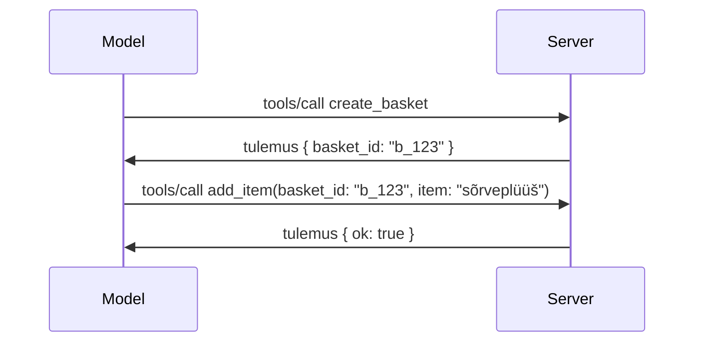

# Mis muutub MCP-s: versiooni 2026-07-28 väljaandekandidaat

> **Staatus:** Väljaandekandidaat. Spetsifikatsioon `2026-07-28` ei ole kirjutamise ajal lõplik. See kuulutati välja 21. mail 2026 ja on planeeritud välja anda 28. juulil 2026. Kõik selles õppetükis kirjeldatu käsitleb väljaandekandidaati; ehitamisel kontrollige kindlasti [eelprojekti spetsifikatsiooni](https://modelcontextprotocol.io/specification/draft) ja selle [muudatustelogit](https://modelcontextprotocol.io/specification/draft/changelog) viimast seisu. Selle kursuse ülejäänud osa on kirjutatud praeguse stabiilse väljaande, **MCP spetsifikatsiooni 2025-11-25**, alusel ning uuendatakse, kui `2026-07-28` välja antakse.

## Ülevaade

`2026-07-28` on suurim MCP muutus selle alates käivitamisest. Kuus spetsifikatsiooni täiendusettepanekut (SEP) eemaldavad protokoli tasandi sessioonid ja muudavad MCP transporditasandil seisundivabaks, laiendused saavad esimese klassi, versioonitud mehhanismiks ning mitmed seda kursust varasemalt käsitlenud funktsioonid (Roots, Sampling, Logging) märgitakse uue elutsüklipoliitika kohaselt aegunuks. See õppetükk võtab kokku, mis muutub, miks see oluline on ja mida see tähendab koodi jaoks, mida olete juba `2025-11-25` vastu kirjutanud.

Allikas: [MCP väljundekandidaat versioon 2026-07-28](https://blog.modelcontextprotocol.io/posts/2026-07-28-release-candidate/) (Model Context Protocol Blog, David Soria Parra ja Den Delimarsky).

## Õpieesmärgid

Selle õppetüki lõpuks oskate:

- Selgitada, miks MCP liigub seisundivaba protokoli tuuma poole ja millise probleemi see horisontaalselt skaleeritud juurutustes lahendab.
- Kirjeldada, kuidas asendatakse `initialize`/`initialized` käepigistus ja `Mcp-Session-Id` päis.
- Tuvastada uued päised `Mcp-Method` ja `Mcp-Name` ning vahemällu salvestamise metaandmed `ttlMs`/`cacheScope`.
- Tunnustada Laienduste raamistiku ja selle väljaandega kaasnevaid kahte laiendust: MCP Apps ja Tasks.
- Nimetada kuus volitamise SEP-i, mis tugevdavad OAuth 2.0 / OIDC vastavust.
- Tuvastada, millised põhifunktsioonid (Roots, Sampling, Logging) on nüüd aegunud ning mida see praktikas tähendab.
- Selgitada tööriistade `inputSchema`/`outputSchema` täieulatuslikku JSON Schema 2020-12 muudatust.

## Seisundivaba protokoll

Peamine muudatus: MCP muutub protokoli tasandil seisundivabaks.

### Enne (2025-11-25): sessioonid fikseerivad sind ühele serveri eksemplarile

Tööriista kutsumine üle Streamable HTTP algab `initialize` käepigistusega. Server vastab `Mcp-Session-Id` päisega, mida peab kõikidel järgnevate päringute kandma:

```http
POST /mcp HTTP/1.1
Mcp-Session-Id: 1868a90c-3a3f-4f5b
Content-Type: application/json

{"jsonrpc":"2.0","id":2,"method":"tools/call",
 "params":{"name":"search","arguments":{"q":"otters"}}}
```

Kuna sessioon on seotud selle serveri eksemplariga, mis selle välja andis, vajavad horisontaalselt skaleeritud juurutused **kleepuvat marsruutimist** koormuse tasakaalustajas ning **jagatud sessioonipoole** eksemplaride vahel.

### Pärast (2026-07-28): iga päring on iseseisev

```http
POST /mcp HTTP/1.1
MCP-Protocol-Version: 2026-07-28
Mcp-Method: tools/call
Mcp-Name: search
Content-Type: application/json

{"jsonrpc":"2.0","id":1,"method":"tools/call",
 "params":{"name":"search","arguments":{"q":"otters"},
           "_meta":{"io.modelcontextprotocol/clientInfo":{"name":"my-app","version":"1.0"}}}}
```

Iga serveri eksemplar võib selle päringu töödelda. Olulised muudatused:

- **`initialize`/`initialized` käepigistus eemaldatakse** ([SEP-2575](https://github.com/modelcontextprotocol/modelcontextprotocol/pull/2575)). Protokolli versioon, kliendi info ja võimekused liiguvad igal päringul `_meta` alla. Uus `server/discover` meetod võimaldab kliendil serveri võimekused ette pärida, kui neid vaja on.
- **Eemaldatakse `Mcp-Session-Id` päis ja protokoli tasandi sessioon** ([SEP-2567](https://github.com/modelcontextprotocol/modelcontextprotocol/pull/2567)). Kleepuv marsruutimine ja jagatud sessioonipooled pole enam protokoli tasandil vajalikud.

### Seisundivaba protokoll, seisundiga rakendused

Protokoli tasandi sessiooni eemaldamine ei tähenda, et teie server ei võiks olla seisundiga. Soovitatav muster on sama, mida HTTP API-d on alati kasutanud: looge ühe tööriista kõnega eksplicitne käepide (näiteks `basket_id`, `browser_id`) ja laske mudelil see käepide hilisematel kutsedel tavapärase argumendina edasi anda.



See teeb seisundi mudelile nähtavaks ja mõistlikuks, selle asemel et peita seda transpordi metaandmetesse, ning võimaldab igal serveri eksemplaril teha ükskõik millist kutsut.

### Serverist kliendile suunatud päringud, ümber korraldatud

Seisundivaba protokoll vajab siiski võimalust, et server saaks kliendilt midagi pärida kutsungiviisiliselt (näiteks teavitamise päring):

- **Serveri algatatud päringud võivad toimuda üksnes siis, kui server aktiivselt töötleb kliendi päringut** ([SEP-2260](https://github.com/modelcontextprotocol/modelcontextprotocol/pull/2260)) — varem soovitus, nüüd nõue. Kasutajat ei kutsuta kunagi ootamatult.
- **Mitmetasandilised vastupäringud** ([SEP-2322](https://github.com/modelcontextprotocol/modelcontextprotocol/pull/2322)) asendavad SSE voo hoidmise lahtisena. Selle asemel tagastab server `InputRequiredResult`:

  ```json
  {
    "resultType": "inputRequired",
    "inputRequests": {
      "confirm": {
        "type": "elicitation",
        "message": "Delete 3 files?",
        "schema": { "type": "boolean" }
      }
    },
    "requestState": "eyJzdGVwIjoxLCJmaWxlcyI6WyJhIiwiYiIsImMiXX0="
  }
  ```

  Klient kogub vastused ja esitab algse kutse uuesti koos `inputResponses` ja korduva `requestState` andmetega. Igast serveri eksemplarist saab taotlust uuesti töödelda, sest kõik vajalik on koormuses.

### Marsruudistatav, vahemällu salvestatav, jälgitav

Kolm väikest muudatust muudavad seisundivaba liikluse haldamise lihtsamaks:

- **`Mcp-Method` ja `Mcp-Name` päised on nõutud Streamable HTTP-s** ([SEP-2243](https://github.com/modelcontextprotocol/modelcontextprotocol/pull/2243)), nii et koormuse tasakaalustajad, väravad ja kiirusepiirajad saavad toimingule marsruutida ilma JSON keha vaatamata. Serverid tagasilükkavad päringud, kus päised ja keha on vastuolus.
- **`tools/list` ja ressurssi lugemise tulemused kannavad `ttlMs` ja `cacheScope`** ([SEP-2549](https://github.com/modelcontextprotocol/modelcontextprotocol/pull/2549)), mis on modelleeritud HTTP `Cache-Control`-i järgi. Kliendid teavad, kui kaua loendi tulemus on värske ja kas seda on ohutu kasutajate vahel jagada, ilma et oleks vaja püsivat SSE voogu muudatuste jälgimiseks.
- **W3C Trace Context levitamine `_meta` sees on dokumenteeritud** ([SEP-414](https://github.com/modelcontextprotocol/modelcontextprotocol/pull/414)), pargates `traceparent`, `tracestate` ja `baggage` võtmennimed nii, et hajutatud jälg saab kutsu kliendi SDK, MCP serveri ja allavoolu süsteemide vahel [OpenTelemetry](https://opentelemetry.io/)-ühilduvas tagaplaanis jälgida.

## Laiendused saavad esimese klassi staatuse

Laiendused eksisteerisid sõnaselgelt `2025-11-25`. [SEP-2133](https://github.com/modelcontextprotocol/modelcontextprotocol/pull/2133) formaliseerib need:

- Laiendusi tuvastatakse pööratud DNS ID-dega.
- Neid läbiräägitakse klientide ja serverite võimekuskaartidel läbi `extensions` kaardi.
- Need asuvad oma `ext-*` hoidlates, millel on delegeeritud hooldajad ja versioonid sõltumatud põhispetsifikatsioonist.
- SEP protsessi uus Laienduste rada annab neile tee eksperimendist ametlikuks.

See väljaanne toob kaasa kaks ametlikku laiendust.

### MCP Apps: serveris renderdatud kasutajaliidesed

[MCP Apps](https://blog.modelcontextprotocol.io/posts/2026-01-26-mcp-apps/) ([SEP-1865](https://github.com/modelcontextprotocol/modelcontextprotocol/pull/1865)) võimaldab serveritel saata interaktiivseid HTML-liideseid, mida majutajad kuvavad liivakastitud iframe'is. Tööriistad deklareerivad oma UI mallid ette, et majutajad saaksid neid eelalla laadida, vahemällu salvestada ja turvakontrolli all hoida, enne kui midagi käivitatakse. Selle alused on juba kaetud [Õppeosas 15: MCP Apps](../03-GettingStarted/15-mcp-apps/README.md) — Laienduste raamistikus on MCP Apps nüüd ametlik laiendus, mitte katsefaasis põhiline funktsioon.

### Tööülesanded saavad laienduseks

Tööülesanded toimetati katsefaasis põhifunktsioonina `2025-11-25`. Tootmiskasutus tõi esile piisavalt ümberkujundamist, et parim kodu on laiendus: [Tasks laiendus](https://github.com/modelcontextprotocol/modelcontextprotocol/pull/2663) korraldab elutsükli ümber seisundivaba mudeli — server võib vastata `tools/call`-ga ülesande käepidemega ning klient juhib seda edasi koos `tasks/get`, `tasks/update` ja `tasks/cancel` käskudega. Ülesande loomine on serveri juhitud: klient reklaamib laiendust ja server otsustab, millal kutse peaks käivituma kui ülesanne. `tasks/list` eemaldatakse täielikult, sest ilma sessioonideta ei saa seda ohutult ulatada.

> **Migratsioonimärkus:** kui olete rakendanud katsefaasis API `2025-11-25` Tasks, peate üleminekuks uuele laienduse elutsüklile — see pole tagurpidi ühilduv.

## Volituste tugevdamine

Kuus SEP-i tugevdavad [volitamise spetsifikatsiooni](https://modelcontextprotocol.io/specification/draft/basic/authorization), et joonduda täpsemalt reaalse maailma OAuth 2.0 / OpenID Connect kasutustega:

| SEP | Muutus |
|---|---|
| [SEP-2468](https://github.com/modelcontextprotocol/modelcontextprotocol/pull/2468) | Kliendid peavad valideerima `iss` parameetri volitamise vastustes vastavalt [RFC 9207](https://www.rfc-editor.org/rfc/rfc9207), mis vähendab MCP-s korduva klient-paljude serverite mustri segadusrünnakuid. Tulevane versioon nõuab vastuste tagasilükkamist, mis `iss` puudub. |
| [SEP-837](https://github.com/modelcontextprotocol/modelcontextprotocol/pull/837) | Kliendid deklareerivad oma OpenID Connect `application_type` dünaamilise kliendi registreerimise ajal, vältides volitamise serverite vaikimisi seadistust töölauakliendi või CLI kliendi puhul väärtusele `"web"` ja selle localhost suunamise URI tagasilükkamist. |
| [SEP-2352](https://github.com/modelcontextprotocol/modelcontextprotocol/pull/2352) | Kliendid seovad registreeritud mandaadid volituse andnud serveri `issuer` parameetriga ja registreerivad end uuesti, kui ressursid liiguvad ühelt volitusserverilt teisele. |
| [SEP-2207](https://github.com/modelcontextprotocol/modelcontextprotocol/pull/2207) | Dokumenteerib, kuidas OpenID Connect stiilis serveritelt taotleda uuendustokeneid. |
| [SEP-2350](https://github.com/modelcontextprotocol/modelcontextprotocol/pull/2350) | Selgitab ulatuse kogunemist õiguste astmelisel laiendamisel. |
| [SEP-2351](https://github.com/modelcontextprotocol/modelcontextprotocol/pull/2351) | Selgitab `.well-known` avastustäiendit. |

Kui ehitate täna MCP jaoks volitusserverit, hakake kohe vastustes andma `iss`-i — vaadake [02-Security](../02-Security/README.md) praeguseid volitusjuhiseid, mis selle peale rajatakse.

## Roots, Sampling ja Logging on aegunud

Uue [funktsioonide elutsüklipoliitika](https://github.com/modelcontextprotocol/modelcontextprotocol/pull/2577) ([SEP-2577](https://github.com/modelcontextprotocol/modelcontextprotocol/pull/2577)) raames liigutatakse kolm põhikliendi primitiivi, mida õpiti [Põhikontseptsioonide](./README.md#roots) osas, staatusele **Aegunud**:

| Funktsioon | Soovitatud asendus |
|---|---|
| Roots | Tööriista parameetrid, ressursi URI-d või serveri konfiguratsioon |
| Sampling | Otsepöördumine LLM pakkujate API-dele |
| Logging | `stderr` stdio transpordite puhul; OpenTelemetry struktuurse vaatluse jaoks |

Need on **ainult annotatsioonipõhised aegumised**: meetodid, tüübid ja võimekuse lipud toimivad sellel väljalasul ja igal aasta jooksul avaldataval versioonil. Nende eemaldamine nõuab eraldi SEP-i elutsüklipoliitika alusel — seega teie olemasolevad [Sampling](../03-GettingStarted/14-sampling/README.md) näited praegu ei purune, kuid uued serverid peaksid eeltoodud asendusmustri kasuks otsustama.

## Tööriistade täielik JSON Schema 2020-12

Tööriistade `inputSchema` ja `outputSchema` tõstetakse täisväärtuslikuks [JSON Schema 2020-12](https://json-schema.org/draft/2020-12) versiooniks ([SEP-2106](https://github.com/modelcontextprotocol/modelcontextprotocol/pull/2106)):

- Sisendskeemid hoiavad juurelimiidi `type: "object"`, kuid võimaldavad nüüd kompositsiooni (`oneOf`, `anyOf`, `allOf`), tingimusi ja viiteid (`$ref`, `$defs`).
- Väljundskeemid on piiranguteta ning `structuredContent` võib nüüd olla ükskõik milline JSON-väärtus, mitte ainult objekt.
- Rakendused ei tohi automaatselt derefereerida väliseid `$ref` URI-sid ning peaksid piiramata skeemi sügavust ja valideerimisaega (teenusetõkestusrünnaku kaalutlus).

Eraldi muutub ressursi puudumise veakood MCP spetsiifilisest `-32002` väärtusest JSON-RPC standardi `-32602` (Vigased parameetrid) väärtuseks ([SEP-2164](https://github.com/modelcontextprotocol/modelcontextprotocol/pull/2164)). Kui teie klient reageerib täpselt `-32002` väärtusele, tuleb see uuendada.

## Kuidas protokoll edasi areneb

See väljaanne sisaldab katkestavaid muudatusi, mida MCP hooldajad ei pea tulevikus normiks. Kolm haldus-SEP-i tänapäeval püüavad kordusi vältida:

- **Funktsioonide elutsüklipoliitika** annab igale funktsioonile tee Aktiivne → Aegunud → Eemaldatud vähemalt kaheaastase vahega aegumisest esimese võimaliku eemaldamiseni.
- **Laienduste raamistik** võimaldab mooduleid välja anda valikuliste laiendustena ning stabiilsena enne (või juhul, kui üldse) põhispetsifikatsiooni liikumist.
- Standardite jälgimise SEP ei saa enam jõuda lõplikule staatusele enne, kui sobiv stsenaarium ilmub [vastavussvitis](https://github.com/modelcontextprotocol/conformance) ([SEP-2484](https://github.com/modelcontextprotocol/modelcontextprotocol/pull/2484)) — sama svitis, mille järgi [SDK tasemete süsteem](https://github.com/modelcontextprotocol/modelcontextprotocol/pull/1777) hindab ametlikke SDKsid.

## Väljalaske ajaskaala ja valideerimine

- Väljalaske kandidaat lukustati 21. mail 2026.
- Lõplik spetsifikatsioon on ajagraafikus 28. juulil 2026.
- Kümne nädala pikkune vahemaa nende kahe vahel võimaldab SDK hooldajatel ja kliendirakenduste arendajatel muudatusi reaalsete töökoormuste vastu valideerida; 1. taseme SDKdel oodatakse toe tarnimist selle aja jooksul vastavalt [SDK tasemete süsteemile](https://modelcontextprotocol.io/docs/sdk).
- Muudatuste täielikku komplekti saab jälgida [materjali eelnõus](https://modelcontextprotocol.io/specification/draft) ja selle [muudatuste logis](https://modelcontextprotocol.io/specification/draft/changelog).

## Mida see tähendab selle õppekava jaoks

Kõik, mida selles kursuses siiani õppinud oled, on suunatud **2025-11-25** kuupäevale, mis jääb kehtivaks stabiilseks spetsifikatsiooniks kuni `2026-07-28` väljalaskmiseni. Konkreetselt:

- **Sessioonid ja `initialize` käepigistus** (kaetud [Põhimõisted](./README.md) ja [Õppetund 6: HTTP voogedastus](../03-GettingStarted/06-http-streaming/README.md)) töötavad tänaseni dokumenteeritult, kuid tuleks oodata, et need asendatakse ülalkirjeldatud olekuta päringumudeliga, kui uuendad `2026-07-28` ühilduvaks SDKdeks.
- **Valimine ja juured** (samuti kaetud [Põhimõisted](./README.md)) jäävad täielikult funktsioneerivaks, kuid on aegunud — uued lahendused peaksid eelistama eespool nimetatud asendusmustreid.
- **Eksperimentaalne Tasks funktsioon**, kui seda oled kasutanud, tuleb migreerida Tasksi laienduse uue elutsükli juurde.
- **MCP rakendused** ([Õppetund 15](../03-GettingStarted/15-mcp-apps/README.md)) jäävad praktiliselt muutumatuks; need liiguvad lihtsalt ametliku laienduste raamistikku alla.

## Lisamaterjalid

- [2026-07-28 MCP spetsifikatsiooni väljalaske kandidaat (blogipostitus)](https://blog.modelcontextprotocol.io/posts/2026-07-28-release-candidate/)
- [MCP transpordi tulevik](https://blog.modelcontextprotocol.io/posts/2025-12-19-mcp-transport-future/)
- [MCP spetsifikatsiooni eelnõu](https://modelcontextprotocol.io/specification/draft)
- [MCP muudatuste logi](https://modelcontextprotocol.io/specification/draft/changelog)
- [SEP juhised](https://modelcontextprotocol.io/community/sep-guidelines)
- [MCP SDK tasemete süsteem](https://modelcontextprotocol.io/docs/sdk)

## Järgmised sammud

Mine tagasi [Põhimõistete](./README.md) juurde või jätka [Turvalisuseni](../02-Security/README.md), et näha, kuidas tänased `2025-11-25` juhised vastevad tulevikule.

---

<!-- CO-OP TRANSLATOR DISCLAIMER START -->
**Lahtiütlus**:
See dokument on tõlgitud kasutades AI tõlketeenust [Co-op Translator](https://github.com/Azure/co-op-translator). Kuigi me püüdleme täpsuse poole, palun pange tähele, et automatiseeritud tõlgetes võib esineda vigu või ebatäpsusi. Originaaldokument selle emakeeles tuleks pidada autoriteetseks allikaks. Olulise teabe puhul soovitatakse kasutada professionaalset inimtõlget. Me ei vastuta selle tõlkega seotud eksimustest või valesti mõistmistest.
<!-- CO-OP TRANSLATOR DISCLAIMER END -->