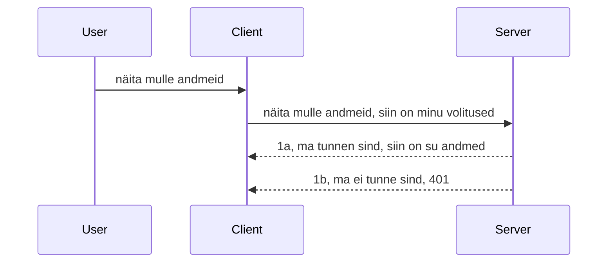

# Lihtne autentimine

MCP SDK-d toetavad OAuth 2.1 kasutamist, mis on ausalt öeldes üsna keeruline protsess, mis hõlmab mõisteid nagu autentimiserver, ressursiserver, mandaadi postitamine, koodi saamine, koodi vahetamine kandjatokeniks, kuni lõpuks pääsete ligi oma ressursiandmetele. Kui te pole OAuth-iga harjunud, mis on suurepärane asi rakendada, on hea mõte alustada mõne põhitasemel autentimisega ja liikuda järk-järgult parema ja parema turvalisuse poole. Sellepärast see peatükk eksisteerib, et viia teid edasi keerulisemasse autentimisse.

## Autentimine – mida me silmas peame?

Autentimine on sõnade authentication ja authorization lühend. Idee on, et meil tuleb teha kaks asja:

- **Autentimine**, mis on protsess, kus selgitame välja, kas lubame isikul meie majja siseneda, et neil on õigus olla "siin", st pääs meie ressursiserverile, kus asuvad meie MCP Serveri omadused.
- **Autoriseerimine**, on protsess, kus selgitame välja, kas kasutajal peaks olema ligipääs konkreetsetele ressurssidele, mida nad küsivad, näiteks need tellimused või need tooted, või kas neil lubatakse sisu lugeda, kuid mitte kustutada, näiteks.

## Mandaadid: kuidas me süsteemile ütleme, kes me oleme

Enamik veebiarendajaid hakkab mõtlema serverile mandaadi esitamise osas, tavaliselt saladuse kujul, mis ütleb, kas neil on õigus siin olla ("Autentimine"). See mandaad tavaliselt base64 kodeeritud kasutajanimi ja parool või API-võti, mis ainulaadselt identifitseerib konkreetse kasutaja.

See hõlmab saatmist ümber "Authorization" päise kaudu nii:

```json
{ "Authorization": "secret123" }
```

Seda nimetatakse tavaliselt põhjauthentimiseks. Kuidas kogu protsess töötab, on järgmine:



Nüüd kui me mõistame, kuidas see vooluna töötab, kuidas me selle rakendame? Enamik veebiservereid omab kontseptsiooni nimega middleware, mis on kooditükk, mis töötab osana päringust ja saab kontrollida mandaate ning kui need on kehtivad, laseb päringu läbi. Kui päringul pole kehtivaid mandaate, saate autentimisvea. Vaatame, kuidas seda saab rakendada:

**Python**

```python
class AuthMiddleware(BaseHTTPMiddleware):
    async def dispatch(self, request, call_next):

        has_header = request.headers.get("Authorization")
        if not has_header:
            print("-> Missing Authorization header!")
            return Response(status_code=401, content="Unauthorized")

        if not valid_token(has_header):
            print("-> Invalid token!")
            return Response(status_code=403, content="Forbidden")

        print("Valid token, proceeding...")
       
        response = await call_next(request)
        # lisa mis tahes kliendi päised või muuda vastust mingil viisil
        return response


starlette_app.add_middleware(CustomHeaderMiddleware)
```

Siin oleme:

- Loonud middleware'i nimega `AuthMiddleware`, mille `dispatch` meetodit käivitab veebiserver.
- Lisame middleware'i veebiserverile:

    ```python
    starlette_app.add_middleware(AuthMiddleware)
    ```

- Kirjutanud valideerimisloogika, mis kontrollib, kas Authorization päis on olemas ja kas saadetud saladus on kehtiv:

    ```python
    has_header = request.headers.get("Authorization")
    if not has_header:
        print("-> Missing Authorization header!")
        return Response(status_code=401, content="Unauthorized")

    if not valid_token(has_header):
        print("-> Invalid token!")
        return Response(status_code=403, content="Forbidden")
    ```

Kui saladus on olemas ja kehtiv, lubame päringu läbi, kutsudes välja `call_next` ja tagastame vastuse.

    ```python
    response = await call_next(request)
    # lisa kliendi päised või muuda vastust mingil moel
    return response
    ```

See toimib nii, et kui veebipäring serverile tehakse, käivitatakse middleware ja selle rakenduse põhjal laseb see päringu kas läbi või tagastab vea, mis näitab, et kliendil pole lubatud jätkata.

**TypeScript**

Siin loome middleware'i populaarses Express raamistikus ja peatame päringu enne, kui see jõuab MCP Serverini. Siin on vastav kood:

```typescript
function isValid(secret) {
    return secret === "secret123";
}

app.use((req, res, next) => {
    // 1. Kas autoriseerimis päis on olemas?
    if(!req.headers["Authorization"]) {
        res.status(401).send('Unauthorized');
    }
    
    let token = req.headers["Authorization"];

    // 2. Kontrolli kehtivust.
    if(!isValid(token)) {
        res.status(403).send('Forbidden');
    }

   
    console.log('Middleware executed');
    // 3. Edastab päringu järgmisele etapile päringu töötlusvoolus.
    next();
});
```

Selles koodis me:

1. Kontrollime, kas Authorization päis esialgu olemas on; kui mitte, saadame 401 vea.
2. Veendume, et mandaad/token on kehtiv; kui mitte, saadame 403 vea.
3. Lõpuks laseb päringu edasi päringu torus (pipeline) ja tagastab nõutud ressursi.

## Harjutus: Rakenda autentimine

Võtame oma teadmised ja proovime neid rakendada. Plaan on järgmine:

Server

- Loo veebiserver ja MCP eksemplar.
- Rakenda serverile middleware.

Kliendi pool

- Saada veebipäring mandaadi kaudu päises.

### -1- Loo veebiserver ja MCP eksemplar

> **Vaadates ette:** alljärgnev TypeScript näide jälgib HTTP transpordid kaardis `transports`, mille võtmeks on `mcp-session-id` vastavalt **MCP spetsifikatsioonile 2025-11-25**. `2026-07-28` versioonikandidaat eemaldab täielikult `initialize` käepigistuse ja sessiooni ID, nii et see sessiooni-põhine transpordikaart kaob ja asendub staatiliselt iseseisvate päringutega. Vaata [Mis on MCP-s muutumas: 2026-07-28 versioonikandidaat](../../01-CoreConcepts/mcp-2026-07-28-release-candidate.md).

Esimeses sammus peame looma veebiserveri eksemplari ja MCP Serveri.

**Python**

Siin loome MCP serveri eksemplari, loome starlette veebirakenduse ja majutame selle uvicorniga.

```python
# MCP serveri loomine

app = FastMCP(
    name="MCP Resource Server",
    instructions="Resource Server that validates tokens via Authorization Server introspection",
    host=settings["host"],
    port=settings["port"],
    debug=True
)

# starlette veebirakenduse loomine
starlette_app = app.streamable_http_app()

# rakenduse teenindamine uvicorni kaudu
async def run(starlette_app):
    import uvicorn
    config = uvicorn.Config(
            starlette_app,
            host=app.settings.host,
            port=app.settings.port,
            log_level=app.settings.log_level.lower(),
        )
    server = uvicorn.Server(config)
    await server.serve()

run(starlette_app)
```

Selles koodis me:

- Loome MCP Serveri.
- Konstrukseerime starlette veebirakenduse MCP Serverist, `app.streamable_http_app()`.
- Majutame ja serverime veebirakenduse uvicorni kaudu, kasutades `server.serve()`.

**TypeScript**

Siin loome MCP Serveri eksemplari.

```typescript
const server = new McpServer({
      name: "example-server",
      version: "1.0.0"
    });

    // ... seadista serveri ressursid, tööriistad ja käsklused ...
```

Seda MCP Serveri loomist tuleb teha meie POST /mcp marsruudi definitsiooni sees, nii et võtame ülaltoodud koodi ja paigutame nii:

```typescript
import express from "express";
import { randomUUID } from "node:crypto";
import { McpServer } from "@modelcontextprotocol/sdk/server/mcp.js";
import { StreamableHTTPServerTransport } from "@modelcontextprotocol/sdk/server/streamableHttp.js";
import { isInitializeRequest } from "@modelcontextprotocol/sdk/types.js"

const app = express();
app.use(express.json());

// Kaart transpordi salvestamiseks sessiooni ID järgi
const transports: { [sessionId: string]: StreamableHTTPServerTransport } = {};

// Käitle POST-päringuid kliendi ja serveri vaheliseks suhtluseks
app.post('/mcp', async (req, res) => {
  // Kontrolli olemasolevat sessiooni ID-d
  const sessionId = req.headers['mcp-session-id'] as string | undefined;
  let transport: StreamableHTTPServerTransport;

  if (sessionId && transports[sessionId]) {
    // Kasuta olemasolevat transporti uuesti
    transport = transports[sessionId];
  } else if (!sessionId && isInitializeRequest(req.body)) {
    // Uus initsialiseerimispäring
    transport = new StreamableHTTPServerTransport({
      sessionIdGenerator: () => randomUUID(),
      onsessioninitialized: (sessionId) => {
        // Salvesta transport sessiooni ID järgi
        transports[sessionId] = transport;
      },
      // DNS-i ümberseadistamise kaitse on vaikimisi välja lülitatud tagurpidi ühilduvuse tõttu. Kui käivitad selle serveri
      // lokaalselt, veendu, et oled seadistanud:
      // enableDnsRebindingProtection: true,
      // allowedHosts: ['127.0.0.1'],
    });

    // Puhasta transport, kui see suletakse
    transport.onclose = () => {
      if (transport.sessionId) {
        delete transports[transport.sessionId];
      }
    };
    const server = new McpServer({
      name: "example-server",
      version: "1.0.0"
    });

    // ... seadista serveri ressursid, tööriistad ja soovitused ...

    // Ühendu MCP serveriga
    await server.connect(transport);
  } else {
    // Vigane päring
    res.status(400).json({
      jsonrpc: '2.0',
      error: {
        code: -32000,
        message: 'Bad Request: No valid session ID provided',
      },
      id: null,
    });
    return;
  }

  // Käitle päringut
  await transport.handleRequest(req, res, req.body);
});

// Taaskasutatav käitleja GET ja DELETE päringutele
const handleSessionRequest = async (req: express.Request, res: express.Response) => {
  const sessionId = req.headers['mcp-session-id'] as string | undefined;
  if (!sessionId || !transports[sessionId]) {
    res.status(400).send('Invalid or missing session ID');
    return;
  }
  
  const transport = transports[sessionId];
  await transport.handleRequest(req, res);
};

// Käitle GET-päringuid serveri ja kliendi vahelise SSE teavituse jaoks
app.get('/mcp', handleSessionRequest);

// Käitle DELETE-päringuid sessiooni lõpetamiseks
app.delete('/mcp', handleSessionRequest);

app.listen(3000);
```

Nüüd näed, kuidas MCP Serveri loomine on viidud `app.post("/mcp")` sisse.

Jätkame järgmise sammuga – middleware loomisega, et saaksime saabuvat mandaati valideerida.

### -2- Rakenda serverile middleware

Järgmise sammuna teeme middleware'i. Siin loome middleware'i, mis otsib mandaati `Authorization` päisest ja valideerib selle. Kui see on aktsepteeritav, liigub päring edasi tegema seda, mida vaja (nt tööriistade nimekirja kuvamine, ressursi lugemine või ükskõik missugune MCP funktsionaalsus, mida klient küsis).

**Python**

Middleware loomiseks peame looma klassi, mis pärib `BaseHTTPMiddleware`-st. On kaks huvitavat osa:

- Päring `request`, mille päisest loeme infot.
- `call_next`, tagasikutsumine, mida peame tegema, kui klient on toonud mandaadi, mida aktsepteerime.

Esmalt peame käsitlema juhtumi, kui `Authorization` päis puudub:

```python
has_header = request.headers.get("Authorization")

# päist pole olemas, ebaõnnestub koodiga 401, muul juhul jätka.
if not has_header:
    print("-> Missing Authorization header!")
    return Response(status_code=401, content="Unauthorized")
```

Siin saadame 401 volitamata sõnumi, sest klient ei läbinud autentimist.

Järgmisena, kui mandaad esitati, peame kontrollima selle kehtivust nii:

```python
 if not valid_token(has_header):
    print("-> Invalid token!")
    return Response(status_code=403, content="Forbidden")
```

Pane tähele, et siin saadame 403 keelatud sõnumi. Vaatame allpool kogu middleware’i, mis rakendab kõike eelnevat:

```python
class AuthMiddleware(BaseHTTPMiddleware):
    async def dispatch(self, request, call_next):

        has_header = request.headers.get("Authorization")
        if not has_header:
            print("-> Missing Authorization header!")
            return Response(status_code=401, content="Unauthorized")

        if not valid_token(has_header):
            print("-> Invalid token!")
            return Response(status_code=403, content="Forbidden")

        print("Valid token, proceeding...")
        print(f"-> Received {request.method} {request.url}")
        response = await call_next(request)
        response.headers['Custom'] = 'Example'
        return response

```

Suurepärane, aga mis saab `valid_token` funktsioonist? Siin see on:

```python
# ÄRGE kasutage tootmises - parandage see !!
def valid_token(token: str) -> bool:
    # eemaldage "Bearer " eesliide
    if token.startswith("Bearer "):
        token = token[7:]
        return token == "secret-token"
    return False
```

See tuleks kindlasti paremaks teha.

OLULINE: Koodi ei tohiks kunagi panna selliseid saladusi nagu siin. Soovitav on hankida võrdlemiseks väärtus mõnest andmeallikast või IDP-st (identiteediteenuse pakkujast) või veel parem, lasta IDP-l valideerida.

**TypeScript**

Expressi kasutamiseks tuleb kutsuda `use` meetod, mis võtab vastu middleware funktsioone.

Peame:

- Suhtlema päringu muutujaga, et kontrollida `Authorization` omaduses edastatud mandaati.
- Valideerima mandaadi ja kui see on korrektne, lasta päringul jätkuda ning lasta kliendi MCP päringul teha oma töö (nt tööriistade kuvamine, ressursi lugemine või muu MCP funktsionaalsus).

Siin kontrollime, kas `Authorization` päis on olemas; kui mitte, katkestame päringu:

```typescript
if(!req.headers["authorization"]) {
    res.status(401).send('Unauthorized');
    return;
}
```

Kui päist ei saadeta, saad 401 vea.

Järgmine samm on kontrollida, kas mandaad on kehtiv; kui mitte, peatame päringu, kuid sõnum on veidi erinev:

```typescript
if(!isValid(token)) {
    res.status(403).send('Forbidden');
    return;
} 
```

Nüüd saad 403 vea.

Siin on kogu kood:

```typescript
app.use((req, res, next) => {
    console.log('Request received:', req.method, req.url, req.headers);
    console.log('Headers:', req.headers["authorization"]);
    if(!req.headers["authorization"]) {
        res.status(401).send('Unauthorized');
        return;
    }
    
    let token = req.headers["authorization"];

    if(!isValid(token)) {
        res.status(403).send('Forbidden');
        return;
    }  

    console.log('Middleware executed');
    next();
});
```

Oleme sättinud veebiserveri kasutama middleware'i, mis kontrollib mandaati, mida klient meile loodan saata. Aga mis saab kliendist?

### -3- Saada veebipäring mandaadiga päise kaudu

Peame veenduma, et klient edastab mandaadi päises. Kuna me kasutame MCP klienti, tuleb välja selgitada, kuidas seda tehakse.

**Python**

Kliendi jaoks peame edastama mandaadi päises nii:

```python
# ÄRGE määrake väärtust otse koodis, hoidke see vähemalt keskkonnamuutujas või turvalisemas hoiustamiskohas
token = "secret-token"

async with streamablehttp_client(
        url = f"http://localhost:{port}/mcp",
        headers = {"Authorization": f"Bearer {token}"}
    ) as (
        read_stream,
        write_stream,
        session_callback,
    ):
        async with ClientSession(
            read_stream,
            write_stream
        ) as session:
            await session.initialize()
      
            # TEE PÄRAST, mida soovite kliendis teha, nt tööriistade loetelu kuvamine, tööriistade kutsumine jne.
```

Pane tähele, kuidas me täidame `headers` tüüpi nii: `headers = {"Authorization": f"Bearer {token}"}`.

**TypeScript**

Võime selle lahendada kahes sammus:

1. Täidame konfiguratsioonobjekti oma mandaadiga.
2. Edastame konfiguratsioonobjekti transpordile.

```typescript

// ÄRA kodeeri väärtust siia kõvasti koodi sisse. Vähemalt hoia see keskkonnamuutujana ja kasuta midagi nagu dotenv (arendusrežiimis).
let token = "secret123"

// defineeri kliendi transpordi valiku objekt
let options: StreamableHTTPClientTransportOptions = {
  sessionId: sessionId,
  requestInit: {
    headers: {
      "Authorization": "secret123"
    }
  }
};

// edasta valikute objekt transpordile
async function main() {
   const transport = new StreamableHTTPClientTransport(
      new URL(serverUrl),
      options
   );
```

Siin näed, kuidas pidime looma `options` objekti ja panema oma päised `requestInit` omaduse alla.

OLULINE: Kuidas me saaksime seda paremaks muuta? Praegusel kujul on sellel mõningaid probleeme. Esiteks on mandaadi edastamine nii üsna riskantne, kui teil ei ole vähemalt HTTPS-i. Isegi siis võib mandaadi varastada, seega on vaja süsteemi, kus tokenit saab kergesti tagasi võtta ja lisada täiendavaid kontrollpunkte, näiteks kust see maailmast pärineb, kas päring toimub liiga sageli (robotilaadne käitumine), lühidalt, seal on palju muresid.

Küll aga tuleb öelda, et väga lihtsate API-de jaoks, kus te ei taha, et keegi teie API-d välja logimata kasutaks, on see siin hea algus.

Sellele lisaks proovime turvalisust veelgi tugevdada, kasutades standardiseeritud vormingut nagu JSON Web Token, tuntud ka kui JWT või "JOT" tokenid.

## JSON Web Tokenid, JWT

Püüame parandada asju väga lihtsate mandaadi edastamise asemel. Millised on kohesed eelised JWT kasutamisel?

- **Turvalisuse parandused.** Põhjauth staatikas saadetakse kasutajanimi ja parool base64 kodeeritud tokenina (või API võti) ikka ja jälle, mis suurendab riski. JWT puhul saadetakse kasutajanimi ja parool ning saad vastu tokeni, mis on ka ajaliselt piiritletud ehk aegub. JWT võimaldab hõlpsasti kasutada peenhäälestatud juurdepääsukontrolli rollide, ulatuste ja õiguste põhjal.
- **Staatilisus ja skaleeritavus.** JWT on iseseisev, see kannab kogu kasutaja infot ja kaotab serveripoolse sessioonimälu vajaduse. Tokenit saab ka lokaalselt valideerida.
- **Ühilduvus ja föderatsioon.** JWT on Open ID Connecti keskne osa ning kasutatakse tuntud identiteedipakkujate, nagu Entra ID, Google Identity ja Auth0, juures. Need võimaldavad ühtset sisselogimist ja palju muud, muutes selle ettevõtte tasemel.
- **Moodulipõhisus ja paindlikkus.** JWT-d saab kasutada ka API väravate juures nagu Azure API Management, NGINX ja teised. Toetab kasutaja autentimisstsenaariume ja serveriteenuste vahelist suhtlust, sealhulgas esindamist ning volitusi.
- **Jõudlus ja vahemällu salvestamine.** JWT võib pärast dekodeerimist vahemällu panna, mis vähendab vajadust sisu ümber töötlemise järele. See aitab eriti kõrge liiklusega rakendustes, parandades läbi voogu ja vähendades koormust valitud infrastruktuurile.
- **Täiustatud omadused.** Toetab ka tokeni introspektiooni (kehtivuse kontroll serveris) ja tagasikutsumist (tokeni kehtetuks muutmine).

Kõigi nende eelduste valguses vaatame, kuidas saame oma rakendust järgmisele tasemele viia.

## Põhiautentimisest JWT-ks

Muudatused, mida peame enam-vähem tegema, on:

- **Õppida konstrueerima JWT tokenit** ja valmistada see ette kliendilt serverile saatmiseks.
- **Validerida JWT tokenit** ja kui see on kehtiv, lubada kliendil juurdepääs meie ressurssidele.
- **Tokeni turvaline salvestamine.** Kuidas me selle tokeni hoiame.
- **Marsruutide kaitsmine.** Peame kaitsma marsruute, meie puhul MCP spetsiifilisi funktsioone.
- **Uuendus-tokenide lisamine.** Veenduda, et loome lühiajalised tokenid ja pikaajalised uuendus-tokenid, mida saab kasutada uute tokenite saamiseks, kui need aeguvad. Samuti peab olema uuendamise lõpp-punkt ja tokenite rotatsioonistrateegia.

### -1- Konstrueeri JWT token

Esmalt on JWT tokenil järgmised osad:

- **päis** (header), milles on algoritm ja tokeni tüüp.
- **keha** (payload), mis sisaldab väiteid, nagu sub (kasutaja või üksus, keda token esindab; autentimisstsenaariumis on see tavaliselt kasutaja-id), exp (aegumine), role (roll).
- **allkiri** (signature), mis on allkirjastatud saladuse või privaatvõtmega.

Selleks peame konstrueerima päise, keha ja kodeeritud tokeni.

**Python**

```python

import jwt
import jwt
from jwt.exceptions import ExpiredSignatureError, InvalidTokenError
import datetime

# JWT allkirjastamiseks kasutatav salajane võti
secret_key = 'your-secret-key'

header = {
    "alg": "HS256",
    "typ": "JWT"
}

# kasutaja info, selle nõuded ja aegumise aeg
payload = {
    "sub": "1234567890",               # Teema (kasutaja ID)
    "name": "User Userson",                # Kohandatud nõue
    "admin": True,                     # Kohandatud nõue
    "iat": datetime.datetime.utcnow(),# Väljastatud kell
    "exp": datetime.datetime.utcnow() + datetime.timedelta(hours=1)  # Aegumine
}

# kodeeri see
encoded_jwt = jwt.encode(payload, secret_key, algorithm="HS256", headers=header)
```

Ülaltoodud koodis oleme:

- Määratlenud päise, kasutades algoritmina HS256 ja tüübiks JWT.
- Konstrukteeinud keha, mis sisaldab subjektiks kasutaja ID-d, kasutajanime, rolli, väljaandmise aega ja aegumist, rakendades sellega mainitud ajapiirangut.

**TypeScript**

Siin vajame mõningaid sõltuvusi, mis aitavad JWT tokenit konstrueerida.

Sõltuvused

```sh

npm install jsonwebtoken
npm install --save-dev @types/jsonwebtoken
```

Nüüd, kui see on olemas, loome päise, keha ja sellega kodeeritud tokeni.

```typescript
import jwt from 'jsonwebtoken';

const secretKey = 'your-secret-key'; // Kasuta tootmiskeskkonnas keskkonnamuutujad

// Määra koorem
const payload = {
  sub: '1234567890',
  name: 'User usersson',
  admin: true,
  iat: Math.floor(Date.now() / 1000), // Väljastamise aeg
  exp: Math.floor(Date.now() / 1000) + 60 * 60 // Aegub 1 tunni pärast
};

// Määra päis (valikuline, jsonwebtoken seab vaikimisi)
const header = {
  alg: 'HS256',
  typ: 'JWT'
};

// Loo token
const token = jwt.sign(payload, secretKey, {
  algorithm: 'HS256',
  header: header
});

console.log('JWT:', token);
```

See token on:

- Allkirjastatud HS256-ga
- Kehtib 1 tund
- Sisaldab väiteid nagu sub, name, admin, iat ja exp.

### -2- Validatsiooni token

Samuti peame tokeni valideerima, seda tuleks teha serveris, et kinnitada, et klient saadab meile kehtiva tokeni. Peame tegema mitmeid kontrollimisi alates struktuuri valideerimisest kuni kehtivuseni. Soovitav on lisada muid kontrolle, näiteks kontrollida, kas kasutaja on teie süsteemis jne.

Tokeni valideerimiseks peame selle dekodeerima, et seda lugeda ja alustada kehtivuse kontrolli:

**Python**

```python

# Lahtimõtesta ja kontrolli JWT
try:
    decoded = jwt.decode(token, secret_key, algorithms=["HS256"])
    print("✅ Token is valid.")
    print("Decoded claims:")
    for key, value in decoded.items():
        print(f"  {key}: {value}")
except ExpiredSignatureError:
    print("❌ Token has expired.")
except InvalidTokenError as e:
    print(f"❌ Invalid token: {e}")

```

Selles koodis kutsume `jwt.decode` funktsiooni, kasutades sisendina tokenit, salajast võtit ja valitud algoritmi. Pange tähele, kuidas kasutame try-catch konstruktsiooni, kuna ebaõnnestunud valideerimine põhjustab vea tõstmise.

**TypeScript**

Siin peame kutsuma `jwt.verify`, et saada tokenist dekodeeritud versioon, mida saame edasi analüüsida. Kui see kutsumine ebaõnnestub, tähendab see, et tokeni struktuur on vale või see ei ole enam kehtiv.

```typescript

try {
  const decoded = jwt.verify(token, secretKey);
  console.log('Decoded Payload:', decoded);
} catch (err) {
  console.error('Token verification failed:', err);
}
```

MÄRKUS: nagu varem mainitud, peaksime tegema täiendavaid kontrolle, et veenduda, et see token viitab meie süsteemis kasutajale ja et kasutajal on õigused, mida ta väidab omavat.

Järgmisena vaatame rollipõhist juurdepääsukontrolli, tuntud ka kui RBAC.

## Rollipõhise juurdepääsukontrolli lisamine

Idee on see, et tahame väljendada, et erinevatel rollidel on erinevad õigused. Näiteks eeldame, et administraator saab kõike teha, tavakasutaja saab lugeda/kirjutada ja külaline saab ainult lugeda. Seega on siin mõned võimalikud õiguste tasemed:

- Admin.Write
- User.Read
- Guest.Read

Vaatame, kuidas me saame seda kontrolli rakendada vahesõltumiste abil. Vahesõltumisi saab lisada nii konkreetsetele marsruutidele kui ka kõikidele marsruutidele.

**Python**

```python
from starlette.middleware.base import BaseHTTPMiddleware
from starlette.responses import JSONResponse
import jwt

# ÄRGE hoidke saladust koodis nagu, see on ainult demonstratsiooni eesmärgil. Looge see turvalisest kohast.
SECRET_KEY = "your-secret-key" # pange see keskkonnamuutujasse
REQUIRED_PERMISSION = "User.Read"

class JWTPermissionMiddleware(BaseHTTPMiddleware):
    async def dispatch(self, request, call_next):
        auth_header = request.headers.get("Authorization")
        if not auth_header or not auth_header.startswith("Bearer "):
            return JSONResponse({"error": "Missing or invalid Authorization header"}, status_code=401)

        token = auth_header.split(" ")[1]
        try:
            decoded = jwt.decode(token, SECRET_KEY, algorithms=["HS256"])
        except jwt.ExpiredSignatureError:
            return JSONResponse({"error": "Token expired"}, status_code=401)
        except jwt.InvalidTokenError:
            return JSONResponse({"error": "Invalid token"}, status_code=401)

        permissions = decoded.get("permissions", [])
        if REQUIRED_PERMISSION not in permissions:
            return JSONResponse({"error": "Permission denied"}, status_code=403)

        request.state.user = decoded
        return await call_next(request)


```

Vahesõltumisi saab lisada järgmiselt:

```python

# Alt 1: lisa vahemehhanism starlette rakenduse loomise ajal
middleware = [
    Middleware(JWTPermissionMiddleware)
]

app = Starlette(routes=routes, middleware=middleware)

# Alt 2: lisa vahemehhanism pärast seda, kui starlette rakendus on juba loodud
starlette_app.add_middleware(JWTPermissionMiddleware)

# Alt 3: lisa vahemehhanism iga marsruudi jaoks
routes = [
    Route(
        "/mcp",
        endpoint=..., # käsitleja
        middleware=[Middleware(JWTPermissionMiddleware)]
    )
]
```

**TypeScript**

Saame kasutada `app.use` ja vahesõltumist, mis käivitub kõigi päringute puhul.

```typescript
app.use((req, res, next) => {
    console.log('Request received:', req.method, req.url, req.headers);
    console.log('Headers:', req.headers["authorization"]);

    // 1. Kontrolli, kas autoriseerimise päis on saadetud

    if(!req.headers["authorization"]) {
        res.status(401).send('Unauthorized');
        return;
    }
    
    let token = req.headers["authorization"];

    // 2. Kontrolli, kas token on kehtiv
    if(!isValid(token)) {
        res.status(403).send('Forbidden');
        return;
    }  

    // 3. Kontrolli, kas tokeni kasutaja eksisteerib meie süsteemis
    if(!isExistingUser(token)) {
        res.status(403).send('Forbidden');
        console.log("User does not exist");
        return;
    }
    console.log("User exists");

    // 4. Kontrolli, kas tokenil on õiged õigused
    if(!hasScopes(token, ["User.Read"])){
        res.status(403).send('Forbidden - insufficient scopes');
    }

    console.log("User has required scopes");

    console.log('Middleware executed');
    next();
});

```

On mitmeid asju, mida saame lasta meie vahesõltumisel teha ja mida meie vahesõltumine PEAB tegema, nimelt:

1. Kontrollida, kas autorisatsioonipäis on olemas
2. Kontrollida, kas token on kehtiv, kutsume `isValid` meetodit, mille me oleme kirjutanud, et kontrollida JWT tokeni terviklikkust ja kehtivust.
3. Kontrollida, et kasutaja eksisteerib meie süsteemis, seda peaksime kontrollima.

   ```typescript
    // kasutajad andmebaasis
   const users = [
     "user1",
     "User usersson",
   ]

   function isExistingUser(token) {
     let decodedToken = verifyToken(token);

     // TODO, kontrolli, kas kasutaja on andmebaasis olemas
     return users.includes(decodedToken?.name || "");
   }
   ```

   Ülal oleme loonud väga lihtsa `users` nimekirja, mis peaks ilmselgelt olema andmebaasis.

4. Lisaks peaksime kontrollima, kas tokenil on õigeid õigusi.

   ```typescript
   if(!hasScopes(token, ["User.Read"])){
        res.status(403).send('Forbidden - insufficient scopes');
   }
   ```

   Ülaltoodud vahesõltumises kontrollime, et token sisaldab User.Read õigust, kui mitte, saadame 403 vea. Allpool on `hasScopes` abimeetod.

   ```typescript
   function hasScopes(scope: string, requiredScopes: string[]) {
     let decodedToken = verifyToken(scope);
    return requiredScopes.every(scope => decodedToken?.scopes.includes(scope));
  }
   ```

Have a think which additional checks you should be doing, but these are the absolute minimum of checks you should be doing.

Using Express as a web framework is a common choice. There are helpers library when you use JWT so you can write less code.

- `express-jwt`, helper library that provides a middleware that helps decode your token.
- `express-jwt-permissions`, this provides a middleware `guard` that helps check if a certain permission is on the token.

Here's what these libraries can look like when used:

```typescript
const express = require('express');
const jwt = require('express-jwt');
const guard = require('express-jwt-permissions')();

const app = express();
const secretKey = 'your-secret-key'; // put this in env variable

// Decode JWT and attach to req.user
app.use(jwt({ secret: secretKey, algorithms: ['HS256'] }));

// Check for User.Read permission
app.use(guard.check('User.Read'));

// multiple permissions
// app.use(guard.check(['User.Read', 'Admin.Access']));

app.get('/protected', (req, res) => {
  res.json({ message: `Welcome ${req.user.name}` });
});

// Error handler
app.use((err, req, res, next) => {
  if (err.code === 'permission_denied') {
    return res.status(403).send('Forbidden');
  }
  next(err);
});

```

Nüüd olete näinud, kuidas vahesõltumisi saab kasutada nii autentimiseks kui autoriseerimiseks, aga mis saab MCP-st, kas see muudab meie autentimisviisi? Vaatame järgmisest jaotisest.

### -3- Lisa RBAC MCP-le

Olete seni näinud, kuidas saate lisada RBAC-i vahesõltumiste kaudu, kuid MCP puhul pole lihtsat võimalust lisada RBAC-i per MCP funktsiooni, mida me siis teeme? Peame lihtsalt lisama sellise koodi, mis kontrollib selles olukorras, kas klientil on õigus konkreetset tööriista kutsuda:

Teil on mitu erinevat valikut, kuidas saavutada per funktsiooni RBAC, siin on mõned:

- Lisa kontroll iga tööriista, ressursi, prompti jaoks, kus on vaja kontrollida õigustaset.

   **python**

   ```python
   @tool()
   def delete_product(id: int):
      try:
          check_permissions(role="Admin.Write", request)
      catch:
        pass # klient ebaõnnestus autoriseerimisel, tõsta autoriseerimisviga
   ```

   **typescript**

   ```typescript
   server.registerTool(
    "delete-product",
    {
      title: Delete a product",
      description: "Deletes a product",
      inputSchema: { id: z.number() }
    },
    async ({ id }) => {
      
      try {
        checkPermissions("Admin.Write", request);
        // todo, saada id productService'ile ja kaugühendusele
      } catch(Exception e) {
        console.log("Authorization error, you're not allowed");  
      }

      return {
        content: [{ type: "text", text: `Deletected product with id ${id}` }]
      };
    }
   );
   ```


- Kasuta täiustatud serveripõhist lähenemist ja päringu käsitlusi, nii vähendad kontrollikohtade arvu.

   **Python**

   ```python
   
   tool_permission = {
      "create_product": ["User.Write", "Admin.Write"],
      "delete_product": ["Admin.Write"]
   }

   def has_permission(user_permissions, required_permissions) -> bool:
      # kasutaja_lubade_loend: kasutajal olevate õiguste loend
      # nõutavad_load: tööriista kasutamiseks vajalikud load
      return any(perm in user_permissions for perm in required_permissions)

   @server.call_tool()
   async def handle_call_tool(
     name: str, arguments: dict[str, str] | None
   ) -> list[types.TextContent]:
    # Eeldame, et request.user.permissions on kasutaja õiguste loend
     user_permissions = request.user.permissions
     required_permissions = tool_permission.get(name, [])
     if not has_permission(user_permissions, required_permissions):
        # Viska viga "Sul puudub õigus tööriista {name} kutsumiseks"
        raise Exception(f"You don't have permission to call tool {name}")
     # jätka ja kutsu tööriista
     # ...
   ```   
   

   **TypeScript**

   ```typescript
   function hasPermission(userPermissions: string[], requiredPermissions: string[]): boolean {
       if (!Array.isArray(userPermissions) || !Array.isArray(requiredPermissions)) return false;
       // Tagastab tõese, kui kasutajal on vähemalt üks vajalik luba
       
       return requiredPermissions.some(perm => userPermissions.includes(perm));
   }
  
   server.setRequestHandler(CallToolRequestSchema, async (request) => {
      const { params: { name } } = request;
  
      let permissions = request.user.permissions;
  
      if (!hasPermission(permissions, toolPermissions[name])) {
         return new Error(`You don't have permission to call ${name}`);
      }
  
      // Jätka..
   });
   ```

   Märkus: peate tagama, et teie vahesõltumine määraks dekodeeritud tokeni päringu user atribuudile, et ülaltoodud kood oleks lihtne.

### Kokkuvõte

Nüüd, kui arutasime, kuidas lisada üldist RBAC tuge ja eriti MCP jaoks, on aeg proovida ise turvalisust rakendada, et veenduda, et olete esitatud kontseptsioonid mõistnud.

## Ülesanne 1: Ehita MCP server ja MCP klient kasutades baastunnustamist

Siin kasutate õpitut, kuidas saata mandaate läbi päiste.

## Lahendus 1

[Lahendus 1](./code/basic/README.md)

## Ülesanne 2: Täienda lahendust 1, kasutades JWT-d

Võta esimene lahendus, kuid seekord parandame seda.

Põhjaühenduse asemel kasutame JWT-d.

## Lahendus 2

[Lahendus 2](./solution/jwt-solution/README.md)

## Väljakutse

Lisa RBAC iga tööriista kohta, nagu kirjeldatud jaotises "Lisa RBAC MCP-le".

## Kokkuvõte

Loodetavasti olete selles peatükis palju õppinud, alates turvatusest üldse, põhitõdedest, JWT-st ja selle lisamisest MCP-le.

Oleme loonud tugeva aluse kohandatud JWT-dega, kuid kui laieneme, liigume standardipõhise identiteedimudeli suunas. IdP nagu Entra või Keycloak kasutuselevõtt lubab meil tokenite väljastamise, valideerimise ja elutsükli halduse jätta usaldusväärsele platvormile — võimaldades keskenduda rakenduse äriloogikale ja kasutajakogemusele.

Selleks on meil põhjalikum [täiustatud peatükk Entrast](../../05-AdvancedTopics/mcp-security-entra/README.md)

## Mis järgmisena

- Järgmine: [MCP hostide seadistamine](../12-mcp-hosts/README.md)

---

<!-- CO-OP TRANSLATOR DISCLAIMER START -->
**Lahtiütlus**:
See dokument on tõlgitud kasutades AI tõlketeenust [Co-op Translator](https://github.com/Azure/co-op-translator). Kuigi me püüdleme täpsuse poole, palun pange tähele, et automatiseeritud tõlgetes võib esineda vigu või ebatäpsusi. Originaaldokument selle emakeeles tuleks pidada autoriteetseks allikaks. Olulise teabe puhul soovitatakse kasutada professionaalset inimtõlget. Me ei vastuta selle tõlkega seotud eksimustest või valesti mõistmistest.
<!-- CO-OP TRANSLATOR DISCLAIMER END -->