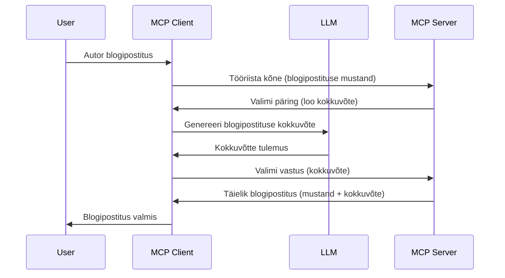

# Proovinäide – volitame funktsioonid kliendile

> **Aegumisteade:** `2026-07-28` MCP spetsifikatsiooni väljaandmise kandidaat märgib proovinäite aegunuks, eelistades otsest integreerimist LLM pakkujate API-dega. Proovinäide jätkab töötamist `2025-11-25` ja vähemalt aasta pärast ametlikku aegumist, seega on selle õppetunni sisu endiselt kehtiv — kuid uued serveri disainid peaksid hindama asendusmustrid. Vaata [Mis MCP-s muutub: 2026-07-28 väljalaske kandidaat](../../01-CoreConcepts/mcp-2026-07-28-release-candidate.md).

Mõnikord vajavad MCP klient ja MCP server koostöönd ühiseks eesmärgiks. Võib esineda olukordi, kus server vajab abi kliendil asuvast LLM-ist. Sellisel juhul tuleks kasutada proovinäidet.

Vaatame mõnda kasutusjuhtu ja kuidas ehitada lahendus, mis hõlmab proovinäidet.

## Ülevaade

Selles õppetükis keskendume proovinäite kasutamisele — millal ja kus seda kasutada ning kuidas seda seadistada.

## Õpieesmärgid

Selles peatükis:

- Selgitame, mis on proovinäide ja millal seda kasutada.
- Näitame, kuidas seadistada proovinäidet MCP-s.
- Toome näiteid proovinäite rakendamisest.

## Mis on proovinäide ja miks seda kasutada?

Proovinäide on täiustatud funktsioon, mis töötab järgmiselt:



### Proovinäite päring

Nüüd, kui meil on ülevaade usutavast stsenaariumist, räägime serveri kliendile tagastatavast proovinäite päringust. Selline päring võib JSON-RPC formaadis välja näha nii:

```json
{
  "jsonrpc": "2.0",
  "id": 1,
  "method": "sampling/createMessage",
  "params": {
    "messages": [
      {
        "role": "user",
        "content": {
          "type": "text",
          "text": "Create a blog post summary of the following blog post: <BLOG POST>"
        }
      }
    ],
    "modelPreferences": {
      "hints": [
        {
          "name": "claude-3-sonnet"
        }
      ],
      "intelligencePriority": 0.8,
      "speedPriority": 0.5
    },
    "systemPrompt": "You are a helpful assistant.",
    "maxTokens": 100
  }
}
```

Siit väärib tähelepanu:

- Prompt, sisuga -> tekst, on meie üleskutse, mis on juhend LLM-ile blogipostituse sisu kokkuvõtmiseks.

- **modelPreferences**. See sektsioon ongi selline eelistus, soovitus, millist konfiguratsiooni LLM-iga kasutada. Kasutaja võib otsustada, kas neid soovitusi järgida või muuta. Selles näites on soovitused kasutatava mudeli, kiiruse ja intelligentsuse prioriteedi kohta.
- **systemPrompt**, see on tavapärane süsteemi juhend, mis annab LLM-ile iseloomu ja juhiseid.
- **maxTokens**, on veel üks omadus, mis näitab, kui palju tokeneid selle ülesande jaoks soovitatakse kasutada.

### Proovinäite vastus

See vastus on see, mida MCP klient lõppkokkuvõttes MCP serverile tagastab – see on kliendi poolt LLM-ile edastatud päringu vastus, mille järel konstrueeritakse see sõnum. Näeb JSON-RPC formaadis välja nii:

```json
{
  "jsonrpc": "2.0",
  "id": 1,
  "result": {
    "role": "assistant",
    "content": {
      "type": "text",
      "text": "Here's your abstract <ABSTRACT>"
    },
    "model": "gpt-5",
    "stopReason": "endTurn"
  }
}
```

Tähelepanuväärne on, et vastus on blogipostituse kokkuvõte, nagu palusime. Samuti paneb tähele, et kasutatud mudel pole see, mida küsiti, vaid "gpt-5" mudel "claude-3-sonnet" asemel. See illustreerib, et kasutaja võib kasutada teist mudelit ning proovinäite päring on soovitus.

Kui nüüd mõistame peamist voogu ja kasulikku ülesannet – "blogipostituse loomine + kokkuvõte" –, vaatame, mida on vaja teha selle töölepanemiseks.

### Sõnumite tüübid

Proovinäite sõnumeid ei piirata ainult tekstiga, saadetavad võivad olla ka pildid ja heli. Siin on, kuidas JSON-RPC erineb:

**Tekst**

```json
{
  "type": "text",
  "text": "The message content"
}
```

**Pildi sisu**

```json
{
  "type": "image",
  "data": "base64-encoded-image-data",
  "mimeType": "image/jpeg"
}
```

**Heli sisu**

```json
{
  "type": "audio",
  "data": "base64-encoded-audio-data",
  "mimeType": "audio/wav"
}
```

> NOTE: lisateabe saamiseks proovinäite kohta vaata [ametlikku dokumentatsiooni](https://modelcontextprotocol.io/specification/2025-11-25/client/sampling)

## Kuidas konfigureerida proovinäidet kliendis

> Märkus: kui ehitad ainult serverit, pole vaja siin palju teha.

Kliendis tuleb määratleda järgmised funktsioonid nii:

```json
{
  "capabilities": {
    "sampling": {}
  }
}
```

Neid võetakse kasutusele, kui sinu valitud klient ühendub serveriga.

## Näide proovinäite tööst – loo blogipostitus

Kodeerime koos proovinäite serveri, peame tegema järgmist:

1. Loo serveris tööriist.
2. See tööriist peaks looma proovinäite päringu.
3. Tööriist peab ootama kliendi proovinäite vastust.
4. Seejärel peab tööriist tootma tulemuse.

Vaatame koodi samm-sammult:

### -1- Loo tööriist

**python**

```python
@mcp.tool()
async def create_blog(title: str, content: str, ctx: Context[ServerSession, None]) -> str:
    """Create a blog post and generate a summary"""

```

### -2- Loo proovinäite päring

Täienda tööriista järgmise koodiga:

**python**

```python
post = BlogPost(
        id=len(posts) + 1,
        title=title,
        content=content,
        abstract=""
    )

prompt = f"Create an abstract of the following blog post: title: {title} and draft: {content} "

result = await ctx.session.create_message(
        messages=[
            SamplingMessage(
                role="user",
                content=TextContent(type="text", text=prompt),
            )
        ],
        max_tokens=100,
)

```

### -3- Oota vastust ja tagasta see

**python**

```python
post.abstract = result.content.text

posts.append(post)

# tagastab kogu toote
return json.dumps({
    "id": post.title,
    "abstract": post.abstract
})
```

### -4- Täiskood

**python**

```python
from starlette.applications import Starlette
from starlette.routing import Mount, Host

from mcp.server.fastmcp import Context, FastMCP

from mcp.server.session import ServerSession
from mcp.types import SamplingMessage, TextContent

import json


from uuid import uuid4
from typing import List
from pydantic import BaseModel


mcp = FastMCP("Blog post generator")

# app = FastAPI()

posts = []

class BlogPost(BaseModel):
    id: int
    title: str
    content: str
    abstract: str

posts: List[BlogPost] = []

@mcp.tool()
async def create_blog(title: str, content: str, ctx: Context[ServerSession, None]) -> str:
    """Create a blog post and generate a summary"""

    post = BlogPost(
        id=len(posts) + 1,
        title=title,
        content=content,
        abstract=""
    )

    prompt = f"Create an abstract of the following blog post: title: {title} and draft: {content} "

    result = await ctx.session.create_message(
        messages=[
            SamplingMessage(
                role="user",
                content=TextContent(type="text", text=prompt),
            )
        ],
        max_tokens=100,
    )

    post.abstract = result.content.text

    posts.append(post)

    # tagasta täielik blogipostitus
    return json.dumps({
        "id": post.title,
        "abstract": post.abstract
    })

if __name__ == "__main__":
    print("Starting server...")
    # mcp.run()
    mcp.run(transport="streamable-http")

# käivita rakendus käsuga: python server.py
```

### -5- Testimine Visual Studio Code'is

Testimiseks Visual Studio Code'is tee järgmist:

1. Käivita server terminalis
1. Lisa see *mcp.json* faili (ja veendu, et on käivitatud), nt selliselt:

   ```json
   "servers": {
      "blog-server": {
        "type": "http",
        "url": "http://localhost:8000/mcp"
      }
   }
   ```

1. Sisesta prompt:

   ```text
   create a blog post named "Where Python comes from", the content is "Python is actually named after Monty Python Flying Circus"
   ```

1. Luba proovinäide toimida. Esimese testimise korral kuvatakse lisadialoog, mille tuleb kinnitada, seejärel ilmub tavapärane dialoog tööriista käivitamiseks.

1. Vaata tulemusi. Tulemid kuvatakse ilusasti GitHub Copilot Chat'is, kuid võid ka vaadata raw JSON vastust.

**Boonus.** Visual Studio Code tööriistad toetavad suurepäraselt proovinäidet. Sa saad konfigureerida proovinäite ligipääsu oma paigaldatud serverile järgmiselt:

1. Mine laienduste sektsiooni.
1. Vali hammasratta ikoon oma paigaldatud serveri kõrval "MCP SERVERS - INSTALLED" osas.
1 Vali "Configure Model Access", siin saad valida, milliseid mudeleid GitHub Copilot tohib proovinäite rakendamisel kasutada. Näed ka kõiki viimasel ajal tehtud proovinäite päringuid, valides "Show Sampling requests".

## Ülesanne

Selles ülesandes ehitad veidi teistlaadse proovinäite ehk proovinäite integratsiooni, mis toetab tootekirjelduste loomist. Sinu stsenaarium:

**Stsenaarium**: e-kaubanduse tagakontori töötajal on abi vaja, kuna tootekirjelduste loomine võtab liiga palju aega. Seetõttu pead looma lahenduse, kus saad kutsuda tööriista "create_product" koos argumentidega "title" ja "keywords", mis peaks tootma täieliku toote koos "description" väljaga, mille täidab kliendi LLM.

NIPP: kasuta varasemaid teadmisi serveri ja tööriista ehitamiseks proovinäite päringuga.

## Lahendus

[Lahendus](./solution/README.md)

## Olulised mõtted

Proovinäide on võimas funktsioon, mis võimaldab serveril tööülesandeid edasi anda kliendile, kui vaja on LLM abi.

## Mis edasi

- [4. peatükk – praktiline rakendamine](../../04-PracticalImplementation/README.md)

---

<!-- CO-OP TRANSLATOR DISCLAIMER START -->
**Lahtiütlus**:
See dokument on tõlgitud kasutades AI tõlketeenust [Co-op Translator](https://github.com/Azure/co-op-translator). Kuigi me püüdleme täpsuse poole, palun pange tähele, et automatiseeritud tõlgetes võib esineda vigu või ebatäpsusi. Originaaldokument selle emakeeles tuleks pidada autoriteetseks allikaks. Olulise teabe puhul soovitatakse kasutada professionaalset inimtõlget. Me ei vastuta selle tõlkega seotud eksimustest või valesti mõistmistest.
<!-- CO-OP TRANSLATOR DISCLAIMER END -->