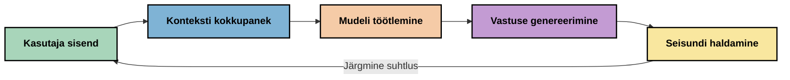
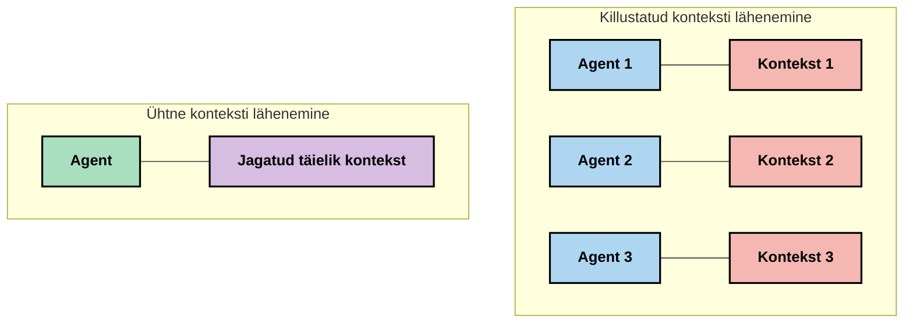
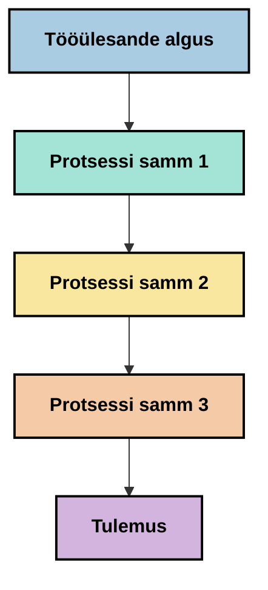
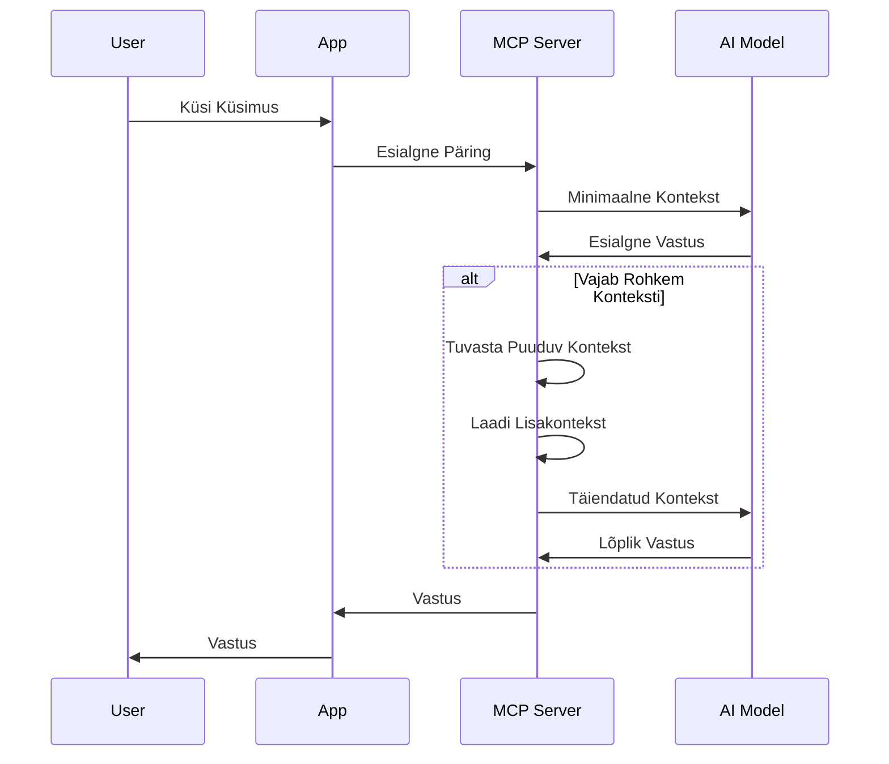
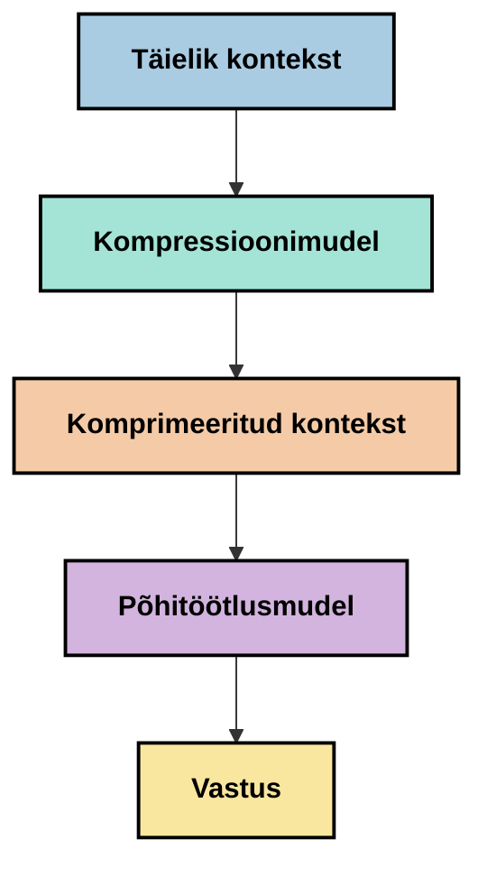
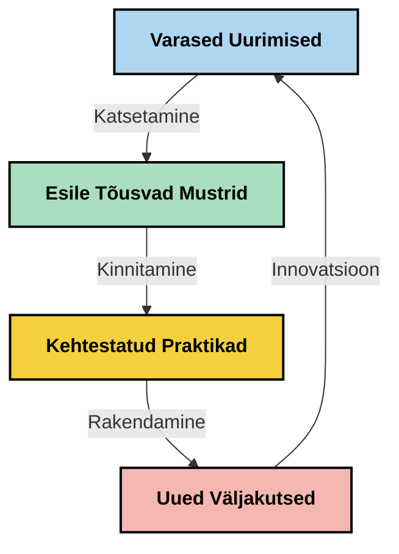

# Kontekstiinsenerlus: tekkiv mõiste MCP ökosüsteemis

## Ülevaade

Kontekstiinsenerlus on tehisintellekti valdkonnas tekkiv mõiste, mis uurib, kuidas teavet struktureeritakse, edastatakse ja hoitakse klientide ning tehisintellekti teenuste vaheliste interaktsioonide käigus. Kuna Model Context Protocoli (MCP) ökosüsteem areneb, muutub konteksti tõhus haldamine üha olulisemaks. See moodul tutvustab kontekstiinsenerluse mõistet ja uurib selle potentsiaalseid rakendusi MCP implementatsioonides.

## Õpieesmärgid

Selle mooduli lõpuks suudad sa:

- Mõista tekkivat kontekstiinsenerluse mõistet ja selle võimalikku rolli MCP rakendustes
- Tuvastada peamised konteksti halduse väljakutsed, mida MCP protokolli disain käsitleb
- Uurida tehnikaid mudeli jõudluse parandamiseks parema konteksti haldamise kaudu
- Kaaluada lähenemisviise konteksti tõhususe mõõtmiseks ja hindamiseks
- Rakendada neid uuenenud mõisteid AI kogemuste parandamiseks MCP raamistikus

## Tutvustus kontekstiinsenerlusse

Kontekstiinsenerlus on tekkiv mõiste, mis keskendub kasutajate, rakenduste ja tehisintellekti mudelite vahelise teabe voo kavandatud disainile ja haldamisele. Erinevalt kindlustatud valdkondadest nagu promptinsenerlus, on kontekstiinsenerlus praktikutel veel määratlemisel, kui nad töötavad AI mudelitele õigel ajal õige teabe pakkimise ainulaadsete väljakutsete lahendamisel.

Suure keelemudelite (LLMide) arenguga on konteksti tähtsus saanud järjest selgemaks. Pakutava konteksti kvaliteet, asjakohasus ja struktuur mõjutavad otseselt mudeli väljundeid. Kontekstiinsenerlus uurib seda suhet ning püüab välja töötada põhimõtteid tõhusaks konteksti haldamiseks.

> "Aastal 2025 on mudelid seal väga intelligentsed. Kuid isegi kõige targem inimene ei suuda oma tööd tõhusalt teha ilma kontekstita, mida temalt nõutakse... 'Kontekstiinsenerlus' on promptinsenerluse järgmine tase. See seisneb automaatse toimimise tagamises dünaamilises süsteemis." — Walden Yan, Cognition AI

Kontekstiinsenerlus võib hõlmata:

1. **Konteksti valimine**: Otsustamine, milline teave on antud ülesande jaoks asjakohane
2. **Konteksti struktureerimine**: Teabe organiseerimine mudeli parema mõistmise maksimeerimiseks
3. **Konteksti edastamine**: Optimeerimine, kuidas ja millal teavet mudelitele saadetakse
4. **Konteksti säilitamine**: Seisundi ja konteksti arengujärguline haldamine aja jooksul
5. **Konteksti hindamine**: Konteksti tõhususe mõõtmine ja parandamine

Need fookusvaldkonnad on eriti olulised MCP ökosüsteemile, mis pakub standardiseeritud viisi, kuidas rakendused saavad LLMidele konteksti pakkuda.

## Konteksti teekonna perspektiiv

Üks viis kontekstiinsenerlust visualiseerida on jälgida teabe teekonda MCP süsteemi kaudu:



### Peamised etapid konteksti teekonnas:

1. **Kasutaja sisend**: tooraine teave kasutajalt (tekst, pildid, dokumendid)
2. **Konteksti koostamine**: kasutaja sisendi kombineerimine süsteemi konteksti, vestluse ajalooga ja muu otsitud teabega
3. **Mudeli töötlemine**: AI mudel töötleb koostatud konteksti
4. **Vastuse genereerimine**: mudel toodab väljundeid antud konteksti põhjal
5. **Seisundi haldamine**: süsteem uuendab oma sisemist seisundit vastavalt interaktsioonile

See perspektiiv toob esile konteksti dünaamilise olemuse AI süsteemides ning tõstatab olulisi küsimusi, kuidas kõige paremini hallata teavet igas etapis.

## Tekivad põhimõtted kontekstiinsenerluses

Kuna kontekstiinsenerluse valdkond hakkab kujunema, ilmuvad mõned varajased põhimõtted praktikute poolt. Need põhimõtted võivad aidata MCP rakenduste valikuid suunata:

### Põhimõte 1: Jaga konteksti täielikult

Konteksti tuleks jagada süsteemi kõigi komponentide vahel täielikult, mitte killustatult mitme agendi või protsessi vahel. Kui kontekst on jagatud, võivad ühe süsteemi osa otsused vastanduda mujal tehtud otsustega.



MCP rakendustes viitab see süsteemide disainile, kus kontekst voolab sujuvalt kogu torujuhtme kaudu selle asemel, et olla compartmentaliseeritud.

### Põhimõte 2: Tunnista, et toimingud kannavad kaudseid otsuseid

Iga mudeli tehtud toiming sisaldab kaudseid otsuseid selle kohta, kuidas konteksti tõlgendada. Kui mitu komponenti tegutsevad erinevate kontekstide põhjal, võivad need kaudsed otsused konflikti sattuda, põhjustades ebajärjekindlaid tulemusi.

Sellel põhimõttel on olulised tagajärjed MCP rakendustele:
- Eelista keeruliste ülesannete lineaarset töötlemist paralleelsele teostusele killustatud kontekstiga
- Tagada, et kõigil otsustuspunktidel on ligipääs samale kontekstitundlikule infole
- Kujunda süsteemid nii, et hilisemad sammud näevad varasemate otsuste kogu konteksti

### Põhimõte 3: Tasakaalusta konteksti sügavust akna piirangutega

Kuna vestlused ja protsessid pikenema kipuvad, saavad konteksti aknad täis. Tõhus kontekstiinsenerlus otsib lähenemisviise selle pingete juhtimiseks kogu konteksti ja tehniliste piirangute vahel.

Võimalikud uuritavad lähenemisviisid:
- Konteksti tihendamine, mis säilitab olulise info, vähendades samal ajal tokenite kasutust
- Konteksti järkjärguline laadimine vastavalt asjakohasusele praegustele vajadustele
- Eelmiste interaktsioonide kokku võtmine, säilitades tähtsad otsused ja faktid

## Konteksti väljakutsed ja MCP protokolli disain

Model Context Protocol (MCP) on loodud, arvestades konteksti haldamise ainulaadseid väljakutseid. Nende väljakutsete mõistmine aitab selgitada MCP protokolli disaini võtmeaspekte:


### Väljakutse 1: Konteksti akna piirangud
Enamik AI mudeleid omab fikseeritud konteksti akna suurust, mis piirab, kui palju teavet nad korraga suudavad töödelda.

**MCP disaini vastus:**
- Protokoll toetab struktureeritud, ressursipõhist konteksti, mida saab efektiivselt viidata
- Ressursse saab lehekülgede kaupa laadida ja progressiivselt juurde tuua

### Väljakutse 2: Asjakohasuse määramine
Otsustamine, milline teave on konteksti kaasamiseks kõige asjakohasem, on keeruline.

**MCP disaini vastus:**
- Paindlik tööriistakomplekt võimaldab dünaamilist teabe otsimist vastavalt vajadusele
- Struktureeritud promptid lubavad järjepidevat konteksti organiseerimist

### Väljakutse 3: Konteksti püsivus
Seisundi haldamine interaktsioonide vahel nõuab hoolikat konteksti jälgimist.

**MCP disaini vastus:**
- Standardiseeritud sessioonihaldus
- Selgelt määratletud interaktsioonimustrid konteksti arenguks

### Väljakutse 4: Multi-modaalne kontekst
Erinevad andmetüübid (tekst, pildid, struktureeritud andmed) nõuavad erinevat käsitlust.

**MCP disaini vastus:**
- Protokolli disain võtab arvesse mitut sisutüüpi
- Multi-modaalse info standardiseeritud representatsioon

### Väljakutse 5: Turvalisus ja privaatsus
Kontekst sisaldab sageli tundlikku teavet, mida tuleb kaitsta.

**MCP disaini vastus:**
- Selged piirid kliendi ja serveri vastutuste vahel
- Kohalikud töötlemise võimalused andmete avalikustamise minimeerimiseks

Nende väljakutsete mõistmine ja MCP lahenduste tundmine annab aluse keerukamate kontekstiinsenerluse tehnika uurimiseks.

## Tekivad kontekstiinsenerluse lähenemisviisid

Kuna kontekstiinsenerluse valdkond areneb, ilmuvad mitmed paljutõotavad lähenemisviisid. Need esindavad tänast mõtlemist, mitte kehtestatud parimaid tavasid ning tõenäoliselt arenevad MCP rakenduste kogemuse kasvades edasi.

### 1. Ühevoogiline lineaarne töötlemine

Erinevalt multiagendi arhitektuuridest, mis konteksti jaotavad, leiavad mõned praktikandid, et ühevoogiline lineaarne töötlemine annab järjekindlamaid tulemusi. See sobib põhimõttega säilitada ühtne kontekst.



Kuigi see lähenemine võib tunduda vähem tõhus kui paralleeltöötlus, toodab see sageli selgemaid ja usaldusväärsemaid tulemusi, sest iga samm tugineb täielikul arusaamisel varasematest otsustest.

### 2. Konteksti tükkideks jagamine ja prioriseerimine

Suure konteksti jagamine hallatavatesse osadesse ja kõige olulisema esile tõstmine.

```python
# Kontseptuaalne näide: konteksti tükeldamine ja prioriteetide seadmine
def process_with_chunked_context(documents, query):
    # 1. Jagage dokumendid väiksemateks tükkideks
    chunks = chunk_documents(documents)
    
    # 2. Arvutage iga tükikese asjakohasuse skoorid
    scored_chunks = [(chunk, calculate_relevance(chunk, query)) for chunk in chunks]
    
    # 3. Sorteerige tükkid asjakohasuse skoori järgi
    sorted_chunks = sorted(scored_chunks, key=lambda x: x[1], reverse=True)
    
    # 4. Kasutage kõige asjakohasemaid tükke kontekstina
    context = create_context_from_chunks([chunk for chunk, score in sorted_chunks[:5]])
    
    # 5. Töötle prioriseeritud kontekstiga
    return generate_response(context, query)
```

Ülaltoodud kontseptsioon illustreerib, kuidas me võiksime suuri dokumente tükkideks jagada ja valida konteksti jaoks kõige asjakohasemad osad. See lähenemine aitab töötada konteksti akna piirangutega, samal ajal kasutades suuremaid teadmiste baase.

### 3. Konteksti progressiivne laadimine

Konteksti laadimine järk-järgult vastavalt vajadusele, mitte kõike korraga.



Progressiivne konteksti laadimine algab minimaalse kontekstiga ja laieneb vaid vajaduse korral. See võib oluliselt vähendada tokeni kasutust lihtsamate päringute puhul, säilitades võime käsitleda keerukaid küsimusi.

### 4. Konteksti tihendamine ja kokkuvõtlikkus

Konteksti suuruse vähendamine, säilitades olulise info.



Konteksti tihendamine keskendub:
- Ülekattuva info eemaldamisele
- Pikkade sisude kokkuvõttele
- Oluliste faktide ja detailide eraldamisele
- Kriitiliste konteksti elementide säilitamisele
- Tokenite efektiivsuse optimeerimisele

See lähenemine võib olla eriti väärtuslik pikkade vestluste säilitamiseks konteksti akendes või suurte dokumentide tõhusaks töötlemiseks. Mõned praktikandid kasutavad spetsiaalseid mudeleid just konteksti tihendamiseks ja vestluse ajaloo kokkuvõtmiseks.

## Uurivad kontekstiinsenerluse kaalutlused

Kontekstiinsenerluse tekkiva valdkonna uurimisel on mitmed kaalutlused vajalikud meeles pidada MCP rakendustega töötamisel. Need ei ole käsud parimate tavade kohta, vaid uurimisvaldkonnad, mis võivad sinu konkreetse kasutusjuhtumi puhul parandusi tuua.

### Kaalu oma konteksti eesmärke

Enne keerukate konteksti halduslahenduste juurutamist sõnasta selgelt, mida soovid saavutada:
- Millist konkreetset teavet mudel edu saavutamiseks vajab?
- Milline info on oluline ja milline lisainfo?
- Millised on sinu jõudluse piirangud (latentsus, tokeni limiidid, kulud)?

### Uuri kihilisi konteksti lähenemisi

Mõned praktikandid leiavad edu konteksti organiseerimisel kontseptuaalsetes kihtides:
- **Tuumikkiht**: Üdini vajalik info, mida mudel alati vajab
- **Situatsioonikiht**: Kontekst, mis on spetsiifiline praegusele interaktsioonile
- **Toetav kiht**: Täiendav info, mis võib olla abiks
- **Varukiht**: Info, mis on ligipääsetav vaid vajaduse korral

### Uuri teabeotsingu strateegiaid

Sinu konteksti tõhusus sõltub sageli sellest, kuidas sa infot otsid:
- Semantiline otsing ja embeddings kontseptuaalselt asjakohase info leidmiseks
- Märksõnal põhinev otsing konkreetsete faktide leidmiseks
- Hübriidlähenemised, mis kombineerivad mitut otsingumeetodit
- Metaandmete filtreerimine kategooriate, kuupäevade või allikate põhjal

### Katseta konteksti sidusust

Konteksti struktuur ja vool võivad mõjutada mudeli arusaamist:
- Seotud info grupeerimine omavahel
- Järjepidev vormindus ja organiseerimine
- Loogilise või kronoloogilise järjekorra säilitamine kus sobib
- Vastuolulise info vältimine

### Hinda multiagendi arhitektuuride kompromisse

Kuigi multiagendi arhitektuurid on paljude AI raamistikute seas populaarsed, kaasnevad nendega märkimisväärsed konteksti halduse väljakutsed:
- Konteksti killustumine võib viia vastuoluliste otsusteni agendi vahel
- Paralleeltöötlemine võib tekitada konflikte, mida raske lahendada on
- Agentide vahelise kommunikatsiooni ülekanne võib jõudlust kasu asemel vähendada
- Sidususe säilitamiseks on vaja keerukat seisundihaldust

Paljudel juhtudel võib üheagendi lähenemine, mis hõlmab põhjalikku konteksti haldust, anda usaldusväärsemaid tulemusi kui mitu spetsialiseeritud agenti killustatud kontekstiga.

### Arenda hindamismeetodeid

Kontekstiinsenerluse parandamiseks aja jooksul kaalu, kuidas edu mõõdad:
- A/B testimine erinevate konteksti struktuuride vahel
- Tokenite kasutuse ja vastuse aegade jälgimine
- Kasutajate rahulolu ja ülesannete täitmise määrade jälgimine
- Juhtumite analüüs, kus konteksti strateegiad ebaõnnestuvad

Need kaalutlused esindavad aktiivset uurimisvaldkonda kontekstiinsenerluse ruumis. Valdkonna küpsemisel ilmuvad tõenäoliselt kindlamad mustrid ja praktikad.

## Konteksti tõhususe mõõtmine: arenev raamistik

Kuna kontekstiinsenerlus kujuneb mõisteks, alustavad praktikandid jõupingutusi selle tõhususe mõõtmiseks. Ühtset raamistikku veel ei ole, kuid kaalutakse erinevaid mõõdikuid, mis võivad tulevikus töö suuna määrata.

### Võimalikud mõõtmisdimensioonid


#### 1. Sisendi efektiivsuse kaalutlused

- **Konteksti ja vastuse suhe**: kui palju konteksti on vaja vastuse suuruse suhtes?
- **Tokenite kasutamine**: mis protsent antud konteksti tokenitest mõjutab nähtavasti vastust?
- **Konteksti vähendamine**: kui tõhusalt võiksime toorest infot tihendada?

#### 2. Jõudluse kaalutlused

- **Latentsuse mõju**: kuidas konteksti haldus mõjutab vastuse aega?
- **Tokeni majanduslikkus**: kas me optimeerime tokenite kasutust efektiivselt?
- **Otsingu täpsus**: kui asjakohane on leitud info?
- **Ressursside kasutus**: milliseid arvutusressursse on vaja?

#### 3. Kvaliteedi kaalutlused

- **Vastuse asjakohasus**: kui hästi vastus käsitleb päringut?
- **Faktide täpsus**: kas konteksti haldus parandab faktide täpsust?
- **Järjepidevus**: kas vastused on sarnastele päringutele järjepidevad?
- **Hallutsinatsioonide määr**: kas parem kontekst vähendab mudeli hallutsinatsioone?

#### 4. Kasutajakogemuse kaalutlused

- **Järgpäringute määr**: kui tihti vajavad kasutajad täpsustust?
- **Ülesande täitmine**: kas kasutajad saavutavad oma eesmärgid edukalt?
- **Rahulolu näitajad**: kuidas kasutajad hindavad oma kogemust?

### Uurivad mõõtmislähenemised

Katsetades kontekstiinsenerlust MCP rakendustes, kaalu neid uurivaid lähenemisi:

1. **Võrdlus alusjoonega**: alusta lihtsate konteksti lähenemisviisidega, enne keerukamate testimist

2. **Järk-järgult muudatused**: muuda korraga üks aspekt konteksti halduses, et eraldada selle mõju

3. **Kasutajakeskne hindamine**: ühenda kvantitatiivsed mõõdikud kvalitatiivse kasutajate tagasisidega

4. **Ebaõnnestumiste analüüs**: analüüsi juhtumeid, kus konteksti strateegiad ebaõnnestuvad, et mõista võimalikke parandusi

5. **Mitmemõõtmeline hindamine**: kaalu kompromisse efektiivsuse, kvaliteedi ja kasutajakogemuse vahel

See katsekeskne, mitmekülgne lähenemine sobitub kontekstiinsenerluse tekkiva olemusega.

## Lõppsõnad

Kontekstiinsenerlus on tekkiv uurimisvaldkond, mis võib osutuda keskseks tõhusates MCP rakendustes. Mõistlikult kaaludes, kuidas info sinu süsteemis voolab, võid luua tehisintellekti kogemusi, mis on efektiivsemad, täpsemad ja kasutajate jaoks väärtuslikumad.

Selles moodulis kirjeldatud tehnikad ja lähenemised esindavad varajast mõtlemist selles valdkonnas, mitte kehtestatud praktikaid. Kontekstiinsenerlus võib areneda määratumaks distsipliiniks koos AI võimekuse arenemise ja meie arusaama süvenemisega. Praegu paistab katsetamine koos hoolika mõõtmisega olevat kõige viljakam lähenemine.

## Võimalikud tulevikusuunad

Kontekstiinsenerluse valdkond on veel algusjärgus, kuid mitmed paljutõotavad suunad ilmnevad:

- Kontekstiinsenerluse põhimõtted võivad oluliselt mõjutada mudeli jõudlust, efektiivsust, kasutajakogemust ja töökindlust
- Ühevoolilise, põhjaliku konteksti haldusega lähenemised võivad ületada multiagendi arhitektuuride tulemusi paljudes kasutusjuhtumites
- Spetsialiseeritud konteksti tihendusmudelid võivad muutuda AI torujuhtmete standardkomponentideks
- Konteksti täielikkuse ja tokenipiirangute pinge võib innustada innovatsiooni konteksti haldamises
- Kui mudelid muutuvad võimekamaks inimlikult efektiivseks suhtlemiseks, võib tõeline multiagentide koostöö muutuda elujõulisemaks
- MCP implementatsioonid võivad areneda, standardiseerides konteksti haldamise mustrid, mis tekivad praegusest katsetustegevusest



## Ressursid

### Ametlikud MCP ressursid
- [Model Context Protocoli veebisait](https://modelcontextprotocol.io/)
- [Model Context Protocoli spetsifikatsioon](https://github.com/modelcontextprotocol/modelcontextprotocol)
- [MCP Dokumentatsioon](https://modelcontextprotocol.io/docs)
- [MCP C# SDK](https://github.com/modelcontextprotocol/csharp-sdk)
- [MCP Python SDK](https://github.com/modelcontextprotocol/python-sdk)
- [MCP TypeScript SDK](https://github.com/modelcontextprotocol/typescript-sdk)
- [MCP Inspector](https://github.com/modelcontextprotocol/inspector) - MCP serverite visuaalne testimise tööriist

### Konteksti inseneriteemalised artiklid
- [Ärge ehitage mitmeagente: konteksti inseneritehnika põhimõtted](https://cognition.ai/blog/dont-build-multi-agents) - Walden Yani mõtted konteksti inseneritehnika põhimõtete kohta
- [Praktiline juhend agentide loomiseks](https://cdn.openai.com/business-guides-and-resources/a-practical-guide-to-building-agents.pdf) - OpenAI juhend tõhusa agentide disaini kohta
- [Tõhusate agentide loomine](https://www.anthropic.com/engineering/building-effective-agents) - Anthropicu lähenemine agentide arendusele

### Seotud uurimistööd
- [Dünaamiline otsingu täiendamine suurte keelemudelite jaoks](https://arxiv.org/abs/2310.01487) - Uurimus dünaamiliste otsingumeetodite kohta
- [Kadunud keskel: kuidas keelemudelid kasutavad pikki kontekste](https://arxiv.org/abs/2307.03172) - Oluline uurimus kontekstitöötluse mustrite kohta
- [Hierarhiline teksti-konditsioneeritud pildigeneratsioon CLIP latentsidega](https://arxiv.org/abs/2204.06125) - DALL-E 2 töö konteksti struktuuri kohta
- [Konteksti rolli uurimine suurte keelemudeli arhitektuurides](https://aclanthology.org/2023.findings-emnlp.124/) - Hiljutine uurimus konteksti käsitlemisest
- [Mitmeagendi koostöö: ülevaade](https://arxiv.org/abs/2304.03442) - Uurimus mitmeagendisüsteemide ja nende väljakutsete kohta

### Lisavarad
- [Kontekstiakna optimeerimise tehnikad](https://learn.microsoft.com/en-us/azure/ai-services/openai/concepts/context-window)
- [Arendatud RAG tehnikad](https://www.microsoft.com/en-us/research/blog/retrieval-augmented-generation-rag-and-frontier-models/)
- [Semantic Kernel dokumentatsioon](https://github.com/microsoft/semantic-kernel)
- [Tehisintellekti tööriistikomplekt kontekstimajanduseks](https://github.com/microsoft/aitoolkit)

## Mis järgmine  

- [5.15 MCP kohandatud transport](../mcp-transport/README.md)

---

<!-- CO-OP TRANSLATOR DISCLAIMER START -->
**Lahtiütlus**:
See dokument on tõlgitud kasutades AI tõlketeenust [Co-op Translator](https://github.com/Azure/co-op-translator). Kuigi me püüdleme täpsuse poole, palun pange tähele, et automatiseeritud tõlgetes võib esineda vigu või ebatäpsusi. Originaaldokument selle emakeeles tuleks pidada autoriteetseks allikaks. Olulise teabe puhul soovitatakse kasutada professionaalset inimtõlget. Me ei vastuta selle tõlkega seotud eksimustest või valesti mõistmistest.
<!-- CO-OP TRANSLATOR DISCLAIMER END -->