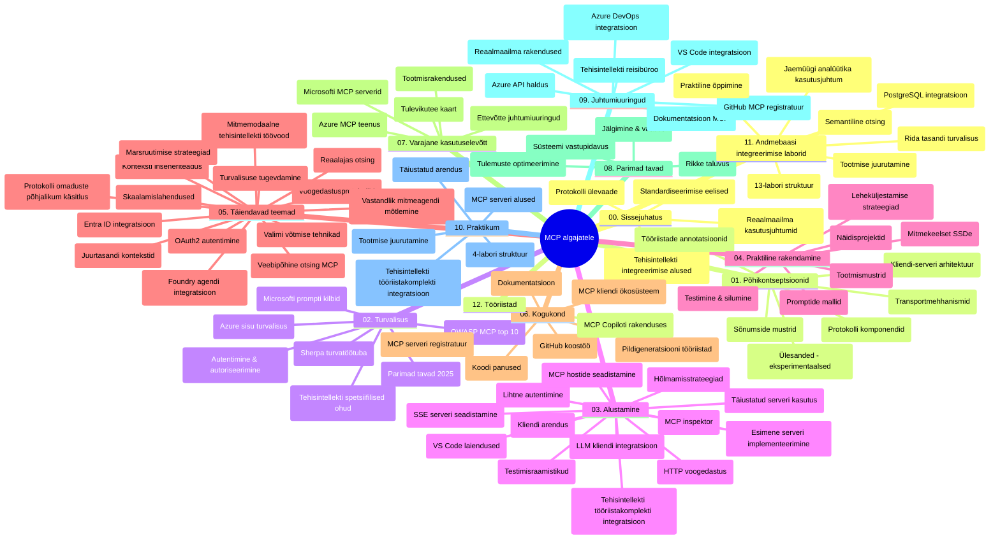

# Mudeli konteksti protokoll (MCP) algajatele – õpijuhend

See õpijuhend annab ülevaate hoidla struktuurist ja sisust kursuse „Mudeli konteksti protokoll (MCP) algajatele“ jaoks. Kasuta seda juhendit hoidla tõhusaks navigeerimiseks ja olemasolevate ressursside maksimaalseks kasutamiseks.

## Hoidla ülevaade

Mudeli konteksti protokoll (MCP) on standardiseeritud raamistik AI mudelite ja kliendirakenduste vahelisteks suhtlusteks. Alguse sai Anthropicu poolt, nüüd hooldab MCP-t laiem kogukond ametliku GitHubi organisatsiooni kaudu. See hoidla pakub põhjalikku õppekava koos praktiliste koodinäidetega C#, Java, JavaScripti, Pythoni ja TypeScripti keeltes, mõeldud AI arendajatele, süsteemiarhitektidele ja tarkvarainseneridele.

## Visuaalne õppekava kaart

## Hoidla struktuur

Hoidla on korraldatud kaheteistkümne põhiosasse, millest igaüks keskendub MCP erinevatele aspektidele:

1. **Sissejuhatus (00-Introduction/)**
   - Mudeli konteksti protokolli ülevaade
   - Miks on standardiseerimine oluline AI torustikes
   - Praktilised kasutusjuhud ja eelised

2. **Põhikontseptsioonid (01-CoreConcepts/)**
   - Kliendi-serveri arhitektuur
   - Põhikomponendid protokollis
   - MCP sõnumivahetuse mustrid
   - Tulevikku vaatamine: [Mis MCP-s muutub: 2026-07-28 Release Candidate](./01-CoreConcepts/mcp-2026-07-28-release-candidate.md) — olekuriskiid protokolli tuum, laienduste raamistik ning Roots/Sampling/Logging vananemine järgmises spetsifikatsiooni versioonis

3. **Turvalisus (02-Security/)**
   - MCP-põhiste süsteemide turvaohtud
   - Parimad praktikad turvaliseks rakendamiseks
   - Autentimise ja autoriseerimise strateegiad
   - **Põhjalik turvalisuse dokumentatsioon**:
     - MCP turvalisuse parimad praktikad 2025
     - Azure sisuturbe rakendamise juhend
     - MCP turvakontrollid ja -tehnikad
     - MCP parimate praktikate kiire ülevaade
   - **Põhilised turvateemad**:
     - Sõnumipromptide süstimine ja tööriistamürgituse rünnakud
     - Seansi kaaperdamine ja segaduses volinikuprobleemid
     - Tokeni läbipääsu haavatavused
     - Liigne õiguste ja juurdepääsu kontroll
     - Tarneahela turvalisus AI komponentide jaoks
     - Microsofti Prompt Shields integratsioon

4. **Alustamine (03-GettingStarted/)**
   - Keskkonna seadistamine ja konfiguratsioon
   - Lihtsate MCP serverite ja klientide loomine
   - Integratsioon olemasolevate rakendustega
   - Kaasas on jaotised:
     - Esimene serveri rakendus
     - Kliendi arendamine
     - LLM kliendi integratsioon
     - VS Code integratsioon
     - Server-saadetud sündmused (SSE) server
     - Täiustatud serveri kasutus
     - HTTP voogesitus
     - AI tööriistakomplekti integratsioon
     - Testimise strateegiad
     - Juhtimise juhised

5. **Praktiline rakendus (04-PracticalImplementation/)**
   - SDK-de kasutamine eri programmeerimiskeeltes
   - Silumine, testimine ja valideerimistehnikad
   - Taaskasutatavate promptmallide ja töövoogude koostamine
   - Näidistööprojektid ja rakenduse näited

6. **Täpsemad teemad (05-AdvancedTopics/)**
   - Konteksti inseneritehnikad
   - Foundry agente integratsioon
   - Mitme modaaliga AI töövood
   - OAuth2 autentimise demonstreerimised
   - Reaalajas otsingu võimalused
   - Reaalajas voogesitus
   - Juurtasemete kontekstid rakendamine
   - Marsruutimise strateegiad
   - Valimistehnikad
   - Skaala lähenemised
   - Turvaküsimused
   - Entra ID turvainteraktsioon
   - Veebipõhine otsing
   - Vastuoluline mitmega-agendi mõtlemine (vaidlusmustrid)

7. **Kogukonna panused (06-CommunityContributions/)**
   - Kuidas panustada koodi ja dokumentatsiooni
   - Koostöö GitHubis
   - Kogukonnapõhised täiustused ja tagasiside
   - Mitmesuguste MCP klientide kasutamine (Claude Desktop, Cline, VSCode)
   - Populaarsete MCP serveritega töötamine, sh pildigeneratsioon

8. **Varased kogemused (07-LessonsfromEarlyAdoption/)**
   - Reaalsed rakendused ja edulood
   - MCP-l põhinevate lahenduste ehitamine ja juurutamine
   - Trendid ja tuleviku tööplaan
   - **Microsofti MCP serverite juhend**: põhjalik juhend 10 tootmiskõlbliku Microsofti MCP serveri kohta, sealhulgas:
     - Microsoft Learn Docs MCP Server
     - Azure MCP Server (15+ spetsialiseeritud konnektorit)
     - GitHub MCP Server
     - Azure DevOps MCP Server
     - MarkItDown MCP Server
     - SQL Server MCP Server
     - Playwright MCP Server
     - Dev Box MCP Server
     - Microsoft Foundry MCP Server
     - Microsoft 365 Agents Toolkit MCP Server

9. **Parimad praktikad (08-BestPractices/)**
   - Jõudluse häälestamine ja optimeerimine
   - Tõrketaluvate MCP süsteemide disain
   - Testimise ja vastupanuvõime strateegiad

10. **Juhtumiuuringud (09-CaseStudy/)**
    - **Seitse põhjalikku juhtumiuuringut**, mis näitavad MCP paindlikkust erinevates stsenaariumites:
    - **Azure AI reisibürood**: mitme agendi orkestreerimine Azure OpenAI ja AI Search abil
    - **Azure DevOps integratsioon**: töövoo automatiseerimine YouTube andmete uuendustega
    - **Reaalajas dokumentide hankimine**: Python konsoolik klient voogedastusega HTTP kaudu
    - **Interaktiivne õppekava generaator**: Chainlit veebirakendus konversatsioonilise AI-ga
    - **Toimetajasisesed dokumendid**: VS Code integratsioon GitHub Copilot töövoogudega
    - **Azure API haldus**: ettevõtte API integratsioon MCP serveri loomisega
    - **GitHub MCP registri**: ökosüsteemi arendamine ja agentide integratsiooniplatvorm
    - Rakenduse näited ulatuvad ettevõtte integratsioonist arendajate tootlikkuseni ja ökosüsteemi arenguni

11. **Praktiline töötuba (10-StreamliningAIWorkflowsBuildingAnMCPServerWithAIToolkit/)**
    - Põhjalik praktiline töötuba MCP ja AI tööriistakomplektiga
    - Tarkade rakenduste loomine, mis ühendavad AI mudeleid ja reaalse maailma tööriistu
    - Praktilised moodulid aluspõhimõtete, kohandatud serveri arenduse ja tootmisele juurutamise strateegiatega
    - **Töötoa struktuur**:
      - Töötuba 1: MCP serveri alused
      - Töötuba 2: Täiustatud MCP serveri arendus
      - Töötuba 3: AI tööriistakomplekti integratsioon
      - Töötuba 4: Tootmisele juurutamine ja skaleerimine
    - Töötoaline õppemeetod samm-sammult juhistega

12. **MCP serveri andmebaasi integratsiooni töökodade komplekt (11-MCPServerHandsOnLabs/)**
    - **Põhjalik 13 töökoda pikk õpitee** tootmiskõlblike MCP serverite ehitamiseks PostgreSQL integreerimisega
    - **Reaalse maailma jaemüügi analüütika rakendus** Zava Retail kasutusjuhtumi näitel
    - **Ettevõtte tasandi mustrid** nagu ridade tasemel turvalisus (RLS), semantiline otsing ja mitme kliendi andmejuurdepääs
    - **Terviklik töötoastruktuur**:
      - **Töökohad 00-03: Alused** – Sissejuhatus, arhitektuur, turvalisus, keskkonna seadistamine
      - **Töökohad 04-06: MCP serveri ehitamine** – Andmebaasi disain, MCP serveri rakendus, tööriistade arendus
      - **Töökohad 07-09: Täiustatud omadused** – Semantiline otsing, testimine ja silumine, VS Code integratsioon
      - **Töökohad 10-12: Tootmine ja parimad praktikad** – Juurutamine, monitorimine, optimeerimine
    - **Kaasatud tehnoloogiad**: FastMCP raamistik, PostgreSQL, Azure OpenAI, Azure Container Apps, Application Insights
    - **Õppe tulemused**: tootmiskõlblikud MCP serverid, andmebaasi integratsioonimustrid, AI-põhine analüütika, ettevõtte turvalisus

13. **Tööriistad (12-tooling/)**
    - Õpi MCP-d kasutama Copiloti rakenduses ja teistes tööriistades

## Täiendavad ressursid

Hoidlas on toetavad ressursid:

- **Pildikaust**: sisaldab skeeme ja illustratsioone kogu õppekava vältel
- **Tõlked**: mitmekeelne tugi dokumentatsiooni automatiseeritud tõlgetega
- **Ametlikud MCP ressursid**:
  - [MCP dokumentatsioon](https://modelcontextprotocol.io/)
  - [MCP spetsifikatsioon](https://spec.modelcontextprotocol.io/)
  - [MCP GitHubi hoidla](https://github.com/modelcontextprotocol)

## Kuidas seda hoidlat kasutada

1. **Järjestikune õppimine**: Järgi peatükke järjest (00 kuni 11) struktureeritud õppimise jaoks.
2. **Keelespetsiifiline fookus**: Kui sind huvitab konkreetne programmeerimiskeel, uuri näidiskatalooge, kus on sinu eelistatud keeles rakendused.
3. **Praktiline rakendus**: Alusta jaotisest „Alustamine“, et seadistada keskkond ja luua oma esimene MCP server ja klient.
4. **Täpsem uurimine**: Kui põhitõed on selged, süvene täpsematesse teemadesse teadmiste laiendamiseks.
5. **Kogukonna kaasamine**: Liitu MCP kogukonnaga GitHubi arutelude ja Discordi kanalite kaudu, et suhelda ekspertide ja kaasaarendajatega.

## MCP kliendid ja tööriistad

Õppekava katab mitmeid MCP kliente ja tööriistu:

1. **Ametlikud kliendid**:
   - Visual Studio Code 
   - MCP Visual Studio Code’is
   - Claude Desktop
   - Claude VSCode’is
   - Claude API

2. **Kogukonna kliendid**:
   - Cline (terminalipõhine)
   - Cursor (koodiredaktor)
   - ChatMCP
   - Windsurf

3. **MCP haldustööriistad**:
   - MCP CLI
   - MCP Manager
   - MCP Linker
   - MCP Router

## Populaarsed MCP serverid

Hoidla tutvustab erinevaid MCP servereid, sealhulgas:

1. **Ametlikud Microsofti MCP serverid**:
   - Microsoft Learn Docs MCP Server
   - Azure MCP Server (15+ spetsialiseeritud konnektorit)
   - GitHub MCP Server
   - Azure DevOps MCP Server
   - MarkItDown MCP Server
   - SQL Server MCP Server
   - Playwright MCP Server
   - Dev Box MCP Server
   - Microsoft Foundry MCP Server
   - Microsoft 365 Agents Toolkit MCP Server

2. **Ametlikud viiteserverid**:
   - Failisüsteem
   - Fetch
   - Mälu
   - Järjestikune mõtlemine

3. **Pildigeneratsioon**:
   - Azure OpenAI DALL-E 3
   - Stable Diffusion WebUI
   - Replicate

4. **Arendustööriistad**:
   - Git MCP
   - Terminal Control
   - Code Assistant

5. **Spetsialiseeritud serverid**:
   - Salesforce
   - Microsoft Teams
   - Jira ja Confluence

## Panustamine

See hoidla ootab kogukonna panuseid. Vaata jaotist „Kogukonna panused“ juhiste saamiseks, kuidas MCP ökosüsteemi tõhusalt panustada.

----

*See õpijuhend uuendati viimati 5. veebruaril 2026, kajastades uusimat MCP spetsifikatsiooni 2025-11-25 ning annab ülevaate hoidla sisust seisuga sellesse kuupäeva. Hoidla sisu võidakse pärast seda kuupäeva ajakohastada.*

*Lisa (2. juuli 2026): õppetund `2026-07-28` MCP spetsifikatsiooni väljalaskekandidaadi kohta lisati kausta [01-CoreConcepts](./01-CoreConcepts/mcp-2026-07-28-release-candidate.md); õppekava alustasemeks jääb kuni uue spetsifikatsiooni väljatulekuni 2025-11-25.*

---

<!-- CO-OP TRANSLATOR DISCLAIMER START -->
**Lahtiütlus**:
See dokument on tõlgitud kasutades AI tõlketeenust [Co-op Translator](https://github.com/Azure/co-op-translator). Kuigi me püüdleme täpsuse poole, palun pange tähele, et automatiseeritud tõlgetes võib esineda vigu või ebatäpsusi. Originaaldokument selle emakeeles tuleks pidada autoriteetseks allikaks. Olulise teabe puhul soovitatakse kasutada professionaalset inimtõlget. Me ei vastuta selle tõlkega seotud eksimustest või valesti mõistmistest.
<!-- CO-OP TRANSLATOR DISCLAIMER END -->