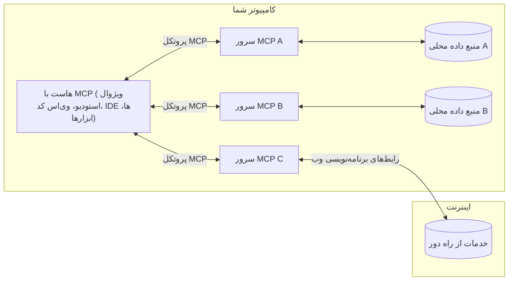

# مفاهیم پایه MCP: تسلط بر پروتکل زمینه مدل برای ادغام هوش مصنوعی

[](https://youtu.be/earDzWGtE84)

_(برای مشاهده ویدیوی این درس روی تصویر بالا کلیک کنید)_

[پروتکل زمینه مدل (MCP)](https://github.com/modelcontextprotocol) یک چارچوب استاندارد و قدرتمند است که ارتباط بین مدل‌های زبان بزرگ (LLMs) و ابزارها، برنامه‌ها و منابع داده خارجی را بهینه می‌کند.  
این راهنما شما را با مفاهیم اصلی MCP آشنا می‌کند. شما معماری کلاینت-سرور، اجزای اساسی، مکانیزم‌های ارتباطی و بهترین روش‌های پیاده‌سازی آن را می‌آموزید.

- **رضایت صریح کاربر**: تمام دسترسی‌ها و عملیات داده‌ای نیازمند تأیید صریح کاربر قبل از اجرا هستند. کاربران باید به وضوح بدانند کدام داده‌ها در دسترس خواهند بود و چه اقداماتی انجام می‌شود، همراه با کنترل دقیق روی مجوزها و مجازات‌ها.

- **حفاظت از حریم خصوصی داده‌ها**: داده‌های کاربران تنها با رضایت صریح منتشر می‌شوند و باید در کل چرخه تعامل توسط کنترل‌های دسترسی مقاوم محافظت شوند. پیاده‌سازی‌ها باید از ارسال داده‌های غیرمجاز جلوگیری کنند و محدودیت‌های حریم خصوصی سخت‌گیرانه را حفظ نمایند.

- **ایمنی اجرای ابزار**: هر فراخوانی ابزار نیازمند رضایت صریح کاربر و درک واضح از عملکرد، پارامترها و تأثیرات احتمالی ابزار است. مرزهای امنیتی مقاوم باید از اجرای ناصحیح، ناامن یا مخرب ابزار جلوگیری کنند.

- **امنیت لایه انتقال**: تمام کانال‌های ارتباطی باید از مکانیزم‌های مناسب رمزنگاری و احراز هویت استفاده کنند. ارتباطات راه دور باید پروتکل‌های امن انتقال و مدیریت مناسب گواهی‌ها را به کار گیرند.

#### راهنمای پیاده‌سازی:

- **مدیریت مجوزها**: سیستم‌های مجوز دقیق پیاده کنید تا کاربران بتوانند کنترل کنند کدام سرورها، ابزارها و منابع در دسترس هستند  
- **احراز هویت و مجوزدهی**: از روش‌های امن احراز هویت (OAuth، کلیدهای API) با مدیریت صحیح توکن و انقضا استفاده کنید  
- **اعتبارسنجی ورودی**: همه پارامترها و داده‌های ورودی را مطابق طرح‌های تعریف شده اعتبارسنجی کنید تا از حملات تزریق جلوگیری شود  
- **لاگ‌گیری حسابرسی**: گزارش‌های جامع از همه عملیات برای نظارت امنیتی و رعایت قوانین نگهداری کنید  

## مرور کلی

در این درس به معماری بنیادین و اجزایی که اکوسیستم پروتکل زمینه مدل (MCP) را تشکیل می‌دهند می‌پردازیم. شما با معماری کلاینت-سرور، اجزای کلیدی و مکانیزم‌های ارتباطی این اکوسیستم آشنا خواهید شد.

## اهداف یادگیری کلیدی

تا پایان این درس، شما:

- معماری کلاینت-سرور MCP را درک خواهید کرد.
- نقش‌ها و مسئولیت‌های میزبان‌ها، مشتری‌ها و سرورها را شناسایی خواهید کرد.
- ویژگی‌های اصلی که MCP را به یک لایه ادغام انعطاف‌پذیر تبدیل می‌کنند، تحلیل خواهید کرد.
- جریان اطلاعات در اکوسیستم MCP را خواهید آموخت.
- از طریق مثال‌های کدی در .NET، Java، Python و JavaScript بینش عملی کسب خواهید کرد.

## معماری MCP: نگاهی عمیق‌تر

اکوسیستم MCP بر اساس مدل کلاینت-سرور ساخته شده است. این ساختار مدولار به برنامه‌های هوش مصنوعی اجازه می‌دهد به ابزارها، پایگاه‌های داده، APIها و منابع متنی به طور مؤثر متصل شوند. بیایید این معماری را به اجزای اصلی آن تقسیم کنیم.

در هسته خود، MCP از معماری کلاینت-سرور پیروی می‌کند که یک برنامه میزبان می‌تواند به چندین سرور متصل شود:



- **میزبان‌های MCP**: برنامه‌هایی مانند VSCode، Claude Desktop، IDEها یا ابزارهای هوش مصنوعی که می‌خواهند از طریق MCP به داده‌ها دسترسی داشته باشند  
- **مشتریان MCP**: کلاینت‌های پروتکل که ارتباط ۱:۱ با سرورها را برقرار می‌کنند  
- **سرورهای MCP**: برنامه‌های سبک وزن که قابلیت‌های خاصی را از طریق پروتکل استاندارد شده زمینه مدل ارائه می‌دهند  
- **منابع داده محلی**: فایل‌ها، پایگاه‌های داده و خدمات کامپیوتر شما که سرورهای MCP می‌توانند به طور امن به آنها دسترسی داشته باشند  
- **خدمات راه دور**: سیستم‌های خارجی که از طریق اینترنت قابل دسترسی هستند و سرورهای MCP می‌توانند از طریق API به آنها متصل شوند  

پروتکل MCP یک استاندارد در حال تکامل است که از نسخه‌بندی مبتنی بر تاریخ (فرمت YYYY-MM-DD) استفاده می‌کند. نسخه فعلی پروتکل **2025-11-25** است. شما می‌توانید آخرین به‌روزرسانی‌های [مشخصات پروتکل](https://modelcontextprotocol.io/specification/2025-11-25/) را مشاهده کنید.

> **نگاهی به آینده:** نامزد انتشار نسخه بعدی مشخصات، **2026-07-28**، در مه ۲۰۲۶ اعلام شد و قرار است در ۲۸ ژوئیه ۲۰۲۶ عرضه شود. این نسخه پروتکل را در لایه انتقال بدون حالت می‌کند (حذف handshake `initialize` و شناسه‌های نشست)، چارچوب افزونه‌ها را رسمی می‌کند، و ریشه‌ها، نمونه‌گیری و لاگ‌گیری را به نفع الگوهای جدید منسوخ می‌کند. برای بررسی کامل به [چه چیزهایی در MCP تغییر می‌کند: نامزد انتشار ۲۰۲۶-۰۷-۲۸](./mcp-2026-07-28-release-candidate.md) مراجعه کنید.

### ۱. میزبان‌ها

در پروتکل زمینه مدل (MCP)، **میزبان‌ها** برنامه‌های هوش مصنوعی هستند که به عنوان واسط اصلی کاربران با پروتکل عمل می‌کنند. میزبان‌ها اتصالات به چندین سرور MCP را هماهنگ و مدیریت می‌کنند و برای هر اتصال سرور، کلاینت MCP اختصاصی ایجاد می‌نمایند. نمونه‌هایی از میزبان‌ها عبارتند از:

- **برنامه‌های هوش مصنوعی**: Claude Desktop، Visual Studio Code، Claude Code  
- **محیط‌های توسعه**: IDEها و ویرایشگرهای کد با ادغام MCP  
- **برنامه‌های سفارشی**: ابزارها و عوامل هوش مصنوعی ساخته شده برای هدف خاص  

**میزبان‌ها** برنامه‌هایی هستند که تعاملات مدل هوش مصنوعی را هماهنگ می‌کنند. آنها:

- **هماهنگی مدل‌های هوش مصنوعی**: اجرای LLMها یا تعامل با آنها برای تولید پاسخ‌ها و هماهنگی جریان کاری هوش مصنوعی  
- **مدیریت اتصالات کلاینت**: ایجاد و نگهداری یک کلاینت MCP برای هر اتصال به سرور MCP  
- **کنترل رابط کاربری**: مدیریت جریان مکالمه، تعاملات کاربر و نمایش پاسخ‌ها  
- **اجرای امنیت**: کنترل مجوزها، محدودیت‌های امنیتی و احراز هویت  
- **مدیریت رضایت کاربر**: مدیریت تأیید کاربر برای اشتراک‌گذاری داده‌ها و اجرای ابزار  


### ۲. مشتری‌ها

**مشتری‌ها** اجزای ضروری هستند که اتصال‌های یک‌به‌یک اختصاصی بین میزبان‌ها و سرورهای MCP را حفظ می‌کنند. هر کلاینت MCP توسط میزبان برای اتصال به یک سرور خاص ایجاد می‌شود و کانال‌های ارتباطی سازمان‌یافته و امن را تضمین می‌کند. چندین کلاینت به میزبان‌ها اجازه می‌دهد همزمان به چند سرور متصل شوند.

**کلاینت‌ها** اجزای اتصال‌دهنده داخل برنامه میزبان هستند. آنها:

- **ارتباط پروتکل**: ارسال درخواست‌های JSON-RPC 2.0 به سرورها با پرامپت‌ها و دستورالعمل‌ها  
- **مذاکره قابلیت‌ها**: مذاکره ویژگی‌های پشتیبانی شده و نسخه‌های پروتکل با سرورها هنگام شروع اتصال  
- **اجرای ابزار**: مدیریت درخواست‌های اجرای ابزار از مدل‌ها و پردازش پاسخ‌ها  
- **به‌روزرسانی‌های زنده**: مدیریت اعلان‌ها و به‌روزرسانی‌های بلادرنگ از سرورها  
- **پردازش پاسخ**: پردازش و قالب‌بندی پاسخ‌های سرور برای نمایش به کاربران  

### ۳. سرورها

**سرورها** برنامه‌هایی هستند که زمینه، ابزارها و قابلیت‌ها را به مشتریان MCP ارائه می‌دهند. آنها ممکن است به صورت محلی (روی همان دستگاه میزبان) یا از راه دور (روی پلتفرم‌های خارجی) اجرا شوند و مسئول پاسخگویی به درخواست‌های کلاینت و ارائه پاسخ‌های ساختارمند هستند. سرورها عملکرد مشخصی را از طریق پروتکل استاندارد شده زمینه مدل ارائه می‌کنند.

**سرورها** خدماتی هستند که زمینه و قابلیت‌ها را فراهم می‌کنند. آنها:

- **ثبت ویژگی‌ها**: ثبت و ارائه مقادیر اولیه قابل دسترس (منابع، پرامپت‌ها، ابزارها) به کلاینت‌ها  
- **پردازش درخواست‌ها**: دریافت و اجرای تماس‌های ابزار، درخواست‌های منابع و پرامپت‌ها از کلاینت‌ها  
- **تأمین زمینه**: ارائه اطلاعات و داده‌های زمینه‌ای برای بهبود پاسخ‌های مدل  
- **مدیریت وضعیت**: نگهداری وضعیت جلسه و مدیریت تعاملات حالت‌دار در صورت نیاز  
- **اطلاع‌رسانی بلادرنگ**: ارسال اعلان درباره تغییرات قابلیت‌ها و به‌روزرسانی‌ها به کلاینت‌های متصل  

هر کسی می‌تواند سرورهایی توسعه دهد تا قابلیت‌های مدل را با عملکرد تخصصی گسترش دهد و از هر دو حالت استقرار محلی و راه دور پشتیبانی می‌کنند.

### ۴. مقادیر اولیه سرور

سرورها در پروتکل زمینه مدل (MCP) سه **مقدار اولیه** اصلی ارائه می‌دهند که بلوک‌های بنیادین تعاملات غنی بین کلاینت‌ها، میزبان‌ها و مدل‌های زبانی را تعریف می‌کنند. این مقادیر اولیه نوع اطلاعات زمینه‌ای و اقدامات قابل دسترسی از طریق پروتکل را مشخص می‌کنند.

سرورهای MCP می‌توانند هر ترکیبی از سه مقدار اولیه زیر را ارائه دهند:

#### منابع

**منابع** منابع داده‌ای هستند که اطلاعات زمینه‌ای به برنامه‌های هوش مصنوعی ارائه می‌دهند. آنها محتوای استاتیک یا پویا را نمایندگی می‌کنند که می‌تواند فهم مدل و تصمیم‌گیری را تقویت کند:

- **داده‌های زمینه‌ای**: اطلاعات ساختار یافته و زمینه برای مصرف مدل‌های هوش مصنوعی  
- **پایگاه‌های دانش**: مخازن اسناد، مقالات، راهنماها و مقالات پژوهشی  
- **منابع داده محلی**: فایل‌ها، پایگاه‌های داده و اطلاعات سیستم محلی  
- **داده‌های خارجی**: پاسخ‌های API، خدمات وب و داده سیستم‌های راه دور  
- **محتوای پویا**: داده‌های بلادرنگ که بر اساس شرایط خارجی به‌روزرسانی می‌شوند  

منابع با URIs شناسایی می‌شوند و از روش‌های `resources/list` برای کشف و `resources/read` برای واکشی پشتیبانی می‌کنند:

```text
file://documents/project-spec.md
database://production/users/schema
api://weather/current
```

#### پرامپت‌ها

**پرامپت‌ها** قالب‌های قابل استفاده مجددی هستند که به ساختاربندی تعاملات با مدل‌های زبانی کمک می‌کنند. آنها الگوهای استاندارد شده تعامل و جریان‌های کاری قالب‌بندی شده ارائه می‌دهند:

- **تعاملات مبتنی بر قالب**: پیام‌ها و استارت‌کننده‌های مکالمه پیش‌ساخت‌یافته  
- **قالب‌های جریان کاری**: توالی‌های استاندارد برای وظایف و تعاملات رایج  
- **نمونه‌های چندتایی**: قالب‌های مبتنی بر مثال برای دستورالعمل مدل  
- **پرامپت‌های سیستمی**: پرامپت‌های بنیادینی که رفتار و زمینه مدل را تعریف می‌کنند  
- **قالب‌های پویا**: پرامپت‌های پارامتری شده که به زمینه‌های خاص سازگار می‌شوند  

پرامپت‌ها از جایگزینی متغیر پشتیبانی می‌کنند و از طریق `prompts/list` کشف و با `prompts/get` واکشی می‌شوند:

```markdown
Generate a {{task_type}} for {{product}} targeting {{audience}} with the following requirements: {{requirements}}
```

#### ابزارها

**ابزارها** توابع اجرایی هستند که مدل‌های هوش مصنوعی می‌توانند آنها را برای انجام اقدامات خاص فراخوانی کنند. آنها "افعال" اکوسیستم MCP را تشکیل می‌دهند و امکان تعامل مدل‌ها با سیستم‌های خارجی را فراهم می‌کنند:

- **توابع اجرایی**: عملیات مجزا که مدل‌ها می‌توانند با پارامترهای خاص فراخوانند  
- **ادغام سیستم خارجی**: تماس‌های API، پرس‌وجوهای پایگاه داده، عملیات فایل، محاسبات  
- **هویت منحصربه‌فرد**: هر ابزار نام، توضیح و طرح پارامترهای متمایزی دارد  
- **ورودی/خروجی ساختارمند**: ابزارها پارامترهای اعتبارسنجی شده را قبول کرده و پاسخ‌های ساختارمند و نوع‌دار بازمی‌گردانند  
- **قابلیت‌های عملیاتی**: امکان اجرای اقدامات دنیای واقعی و بازیابی داده‌های زنده را برای مدل‌ها فراهم می‌کنند  

ابزارها با طرح JSON برای اعتبارسنجی پارامتر تعریف می‌شوند و از `tools/list` کشف و از طریق `tools/call` اجرا می‌گردند. ابزارها همچنین می‌توانند **آیکون‌ها** را به عنوان متادیتای اضافی برای ارائه بهتر رابط کاربری شامل شوند.

**یادداشت‌های ابزار**: ابزارها از یادداشت‌های رفتاری (مثلاً `readOnlyHint`، `destructiveHint`) پشتیبانی می‌کنند که مشخص می‌کنند آیا ابزار فقط خواندنی است یا مخرب، و به کلاینت‌ها در اتخاذ تصمیم‌های آگاهانه در مورد اجرای ابزار کمک می‌کنند.

نمونه تعریف ابزار:

```typescript
server.tool(
  "search_products", 
  {
    query: z.string().describe("Search query for products"),
    category: z.string().optional().describe("Product category filter"),
    max_results: z.number().default(10).describe("Maximum results to return")
  }, 
  async (params) => {
    // جستجو را انجام دهید و نتایج ساخت‌یافته را برگردانید
    return await productService.search(params);
  }
);
```

## مقادیر اولیه کلاینت

در پروتکل زمینه مدل (MCP)، **کلاینت‌ها** می‌توانند مقادیری را ارائه دهند که به سرورها اجازه می‌دهد قابلیت‌های اضافی از برنامه میزبان درخواست کنند. این مقادیر اولیه سمت کلاینت امکان پیاده‌سازی‌های سرور تعاملی‌تر و غنی‌تری را می‌دهند که می‌توانند به قابلیت‌های مدل هوش مصنوعی و تعاملات کاربر دسترسی داشته باشند.

### نمونه‌گیری

> **اطلاعیه منسوخی:** نامزد انتشار `2026-07-28` نمونه‌گیری را در راستای ادغام مستقیم با APIهای ارائه‌دهنده LLM منسوخ اعلام می‌کند. این ویژگی همچنان در نسخه `2025-11-25` و حداقل یک سال پس از هر منسوخی کار می‌کند، اما طرح‌های جدید باید الگوی جایگزین را ترجیح دهند. به [چه چیزهایی در MCP تغییر می‌کند: نامزد انتشار ۲۰۲۶-۰۷-۲۸](./mcp-2026-07-28-release-candidate.md) مراجعه کنید.

**نمونه‌گیری** به سرورها اجازه می‌دهد درخواست تکمیل‌های مدل زبان را از برنامه هوش مصنوعی کلاینت بگیرند. این مقدار اولیه امکان دسترسی سرورها به قابلیت‌های LLM را بدون درج وابستگی‌های مدل خودشان فراهم می‌کند:

- **دسترسی مستقل از مدل**: سرورها می‌توانند درخواست تکمیل بدون نیاز به گنجاندن SDKهای LLM یا مدیریت دسترسی مدل ارسال کنند  
- **هوش مصنوعی آغازشده توسط سرور**: امکان تولید خودکار محتوا توسط سرورها با استفاده از مدل هوش مصنوعی کلاینت را فراهم می‌کند  
- **تعاملات بازگشتی LLM**: از سناریوهای پیچیده‌ای که سرورها نیاز به کمک هوش مصنوعی برای پردازش دارند پشتیبانی می‌کند  
- **تولید محتوای پویا**: به سرورها اجازه می‌دهد پاسخ‌های متنی پویا با استفاده از مدل میزبان ایجاد کنند  
- **پشتیبانی فراخوانی ابزار**: سرورها می‌توانند پارامترهای `tools` و `toolChoice` را برای فراخوانی ابزار توسط مدل کلاینت در طول نمونه‌گیری‌ ارسال کنند  

نمونه‌گیری از طریق روش `sampling/complete` فعال می‌شود، جایی که سرورها درخواست‌های تکمیل را به کلاینت‌ها ارسال می‌کنند.

### ریشه‌ها

> **اطلاعیه منسوخی:** نامزد انتشار `2026-07-28` ریشه‌ها را به نفع پارامترهای ابزار، URIهای منابع یا پیکربندی سرور منسوخ اعلام می‌کند. این ویژگی همچنان در نسخه `2025-11-25` و حداقل یک سال پس از هر منسوخی کار می‌کند. به [چه چیزهایی در MCP تغییر می‌کند: نامزد انتشار ۲۰۲۶-۰۷-۲۸](./mcp-2026-07-28-release-candidate.md) مراجعه کنید.

**ریشه‌ها** راهی استاندارد برای کلاینت‌ها فراهم می‌کنند تا مرزهای سیستم فایل را به سرورها اعلام کنند، که به سرورها کمک می‌کند بفهمند به چه فهرست‌ها و فایل‌هایی دسترسی دارند:

- **مرزهای سیستم فایل**: مرزهای محل فعالیت سرورها در سیستم فایل را مشخص می‌کنند  
- **کنترل دسترسی**: به سرورها کمک می‌کنند تا درک کنند که مجاز به دسترسی به کدام فهرست‌ها و فایل‌ها هستند  
- **به‌روزرسانی‌های پویا**: کلاینت‌ها می‌توانند هنگام تغییر فهرست ریشه‌ها به سرورها اطلاع دهند  
- **شناسایی مبتنی بر URI**: ریشه‌ها از URIهای `file://` برای شناسایی فهرست‌ها و فایل‌های قابل دسترسی استفاده می‌کنند  

ریشه‌ها از طریق روش `roots/list` کشف می‌شوند، و کلاینت‌ها هنگام تغییر ریشه‌ها با `notifications/roots/list_changed` به سرورها اطلاع می‌دهند.

### کسب اطلاعات  

**کسب اطلاعات** به سرورها امکان می‌دهد اطلاعات اضافی یا تأیید از کاربران از طریق رابط کلاینت درخواست کنند:

- **درخواست‌های ورودی کاربر**: سرورها می‌توانند در صورت نیاز برای اجرای ابزار اطلاعات بیشتر درخواست کنند  
- **دیالوگ‌های تأیید**: درخواست تأیید کاربر برای عملیات حساس یا اثرگذار  
- **جریان‌های کاری تعاملی**: امکان ایجاد تعاملات گام به گام با کاربر برای سرورها فراهم می‌کند  
- **گردآوری پارامترهای پویا**: جمع‌آوری پارامترهای مفقود یا اختیاری هنگام اجرای ابزار  

درخواست‌های کسب اطلاعات با روش `elicitation/request` برای جمع‌آوری ورودی کاربر از طریق رابط کلاینت ارسال می‌شوند.

**کسب اطلاعات با حالت URL**: سرورها همچنین می‌توانند تعاملات کاربر مبتنی بر URL درخواست کنند، که به سرورها اجازه می‌دهد کاربران را به صفحات وب خارجی برای احراز هویت، تأیید یا ورود داده هدایت کنند.

### لاگ‌گیری


> **اعلان حذف تدریجی:** کاندید انتشار `2026-07-28` علامت‌دهنده عدم توصیه به استفاده از Logging به نفع `stderr` برای انتقال stdio و OpenTelemetry برای مشاهده‌پذیری ساختاریافته است. این قابلیت در نسخه `2025-11-25` و حداقل برای یک سال پس از هر گونه حذف تدریجی همچنان کار خواهد کرد. ببینید [چه تغییراتی در MCP رخ داده است: کاندید انتشار 2026-07-28](./mcp-2026-07-28-release-candidate.md).

**Logging** به سرورها اجازه می‌دهد پیام‌های لاگ ساختاریافته به کلاینت‌ها ارسال کنند برای اشکال‌زدایی، نظارت، و دید عملیاتی:

- **پشتیبانی از اشکال‌زدایی**: امکان ارائه لاگ‌های دقیق اجرا برای عیب‌یابی
- **نظارت عملیاتی**: ارسال به‌روزرسانی‌های وضعیت و معیارهای عملکرد به کلاینت‌ها
- **گزارش خطا**: ارائه زمینه‌های دقیق خطا و اطلاعات تشخیصی
- **ردیابی حسابرسی**: ایجاد لاگ‌های جامع از عملیات و تصمیمات سرور

پیام‌های لاگ برای ارائه شفافیت در عملیات سرور و تسهیل اشکال‌زدایی به کلاینت‌ها ارسال می‌شوند.

## جریان اطلاعات در MCP

پروتکل زمینه مدل (Model Context Protocol یا MCP) جریان ساختاریافته اطلاعات بین میزبان‌ها، کلاینت‌ها، سرورها و مدل‌ها را تعریف می‌کند. درک این جریان به روشن شدن نحوه پردازش درخواست‌های کاربر و چگونگی ادغام ابزارها و داده‌های خارجی در پاسخ‌های مدل کمک می‌کند.

- **میزبان اتصال را آغاز می‌کند**  
  برنامه میزبان (مانند یک IDE یا رابط گفتگو) اتصال به سرور MCP را برقرار می‌کند، معمولاً از طریق STDIO، WebSocket، یا انتقال‌های پشتیبانی شده دیگر.

- **مذاکره قابلیت‌ها**  
  کلاینت (مستقر در میزبان) و سرور اطلاعاتی درباره قابلیت‌ها، ابزارها، منابع و نسخه‌های پروتکل خود رد و بدل می‌کنند تا اطمینان حاصل شود هر دو طرف از امکانات قابل دسترس برای جلسه مطلع هستند.

- **درخواست کاربر**  
  کاربر با میزبان تعامل دارد (مثلاً وارد کردن پرامپت یا دستور). میزبان این ورودی را جمع‌آوری و به کلاینت برای پردازش منتقل می‌کند.

- **استفاده از منابع یا ابزار**  
  - کلاینت ممکن است درخواست زمینه یا منابع اضافی از سرور کند (مانند پرونده‌ها، ورودی‌های پایگاه داده یا مقالات پایگاه دانش) برای غنی‌کردن درک مدل.
  - اگر مدل تشخیص دهد به ابزاری نیاز است (مثلاً برای واکشی داده، انجام محاسبه، یا فراخوانی API)، کلاینت درخواست فراخوانی ابزار را به سرور ارسال می‌کند و نام و پارامترهای ابزار را مشخص می‌کند.

- **اجرای سرور**  
  سرور درخواست منابع یا ابزار را دریافت، عملیات لازم را اجرا می‌کند (مانند اجرای یک تابع، جستجوی پایگاه داده، یا بازیابی پرونده) و نتایج را به صورت ساختاریافته به کلاینت بازمی‌گرداند.

- **تولید پاسخ**  
  کلاینت پاسخ‌های سرور (داده‌های منابع، خروجی ابزارها و غیره) را در تعامل جاری مدل ادغام می‌کند. مدل از این اطلاعات برای تولید پاسخ جامع و مرتبط با زمینه استفاده می‌کند.

- **ارائه نتیجه**  
  میزبان خروجی نهایی را از کلاینت دریافت و به کاربر ارائه می‌دهد، معمولاً شامل متن تولیدی مدل و هر نتیجه‌ای از اجرای ابزارها یا جستجوی منابع است.

این جریان به MCP امکان پشتیبانی از برنامه‌های هوش مصنوعی پیشرفته، تعاملی و آگاه به زمینه را می‌دهد با اتصال بی‌وقفه مدل‌ها با ابزارها و منابع داده خارجی.

## معماری پروتکل و لایه‌ها

MCP از دو لایه معماری متمایز تشکیل شده که با هم کار می‌کنند تا چارچوب کامل ارتباطات را فراهم کنند:

### لایه داده

**لایه داده** پروتکل اصلی MCP را با استفاده از **JSON-RPC 2.0** به عنوان پایه پیاده‌سازی می‌کند. این لایه ساختار پیام، معناشناسی و الگوهای تعامل را تعریف می‌کند:

#### اجزای اصلی:

- **پروتکل JSON-RPC 2.0**: همه ارتباطات از قالب پیام استاندارد JSON-RPC 2.0 برای فراخوانی متدها، پاسخ‌ها و اعلان‌ها استفاده می‌کنند
- **مدیریت چرخه عمر**: مدیریت مقداردهی اولیه اتصال، مذاکره قابلیت‌ها، و خاتمه جلسه بین کلاینت‌ها و سرورها
- **ابتدایی‌های سرور**: امکان ارائه عملکردهای اصلی سرور از طریق ابزارها، منابع، و پرامپت‌ها
- **ابتدایی‌های کلاینت**: امکان درخواست نمونه‌گیری از LLM ها، دریافت ورودی کاربر، و ارسال پیام‌های لاگ از کلاینت‌ها
- **اعلان‌های بلادرنگ**: پشتیبانی از اعلان‌های ناهمزمان برای به‌روزرسانی‌های پویا بدون نیاز به پرسش مکرر

#### ویژگی‌های کلیدی:

- **مذاکره نسخه پروتکل**: استفاده از نسخه‌بندی مبتنی بر تاریخ (YYYY-MM-DD) برای تضمین سازگاری
- **کشف قابلیت‌ها**: رد و بدل شدن اطلاعات ویژگی‌های قابل پشتیبانی بین کلاینت‌ها و سرورها در زمان مقداردهی اولیه
- **جلسات حالت‌دار**: حفظ وضعیت اتصال در چندین تعامل برای پیوستگی زمینه

### لایه انتقال

**لایه انتقال** کانال‌های ارتباطی، قالب‌بندی پیام، و احراز هویت بین شرکت‌کنندگان MCP را مدیریت می‌کند:

#### مکانیزم‌های انتقال پشتیبانی شده:

1. **انتقال STDIO**:
   - استفاده از جریان‌های ورودی/خروجی استاندارد برای ارتباط مستقیم فرآیندها
   - بهینه برای فرآیندهای محلی روی یک ماشین با بدون سربار شبکه
   - معمولاً برای پیاده‌سازی‌های محلی سرور MCP استفاده می‌شود

2. **انتقال HTTP استریم‌پذیر**:
   - استفاده از HTTP POST برای پیام‌های کلاینت به سرور  
   - امکان استفاده از Server-Sent Events (SSE) برای استریم سرور به کلاینت
   - امکان ارتباط با سرورهای راه دور از طریق شبکه‌ها
   - پشتیبانی از احراز هویت HTTP استاندارد (توکن‌های bearer، کلیدهای API، سربرگ‌های سفارشی)
   - MCP توصیه به استفاده از OAuth برای احراز هویت امن مبتنی بر توکن دارد

#### انتزاع انتقال:

لایه انتقال جزئیات ارتباط را از لایه داده انتزاع می‌کند، و امکان استفاده از همان قالب پیام JSON-RPC 2.0 را در همه مکانیزم‌های انتقال فراهم می‌آورد. این انتزاع به برنامه‌ها اجازه می‌دهد بین سرورهای محلی و راه دور به‌صورت بی‌وقفه جابه‌جا شوند.

### ملاحظات امنیتی

پیاده‌سازی‌های MCP باید به چند اصل بحرانی امنیتی پایبند باشند تا تعاملات پروتکل ایمن، قابل اعتماد و مطمئن باشند:

- **رضایت و کنترل کاربر**: کاربران باید پیش از دسترسی به هر داده یا انجام عملیات رضایت صریح بدهند. آن‌ها باید کنترل روشنی بر داده‌های مشترک‌شده و عملیات مجاز داشته باشند، که این کنترل از طریق رابط‌های کاربری شهودی برای مرور و تایید فعالیت‌ها پشتیبانی می‌شود.

- **حفظ حریم خصوصی داده‌ها**: داده‌های کاربر فقط با رضایت صریح قابل افشا هستند و باید توسط کنترل‌های دسترسی مناسب محافظت شوند. پیاده‌سازی‌های MCP باید از انتقال غیرمجاز داده جلوگیری کرده و حفظ حریم خصوصی را در همه تعاملات تضمین کنند.

- **ایمنی ابزار**: پیش از فراخوانی هر ابزاری، رضایت صریح کاربر لازم است. کاربران باید درک روشنی از عملکرد هر ابزار داشته باشند و مرزهای امنیتی محکمی برای جلوگیری از اجرای ناخواسته یا ناامن ابزارها اعمال شود.

با پیروی از این اصول امنیتی، MCP اطمینان حاصل می‌کند که اعتماد، حریم خصوصی، و ایمنی کاربران در همه تعاملات پروتکل حفظ می‌شود و در عین حال ادغام‌های قدرتمند هوش مصنوعی ممکن می‌گردد.

## نمونه کدها: اجزای کلیدی

نمونه‌های کد زیر در چند زبان برنامه‌نویسی محبوب نشان می‌دهند چگونه اجزای کلیدی سرور MCP و ابزارها را پیاده‌سازی کنیم.

### نمونه .NET: ساخت یک سرور MCP ساده با ابزارها

در اینجا یک نمونه عملی کد .NET است که نشان می‌دهد چگونه یک سرور MCP ساده با ابزارهای سفارشی پیاده‌سازی کنیم. این نمونه نحوه تعریف و ثبت ابزارها، پردازش درخواست‌ها، و اتصال سرور با استفاده از پروتکل زمینه مدل را نمایش می‌دهد.

```csharp
using System;
using System.Threading.Tasks;
using ModelContextProtocol.Server;
using ModelContextProtocol.Server.Transport;
using ModelContextProtocol.Server.Tools;

public class WeatherServer
{
    public static async Task Main(string[] args)
    {
        // Create an MCP server
        var server = new McpServer(
            name: "Weather MCP Server",
            version: "1.0.0"
        );
        
        // Register our custom weather tool
        server.AddTool<string, WeatherData>("weatherTool", 
            description: "Gets current weather for a location",
            execute: async (location) => {
                // Call weather API (simplified)
                var weatherData = await GetWeatherDataAsync(location);
                return weatherData;
            });
        
        // Connect the server using stdio transport
        var transport = new StdioServerTransport();
        await server.ConnectAsync(transport);
        
        Console.WriteLine("Weather MCP Server started");
        
        // Keep the server running until process is terminated
        await Task.Delay(-1);
    }
    
    private static async Task<WeatherData> GetWeatherDataAsync(string location)
    {
        // This would normally call a weather API
        // Simplified for demonstration
        await Task.Delay(100); // Simulate API call
        return new WeatherData { 
            Temperature = 72.5,
            Conditions = "Sunny",
            Location = location
        };
    }
}

public class WeatherData
{
    public double Temperature { get; set; }
    public string Conditions { get; set; }
    public string Location { get; set; }
}
```

### نمونه Java: اجزای سرور MCP

این نمونه همان سرور MCP و ثبت ابزار را که در نمونه .NET بالاتر بود نشان می‌دهد اما در جاوا پیاده‌سازی شده است.

```java
import io.modelcontextprotocol.server.McpServer;
import io.modelcontextprotocol.server.McpToolDefinition;
import io.modelcontextprotocol.server.transport.StdioServerTransport;
import io.modelcontextprotocol.server.tool.ToolExecutionContext;
import io.modelcontextprotocol.server.tool.ToolResponse;

public class WeatherMcpServer {
    public static void main(String[] args) throws Exception {
        // ایجاد یک سرور MCP
        McpServer server = McpServer.builder()
            .name("Weather MCP Server")
            .version("1.0.0")
            .build();
            
        // ثبت یک ابزار هواشناسی
        server.registerTool(McpToolDefinition.builder("weatherTool")
            .description("Gets current weather for a location")
            .parameter("location", String.class)
            .execute((ToolExecutionContext ctx) -> {
                String location = ctx.getParameter("location", String.class);
                
                // دریافت داده‌های هواشناسی (ساده‌شده)
                WeatherData data = getWeatherData(location);
                
                // بازگرداندن پاسخ قالب‌بندی‌شده
                return ToolResponse.content(
                    String.format("Temperature: %.1f°F, Conditions: %s, Location: %s", 
                    data.getTemperature(), 
                    data.getConditions(), 
                    data.getLocation())
                );
            })
            .build());
        
        // اتصال سرور با استفاده از انتقال stdio
        try (StdioServerTransport transport = new StdioServerTransport()) {
            server.connect(transport);
            System.out.println("Weather MCP Server started");
            // نگه داشتن سرور در حال اجرا تا پایان فرایند
            Thread.currentThread().join();
        }
    }
    
    private static WeatherData getWeatherData(String location) {
        // پیاده‌سازی دزخواست به یک API هواشناسی خواهد زد
        // برای اهداف مثالی ساده‌شده است
        return new WeatherData(72.5, "Sunny", location);
    }
}

class WeatherData {
    private double temperature;
    private String conditions;
    private String location;
    
    public WeatherData(double temperature, String conditions, String location) {
        this.temperature = temperature;
        this.conditions = conditions;
        this.location = location;
    }
    
    public double getTemperature() {
        return temperature;
    }
    
    public String getConditions() {
        return conditions;
    }
    
    public String getLocation() {
        return location;
    }
}
```

### نمونه Python: ساخت یک سرور MCP

این نمونه از fastmcp استفاده می‌کند، لطفاً ابتدا آن را نصب کنید:

```python
pip install fastmcp
```
نمونه کد:

```python
#!/usr/bin/env python3
import asyncio
from fastmcp import FastMCP
from fastmcp.transports.stdio import serve_stdio

# ایجاد یک سرور FastMCP
mcp = FastMCP(
    name="Weather MCP Server",
    version="1.0.0"
)

@mcp.tool()
def get_weather(location: str) -> dict:
    """Gets current weather for a location."""
    return {
        "temperature": 72.5,
        "conditions": "Sunny",
        "location": location
    }

# رویکرد جایگزین با استفاده از یک کلاس
class WeatherTools:
    @mcp.tool()
    def forecast(self, location: str, days: int = 1) -> dict:
        """Gets weather forecast for a location for the specified number of days."""
        return {
            "location": location,
            "forecast": [
                {"day": i+1, "temperature": 70 + i, "conditions": "Partly Cloudy"}
                for i in range(days)
            ]
        }

# ثبت ابزارهای کلاس
weather_tools = WeatherTools()

# شروع سرور
if __name__ == "__main__":
    asyncio.run(serve_stdio(mcp))
```

### نمونه JavaScript: ایجاد یک سرور MCP

این نمونه نحوه ایجاد سرور MCP در جاوااسکریپت و ثبت دو ابزار مرتبط با وضعیت آب و هوا را نشان می‌دهد.

```javascript
// استفاده از کیت توسعه رسمی پروتکل مدل کانتکست
import { McpServer } from "@modelcontextprotocol/sdk/server/mcp.js";
import { StdioServerTransport } from "@modelcontextprotocol/sdk/server/stdio.js";
import { z } from "zod"; // برای اعتبارسنجی پارامترها

// ایجاد یک سرور MCP
const server = new McpServer({
  name: "Weather MCP Server",
  version: "1.0.0"
});

// تعریف یک ابزار هواشناسی
server.tool(
  "weatherTool",
  {
    location: z.string().describe("The location to get weather for")
  },
  async ({ location }) => {
    // این معمولاً یک API هواشناسی را فراخوانی می‌کند
    // ساده‌سازی شده برای نمایش
    const weatherData = await getWeatherData(location);
    
    return {
      content: [
        { 
          type: "text", 
          text: `Temperature: ${weatherData.temperature}°F, Conditions: ${weatherData.conditions}, Location: ${weatherData.location}` 
        }
      ]
    };
  }
);

// تعریف یک ابزار پیش‌بینی
server.tool(
  "forecastTool",
  {
    location: z.string(),
    days: z.number().default(3).describe("Number of days for forecast")
  },
  async ({ location, days }) => {
    // این معمولاً یک API هواشناسی را فراخوانی می‌کند
    // ساده‌سازی شده برای نمایش
    const forecast = await getForecastData(location, days);
    
    return {
      content: [
        { 
          type: "text", 
          text: `${days}-day forecast for ${location}: ${JSON.stringify(forecast)}` 
        }
      ]
    };
  }
);

// توابع کمکی
async function getWeatherData(location) {
  // شبیه‌سازی فراخوانی API
  return {
    temperature: 72.5,
    conditions: "Sunny",
    location: location
  };
}

async function getForecastData(location, days) {
  // شبیه‌سازی فراخوانی API
  return Array.from({ length: days }, (_, i) => ({
    day: i + 1,
    temperature: 70 + Math.floor(Math.random() * 10),
    conditions: i % 2 === 0 ? "Sunny" : "Partly Cloudy"
  }));
}

// اتصال سرور با استفاده از انتقال stdio
const transport = new StdioServerTransport();
server.connect(transport).catch(console.error);

console.log("Weather MCP Server started");
```

این نمونه جاوااسکریپت نشان می‌دهد چگونه با استفاده از SDK پروتکل زمینه مدل یک سرور MCP ایجاد کنیم. نحوه ثبت دو ابزار به نام‌های `weatherTool` و `forecastTool` و در دسترس قرار دادن آن‌ها برای کلاینت‌های MCP از طریق `StdioServerTransport` را نمایش می‌دهد.

## امنیت و مجوزها

MCP چند مفهوم و مکانیزم داخلی برای مدیریت امنیت و مجوزها در سراسر پروتکل دارد:

1. **کنترل اجازه ابزار**:  
  کلاینت‌ها می‌توانند مشخص کنند مدل در طول جلسه از کدام ابزارها مجاز به استفاده است. این تضمین می‌کند که فقط ابزارهای صریحاً مجاز در دسترس هستند و ریسک عملیات ناخواسته یا ناامن کاهش می‌یابد. مجوزها می‌توانند به صورت دینامیک بر اساس ترجیحات کاربر، سیاست‌های سازمانی، یا زمینه تعامل تنظیم شوند.

2. **احراز هویت**:  
  سرورها می‌توانند پیش از اعطای دسترسی به ابزارها، منابع، یا عملیات حساس، احراز هویت را الزامی کنند. این ممکن است شامل کلیدهای API، توکن‌های OAuth، یا سایر طرح‌های احراز هویت باشد. احراز هویت مناسب تضمین می‌کند که فقط کلاینت‌ها و کاربران معتبر قادر به فراخوانی قابلیت‌های سمت سرور هستند.

3. **اعتبارسنجی**:  
  اعتبارسنجی پارامتر برای همه فراخوانی‌های ابزار اعمال می‌شود. هر ابزار نوع‌ها، قالب‌ها، و محدودیت‌های مورد انتظار پارامترهای خود را تعریف می‌کند و سرور درخواست‌های ورودی را مطابق آن‌ها اعتبارسنجی می‌کند. این از رسیدن ورودی‌های ناقص یا مخرب به پیاده‌سازی ابزار جلوگیری کرده و یکپارچگی عملیات را حفظ می‌کند.

4. **محدودیت نرخ**:  
  برای جلوگیری از سوءاستفاده و تضمین استفاده عادلانه از منابع سرور، سرورهای MCP می‌توانند محدودیت نرخ برای فراخوانی ابزارها و دسترسی به منابع اعمال کنند. محدودیت‌ها می‌توانند برای هر کاربر، هر جلسه، یا به صورت کلی اعمال شوند و از حملات انکار سرویس یا مصرف بیش از حد منابع محافظت کنند.

با ترکیب این مکانیزم‌ها، MCP پایه‌ای امن برای ادغام مدل‌های زبانی با ابزارها و منابع داده خارجی فراهم می‌کند، در حالی که کنترل دقیق روی دسترسی و استفاده را به کاربران و توسعه‌دهندگان می‌دهد.

## پیام‌های پروتکل و جریان ارتباط

ارتباطات MCP از پیام‌های ساختاریافته **JSON-RPC 2.0** استفاده می‌کند تا تعاملات روشن و قابل اطمینان بین میزبان‌ها، کلاینت‌ها و سرورها را تسهیل کند. پروتکل الگوهای پیام مشخصی را برای انواع مختلف عملیات تعریف می‌کند:

### انواع پیام اصلی:

#### **پیام‌های مقداردهی اولیه**
- **درخواست `initialize`**: برقراری اتصال و مذاکره نسخه پروتکل و قابلیت‌ها
- **پاسخ `initialize`**: تأیید قابلیت‌های پشتیبانی شده و اطلاعات سرور  
- **`notifications/initialized`**: علامت می‌دهد مقداردهی اولیه کامل شده و جلسه آماده است

#### **پیام‌های کشف**
- **درخواست `tools/list`**: کشف ابزارهای در دسترس از سرور
- **درخواست `resources/list`**: لیست منابع در دسترس (منابع داده)
- **درخواست `prompts/list`**: دریافت قالب‌های پرامپت موجود

#### **پیام‌های اجرا**  
- **درخواست `tools/call`**: اجرای ابزار مشخص با پارامترهای ارائه شده
- **درخواست `resources/read`**: بازیابی محتوا از یک منبع مشخص
- **درخواست `prompts/get`**: واکشی قالب پرامپت با پارامترهای اختیاری

#### **پیام‌های سمت کلاینت**
- **درخواست `sampling/complete`**: سرور درخواست تکمیل LLM از کلاینت می‌کند
- **`elicitation/request`**: سرور درخواست ورودی کاربر از طریق رابط کلاینت می‌کند
- **پیام‌های لاگینگ**: سرور پیام‌های لاگ ساختاریافته به کلاینت ارسال می‌کند

#### **پیام‌های اعلان**
- **`notifications/tools/list_changed`**: سرور تغییرات ابزار را به کلاینت اعلان می‌دهد
- **`notifications/resources/list_changed`**: سرور تغییرات منابع را به کلاینت اعلان می‌دهد  
- **`notifications/prompts/list_changed`**: سرور تغییرات قالب‌های پرامپت را به کلاینت اعلان می‌دهد

### ساختار پیام:

همه پیام‌های MCP قالب JSON-RPC 2.0 را دنبال می‌کنند با:
- **پیام‌های درخواست**: شامل `id`، `method`، و پارامترهای اختیاری `params`
- **پیام‌های پاسخ**: شامل `id` و یا `result` یا `error`  
- **پیام‌های اعلان**: شامل `method` و پارامترهای اختیاری `params` (بدون `id` و بدون انتظار پاسخ)

این ارتباط ساختاریافته تعاملات قابل اطمینان، رهگیری‌شدنی، و گسترده را تضمین می‌کند که از سناریوهای پیشرفته‌ای مانند به‌روزرسانی بلادرنگ، زنجیره ابزارها و مدیریت خطاهای مقاوم پشتیبانی می‌کند.

### وظایف (آزمایشی)

> **نگاهی به جلو:** کاندید انتشار `2026-07-28` وظایف (Tasks) را از مشخصات هسته آزمایشی به افزونه اختصاصی(tasks/get، tasks/update، tasks/cancel؛ `tasks/list` حذف شده) ارتقا می‌دهد. اگر بر اساس API آزمایشی زیر ساخته‌اید، برنامه انتقال داشته باشید. ببینید [چه تغییراتی در MCP رخ داده است: کاندید انتشار 2026-07-28](./mcp-2026-07-28-release-candidate.md).

**وظایف** ویژگی آزمایشی هستند که پوسته‌های اجرای قابل دوام فراهم می‌کنند و بازیابی نتایج به تأخیر افتاده و ردیابی وضعیت درخواست‌های MCP را ممکن می‌سازند:

- **عملیات‌های بلندمدت**: ردیابی محاسبات پرهزینه، اتوماسیون گردش کار، و پردازش دسته‌ای
- **نتایج به تعویق افتاده**: نظرسنجی وضعیت وظیفه و بازیابی نتایج پس از اتمام عملیات
- **ردیابی وضعیت**: پایش پیشرفت وظیفه از طریق حالت‌های چرخه عمر تعریف‌شده
- **عملیات چند مرحله‌ای**: پشتیبانی از گردش کارهای پیچیده که شامل چندین تعامل می‌شوند

وظایف درخواست‌های استاندارد MCP را دربر می‌گیرند تا الگوهای اجرای ناهمزمان برای عملیات‌هایی که فوراً تمام نمی‌شوند را فعال کنند.

## نکات کلیدی

- **معماری**: MCP از معماری کلاینت-سرور استفاده می‌کند که میزبان‌ها چندین اتصال کلاینت به سرورها را مدیریت می‌کنند
- **شرکت‌کنندگان**: اکوسیستم شامل میزبان‌ها (برنامه‌های هوش مصنوعی)، کلاینت‌ها (اتصالات پروتکل)، و سرورها (ارائه‌دهندگان قابلیت) است
- **مکانیزم‌های انتقال**: ارتباط از STDIO (محلی) و HTTP استریم‌پذیر با SSE اختیاری (راه دور) پشتیبانی می‌کند
- **ابتدایی‌های اصلی**: سرورها ابزارها (توابع اجرایی)، منابع (منابع داده)، و پرامپت‌ها (قالب‌ها) را ارائه می‌کنند
- **ابتدایی‌های کلاینت**: سرورها می‌توانند نمونه‌گیری (تکمیل LLM با پشتیبانی از فراخوانی ابزار)، دریافت ورودی (شامل حالت URL)، ریشه‌ها (مرزهای سیستم فایل) و لاگینگ را از کلاینت‌ها درخواست کنند
- **ویژگی‌های آزمایشی**: وظایف پوسته‌های اجرای قابل دوام برای عملیات بلندمدت فراهم می‌کنند
- **بنیاد پروتکل**: ساخته شده روی JSON-RPC 2.0 با نسخه‌بندی مبتنی بر تاریخ (فعلی: 2025-11-25)
- **قابلیت‌های بلادرنگ**: پشتیبانی از اعلان‌ها برای به‌روزرسانی‌های پویا و هماهنگی هم‌زمان
- **امنیت در اولویت**: رضایت صریح کاربر، حفاظت از حریم خصوصی داده‌ها، و انتقال امن از ملزومات اصلی هستند

## تمرین

یک ابزار ساده MCP طراحی کنید که در حوزه شما مفید باشد. تعریف کنید:
1. ابزار چه نامی خواهد داشت
2. چه پارامترهایی خواهد پذیرفت
3. چه خروجی‌ای برمی‌گرداند
4. مدل چگونه ممکن است از این ابزار برای حل مشکلات کاربر استفاده کند


---

## مرحله بعد

بعدی: [فصل ۲: امنیت](../02-Security/README.md)


کنجکاو هستید بعد از `2025-11-25` چه چیزی می‌آید؟ [چه تغییراتی در MCP رخ می‌دهد: کاندیدای انتشار ۲۰۲۶-۰۷-۲۸ را بخوانید](./mcp-2026-07-28-release-candidate.md).

---

<!-- CO-OP TRANSLATOR DISCLAIMER START -->
**سلب مسئولیت**:
این سند با استفاده از سرویس ترجمه هوش مصنوعی [Co-op Translator](https://github.com/Azure/co-op-translator) ترجمه شده است. در حالی که ما در تلاش برای دقت هستیم، لطفاً توجه داشته باشید که ترجمه‌های خودکار ممکن است شامل خطاها یا نادرستی‌هایی باشند. سند اصلی به زبان مادری خود باید به عنوان منبع معتبر در نظر گرفته شود. برای اطلاعات حیاتی، ترجمه حرفه‌ای انسانی توصیه می‌شود. ما در قبال هرگونه سوء تفاهم یا برداشت نادرست ناشی از استفاده از این ترجمه مسئولیتی نداریم.
<!-- CO-OP TRANSLATOR DISCLAIMER END -->