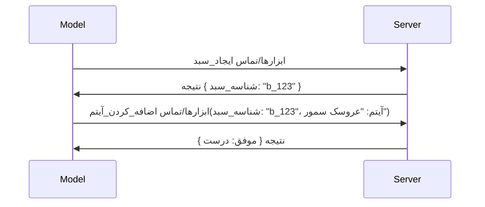

# چه تغییراتی در MCP رخ داده است: نسخه کاندید ۲۰۲۶-۰۷-۲۸

> **وضعیت:** نسخه کاندید. مشخصات `2026-07-28` در زمان نگارش نهایی نیست. در ۲۱ مه ۲۰۲۶ اعلام شده و برای عرضه در ۲۸ ژوئیه ۲۰۲۶ برنامه‌ریزی شده است. همه موارد در این درس نسخه کاندید را توصیف می‌کنند؛ قبل از ساختن روی آن، مشخصات پیش‌نویس [draft specification](https://modelcontextprotocol.io/specification/draft) و تغییرات آن [changelog](https://modelcontextprotocol.io/specification/draft/changelog) را برای آخرین وضعیت بررسی کنید. بقیه این آموزش بر اساس نسخه پایدار فعلی، **مشخصات MCP 2025-11-25** نوشته شده و پس از عرضه `2026-07-28` به‌روزرسانی خواهد شد.

## مروری کلی

`2026-07-28` بزرگ‌ترین بازبینی MCP از زمان شروع آن است. شش پیشنهاد بهبود مشخصات (SEPs) جلسات در سطح پروتکل را حذف کرده و MCP را در لایه انتقال بی‌حالت (stateless) می‌کند، افزونه‌ها به مکانیزمی درجه یک و نسخه‌دار تبدیل می‌شوند، و چند ویژگی که پیش‌تر در این آموزش یاد گرفته‌اید (ریشه‌ها، نمونه‌برداری، ثبت لاگ) تحت سیاست جدید چرخه عمر علامت‌گذاری شده‌اند که منسوخ شده‌اند. این درس خلاصه‌ای از تغییرات، اهمیت آنها، و معنای آن برای کدی که قبلاً روی `2025-11-25` نوشته‌اید را ارائه می‌دهد.

منبع: [نسخه کاندید مشخصات MCP 2026-07-28](https://blog.modelcontextprotocol.io/posts/2026-07-28-release-candidate/) (وبلاگ پروتکل مدل کانتکست، دیوید سوریه پارا و دن دلینارسکی).

## اهداف یادگیری

تا پایان این درس، شما قادر خواهید بود:

- توضیح دهید چرا MCP به هسته‌ای بی‌حالت حرکت می‌کند و این مشکل را در استقرارهای مقیاس‌پذیر افقی چه طور حل می‌کند.
- شرح دهید که چگونه دست دادن `initialize` / `initialized` و هدر `Mcp-Session-Id` جایگزین شده‌اند.
- هدرهای جدید `Mcp-Method` و `Mcp-Name` و متادیتای کش کردن `ttlMs`/`cacheScope` را تشخیص دهید.
- چارچوب افزونه‌ها و دو افزونه‌ای که با این نسخه ارائه شده‌اند: MCP Apps و Tasks را بشناسید.
- شش SEP مجوزدهی را که هم‌راستا با OAuth 2.0 / OIDC سخت‌گیرانه‌تر شده‌اند، لیست کنید.
- تشخیص دهید کدام ویژگی‌های اصلی (ریشه‌ها، نمونه‌برداری، ثبت لاگ) اکنون منسوخ شده‌اند و معنای عملی آن چیست.
- تغییر JSON Schema کامل ۲۰۲۰-۱۲ برای ورودی و خروجی ابزارها را توضیح دهید.

## پروتکل بی‌حالت

تغییر کلیدی: MCP در لایه پروتکل بی‌حالت می‌شود.

### قبل (2025-11-25): جلسات شما را به یک نمونه سرور خاص متصل می‌کردند

فراخوانی ابزار از طریق Streamable HTTP با یک دست دادن `initialize` شروع می‌شود. سرور با هدر `Mcp-Session-Id` پاسخ می‌دهد که هر درخواست بعدی باید آن را حمل کند:

```http
POST /mcp HTTP/1.1
Mcp-Session-Id: 1868a90c-3a3f-4f5b
Content-Type: application/json

{"jsonrpc":"2.0","id":2,"method":"tools/call",
 "params":{"name":"search","arguments":{"q":"otters"}}}
```

از آنجا که جلسه به نمونه‌ای از سرور که صادر کرده متصل است، استقرارهای مقیاس‌پذیر افقی نیاز به **مسیر یابی چسبنده** در بالانسر بار و **ذخیره جلسه مشترک** بین نمونه‌ها دارند.

### بعد (2026-07-28): هر درخواست مستقل است

```http
POST /mcp HTTP/1.1
MCP-Protocol-Version: 2026-07-28
Mcp-Method: tools/call
Mcp-Name: search
Content-Type: application/json

{"jsonrpc":"2.0","id":1,"method":"tools/call",
 "params":{"name":"search","arguments":{"q":"otters"},
           "_meta":{"io.modelcontextprotocol/clientInfo":{"name":"my-app","version":"1.0"}}}}
```

هر نمونه سرور می‌تواند این درخواست را پردازش کند. تغییرات کلیدی:

- **دست دادن `initialize`/`initialized` حذف شده است** ([SEP-2575](https://github.com/modelcontextprotocol/modelcontextprotocol/pull/2575)). نسخه پروتکل، اطلاعات مشتری، و قابلیت‌های مشتری به `_meta` در هر درخواست منتقل شده‌اند. متد جدید `server/discover` اجازه می‌دهد کلاینت در صورت نیاز قابلیت‌های سرور را از قبل دریافت کند.
- **هدر `Mcp-Session-Id` و جلسه در سطح پروتکل حذف شده‌اند** ([SEP-2567](https://github.com/modelcontextprotocol/modelcontextprotocol/pull/2567)). مسیر یابی چسبنده و ذخیره‌سازی مشترک جلسات در لایه پروتکل دیگر لازم نیست.

### پروتکل بی‌حالت، برنامه‌های حالت‌دار

حذف جلسه سطح پروتکل به این معنا نیست که سرور شما نمی‌تواند حالت‌دار باشد. الگوی پیشنهادی همان الگویی است که APIهای HTTP همیشه داشته‌اند: یک شناسه صریح (مثل `basket_id` یا `browser_id`) از یک فراخوانی ابزار استخراج کرده و مدل آن شناسه را در آرگومان‌های معمولی تماس‌های بعدی بازمی‌گرداند.



این کار حالت را نمایان و معقول به مدل عرضه می‌کند به‌جای اینکه آن را در متادیتای انتقال پنهان کند، و اجازه می‌دهد هر نمونه سرور هر تماس را پردازش کند.

### درخواست‌های سرور به کلاینت، بازساختار یافته

یک پروتکل بی‌حالت هنوز نیاز دارد راهی برای درخواست یک سرور به کلاینت برای دریافت چیزی در وسط فراخوانی داشته باشد (مثلاً درخواست پاسخ فوری):

- **درخواست‌های آغاز شده توسط سرور فقط هنگام پردازش فعال درخواست کلاینت مجازند** ([SEP-2260](https://github.com/modelcontextprotocol/modelcontextprotocol/pull/2260)) — که قبلاً توصیه بود و اکنون الزامی است. کاربر هیچ‌گاه ناگهانی درخواست نمی‌شود.
- **درخواست‌های چند دوری** ([SEP-2322](https://github.com/modelcontextprotocol/modelcontextprotocol/pull/2322)) جایگزین باز نگه داشتن یک جریان SSE شده‌اند. در عوض سرور `InputRequiredResult` بازمی‌گرداند:

  ```json
  {
    "resultType": "inputRequired",
    "inputRequests": {
      "confirm": {
        "type": "elicitation",
        "message": "Delete 3 files?",
        "schema": { "type": "boolean" }
      }
    },
    "requestState": "eyJzdGVwIjoxLCJmaWxlcyI6WyJhIiwiYiIsImMiXX0="
  }
  ```

  کلاینت پاسخ‌ها را جمع‌آوری کرده و تماس اصلی را با `inputResponses` به همراه `requestState` اکو شده دوباره ارسال می‌کند. هر نمونه سرور می‌تواند این تلاش مجدد را ادامه دهد چون همه چیز در داده‌های درخواست موجود است.

### قابل مسیریابی، کش و ردیابی

سه تغییر کوچک، کار کردن ترافیک بی‌حالت را آسان‌تر می‌کنند:

- **هدرهای `Mcp-Method` و `Mcp-Name` در Streamable HTTP الزامی شده‌اند** ([SEP-2243](https://github.com/modelcontextprotocol/modelcontextprotocol/pull/2243)) تا بالانسرها، دروازه‌ها، و محدودکننده‌های نرخ بتوانند بدون نگاه کردن به بدنه JSON، بر اساس عملیات مسیریابی کنند. سرورها درخواست‌هایی که هدر و بدنه آنها اختلاف دارد رد می‌کنند.
- **`tools/list` و نتایج خواندن منابع `ttlMs` و `cacheScope` دارند** ([SEP-2549](https://github.com/modelcontextprotocol/modelcontextprotocol/pull/2549)) که روی مدل HTTP `Cache-Control` طراحی شده‌اند. کلاینت‌ها می‌فهمند که نتیجه یک لیست چقدر تازه است و آیا امن است بین کاربران به اشتراک گذاشته شود، بدون نیاز به یک جریان SSE بلندمدت برای یادگیری تغییرات.
- **انتشار W3C Trace Context در `_meta` مستندسازی شده است** ([SEP-414](https://github.com/modelcontextprotocol/modelcontextprotocol/pull/414)) و نام کلیدهای `traceparent`، `tracestate`، و `baggage` را اصلاح می‌کند تا یک ردیابی توزیع‌شده بتواند تماس را در کلاینت SDK، سرور MCP، و سیستم‌های پایین‌دستی در یک بَک‌اند سازگار با [OpenTelemetry](https://opentelemetry.io/) دنبال کند.

## افزونه‌ها به درجه یک تبدیل می‌شوند

افزونه‌ها به‌طور غیررسمی در `2025-11-25` وجود داشتند. [SEP-2133](https://github.com/modelcontextprotocol/modelcontextprotocol/pull/2133) آنها را رسمی می‌کند:

- افزونه‌ها با شناسه‌های معکوس DNS شناسایی می‌شوند.
- آنها از طریق نقشه‌ای به نام `extensions` روی قابلیت‌های کلاینت و سرور مورد مذاکره قرار می‌گیرند.
- آنها در مخازن جداگانه `ext-*` با نگه‌دارندگان محول‌شده وجود دارند و به صورت مستقل از مشخصات اصلی نسخه‌بندی می‌شوند.
- مسیر جدیدی در فرآیند SEP برای افزونه‌ها دارد که به آنها اجازه می‌دهد از آزمایشی به رسمی پیشرفت کنند.

این نسخه دو افزونه رسمی را عرضه می‌کند.

### MCP Apps: رابط‌های کاربری سمت سرور

[MCP Apps](https://blog.modelcontextprotocol.io/posts/2026-01-26-mcp-apps/) ([SEP-1865](https://github.com/modelcontextprotocol/modelcontextprotocol/pull/1865)) به سرورها اجازه می‌دهد رابط‌های HTML تعاملی ارسال کنند که میزبان‌ها در iframe ایزوله‌شده ارائه می‌دهند. ابزارها الگوهای UI خود را از پیش اعلام می‌کنند تا میزبان‌ها بتوانند قبل از اجرا پیش‌بارگیری، کش و بررسی امنیتی انجام دهند. شما اصول این را قبلاً در [درس ۱۵: MCP Apps](../03-GettingStarted/15-mcp-apps/README.md) آموخته‌اید — تحت چارچوب افزونه‌ها، MCP Apps اکنون به صورت رسمی یک افزونه است نه یک ویژگی آزمایشی مرکزی.

### Tasks به افزونه ارتقا می‌یابد

Tasks به صورت یک ویژگی آزمایشی مرکزی در `2025-11-25` عرضه شده بود. استفاده تولیدی آن به اندازه‌ای بازطراحی نشان داد که مکان مناسبش یک افزونه است: افزونه [Tasks](https://github.com/modelcontextprotocol/modelcontextprotocol/pull/2663) چرخه عمر را حول مدل بی‌حالت بازآرایی می‌کند — سرور می‌تواند به `tools/call` یک شناسه تسک بدهد و کلاینت آن را با `tasks/get`، `tasks/update` و `tasks/cancel` پیش ببرد. ایجاد تسک سرور محور است: کلاینت افزونه را معرفی می‌کند و سرور تصمیم می‌گیرد چه زمانی یک فراخوان به صورت تسک اجرا شود. `tasks/list` کاملاً حذف شده چون بدون جلسه نمی‌توان آن را امن محدوده‌بندی کرد.

> **یادداشت مهاجرت:** اگر API تجربی `2025-11-25` Tasks را پیاده کرده‌اید، باید به چرخه عمر افزونه جدید مهاجرت کنید — این بازگشت‌ناپذیر است.

## سخت‌کردن مجوزدهی

شش SEP مشخصات [مجازسازی](https://modelcontextprotocol.io/specification/draft/basic/authorization) را برای هم‌سویی دقیق‌تر با استقرارهای واقعی OAuth 2.0 / OpenID Connect سخت‌تر کرده‌اند:

| SEP | تغییر |
|---|---|
| [SEP-2468](https://github.com/modelcontextprotocol/modelcontextprotocol/pull/2468) | کلاینت‌ها باید پارامتر `iss` را روی پاسخ‌های مجوزگیری مطابق با [RFC 9207](https://www.rfc-editor.org/rfc/rfc9207) اعتبارسنجی کنند که حملات مخلوط معمول در الگوی تک کلاینت، چند سرور MCP را کاهش می‌دهد. نسخه‌ای آینده نیاز به رد پاسخ‌های بدون `iss` خواهد داشت. |
| [SEP-837](https://github.com/modelcontextprotocol/modelcontextprotocol/pull/837) | کلاینت‌ها نوع برنامه OpenID Connect `application_type` را در ثبت کلاینت پویا اعلام می‌کنند، تا سرورهای مجوزگیری از پیش‌فرض شدن کلاینت دسکتاپ/CLI به `"web"` و رد URI محلی هدایت مجدد آن جلوگیری شود. |
| [SEP-2352](https://github.com/modelcontextprotocol/modelcontextprotocol/pull/2352) | کلاینت‌ها اعتبارنامه‌های ثبت‌شده را به `issuer` سرور مجوزدهی صادرکننده متصل می‌کنند و هنگام مهاجرت یک منبع بین سرورهای مجوزدهی دوباره ثبت نام می‌کنند. |
| [SEP-2207](https://github.com/modelcontextprotocol/modelcontextprotocol/pull/2207) | نحوه درخواست توکن‌های تازه‌سازی از سرورهای مجوزدهی به سبک OpenID Connect را مستندسازی می‌کند. |
| [SEP-2350](https://github.com/modelcontextprotocol/modelcontextprotocol/pull/2350) | توضیح شفاف‌تری درباره انباشت محدوده‌ها در مجوزدهی گام بالا ارائه می‌کند. |
| [SEP-2351](https://github.com/modelcontextprotocol/modelcontextprotocol/pull/2351) | توضیح واضح‌تر پسوند کشف `.well-known` را می‌دهد. |

اگر امروز یک سرور مجوزدهی برای MCP می‌سازید، همین حالا `iss` را روی پاسخ‌های مجوزدهی ارسال کنید — راهنمای فعلی مجوزدهی را در [02-Security](../02-Security/README.md) ببینید که این تغییر بر آن بنا خواهد شد.

## ریشه‌ها، نمونه‌برداری، و ثبت لاگ منسوخ شده‌اند

تحت [سیاست چرخه عمر ویژگی](https://github.com/modelcontextprotocol/modelcontextprotocol/pull/2577) جدید ([SEP-2577](https://github.com/modelcontextprotocol/modelcontextprotocol/pull/2577))، سه اصل کلاینت اصلی که در [مفاهیم اصلی](./README.md#roots) یاد گرفتید به وضعیت **منسوخ** منتقل شده‌اند:

| ویژگی | جایگزین پیشنهادی |
|---|---|
| ریشه‌ها | پارامترهای ابزار، URIهای منبع، یا پیکربندی سرور |
| نمونه‌برداری | ادغام مستقیم با APIهای ارائه‌دهندگان LLM |
| ثبت لاگ | `stderr` برای ترابری stdio؛ OpenTelemetry برای رصد ساختاریافته |

اینها **تنها منسوخ‌سازی با هشدار هستند**: متدها، نوع‌ها، و پرچم‌های قابلیت در این نسخه و در هر نسخه مشخصات منتشر شده ظرف یک سال پس از آن همچنان کار می‌کنند. حذف کامل آنها به SEP جداگانه‌ای تحت سیاست چرخه عمر نیاز دارد — بنابراین هیچ چیزی در نمونه‌های [نمونه‌برداری](../03-GettingStarted/14-sampling/README.md) شما امروز خراب نمی‌شود، اما سرورهای جدید باید الگوهای جایگزین بالا را ترجیح دهند.

## JSON Schema کامل ۲۰۲۰-۱۲ برای ابزارها

اسکیمای ورودی و خروجی ابزارها به [JSON Schema ۲۰۲۰-۱۲](https://json-schema.org/draft/2020-12) کامل ارتقا یافته‌اند ([SEP-2106](https://github.com/modelcontextprotocol/modelcontextprotocol/pull/2106)):

- اسکیمای ورودی همچنان محدود به `type: "object"` در ریشه است اما اکنون ترکیب (`oneOf`، `anyOf`، `allOf`)، شرطی‌ها، و ارجاعات (`$ref`، `$defs`) را اجازه می‌دهد.
- اسکیمای خروجی نامحدود است و `structuredContent` اکنون می‌تواند هر مقدار JSON باشد نه فقط یک شیء.
- پیاده‌سازی‌ها نباید خودکار به ارجاعات خارجی `$ref` مراجعه کنند و باید عمق اسکما و زمان اعتبارسنجی را محدود کنند (این یک مسئله جلوگیری از حملات امتناع سرویس است در صورتی که اسکماها سروری اعتبارسنجی شوند).

جداگانه، کد خطا برای منبع گمشده از مقدار خاص MCP `-32002` به مقدار استاندارد JSON-RPC `-32602` (پارامترهای نامعتبر) تغییر یافته است ([SEP-2164](https://github.com/modelcontextprotocol/modelcontextprotocol/pull/2164)). اگر کلاینت شما مطابق مقدار دقیق `-32002` است، باید به‌روزرسانی شود.

## نحوه پیشرفت پروتکل از اینجا

این نسخه شامل تغییرات مخرب است که مدیران MCP قصد ندارند به طور معمول ادامه یابد. سه SEP حاکمیتی برای جلوگیری از تکرار آن ارائه شده‌اند:

- **سیاست چرخه عمر ویژگی** به هر ویژگی مسیر فعال → منسوخ → حذف با حداقل دوازده ماه فاصله بین زمان منسوخ شدن و اولین زمان ممکن حذف داده است.
- **چارچوب افزونه‌ها** اجازه می‌دهد قابلیت‌های جدید به صورت افزونه‌های انتخابی عرضه شده و آنجا تثبیت شوند پیش از اینکه (اگر اصلاً) به مشخصات اصلی وارد شوند.

- یک SEP مسیر استاندارد دیگر نمی‌تواند به وضعیت نهایی برسد تا زمانی که یک سناریوی مطابق در [مجموعه انطباق](https://github.com/modelcontextprotocol/conformance) ([SEP-2484](https://github.com/modelcontextprotocol/modelcontextprotocol/pull/2484)) ارائه شود — همان مجموعه‌ای که [سیستم لایه‌بندی SDK](https://github.com/modelcontextprotocol/modelcontextprotocol/pull/1777) امتیاز SDKهای رسمی را بر اساس آن می‌دهد.

## جدول زمانی انتشار و اعتبارسنجی

- کاندیدای انتشار در 21 مه 2026 قفل شد.
- مشخصات نهایی برای 28 ژوئیه 2026 برنامه‌ریزی شده است.
- بازه زمانی ده هفته‌ای بین این دو به نگهدارندگان SDK و پیاده‌سازان مشتری اجازه می‌دهد تا تغییرات را در برابر بارهای کاری واقعی اعتبارسنجی کنند؛ از SDKهای لایه ۱ انتظار می‌رود که در این بازه تحت سیستم لایه‌بندی [SDK](https://modelcontextprotocol.io/docs/sdk) پشتیبانی را ارائه دهند.
- مجموعه کامل تغییرات را در [پیش‌نویس مشخصات](https://modelcontextprotocol.io/specification/draft) و [تغییرنامه](https://modelcontextprotocol.io/specification/draft/changelog) دنبال کنید.

## این برای این دوره آموزشی چه معنایی دارد

همه آنچه تاکنون در این دوره آموخته‌اید، مربوط به **2025-11-25** است، که تا انتشار نسخهٔ `2026-07-28`، مشخصات پایدار فعلی باقی خواهد ماند. به طور مشخص:

- **جلسات و دست دادن `initialize`** (که در [مفاهیم پایه](./README.md) و [درس 6: جریان HTTP](../03-GettingStarted/06-http-streaming/README.md) پوشش داده شده‌اند) همچنان به صورت مستند شده امروز کار می‌کنند، اما انتظار می‌رود با مدل درخواست بدون حالت بالا جایگزین شوند زمانی که به SDKهای سازگار با `2026-07-28` ارتقا دهید.
- **نمونه‌برداری و ریشه‌ها** (همچنین در [مفاهیم پایه](./README.md) پوشش داده شده‌اند) کماکان کامل عمل می‌کنند اما منسوخ شده‌اند — طراحی‌های جدید باید ترجیحاً الگوهای جایگزین فهرست شده در بالا را توصیه کنند.
- **ویژگی تجربی وظایف**، اگر از آن استفاده کرده‌اید، نیاز به مهاجرت به چرخه عمر جدید افزونه وظایف خواهد داشت.
- **برنامه‌های MCP** ([درس 15](../03-GettingStarted/15-mcp-apps/README.md)) عملاً تحت تاثیر قرار نمی‌گیرند؛ فقط به چارچوب رسمی افزونه‌ها منتقل می‌شوند.

## منابع بیشتر

- [کاندیدای انتشار مشخصات MCP تاریخ 2026-07-28 (پست وبلاگ)](https://blog.modelcontextprotocol.io/posts/2026-07-28-release-candidate/)
- [آینده حمل‌ونقل‌های MCP](https://blog.modelcontextprotocol.io/posts/2025-12-19-mcp-transport-future/)
- [پیش‌نویس مشخصات MCP](https://modelcontextprotocol.io/specification/draft)
- [تغییرنامه پیش‌نویس MCP](https://modelcontextprotocol.io/specification/draft/changelog)
- [دستورالعمل‌های SEP](https://modelcontextprotocol.io/community/sep-guidelines)
- [سیستم لایه‌بندی SDK MCP](https://modelcontextprotocol.io/docs/sdk)

## مراحل بعدی

به [مفاهیم پایه](./README.md) بازگردید یا ادامه دهید به [امنیت](../02-Security/README.md) تا ببینید چگونه راهنمایی‌های `2025-11-25` امروز با آنچه در آینده می‌آید هماهنگ می‌شوند.

---

<!-- CO-OP TRANSLATOR DISCLAIMER START -->
**سلب مسئولیت**:
این سند با استفاده از سرویس ترجمه هوش مصنوعی [Co-op Translator](https://github.com/Azure/co-op-translator) ترجمه شده است. در حالی که ما در تلاش برای دقت هستیم، لطفاً توجه داشته باشید که ترجمه‌های خودکار ممکن است شامل خطاها یا نادرستی‌هایی باشند. سند اصلی به زبان مادری خود باید به عنوان منبع معتبر در نظر گرفته شود. برای اطلاعات حیاتی، ترجمه حرفه‌ای انسانی توصیه می‌شود. ما در قبال هرگونه سوء تفاهم یا برداشت نادرست ناشی از استفاده از این ترجمه مسئولیتی نداریم.
<!-- CO-OP TRANSLATOR DISCLAIMER END -->