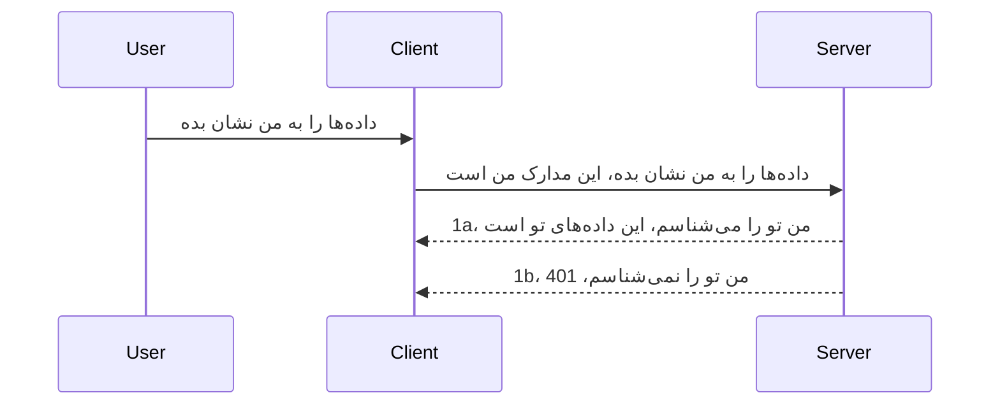

# احراز هویت ساده

SDKهای MCP از OAuth 2.1 پشتیبانی می‌کنند که باید گفت فرایندی نسبتاً پیچیده است و شامل مفاهیمی مانند سرور احراز هویت، سرور منابع، ارسال اطلاعات ورود، دریافت کد، تبادل کد برای توکن حامل تا اینکه در نهایت بتوانید داده‌های منبع خود را دریافت کنید. اگر با OAuth آشنا نیستید که واقعاً چیز بسیار خوبی برای پیاده‌سازی است، ایده خوبی است که با یک سطح پایه از احراز هویت شروع کنید و به تدریج امنیت بهتری بسازید. به همین دلیل این فصل وجود دارد، تا شما را به سمت احراز هویت پیشرفته‌تر هدایت کند.

## احراز هویت، منظور ما چیست؟

احراز هویت کوتاه‌شده authentication و authorization است. ایده این است که ما باید دو کار انجام دهیم:

- **تأیید هویت (Authentication)**، که پروسه فهمیدن اینکه آیا اجازه ورود به یک نفر را می‌دهیم یا خیر است، یعنی اینکه آنها حق "حضور" دارند و به سرور منابع ما که ویژگی‌های MCP Server در آن قرار دارند دسترسی دارند.
- **مجوز دادن (Authorization)**، فرایند پیدا کردن اینکه آیا یک کاربر باید به این منابع خاصی که درخواست می‌کند دسترسی داشته باشد، مثلاً این سفارش‌ها یا این محصولات، یا اینکه اجازه دارد محتوا را بخواند اما اجازه حذف آن را ندارد به عنوان مثال دیگری.

## مدارک هویتی: چگونه به سیستم می‌گوییم که ما کی هستیم

خب، بیشتر توسعه‌دهندگان وب اینگونه فکر می‌کنند که یک مدرک هویتی باید به سرور ارائه شود، معمولاً یک راز که می‌گوید آیا آنها اجازه حضور دارند "تأیید هویت". این مدرک معمولاً نسخه‌ای به‌صورت base64 رمزگذاری شده از نام کاربری و رمز عبور یا کلید API است که کاربر خاصی را مشخص می‌کند.

این شامل ارسال آن از طریق هدر "Authorization" به شکل زیر است:

```json
{ "Authorization": "secret123" }
```

این معمولاً به عنوان احراز هویت پایه شناخته می‌شود. روند کلی کار به این صورت است:



حالا که از نظر روند کار آن را فهمیدیم، چگونه آن را پیاده‌سازی کنیم؟ خوب، اکثر وب‌سرورها مفهومی به نام middleware دارند، بخشی از کد که به عنوان بخشی از درخواست اجرا می‌شود که می‌تواند اعتبارسنجی مدارک انجام دهد، و اگر مدارک معتبر باشند اجازه عبور به درخواست را می‌دهد. اگر درخواست مدارک معتبری نداشته باشد خطای احراز هویت دریافت می‌کنید. بیایید ببینیم چگونه می‌توان این را پیاده‌سازی کرد:

**پایتون**

```python
class AuthMiddleware(BaseHTTPMiddleware):
    async def dispatch(self, request, call_next):

        has_header = request.headers.get("Authorization")
        if not has_header:
            print("-> Missing Authorization header!")
            return Response(status_code=401, content="Unauthorized")

        if not valid_token(has_header):
            print("-> Invalid token!")
            return Response(status_code=403, content="Forbidden")

        print("Valid token, proceeding...")
       
        response = await call_next(request)
        # هر هدر مشتری را اضافه کنید یا به نحوی پاسخ را تغییر دهید
        return response


starlette_app.add_middleware(CustomHeaderMiddleware)
```

اینجا ما:

- middlewareی به نام `AuthMiddleware` ساختیم که متد `dispatch` آن توسط وب سرور فراخوانی می‌شود.
- middleware را به وب سرور اضافه کردیم:

    ```python
    starlette_app.add_middleware(AuthMiddleware)
    ```

- منطق اعتبارسنجی نوشته شده که چک می‌کند آیا هدر Authorization وجود دارد و آیا راز ارسالی معتبر است:

    ```python
    has_header = request.headers.get("Authorization")
    if not has_header:
        print("-> Missing Authorization header!")
        return Response(status_code=401, content="Unauthorized")

    if not valid_token(has_header):
        print("-> Invalid token!")
        return Response(status_code=403, content="Forbidden")
    ```

    اگر راز حضور و معتبر باشد درخواست را با فراخوانی `call_next` عبور داده و پاسخ را بازمی‌گردانیم.

    ```python
    response = await call_next(request)
    # افزودن هرگونه هدر مشتری یا تغییر در پاسخ به روشی خاص
    return response
    ```

روند کار این است که اگر یک درخواست وب به سمت سرور انجام شود، این middleware فراخوانی شده و با توجه به پیاده‌سازی آن یا اجازه می‌دهد درخواست عبور کند یا در نهایت خطایی باز می‌گرداند که نشان می‌دهد مشتری اجازه ادامه ندارد.

**تایپ‌اسکریپت**

اینجا یک middleware با فریم‌ورک محبوب Express می‌سازیم و قبل از رسیدن درخواست به MCP Server آن را intercept می‌کنیم. این کد برای آن است:

```typescript
function isValid(secret) {
    return secret === "secret123";
}

app.use((req, res, next) => {
    // ۱. آیا هدر احراز هویت موجود است؟
    if(!req.headers["Authorization"]) {
        res.status(401).send('Unauthorized');
    }
    
    let token = req.headers["Authorization"];

    // ۲. اعتبارسنجی را بررسی کنید.
    if(!isValid(token)) {
        res.status(403).send('Forbidden');
    }

   
    console.log('Middleware executed');
    // ۳. درخواست را به مرحله بعدی در خط لوله درخواست منتقل می‌کند.
    next();
});
```

در این کد ما:

1. چک می‌کنیم که هدر Authorization ابتدا وجود دارد، اگر نه، خطای 401 می‌فرستیم.
2. اعتبار مدرک/توکن را بررسی می‌کنیم، اگر معتبر نبود، خطای 403 می‌فرستیم.
3. در نهایت اجازه می‌دهیم درخواست در pipeline پردازش شود و منبع درخواستی را بازمی‌گرداند.

## تمرین: پیاده‌سازی احراز هویت

بیایید دانش خود را بگیریم و سعی کنیم آن را پیاده‌سازی کنیم. طرح کار این است:

سرور

- یک وب سرور و نمونه MCP می‌سازیم.
- یک middleware برای سرور پیاده‌سازی می‌کنیم.

مشتری

- ارسال درخواست وب، همراه با مدرک، از طریق header.

### -1- ایجاد وب سرور و نمونه MCP

> **نگاهی به جلو:** مثال تایپ‌اسکریپت زیر، انتقال‌های HTTP را در یک نقشه `transports` بر اساس کلید `mcp-session-id` ردیابی می‌کند، طبق **مشخصات MCP 2025-11-25**. نسخه پیش‌انتشار `2026-07-28` تبادل اولیه (handshake) و شناسه جلسه (session ID) را کاملاً حذف می‌کند، بنابراین این نقشه انتقال به ازای هر جلسه حذف شده و به درخواست‌های بدون حالت (stateless) و خودمتشکل جایگزین می‌شود. ببینید [چه تغییراتی در MCP رخ می‌دهد: نسخه پیش‌انتشار 2026-07-28](../../01-CoreConcepts/mcp-2026-07-28-release-candidate.md).

در گام اول، نیاز داریم که نمونه وب سرور و MCP Server را بسازیم.

**پایتون**

اینجا یک نمونه MCP سرور می‌سازیم، یک اپ استارلت ایجاد می‌کنیم و آن را با uwvicorn میزبانی می‌کنیم.

```python
# ایجاد سرور MCP

app = FastMCP(
    name="MCP Resource Server",
    instructions="Resource Server that validates tokens via Authorization Server introspection",
    host=settings["host"],
    port=settings["port"],
    debug=True
)

# ایجاد برنامه وب starlette
starlette_app = app.streamable_http_app()

# ارائه برنامه از طریق uvicorn
async def run(starlette_app):
    import uvicorn
    config = uvicorn.Config(
            starlette_app,
            host=app.settings.host,
            port=app.settings.port,
            log_level=app.settings.log_level.lower(),
        )
    server = uvicorn.Server(config)
    await server.serve()

run(starlette_app)
```

در این کد ما:

- MCP Server را ساختیم.
- اپ استارلت را از MCP Server ساخته‌ایم، `app.streamable_http_app()`.
- با استفاده از uvicorn اپ را اجرا و میزبانی کردیم `server.serve()`.

**تایپ‌اسکریپت**

اینجا نمونه MCP Server ساخته می‌شود.

```typescript
const server = new McpServer({
      name: "example-server",
      version: "1.0.0"
    });

    // ... راه‌اندازی منابع سرور، ابزارها و درخواست‌ها ...
```

این ساخت MCP Server باید درون تعریف مسیر POST /mcp انجام شود، پس کد بالا را به این صورت جا به جا می‌کنیم:

```typescript
import express from "express";
import { randomUUID } from "node:crypto";
import { McpServer } from "@modelcontextprotocol/sdk/server/mcp.js";
import { StreamableHTTPServerTransport } from "@modelcontextprotocol/sdk/server/streamableHttp.js";
import { isInitializeRequest } from "@modelcontextprotocol/sdk/types.js"

const app = express();
app.use(express.json());

// نقشه برای ذخیره ترنسپورت‌ها با شناسه جلسه
const transports: { [sessionId: string]: StreamableHTTPServerTransport } = {};

// مدیریت درخواست‌های POST برای ارتباط کلاینت به سرور
app.post('/mcp', async (req, res) => {
  // بررسی وجود شناسه جلسه
  const sessionId = req.headers['mcp-session-id'] as string | undefined;
  let transport: StreamableHTTPServerTransport;

  if (sessionId && transports[sessionId]) {
    // استفاده مجدد از ترنسپورت موجود
    transport = transports[sessionId];
  } else if (!sessionId && isInitializeRequest(req.body)) {
    // درخواست مقداردهی اولیه جدید
    transport = new StreamableHTTPServerTransport({
      sessionIdGenerator: () => randomUUID(),
      onsessioninitialized: (sessionId) => {
        // ذخیره ترنسپورت بر اساس شناسه جلسه
        transports[sessionId] = transport;
      },
      // محافظت در برابر DNS rebinding به صورت پیش‌فرض برای سازگاری با نسخه‌های قبلی غیرفعال است. اگر این سرور را
      // به صورت محلی اجرا می‌کنید، مطمئن شوید که تنظیمات زیر را دارید:
      // enableDnsRebindingProtection: true,
      // allowedHosts: ['127.0.0.1'],
    });

    // پاک‌سازی ترنسپورت زمانی که بسته شود
    transport.onclose = () => {
      if (transport.sessionId) {
        delete transports[transport.sessionId];
      }
    };
    const server = new McpServer({
      name: "example-server",
      version: "1.0.0"
    });

    // ... راه‌اندازی منابع سرور، ابزارها و نمایش‌ها ...

    // اتصال به سرور MCP
    await server.connect(transport);
  } else {
    // درخواست نامعتبر
    res.status(400).json({
      jsonrpc: '2.0',
      error: {
        code: -32000,
        message: 'Bad Request: No valid session ID provided',
      },
      id: null,
    });
    return;
  }

  // مدیریت درخواست
  await transport.handleRequest(req, res, req.body);
});

// هندلر قابل استفاده مجدد برای درخواست‌های GET و DELETE
const handleSessionRequest = async (req: express.Request, res: express.Response) => {
  const sessionId = req.headers['mcp-session-id'] as string | undefined;
  if (!sessionId || !transports[sessionId]) {
    res.status(400).send('Invalid or missing session ID');
    return;
  }
  
  const transport = transports[sessionId];
  await transport.handleRequest(req, res);
};

// مدیریت درخواست‌های GET برای اعلان‌های سرور به کلاینت از طریق SSE
app.get('/mcp', handleSessionRequest);

// مدیریت درخواست‌های DELETE برای خاتمه جلسه
app.delete('/mcp', handleSessionRequest);

app.listen(3000);
```

اکنون می‌بینید که ایجاد MCP Server درون `app.post("/mcp")` منتقل شده است.

بیایید به مرحله بعدی ساخت middleware برای اعتبارسنجی مدرک ورودی برویم.

### -2- پیاده‌سازی middleware برای سرور

بیایید به بخش middleware برویم. اینجا ما middleware می‌سازیم که به دنبال مدرکی در هدر `Authorization` می‌گردد و آن را اعتبارسنجی می‌کند. اگر قابل قبول بود درخواست به کار خود ادامه می‌دهد (مثلاً فهرست ابزارها، خواندن منبع یا هر عملکرد MCP که مشتری درخواست کرده است).

**پایتون**

برای ساخت middleware، باید یک کلاس ساخت که از `BaseHTTPMiddleware` ارث‌بری کند. دو بخش جالب است:

- درخواست `request`، که اطلاعات هدر را از آن می‌خوانیم.
- `call_next` کال‌بکی که اگر مشتری مدرکی آورد که می‌پذیریم باید فراخوانی کنیم.

اول باید مدیریت کنیم که اگر هدر `Authorization` وجود ندارد:

```python
has_header = request.headers.get("Authorization")

# هدر موجود نیست، با کد ۴۰۱ خطا بده، در غیر این صورت ادامه بده.
if not has_header:
    print("-> Missing Authorization header!")
    return Response(status_code=401, content="Unauthorized")
```

اینجا پیام 401 unauthorized می‌فرستیم چون مشتری در تأیید هویت شکست خورده است.

سپس اگر مدرکی ارسال شد، باید اعتبار آن را اینگونه بررسی کنیم:

```python
 if not valid_token(has_header):
    print("-> Invalid token!")
    return Response(status_code=403, content="Forbidden")
```

توجه کنید که در بالا پیام 403 forbidden فرستاده شده است. بیایید کل middleware را که همه موارد بالا را پیاده‌سازی می‌کند ببینیم:

```python
class AuthMiddleware(BaseHTTPMiddleware):
    async def dispatch(self, request, call_next):

        has_header = request.headers.get("Authorization")
        if not has_header:
            print("-> Missing Authorization header!")
            return Response(status_code=401, content="Unauthorized")

        if not valid_token(has_header):
            print("-> Invalid token!")
            return Response(status_code=403, content="Forbidden")

        print("Valid token, proceeding...")
        print(f"-> Received {request.method} {request.url}")
        response = await call_next(request)
        response.headers['Custom'] = 'Example'
        return response

```

عالی، اما تابع `valid_token` چطور؟ اینجا قرار دارد:

```python
# برای تولید استفاده نکنید - آن را بهبود دهید !!
def valid_token(token: str) -> bool:
    # حذف پیشوند "Bearer "
    if token.startswith("Bearer "):
        token = token[7:]
        return token == "secret-token"
    return False
```

البته این باید بهبود یابد.

مهم: شما نباید هرگز اسراری مثل این را در کد قرار دهید. بهتر است مقدار مقایسه را از یک منبع داده یا سرویس ارائه دهنده هویت (IDP) دریافت کنید یا بهتر از آن، اعتبارسنجی را به IDP واگذار کنید.

**تایپ‌اسکریپت**

برای پیاده‌سازی با Express باید متد `use` را استفاده کنیم که توابع middleware را می‌گیرد.

لازم است که:

- با متغیر درخواست تعامل کنیم و مدرک ارسال شده را در خصوصیت `Authorization` چک کنیم.
- مدرک را اعتبارسنجی کنیم، اگر معتبر بود اجازه ادامه درخواست و انجام عملکرد MCP از طرف مشتری را بدهیم (مثلاً فهرست ابزارها، خواندن منبع یا هر مورد MCP مرتبط دیگر).

اینجا چک می‌کنیم که هدر `Authorization` وجود دارد یا نه و اگر نیست، درخواست را متوقف می‌کنیم:

```typescript
if(!req.headers["authorization"]) {
    res.status(401).send('Unauthorized');
    return;
}
```

اگر هدر اصلاً ارسال نشده باشد، خطای 401 دریافت می‌کنید.

سپس اعتبار مدرک را بررسی می‌کنیم، اگر معتبر نبود دوباره درخواست را متوقف می‌کنیم اما با پیامی کمی متفاوت:

```typescript
if(!isValid(token)) {
    res.status(403).send('Forbidden');
    return;
} 
```

مشاهده می‌کنید که حالا خطای 403 دریافت می‌کنید.

کد کامل اینجاست:

```typescript
app.use((req, res, next) => {
    console.log('Request received:', req.method, req.url, req.headers);
    console.log('Headers:', req.headers["authorization"]);
    if(!req.headers["authorization"]) {
        res.status(401).send('Unauthorized');
        return;
    }
    
    let token = req.headers["authorization"];

    if(!isValid(token)) {
        res.status(403).send('Forbidden');
        return;
    }  

    console.log('Middleware executed');
    next();
});
```

سرور وب را طوری تنظیم کردیم که middleware برای بررسی مدرک مشتری که امیدواریم ارسال کند داشته باشد. حال خود مشتری چطور؟

### -3- ارسال درخواست وب با مدرک از طریق header

باید اطمینان حاصل کنیم که مشتری مدرک را از طریق header عبور می‌دهد. چون قرار است از کلاینت MCP استفاده کنیم، باید بفهمیم چگونه این انجام می‌شود.

**پایتون**

برای مشتری باید هدر حاوی مدرکمان را اینگونه ارسال کنیم:

```python
# مقدار را به صورت سخت‌کد شده قرار ندهید، حداقل آن را در یک متغیر محیطی یا یک ذخیره‌سازی امن‌تر نگه دارید
token = "secret-token"

async with streamablehttp_client(
        url = f"http://localhost:{port}/mcp",
        headers = {"Authorization": f"Bearer {token}"}
    ) as (
        read_stream,
        write_stream,
        session_callback,
    ):
        async with ClientSession(
            read_stream,
            write_stream
        ) as session:
            await session.initialize()
      
            # کارهای انجام‌نشده، چیزی که می‌خواهید در کلاینت انجام شود، مثلاً لیست کردن ابزارها، فراخوانی ابزارها و غیره
```

توجه کنید که چگونه `headers` را به این شکل پر می‌کنیم ` headers = {"Authorization": f"Bearer {token}"}`.

**تایپ‌اسکریپت**

می‌توانیم این کار را در دو گام حل کنیم:

1. یک شیء پیکربندی با مدرک خود پر کنیم.
2. شیء پیکربندی را به ترنسپورت پاس دهیم.

```typescript

// ارزش را به صورت کد شده سخت مانند اینجا قرار ندهید. حداقل آن را به عنوان یک متغیر محیطی داشته باشید و چیزی مانند dotenv (در حالت توسعه) استفاده کنید.
let token = "secret123"

// تعریف یک شیء گزینه حمل و نقل مشتری
let options: StreamableHTTPClientTransportOptions = {
  sessionId: sessionId,
  requestInit: {
    headers: {
      "Authorization": "secret123"
    }
  }
};

// شیء گزینه‌ها را به حمل و نقل ارسال کنید
async function main() {
   const transport = new StreamableHTTPClientTransport(
      new URL(serverUrl),
      options
   );
```

اینجا مشاهده می‌کنید چطور یک شیء `options` ایجاد شده و هدرها تحت خصوصیت `requestInit` قرار گرفته‌اند.

مهم: چگونه می‌توانیم آن را بهتر کنیم؟ خب، پیاده‌سازی فعلی معایبی دارد. اول اینکه ارسال مدرک به این شکل بسیار ریسک است مگر اینکه حداقل HTTPS داشته باشید. حتی آن وقت، مدرک ممکن است دزدیده شود، بنابراین به سیستمی نیاز دارید که به راحتی بتوانید توکن را لغو کنید و بررسی‌های اضافی انجام دهید مثل از کجا در جهان آمده، آیا درخواست‌ها خیلی زیاد است (رفتار ربات‌گونه)، کوتاه اینکه مسائل زیادی وجود دارد.

با این حال، باید گفت، برای APIهای بسیار ساده که نمی‌خواهید کسی بتواند بدون احراز هویت به API شما دسترسی داشته باشد، همین چیزی که اینجا داریم شروع خوبی است.

با این توضیح، بیایید کمی امنیت را سخت‌تر کنیم با استفاده از فرمت استانداردی مانند JSON Web Token که به اختصار JWT یا توکن‌های "JOT" نامیده می‌شود.

## توکن‌های وب JSON، JWT

بنابراین، ما در حال بهبود ارسال مدارک بسیار ساده هستیم. بهبودهای فوری که با استفاده از JWT به دست می‌آوریم چیست؟

- **بهبودهای امنیتی**. در احراز هویت پایه، شما نام کاربری و رمز عبور را به عنوان یک توکن رمزگذاری شده base64 (یا کلید API) بارها و بارها ارسال می‌کنید که ریسک را افزایش می‌دهد. با JWT، شما نام کاربری و رمز عبور خود را می‌دهید و در عوض یک توکن دریافت می‌کنید که همچنین محدودیت زمانی دارد یعنی منقضی می‌شود. JWT به شما اجازه می‌دهد به راحتی کنترل دسترسی دقیق همراه با نقش‌ها، حوزه‌ها و مجوزها را پیاده کنید.
- **بدون حالت بودن و مقیاس‌پذیری**. JWTها خودمتشکل هستند، تمام اطلاعات کاربر را دارند و نیاز به ذخیره‌سازی جلسه سمت سرور را حذف می‌کنند. توکن همچنین می‌تواند به صورت محلی اعتبارسنجی شود.
- **همکاری‌پذیری و اتحاد (Federation)**. JWTها در هسته Open ID Connect هستند و با ارائه‌دهندگان هویت شناخته شده مثل Entra ID، Google Identity و Auth0 استفاده می‌شوند. این‌ها همچنین امکان ورود یکپارچه و بسیاری امکانات دیگر را می‌دهد که مقیاس شرکتی می‌شود.
- **ماژولار بودن و انعطاف‌پذیری**. JWTها همچنین می‌توانند با دروازه‌های API مانند Azure API Management، NGINX و غیره استفاده شوند. همچنین از سناریوهای احراز هویت کاربر و ارتباط سرویس به سرویس شامل جعل هویت و واگذاری پشتیبانی می‌کند.
- **عملکرد و کشینگ**. JWTها می‌توانند پس از رمزگشایی کش شوند که نیاز به پارس کردن مکرر را کاهش می‌دهد. این به‌ویژه برای برنامه‌های ترافیک بالا کمک می‌کند چون توان عملیاتی را افزایش داده و بار زیرساخت انتخابی شما را کاهش می‌دهد.
- **ویژگی‌های پیشرفته**. همچنین از introspection (بررسی اعتبار در سرور) و revocation (باطل‌سازی توکن) پشتیبانی می‌کند.

با تمام این مزایا، بیایید ببینیم چگونه می‌توانیم پیاده‌سازی‌مان را به سطح بعدی ببریم.

## تبدیل احراز هویت پایه به JWT

پس تغییراتی که در سطح کلی باید انجام دهیم عبارتند از:

- **یادگیری ساخت توکن JWT** و آماده کردن آن برای ارسال از کلاینت به سرور.
- **اعتبارسنجی توکن JWT** و اگر معتبر بود اجازه دادن به کلاینت برای دسترسی به منابع ما.
- **ذخیره ایمن توکن**. چگونه این توکن را ذخیره کنیم.
- **محافظت از مسیرها**. باید مسیرها و ویژگی‌های خاص MCP را محافظت کنیم.
- **افزودن توکن‌های تازه‌سازی**. اطمینان از ساخت توکن‌هایی که کوتاه‌مدت هستند، ولی توکن‌های تازه‌سازی که بلندمدت‌اند ساخته شوند و بتوان برای گرفتن توکن‌های جدید در صورت انقضا از آنها استفاده کرد. همچنین باید نقطه انتهایی تازه‌سازی و استراتژی چرخش توکن داشته باشیم.

### -1- ساخت توکن JWT

اول اینکه، یک توکن JWT شامل قسمت‌های زیر است:

- **سرصفحه (header)**، الگوریتم استفاده شده و نوع توکن.
- **بار (payload)**، ادعاها، مثل sub (کاربر یا موجودی که توکن نمایندگی می‌کند. در سناریوی احراز هویت معمولاً شناسه کاربری است)، exp (زمان انقضا) role (نقش)
- **امضاء (signature)**، با استفاده از راز یا کلید خصوصی امضا شده.

برای این بخش، باید سرصفحه، بار و توکن کد شده را بسازیم.

**پایتون**

```python

import jwt
import jwt
from jwt.exceptions import ExpiredSignatureError, InvalidTokenError
import datetime

# کلید مخفی استفاده شده برای امضای JWT
secret_key = 'your-secret-key'

header = {
    "alg": "HS256",
    "typ": "JWT"
}

# اطلاعات کاربر و ادعاها و زمان انقضای آن
payload = {
    "sub": "1234567890",               # موضوع (شناسه کاربر)
    "name": "User Userson",                # ادعای سفارشی
    "admin": True,                     # ادعای سفارشی
    "iat": datetime.datetime.utcnow(),# صادر شده در
    "exp": datetime.datetime.utcnow() + datetime.timedelta(hours=1)  # انقضاء
}

# رمزگذاری آن
encoded_jwt = jwt.encode(payload, secret_key, algorithm="HS256", headers=header)
```

در کد بالا ما:

- سرصفحه‌ای با الگوریتم HS256 و نوع JWT تعریف کردیم.
- باری ساختیم که شامل subject یا شناسه کاربر، نام کاربری، نقش، زمان صدور و زمان انقضا است که جنبه زمان‌بندی را پیاده‌سازی می‌کند.

**تایپ‌اسکریپت**

اینجا به برخی وابستگی‌ها نیاز داریم که به ساخت توکن JWT کمک می‌کنند.

وابستگی‌ها

```sh

npm install jsonwebtoken
npm install --save-dev @types/jsonwebtoken
```

حالا که آن را آماده کردیم، بیایید سرصفحه، بار و با آن توکن کد شده را بسازیم.

```typescript
import jwt from 'jsonwebtoken';

const secretKey = 'your-secret-key'; // استفاده از متغیرهای محیطی در تولید

// تعریف داده‌های ارسالی
const payload = {
  sub: '1234567890',
  name: 'User usersson',
  admin: true,
  iat: Math.floor(Date.now() / 1000), // صادر شده در
  exp: Math.floor(Date.now() / 1000) + 60 * 60 // منقضی در ۱ ساعت
};

// تعریف سربرگ (اختیاری، jsonwebtoken مقادیر پیش‌فرض را تنظیم می‌کند)
const header = {
  alg: 'HS256',
  typ: 'JWT'
};

// ایجاد توکن
const token = jwt.sign(payload, secretKey, {
  algorithm: 'HS256',
  header: header
});

console.log('JWT:', token);
```

این توکن:

با HS256 امضا شده
برای ۱ ساعت معتبر است
شامل ادعاهایی مثل sub، name، admin، iat و exp است.

### -2- اعتبارسنجی توکن

ما همچنین نیاز داریم توکن را اعتبارسنجی کنیم، این کاری است که باید روی سرور انجام شود تا مطمئن شویم آنچه مشتری ارسال می‌کند معتبر است. بررسی‌های بسیاری باید انجام شود از جمله اعتبار ساختار تا اعتبار واقعی آن. همچنین تشویق می‌شوید بررسی‌های دیگر انجام دهید تا مطمئن شوید کاربر در سیستم شما هست و موارد دیگر.

برای اعتبارسنجی توکن، باید آن را رمزگشایی کنیم تا بتوانیم بخوانیم و سپس اعتبار آن را بررسی کنیم:

**پایتون**

```python

# رمزگشایی و اعتبارسنجی JWT
try:
    decoded = jwt.decode(token, secret_key, algorithms=["HS256"])
    print("✅ Token is valid.")
    print("Decoded claims:")
    for key, value in decoded.items():
        print(f"  {key}: {value}")
except ExpiredSignatureError:
    print("❌ Token has expired.")
except InvalidTokenError as e:
    print(f"❌ Invalid token: {e}")

```


در این کد، ما `jwt.decode` را با استفاده از توکن، کلید مخفی و الگوریتم انتخاب‌شده به عنوان ورودی فراخوانی می‌کنیم. توجه کنید که چگونه از ساختار try-catch استفاده می‌کنیم زیرا اعتبارسنجی ناموفق منجر به بروز خطا می‌شود.

**TypeScript**

در اینجا باید `jwt.verify` را فراخوانی کنیم تا نسخه‌ای رمزگشایی شده از توکن را دریافت کنیم که بتوانیم بیشتر تحلیل کنیم. اگر این فراخوانی شکست بخورد، به این معنی است که ساختار توکن نادرست است یا دیگر معتبر نیست.

```typescript

try {
  const decoded = jwt.verify(token, secretKey);
  console.log('Decoded Payload:', decoded);
} catch (err) {
  console.error('Token verification failed:', err);
}
```

توجه: همانطور که قبلاً ذکر شد، باید بررسی‌های اضافی انجام دهیم تا اطمینان حاصل کنیم این توکن به یک کاربر در سیستم ما اشاره دارد و اطمینان حاصل کنیم کاربر دارای دسترسی‌هایی است که ادعا می‌کند.

حال بیایید به کنترل دسترسی مبتنی بر نقش نگاه کنیم، که به آن RBAC نیز گفته می‌شود.

## افزودن کنترل دسترسی مبتنی بر نقش

ایده این است که می‌خواهیم بیان کنیم نقش‌های مختلف مجوزهای متفاوتی دارند. برای مثال، فرض می‌کنیم یک ادمین می‌تواند همه کارها را انجام دهد، یک کاربر عادی می‌تواند فقط خواندن و نوشتن انجام دهد و مهمان فقط می‌تواند بخواند. بنابراین، در اینجا چند سطح دسترسی ممکن است:

- Admin.Write 
- User.Read
- Guest.Read

بیایید بررسی کنیم چگونه می‌توان چنین کنترلی را با میان‌افزار پیاده‌سازی کرد. میان‌افزارها می‌توانند به صورت جداگانه برای هر مسیر و همچنین برای همه مسیرها اضافه شوند.

**Python**

```python
from starlette.middleware.base import BaseHTTPMiddleware
from starlette.responses import JSONResponse
import jwt

# رمز مخفی را در کد قرار ندهید، این تنها برای اهداف نمایشی است. آن را از جایی امن بخوانید.
SECRET_KEY = "your-secret-key" # این را در متغیر محیطی قرار دهید
REQUIRED_PERMISSION = "User.Read"

class JWTPermissionMiddleware(BaseHTTPMiddleware):
    async def dispatch(self, request, call_next):
        auth_header = request.headers.get("Authorization")
        if not auth_header or not auth_header.startswith("Bearer "):
            return JSONResponse({"error": "Missing or invalid Authorization header"}, status_code=401)

        token = auth_header.split(" ")[1]
        try:
            decoded = jwt.decode(token, SECRET_KEY, algorithms=["HS256"])
        except jwt.ExpiredSignatureError:
            return JSONResponse({"error": "Token expired"}, status_code=401)
        except jwt.InvalidTokenError:
            return JSONResponse({"error": "Invalid token"}, status_code=401)

        permissions = decoded.get("permissions", [])
        if REQUIRED_PERMISSION not in permissions:
            return JSONResponse({"error": "Permission denied"}, status_code=403)

        request.state.user = decoded
        return await call_next(request)


```

چند روش مختلف برای افزودن میان‌افزار مانند زیر وجود دارد:

```python

# گزینه ۱: افزودن میان‌افزار هنگام ساخت برنامه استارلت
middleware = [
    Middleware(JWTPermissionMiddleware)
]

app = Starlette(routes=routes, middleware=middleware)

# گزینه ۲: افزودن میان‌افزار پس از ساخت برنامه استارلت
starlette_app.add_middleware(JWTPermissionMiddleware)

# گزینه ۳: افزودن میان‌افزار برای هر مسیر
routes = [
    Route(
        "/mcp",
        endpoint=..., # هندلر
        middleware=[Middleware(JWTPermissionMiddleware)]
    )
]
```

**TypeScript**

می‌توانیم از `app.use` و یک میان‌افزار که برای تمام درخواست‌ها اجرا می‌شود استفاده کنیم.

```typescript
app.use((req, res, next) => {
    console.log('Request received:', req.method, req.url, req.headers);
    console.log('Headers:', req.headers["authorization"]);

    // ۱. بررسی کنید که آیا هدر مجوز ارسال شده است

    if(!req.headers["authorization"]) {
        res.status(401).send('Unauthorized');
        return;
    }
    
    let token = req.headers["authorization"];

    // ۲. بررسی کنید که توکن معتبر است
    if(!isValid(token)) {
        res.status(403).send('Forbidden');
        return;
    }  

    // ۳. بررسی کنید که کاربر توکن در سیستم ما وجود دارد
    if(!isExistingUser(token)) {
        res.status(403).send('Forbidden');
        console.log("User does not exist");
        return;
    }
    console.log("User exists");

    // ۴. تایید کنید که توکن مجوزهای مناسب را دارد
    if(!hasScopes(token, ["User.Read"])){
        res.status(403).send('Forbidden - insufficient scopes');
    }

    console.log("User has required scopes");

    console.log('Middleware executed');
    next();
});

```

چندین کاری هست که می‌توانیم به میان‌افزار بسپاریم و میان‌افزار باید انجام دهد، به طور مشخص:

1. بررسی کند آیا هدر Authorization وجود دارد یا خیر
2. بررسی کنیم آیا توکن معتبر است، ما متدی با نام `isValid` داریم که تمامیت و اعتبار توکن JWT را بررسی می‌کند.
3. تایید کنیم که کاربر در سیستم ما وجود دارد، این باید بررسی شود.

   ```typescript
    // کاربران در پایگاه داده
   const users = [
     "user1",
     "User usersson",
   ]

   function isExistingUser(token) {
     let decodedToken = verifyToken(token);

     // انجام شود، بررسی کنید که کاربر در پایگاه داده وجود دارد یا خیر
     return users.includes(decodedToken?.name || "");
   }
   ```

   در بالا، لیست بسیار ساده‌ای از کاربران ایجاد کرده‌ایم که البته باید در یک پایگاه داده باشد.

4. علاوه بر این، باید بررسی کنیم که توکن دارای مجوزهای لازم باشد.

   ```typescript
   if(!hasScopes(token, ["User.Read"])){
        res.status(403).send('Forbidden - insufficient scopes');
   }
   ```

   در این کد بالا از میان‌افزار، بررسی می‌کنیم که توکن دارای دسترسی User.Read باشد، در غیر این صورت خطای 403 ارسال می‌شود. در ادامه متد کمکی `hasScopes` آمده است.

   ```typescript
   function hasScopes(scope: string, requiredScopes: string[]) {
     let decodedToken = verifyToken(scope);
    return requiredScopes.every(scope => decodedToken?.scopes.includes(scope));
  }
   ```

Have a think which additional checks you should be doing, but these are the absolute minimum of checks you should be doing.

Using Express as a web framework is a common choice. There are helpers library when you use JWT so you can write less code.

- `express-jwt`, helper library that provides a middleware that helps decode your token.
- `express-jwt-permissions`, this provides a middleware `guard` that helps check if a certain permission is on the token.

Here's what these libraries can look like when used:

```typescript
const express = require('express');
const jwt = require('express-jwt');
const guard = require('express-jwt-permissions')();

const app = express();
const secretKey = 'your-secret-key'; // put this in env variable

// Decode JWT and attach to req.user
app.use(jwt({ secret: secretKey, algorithms: ['HS256'] }));

// Check for User.Read permission
app.use(guard.check('User.Read'));

// multiple permissions
// app.use(guard.check(['User.Read', 'Admin.Access']));

app.get('/protected', (req, res) => {
  res.json({ message: `Welcome ${req.user.name}` });
});

// Error handler
app.use((err, req, res, next) => {
  if (err.code === 'permission_denied') {
    return res.status(403).send('Forbidden');
  }
  next(err);
});

```

حالا که دیدید چگونه می‌توان برای احراز هویت و مجوزدهی از میان‌افزار استفاده کرد، درباره MCP چطور؟ آیا باعث تغییر نحوه احراز هویت ما می‌شود؟ بیایید در بخش بعدی بررسی کنیم.

### -3- افزودن RBAC به MCP

تا الان دیدید چگونه می‌توانید RBAC را از طریق میان‌افزار اضافه کنید، اما برای MCP راه آسانی برای افزودن RBAC برای هر ویژگی MCP وجود ندارد، پس چه کار می‌کنیم؟ خوب، فقط باید کدی شبیه به این اضافه کنیم که در اینجا بررسی می‌کند آیا کلاینت حق اجرای یک ابزار خاص را دارد یا خیر:

چند راه مختلف برای انجام RBAC برای هر ویژگی وجود دارد، در اینجا چند مورد آمده است:

- افزودن بررسی برای هر ابزار، منبع، پرامپتی که نیاز است سطح دسترسی بررسی شود.

   **python**

   ```python
   @tool()
   def delete_product(id: int):
      try:
          check_permissions(role="Admin.Write", request)
      catch:
        pass # مشتری مجوز را دریافت نکرد، خطای مجوز را اعلام کنید
   ```

   **typescript**

   ```typescript
   server.registerTool(
    "delete-product",
    {
      title: Delete a product",
      description: "Deletes a product",
      inputSchema: { id: z.number() }
    },
    async ({ id }) => {
      
      try {
        checkPermissions("Admin.Write", request);
        // انجام شود، ارسال شناسه به productService و ورودی راه دور
      } catch(Exception e) {
        console.log("Authorization error, you're not allowed");  
      }

      return {
        content: [{ type: "text", text: `Deletected product with id ${id}` }]
      };
    }
   );
   ```


- استفاده از رویکرد پیشرفته سرور و هندلرهای درخواست به طوری که تعداد محل‌های نیاز به بررسی کمینه شود.

   **Python**

   ```python
   
   tool_permission = {
      "create_product": ["User.Write", "Admin.Write"],
      "delete_product": ["Admin.Write"]
   }

   def has_permission(user_permissions, required_permissions) -> bool:
      # user_permissions: فهرستی از مجوزهایی که کاربر دارد
      # required_permissions: فهرستی از مجوزهای لازم برای ابزار
      return any(perm in user_permissions for perm in required_permissions)

   @server.call_tool()
   async def handle_call_tool(
     name: str, arguments: dict[str, str] | None
   ) -> list[types.TextContent]:
    # فرض کنید request.user.permissions یک فهرست از مجوزهای کاربر است
     user_permissions = request.user.permissions
     required_permissions = tool_permission.get(name, [])
     if not has_permission(user_permissions, required_permissions):
        # ایجاد خطا "شما اجازه استفاده از ابزار {name} را ندارید"
        raise Exception(f"You don't have permission to call tool {name}")
     # ادامه دهید و ابزار را فراخوانی کنید
     # ...
   ```   
   

   **TypeScript**

   ```typescript
   function hasPermission(userPermissions: string[], requiredPermissions: string[]): boolean {
       if (!Array.isArray(userPermissions) || !Array.isArray(requiredPermissions)) return false;
       // بازگرداندن درست اگر کاربر حداقل یک مجوز مورد نیاز داشته باشد
       
       return requiredPermissions.some(perm => userPermissions.includes(perm));
   }
  
   server.setRequestHandler(CallToolRequestSchema, async (request) => {
      const { params: { name } } = request;
  
      let permissions = request.user.permissions;
  
      if (!hasPermission(permissions, toolPermissions[name])) {
         return new Error(`You don't have permission to call ${name}`);
      }
  
      // ادامه دهید..
   });
   ```

   توجه داشته باشید، باید اطمینان حاصل کنید میان‌افزار شما یک توکن رمزگشایی شده را به خاصیت user در شی درخواست تخصیص می‌دهد تا کد بالا ساده شود.

### جمع‌بندی

اکنون که درباره نحوه افزودن پشتیبانی از RBAC به طور کلی و به ویژه برای MCP صحبت کردیم، وقت آن است که خودتان امنیت را پیاده‌سازی کنید تا مطمئن شوید مفاهیم ارائه شده را درک کرده‌اید.

## تمرین ۱: ساخت یک سرور MCP و کلاینت MCP با استفاده از احراز هویت پایه

در اینجا آنچه را درباره ارسال مدارک اعتبار از طریق هدرها آموخته‌اید، به کار می‌برید.

## راه‌حل ۱

[راه‌حل ۱](./code/basic/README.md)

## تمرین ۲: ارتقاء راه‌حل از تمرین ۱ برای استفاده از JWT

راه‌حل اول را بگیرید ولی این بار، بیایید آن را بهبود دهیم.

به جای استفاده از Basic Auth، از JWT استفاده کنیم.

## راه‌حل ۲

[راه‌حل ۲](./solution/jwt-solution/README.md)

## چالش

دسترسی RBAC برای هر ابزار را که در بخش "افزودن RBAC به MCP" شرح داده شده است، اضافه کنید.

## خلاصه

امیدواریم در این فصل چیزهای زیادی آموخته باشید، از عدم وجود امنیت، تا امنیت پایه، تا JWT و نحوه افزودن آن به MCP.

ما یک پایه قوی با JWTهای سفارشی ساخته‌ایم، اما با مقیاس‌پذیری، به سمت مدل هویت مبتنی بر استاندارد می‌رویم. پذیرفتن یک IdP مانند Entra یا Keycloak به ما اجازه می‌دهد صدور توکن، اعتبارسنجی و مدیریت چرخه عمر را به یک پلتفرم مورد اعتماد واگذار کنیم — و تمرکز خود را روی منطق برنامه و تجربه کاربری بگذاریم.

برای آن، ما فصل پیشرفته‌تری درباره Entra داریم: [فصل پیشرفته درباره Entra](../../05-AdvancedTopics/mcp-security-entra/README.md)

## بعدی چه خواهد بود

- بعدی: [راه‌اندازی میزبان‌های MCP](../12-mcp-hosts/README.md)

---

<!-- CO-OP TRANSLATOR DISCLAIMER START -->
**سلب مسئولیت**:
این سند با استفاده از سرویس ترجمه هوش مصنوعی [Co-op Translator](https://github.com/Azure/co-op-translator) ترجمه شده است. در حالی که ما در تلاش برای دقت هستیم، لطفاً توجه داشته باشید که ترجمه‌های خودکار ممکن است شامل خطاها یا نادرستی‌هایی باشند. سند اصلی به زبان مادری خود باید به عنوان منبع معتبر در نظر گرفته شود. برای اطلاعات حیاتی، ترجمه حرفه‌ای انسانی توصیه می‌شود. ما در قبال هرگونه سوء تفاهم یا برداشت نادرست ناشی از استفاده از این ترجمه مسئولیتی نداریم.
<!-- CO-OP TRANSLATOR DISCLAIMER END -->