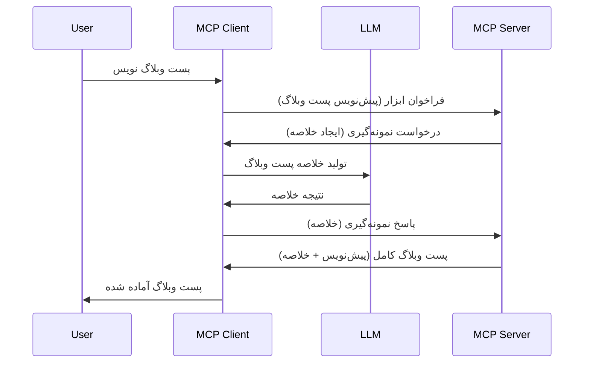

# نمونه‌گیری - واگذاری ویژگی‌ها به کلاینت

> **اعلان منسوخ شدن:** نسخه نامزد انتشار مشخصات MCP در تاریخ `2026-07-28` نمونه‌گیری را به نفع ادغام مستقیم با APIهای فراهم‌کنندگان LLM منسوخ اعلام کرده است. نمونه‌گیری در نسخه `2025-11-25` و حداقل یک سال پس از هر اعلام رسمی انقضا همچنان کار می‌کند، بنابراین هر آنچه در این درس گفته شده معتبر می‌ماند — اما طراحی‌های جدید سرور باید الگوی جایگزین را ارزیابی کنند. برای جزئیات بیشتر به [چه تغییراتی در MCP رخ داده است: نسخه نامزد انتشار 2026-07-28](../../01-CoreConcepts/mcp-2026-07-28-release-candidate.md) مراجعه کنید.

گاهی اوقات، نیاز است کلاینت MCP و سرور MCP با هم همکاری کنند تا به هدف مشترکی برسند. ممکن است شرایطی داشته باشید که سرور به کمک یک LLM که روی کلاینت قرار دارد نیاز داشته باشد. برای این وضعیت، نمونه‌گیری روشی است که باید از آن استفاده کنید.

بیایید چند مورد استفاده را بررسی کنیم و ببینیم چگونه می‌توان راه‌حلی شامل نمونه‌گیری ساخت.

## مروری کلی

در این درس، تمرکز بر این است که چه زمانی و کجا نمونه‌گیری را استفاده کنیم و چگونه آن را پیکربندی کنیم.

## اهداف یادگیری

در این فصل ما:

- توضیح می‌دهیم نمونه‌گیری چیست و چه زمانی باید از آن استفاده شود.
- نحوه پیکربندی نمونه‌گیری در MCP را نشان می‌دهیم.
- مثال‌هایی از نمونه‌گیری در عمل ارائه خواهیم کرد.

## نمونه‌گیری چیست و چرا از آن استفاده کنیم؟

نمونه‌گیری یک ویژگی پیشرفته است که به صورت زیر عمل می‌کند:



### درخواست نمونه‌گیری

خوب، حالا که یک دید کلی از یک سناریوی قابل باور داریم، بیایید درباره درخواست نمونه‌گیری که سرور به کلاینت ارسال می‌کند صحبت کنیم. چنین درخواستی در فرمت JSON-RPC می‌تواند به این شکل باشد:

```json
{
  "jsonrpc": "2.0",
  "id": 1,
  "method": "sampling/createMessage",
  "params": {
    "messages": [
      {
        "role": "user",
        "content": {
          "type": "text",
          "text": "Create a blog post summary of the following blog post: <BLOG POST>"
        }
      }
    ],
    "modelPreferences": {
      "hints": [
        {
          "name": "claude-3-sonnet"
        }
      ],
      "intelligencePriority": 0.8,
      "speedPriority": 0.5
    },
    "systemPrompt": "You are a helpful assistant.",
    "maxTokens": 100
  }
}
```

چند نکته در اینجا ارزش یادآوری دارد:

- Prompt، زیر محتوا -> متن، دستورالعمل ما برای LLM است که محتوای یک پست وبلاگی را خلاصه کند.

- **modelPreferences**. این بخش صرفاً ترجیحی است، پیشنهادی برای پیکربندی استفاده شده با LLM. کاربر می‌تواند تصمیم بگیرد که این ترجیحات را رعایت کند یا آنها را تغییر دهد. در این مورد، توصیه‌هایی درباره مدل استفاده شده و اولویت سرعت و هوش وجود دارد.
- **systemPrompt**، این همان پرامپت معمول سیستم شماست که به LLM شخصیت می‌دهد و دستورالعمل‌های راهنمایی را شامل می‌شود.
- **maxTokens**، این ویژگی برای بیان تعداد توکنی است که توصیه می‌شود برای این کار استفاده شود.

### پاسخ نمونه‌گیری

این پاسخ چیزی است که کلاینت MCP در نهایت به سرور MCP ارسال می‌کند و نتیجه تماس کلاینت با LLM، انتظار برای پاسخ و سپس ساختن این پیام است. در JSON-RPC می‌تواند به این شکل باشد:

```json
{
  "jsonrpc": "2.0",
  "id": 1,
  "result": {
    "role": "assistant",
    "content": {
      "type": "text",
      "text": "Here's your abstract <ABSTRACT>"
    },
    "model": "gpt-5",
    "stopReason": "endTurn"
  }
}
```

دقت کنید پاسخ یک چکیده از پست وبلاگ است دقیقاً همانطور که خواسته بودیم. همچنین توجه کنید که مدل استفاده شده "gpt-5" است نه آنچه خواسته بودیم "claude-3-sonnet". این برای نشان دادن این است که کاربر می‌تواند نظر خود را درباره مدل استفاده شده تغییر دهد و درخواست نمونه‌گیری شما فقط یک پیشنهاد است.

خوب، حالا که جریان اصلی را فهمیدیم و یک کار مفید برای آن "ایجاد پست وبلاگ + چکیده" را دیدیم، بیایید ببینیم برای فعال کردن آن چه باید انجام دهیم.

### انواع پیام‌ها

پیام‌های نمونه‌گیری محدود به متن نیستند بلکه می‌توانید تصاویر و صدا را نیز ارسال کنید. فرمت JSON-RPC این موارد چگونه متفاوت است:

**متن**

```json
{
  "type": "text",
  "text": "The message content"
}
```

**محتوای تصویر**

```json
{
  "type": "image",
  "data": "base64-encoded-image-data",
  "mimeType": "image/jpeg"
}
```

**محتوای صوتی**

```json
{
  "type": "audio",
  "data": "base64-encoded-audio-data",
  "mimeType": "audio/wav"
}
```

> نکته: برای اطلاعات دقیق‌تر درباره نمونه‌گیری، به [مستندات رسمی](https://modelcontextprotocol.io/specification/2025-11-25/client/sampling) مراجعه کنید.

## چگونه نمونه‌گیری را در کلاینت پیکربندی کنیم

> نکته: اگر فقط سرور می‌سازید، لازم نیست اینجا کار زیادی انجام دهید.

در یک کلاینت، باید ویژگی زیر را به این صورت مشخص کنید:

```json
{
  "capabilities": {
    "sampling": {}
  }
}
```

سپس این ویژگی هنگام راه‌اندازی کلاینت انتخاب شده با سرور دریافت خواهد شد.

## مثال عملی نمونه‌گیری - ایجاد یک پست وبلاگ

بیایید با هم یک سرور نمونه‌گیری کدنویسی کنیم، باید کارهای زیر را انجام دهیم:

1. ایجاد یک ابزار روی سرور.
1. این ابزار باید یک درخواست نمونه‌گیری ایجاد کند.
1. ابزار باید منتظر پاسخ به درخواست نمونه‌گیری کلاینت بماند.
1. سپس نتیجه ابزار باید تولید شود.

بیایید کد را گام به گام ببینیم:

### -1- ایجاد ابزار

**python**

```python
@mcp.tool()
async def create_blog(title: str, content: str, ctx: Context[ServerSession, None]) -> str:
    """Create a blog post and generate a summary"""

```

### -2- ایجاد درخواست نمونه‌گیری

کد ابزار خود را با قطعه زیر گسترش دهید:

**python**

```python
post = BlogPost(
        id=len(posts) + 1,
        title=title,
        content=content,
        abstract=""
    )

prompt = f"Create an abstract of the following blog post: title: {title} and draft: {content} "

result = await ctx.session.create_message(
        messages=[
            SamplingMessage(
                role="user",
                content=TextContent(type="text", text=prompt),
            )
        ],
        max_tokens=100,
)

```

### -3- منتظر پاسخ بمانید و پاسخ را بازگردانید

**python**

```python
post.abstract = result.content.text

posts.append(post)

# بازگرداندن محصول کامل
return json.dumps({
    "id": post.title,
    "abstract": post.abstract
})
```

### -4- کد کامل

**python**

```python
from starlette.applications import Starlette
from starlette.routing import Mount, Host

from mcp.server.fastmcp import Context, FastMCP

from mcp.server.session import ServerSession
from mcp.types import SamplingMessage, TextContent

import json


from uuid import uuid4
from typing import List
from pydantic import BaseModel


mcp = FastMCP("Blog post generator")

# app = FastAPI()

posts = []

class BlogPost(BaseModel):
    id: int
    title: str
    content: str
    abstract: str

posts: List[BlogPost] = []

@mcp.tool()
async def create_blog(title: str, content: str, ctx: Context[ServerSession, None]) -> str:
    """Create a blog post and generate a summary"""

    post = BlogPost(
        id=len(posts) + 1,
        title=title,
        content=content,
        abstract=""
    )

    prompt = f"Create an abstract of the following blog post: title: {title} and draft: {content} "

    result = await ctx.session.create_message(
        messages=[
            SamplingMessage(
                role="user",
                content=TextContent(type="text", text=prompt),
            )
        ],
        max_tokens=100,
    )

    post.abstract = result.content.text

    posts.append(post)

    # ارسال کامل پست وبلاگ
    return json.dumps({
        "id": post.title,
        "abstract": post.abstract
    })

if __name__ == "__main__":
    print("Starting server...")
    # mcp.run()
    mcp.run(transport="streamable-http")

# برنامه را با دستور زیر اجرا کنید: python server.py
```

### -5- آزمایش در Visual Studio Code

برای آزمایش این در Visual Studio Code، مراحل زیر را انجام دهید:

1. راه‌اندازی سرور در ترمینال
1. آن را به *mcp.json* اضافه کنید (و مطمئن شوید که سرور اجرایی است)، مثلاً به این شکل:

   ```json
   "servers": {
      "blog-server": {
        "type": "http",
        "url": "http://localhost:8000/mcp"
      }
   }
   ```

1. یک پرامپت تایپ کنید:

   ```text
   create a blog post named "Where Python comes from", the content is "Python is actually named after Monty Python Flying Circus"
   ```

1. اجازه دهید نمونه‌گیری انجام شود. بار اول که آزمایش می‌کنید یک دیالوگ اضافی خواهید دید که باید آن را تایید کنید، سپس دیالوگ معمول برای درخواست اجرای ابزار نمایان خواهد شد.

1. نتایج را بررسی کنید. نتایج هم به خوبی در GitHub Copilot Chat نمایش داده می‌شوند و هم می‌توانید پاسخ JSON خام را مشاهده کنید.

**مزیت**. ابزارهای Visual Studio Code پشتیبانی عالی از نمونه‌گیری دارند. می‌توانید دسترسی نمونه‌گیری سرور نصب شده خود را با رفتن به این تنظیمات به صورت زیر پیکربندی کنید:

1. به بخش افزونه‌ها بروید.
1. روی آیکون چرخ‌دنده کنار سرور نصب شده در بخش "MCP SERVERS - INSTALLED" کلیک کنید.
1. گزینه "Configure Model Access" را انتخاب کنید، اینجا می‌توانید مدل‌هایی که GitHub Copilot اجازه دارد هنگام نمونه‌گیری استفاده کند را انتخاب کنید. همچنین با انتخاب "Show Sampling requests" می‌توانید تمامی درخواست‌های نمونه‌گیری اخیر را مشاهده کنید.

## تمرین

در این تمرین، شما یک نمونه‌گیری کمی متفاوت ایجاد خواهید کرد، یعنی یک ادغام نمونه‌گیری که از تولید توضیح محصول پشتیبانی می‌کند. سناریوی شما این است:

**سناریو**: کارمند دفتر پشتیبان در یک فروشگاه اینترنتی به کمک نیاز دارد، تولید توضیحات محصول خیلی زمان‌بر است. بنابراین شما باید راه‌حلی بسازید که بتوانید ابزاری به نام "create_product" را با آرگومان‌های "title" و "keywords" فراخوانی کنید و باید یک محصول کامل شامل فیلد "description" که با LLM کلاینت پر می‌شود را تولید کند.

نکته: از آنچه پیش‌تر آموختید استفاده کنید تا این سرور و ابزارش را با درخواست نمونه‌گیری بسازید.

## راه‌حل

[راه‌حل](./solution/README.md)

## نکات کلیدی

نمونه‌گیری ویژگی قدرتمندی است که به سرور اجازه می‌دهد وقتی به کمک LLM نیاز دارد وظایف را به کلاینت واگذار کند.

## گام بعدی

- [فصل ۴ - پیاده‌سازی عملی](../../04-PracticalImplementation/README.md)

---

<!-- CO-OP TRANSLATOR DISCLAIMER START -->
**سلب مسئولیت**:
این سند با استفاده از سرویس ترجمه هوش مصنوعی [Co-op Translator](https://github.com/Azure/co-op-translator) ترجمه شده است. در حالی که ما در تلاش برای دقت هستیم، لطفاً توجه داشته باشید که ترجمه‌های خودکار ممکن است شامل خطاها یا نادرستی‌هایی باشند. سند اصلی به زبان مادری خود باید به عنوان منبع معتبر در نظر گرفته شود. برای اطلاعات حیاتی، ترجمه حرفه‌ای انسانی توصیه می‌شود. ما در قبال هرگونه سوء تفاهم یا برداشت نادرست ناشی از استفاده از این ترجمه مسئولیتی نداریم.
<!-- CO-OP TRANSLATOR DISCLAIMER END -->