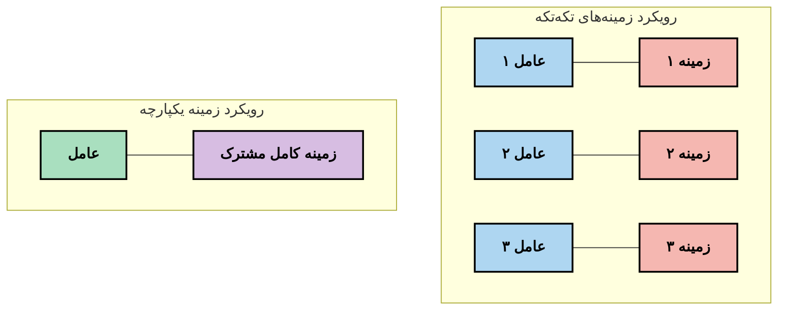
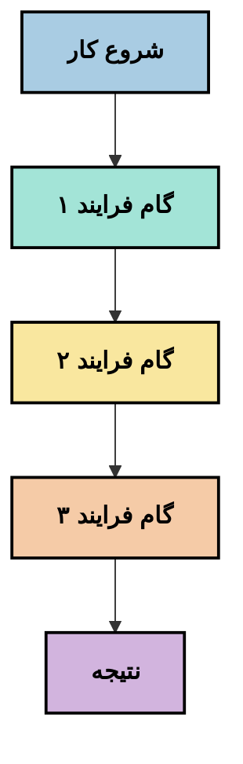
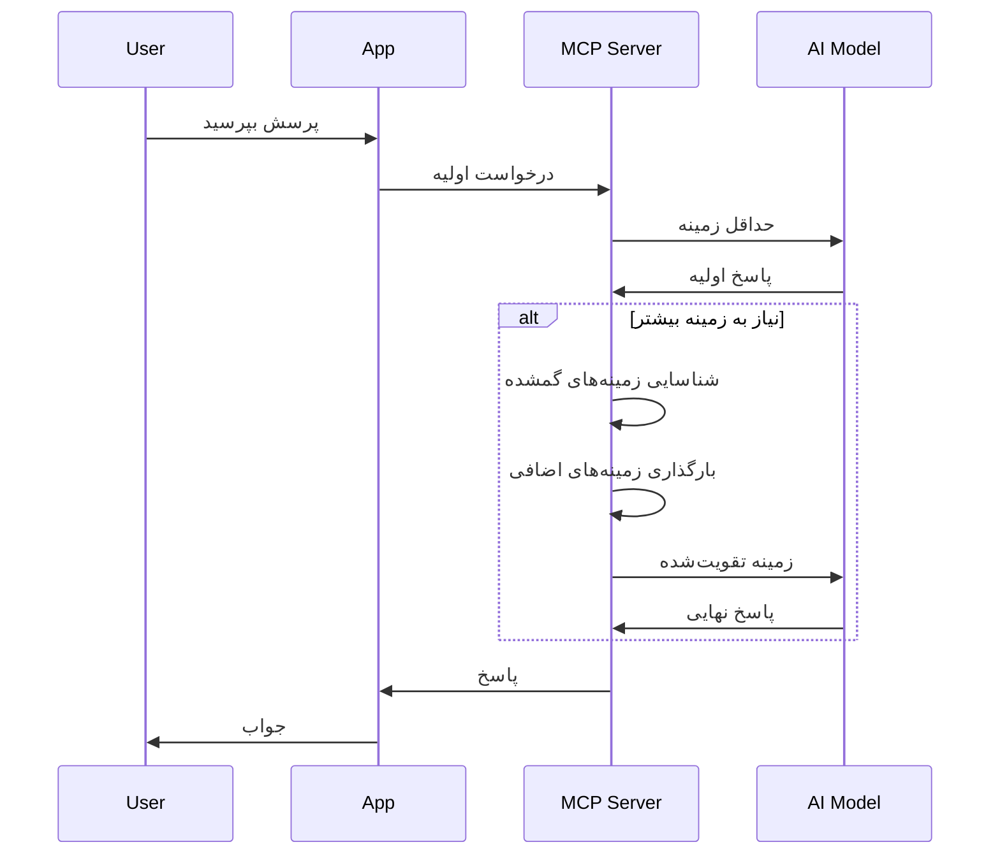
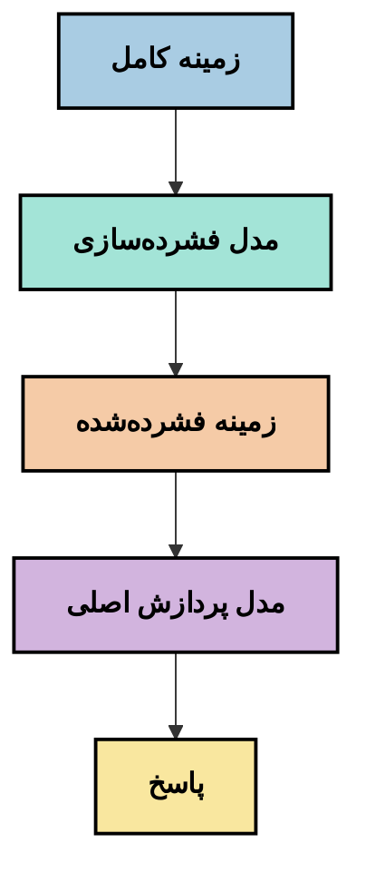
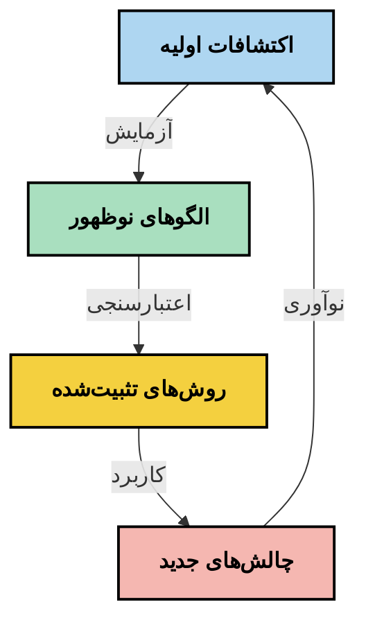

# مهندسی زمینه: مفهومی نوظهور در اکوسیستم MCP

## مروری کلی

مهندسی زمینه مفهومی نوظهور در حوزه هوش مصنوعی است که بررسی می‌کند چگونه اطلاعات ساختاربندی، ارائه و در طول تعاملات بین مشتریان و خدمات هوش مصنوعی حفظ می‌شود. با تکامل اکوسیستم پروتکل زمینه مدل (MCP)، درک چگونگی مدیریت مؤثر زمینه اهمیت بیشتری پیدا می‌کند. این ماژول مفهوم مهندسی زمینه را معرفی کرده و کاربردهای احتمالی آن در پیاده‌سازی‌های MCP را بررسی می‌کند.

## اهداف آموزشی

تا پایان این ماژول، قادر خواهید بود:

- مفهوم نوظهور مهندسی زمینه و نقش احتمالی آن در کاربردهای MCP را درک کنید
- چالش‌های کلیدی مدیریت زمینه که طراحی پروتکل MCP به آنها پاسخ می‌دهد را شناسایی کنید
- تکنیک‌هایی برای بهبود عملکرد مدل از طریق مدیریت بهتر زمینه را کاوش کنید
- رویکردهایی برای سنجش و ارزیابی اثربخشی زمینه در نظر بگیرید
- این مفاهیم نوظهور را برای بهبود تجربه‌های هوش مصنوعی از طریق چارچوب MCP به کار بگیرید

## مقدمه‌ای بر مهندسی زمینه

مهندسی زمینه مفهومی نوظهور است که بر طراحی هدفمند و مدیریت جریان اطلاعات بین کاربران، برنامه‌ها و مدل‌های هوش مصنوعی تمرکز دارد. بر خلاف حوزه‌های تثبیت‌شده‌ای مانند مهندسی پرامپت، مهندسی زمینه هنوز توسط فعالان تعریف می‌شود که در تلاش برای حل چالش‌های منحصر به فرد فراهم کردن اطلاعات صحیح به مدل‌های هوش مصنوعی در زمان مناسب هستند.

با پیشرفت مدل‌های زبان بزرگ (LLMها)، اهمیت زمینه بیش از پیش نمایان شده است. کیفیت، مرتبط بودن و ساختار زمینه ارائه شده مستقیماً بر خروجی مدل تأثیر می‌گذارد. مهندسی زمینه این رابطه را بررسی کرده و به دنبال توسعه اصولی برای مدیریت مؤثر زمینه است.

> «در سال ۲۰۲۵، مدل‌های موجود بسیار هوشمند هستند. اما حتی هوشمندترین انسان هم بدون زمینه‌ی آنچه از آنها خواسته شده است، نمی‌تواند به درستی کار خود را انجام دهد... "مهندسی زمینه" سطح بعدی مهندسی پرامپت است. این درباره انجام خودکار این فرایند در یک سیستم پویا است.» — والدن یان، Cognition AI

مهندسی زمینه ممکن است شامل موارد زیر باشد:

1. **انتخاب زمینه**: تعیین این که کدام اطلاعات برای یک کار خاص مرتبط است
2. **ساختاربندی زمینه**: سازماندهی اطلاعات برای بیشینه کردن درک مدل
3. **ارائه زمینه**: بهینه‌سازی نحوه و زمان ارسال اطلاعات به مدل‌ها
4. **نگهداری زمینه**: مدیریت وضعیت و تکامل زمینه در طول زمان
5. **ارزیابی زمینه**: سنجش و بهبود اثربخشی زمینه

این حوزه‌های تمرکز به‌ویژه برای اکوسیستم MCP که روشی استاندارد برای ارائه زمینه به LLMها فراهم می‌کند، مرتبط هستند.


## دیدگاه مسیر زمینه

یکی از روش‌های تجسم مهندسی زمینه، پیگیری مسیر اطلاعات در یک سیستم MCP است:


### مراحل کلیدی در مسیر زمینه:

1. **ورودی کاربر**: اطلاعات خام از کاربر (متن، تصاویر، اسناد)
2. **ترکیب زمینه**: ترکیب ورودی کاربر با زمینه سیستم، تاریخچه مکالمه و سایر اطلاعات بازیابی شده
3. **پردازش مدل**: پردازش زمینه ترکیب‌شده توسط مدل هوش مصنوعی
4. **تولید پاسخ**: تولید خروجی‌ها توسط مدل بر اساس زمینه ارائه‌شده
5. **مدیریت وضعیت**: به‌روزرسانی وضعیت داخلی سیستم بر اساس تعامل

این دیدگاه ماهیت پویا زمینه در سیستم‌های هوش مصنوعی را برجسته کرده و سوالات مهمی درباره بهترین نحوه مدیریت اطلاعات در هر مرحله مطرح می‌کند.

## اصول نوظهور در مهندسی زمینه

با شکل‌گیری حوزه مهندسی زمینه، برخی اصول اولیه از سوی فعالان شروع به ظهور کرده‌اند. این اصول ممکن است به انتخاب‌های پیاده‌سازی MCP کمک کنند:

### اصل ۱: به اشتراک گذاشتن کامل زمینه

زمینه باید به طور کامل بین تمام اجزای سیستم به اشتراک گذاشته شود، نه این که در چند عامل یا فرایند جداگانه تکه‌تکه شود. توزیع زمینه ممکن است باعث تعارض تصمیمات در بخش‌های مختلف سیستم شود.



در برنامه‌های MCP این پیشنهاد به طراحی سیستمی اشاره دارد که زمینه به صورت یکپارچه در تمام خط جریان حرکت کند، نه به صورت بخش‌بندی شده.

### اصل ۲: تشخیص اینکه اقدامات تصمیمات ضمنی دارند

هر عملی که مدل انجام می‌دهد، حامل تصمیمات ضمنی درباره تفسیر زمینه است. وقتی چندین جزء روی زمینه‌های مختلف عمل می‌کنند، این تصمیمات ضمنی می‌توانند تعارض ایجاد کرده و منجر به نتایج ناسازگار شوند.

این اصل برای برنامه‌های MCP پیامدهای مهمی دارد:
- ترجیح پردازش خطی وظایف پیچیده نسبت به اجرا به صورت موازی با زمینه تکه‌تکه
- اطمینان از این که همه نقاط تصمیم به اطلاعات زمینه‌ای یکسان دسترسی دارند
- طراحی سیستم‌هایی که مراحل بعدی بتوانند زمینه کامل تصمیم‌های قبلی را ببینند

### اصل ۳: تعادل عمق زمینه با محدودیت پنجره‌ها

با طولانی‌تر شدن مکالمات و فرایندها، پنجره‌های زمینه سرریز می‌شوند. مهندسی مؤثر زمینه به دنبال راهکارهایی برای مدیریت این تعارض بین جامعیت زمینه و محدودیت‌های فنی است.

رویکردهای احتمالی که در حال بررسی هستند عبارتند از:
- فشرده‌سازی زمینه با حفظ اطلاعات اساسی و کاهش تعداد توکن‌ها
- بارگذاری تدریجی زمینه بر اساس مرتبط بودن به نیازهای فعلی
- خلاصه‌سازی تعاملات پیشین در حالی که تصمیمات و حقایق کلیدی حفظ می‌شوند

## چالش‌های زمینه و طراحی پروتکل MCP

پروتکل مدل زمینه (MCP) با آگاهی از چالش‌های منحصر به فرد مدیریت زمینه طراحی شده است. درک این چالش‌ها به توضیح جنبه‌های کلیدی طراحی پروتکل MCP کمک می‌کند:


### چالش ۱: محدودیت‌های پنجره زمینه
اکثر مدل‌های هوش مصنوعی اندازه پنجره زمینه ثابتی دارند که مقدار اطلاعاتی که می‌توانند همزمان پردازش کنند را محدود می‌کند.

**پاسخ طراحی MCP:** 
- پروتکل پشتیبانی از زمینه ساختاربندی‌شده مبتنی بر منابع را فراهم می‌کند که می‌توان به طور مؤثر به آن ارجاع داد
- منابع می‌توانند به صورت صفحه‌ای بارگذاری شده و تدریجی باشند

### چالش ۲: تعیین مرتبط بودن
تعیین اینکه کدام اطلاعات بیشترین ارتباط برای قرارگیری در زمینه دارند دشوار است.

**پاسخ طراحی MCP:**
- ابزارهای قابل انعطاف امکان بازیابی داینامیک اطلاعات بر اساس نیاز را فراهم می‌کنند
- پرامپت‌های ساختاریافته سازماندهی یکنواخت زمینه را ممکن می‌سازند

### چالش ۳: پایداری زمینه
مدیریت وضعیت در طول تعاملات نیازمند پیگیری دقیق زمینه است.

**پاسخ طراحی MCP:**
- مدیریت نشست استاندارد شده
- الگوهای تعامل با تعریف روشن برای تکامل زمینه

### چالش ۴: زمینه چندرسانه‌ای
انواع مختلف داده (متن، تصویر، داده ساختار یافته) نیازمند رسیدگی متفاوت هستند.

**پاسخ طراحی MCP:**
- طراحی پروتکل انواع مختلف محتوا را پشتیبانی می‌کند
- نمایش استاندارد شده اطلاعات چندرسانه‌ای

### چالش ۵: امنیت و حریم خصوصی
زمینه اغلب شامل اطلاعات حساس است که باید محافظت شوند.

**پاسخ طراحی MCP:**
- مرزهای واضح بین مسئولیت‌های مشتری و سرور
- گزینه‌های پردازش محلی برای کاهش افشای داده‌ها

درک این چالش‌ها و پاسخ MCP به آن‌ها پایه‌ای برای بررسی تکنیک‌های پیشرفته‌تر مهندسی زمینه فراهم می‌کند.

## رویکردهای نوظهور در مهندسی زمینه

با توسعه حوزه مهندسی زمینه، چند رویکرد امیدوارکننده ظهور کرده‌اند. این‌ها تفکرات فعلی هستند نه بهترین شیوه‌های نهایی، و احتمالاً با کسب تجربه بیشتر در پیاده‌سازی‌های MCP تغییر خواهند کرد.

### ۱. پردازش خطی تک‌رشته‌ای

بر خلاف معماری‌های چندعاملی که زمینه را توزیع می‌کنند، برخی فعالان متوجه شده‌اند که پردازش خطی تک‌رشته‌ای نتایج سازگارتر تولید می‌کند. این با اصل حفظ زمینه متحد هماهنگ است.



اگرچه این رویکرد ممکن است کمتر به نظر کارآمد نسبت به پردازش موازی برسد، اغلب نتایج منسجم و قابل اطمینانی تولید می‌کند چون هر گام بر درک کامل از تصمیم‌های قبلی بنا می‌شود.

### ۲. تقسیم‌بندی و اولویت‌بندی زمینه

شکستن زمینه‌های بزرگ به بخش‌های قابل مدیریت و اولویت دادن به مهم‌ترین‌ها.

```python
# مثال مفهومی: تقسیم بندی متن و اولویت‌بندی زمینه
def process_with_chunked_context(documents, query):
    # ۱. تقسیم اسناد به بخش‌های کوچک‌تر
    chunks = chunk_documents(documents)
    
    # ۲. محاسبه امتیاز مرتبط بودن برای هر بخش
    scored_chunks = [(chunk, calculate_relevance(chunk, query)) for chunk in chunks]
    
    # ۳. مرتب‌سازی بخش‌ها بر اساس امتیاز مرتبط بودن
    sorted_chunks = sorted(scored_chunks, key=lambda x: x[1], reverse=True)
    
    # ۴. استفاده از مرتبط‌ترین بخش‌ها به عنوان زمینه
    context = create_context_from_chunks([chunk for chunk, score in sorted_chunks[:5]])
    
    # ۵. پردازش با زمینه اولویت‌بندی شده
    return generate_response(context, query)
```

مفهوم بالا نشان می‌دهد چگونه ممکن است اسناد بزرگ را به قطعات قابل مدیریت تقسیم کنیم و فقط مرتبط‌ترین بخش‌ها را برای زمینه انتخاب کنیم. این رویکرد می‌تواند به کار در محدودیت‌های پنجره زمینه کمک کند و در عین حال از پایگاه‌های بزرگ دانش بهره ببرد.

### ۳. بارگذاری تدریجی زمینه

بارگذاری تدریجی زمینه به جای بارگذاری همه یکجا.



بارگذاری تدریجی زمینه با زمینه حداقلی شروع می‌شود و فقط در صورت نیاز توسعه می‌یابد. این می‌تواند به طور قابل توجهی مصرف توکن را برای پرسش‌های ساده کاهش دهد و در عین حال توانایی پاسخ به سوالات پیچیده را حفظ کند.

### ۴. فشرده‌سازی و خلاصه‌سازی زمینه

کاهش اندازه زمینه در حالی که اطلاعات ضروری حفظ می‌شود.



فشرده‌سازی زمینه بر موارد زیر تمرکز دارد:
- حذف اطلاعات تکراری
- خلاصه‌سازی محتوای طولانی
- استخراج حقایق و جزئیات کلیدی
- حفظ عناصر بحرانی زمینه
- بهینه‌سازی برای کارایی توکن‌ها

این رویکرد می‌تواند به ویژه برای حفظ مکالمات طولانی در پنجره‌های زمینه یا پردازش مؤثر اسناد بزرگ ارزشمند باشد. برخی فعالان از مدل‌های تخصصی برای فشرده‌سازی زمینه و خلاصه‌سازی تاریخچه مکالمه استفاده می‌کنند.


## ملاحظات اکتشافی مهندسی زمینه

هنگام بررسی حوزه نوظهور مهندسی زمینه، چند ملاحظه ارزشمند وجود دارد که هنگام کار با پیاده‌سازی‌های MCP باید در نظر گرفته شوند. این‌ها بهترین شیوه‌های قطعی نیستند بلکه حوزه‌هایی برای کاوش که ممکن است به بهبود در مورد استفاده شما منجر شوند.

### اهداف زمینه خود را مشخص کنید

قبل از پیاده‌سازی راه‌حل‌های پیچیده مدیریت زمینه، واضح بیان کنید که چه چیزی می‌خواهید به دست آورید:
- چه اطلاعات خاصی برای موفقیت مدل لازم است؟
- کدام اطلاعات ضروری و کدام مکمل هستند؟
- محدودیت‌های عملکرد شما چیستند (زمان پاسخ، محدودیت توکن، هزینه‌ها)؟

### رویکردهای لایه‌ای زمینه را کاوش کنید

برخی فعالان با سازماندهی زمینه در لایه‌های مفهومی موفقیت یافته‌اند:
- **لایه اصلی**: اطلاعات ضروری که مدل همیشه نیاز دارد
- **لایه موقعیتی**: زمینه مختص تعامل جاری
- **لایه پشتیبان**: اطلاعات اضافی که ممکن است مفید باشد
- **لایه جایگزین**: اطلاعاتی که فقط در صورت نیاز دسترسی دارد

### استراتژی‌های بازیابی را بررسی کنید

اثربخشی زمینه اغلب به نحوه بازیابی اطلاعات بستگی دارد:
- جستجوی معنایی و جاسازی‌ها برای یافتن اطلاعات مرتبط مفهومی
- جستجوی مبتنی بر کلمات کلیدی برای جزئیات خاص
- رویکردهای ترکیبی که روش‌های بازیابی مختلف را ترکیب می‌کنند
- فیلتر کردن فراداده برای محدود کردن دامنه بر اساس دسته‌بندی، تاریخ یا منابع

### با انسجام زمینه آزمایش کنید

ساختار و جریان زمینه ممکن است بر درک مدل تأثیر بگذارد:
- گروه‌بندی اطلاعات مرتبط با هم
- استفاده از قالب‌بندی و سازماندهی یکنواخت
- حفظ ترتیب منطقی یا زمانی در صورت مناسب بودن
- اجتناب از اطلاعات متناقض

### مزایا و معایب معماری‌های چندعاملی را بسنجید

اگرچه معماری‌های چندعاملی در بسیاری از چارچوب‌های هوش مصنوعی محبوب هستند، با چالش‌های مهمی برای مدیریت زمینه همراه‌اند:
- تکه‌تکه شدن زمینه می‌تواند منجر به تصمیمات ناسازگار در بین عوامل شود
- پردازش موازی ممکن است تعارضاتی ایجاد کند که حل آنها دشوار است
- سربار ارتباطی بین عوامل ممکن است سود عملکردی را خنثی کند
- مدیریت وضعیت پیچیده برای حفظ انسجام لازم است

در بسیاری از موارد، رویکرد تک‌عاملی با مدیریت جامع زمینه ممکن است نتایج قابل اعتمادتری نسبت به چند عامل تخصصی با زمینه تکه‌تکه تولید کند.

### روش‌های ارزیابی را توسعه دهید

برای بهبود مهندسی زمینه در طول زمان، در نظر بگیرید چگونه موفقیت را اندازه‌گیری خواهید کرد:
- تست‌های A/B با ساختارهای زمینه مختلف
- نظارت بر مصرف توکن و زمان پاسخ
- پیگیری رضایت کاربران و نرخ تکمیل وظایف
- تحلیل موارد شکست استراتژی‌های زمینه

این ملاحظات حوزه‌های فعال کاوش در فضای مهندسی زمینه را نشان می‌دهند. با بالغ‌تر شدن این حوزه، احتمالاً الگوها و شیوه‌های قاطع‌تری ظاهر خواهند شد.

## اندازه‌گیری اثربخشی زمینه: چارچوبی در حال تکامل

با ظهور مفهوم مهندسی زمینه، فعالان شروع به کاوش چگونگی اندازه‌گیری اثربخشی آن کرده‌اند. هنوز چارچوب قطعی وجود ندارد، اما معیارهای مختلفی در نظر گرفته می‌شوند که می‌توانند راهنمای کارهای آینده باشند.

### ابعاد احتمالی اندازه‌گیری


#### ۱. ملاحظات کارایی ورودی

- **نسبت زمینه به پاسخ**: چه مقدار زمینه نسبت به اندازه پاسخ مورد نیاز است؟
- **استفاده از توکن‌ها**: چه درصدی از توکن‌های زمینه ارائه شده به پاسخ تأثیرگذار بوده‌اند؟
- **کاهش زمینه**: چقدر می‌توانیم اطلاعات خام را به طور مؤثر فشرده کنیم؟

#### ۲. ملاحظات عملکرد

- **تأثیر تأخیر**: مدیریت زمینه چگونه بر زمان پاسخ تأثیر می‌گذارد؟
- **اقتصاد توکن‌ها**: آیا بهینه‌سازی مصرف توکن به خوبی انجام می‌شود؟
- **دقت بازیابی**: اطلاعات بازیابی شده چقدر مرتبط است؟
- **استفاده از منابع**: چه منابع محاسباتی نیاز است؟

#### ۳. ملاحظات کیفیت

- **مرتبط بودن پاسخ**: پاسخ چقدر به پرسش مرتبط است؟
- **دقت واقعی**: مدیریت زمینه دقت واقعیت را بهبود می‌بخشد؟
- **انسجام**: پاسخ‌ها در پرسش‌های مشابه چقدر سازگار هستند؟
- **نرخ هذیان**: آیا زمینه بهتر هذیان مدل را کاهش می‌دهد؟

#### ۴. ملاحظات تجربه کاربری

- **نرخ پیگیری**: کاربران چند بار نیاز به توضیح بیشتر دارند؟
- **تکمیل وظیفه**: آیا کاربران به اهداف خود می‌رسند؟
- **شاخص‌های رضایت**: کاربران چگونه تجربه خود را ارزیابی می‌کنند؟

### رویکردهای اکتشافی در اندازه‌گیری

هنگام آزمایش مهندسی زمینه در پیاده‌سازی‌های MCP، این رویکردهای اکتشافی را در نظر بگیرید:

۱. **مقایسه‌های پایه**: ابتدا با رویکردهای ساده زمینه مقایسه پایه ایجاد کنید و سپس روش‌های پیچیده‌تر را آزمایش کنید

۲. **تغییرات تدریجی**: یک جنبه از مدیریت زمینه را در هر بار تغییر دهید تا اثر آن را جدا کنید

۳. **ارزیابی متمرکز بر کاربر**: معیارهای کمی را با بازخورد کیفی کاربران ترکیب کنید

۴. **تحلیل شکست**: مواردی که استراتژی‌های زمینه شکست می‌خورند را بررسی کنید تا بهبودهای احتمالی را درک کنید

۵. **ارزیابی چندبعدی**: بین کارایی، کیفیت و تجربه کاربری توازن برقرار کنید

این رویکرد تجربی و چندوجهی در اندازه‌گیری با ماهیت نوظهور مهندسی زمینه هماهنگی دارد.

## کلام پایانی

مهندسی زمینه حوزه‌ای نوظهور است که ممکن است در پیاده‌سازی‌های مؤثر MCP نقش مرکزی پیدا کند. با در نظر گرفتن دقیق نحوه جریان اطلاعات در سیستم خود، می‌توانید تجربه‌های هوش مصنوعی کارآمدتر، دقیق‌تر و ارزشمندتری برای کاربران خلق کنید.

تکنیک‌ها و رویکردهای مطرح شده در این ماژول نمایانگر تفکر اولیه در این حوزه هستند، نه شیوه‌های تثبیت‌شده. مهندسی زمینه ممکن است با تکامل قابلیت‌های هوش مصنوعی و تعمیق درک ما به رشته‌ای تعریفی‌تر تبدیل شود. در حال حاضر، آزمایش همراه با اندازه‌گیری دقیق موثرترین رویکرد به نظر می‌رسد.

## مسیرهای آینده احتمالی

حوزه مهندسی زمینه هنوز در مراحل اولیه است، اما چند جهت امیدوارکننده در حال ظهور است:

- اصول مهندسی زمینه ممکن است تاثیر قابل توجهی بر عملکرد مدل، کارایی، تجربه کاربری و قابلیت اطمینان داشته باشد
- رویکردهای تک‌رشته‌ای با مدیریت کامل زمینه ممکن است در بسیاری از موارد بهتر از معماری‌های چندعاملی عمل کنند
- مدل‌های تخصصی فشرده‌سازی زمینه ممکن است به اجزای استاندارد در خطوط لوله هوش مصنوعی تبدیل شوند
- تعارض بین جامع بودن زمینه و محدودیت توکن احتمالاً موجب نوآوری در مدیریت زمینه خواهد شد
- با افزایش قابلیت مدل‌ها در ارتباطات کارآمد شبیه انسان، همکاری واقعی چندعاملی ممکن است عملی‌تر شود
- پیاده‌سازی‌های MCP ممکن است الگوهای مدیریت زمینه را که از آزمایش‌های فعلی شکل می‌گیرند استانداردسازی کنند



## منابع

### منابع رسمی MCP
- [وب‌سایت پروتکل زمینه مدل](https://modelcontextprotocol.io/)
- [مشخصات پروتکل زمینه مدل](https://github.com/modelcontextprotocol/modelcontextprotocol)

- [مستندات MCP](https://modelcontextprotocol.io/docs)
- [کتابخانه MCP سی‌شارپ](https://github.com/modelcontextprotocol/csharp-sdk)
- [کتابخانه MCP پایتون](https://github.com/modelcontextprotocol/python-sdk)
- [کتابخانه MCP تایپ‌اسکریپت](https://github.com/modelcontextprotocol/typescript-sdk)
- [بازرس MCP](https://github.com/modelcontextprotocol/inspector) - ابزار تست بصری برای سرورهای MCP

### مقالات مهندسی متن
- [چندعامل‌سازی نسازید: اصول مهندسی متن](https://cognition.ai/blog/dont-build-multi-agents) - دیدگاه‌های والدن یان در مورد اصول مهندسی متن
- [راهنمای عملی برای ساخت عوامل](https://cdn.openai.com/business-guides-and-resources/a-practical-guide-to-building-agents.pdf) - راهنمای OpenAI درباره طراحی مؤثر عوامل
- [ساخت عوامل مؤثر](https://www.anthropic.com/engineering/building-effective-agents) - رویکرد Anthropic در توسعه عوامل

### پژوهش‌های مرتبط
- [تکمیل بازیابی پویا برای مدل‌های زبان بزرگ](https://arxiv.org/abs/2310.01487) - تحقیق در مورد رویکردهای بازیابی پویا
- [گم‌شدن در میان: چگونه مدل‌های زبان از متن‌های بلند استفاده می‌کنند](https://arxiv.org/abs/2307.03172) - تحقیق مهم درباره الگوهای پردازش متن
- [تولید تصاویر مبتنی بر متن‌های سلسله‌مراتبی با CLIP Latents](https://arxiv.org/abs/2204.06125) - مقاله DALL-E 2 با دیدگاه‌هایی درباره ساختاردهی متن
- [بررسی نقش متن در ساختار مدل‌های زبان بزرگ](https://aclanthology.org/2023.findings-emnlp.124/) - تحقیق‌های جدید درباره مدیریت متن
- [همکاری چندعاملی: یک مرور](https://arxiv.org/abs/2304.03442) - پژوهش درباره سیستم‌های چندعاملی و چالش‌های آن‌ها

### منابع اضافی
- [تکنیک‌های بهینه‌سازی پنجره متن](https://learn.microsoft.com/en-us/azure/ai-services/openai/concepts/context-window)
- [تکنیک‌های پیشرفته RAG](https://www.microsoft.com/en-us/research/blog/retrieval-augmented-generation-rag-and-frontier-models/)
- [مستندات Semantic Kernel](https://github.com/microsoft/semantic-kernel)
- [ابزار هوش مصنوعی برای مدیریت متن](https://github.com/microsoft/aitoolkit)

## قدم بعدی

- [5.15 انتقال سفارشی MCP](../mcp-transport/README.md)

---

<!-- CO-OP TRANSLATOR DISCLAIMER START -->
**سلب مسئولیت**:
این سند با استفاده از سرویس ترجمه هوش مصنوعی [Co-op Translator](https://github.com/Azure/co-op-translator) ترجمه شده است. در حالی که ما در تلاش برای دقت هستیم، لطفاً توجه داشته باشید که ترجمه‌های خودکار ممکن است شامل خطاها یا نادرستی‌هایی باشند. سند اصلی به زبان مادری خود باید به عنوان منبع معتبر در نظر گرفته شود. برای اطلاعات حیاتی، ترجمه حرفه‌ای انسانی توصیه می‌شود. ما در قبال هرگونه سوء تفاهم یا برداشت نادرست ناشی از استفاده از این ترجمه مسئولیتی نداریم.
<!-- CO-OP TRANSLATOR DISCLAIMER END -->