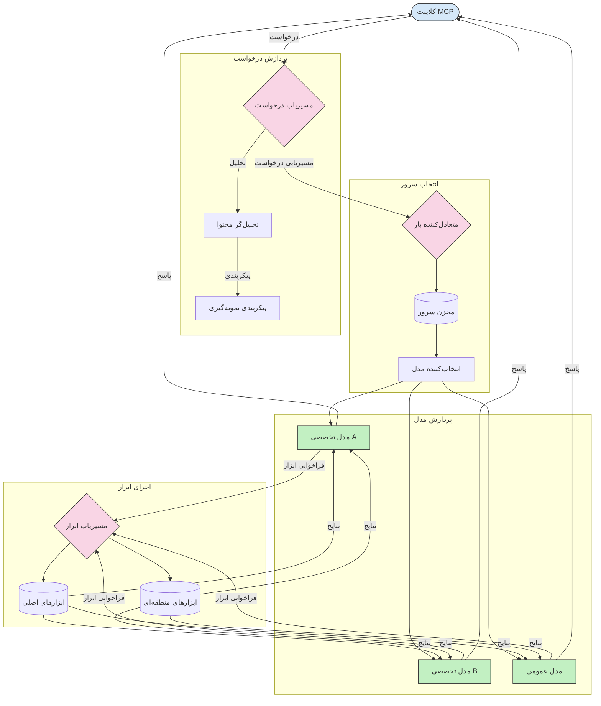

# مسیریابی در پروتکل مدل کانتکست

مسیریابی برای هدایت درخواست‌ها به مدل‌ها، ابزارها یا خدمات مناسب در اکوسیستم MCP ضروری است.

## مقدمه

مسیریابی در پروتکل مدل کانتکست (MCP) شامل هدایت درخواست‌ها به مناسب‌ترین مدل‌ها یا خدمات بر اساس معیارهای مختلفی مانند نوع محتوا، زمینه کاربر و بار سیستم است. این کار تضمین‌کننده پردازش بهینه و استفاده بهینه از منابع می‌باشد.

## اهداف یادگیری

تا پایان این درس قادر خواهید بود:

- اصول مسیریابی در MCP را درک کنید.
- مسیریابی مبتنی بر محتوا را برای هدایت درخواست‌ها به خدمات تخصصی پیاده‌سازی کنید.
- استراتژی‌های هوشمند متعادل‌سازی بار را برای بهینه‌سازی استفاده از منابع اعمال کنید.
- مسیریابی ابزار پویا را بر اساس زمینه درخواست پیاده‌سازی کنید.

## مسیریابی مبتنی بر محتوا

مسیریابی مبتنی بر محتوا درخواست‌ها را بر اساس محتوای آنها به خدمات تخصصی هدایت می‌کند. به عنوان مثال، درخواست‌های مرتبط با تولید کد می‌توانند به مدل کد تخصصی هدایت شوند، در حالی که درخواست‌های نوشتار خلاقانه به مدل نوشتاری خلاق فرستاده می‌شوند.

بیایید یک نمونه پیاده‌سازی در زبان‌های برنامه‌نویسی مختلف را ببینیم.

<details>
<summary>.NET</summary>

```csharp
// .NET Example: Content-based routing in MCP
public class ContentBasedRouter
{
    private readonly Dictionary<string, McpClient> _specializedClients;
    private readonly RoutingClassifier _classifier;
    
    public ContentBasedRouter()
    {
        // Initialize specialized clients for different domains
        _specializedClients = new Dictionary<string, McpClient>
        {
            ["code"] = new McpClient("https://code-specialized-mcp.com"),
            ["creative"] = new McpClient("https://creative-specialized-mcp.com"),
            ["scientific"] = new McpClient("https://scientific-specialized-mcp.com"),
            ["general"] = new McpClient("https://general-mcp.com")
        };
        
        // Initialize content classifier
        _classifier = new RoutingClassifier();
    }
    
    public async Task<McpResponse> RouteAndProcessAsync(string prompt, IDictionary<string, object> parameters = null)
    {
        // Classify the prompt to determine the best specialized service
        string category = await _classifier.ClassifyPromptAsync(prompt);
        
        // Get the appropriate client or fall back to general
        var client = _specializedClients.ContainsKey(category) 
            ? _specializedClients[category] 
            : _specializedClients["general"];
            
        Console.WriteLine($"Routing request to {category} specialized service");
        
        // Send request to the selected service
        return await client.SendPromptAsync(prompt, parameters);
    }
    
    // Simple classifier for routing decisions
    private class RoutingClassifier
    {
        public Task<string> ClassifyPromptAsync(string prompt)
        {
            prompt = prompt.ToLowerInvariant();
            
            if (prompt.Contains("code") || prompt.Contains("function") || 
                prompt.Contains("program") || prompt.Contains("algorithm"))
            {
                return Task.FromResult("code");
            }
            
            if (prompt.Contains("story") || prompt.Contains("creative") || 
                prompt.Contains("imagine") || prompt.Contains("design"))
            {
                return Task.FromResult("creative");
            }
            
            if (prompt.Contains("science") || prompt.Contains("research") || 
                prompt.Contains("analyze") || prompt.Contains("study"))
            {
                return Task.FromResult("scientific");
            }
            
            return Task.FromResult("general");
        }
    }
}
```

در کد قبلی، ما:

- یک کلاس `ContentBasedRouter` ایجاد کردیم که درخواست‌ها را بر اساس محتوای prompt مسیریابی می‌کند.
- کلاینت‌های تخصصی برای حوزه‌های مختلف (کد، خلاقانه، علمی، عمومی) را مقداردهی اولیه کردیم.
- یک دسته‌بندی‌کننده ساده پیاده‌سازی کردیم که دسته‌بندی prompt را تعیین و آن را به سرویس تخصصی مناسب هدایت می‌کند.
- مکانیزم برگشتی استفاده کردیم تا در صورت نبود سرویس تخصصی، درخواست‌ها را به سرویس عمومی هدایت کند.
- پردازش غیرهمزمان برای رسیدگی کارآمد به درخواست‌ها پیاده‌سازی کردیم.
- از یک دیکشنری برای نگاشت دسته‌های محتوا به کلاینت‌های تخصصی MCP استفاده کردیم.
- دسته‌بندی‌کننده ساده‌ای که prompt را تجزیه و دسته‌بندی مناسب بازمی‌گرداند، پیاده‌سازی کردیم.
- از کلاینت تخصصی برای ارسال درخواست و دریافت پاسخ استفاده کردیم.
- مواردی که prompt با هیچ دسته تخصصی مطابقت ندارد را با هدایت به سرویس عمومی مدیریت کردیم.

</details>

## متعادل‌سازی بار هوشمند

متعادل‌سازی بار استفاده از منابع را بهینه و دسترسی بالای خدمات MCP را تضمین می‌کند. راه‌های مختلفی برای پیاده‌سازی متعادل‌سازی بار وجود دارد، مانند round-robin، زمان پاسخ وزنی، یا استراتژی‌های آگاه به محتوا.

بیایید به نمونه زیر نگاه کنیم که از استراتژی‌های زیر استفاده می‌کند:

- **Round Robin**: درخواست‌ها را به طور یکنواخت بین سرورهای موجود توزیع می‌کند.
- **Weighted Response Time**: درخواست‌ها را بر اساس میانگین زمان پاسخگویی سرورها مسیریابی می‌کند.
- **Content-Aware**: درخواست‌ها را بر اساس محتوا به سرورهای تخصصی هدایت می‌کند.

<details>
<summary>Java</summary>

```java
// نمونه جاوا: تعادل بار هوشمند برای سرورهای MCP
public class McpLoadBalancer {
    private final List<McpServerNode> serverNodes;
    private final LoadBalancingStrategy strategy;
    
    public McpLoadBalancer(List<McpServerNode> nodes, LoadBalancingStrategy strategy) {
        this.serverNodes = new ArrayList<>(nodes);
        this.strategy = strategy;
    }
    
    public McpResponse processRequest(McpRequest request) {
        // انتخاب بهترین سرور بر اساس استراتژی
        McpServerNode selectedNode = strategy.selectNode(serverNodes, request);
        
        try {
            // ارسال درخواست به گره انتخاب شده
            return selectedNode.processRequest(request);
        } catch (Exception e) {
            // مدیریت خطا - پیاده‌سازی مجدد تلاش یا منطق جایگزین
            System.err.println("Error processing request on node " + selectedNode.getId() + ": " + e.getMessage());
            
            // علامت‌گذاری گره به عنوان احتمالاً ناسالم
            selectedNode.recordFailure();
            
            // تلاش برای گره بعدی بهتر به عنوان جایگزین
            List<McpServerNode> remainingNodes = new ArrayList<>(serverNodes);
            remainingNodes.remove(selectedNode);
            
            if (!remainingNodes.isEmpty()) {
                McpServerNode fallbackNode = strategy.selectNode(remainingNodes, request);
                return fallbackNode.processRequest(request);
            } else {
                throw new RuntimeException("All MCP server nodes failed to process the request");
            }
        }
    }
    
    // وظیفه بررسی سلامت گره
    public void startHealthChecks(Duration interval) {
        ScheduledExecutorService scheduler = Executors.newScheduledThreadPool(1);
        scheduler.scheduleAtFixedRate(() -> {
            for (McpServerNode node : serverNodes) {
                try {
                    boolean isHealthy = node.checkHealth();
                    System.out.println("Node " + node.getId() + " health status: " + 
                                      (isHealthy ? "HEALTHY" : "UNHEALTHY"));
                } catch (Exception e) {
                    System.err.println("Health check failed for node " + node.getId());
                    node.setHealthy(false);
                }
            }
        }, 0, interval.toMillis(), TimeUnit.MILLISECONDS);
    }
    
    // رابط برای استراتژی‌های تعادل بار
    public interface LoadBalancingStrategy {
        McpServerNode selectNode(List<McpServerNode> nodes, McpRequest request);
    }
    
    // استراتژی گردشی (راند-روبین)
    public static class RoundRobinStrategy implements LoadBalancingStrategy {
        private AtomicInteger counter = new AtomicInteger(0);
        
        @Override
        public McpServerNode selectNode(List<McpServerNode> nodes, McpRequest request) {
            List<McpServerNode> healthyNodes = nodes.stream()
                .filter(McpServerNode::isHealthy)
                .collect(Collectors.toList());
            
            if (healthyNodes.isEmpty()) {
                throw new RuntimeException("No healthy nodes available");
            }
            
            int index = counter.getAndIncrement() % healthyNodes.size();
            return healthyNodes.get(index);
        }
    }
    
    // استراتژی زمان پاسخ وزن‌دار
    public static class ResponseTimeStrategy implements LoadBalancingStrategy {
        @Override
        public McpServerNode selectNode(List<McpServerNode> nodes, McpRequest request) {
            return nodes.stream()
                .filter(McpServerNode::isHealthy)
                .min(Comparator.comparing(McpServerNode::getAverageResponseTime))
                .orElseThrow(() -> new RuntimeException("No healthy nodes available"));
        }
    }
    
    // استراتژی آگاه به محتوا
    public static class ContentAwareStrategy implements LoadBalancingStrategy {
        @Override
        public McpServerNode selectNode(List<McpServerNode> nodes, McpRequest request) {
            // تعیین ویژگی‌های درخواست
            boolean isCodeRequest = request.getPrompt().contains("code") || 
                                   request.getAllowedTools().contains("codeInterpreter");
            
            boolean isCreativeRequest = request.getPrompt().contains("creative") || 
                                       request.getPrompt().contains("story");
            
            // یافتن گره‌های تخصصی
            Optional<McpServerNode> specializedNode = nodes.stream()
                .filter(McpServerNode::isHealthy)
                .filter(node -> {
                    if (isCodeRequest && node.getSpecialization().equals("code")) {
                        return true;
                    }
                    if (isCreativeRequest && node.getSpecialization().equals("creative")) {
                        return true;
                    }
                    return false;
                })
                .findFirst();
            
            // بازگرداندن گره تخصصی یا کم‌بارترین گره
            return specializedNode.orElse(
                nodes.stream()
                    .filter(McpServerNode::isHealthy)
                    .min(Comparator.comparing(McpServerNode::getCurrentLoad))
                    .orElseThrow(() -> new RuntimeException("No healthy nodes available"))
            );
        }
    }
}
```

در کد قبلی، ما:

- یک کلاس `McpLoadBalancer` ایجاد کردیم که لیستی از گره‌های سرور MCP را مدیریت و درخواست‌ها را بر اساس استراتژی متعادل‌سازی بار انتخاب شده مسیریابی می‌کند.
- استراتژی‌های مختلف متعادل‌سازی بار را پیاده‌سازی کردیم: `RoundRobinStrategy`، `ResponseTimeStrategy` و `ContentAwareStrategy`.
- از یک `ScheduledExecutorService` برای بررسی دوره‌ای سلامت گره‌های سرور استفاده کردیم.
- مکانیزم بررسی سلامت پیاده‌سازی کردیم که گره‌ها را بر اساس پاسخ به بررسی سلامت سالم یا ناسالم علامت‌گذاری می‌کند.
- پردازش درخواست با مدیریت خطا و منطق برگشتی برای اطمینان از دسترسی بالا انجام دادیم.
- از کلاس `McpServerNode` برای نمایندگی گره‌های سرور MCP فردی، شامل وضعیت سلامت، میانگین زمان پاسخ و بار فعلی استفاده کردیم.
- کلاس `McpRequest` را برای کپسوله کردن جزئیات درخواست مانند prompt و ابزارهای مجاز پیاده‌سازی کردیم.
- از Java Streams برای فیلتر و انتخاب گره‌ها بر اساس وضعیت سلامت و تخصص استفاده کردیم.

</details>

## مسیریابی ابزار پویا

مسیریابی ابزار تضمین می‌کند که فراخوانی ابزارها بر اساس زمینه به مناسب‌ترین سرویس هدایت شوند. مثلاً فراخوانی ابزار هواشناسی ممکن است بر اساس موقعیت کاربر به یک نقطه پایانی منطقه‌ای هدایت شود یا ابزار ماشین‌حساب نیاز به استفاده از نسخه خاصی از API داشته باشد.

بیایید نگاهی به نمونه‌ای بیندازیم که مسیریابی ابزار پویا بر اساس تحلیل درخواست، نقاط پایانی منطقه‌ای و پشتیبانی نسخه‌گذاری را نشان می‌دهد.

<details>
<summary>Python</summary>

```python
# مثال پایتون: مسیریابی دینامیک ابزار بر اساس تحلیل درخواست
class McpToolRouter:
    def __init__(self):
        # ثبت نقاط پایانی ابزارهای در دسترس
        self.tool_endpoints = {
            "weatherTool": "https://weather-service.example.com/api",
            "calculatorTool": "https://calculator-service.example.com/compute",
            "databaseTool": "https://database-service.example.com/query",
            "searchTool": "https://search-service.example.com/search"
        }
        
        # نقاط پایانی منطقه‌ای برای توزیع جهانی
        self.regional_endpoints = {
            "us": {
                "weatherTool": "https://us-west.weather-service.example.com/api",
                "searchTool": "https://us.search-service.example.com/search"
            },
            "europe": {
                "weatherTool": "https://eu.weather-service.example.com/api",
                "searchTool": "https://eu.search-service.example.com/search"
            },
            "asia": {
                "weatherTool": "https://asia.weather-service.example.com/api",
                "searchTool": "https://asia.search-service.example.com/search"
            }
        }
        
        # پشتیبانی از نسخه‌بندی ابزار
        self.tool_versions = {
            "weatherTool": {
                "default": "v2",
                "v1": "https://weather-service.example.com/api/v1",
                "v2": "https://weather-service.example.com/api/v2",
                "beta": "https://weather-service.example.com/api/beta"
            }
        }
    
    async def route_tool_request(self, tool_name, parameters, user_context=None):
        """Route a tool request to the appropriate endpoint based on context"""
        endpoint = self._select_endpoint(tool_name, parameters, user_context)
        
        if not endpoint:
            raise ValueError(f"No endpoint available for tool: {tool_name}")
        
        # انجام درخواست واقعی به نقطه پایانی انتخاب شده
        return await self._execute_tool_request(endpoint, tool_name, parameters)
    
    def _select_endpoint(self, tool_name, parameters, user_context=None):
        """Select the most appropriate endpoint based on context"""
        # نقطه پایانی پایه از رجیستری
        if tool_name not in self.tool_endpoints:
            return None
            
        base_endpoint = self.tool_endpoints[tool_name]
        
        # بررسی اینکه آیا نیاز به استفاده از نسخه خاصی از ابزار داریم
        if tool_name in self.tool_versions:
            version_info = self.tool_versions[tool_name]
            
            # استفاده از نسخه مشخص شده یا پیش‌فرض
            requested_version = parameters.get("_version", version_info["default"])
            if requested_version in version_info:
                base_endpoint = version_info[requested_version]
        
        # بررسی مسیریابی منطقه‌ای در صورت مشخص بودن منطقه کاربر
        if user_context and "region" in user_context:
            user_region = user_context["region"]
            
            if user_region in self.regional_endpoints:
                regional_tools = self.regional_endpoints[user_region]
                
                if tool_name in regional_tools:
                    # استفاده از نقطه پایانی مخصوص منطقه
                    return regional_tools[tool_name]
        
        # بررسی الزامات اقامت داده‌ها
        if user_context and "data_residency" in user_context:
            # این بخش منطق لازم برای اطمینان از باقی ماندن داده‌ها در حوزه قضایی مشخص شده را پیاده‌سازی می‌کند
            pass
        
        # بررسی مسیریابی مبتنی بر تأخیر
        if user_context and "latency_sensitive" in user_context and user_context["latency_sensitive"]:
            # این بخش منطق لازم برای انتخاب نقطه پایانی با کمترین تأخیر را پیاده‌سازی می‌کند
            pass
            
        return base_endpoint
        
    async def _execute_tool_request(self, endpoint, tool_name, parameters):
        """Execute the actual tool request to the selected endpoint"""
        try:
            async with aiohttp.ClientSession() as session:
                async with session.post(
                    endpoint,
                    json={"toolName": tool_name, "parameters": parameters},
                    headers={"Content-Type": "application/json"}
                ) as response:
                    if response.status == 200:
                        result = await response.json()
                        return result
                    else:
                        error_text = await response.text()
                        raise Exception(f"Tool execution failed: {error_text}")
        except Exception as e:
            # پیاده‌سازی منطق تکرار تلاش یا استراتژی جایگزین
            print(f"Error executing tool {tool_name} at {endpoint}: {str(e)}")
            raise
```

در کد قبلی، ما:

- یک کلاس `McpToolRouter` ایجاد کردیم که مسیریابی ابزار را بر اساس تحلیل درخواست، نقاط پایانی منطقه‌ای و پشتیبانی نسخه‌گذاری مدیریت می‌کند.
- نقاط پایانی ابزار موجود و نقاط پایانی منطقه‌ای برای توزیع جهانی ثبت کردیم.
- منطق مسیریابی پویا پیاده‌سازی کردیم که نقطه پایانی مناسب را بر اساس زمینه کاربر، مانند منطقه و الزامات اقامت داده انتخاب می‌کند.
- پشتیبانی نسخه‌گذاری برای ابزارها پیاده‌سازی کردیم تا کاربران بتوانند نسخه مدنظر خود از ابزار را مشخص کنند.
- از درخواست‌های HTTP غیرهمزمان برای اجرای فراخوانی ابزار و مدیریت پاسخ‌ها استفاده کردیم.

</details>

## معماری نمونه‌برداری و مسیریابی در MCP

نمونه‌برداری یک مؤلفه حیاتی از پروتکل مدل کانتکست (MCP) است که امکان پردازش و مسیریابی کارآمد درخواست‌ها را فراهم می‌کند. این فرآیند شامل تحلیل درخواست‌های ورودی برای تعیین مناسب‌ترین مدل یا سرویس برای رسیدگی به آنها بر اساس معیارهای مختلفی مانند نوع محتوا، زمینه کاربر و بار سیستم است.

نمونه‌برداری و مسیریابی می‌توانند با هم ترکیب شوند تا معماری قوی‌ای ایجاد کنند که استفاده از منابع را بهینه کرده و دسترسی بالا را تضمین می‌کند. فرآیند نمونه‌برداری می‌تواند برای دسته‌بندی درخواست‌ها استفاده شود، در حالی که مسیریابی آنها را به مدل‌ها یا خدمات مناسب هدایت می‌کند.

نمودار زیر نشان می‌دهد که چگونه نمونه‌برداری و مسیریابی در یک معماری جامع MCP در کنار یکدیگر کار می‌کنند:



## گام بعدی چیست

- [5.6 Sampling](../mcp-sampling/README.md)

---

<!-- CO-OP TRANSLATOR DISCLAIMER START -->
**سلب مسئولیت**:
این سند با استفاده از سرویس ترجمه هوش مصنوعی [Co-op Translator](https://github.com/Azure/co-op-translator) ترجمه شده است. در حالی که ما در تلاش برای دقت هستیم، لطفاً توجه داشته باشید که ترجمه‌های خودکار ممکن است شامل خطاها یا نادرستی‌هایی باشند. سند اصلی به زبان مادری خود باید به عنوان منبع معتبر در نظر گرفته شود. برای اطلاعات حیاتی، ترجمه حرفه‌ای انسانی توصیه می‌شود. ما در قبال هرگونه سوء تفاهم یا برداشت نادرست ناشی از استفاده از این ترجمه مسئولیتی نداریم.
<!-- CO-OP TRANSLATOR DISCLAIMER END -->