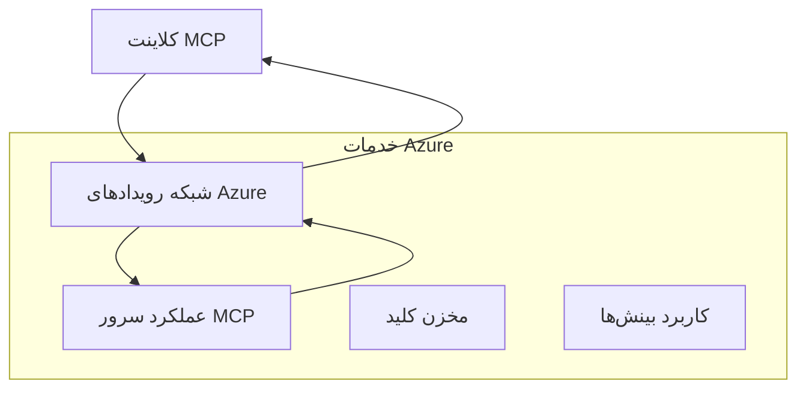
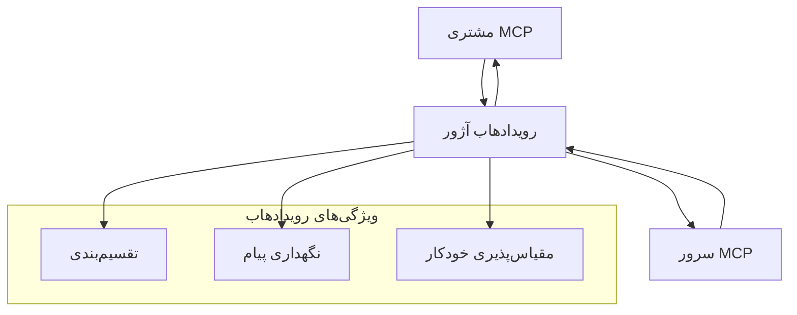

# راهنمای پیشرفته پیاده‌سازی حمل‌ونقل‌های سفارشی MCP

پروتکل مدل کانتکست (MCP) انعطاف‌پذیری در مکانیزم‌های حمل‌ونقل را فراهم می‌کند و امکان پیاده‌سازی‌های سفارشی برای محیط‌های سازمانی تخصصی را می‌دهد. این راهنمای پیشرفته پیاده‌سازی‌های حمل‌ونقل سفارشی را با استفاده از Azure Event Grid و Azure Event Hubs به عنوان مثال‌های عملی برای ساخت راه‌حل‌های MCP بومی ابری و مقیاس‌پذیر بررسی می‌کند.

> **نگاهی به آینده:** این راهنما بر اساس **مشخصات MCP 2025-11-25** نوشته شده است، جایی که ترتیب جلسات باید برای هر جلسه حفظ شود (به پروتکل پیام در ادامه مراجعه کنید). نسخه کاندید `2026-07-28` کل سطح جلسه در پروتکل را حذف می‌کند و نیازمند هدرهای `Mcp-Method`/`Mcp-Name` است تا گیت‌وی‌ها و حمل‌ونقل‌های سفارشی بتوانند به ازای هر درخواست مسیر‌یابی کنند نه به ازای هر جلسه. به [چه تغییراتی در MCP اتفاق افتاده: نسخه کاندید 2026-07-28](../../01-CoreConcepts/mcp-2026-07-28-release-candidate.md) مراجعه کنید.

## مقدمه

در حالی که حمل‌ونقل‌های استاندارد MCP (stdio و HTTP streaming) اکثر موارد استفاده را پوشش می‌دهند، محیط‌های سازمانی اغلب به مکانیزم‌های حمل‌ونقل تخصصی برای بهبود مقیاس‌پذیری، قابلیت اطمینان و یکپارچگی با زیرساخت‌های موجود ابری نیاز دارند. حمل‌ونقل‌های سفارشی به MCP اجازه می‌دهند از سرویس‌های پیام‌رسانی بومی ابری برای ارتباط ناهمزمان، معماری‌های رویدادمحور و پردازش توزیع‌شده استفاده کند.

این درس پیاده‌سازی‌های پیشرفته حمل‌ونقل بر اساس جدیدترین مشخصات MCP (2025-11-25)، سرویس‌های پیام‌رسانی Azure و الگوهای یکپارچه‌سازی سازمانی تثبیت‌شده را بررسی می‌کند.

### **معماری حمل‌ونقل MCP**

**از مشخصات MCP (2025-11-25):**

- **حمل‌ونقل‌های استاندارد**: stdio (توصیه‌شده)، HTTP streaming (برای سناریوهای دوردست)
- **حمل‌ونقل‌های سفارشی**: هر حمل‌ونقلی که پروتکل تبادل پیام MCP را پیاده‌سازی کند
- **قالب پیام**: JSON-RPC 2.0 با افزونه‌های خاص MCP
- **ارتباط دوطرفه**: ارتباط دوطرفه کامل برای اطلاع‌رسانی و پاسخ‌ها الزامی است

## اهداف یادگیری

در پایان این درس پیشرفته، شما قادر خواهید بود:

- **درک الزامات حمل‌ونقل سفارشی**: پیاده‌سازی پروتکل MCP روی هر لایه حمل‌ونقل در حالی که انطباق حفظ شود
- **ساخت حمل‌ونقل Azure Event Grid**: ایجاد سرورهای MCP رویدادمحور با استفاده از Azure Event Grid برای مقیاس‌پذیری بدون سرور
- **پیاده‌سازی حمل‌ونقل Azure Event Hubs**: طراحی راه‌حل‌های MCP با نرخ داده بالا با استفاده از Azure Event Hubs برای استریمینگ در زمان واقعی
- **کاربرد الگوهای سازمانی**: یکپارچه‌سازی حمل‌ونقل‌های سفارشی با زیرساخت‌ها و مدل‌های امنیتی موجود Azure
- **مدیریت قابلیت اطمینان حمل‌ونقل**: پیاده‌سازی دوام پیام، ترتیب و مدیریت خطا برای سناریوهای سازمانی
- **بهینه‌سازی عملکرد**: طراحی راه‌حل‌های حمل‌ونقل برای نیازهای مقیاس، تأخیر و توان عملیاتی

## **الزامات حمل‌ونقل**

### **الزامات اصلی از مشخصات MCP (2025-11-25):**

```yaml
Message Protocol:
  format: "JSON-RPC 2.0 with MCP extensions"
  bidirectional: "Full duplex communication required"
  ordering: "Message ordering must be preserved per session"
  
Transport Layer:
  reliability: "Transport MUST handle connection failures gracefully"
  security: "Transport MUST support secure communication"
  identification: "Each session MUST have unique identifier"
  
Custom Transport:
  compliance: "MUST implement complete MCP message exchange"
  extensibility: "MAY add transport-specific features"
  interoperability: "MUST maintain protocol compatibility"
```

## **پیاده‌سازی حمل‌ونقل Azure Event Grid**

Azure Event Grid خدمت‌رسانی مسیریابی رویداد بدون سرور را فراهم می‌کند که برای معماری‌های MCP رویدادمحور ایده‌آل است. این پیاده‌سازی نحوه ساخت سیستم‌های MCP مقیاس‌پذیر و با اتصال کم را نشان می‌دهد.

### **نمای کلی معماری**



### **پیاده‌سازی C# - حمل‌ونقل Event Grid**

```csharp
using Azure.Messaging.EventGrid;
using Microsoft.Extensions.Azure;
using System.Text.Json;

public class EventGridMcpTransport : IMcpTransport
{
    private readonly EventGridPublisherClient _publisher;
    private readonly string _topicEndpoint;
    private readonly string _clientId;
    
    public EventGridMcpTransport(string topicEndpoint, string accessKey, string clientId)
    {
        _publisher = new EventGridPublisherClient(
            new Uri(topicEndpoint), 
            new AzureKeyCredential(accessKey));
        _topicEndpoint = topicEndpoint;
        _clientId = clientId;
    }
    
    public async Task SendMessageAsync(McpMessage message)
    {
        var eventGridEvent = new EventGridEvent(
            subject: $"mcp/{_clientId}",
            eventType: "MCP.MessageReceived",
            dataVersion: "1.0",
            data: JsonSerializer.Serialize(message))
        {
            Id = Guid.NewGuid().ToString(),
            EventTime = DateTimeOffset.UtcNow
        };
        
        await _publisher.SendEventAsync(eventGridEvent);
    }
    
    public async Task<McpMessage> ReceiveMessageAsync(CancellationToken cancellationToken)
    {
        // Event Grid is push-based, so implement webhook receiver
        // This would typically be handled by Azure Functions trigger
        throw new NotImplementedException("Use EventGridTrigger in Azure Functions");
    }
}

// Azure Function for receiving Event Grid events
[FunctionName("McpEventGridReceiver")]
public async Task<IActionResult> HandleEventGridMessage(
    [EventGridTrigger] EventGridEvent eventGridEvent,
    ILogger log)
{
    try
    {
        var mcpMessage = JsonSerializer.Deserialize<McpMessage>(
            eventGridEvent.Data.ToString());
        
        // Process MCP message
        var response = await _mcpServer.ProcessMessageAsync(mcpMessage);
        
        // Send response back via Event Grid
        await _transport.SendMessageAsync(response);
        
        return new OkResult();
    }
    catch (Exception ex)
    {
        log.LogError(ex, "Error processing Event Grid MCP message");
        return new BadRequestResult();
    }
}
```

### **پیاده‌سازی TypeScript - حمل‌ونقل Event Grid**

```typescript
import { EventGridPublisherClient, AzureKeyCredential } from "@azure/eventgrid";
import { McpTransport, McpMessage } from "./mcp-types";

export class EventGridMcpTransport implements McpTransport {
    private publisher: EventGridPublisherClient;
    private clientId: string;
    
    constructor(
        private topicEndpoint: string,
        private accessKey: string,
        clientId: string
    ) {
        this.publisher = new EventGridPublisherClient(
            topicEndpoint,
            new AzureKeyCredential(accessKey)
        );
        this.clientId = clientId;
    }
    
    async sendMessage(message: McpMessage): Promise<void> {
        const event = {
            id: crypto.randomUUID(),
            source: `mcp-client-${this.clientId}`,
            type: "MCP.MessageReceived",
            time: new Date(),
            data: message
        };
        
        await this.publisher.sendEvents([event]);
    }
    
    // دریافت رویداد محور از طریق Azure Functions
    onMessage(handler: (message: McpMessage) => Promise<void>): void {
        // پیاده‌سازی از محرک Event Grid در Azure Functions استفاده خواهد کرد
        // این یک رابط مفهومی برای دریافت‌کننده webhook است
    }
}

// پیاده‌سازی Azure Functions
import { app, InvocationContext, EventGridEvent } from "@azure/functions";

app.eventGrid("mcpEventGridHandler", {
    handler: async (event: EventGridEvent, context: InvocationContext) => {
        try {
            const mcpMessage = event.data as McpMessage;
            
            // پردازش پیام MCP
            const response = await mcpServer.processMessage(mcpMessage);
            
            // ارسال پاسخ از طریق Event Grid
            await transport.sendMessage(response);
            
        } catch (error) {
            context.error("Error processing MCP message:", error);
            throw error;
        }
    }
});
```

### **پیاده‌سازی Python - حمل‌ونقل Event Grid**

```python
from azure.eventgrid import EventGridPublisherClient, EventGridEvent
from azure.core.credentials import AzureKeyCredential
import asyncio
import json
from typing import Callable, Optional
import uuid
from datetime import datetime

class EventGridMcpTransport:
    def __init__(self, topic_endpoint: str, access_key: str, client_id: str):
        self.client = EventGridPublisherClient(
            topic_endpoint, 
            AzureKeyCredential(access_key)
        )
        self.client_id = client_id
        self.message_handler: Optional[Callable] = None
    
    async def send_message(self, message: dict) -> None:
        """Send MCP message via Event Grid"""
        event = EventGridEvent(
            data=message,
            subject=f"mcp/{self.client_id}",
            event_type="MCP.MessageReceived",
            data_version="1.0"
        )
        
        await self.client.send(event)
    
    def on_message(self, handler: Callable[[dict], None]) -> None:
        """Register message handler for incoming events"""
        self.message_handler = handler

# پیاده‌سازی توابع آزور
import azure.functions as func
import logging

def main(event: func.EventGridEvent) -> None:
    """Azure Functions Event Grid trigger for MCP messages"""
    try:
        # تجزیه پیام MCP از رویداد Event Grid
        mcp_message = json.loads(event.get_body().decode('utf-8'))
        
        # پردازش پیام MCP
        response = process_mcp_message(mcp_message)
        
        # ارسال پاسخ از طریق Event Grid
        # (پیاده‌سازی یک کلاینت جدید Event Grid ایجاد می‌کند)
        
    except Exception as e:
        logging.error(f"Error processing MCP Event Grid message: {e}")
        raise
```

## **پیاده‌سازی حمل‌ونقل Azure Event Hubs**

Azure Event Hubs قابلیت‌های استریمینگ با نرخ بالا و زمان واقعی را برای سناریوهای MCP که به تأخیر کم و حجم بالای پیام نیاز دارند، فراهم می‌کند.

### **نمای کلی معماری**



### **پیاده‌سازی C# - حمل‌ونقل Event Hubs**

```csharp
using Azure.Messaging.EventHubs;
using Azure.Messaging.EventHubs.Producer;
using Azure.Messaging.EventHubs.Consumer;
using System.Text;

public class EventHubsMcpTransport : IMcpTransport, IDisposable
{
    private readonly EventHubProducerClient _producer;
    private readonly EventHubConsumerClient _consumer;
    private readonly string _consumerGroup;
    private readonly CancellationTokenSource _cancellationTokenSource;
    
    public EventHubsMcpTransport(
        string connectionString, 
        string eventHubName,
        string consumerGroup = "$Default")
    {
        _producer = new EventHubProducerClient(connectionString, eventHubName);
        _consumer = new EventHubConsumerClient(
            consumerGroup, 
            connectionString, 
            eventHubName);
        _consumerGroup = consumerGroup;
        _cancellationTokenSource = new CancellationTokenSource();
    }
    
    public async Task SendMessageAsync(McpMessage message)
    {
        var messageBody = JsonSerializer.Serialize(message);
        var eventData = new EventData(Encoding.UTF8.GetBytes(messageBody));
        
        // Add MCP-specific properties
        eventData.Properties.Add("MessageType", message.Method ?? "response");
        eventData.Properties.Add("MessageId", message.Id);
        eventData.Properties.Add("Timestamp", DateTimeOffset.UtcNow);
        
        await _producer.SendAsync(new[] { eventData });
    }
    
    public async Task StartReceivingAsync(
        Func<McpMessage, Task> messageHandler)
    {
        await foreach (PartitionEvent partitionEvent in _consumer.ReadEventsAsync(
            _cancellationTokenSource.Token))
        {
            try
            {
                var messageBody = Encoding.UTF8.GetString(
                    partitionEvent.Data.EventBody.ToArray());
                var mcpMessage = JsonSerializer.Deserialize<McpMessage>(messageBody);
                
                await messageHandler(mcpMessage);
            }
            catch (Exception ex)
            {
                // Handle deserialization or processing errors
                Console.WriteLine($"Error processing message: {ex.Message}");
            }
        }
    }
    
    public void Dispose()
    {
        _cancellationTokenSource?.Cancel();
        _producer?.DisposeAsync().AsTask().Wait();
        _consumer?.DisposeAsync().AsTask().Wait();
        _cancellationTokenSource?.Dispose();
    }
}
```

### **پیاده‌سازی TypeScript - حمل‌ونقل Event Hubs**

```typescript
import { 
    EventHubProducerClient, 
    EventHubConsumerClient, 
    EventData 
} from "@azure/event-hubs";

export class EventHubsMcpTransport implements McpTransport {
    private producer: EventHubProducerClient;
    private consumer: EventHubConsumerClient;
    private isReceiving = false;
    
    constructor(
        private connectionString: string,
        private eventHubName: string,
        private consumerGroup: string = "$Default"
    ) {
        this.producer = new EventHubProducerClient(
            connectionString, 
            eventHubName
        );
        this.consumer = new EventHubConsumerClient(
            consumerGroup,
            connectionString,
            eventHubName
        );
    }
    
    async sendMessage(message: McpMessage): Promise<void> {
        const eventData: EventData = {
            body: JSON.stringify(message),
            properties: {
                messageType: message.method || "response",
                messageId: message.id,
                timestamp: new Date().toISOString()
            }
        };
        
        await this.producer.sendBatch([eventData]);
    }
    
    async startReceiving(
        messageHandler: (message: McpMessage) => Promise<void>
    ): Promise<void> {
        if (this.isReceiving) return;
        
        this.isReceiving = true;
        
        const subscription = this.consumer.subscribe({
            processEvents: async (events, context) => {
                for (const event of events) {
                    try {
                        const messageBody = event.body as string;
                        const mcpMessage: McpMessage = JSON.parse(messageBody);
                        
                        await messageHandler(mcpMessage);
                        
                        // به‌روزرسانی نقطه بازبینی برای تحویل حداقل یک بار
                        await context.updateCheckpoint(event);
                    } catch (error) {
                        console.error("Error processing Event Hubs message:", error);
                    }
                }
            },
            processError: async (err, context) => {
                console.error("Event Hubs error:", err);
            }
        });
    }
    
    async close(): Promise<void> {
        this.isReceiving = false;
        await this.producer.close();
        await this.consumer.close();
    }
}
```

### **پیاده‌سازی Python - حمل‌ونقل Event Hubs**

```python
from azure.eventhub import EventHubProducerClient, EventHubConsumerClient
from azure.eventhub import EventData
import json
import asyncio
from typing import Callable, Dict, Any
import logging

class EventHubsMcpTransport:
    def __init__(
        self, 
        connection_string: str, 
        eventhub_name: str,
        consumer_group: str = "$Default"
    ):
        self.producer = EventHubProducerClient.from_connection_string(
            connection_string, 
            eventhub_name=eventhub_name
        )
        self.consumer = EventHubConsumerClient.from_connection_string(
            connection_string,
            consumer_group=consumer_group,
            eventhub_name=eventhub_name
        )
        self.is_receiving = False
    
    async def send_message(self, message: Dict[str, Any]) -> None:
        """Send MCP message via Event Hubs"""
        event_data = EventData(json.dumps(message))
        
        # ویژگی‌های خاص MCP را اضافه کنید
        event_data.properties = {
            "messageType": message.get("method", "response"),
            "messageId": message.get("id"),
            "timestamp": "2025-01-14T10:30:00Z"  # از زمان واقعی استفاده کنید
        }
        
        async with self.producer:
            event_data_batch = await self.producer.create_batch()
            event_data_batch.add(event_data)
            await self.producer.send_batch(event_data_batch)
    
    async def start_receiving(
        self, 
        message_handler: Callable[[Dict[str, Any]], None]
    ) -> None:
        """Start receiving MCP messages from Event Hubs"""
        if self.is_receiving:
            return
        
        self.is_receiving = True
        
        async with self.consumer:
            await self.consumer.receive(
                on_event=self._on_event_received(message_handler),
                starting_position="-1"  # از ابتدا شروع کنید
            )
    
    def _on_event_received(self, handler: Callable):
        """Internal event handler wrapper"""
        async def handle_event(partition_context, event):
            try:
                # پیام MCP را از رویداد Event Hubs تجزیه کنید
                message_body = event.body_as_str(encoding='UTF-8')
                mcp_message = json.loads(message_body)
                
                # پیام MCP را پردازش کنید
                await handler(mcp_message)
                
                # نقطه کنترل را برای تحویل حداقل یک بار به‌روزرسانی کنید
                await partition_context.update_checkpoint(event)
                
            except Exception as e:
                logging.error(f"Error processing Event Hubs message: {e}")
        
        return handle_event
    
    async def close(self) -> None:
        """Clean up transport resources"""
        self.is_receiving = False
        await self.producer.close()
        await self.consumer.close()
```

## **الگوهای پیشرفته حمل‌ونقل**

### **دوام و قابلیت اطمینان پیام**

```csharp
// Implementing message durability with retry logic
public class ReliableTransportWrapper : IMcpTransport
{
    private readonly IMcpTransport _innerTransport;
    private readonly RetryPolicy _retryPolicy;
    
    public async Task SendMessageAsync(McpMessage message)
    {
        await _retryPolicy.ExecuteAsync(async () =>
        {
            try
            {
                await _innerTransport.SendMessageAsync(message);
            }
            catch (TransportException ex) when (ex.IsRetryable)
            {
                // Log and retry
                throw;
            }
        });
    }
}
```

### **یکپارچه‌سازی امنیت حمل‌ونقل**

```csharp
// Integrating Azure Key Vault for transport security
public class SecureTransportFactory
{
    private readonly SecretClient _keyVaultClient;
    
    public async Task<IMcpTransport> CreateEventGridTransportAsync()
    {
        var accessKey = await _keyVaultClient.GetSecretAsync("EventGridAccessKey");
        var topicEndpoint = await _keyVaultClient.GetSecretAsync("EventGridTopic");
        
        return new EventGridMcpTransport(
            topicEndpoint.Value.Value,
            accessKey.Value.Value,
            Environment.MachineName
        );
    }
}
```

### **نظارت و مشاهده‌پذیری حمل‌ونقل**

```csharp
// Adding telemetry to custom transports
public class ObservableTransport : IMcpTransport
{
    private readonly IMcpTransport _transport;
    private readonly ILogger _logger;
    private readonly TelemetryClient _telemetryClient;
    
    public async Task SendMessageAsync(McpMessage message)
    {
        using var activity = Activity.StartActivity("MCP.Transport.Send");
        activity?.SetTag("transport.type", "EventGrid");
        activity?.SetTag("message.method", message.Method);
        
        var stopwatch = Stopwatch.StartNew();
        
        try
        {
            await _transport.SendMessageAsync(message);
            
            _telemetryClient.TrackDependency(
                "EventGrid",
                "SendMessage",
                DateTime.UtcNow.Subtract(stopwatch.Elapsed),
                stopwatch.Elapsed,
                true
            );
        }
        catch (Exception ex)
        {
            _telemetryClient.TrackException(ex);
            throw;
        }
    }
}
```

## **سناریوهای یکپارچه‌سازی سازمانی**

### **سناریو 1: پردازش توزیع‌شده MCP**

استفاده از Azure Event Grid برای توزیع درخواست‌های MCP در چندین گره پردازشی:

```yaml
Architecture:
  - MCP Client sends requests to Event Grid topic
  - Multiple Azure Functions subscribe to process different tool types
  - Results aggregated and returned via separate response topic
  
Benefits:
  - Horizontal scaling based on message volume
  - Fault tolerance through redundant processors
  - Cost optimization with serverless compute
```

### **سناریو 2: استریمینگ MCP در زمان واقعی**

استفاده از Azure Event Hubs برای تعاملات با فرکانس بالای MCP:

```yaml
Architecture:
  - MCP Client streams continuous requests via Event Hubs
  - Stream Analytics processes and routes messages
  - Multiple consumers handle different aspect of processing
  
Benefits:
  - Low latency for real-time scenarios
  - High throughput for batch processing
  - Built-in partitioning for parallel processing
```

### **سناریو 3: معماری ترکیبی حمل‌ونقل**

ترکیب چندین حمل‌ونقل برای موارد استفاده مختلف:

```csharp
public class HybridMcpTransport : IMcpTransport
{
    private readonly IMcpTransport _realtimeTransport; // Event Hubs
    private readonly IMcpTransport _batchTransport;    // Event Grid
    private readonly IMcpTransport _fallbackTransport; // HTTP Streaming
    
    public async Task SendMessageAsync(McpMessage message)
    {
        // Route based on message characteristics
        var transport = message.Method switch
        {
            "tools/call" when IsRealtime(message) => _realtimeTransport,
            "resources/read" when IsBatch(message) => _batchTransport,
            _ => _fallbackTransport
        };
        
        await transport.SendMessageAsync(message);
    }
}
```

## **بهینه‌سازی عملکرد**

### **بسته‌بندی پیام برای Event Grid**

```csharp
public class BatchingEventGridTransport : IMcpTransport
{
    private readonly List<McpMessage> _messageBuffer = new();
    private readonly Timer _flushTimer;
    private const int MaxBatchSize = 100;
    
    public async Task SendMessageAsync(McpMessage message)
    {
        lock (_messageBuffer)
        {
            _messageBuffer.Add(message);
            
            if (_messageBuffer.Count >= MaxBatchSize)
            {
                _ = Task.Run(FlushMessages);
            }
        }
    }
    
    private async Task FlushMessages()
    {
        List<McpMessage> toSend;
        lock (_messageBuffer)
        {
            toSend = new List<McpMessage>(_messageBuffer);
            _messageBuffer.Clear();
        }
        
        if (toSend.Any())
        {
            var events = toSend.Select(CreateEventGridEvent);
            await _publisher.SendEventsAsync(events);
        }
    }
}
```

### **استراتژی تقسیم‌بندی برای Event Hubs**

```csharp
public class PartitionedEventHubsTransport : IMcpTransport
{
    public async Task SendMessageAsync(McpMessage message)
    {
        // Partition by client ID for session affinity
        var partitionKey = ExtractClientId(message);
        
        var eventData = new EventData(JsonSerializer.SerializeToUtf8Bytes(message))
        {
            PartitionKey = partitionKey
        };
        
        await _producer.SendAsync(new[] { eventData });
    }
}
```

## **آزمایش حمل‌ونقل‌های سفارشی**

### **آزمایش واحد با استفاده از تست دوبل**

```csharp
[Test]
public async Task EventGridTransport_SendMessage_PublishesCorrectEvent()
{
    // Arrange
    var mockPublisher = new Mock<EventGridPublisherClient>();
    var transport = new EventGridMcpTransport(mockPublisher.Object);
    var message = new McpMessage { Method = "tools/list", Id = "test-123" };
    
    // Act
    await transport.SendMessageAsync(message);
    
    // Assert
    mockPublisher.Verify(
        x => x.SendEventAsync(
            It.Is<EventGridEvent>(e => 
                e.EventType == "MCP.MessageReceived" &&
                e.Subject == "mcp/test-client"
            )
        ),
        Times.Once
    );
}
```

### **آزمایش یکپارچه‌سازی با Azure Test Containers**

```csharp
[Test]
public async Task EventHubsTransport_IntegrationTest()
{
    // Using Testcontainers for integration testing
    var eventHubsContainer = new EventHubsContainer()
        .WithEventHub("test-hub");
    
    await eventHubsContainer.StartAsync();
    
    var transport = new EventHubsMcpTransport(
        eventHubsContainer.GetConnectionString(),
        "test-hub"
    );
    
    // Test message round-trip
    var sentMessage = new McpMessage { Method = "test", Id = "123" };
    McpMessage receivedMessage = null;
    
    await transport.StartReceivingAsync(msg => {
        receivedMessage = msg;
        return Task.CompletedTask;
    });
    
    await transport.SendMessageAsync(sentMessage);
    await Task.Delay(1000); // Allow for message processing
    
    Assert.That(receivedMessage?.Id, Is.EqualTo("123"));
}
```

## **بهترین شیوه‌ها و راهنماها**

### **اصول طراحی حمل‌ونقل**

1. **ایدئمپو‌تنت بودن**: اطمینان از اینکه پردازش پیام تکراری است تا با نسخه‌های تکراری مقابله شود
2. **مدیریت خطا**: پیاده‌سازی مدیریت جامع خطا و صف‌های نامه مرده
3. **نظارت**: افزودن تله‌متری دقیق و بررسی‌های سلامت
4. **امنیت**: استفاده از شناسه‌های مدیریت‌شده و دسترسی حداقل امتیاز
5. **عملکرد**: طراحی برای نیازهای خاص تأخیر و توان عملیاتی شما

### **توصیه‌های خاص Azure**

1. **استفاده از شناسه مدیریت‌شده**: از رشته‌های اتصال در محیط تولید اجتناب کنید
2. **پیاده‌سازی قطع‌کننده‌های مدار**: حفاظت در برابر قطعی خدمات Azure
3. **نظارت بر هزینه‌ها**: پیگیری حجم پیام و هزینه‌های پردازش
4. **برنامه‌ریزی برای مقیاس**: طراحی استراتژی‌های تقسیم‌بندی و مقیاس‌پذیری از ابتدا
5. **آزمایش دقیق**: استفاده از Azure DevTest Labs برای آزمایش جامع

## **نتیجه‌گیری**

حمل‌ونقل‌های سفارشی MCP امکان سناریوهای قدرتمند سازمانی را با استفاده از سرویس‌های پیام‌رسانی Azure فراهم می‌کنند. با پیاده‌سازی حمل‌ونقل‌های Event Grid یا Event Hubs، می‌توانید راه‌حل‌های MCP مقیاس‌پذیر و قابل‌اطمینان بسازید که به طور یکپارچه با زیرساخت موجود Azure ادغام می‌شوند.

مثال‌های ارائه شده الگوهای آماده تولید برای پیاده‌سازی حمل‌ونقل‌های سفارشی را در حالی که انطباق با پروتکل MCP و بهترین شیوه‌های Azure حفظ می‌شود، نشان می‌دهند.

## **منابع اضافی**

- [مشخصات MCP 2025-11-25](https://modelcontextprotocol.io/specification/2025-11-25/)
- [مستندات Azure Event Grid](https://docs.microsoft.com/azure/event-grid/)
- [مستندات Azure Event Hubs](https://docs.microsoft.com/azure/event-hubs/)
- [تریگر Event Grid در Azure Functions](https://docs.microsoft.com/azure/azure-functions/functions-bindings-event-grid)
- [Azure SDK برای .NET](https://github.com/Azure/azure-sdk-for-net)
- [Azure SDK برای TypeScript](https://github.com/Azure/azure-sdk-for-js)
- [Azure SDK برای Python](https://github.com/Azure/azure-sdk-for-python)

---

> *این راهنما بر الگوهای عملی پیاده‌سازی برای سیستم‌های تولیدی MCP متمرکز است. همیشه پیاده‌سازی‌های حمل‌ونقل را با الزامات خاص خود و محدودیت‌های خدمات Azure اعتبارسنجی کنید.*
> **استاندارد فعلی**: این راهنما الزامات حمل‌ونقل و الگوهای پیشرفته حمل‌ونقل برای محیط‌های سازمانی را طبق [مشخصات MCP 2025-11-25](https://modelcontextprotocol.io/specification/2025-11-25/) منعکس می‌کند.


## مرحله بعد
- [6. مشارکت‌های جامعه](../../06-CommunityContributions/README.md)

---

<!-- CO-OP TRANSLATOR DISCLAIMER START -->
**سلب مسئولیت**:
این سند با استفاده از سرویس ترجمه هوش مصنوعی [Co-op Translator](https://github.com/Azure/co-op-translator) ترجمه شده است. در حالی که ما در تلاش برای دقت هستیم، لطفاً توجه داشته باشید که ترجمه‌های خودکار ممکن است شامل خطاها یا نادرستی‌هایی باشند. سند اصلی به زبان مادری خود باید به عنوان منبع معتبر در نظر گرفته شود. برای اطلاعات حیاتی، ترجمه حرفه‌ای انسانی توصیه می‌شود. ما در قبال هرگونه سوء تفاهم یا برداشت نادرست ناشی از استفاده از این ترجمه مسئولیتی نداریم.
<!-- CO-OP TRANSLATOR DISCLAIMER END -->