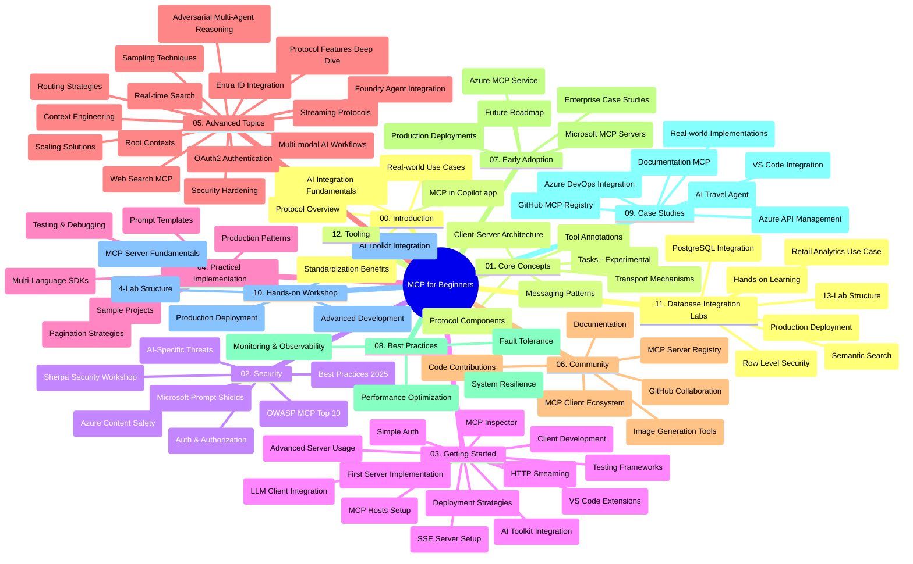

# پروتکل زمینه مدل (MCP) برای مبتدیان - راهنمای مطالعه

این راهنمای مطالعه نمای کلی‌ای از ساختار مخزن و محتوای دوره "پروتکل زمینه مدل (MCP) برای مبتدیان" ارائه می‌دهد. از این راهنما برای پیمایش کارآمد در مخزن و بهره‌مندی کامل از منابع موجود استفاده کنید.

## نمای کلی مخزن

پروتکل زمینه مدل (MCP) یک چارچوب استاندارد شده برای تعاملات بین مدل‌های هوش مصنوعی و برنامه‌های مشتری است. MCP که در ابتدا توسط Anthropic ایجاد شده بود، اکنون توسط جامعه گسترده‌تر MCP از طریق سازمان رسمی گیت‌هاب پشتیبانی می‌شود. این مخزن دوره‌ای جامع با مثال‌های کدنویسی عملی در زبان‌های C#، Java، JavaScript، Python و TypeScript ارائه می‌دهد که مخصوص توسعه‌دهندگان هوش مصنوعی، معماران سیستم و مهندسان نرم‌افزار طراحی شده است.

## نقشه تصویری دوره

## ساختار مخزن

این مخزن به دوازده بخش اصلی سازمان‌دهی شده است که هرکدام بر جنبه‌های مختلف MCP تمرکز دارد:

1. **مقدمه (00-Introduction/)**
   - مرور کلی پروتکل زمینه مدل
   - اهمیت استانداردسازی در خط لوله‌های هوش مصنوعی
   - نمونه‌های کاربردی و مزایا

2. **مفاهیم اصلی (01-CoreConcepts/)**
   - معماری مشتری-سرور
   - اجزای کلیدی پروتکل
   - الگوهای پیام‌رسانی در MCP
   - نگاهی جلوتر: [چه تغییراتی در MCP: نامزد انتشار 2026-07-28](./01-CoreConcepts/mcp-2026-07-28-release-candidate.md) — هسته بدون حالت پروتکل، چارچوب افزونه‌ها، و حذف تدریجی ریشه‌ها/نمونه‌برداری/لاگ‌گیری که در نسخه بعدی مشخصات انتظار می‌رود

3. **امنیت (02-Security/)**
   - تهدیدات امنیتی در سیستم‌های مبتنی بر MCP
   - بهترین روش‌ها برای ایمن‌سازی پیاده‌سازی‌ها
   - راهبردهای احراز هویت و مجوزدهی
   - **مستندات جامع امنیت**:
     - بهترین روش‌های امنیتی MCP 2025
     - راهنمای پیاده‌سازی Azure Content Safety
     - کنترل‌ها و تکنیک‌های امنیتی MCP
     - مرجع سریع بهترین روش‌های MCP
   - **موضوعات کلیدی امنیتی**:
     - حملات تزریق پرامپت و مسمومیت ابزار
     - ربودن نشست و مشکلات منشور گمراه شده
     - آسیب‌پذیری‌های عبور توکن
     - مجوزهای بیش از حد و کنترل دسترسی
     - امنیت زنجیره تامین برای مؤلفه‌های هوش مصنوعی
     - ادغام Microsoft Prompt Shields

4. **شروع به کار (03-GettingStarted/)**
   - راه‌اندازی محیط و پیکربندی
   - ایجاد سرور و مشتری‌های پایه MCP
   - ادغام با برنامه‌های موجود
   - شامل بخش‌هایی برای:
     - اولین پیاده‌سازی سرور
     - توسعه مشتری
     - ادغام مشتری LLM
     - ادغام VS Code
     - سرور رویدادهای ارسال‌شده (SSE)
     - استفاده پیشرفته سرور
     - پخش HTTP
     - ادغام مجموعه ابزار هوش مصنوعی
     - استراتژی‌های تست
     - دستورالعمل‌های استقرار

5. **پیاده‌سازی عملی (04-PracticalImplementation/)**
   - استفاده از SDKها در زبان‌های برنامه‌نویسی مختلف
   - تکنیک‌های اشکال‌زدایی، تست و اعتبارسنجی
   - طراحی قالب‌ها و جریان‌های کاری پرامپت قابل استفاده مجدد
   - پروژه‌های نمونه با مثال‌های پیاده‌سازی

6. **موضوعات پیشرفته (05-AdvancedTopics/)**
   - تکنیک‌های مهندسی زمینه
   - ادغام عامل Foundry
   - جریان‌های کاری چندرسانه‌ای هوش مصنوعی
   - دموی احراز هویت OAuth2
   - قابلیت‌های جستجوی بلادرنگ
   - پخش بلادرنگ
   - پیاده‌سازی زمینه‌های ریشه
   - استراتژی‌های مسیریابی
   - تکنیک‌های نمونه‌برداری
   - رویکردهای مقیاس‌پذیری
   - ملاحظات امنیتی
   - ادغام امنیتی Entra ID
   - ادغام جستجوی وب
   - استدلال چندعامله خصمانه (الگوهای بحث)

7. **مشارکت‌های جامعه (06-CommunityContributions/)**
   - نحوه مشارکت در کد و مستندات
   - همکاری از طریق گیت‌هاب
   - بهبود‌ها و بازخوردهای مبتنی بر جامعه
   - استفاده از مشتری‌های مختلف MCP (Claude Desktop, Cline, VSCode)
   - کار با سرورهای محبوب MCP از جمله تولید تصویر

8. **درس‌هایی از پذیرش اولیه (07-LessonsfromEarlyAdoption/)**
   - پیاده‌سازی‌ها و داستان‌های موفق دنیای واقعی
   - ساخت و استقرار راه‌حل‌های مبتنی بر MCP
   - روندها و نقشه راه آینده
   - **راهنمای سرورهای MCP مایکروسافت**: راهنمای جامع برای 10 سرور MCP مایکروسافت آماده تولید شامل:
     - سرور MCP مستندات Microsoft Learn
     - سرور MCP آزور (بیش از 15 کانکتور تخصصی)
     - سرور MCP گیت‌هاب
     - سرور MCP آزور DevOps
     - سرور MCP MarkItDown
     - سرور MCP SQL Server
     - سرور MCP Playwright
     - سرور MCP Dev Box
     - سرور MCP Microsoft Foundry
     - سرور MCP Microsoft 365 Agents Toolkit

9. **بهترین روش‌ها (08-BestPractices/)**
   - تنظیم عملکرد و بهینه‌سازی
   - طراحی سیستم‌های MCP مقاوم در برابر خطا
   - استراتژی‌های تست و تحمل‌پذیری

10. **مطالعات موردی (09-CaseStudy/)**
    - **هفت مطالعه موردی جامع** که قابلیت تطبیق MCP را در سناریوهای مختلف نشان می‌دهد:
    - **نمایندگان سفر Azure AI**: ارکستراسیون چندعامله با Azure OpenAI و جستجوی هوش مصنوعی
    - **ادغام Azure DevOps**: خودکارسازی فرآیندهای جریان کاری با به‌روزرسانی داده‌های یوتیوب
    - **بازیابی مستندات بلادرنگ**: مشتری کنسول پایتون با پخش HTTP
    - **تولید برنامه مطالعه تعاملی**: برنامه وب Chainlit با هوش مصنوعی مکالمه‌ای
    - **مستندسازی در ویرایشگر**: ادغام VS Code با جریان کاری GitHub Copilot
    - **مدیریت API Azure**: ادغام API سازمانی با ایجاد سرور MCP
    - **ثبت MCP گیت‌هاب**: توسعه اکوسیستم و پلتفرم ادغام عامله‌ها
    - مثال‌های پیاده‌سازی شامل ادغام سازمانی، بهره‌وری توسعه‌دهنده و توسعه اکوسیستم

11. **کارگاه عملی (10-StreamliningAIWorkflowsBuildingAnMCPServerWithAIToolkit/)**
    - کارگاه عملی جامع ترکیب MCP با مجموعه ابزار هوش مصنوعی
    - ساخت برنامه‌های هوشمند پل‌زننده بین مدل‌های هوش مصنوعی و ابزارهای دنیای واقعی
    - ماژول‌های عملی شامل مبانی، توسعه سرور سفارشی و استراتژی‌های استقرار تولید
    - **ساختار آزمایشگاه**:
      - آزمایشگاه 1: مبانی سرور MCP
      - آزمایشگاه 2: توسعه پیشرفته سرور MCP
      - آزمایشگاه 3: ادغام مجموعه ابزار هوش مصنوعی
      - آزمایشگاه 4: استقرار و مقیاس‌پذیری تولید
    - رویکرد یادگیری مبتنی بر آزمایشگاه با دستورالعمل‌های گام به گام

12. **آزمایشگاه‌های ادغام پایگاه داده سرور MCP (11-MCPServerHandsOnLabs/)**
    - **مسیر یادگیری جامع 13 آزمایشگاه** برای ساخت سرورهای MCP آماده تولید با ادغام PostgreSQL
    - **پیاده‌سازی تحلیل خرده‌فروشی دنیای واقعی** با استفاده از مورد کاربرد خرده‌فروشی Zava
    - **الگوهای سطح سازمانی** شامل امنیت سطح ردیف (RLS)، جستجوی معنایی و دسترسی چندمستاجری داده‌ها
    - **ساختار کامل آزمایشگاه**:
      - **آزمایشگاه‌های 00-03: مبانی** - مقدمه، معماری، امنیت، راه‌اندازی محیط
      - **آزمایشگاه‌های 04-06: ساخت سرور MCP** - طراحی پایگاه داده، پیاده‌سازی سرور MCP، توسعه ابزار
      - **آزمایشگاه‌های 07-09: ویژگی‌های پیشرفته** - جستجوی معنایی، تست و اشکال‌زدایی، ادغام VS Code
      - **آزمایشگاه‌های 10-12: تولید و بهترین روش‌ها** - استقرار، پایش، بهینه‌سازی
    - **فناوری‌های پوشش داده شده**: چارچوب FastMCP، PostgreSQL، Azure OpenAI، Azure Container Apps، Application Insights
    - **دستاوردهای یادگیری**: سرورهای MCP آماده تولید، الگوهای ادغام پایگاه داده، تحلیل‌های هوش مصنوعی، امنیت سازمانی

13. **ابزارها (12-tooling/)**
    - یاد بگیرید چگونه از MCP در برنامه Copilot و دیگر ابزارها استفاده کنید

## منابع اضافی

این مخزن شامل منابع پشتیبانی است:

- **پوشه تصاویر**: حاوی نمودارها و تصاویر به‌کار رفته در سراسر دوره
- **ترجمه‌ها**: پشتیبانی چندزبانه با ترجمه‌های خودکار مستندات
- **منابع رسمی MCP**:
  - [مستندات MCP](https://modelcontextprotocol.io/)
  - [مشخصات MCP](https://spec.modelcontextprotocol.io/)
  - [مخزن گیت‌هاب MCP](https://github.com/modelcontextprotocol)

## نحوه استفاده از این مخزن

1. **یادگیری با توالی مشخص**: فصل‌ها را به ترتیب (از 00 تا 11) دنبال کنید برای تجربه یادگیری ساختاریافته.
2. **تمرکز بر زبان برنامه‌نویسی خاص**: اگر به زبان برنامه‌نویسی خاصی علاقه دارید، دایرکتوری نمونه‌ها را برای پیاده‌سازی به زبان مورد علاقه خود بررسی کنید.
3. **پیاده‌سازی عملی**: با بخش "شروع به کار" شروع کنید برای راه‌اندازی محیط و ایجاد اولین سرور و مشتری MCP خود.
4. **کاوش پیشرفته**: وقتی با مبانی راحت شدید، به موضوعات پیشرفته برای گسترش دانش خود بپردازید.
5. **مشارکت جامعه**: از طریق بحث‌های گیت‌هاب و کانال‌های Discord به جامعه MCP بپیوندید تا با کارشناسان و توسعه‌دهندگان هم‌گروه ارتباط برقرار کنید.

## مشتری‌ها و ابزارهای MCP

دوره شامل مشتری‌ها و ابزارهای مختلف MCP است:

1. **مشتری‌های رسمی**:
   - Visual Studio Code
   - MCP در Visual Studio Code
   - Claude Desktop
   - Claude در VSCode
   - Claude API

2. **مشتری‌های جامعه**:
   - Cline (ترمینال‌بیس)
   - Cursor (ویرایشگر کد)
   - ChatMCP
   - Windsurf

3. **ابزارهای مدیریت MCP**:
   - MCP CLI
   - MCP Manager
   - MCP Linker
   - MCP Router

## سرورهای محبوب MCP

این مخزن سرورهای مختلف MCP را معرفی می‌کند، از جمله:

1. **سرورهای رسمی مایکروسافت MCP**:
   - سرور MCP مستندات Microsoft Learn
   - سرور MCP آزور (بیش از 15 کانکتور تخصصی)
   - سرور MCP گیت‌هاب
   - سرور MCP آزور DevOps
   - سرور MCP MarkItDown
   - سرور MCP SQL Server
   - سرور MCP Playwright
   - سرور MCP Dev Box
   - سرور MCP Microsoft Foundry
   - سرور MCP Microsoft 365 Agents Toolkit

2. **سرورهای مرجع رسمی**:
   - Filesystem
   - Fetch
   - Memory
   - Sequential Thinking

3. **تولید تصویر**:
   - Azure OpenAI DALL-E 3
   - Stable Diffusion WebUI
   - Replicate

4. **ابزارهای توسعه**:
   - Git MCP
   - کنترل ترمینال
   - کمک‌کننده کد

5. **سرورهای تخصصی**:
   - Salesforce
   - Microsoft Teams
   - Jira & Confluence

## مشارکت

این مخزن از مشارکت‌های جامعه استقبال می‌کند. برای راهنمایی درباره نحوه مشارکت مؤثر در اکوسیستم MCP بخش مشارکت‌های جامعه را ببینید.

----

*این راهنمای مطالعه در ۵ فوریه ۲۰۲۶ به‌روزرسانی شده است، بازتاب‌دهنده جدیدترین مشخصات MCP ۲۰۲۵-۱۱-۲۵ است و نمای کلی مخزن تا آن تاریخ را ارائه می‌دهد. محتوای مخزن ممکن است پس از این تاریخ به‌روز شود.*

*ضمیمه (۲ جولای ۲۰۲۶): درسی درباره نامزد انتشار مشخصات MCP `2026-07-28` به [01-CoreConcepts](./01-CoreConcepts/mcp-2026-07-28-release-candidate.md) افزوده شده است؛ پایه دوره تا زمانی که مشخصات جدید عرضه شود همچنان 2025-11-25 باقی می‌ماند.*

---

<!-- CO-OP TRANSLATOR DISCLAIMER START -->
**سلب مسئولیت**:
این سند با استفاده از سرویس ترجمه هوش مصنوعی [Co-op Translator](https://github.com/Azure/co-op-translator) ترجمه شده است. در حالی که ما در تلاش برای دقت هستیم، لطفاً توجه داشته باشید که ترجمه‌های خودکار ممکن است شامل خطاها یا نادرستی‌هایی باشند. سند اصلی به زبان مادری خود باید به عنوان منبع معتبر در نظر گرفته شود. برای اطلاعات حیاتی، ترجمه حرفه‌ای انسانی توصیه می‌شود. ما در قبال هرگونه سوء تفاهم یا برداشت نادرست ناشی از استفاده از این ترجمه مسئولیتی نداریم.
<!-- CO-OP TRANSLATOR DISCLAIMER END -->