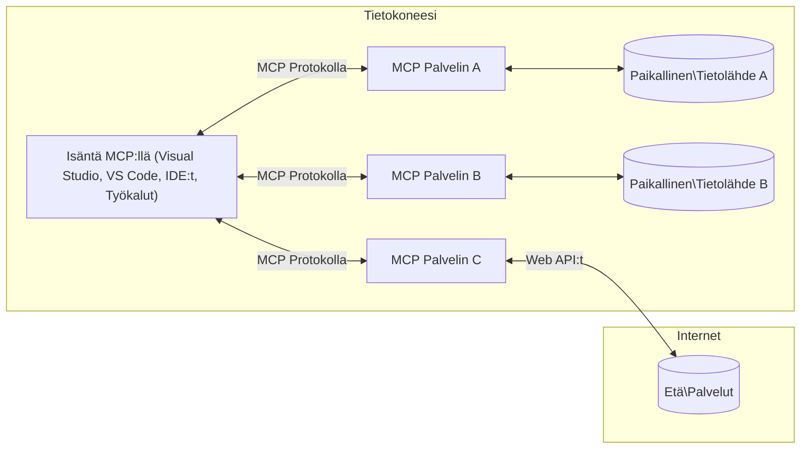

# MCP Core Concepts: Mastering the Model Context Protocol for AI Integration

[](https://youtu.be/earDzWGtE84)

_(Napsauta yllä olevaa kuvaa nähdäksesi tämän oppitunnin videon)_

[Model Context Protocol (MCP)](https://github.com/modelcontextprotocol) on tehokas, vakiintunut kehys, joka optimoi viestinnän suurten kielimallien (LLM) ja ulkoisten työkalujen, sovellusten ja tietolähteiden välillä.  
Tämä opas johdattaa sinut MCP:n ydinperiaatteisiin. Opit sen asiakas-palvelinarkkitehtuurista, keskeisistä komponenteista, viestintämekanismeista ja toteutuksen parhaista käytännöistä.

- **Selkeä käyttäjän suostumus**: Kaikkiin tietojen käyttöoikeuksiin ja toimintoihin vaaditaan käyttäjän selkeä hyväksyntä ennen suorittamista. Käyttäjien on ymmärrettävä tarkasti, mitä tietoja käytetään ja mitä toimintoja suoritetaan, ja heillä tulee olla yksityiskohtainen hallinta oikeuksista ja valtuuksista.

- **Tietosuojan suojaus**: Käyttäjätiedot paljastetaan vain selkeällä suostumuksella ja ne on suojattava tiukoilla käyttöoikeusvalvonnan menetelmillä koko vuorovaikutuksen ajan. Toteutusten on estettävä luvaton tiedonsiirto ja ylläpidettävä tiukkoja tietosuojarajoja.

- **Työkalujen suoritusturva**: Jokainen työkalun kutsu vaatii käyttäjän selkeän suostumuksen, jotta käyttäjä ymmärtää työkalun toiminnallisuuden, parametrit ja mahdolliset vaikutukset. Tiukat turvarajat estävät tahattoman, vaarallisen tai haitallisen työkalun suorituksen.

- **Kuljetuskerroksen turvallisuus**: Kaikkien viestintäkanavien tulee käyttää asianmukaista salaus- ja todennusmenetelmää. Etäyhteyksissä tulee käyttää turvallisia kuljetusprotokollia sekä asianmukaista tunnistetietojen hallintaa.

#### Toteutusohjeet:

- **Oikeuksien hallinta**: Toteuta hienojakoisia lupa-järjestelmiä, jotka antavat käyttäjille mahdollisuuden hallita, mitkä palvelimet, työkalut ja resurssit ovat käytettävissä  
- **Todennus ja valtuutus**: Käytä turvallisia todennusmenetelmiä (OAuth, API-avaimet) asianmukaisella token-hallinnalla ja vanhentumisajalla  
- **Syötteen validointi**: Vahvista kaikki parametrit ja tiedot määriteltyjen skeemojen mukaisesti injektiohyökkäysten estämiseksi  
- **Auditointilokit**: Pidä kattavat lokit kaikista toiminnoista turvallisuuden valvontaa ja vaatimustenmukaisuutta varten

## Yleiskatsaus

Tässä oppitunnissa tutustutaan Model Context Protocolin (MCP) perusarkkitehtuuriin ja komponentteihin, jotka muodostavat MCP-ekosysteemin. Opit asiakas-palvelinarkkitehtuurista, keskeisistä komponenteista ja viestintämekanismeista, jotka mahdollistavat MCP-vuorovaikutuksen.

## Keskeiset oppimistavoitteet

Oppitunnin lopuksi osaat:

- Ymmärtää MCP:n asiakas-palvelinarkkitehtuurin.  
- Tunnistaa isäntien, asiakkaiden ja palvelimien roolit ja vastuut.  
- Analysoida keskeisiä ominaisuuksia, jotka tekevät MCP:stä joustavan integraatiokerroksen.  
- Oppia, miten tiedonkulku tapahtuu MCP-ekosysteemissä.  
- Saada käytännön näkemyksiä koodiesimerkeistä .NET:ssä, Javassa, Pythonissa ja JavaScriptissä.

## MCP-arkkitehtuuri: syvällisempi katsaus

MCP-ekosysteemi perustuu asiakas-palvelinmalliin. Tämä modulaarinen rakenne mahdollistaa tekoälysovellusten tehokkaan yhteyden ulkoisiin työkaluihin, tietokantoihin, rajapintoihin ja kontekstuaalisiin resursseihin. Pureudutaan tähän arkkitehtuuriin sen ydinkomponentteihin.

MCP perustuu asiakas-palvelinarkkitehtuuriin, jossa isäntäsovellus voi muodostaa yhteyksiä useisiin palvelimiin:



- **MCP Hosts (Isännät)**: Ohjelmistoja kuten VSCode, Claude Desktop, IDE:t tai tekoälytyökalut, jotka haluavat käyttää tietoa MCP:n kautta  
- **MCP Clients (Asiakkaat)**: Protokollan asiakkaat, jotka ylläpitävät 1:1 -yhteyksiä palvelinten kanssa  
- **MCP Servers (Palvelimet)**: Kevyitä ohjelmia, jotka tarjoavat tiettyjä ominaisuuksia standardoidun Model Context Protocolin kautta  
- **Paikalliset tietolähteet**: Tietokoneesi tiedostot, tietokannat ja palvelut, joihin MCP:n palvelimet voivat turvallisesti päästä käsiksi  
- **Etäpalvelut**: Internetin kautta saatavilla olevat ulkoiset järjestelmät, joihin MCP:n palvelimet voivat yhdistää rajapintojen avulla.

MCP-protokolla on kehittyvä standardi, jota versioidaan päivämäärän muodossa (YYYY-MM-DD). Nykyinen protokollaversio on **2025-11-25**. Näet viimeisimmät päivitykset [protokollan spesifikaatioon](https://modelcontextprotocol.io/specification/2025-11-25/).

> **Katse tulevaisuuteen:** Seuraavan spesifikaatioversion, **2026-07-28**, julkaisutestiversio julkistettiin toukokuussa 2026 ja se on aikataulutettu julkaistavaksi 28. heinäkuuta 2026. Se tekee protokollasta stateless-kuljetuskerroksessa (poistaen `initialize`-kättelyn ja istuntotunnukset), formalisoit laajennusten kehikon ja poistaa Roots-, Sampling- ja Logging-toiminnot uusien mallien hyväksi. Katso [Mitä muuttuu MCP:ssä – 2026-07-28 -julkaisutestiversio](./mcp-2026-07-28-release-candidate.md) saadaksesi täydellisen erittelyn.

### 1. Isännät (Hosts)

Model Context Protocolissa (MCP) **Isännät** ovat tekoälysovelluksia, jotka toimivat ensisijaisena käyttöliittymänä, jonka kautta käyttäjät ovat vuorovaikutuksessa protokollan kanssa. Isännät koordinoivat ja hallitsevat yhteyksiä useisiin MCP-palvelimiin luomalla jokaiselle palvelinyhteydelle omat MCP-asiakkaat. Esimerkkejä isännistä ovat:

- **Tekoälysovellukset**: Claude Desktop, Visual Studio Code, Claude Code  
- **Kehitysympäristöt**: IDE:t ja koodieditorit, joihin MCP on integroitu  
- **Mukautetut sovellukset**: Tekoälyagentit ja työkalut, jotka on rakennettu erityistarkoitukseen

**Isännät** ovat sovelluksia, jotka koordinoivat tekoälymallien vuorovaikutuksia. Ne:

- **Orkestroivat tekoälymalleja**: Suorittavat tai ovat vuorovaikutuksessa LLM:ien kanssa vastauksien tuottamiseksi ja AI-työnkulkujen hallitsemiseksi  
- **Hallinnoivat asiakasliittymiä**: Luovat ja ylläpitävät yhden MCP-asiakkaan per MCP-palvelinyhteys  
- **Ohjaavat käyttöliittymää**: Hoitavat keskustelun kulkua, käyttäjien vuorovaikutuksia ja vastausten esittämistä  
- **Varmistavat turvallisuuden**: Valvovat lupia, turvarajoituksia ja todennusta  
- **Käsittelevät käyttäjän suostumusta**: Hallitsevat käyttäjän hyväksynnän tietojen jakamiseen ja työkalujen suorittamiseen

### 2. Asiakkaat (Clients)

**Asiakkaat** ovat välttämättömiä komponentteja, jotka ylläpitävät omistettuja yksi-yhteen -yhteyksiä isäntien ja MCP-palvelimien välillä. Jokainen MCP-asiakas luodaan isännän toimesta yhdistämään tiettyyn MCP-palvelimeen varmistaen järjestelmällisen ja turvallisen viestintäkanavan. Useat asiakkaat mahdollistavat, että isännät voivat yhdistää useisiin palvelimiin samanaikaisesti.

**Asiakkaat** ovat asiakasohjelmiston liitäntäkomponentteja. Ne:

- **Protokollaviestintä**: Lähettävät JSON-RPC 2.0 -pyyntöjä palvelimille kehotteiden ja ohjeiden kanssa  
- **Ominaisuuksien neuvottelu**: Neuvottelevat palvelimien kanssa tuetuista ominaisuuksista ja protokollaversioista alustuksen aikana  
- **Työkalujen suorittaminen**: Hallinnoivat mallien työkalukutsupyyntöjä ja käsittelevät vastauksia  
- **Reaaliaikaiset päivitykset**: Käsittelevät ilmoituksia ja reaaliaikaisia päivityksiä palvelimilta  
- **Vastausten käsittely**: Käsittelevät ja muotoilevat palvelimen vastaukset näyttöä varten käyttäjille

### 3. Palvelimet (Servers)

**Palvelimet** ovat ohjelmia, jotka tarjoavat kontekstia, työkaluja ja toiminnallisuuksia MCP-asiakkaille. Ne voivat toimia paikallisesti (saman laitteen päällä kuin isäntä) tai etänä (ulkoisilla alustoilla) ja vastaavat asiakaspyyntöjen käsittelystä ja jäsenneltyjen vastausten tuottamisesta. Palvelimet tarjoavat tiettyjä toimintoja standardoidun Model Context Protocolin avulla.

**Palvelimet** ovat palveluita, jotka tarjoavat kontekstia ja ominaisuuksia. Ne:

- **Ominaisuuksien rekisteröinti**: Rekisteröivät ja tarjoavat saatavilla olevia peruskomponentteja (resurssit, kehotteet, työkalut) asiakkaille  
- **Pyyntöjen käsittely**: Vastaanottavat ja suorittavat työkalukutsuja, resurssipyyntöjä ja kehotteiden pyyntöjä asiakkailta  
- **Kontekstin tarjoaminen**: Antavat kontekstuaalista tietoa ja dataa mallin vastausten parantamiseksi  
- **Tilanhallinta**: Ylläpitävät istuntotilaa ja hoitavat tilallisia vuorovaikutuksia tarpeen mukaan  
- **Reaaliaikaiset ilmoitukset**: Lähettävät ilmoituksia ominaisuuksien muutoksista ja päivityksistä yhdistettyihin asiakkaisiin

Palvelimia voi kehittää kuka tahansa laajentaakseen mallin toiminnallisuutta erikoistuneilla ominaisuuksilla, ja ne tukevat sekä paikallista että etäkäyttöä.

### 4. Palvelimen perusosat (Server Primitives)

Model Context Protocolin palvelimet tarjoavat kolme ydinkomponenttia eli **primitivetyyppiä**, jotka määrittävät perusrakenteet rikkaille vuorovaikutuksille asiakkaiden, isäntien ja kielimallien välillä. Nämä primitiivit määrittelevät, millaista kontekstuaalista tietoa ja toimintoja protokollan kautta on tarjolla.

MCP:n palvelimet voivat tarjota minkä tahansa seuraavista kolmesta ydinalkeesta:

#### Resurssit

**Resurssit** ovat tietolähteitä, jotka tarjoavat kontekstuaalista tietoa tekoälysovelluksille. Ne edustavat staattista tai dynaamista sisältöä, joka voi parantaa mallin ymmärrystä ja päätöksentekoa:

- **Kontekstuaalinen data**: Jäsenneltyä tietoa ja kontekstia tekoälymallin käyttöön  
- **Tietopankit**: Asiakirjakokoelmat, artikkelit, käyttöohjeet ja tutkimuspaperit  
- **Paikalliset tietolähteet**: Tiedostot, tietokannat ja paikallinen järjestelmätieto  
- **Ulkoinen data**: API-vastaukset, web-palvelut ja etäjärjestelmien tiedot  
- **Dynaaminen sisältö**: Reaaliaikainen data, joka päivittyy ulkoisten ehtojen mukaan

Resurssit tunnistetaan URI:illa ja ne on löydettävissä `resources/list` -menetelmän kautta sekä luettavissa `resources/read` -menetelmällä:

```text
file://documents/project-spec.md
database://production/users/schema
api://weather/current
```

#### Kehotteet (Prompts)

**Kehotteet** ovat uudelleenkäytettäviä malleja, jotka auttavat jäsentämään vuorovaikutuksia kielimallien kanssa. Ne tarjoavat standardoidut vuorovaikutuskuviot ja mallipohjaiset työnkulut:

- **Mallipohjaiset vuorovaikutukset**: Ennalta rakennetut viestit ja keskustelun aloitteet  
- **Työnkulun mallit**: Standardoidut sarjat yleisiin tehtäviin ja vuorovaikutuksiin  
- **Few-shot-esimerkit**: Esimerkkipohjaiset mallit ohjaamaan mallin toimintaa  
- **Järjestelmäkehoteet**: Peruskehoteet, jotka määrittelevät mallin käyttäytymistä ja kontekstia  
- **Dynaamiset mallit**: Parametroituja kehotteita, jotka mukautuvat tiettyihin tilanteisiin

Kehotteet tukevat muuttujien korvaamista ja ne voidaan löytää `prompts/list`-menetelmällä ja noutaa `prompts/get`:llä:

```markdown
Generate a {{task_type}} for {{product}} targeting {{audience}} with the following requirements: {{requirements}}
```

#### Työkalut

**Työkalut** ovat suoritettavia toimintoja, joita tekoälymallit voivat kutsua suorittaakseen tiettyjä toimintoja. Ne edustavat MCP-ekosysteemin "verbejä", jotka antavat malleille mahdollisuuden olla vuorovaikutuksessa ulkoisten järjestelmien kanssa:

- **Suoritettavat funktiot**: Erillisiä toimintoja, joita mallit voivat kutsua tiettyjen parametrien avulla  
- **Ulkoinen järjestelmäintegraatio**: API-kutsut, tietokantahaut, tiedostotoiminnot, laskelmat  
- **Uniikki tunniste**: Jokaisella työkalulla on oma nimi, kuvaus ja parametrien skeema  
- **Jäsennelty syöte ja tuloste**: Työkalut ottavat vastaan validoituja parametreja ja palauttavat jäsennellyn, tyypitetyn vastauksen  
- **Toiminto-ominaisuudet**: Mahdollistavat mallien suorittaa todellisen maailman toimintoja ja hakea reaaliaikaista dataa

Työkalut määritellään JSON-skeemalla parametrien validointiin ja ne löytyvät `tools/list`-menetelmällä ja suoritetaan `tools/call`:lla. Työkalut voivat sisältää myös **ikoneja** käyttöliittymän parantamiseksi.

**Työkalujen annotaatiot**: Työkalut tukevat käyttäytymisen kuvauksia (esim. `readOnlyHint`, `destructiveHint`), jotka kuvaavat, onko työkalu vain luku -tyyppinen tai tuhoava, auttaen asiakkaita tekemään perusteltuja päätöksiä työkalun suorittamisesta.

Esimerkki työkalun määritelmästä:

```typescript
server.tool(
  "search_products", 
  {
    query: z.string().describe("Search query for products"),
    category: z.string().optional().describe("Product category filter"),
    max_results: z.number().default(10).describe("Maximum results to return")
  }, 
  async (params) => {
    // Suorita haku ja palauta jäsennellyt tulokset
    return await productService.search(params);
  }
);
```

## Asiakkaiden primitiivit

Model Context Protocolissa (MCP) **asiakkaat** voivat tarjota primitiivejä, joiden avulla palvelimet voivat pyytää lisätoimintoja isäntäsovellukselta. Nämä asiakaspuolen primitiivit mahdollistavat rikkaamman ja vuorovaikutteisemman palvelimen toteutuksen, joka pääsee käsiksi tekoälymallin ominaisuuksiin ja käyttäjän vuorovaikutuksiin.

### Näytteistäminen (Sampling)

> **Vanhentumisilmoitus:** `2026-07-28`-julkaisutestiversio asettaa näytteistämisen vanhentuneeksi, suosien suoraa integraatiota LLM-palveluntarjoajien API:eihin. Se toimii edelleen versiossa `2025-11-25` ja ainakin vuoden ajan vanhentumisen jälkeen, mutta uudet toteutukset suositellaan toteutettavaksi uudella mallilla. Katso [Mitä muuttuu MCP:ssä – 2026-07-28-julkaisutestiversio](./mcp-2026-07-28-release-candidate.md).

**Näytteistäminen** mahdollistaa palvelimien pyytää kielimallin täydentämisiä asiakkaan tekoälysovellukselta. Tämä primitiivi antaa palvelimille pääsyn LLM-ominaisuuksiin ilman, että niiden tarvitsee upottaa omia malliriippuvuuksiaan:

- **Mallista riippumaton pääsy**: Palvelimet voivat pyytää täydentämisiä ilman, että mukana on LLM-SDK:ta tai hallinnoidaan mallin käyttöoikeutta  
- **Palvelimen aloittama tekoäly**: Mahdollistaa palvelimien itsenäisesti generoida sisältöä käyttäen asiakkaan mallia  
- **Rekursiiviset LLM-vuorovaikutukset**: Tukee monimutkaisia skenaarioita, joissa palvelimet tarvitsevat tekoälyapua käsittelyssä  
- **Dynaaminen sisällöntuotanto**: Mahdollistaa palvelimien luoda kontekstuaalisia vastauksia käyttäen isännän mallia  
- **Työkalukutsutuki**: Palvelimet voivat sisältää parametrit `tools` ja `toolChoice`, joiden avulla asiakkaan malli voi kutsua työkaluja näytteistämisen aikana

Näytteistäminen käynnistetään `sampling/complete`-menetelmällä, jossa palvelimet lähettävät täydentämispyynnöt asiakkaille.

### Juuret (Roots)

> **Vanhentumisilmoitus:** `2026-07-28`-julkaisutestiversio merkitsee Juuret vanhentuneiksi, suosien työkalun parametreja, resurssi-URI:eja tai palvelimen konfiguraatiota. Se toimii edelleen versiossa `2025-11-25` ja ainakin vuoden sen jälkeen, kun se on merkitty vanhentuneeksi. Katso [Mitä muuttuu MCP:ssä – 2026-07-28-julkaisutestiversio](./mcp-2026-07-28-release-candidate.md).

**Juuret** tarjoavat standardoidun tavan, jolla asiakkaat voivat paljastaa tiedostojärjestelmän rajat palvelimille, auttaen palvelimia ymmärtämään, millä tiedosto- ja hakemistorajoilla ne voivat toimia:

- **Tiedostojärjestelmän rajat**: Määrittävät rajat, joissa palvelimet voivat toimia tiedostojärjestelmässä  
- **Käyttöoikeuksien hallinta**: Auttaa palvelimia ymmärtämään, mihin kansioihin ja tiedostoihin niillä on oikeudet  
- **Dynaamiset päivitykset**: Asiakkaat voivat ilmoittaa palvelimille, kun juurilista muuttuu  
- **URI-pohjainen tunnistus**: Juuret käyttävät `file://` -URI:eja tunnistaakseen käytettävissä olevat kansiot ja tiedostot

Juuret löytyvät `roots/list`-menetelmällä, ja asiakkaat lähettävät `notifications/roots/list_changed`, kun juuret muuttuvat.

### Tiedustelu (Elicitation)

**Tiedustelu** mahdollistaa palvelimien pyytää lisätietoja tai vahvistusta käyttäjiltä asiakasliittymän kautta:

- **Käyttäjän syötteen pyynnöt**: Palvelimet voivat pyytää lisätietoja tarvittaessa työkalun suoritusta varten  
- **Vahvistusikkunat**: Pyytävät käyttäjän hyväksyntää sensitiivisiin tai merkittäviin toimiin  
- **Vuorovaikutteiset työnkulut**: Mahdollistavat palvelimien luoda vaiheittaisia käyttäjän vuorovaikutuksia  
- **Dynaaminen parametrien keruu**: Kerää puuttuvat tai valinnaiset parametrit työkalun suorituksen aikana

Tiedustelupyynnöt tehdään `elicitation/request`-menetelmällä käyttäjän syötteen keräämiseksi asiakkaan käyttöliittymän kautta.

**URL-tilan tiedustelu**: Palvelimet voivat myös pyytää URL-pohjaisia käyttäjävuorovaikutuksia, jolloin ne ohjaavat käyttäjät ulkoisille verkkosivuille autentikointia, vahvistusta tai tiedon syöttämistä varten.

### Lokitus
> **Vanhentumisilmoitus:** `2026-07-28` julkaisuvalmis versio merkitsee Loggingin vanhentuneeksi stdio-siirroissa käyttämällä `stderr`-kanavaa ja OpenTelemetrya rakenteellisen havainnoinnin hyväksi. Se toimii edelleen versiossa `2025-11-25` ja vähintään vuoden ajan vanhentumisen jälkeen. Katso [Mitä MCP:ssä muuttuu: 2026-07-28 julkaisuvalmis versio](./mcp-2026-07-28-release-candidate.md).

**Logging** mahdollistaa palvelimille lähettää rakenteellisia lokiviestejä asiakkaille vianmääritystä, valvontaa ja operatiivista näkyvyyttä varten:

- **Vianmääritystuki**: Mahdollistaa palvelimien tarjota yksityiskohtaiset suorituksen lokit ongelmanratkaisua varten  
- **Operatiivinen valvonta**: Lähettää tilapäivityksiä ja suorituskykymittareita asiakkaille  
- **Virheraportointi**: Tarjoaa yksityiskohtaista virhekontekstia ja diagnostiikkatietoja  
- **Auditointijäljet**: Luo kattavat lokit palvelimen toiminnoista ja päätöksistä

Logging-viestit lähetetään asiakkaille läpinäkyvyyden tarjoamiseksi palvelinominaisuuksiin ja vianmäärityksen helpottamiseksi.

## Tiedon kulku MCP:ssä

Model Context Protocol (MCP) määrittelee rakenteellisen tiedonkulun isäntien, asiakkaiden, palvelimien ja mallien välillä. Ymmärtämällä tämän kulun selkeytyy, miten käyttäjän pyynnöt käsitellään ja miten ulkoiset työkalut ja tiedot integroidaan mallin vastauksiin.

- **Isäntä aloittaa yhteyden**  
  Isäntäsovellus (kuten IDE tai chat-käyttöliittymä) muodostaa yhteyden MCP-palvelimeen, tyypillisesti STDIO:n, WebSocketin tai muun tuetun siirtotavan kautta.

- **Ominaisuuskauppa**  
  Asiakas (upotettuna isäntään) ja palvelin vaihtavat tietoa tukemistaan ominaisuuksista, työkaluista, resursseista ja protokollaversioista. Näin varmistetaan, että molemmat osapuolet ymmärtävät käytettävissä olevat toiminnot sessiolle.

- **Käyttäjän pyyntö**  
  Käyttäjä vuorovaikuttaa isännän kanssa (esim. syöttää kehotteen tai komennon). Isäntä kerää tämän syötteen ja välittää sen asiakkaalle käsittelyä varten.

- **Resurssin tai työkalun käyttö**  
  - Asiakas voi pyytää lisäyhteyttä tai resursseja palvelimelta (kuten tiedostoja, tietokanta- tai tietopohjamerkintöjä) mallin ymmärryksen rikastamiseksi.  
  - Jos malli katsoo tarvitsevansa työkalua (esim. hakemaan tietoja, suorittamaan laskutoimituksen tai kutsumaan APIa), asiakas lähettää työkalukutsupyynnön palvelimelle, jossa määritellään työkalun nimi ja parametrit.

- **Palvelimen suoritus**  
  Palvelin vastaanottaa resurssi- tai työkalupyynnön, suorittaa tarvittavat toiminnot (kuten funktion ajo, tietokantakysely tai tiedoston haku) ja palauttaa tulokset asiakkaalle rakenteellisessa muodossa.

- **Vastusgenerointi**  
  Asiakas yhdistää palvelimen vastaukset (resurssitiedot, työkalutuotokset jne.) meneillään olevaan mallin vuorovaikutukseen. Malli käyttää tätä tietoa kokoavan ja kontekstitietoon perustuvan vastauksen luomiseen.

- **Tuloksen esittäminen**  
  Isäntä vastaanottaa lopullisen tuloksen asiakkaalta ja näyttää sen käyttäjälle, usein sisältäen sekä mallin generoiman tekstin että työkalujen tai resurssien hakujen tulokset.

Tämä tiedonkulku mahdollistaa MCP:n tukemaan kehittyneitä, interaktiivisia ja kontekstintajuisia tekoälysovelluksia yhteydellistämällä mallit saumattomasti ulkoisiin työkaluihin ja tietolähteisiin.

## Protokollan arkkitehtuuri ja kerrokset

MCP koostuu kahdesta erillisestä arkkitehtuurikerroksesta, jotka toimivat yhdessä tarjoten kattavan viestintäkehyksen:

### Tietokerros

**Tietokerros** toteuttaa MCP-protokollan ytimen käyttäen **JSON-RPC 2.0**:aa pohjana. Tämä kerros määrittelee viestirakenteet, semantiikan ja vuorovaikutuskuviot:

#### Keskeiset komponentit:

- **JSON-RPC 2.0 protokolla**: Kaikki viestintä käyttää standardoitua JSON-RPC 2.0 -viestimallia metodikutsuille, vastauksille ja ilmoituksille  
- **Elinkaaren hallinta**: Käsittelee yhteyden aloituksen, ominaisuuskaupan ja istunnon päättämisen asiakkaiden ja palvelimien välillä  
- **Palvelimen perustoiminnot**: Mahdollistaa palvelimille ydintoiminnallisuuden tarjoamisen työkalujen, resurssien ja käskyjen kautta  
- **Asiakkaan perustoiminnot**: Mahdollistaa palvelimille LLM-näytteenoton pyytämisen, käyttäjän syötteen keräämisen ja lokiviestien lähettämisen  
- **Reaaliaikaiset ilmoitukset**: Tukee asynkronisia ilmoituksia dynaamisia päivityksiä varten ilman kyselyä

#### Tärkeimmät ominaisuudet:

- **Protokollaversion neuvottelu**: Käyttää päivämääräpohjaista versiointia (VVVV-KK-PP) yhteensopivuuden varmistamiseksi  
- **Ominaisuuksien löytyminen**: Asiakkaat ja palvelimet vaihtavat tietoa tuetuista ominaisuuksista alustuksen aikana  
- **Tila-istunnot**: Ylläpitää yhteyden tilaa useiden vuorovaikutusten ajan kontekstin jatkuvuuden varmistamiseksi

### Siirtokerros

**Siirtokerros** hallinnoi kommunikaatiokanavia, viestikehyksien muodostusta ja todennusta MCP-osapuolten välillä:

#### Tuetut siirtomekanismit:

1. **STDIO-siirto**:  
   - Käyttää standardisyöttöä/-tulostusta suoraan prosessien välisessä kommunikaatiossa  
   - Optimaalinen paikallisille prosesseille samalla koneella ilman verkkoylikuormaa  
   - Yleisesti käytetty paikallisissa MCP-palvelimen toteutuksissa

2. **Streamable HTTP -siirto**:  
   - Käyttää HTTP POST:ia asiakas-palvelin-viesteissä  
   - Valinnainen Server-Sent Events (SSE) palvelin-asiakas-suoratoistoon  
   - Mahdollistaa etäpalvelimien kanssa kommunikoinnin verkon yli  
   - Tukee vakiintuneita HTTP-todennusmenetelmiä (bearer-tunnukset, API-avaimet, omat otsikot)  
   - MCP suosittelee OAuthia turvalliseen tunnistetietopohjaiseen todennukseen

#### Siirtoabstrahointi:

Siirtokerros abstrahoi viestinnän tiedot tietokerroksesta, jolloin sama JSON-RPC 2.0 -viestimalli voidaan käyttää kaikissa siirtomenetelmissä. Tämä mahdollistaa sovellusten saumattoman siirtymisen paikallisista etäpalvelimiin.

### Turvallisuusnäkökohdat

MCP-toteutusten on noudatettava useita keskeisiä turvallisuusperiaatteita varmistaakseen turvallisen, luotettavan ja suojatun vuorovaikutuksen protokollan kaikissa toiminnoissa:

- **Käyttäjän suostumus ja hallinta**: Käyttäjältä on aina saatava nimenomainen suostumus ennen tietojen käyttöä tai toimintojen suorittamista. Käyttäjällä tulee olla selkeä ohjaus ja valta päättää, mitä tietoja jaetaan ja mitä toimia sallitaan, käyttäjäystävällisten hyväksymisliittymien avulla.

- **Tietosuoja**: Käyttäjätietoja saa käyttää vain nimenomaisella suostumuksella, ja niitä on suojattava asianmukaisilla pääsynhallinnan keinoilla. MCP-toteutusten on estettävä valtuuttamattomat tiedonsiirrot ja varmistettava yksityisyyden säilyminen kaikissa toiminnoissa.

- **Työkalujen turvallisuus**: Työkalujen kutsumiseen vaaditaan selvä käyttäjän suostumus. Käyttäjien tulee ymmärtää kunkin työkalun toiminnallisuus, ja turvatoimia on toteutettava vahvasti estämään ei-toivottu tai vaarallinen työkalujen suoritus.

Näiden turvallisuusperiaatteiden noudattaminen takaa MCP:n käyttäjien luottamuksen, yksityisyyden ja turvallisuuden kaikkien protokollavvuorovaikutusten aikana samalla mahdollistaen tehokkaat tekoälyintegraatiot.

## Koodiesimerkit: Keskeiset komponentit

Alla on useiden suosittujen ohjelmointikielien esimerkkejä, jotka havainnollistavat keskeisten MCP-palvelinkomponenttien ja -työkalujen toteuttamista.

### .NET-esimerkki: Yksinkertaisen MCP-palvelimen luominen työkaluilla

Tässä on käytännön .NET-koodiesimerkki, joka näyttää, kuinka toteuttaa yksinkertainen MCP-palvelin omilla työkaluilla. Esimerkissä havainnollistetaan työkalujen määrittely ja rekisteröinti, pyyntöjen käsittely sekä palvelimen yhdistäminen Model Context Protocolin avulla.

```csharp
using System;
using System.Threading.Tasks;
using ModelContextProtocol.Server;
using ModelContextProtocol.Server.Transport;
using ModelContextProtocol.Server.Tools;

public class WeatherServer
{
    public static async Task Main(string[] args)
    {
        // Create an MCP server
        var server = new McpServer(
            name: "Weather MCP Server",
            version: "1.0.0"
        );
        
        // Register our custom weather tool
        server.AddTool<string, WeatherData>("weatherTool", 
            description: "Gets current weather for a location",
            execute: async (location) => {
                // Call weather API (simplified)
                var weatherData = await GetWeatherDataAsync(location);
                return weatherData;
            });
        
        // Connect the server using stdio transport
        var transport = new StdioServerTransport();
        await server.ConnectAsync(transport);
        
        Console.WriteLine("Weather MCP Server started");
        
        // Keep the server running until process is terminated
        await Task.Delay(-1);
    }
    
    private static async Task<WeatherData> GetWeatherDataAsync(string location)
    {
        // This would normally call a weather API
        // Simplified for demonstration
        await Task.Delay(100); // Simulate API call
        return new WeatherData { 
            Temperature = 72.5,
            Conditions = "Sunny",
            Location = location
        };
    }
}

public class WeatherData
{
    public double Temperature { get; set; }
    public string Conditions { get; set; }
    public string Location { get; set; }
}
```

### Java-esimerkki: MCP-palvelinkomponentit

Tämä esimerkki näyttää saman MCP-palvelimen ja työkalujen rekisteröinnin kuin yllä oleva .NET-esimerkki, mutta toteutettuna Javalla.

```java
import io.modelcontextprotocol.server.McpServer;
import io.modelcontextprotocol.server.McpToolDefinition;
import io.modelcontextprotocol.server.transport.StdioServerTransport;
import io.modelcontextprotocol.server.tool.ToolExecutionContext;
import io.modelcontextprotocol.server.tool.ToolResponse;

public class WeatherMcpServer {
    public static void main(String[] args) throws Exception {
        // Luo MCP-palvelin
        McpServer server = McpServer.builder()
            .name("Weather MCP Server")
            .version("1.0.0")
            .build();
            
        // Rekisteröi säätyökalu
        server.registerTool(McpToolDefinition.builder("weatherTool")
            .description("Gets current weather for a location")
            .parameter("location", String.class)
            .execute((ToolExecutionContext ctx) -> {
                String location = ctx.getParameter("location", String.class);
                
                // Hae säädataa (yksinkertaistettu)
                WeatherData data = getWeatherData(location);
                
                // Palauta muotoiltu vastaus
                return ToolResponse.content(
                    String.format("Temperature: %.1f°F, Conditions: %s, Location: %s", 
                    data.getTemperature(), 
                    data.getConditions(), 
                    data.getLocation())
                );
            })
            .build());
        
        // Yhdistä palvelin stdio-siirrolla
        try (StdioServerTransport transport = new StdioServerTransport()) {
            server.connect(transport);
            System.out.println("Weather MCP Server started");
            // Pidä palvelin käynnissä, kunnes prosessi lopetetaan
            Thread.currentThread().join();
        }
    }
    
    private static WeatherData getWeatherData(String location) {
        // Toteutus kutsuisi sää-APIa
        // Yksinkertaistettu esimerkin vuoksi
        return new WeatherData(72.5, "Sunny", location);
    }
}

class WeatherData {
    private double temperature;
    private String conditions;
    private String location;
    
    public WeatherData(double temperature, String conditions, String location) {
        this.temperature = temperature;
        this.conditions = conditions;
        this.location = location;
    }
    
    public double getTemperature() {
        return temperature;
    }
    
    public String getConditions() {
        return conditions;
    }
    
    public String getLocation() {
        return location;
    }
}
```

### Python-esimerkki: MCP-palvelimen rakentaminen

Tässä esimerkissä käytetään fastmcp-kirjastoa, joten varmista, että asennat sen ensin:

```python
pip install fastmcp
```
Koodiesimerkki:

```python
#!/usr/bin/env python3
import asyncio
from fastmcp import FastMCP
from fastmcp.transports.stdio import serve_stdio

# Luo FastMCP-palvelin
mcp = FastMCP(
    name="Weather MCP Server",
    version="1.0.0"
)

@mcp.tool()
def get_weather(location: str) -> dict:
    """Gets current weather for a location."""
    return {
        "temperature": 72.5,
        "conditions": "Sunny",
        "location": location
    }

# Vaihtoehtoinen lähestymistapa luokan avulla
class WeatherTools:
    @mcp.tool()
    def forecast(self, location: str, days: int = 1) -> dict:
        """Gets weather forecast for a location for the specified number of days."""
        return {
            "location": location,
            "forecast": [
                {"day": i+1, "temperature": 70 + i, "conditions": "Partly Cloudy"}
                for i in range(days)
            ]
        }

# Rekisteröi luokan työkalut
weather_tools = WeatherTools()

# Käynnistä palvelin
if __name__ == "__main__":
    asyncio.run(serve_stdio(mcp))
```

### JavaScript-esimerkki: MCP-palvelimen luominen

Tässä esimerkissä näytetään MCP-palvelimen luominen JavaScriptillä sekä kahden säähän liittyvän työkalun rekisteröinti.

```javascript
// Käytetään virallista Model Context Protocol SDK:ta
import { McpServer } from "@modelcontextprotocol/sdk/server/mcp.js";
import { StdioServerTransport } from "@modelcontextprotocol/sdk/server/stdio.js";
import { z } from "zod"; // Parametrien validointiin

// Luo MCP-palvelin
const server = new McpServer({
  name: "Weather MCP Server",
  version: "1.0.0"
});

// Määritä säätyökalu
server.tool(
  "weatherTool",
  {
    location: z.string().describe("The location to get weather for")
  },
  async ({ location }) => {
    // Tämä normaalisti kutsuisi sää-API:a
    // Yksinkertaistettu demonstrointia varten
    const weatherData = await getWeatherData(location);
    
    return {
      content: [
        { 
          type: "text", 
          text: `Temperature: ${weatherData.temperature}°F, Conditions: ${weatherData.conditions}, Location: ${weatherData.location}` 
        }
      ]
    };
  }
);

// Määritä ennustetyökalu
server.tool(
  "forecastTool",
  {
    location: z.string(),
    days: z.number().default(3).describe("Number of days for forecast")
  },
  async ({ location, days }) => {
    // Tämä normaalisti kutsuisi sää-API:a
    // Yksinkertaistettu demonstrointia varten
    const forecast = await getForecastData(location, days);
    
    return {
      content: [
        { 
          type: "text", 
          text: `${days}-day forecast for ${location}: ${JSON.stringify(forecast)}` 
        }
      ]
    };
  }
);

// Aputoiminnot
async function getWeatherData(location) {
  // Simuloi API-kutsua
  return {
    temperature: 72.5,
    conditions: "Sunny",
    location: location
  };
}

async function getForecastData(location, days) {
  // Simuloi API-kutsua
  return Array.from({ length: days }, (_, i) => ({
    day: i + 1,
    temperature: 70 + Math.floor(Math.random() * 10),
    conditions: i % 2 === 0 ? "Sunny" : "Partly Cloudy"
  }));
}

// Yhdistä palvelin stdio-siirrolla
const transport = new StdioServerTransport();
server.connect(transport).catch(console.error);

console.log("Weather MCP Server started");
```

Tämä JavaScript-esimerkki havainnollistaa, kuinka luodaan MCP-palvelin käyttäen Model Context Protocol SDK:ta. Siinä rekisteröidään kaksi työkalua nimeltä `weatherTool` ja `forecastTool`, ja tehdään ne saataville MCP-asiakkaille `StdioServerTransport`in kautta.

## Turvallisuus ja valtuutus

MCP sisältää useita sisäänrakennettuja käsitteitä ja mekanismeja turvallisuuden ja valtuutuksen hallintaan koko protokollan ajan:

1. **Työkalujen käyttöoikeuksien hallinta**:  
  Asiakkaat voivat määrittää, mitä työkaluja malli saa käyttää istunnon aikana. Tämä varmistaa, että vain nimenomaan valtuutetut työkalut ovat käytettävissä, mikä vähentää ei-toivottujen tai vaarallisten toimintojen riskiä. Oikeuksia voidaan säätää dynaamisesti käyttäjäasetusten, organisaation käytäntöjen tai vuorovaikutuksen kontekstin mukaan.

2. **Todennus**:  
  Palvelimet voivat vaatia todennusta ennen kuin ne myöntävät pääsyn työkaluihin, resursseihin tai arkaluontoisiin toimiin. Tämä voi sisältää API-avaimia, OAuth-tunnuksia tai muita todennusmenetelmiä. Oikea todennus varmistaa, että palvelimia käyttävät vain luotetut asiakkaat ja käyttäjät.

3. **Validointi**:  
  Parametrien kelpoisuustarkastus on pakollinen kaikissa työkalukutsuissa. Kukin työkalu määrittelee odotetut tyypit, muodot ja rajoitukset parametreilleen, ja palvelin tarkastaa saapuvat pyynnöt niiden mukaisesti. Tämä estää vääränlaisen tai haitallisen syötteen pääsyn työkalujen toteutuksiin ja auttaa ylläpitämään toimintojen eheyttä.

4. **Nopeusrajoitukset**:  
  Estääkseen väärinkäytön ja varmistaakseen palvelinresurssien kohtuullisen käytön MCP-palvelimet voivat toteuttaa nopeusrajoituksia työkalukutsuissa ja resurssien käytössä. Rajoituksia voidaan soveltaa käyttäjä-, istunto- tai globaalitasolla, suojaamalla näin palvelinta palvelunestohyökkäyksiltä tai liialliselta resurssien käytöltä.

Näiden mekanismien yhdistäminen tarjoaa MCP:lle turvallisen perustan yhdistää kielimalleja ulkoisiin työkaluihin ja tietolähteisiin, antaen käyttäjille ja kehittäjille yksityiskohtaisen hallinnan pääsyyn ja käyttöön.

## Protokollaviestit ja viestintäkulku

MCP käyttää rakenteellisia **JSON-RPC 2.0** -viestejä selkeiden ja luotettavien vuorovaikutusten mahdollistamiseksi isäntien, asiakkaiden ja palvelimien välillä. Protokolla määrittelee erityisiä viestimalleja eri toimintatyypeille:

### Keskeiset viestityypit:

#### **Initaalisointiviestit**
- **`initialize` pyyntö**: Luo yhteyden ja neuvottelee protokollaversion sekä ominaisuudet  
- **`initialize` vastaus**: Vahvistaa tuetut ominaisuudet ja palvelintiedot  
- **`notifications/initialized`**: Ilmoittaa, että initaalisointi on valmis ja istunto on käyttövalmis

#### **Löytöviestit**
- **`tools/list` pyyntö**: Hakee saatavilla olevat työkalut palvelimelta  
- **`resources/list` pyyntö**: Listaa saatavilla olevat resurssit (tietolähteet)  
- **`prompts/list` pyyntö**: Hakee saatavilla olevat kehottemallit

#### **Suoritusviestit**  
- **`tools/call` pyyntö**: Suorittaa tietyn työkalun annetuilla parametreilla  
- **`resources/read` pyyntö**: Hakee sisältöä tietystä resurssista  
- **`prompts/get` pyyntö**: Hakee kehotemallin valinnaisilla parametreilla

#### **Asiakaspään viestit**
- **`sampling/complete` pyyntö**: Palvelin pyytää LLM:n täydentämistä asiakkaalta  
- **`elicitation/request`**: Palvelin pyytää käyttäjän syötettä asiakasrajapinnan kautta  
- **Logging-viestit**: Palvelin lähettää rakenteellisia lokiviestejä asiakkaalle

#### **Ilmoitusviestit**
- **`notifications/tools/list_changed`**: Palvelin ilmoittaa asiakkaalle työkalumuutoksista  
- **`notifications/resources/list_changed`**: Palvelin ilmoittaa asiakkaalle resurssimuutoksista  
- **`notifications/prompts/list_changed`**: Palvelin ilmoittaa asiakkaalle kehotemuutosista

### Viestirakenne:

Kaikki MCP-viestit noudattavat JSON-RPC 2.0 -muotoa siten, että:  
- **Pyyntöviestit**: Sisältävät `id`, `method` ja valinnaiset `params`-kentät  
- **Vastausviestit**: Sisältävät `id` ja joko `result`- tai `error`-kentän  
- **Ilmoitusviestit**: Sisältävät `method` ja valinnaiset `params`, mutta eivät `id`-kenttää tai vastausta odoteta

Tämä rakenteellinen viestintä takaa luotettavat, jäljitettävät ja laajennettavat vuorovaikutukset, jotka tukevat edistyneitä skenaarioita kuten reaaliaikapäivitykset, työkaluketjuttaminen ja vankka virheenkäsittely.

### Tehtävät (kokeellinen)

> **Tulevaisuuteen:** `2026-07-28` julkaisuvalmis versio siirtää Tehtävät kokeellisesta ydinspesifikaatiosta omaan laajennukseensa uudistetuilla elinkaarimekanismeilla (`tasks/get`, `tasks/update`, `tasks/cancel`; `tasks/list` poistuu). Jos rakennat alla kuvatun kokeellisen API:n mukaan, suunnittele migrointi. Katso [Mitä MCP:ssä muuttuu: 2026-07-28 julkaisuvalmis versio](./mcp-2026-07-28-release-candidate.md).

**Tehtävät** ovat kokeellinen ominaisuus, joka tarjoaa kestävät ajon ympäristöt sallien viivästyneiden tulosten haun ja tilan seurannan MCP-pyynnöissä:

- **Pitkäkestoiset operaatiot**: Seuraa raskaita laskutoimituksia, työnkulun automatisointia ja eräajoja  
- **Viivästyneet tulokset**: Kysely tehtävän tilaan ja tulosten haku, kun operaatio päättyy  
- **Tilan seuranta**: Valvo tehtävän etenemistä määriteltyjen tilojen kautta  
- **Monivaiheiset operaatiot**: Tukee monimutkaisia työnkulkuja, jotka kattavat useita vuorovaikutuksia

Tehtävät käärivät tavalliset MCP-pyynnöt mahdollistaen asynkronisen ajon malleille, jotka eivät voi valmistua välittömästi.

## Keskeiset opit

- **Arkkitehtuuri**: MCP käyttää asiakas-palvelin-arkkitehtuuria, jossa isännät hallinnoivat monia asiakas-yhteyksiä palvelimiin  
- **Osapuolet**: Ekosysteemi sisältää isännät (tekoälysovellukset), asiakkaat (protokollaliittimet) ja palvelimet (ominaisuuksien tarjoajat)  
- **Siirtomekanismit**: Viestintä tukee STDIO:ta (paikallinen) ja Streamable HTTP:ta valinnaisella SSE:llä (etäyhteys)  
- **Ydinkomponentit**: Palvelimet tarjoavat työkaluja (suoritettavat funktiot), resursseja (tietolähteet) ja kehotteita (mallit)  
- **Asiakkaan perustoiminnot**: Palvelimet voivat pyytää asiakkaalta näytteenottoa (LLM-käännökset työkalukutsuin), kyselyjä (sisältäen URL-tilan), juuria (tiedostojärjestelmän rajat) ja lokitusta  
- **Kokeelliset ominaisuudet**: Tehtävät tarjoavat kestävät ajon ympäristöt pitkäkestoisille toiminnoille  
- **Protokollan pohja**: Rakennettu JSON-RPC 2.0:aan päivämääräpohjaisella versioinnilla (nykyinen: 2025-11-25)  
- **Reaaliaikaiset ominaisuudet**: Tukee ilmoituksia dynaamisille päivityksille ja reaaliaikaiselle synkronoinnille  
- **Turvallisuus ensin**: Selkeä käyttäjän suostumus, tietosuoja ja turvallinen tiedonsiirto ovat ydinehtoja

## Harjoitus

Suunnittele yksinkertainen MCP-työkalu, joka olisi hyödyllinen omalla alallasi. Määrittele:  
1. Mikä olisi työkalun nimi  
2. Mitä parametreja se ottaisi vastaan  
3. Mitä tulosta se palauttaisi  
4. Miten malli voisi käyttää tätä työkalua ratkaistakseen käyttäjän ongelmat

---

## Seuraavaksi

Seuraava: [Luku 2: Turvallisuus](../02-Security/README.md)
Uteliasta tietää, mitä tulee sen jälkeen `2025-11-25`? Lue [Mitä MCP:ssä muuttuu: Julkaisu Ehdokas 2026-07-28](./mcp-2026-07-28-release-candidate.md).

---

<!-- CO-OP TRANSLATOR DISCLAIMER START -->
**Vastuuvapauslauseke**:
Tämä asiakirja on käännetty käyttämällä tekoälypohjaista käännöspalvelua [Co-op Translator](https://github.com/Azure/co-op-translator). Vaikka pyrimme tarkkuuteen, otathan huomioon, että automaattiset käännökset saattavat sisältää virheitä tai epätarkkuuksia. Alkuperäinen asiakirja sen alkuperäiskielellä on virallinen lähde. Tärkeissä asioissa suositellaan ammattimaista ihmiskäännöstä. Emme ole vastuussa tämän käännöksen käytöstä aiheutuvista väärinymmärryksistä tai tulkinnoista.
<!-- CO-OP TRANSLATOR DISCLAIMER END -->