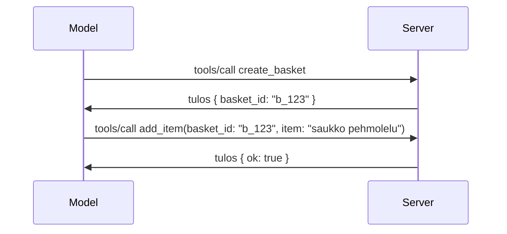

# Mitä MCP:ssä muuttuu: Julkaisuehdokas 2026-07-28

> **Tila:** Julkaisuehdokas. `2026-07-28` -määrittely ei ole lopullinen kirjoitushetkellä. Se julkistettiin 21.5.2026 ja sen on määrä julkaista 28.7.2026. Tämä opetusmateriaali kuvaa julkaisuehdokasta; tarkista uusin tila [luonnosmäärittelystä](https://modelcontextprotocol.io/specification/draft) ja sen [muutoslokista](https://modelcontextprotocol.io/specification/draft/changelog) ennen kuin rakennat sen päälle. Tämän oppimateriaalin muu sisältö on kirjoitettu nykyisen vakaan julkaisun, **MCP Specification 2025-11-25**, pohjalta, ja päivittyy, kun `2026-07-28` julkaistaan.

## Yleiskatsaus

`2026-07-28` on suurin MCP:n uudistus sen julkaisun jälkeen. Kuusi Määrittelyn Parannusehdotusta (SEP) poistaa protokollatasoiset sessiot ja tekee MCP:stä tilattoman (stateless) siirtokerroksella, laajennuksista tulee ensiluokkaisia, versioituja mekanismeja, ja useat tämän oppimateriaalin aiemmin käsitellyt ominaisuudet (Roots, Sampling, Logging) merkitään vanhentuneiksi uuden elinkaaripolitiikan mukaan. Tämä opetusmateriaali tiivistää, mitä muuttuu, miksi sillä on merkitystä ja mitä se tarkoittaa koodillesi, joka on kirjoitettu `2025-11-25`-määrittelyä vastaan.

Lähde: [The 2026-07-28 MCP Specification Release Candidate](https://blog.modelcontextprotocol.io/posts/2026-07-28-release-candidate/) (Model Context Protocol Blog, David Soria Parra ja Den Delimarsky).

## Oppimistavoitteet

Tämän oppitunnin jälkeen osaat:

- Selittää, miksi MCP siirtyy tilaattomaan protokollaytimeen ja mitä ongelmaa se ratkaisee vaakasuuntaisesti skaalautuvissa käyttöönotossa.
- Kuvailla, miten `initialize`/`initialized` kättely ja `Mcp-Session-Id` -otsikko korvataan.
- Tunnistaa uudet `Mcp-Method` ja `Mcp-Name` -otsikot sekä `ttlMs`/`cacheScope`-välimuistimetatiedot.
- Tunnistaa Laajennukset-kehyksen ja kaksi tämän julkaisun mukana toimitettavaa laajennusta: MCP Apps ja Tasks.
- Luetella kuusi valtuutuksen SEP:ää, jotka vahvistavat OAuth 2.0 / OIDC -mukautumista.
- Tunnistaa, mitkä ydintoiminnot (Roots, Sampling, Logging) ovat nyt vanhentuneita ja mitä se tarkoittaa käytännössä.
- Selittää Full JSON Schema 2020-12 -muutoksen työkalun `inputSchema`/`outputSchema` -ominaisuuksille.

## Tilaton protokolla

Suurin muutos: MCP muuttuu tilattomaksi protokollatasolla.

### Ennen (2025-11-25): sessiot kiinnittävät sinut yhteen palvelininstanssiin

Työkalun kutsu Streamable HTTP:n yli alkaa `initialize`-kädenpuristuksella. Palvelin vastaa `Mcp-Session-Id` -otsikolla, joka on mukana kaikissa myöhemmissä pyynnöissä:

```http
POST /mcp HTTP/1.1
Mcp-Session-Id: 1868a90c-3a3f-4f5b
Content-Type: application/json

{"jsonrpc":"2.0","id":2,"method":"tools/call",
 "params":{"name":"search","arguments":{"q":"otters"}}}
```

Koska sessio sitoutuu siihen palvelininstanssiin, joka sen antoi, vaakasuuntaisesti skaalautuvat käyttöönotot vaativat **sticky routingin** kuormantasaajalla ja **jaetun sessiotilan** instanssien välillä.

### Jälkeen (2026-07-28): jokainen pyyntö on itsenäinen

```http
POST /mcp HTTP/1.1
MCP-Protocol-Version: 2026-07-28
Mcp-Method: tools/call
Mcp-Name: search
Content-Type: application/json

{"jsonrpc":"2.0","id":1,"method":"tools/call",
 "params":{"name":"search","arguments":{"q":"otters"},
           "_meta":{"io.modelcontextprotocol/clientInfo":{"name":"my-app","version":"1.0"}}}}
```

Mikä tahansa palvelininstanssi voi käsitellä tämän pyynnön. Keskeiset muutokset:

- **`initialize`/`initialized` -kättely poistetaan** ([SEP-2575](https://github.com/modelcontextprotocol/modelcontextprotocol/pull/2575)). Protokollaversio, asiakastiedot ja asiakasominaisuudet siirtyvät `_meta`-kenttään jokaisessa pyynnössä. Uusi `server/discover`-metodi antaa asiakkaalle mahdollisuuden hakea palvelimen ominaisuudet etukäteen tarpeen mukaan.
- **`Mcp-Session-Id` -otsikko ja protokollatason sessio poistetaan** ([SEP-2567](https://github.com/modelcontextprotocol/modelcontextprotocol/pull/2567)). Sticky routing ja jaetut sessiovarastot eivät ole enää tarpeen protokollatasolla.

### Tilaton protokolla, tilalliset sovellukset

Protokollatason session poistaminen ei tarkoita, etteikö palvelimesi voisi olla tilallinen. Suositeltu käytäntö on sama kuin HTTP-rajapinnat ovat aina käyttäneet: luo selkeä tunniste (esim. `basket_id`, `browser_id`) yhdestä työkalukutsusta ja anna mallin palauttaa tämä tunniste tavallisena argumenttina myöhemmissä kutsuissa.



Tämä tekee tilasta näkyvän ja järkevän mallille sen sijaan, että tila olisi piilotettu siirtokerroksen metadataan, ja se sallii minkä tahansa palvelininstanssin käsitellä minkä tahansa kutsun.

### Palvelin–asiakaspyynnöt, uudelleenjärjestely

Tilaton protokolla tarvitsee silti tavan, jolla palvelin voi pyytää asiakasta toimittamaan jotain kesken kutsun (esim. elicitaatiokehotus):

- **Palvelimen aloittamat pyynnöt voidaan tehdä vain kun palvelin aktiivisesti käsittelee asiakaspyyntöä** ([SEP-2260](https://github.com/modelcontextprotocol/modelcontextprotocol/pull/2260)) — aiemmin suositus, nyt vaatimus. Käyttäjää ei koskaan kehoteta pyytämättä.
- **Monikertaiset vuorovaikutteiset pyynnöt** ([SEP-2322](https://github.com/modelcontextprotocol/modelcontextprotocol/pull/2322)) korvaavat SSE-streamin pito avoimena. Sen sijaan palvelin palauttaa `InputRequiredResult`-vastauksen:

  ```json
  {
    "resultType": "inputRequired",
    "inputRequests": {
      "confirm": {
        "type": "elicitation",
        "message": "Delete 3 files?",
        "schema": { "type": "boolean" }
      }
    },
    "requestState": "eyJzdGVwIjoxLCJmaWxlcyI6WyJhIiwiYiIsImMiXX0="
  }
  ```

  Asiakas kerää vastaukset ja lähettää alkuperäisen kutsun uudelleen `inputResponses`-tietojen ja toistetun `requestState` -tilan kanssa. Mikä tahansa palvelininstanssi voi käsitellä uudelleenyrityksen, koska kaikki tarvittava on mukana kuormassa.

### Reititettävä, välimuistitettavissa, seurattava

Kolme pienempää muutosta helpottavat tilattoman liikenteen hallintaa:

- **`Mcp-Method` ja `Mcp-Name` -otsikot vaaditaan Streamable HTTP:ssa** ([SEP-2243](https://github.com/modelcontextprotocol/modelcontextprotocol/pull/2243)), jotta kuormantasaimet, portit ja nopeusrajoittimet voivat reitittää toiminnon ilman JSON-rungon tarkastelua. Palvelimet hylkäävät pyynnöt, joissa otsikot ja runko eivät vastaa toisiaan.
- **`tools/list` ja resurssin lukutulokset kantavat `ttlMs` ja `cacheScope`** ([SEP-2549](https://github.com/modelcontextprotocol/modelcontextprotocol/pull/2549)), mallinnettu HTTP:n `Cache-Control`-mukaisesti. Asiakkaat tietävät, kuinka kauan listaustulos on tuore ja onko sen turvallista jakaa eri käyttäjien kesken ilman pitkäikäisen SSE-streamin tarvetta muutosten seuraamiseen.
- **W3C Trace Contextin levitys `_meta`-kentässä on dokumentoitu** ([SEP-414](https://github.com/modelcontextprotocol/modelcontextprotocol/pull/414)), korjaten `traceparent`, `tracestate` ja `baggage` -avainten nimet siten, että hajautettu seuranta voi seurata kutsua asiakas-SDK:sta MCP-palvelimen ja taustajärjestelmien läpi [OpenTelemetry](https://opentelemetry.io/)-yhteensopivassa backendissä.

## Laajennukset ensiluokkaisiksi

Laajennukset olivat epävirallisesti olemassa `2025-11-25`:ssä. [SEP-2133](https://github.com/modelcontextprotocol/modelcontextprotocol/pull/2133) formalisoivat ne:

- Laajennukset tunnistetaan käänteisen DNS:n mukaan.
- Ne neuvotellaan `extensions`-kartan kautta asiakas- ja palvelinominaisuuksissa.
- Ne sijaitsevat omissa `ext-*`-repositorioissaan, joilla on valtuutetut ylläpitäjät, ja versioituvat itsenäisesti ydinspeksistä.
- Uusi Laajennukset-raitti SEP-prosessissa antaa niille polun kokeilevasta viralliseksi.

Tämä julkaisu sisältää kaksi virallista laajennusta.

### MCP Apps: palvelinrenderöidyt käyttöliittymät

[MCP Apps](https://blog.modelcontextprotocol.io/posts/2026-01-26-mcp-apps/) ([SEP-1865](https://github.com/modelcontextprotocol/modelcontextprotocol/pull/1865)) sallii palvelimien toimittaa interaktiivisia HTML-käyttöliittymiä, jotka isäntä renderöi hiekkalaatikoidussa iframe-ikkunassa. Työkalut määrittelevät UI-mallinsa etukäteen, jotta isännät voivat ennakoida, välimuistittaa ja suorittaa turvallisuustarkistuksen ennen kuin mitään suoritetaan. Käsittelit tämän perusteet jo [Oppitunnissa 15: MCP Apps](../03-GettingStarted/15-mcp-apps/README.md) — Laajennukset-kehyksen alla MCP Apps on nyt virallisesti laajennus, ei kokeellinen ydintoiminto.

### Tasks saa laajennuksen statuksen

Tasks toimitettiin kokeellisena ydintoimintona `2025-11-25`:ssä. Tuotantokäyttö nosti esiin tarpeen uudelleensuunnitteluun, ja oikea paikka sille on laajennus: [Tasks-laajennus](https://github.com/modelcontextprotocol/modelcontextprotocol/pull/2663) muokkaa elinkaarta tilattoman mallin mukaan — palvelin voi vastata `tools/call` -kutsuun tehtävän tunnisteella, ja asiakas ohjaa sitä eteenpäin `tasks/get`, `tasks/update` ja `tasks/cancel` -kutsuilla. Tehtävien luonti on palvelinohjattua: asiakas ilmoittaa laajennuksen käytöstä, ja palvelin päättää, milloin kutsu suoritetaan tehtävänä. `tasks/list` poistetaan kokonaan, koska sitä ei voi turvallisesti laajentaa ilman sessioita.

> **Migraatiomuistutus:** jos toteutit kokeellisen `2025-11-25` Tasks-rajapinnan, sinun tulee siirtyä uuteen laajennuselinkaarimalliin — se ei ole taaksepäin yhteensopiva.

## Valtuutuksen vahvistaminen

Kuusi SEP:ää vahvistavat [valtuutusmäärittelyä](https://modelcontextprotocol.io/specification/draft/basic/authorization), jotta se vastaisi paremmin kentällä käytössä olevaa OAuth 2.0 / OpenID Connect -malleja:

| SEP | Muutos |
|---|---|
| [SEP-2468](https://github.com/modelcontextprotocol/modelcontextprotocol/pull/2468) | Asiakkaiden on validoitava valtuutusvastauksissa `iss`-parametri RFC 9207:n mukaisesti, vähentäen sekaannushyökkäyksiä MCP:n yksiasiakas-monipalvelin -kuviossa. Tuleva versio vaatii hylkäämään vastaukset, joista `iss` puuttuu. |
| [SEP-837](https://github.com/modelcontextprotocol/modelcontextprotocol/pull/837) | Asiakkaat ilmoittavat OpenID Connectin `application_type`-arvonsa dynaamisen asiakasrekisteröinnin aikana, estäen valtuutuspalvelimia oletuksena asettamasta työpöytä/CLI-asiakasta `"web"`-tyyppiseksi ja hylkäämästä localhostin uudelleenohjaus-URIa. |
| [SEP-2352](https://github.com/modelcontextprotocol/modelcontextprotocol/pull/2352) | Asiakkaat sitovat rekisteröidyt tunnisteet myöntäneen valtuutuspalvelimen `issuer`-arvoon ja rekisteröityvät uudelleen, kun resurssi siirtyy palvelimien välillä. |
| [SEP-2207](https://github.com/modelcontextprotocol/modelcontextprotocol/pull/2207) | Dokumentoi, miten OpenID Connect -tyylisiltä valtuutuspalvelimilta pyydetään viritystunnuksia (refresh tokens). |
| [SEP-2350](https://github.com/modelcontextprotocol/modelcontextprotocol/pull/2350) | Selventää laajennetun valtuutuksen (step-up) aikaiset käyttöoikeuslaajuuden kertymät. |
| [SEP-2351](https://github.com/modelcontextprotocol/modelcontextprotocol/pull/2351) | Selventää `.well-known`-löytämissuffiksin käyttöä. |

Jos rakennat MCP:lle valtuutuspalvelinta nyt, ala toimittaa `iss` valtuutusvastauksissa heti — katso [02-Security](../02-Security/README.md) nykyistä valtuutusohjeistusta, jonka päälle tämä rakentuu.

## Roots, Sampling ja Logging ovat vanhentuneita

Uuden [ominaisuuden elinkaaripolitiikan](https://github.com/modelcontextprotocol/modelcontextprotocol/pull/2577) ([SEP-2577](https://github.com/modelcontextprotocol/modelcontextprotocol/pull/2577)) mukaan kolme ydinasiaa, joita opit [Core Concepts](./README.md#roots) -osiossa, ovat nyt **vanhentuneita**:

| Ominaisuus | Suositeltu korvaus |
|---|---|
| Roots | Työkalun parametrit, resurssien URI:t tai palvelimen konfiguraatio |
| Sampling | Suora integraatio LLM-palveluntarjoajien rajapintoihin |
| Logging | `stderr` stdio-siirroille; OpenTelemetry rakenteelliseen havainnointiin |

Nämä ovat **vain annotaatioksi merkityt vanhentumiset**: metodit, tyypit ja kyvykkyysliput toimivat vielä tässä julkaisussa ja kaikissa sitä seuraavissa, julkaistavissa määrittelyversioissa vuoden ajan. Niiden poistaminen kokonaan vaatii erillisen SEP:n elinkaaripolitiikan mukaisesti — eli nykyiset [Sampling](../03-GettingStarted/14-sampling/README.md) esimerkkisi toimivat edelleen, mutta uudet palvelimet pitäisi mieluummin toteuttaa korvaavien mallien mukaan.

## Täysi JSON Schema 2020-12 työkaluissa

Työkalun `inputSchema` ja `outputSchema` päivitetään täyteen [JSON Schema 2020-12](https://json-schema.org/draft/2020-12) -standardiin ([SEP-2106](https://github.com/modelcontextprotocol/modelcontextprotocol/pull/2106)):

- Syöteskeemat säilyttävät `type: "object"` juurirajoituksen, mutta sallivat nyt yhdistämisen (`oneOf`, `anyOf`, `allOf`), ehdot sekä viittaukset (`$ref`, `$defs`).
- Tulosskeemat ovat rajoittamattomia, ja `structuredContent` voi olla mikä tahansa JSON-arvo, ei enää pelkkä objekti.
- Toteutusten ei tule automaattisesti dereferoida ulkoisia `$ref`-URIa, ja skeeman syvyys- ja validointiajan tulee olla rajattu (palvelinpuolen validoinnissa huomioon otettava palvelunestohyökkäysten estämisnäkökulma).

Erillisenä muutoksena virhekoodi puuttuvasta resurssista vaihtuu MCP:n omasta `-32002`:sta JSON-RPC:n standardiin `-32602` (Invalid Params) ([SEP-2164](https://github.com/modelcontextprotocol/modelcontextprotocol/pull/2164)). Jos asiakkaasi tunnistaa kirjaimellisen `-32002` arvon, se pitää päivittää.

## Miten protokolla kehittyy tästä eteenpäin

Tässä julkaisussa on taaksepäin rikkovia muutoksia, joita MCP:n ylläpitäjät eivät aikoneet tehdä tavaksi jatkossa. Kolme hallinnon SEP:ää pyrkivät estämään toistumisen:

- **Ominaisuuksien elinkaaripolitiikka** antaa jokaiselle ominaisuudelle aktiivisen → vanhentuneen → poistetun polun, jossa on vähintään 12 kuukautta aikaa vanhentumisen ja poistamisen välillä.
- **Laajennukset-kehys** antaa uusien kyvykkyyksien tulla toimitetuksi valinnaisina laajennuksina ja vakautua ennen (jos koskaan) ydinspeksiin siirtymistä.
- Standards Track SEP ei voi enää saavuttaa Lopullista statusta ennen kuin vastaava skenaario ilmestyy [conformance suiteen](https://github.com/modelcontextprotocol/conformance) ([SEP-2484](https://github.com/modelcontextprotocol/modelcontextprotocol/pull/2484)) — samaan suiteen, johon [SDK tier -järjestelmä](https://github.com/modelcontextprotocol/modelcontextprotocol/pull/1777) arvioi virallisia SDK:ita.

## Julkaisuaikataulu ja validointi

- Julkaisuehdokas lukittiin 21. toukokuuta 2026.
- Lopullinen määrittely on ajoitettu 28. heinäkuuta 2026.
- Kymmenen viikon ikkuna näiden kahden välillä antaa SDK:n ylläpitäjille ja asiakkaiden toteuttajille mahdollisuuden validoida muutokset todellisia työkuormia vasten; Tier 1 SDK:iden odotetaan julkaisevan tuen tämän ikkunan aikana [SDK tier -järjestelmän](https://modelcontextprotocol.io/docs/sdk) mukaisesti.
- Seuraa koko muutossarjaa [luonnosmäärittelyssä](https://modelcontextprotocol.io/specification/draft) ja sen [muutospäiväkirjassa](https://modelcontextprotocol.io/specification/draft/changelog).

## Mitä tämä tarkoittaa tälle opetussuunnitelmalle

Kaikki tämän kurssin aikana opittu kohdistuu **2025-11-25** versioon, joka pysyy nykyisenä vakaana määrittelynä kunnes `2026-07-28` julkaistaan. Konkreettisesti:

- **Istunnot ja `initialize`-kädenpuristus** (käsitelty [Ydinkäsitteissä](./README.md) ja [Luvuissa 6: HTTP Streaming](../03-GettingStarted/06-http-streaming/README.md)) toimivat edelleen kuten nykyisin dokumentoitu, mutta odota niiden korvaamista yllä kuvatuilla tilattomilla pyyntömalleilla, kun päivität `2026-07-28`-yhteensopiviin SDK:ihin.
- **Näytteistys ja juuret** (myös käsitelty [Ydinkäsitteissä](./README.md)) pysyvät täysin toimivina, mutta niistä luovutaan — uusien suunnitelmien tulisi suosia yllä mainittuja korvaavia malleja.
- **Kokeellinen Tasks-ominaisuus**, jos olet käyttänyt sitä, tulee siirtää Tasks-laajennuksen uuteen elinkaarimalliin.
- **MCP-sovellukset** ([Luku 15](../03-GettingStarted/15-mcp-apps/README.md)) käytännössä eivät muutu; ne yksinkertaisesti siirtyvät virallisen Extensions-kehyksen alle.

## Lisäresurssit

- [2026-07-28 MCP-määrittelyn julkaisuehdokas (blogikirjoitus)](https://blog.modelcontextprotocol.io/posts/2026-07-28-release-candidate/)
- [MCP-kuljetusten tulevaisuus](https://blog.modelcontextprotocol.io/posts/2025-12-19-mcp-transport-future/)
- [MCP-luonnosmäärittely](https://modelcontextprotocol.io/specification/draft)
- [MCP-luonnoksen muutospäiväkirja](https://modelcontextprotocol.io/specification/draft/changelog)
- [SEP-ohjeet](https://modelcontextprotocol.io/community/sep-guidelines)
- [MCP SDK Tier -järjestelmä](https://modelcontextprotocol.io/docs/sdk)

## Seuraavat askeleet

Palaa takaisin [Ydinkäsitteisiin](./README.md) tai jatka [Turvallisuuteen](../02-Security/README.md) nähdäksesi, miten tämän päivän `2025-11-25` ohjeistus suhteutuu tulevaan.

---

<!-- CO-OP TRANSLATOR DISCLAIMER START -->
**Vastuuvapauslauseke**:
Tämä asiakirja on käännetty käyttämällä tekoälypohjaista käännöspalvelua [Co-op Translator](https://github.com/Azure/co-op-translator). Vaikka pyrimme tarkkuuteen, otathan huomioon, että automaattiset käännökset saattavat sisältää virheitä tai epätarkkuuksia. Alkuperäinen asiakirja sen alkuperäiskielellä on virallinen lähde. Tärkeissä asioissa suositellaan ammattimaista ihmiskäännöstä. Emme ole vastuussa tämän käännöksen käytöstä aiheutuvista väärinymmärryksistä tai tulkinnoista.
<!-- CO-OP TRANSLATOR DISCLAIMER END -->