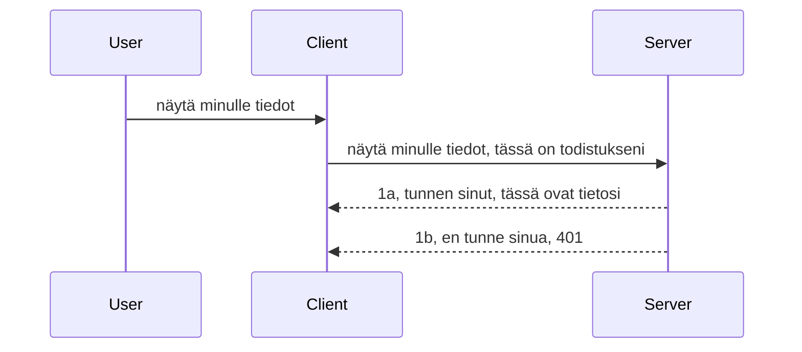

# Yksinkertainen tunnistus

MCP SDK:t tukevat OAuth 2.1:n käyttöä, joka on rehellisesti sanottuna melko monimutkainen prosessi, joka sisältää käsitteitä kuten tunnistuspalvelin, resurssipalvelin, tunnistetietojen lähettäminen, koodin saaminen, koodin vaihtaminen kantajan tokeniin, kunnes lopulta pääset käsiksi resurssitietoihisi. Jos et ole tottunut OAuthiin, joka on mahtava toteutettava asia, on hyvä aloittaa jollain perustasolla määritellyllä tunnistuksella ja rakentaa siitä yhä parempaa ja turvallisempaa. Tästä syystä tämä luku on olemassa — rakentamaan sinut kohti kehittyneempää tunnistusta.

## Tunnistus, mitä sillä tarkoitetaan?

Tunnistus on lyhenne autentikoinnista ja valtuutuksesta. Ajatuksena on, että meidän täytyy tehdä kaksi asiaa:

- **Autentikointi**, eli prosessi, jossa selvitetään, päästetäänkö henkilö meidän taloomme, onko hänellä oikeus olla "tässä", eli pääsy resurssipalvelimellemme, jossa MCP Server -ominaisuutemme sijaitsevat.
- **Valtuutus**, on prosessi, jossa selvitetään, onko käyttäjällä oikeus päästä käsiksi niihin erityisiin resursseihin, joita hän pyytää, esimerkiksi näihin tilauksiin tai tuotteisiin, tai onko hän esimerkiksi sallittu lukemaan sisältöä mutta ei poistamaan sitä.

## Tunnistetiedot: miten kerromme järjestelmälle kuka olemme

Useimmat web-kehittäjät ajattelevat tavallisesti, että palvelimelle annetaan jonkinlainen tunnistetieto, yleensä salaisuus, joka kertoo, saavatko he olla siellä "Autentikointi". Tämä tunnistetieto on yleensä base64-koodattu versio käyttäjänimestä ja salasanasta tai API-avain, joka yksilöi tietyn käyttäjän.

Tämä tarkoittaa, että tunnistetieto lähetetään otsakkeen nimeltä "Authorization" kautta näin:

```json
{ "Authorization": "secret123" }
```

Tätä kutsutaan yleensä perusautentikoinniksi. Kuinka kokonaisvirtaus sitten toimii on seuraavanlainen:



Nyt kun ymmärrämme, miten se toimii virtausnäkökulmasta, miten toteutamme sen? Suurimmassa osassa web-palvelimia on käsite nimeltä middleware, koodinpätkä joka suoritetaan osana pyyntöä, joka voi tarkistaa tunnistetiedot, ja jos ne ovat voimassa, päästää pyynnön läpi. Jos pyynnöllä ei ole voimassa olevia tunnistetietoja, saat tunnistusvirheen. Katsotaan miten tämä voidaan toteuttaa:

**Python**

```python
class AuthMiddleware(BaseHTTPMiddleware):
    async def dispatch(self, request, call_next):

        has_header = request.headers.get("Authorization")
        if not has_header:
            print("-> Missing Authorization header!")
            return Response(status_code=401, content="Unauthorized")

        if not valid_token(has_header):
            print("-> Invalid token!")
            return Response(status_code=403, content="Forbidden")

        print("Valid token, proceeding...")
       
        response = await call_next(request)
        # lisää asiakaskohtaiset otsikot tai muuta vastausta jollain tavalla
        return response


starlette_app.add_middleware(CustomHeaderMiddleware)
```

Tässä meillä on:

- Luotu `AuthMiddleware`-middleware, jonka `dispatch`-metodia web-palvelin kutsuu.
- Lisätty middleware web-palvelimelle:

    ```python
    starlette_app.add_middleware(AuthMiddleware)
    ```

- Kirjoitettu validointilogiikka, joka tarkistaa, onko Authorization-otsake olemassa ja onko lähetetty salaisuus voimassa:

    ```python
    has_header = request.headers.get("Authorization")
    if not has_header:
        print("-> Missing Authorization header!")
        return Response(status_code=401, content="Unauthorized")

    if not valid_token(has_header):
        print("-> Invalid token!")
        return Response(status_code=403, content="Forbidden")
    ```

    jos salaisuus on olemassa ja voimassa, päästämme pyynnön läpi kutsumalla `call_next` ja palautamme vastauksen.

    ```python
    response = await call_next(request)
    # lisää asiakkaan otsikoita tai muuta vastausta jollain tavalla
    return response
    ```

Tämä toimii siten, että jos web-pyyntö tehdään palvelimelle, middleware kutsutaan ja toteutuksensa mukaisesti se joko päästää pyynnön läpi tai palauttaa virheen, joka kertoo asiakkaalle, että hänellä ei ole oikeutta edetä.

**TypeScript**

Tässä luomme middleware:n suositulla Express-kehyksellä ja keskeytämme pyynnön ennen kuin se saavuttaa MCP Serverin. Tässä on koodi siihen:

```typescript
function isValid(secret) {
    return secret === "secret123";
}

app.use((req, res, next) => {
    // 1. Onko valtuutusotsikko läsnä?
    if(!req.headers["Authorization"]) {
        res.status(401).send('Unauthorized');
    }
    
    let token = req.headers["Authorization"];

    // 2. Tarkista kelpoisuus.
    if(!isValid(token)) {
        res.status(403).send('Forbidden');
    }

   
    console.log('Middleware executed');
    // 3. Siirtää pyynnön seuraavaan vaiheeseen pyyntöputkessa.
    next();
});
```

Tässä koodissa:

1. Tarkistamme, onko Authorization-otsake alun perin olemassa, jos ei ole, lähetämme 401-virheen.
2. Varmistamme, että tunnistetieto/token on voimassa, ellei ole, lähetämme 403-virheen.
3. Lopuksi välitämme pyynnön eteenpäin pyyntöpipeline:ssa ja palautamme pyydetyn resurssin.

## Harjoitus: Toteuta autentikointi

Otetaan tietomme ja kokeillaan toteuttaa se. Tässä suunnitelma:

Palvelin

- Luo web-palvelin ja MCP-instanssi.
- Toteuta middleware palvelimelle.

Asiakas

- Lähetä web-pyyntö tunnistetiedon kanssa otsakkeessa.

### -1- Luo web-palvelin ja MCP-instanssi

> **Katse eteenpäin:** alla oleva TypeScript-esimerkki seuraa HTTP-siirtoja `transports`-kartassa, jossa avaimena on `mcp-session-id`, kuten **MCP Specification 2025-11-25** määrää. Julkaisukandidaatti `2026-07-28` poistaa `initialize` -kättelyn ja session ID:n kokonaan, jolloin tämä per-istunnon siirtokartta poistuu ja tilalle tulee tilattomia, itsenäisiä pyyntöjä. Katso [Mitä MCP:ssä muuttuu: 2026-07-28 julkaisuversio](../../01-CoreConcepts/mcp-2026-07-28-release-candidate.md).

Ensimmäisessä vaiheessa meidän tulee luoda web-palvelininstanssi ja MCP Server.

**Python**

Tässä luomme MCP-palvelininstanssin, luomme starlette-websovelluksen ja isännöimme sitä uvicornilla.

```python
# luodaan MCP-palvelin

app = FastMCP(
    name="MCP Resource Server",
    instructions="Resource Server that validates tokens via Authorization Server introspection",
    host=settings["host"],
    port=settings["port"],
    debug=True
)

# luodaan starlette-verkkosovellus
starlette_app = app.streamable_http_app()

# tarjoillaan sovellus uvicornin kautta
async def run(starlette_app):
    import uvicorn
    config = uvicorn.Config(
            starlette_app,
            host=app.settings.host,
            port=app.settings.port,
            log_level=app.settings.log_level.lower(),
        )
    server = uvicorn.Server(config)
    await server.serve()

run(starlette_app)
```

Tässä koodissa:

- Luomme MCP Serverin.
- Rakennamme starlette-websovelluksen MCP Serveristä, `app.streamable_http_app()`.
- Isännöimme ja palvelemme websovellusta käyttäen uvicornia `server.serve()`.

**TypeScript**

Tässä luomme MCP Server -instanssin.

```typescript
const server = new McpServer({
      name: "example-server",
      version: "1.0.0"
    });

    // ... aseta palvelinresurssit, työkalut ja kehotteet ...
```

Tämä MCP Serverin luonti pitää tehdä POST /mcp -reitillä, joten siirretään yllä oleva koodi näin:

```typescript
import express from "express";
import { randomUUID } from "node:crypto";
import { McpServer } from "@modelcontextprotocol/sdk/server/mcp.js";
import { StreamableHTTPServerTransport } from "@modelcontextprotocol/sdk/server/streamableHttp.js";
import { isInitializeRequest } from "@modelcontextprotocol/sdk/types.js"

const app = express();
app.use(express.json());

// Kartta kuljetusten tallentamiseksi istunnon ID:n mukaan
const transports: { [sessionId: string]: StreamableHTTPServerTransport } = {};

// Käsittele POST-pyynnöt asiakas-palvelin -viestintään
app.post('/mcp', async (req, res) => {
  // Tarkista olemassa oleva istunnon ID
  const sessionId = req.headers['mcp-session-id'] as string | undefined;
  let transport: StreamableHTTPServerTransport;

  if (sessionId && transports[sessionId]) {
    // Käytä uudelleen olemassa olevaa kuljetusta
    transport = transports[sessionId];
  } else if (!sessionId && isInitializeRequest(req.body)) {
    // Uusi alustuspyyntö
    transport = new StreamableHTTPServerTransport({
      sessionIdGenerator: () => randomUUID(),
      onsessioninitialized: (sessionId) => {
        // Tallenna kuljetus istunnon ID:n mukaan
        transports[sessionId] = transport;
      },
      // DNS-uudelleensidontasuojus on oletuksena pois käytöstä taaksepäin yhteensopivuuden vuoksi. Jos ajat tätä palvelinta
      // paikallisesti, varmista että asetat:
      // enableDnsRebindingProtection: true,
      // allowedHosts: ['127.0.0.1'],
    });

    // Siivoa kuljetus kun se suljetaan
    transport.onclose = () => {
      if (transport.sessionId) {
        delete transports[transport.sessionId];
      }
    };
    const server = new McpServer({
      name: "example-server",
      version: "1.0.0"
    });

    // ... aseta palvelimen resurssit, työkalut ja kehotteet ...

    // Yhdistä MCP-palvelimeen
    await server.connect(transport);
  } else {
    // Virheellinen pyyntö
    res.status(400).json({
      jsonrpc: '2.0',
      error: {
        code: -32000,
        message: 'Bad Request: No valid session ID provided',
      },
      id: null,
    });
    return;
  }

  // Käsittele pyyntö
  await transport.handleRequest(req, res, req.body);
});

// Uudelleenkäytettävä käsittelijä GET- ja DELETE-pyynnöille
const handleSessionRequest = async (req: express.Request, res: express.Response) => {
  const sessionId = req.headers['mcp-session-id'] as string | undefined;
  if (!sessionId || !transports[sessionId]) {
    res.status(400).send('Invalid or missing session ID');
    return;
  }
  
  const transport = transports[sessionId];
  await transport.handleRequest(req, res);
};

// Käsittele GET-pyynnöt palvelin-asiakas ilmoituksiin SSE:n kautta
app.get('/mcp', handleSessionRequest);

// Käsittele DELETE-pyynnöt istunnon päättämiseen
app.delete('/mcp', handleSessionRequest);

app.listen(3000);
```

Nyt näet, miten MCP Serverin luonti on siirretty `app.post("/mcp")` sisälle.

Siirrytään seuraavaan vaiheeseen, jossa luomme middleware:n, jolla voimme validoida saapuvan tunnistetiedon.

### -2- Toteuta middleware palvelimelle

Seuraavaksi middleware-osuus. Tässä luomme middleware:n, joka etsii tunnistetietoa `Authorization`-otsakkeesta ja validoi sen. Jos se hyväksytään, pyyntö voi jatkaa ja tehdä haluamansa (esim. listata työkaluja, lukea resurssia tai mitä tahansa MCP-ominaisuutta, jota asiakas pyysi).

**Python**

Middleware:n luomiseksi tarvitsemme luokan, joka perii `BaseHTTPMiddleware`:n. Kaksi tärkeää osaa ovat:

- Pyyntö `request`, josta luemme otsaketiedot.
- `call_next` callback, joka täytyy kutsua, jos asiakas on tuonut hyväksyttävän tunnistetiedon.

Ensin käsittelemme tapauksen, jos `Authorization`-otsaketta ei ole:

```python
has_header = request.headers.get("Authorization")

# otsikkoa ei ole, epäonnistuu 401:llä, muuten jatka.
if not has_header:
    print("-> Missing Authorization header!")
    return Response(status_code=401, content="Unauthorized")
```

Tässä lähetämme 401 unauthorized -viestin, koska asiakas epäonnistuu tunnistautumisessa.

Seuraavaksi, jos tunnistetieto on annettu, tarkistamme sen voimassaolon näin:

```python
 if not valid_token(has_header):
    print("-> Invalid token!")
    return Response(status_code=403, content="Forbidden")
```

Huomaa, että yllä lähetämme 403 forbidden -viestin. Katsotaan koko middleware alla, joka toteuttaa kaiken edellä mainitun:

```python
class AuthMiddleware(BaseHTTPMiddleware):
    async def dispatch(self, request, call_next):

        has_header = request.headers.get("Authorization")
        if not has_header:
            print("-> Missing Authorization header!")
            return Response(status_code=401, content="Unauthorized")

        if not valid_token(has_header):
            print("-> Invalid token!")
            return Response(status_code=403, content="Forbidden")

        print("Valid token, proceeding...")
        print(f"-> Received {request.method} {request.url}")
        response = await call_next(request)
        response.headers['Custom'] = 'Example'
        return response

```

Hienoa, mutta entä `valid_token`-funktio? Tässä se on alla:

```python
# ÄLÄ käytä tuotannossa - paranna sitä !!
def valid_token(token: str) -> bool:
    # poista "Bearer " etuliite
    if token.startswith("Bearer "):
        token = token[7:]
        return token == "secret-token"
    return False
```

Tätä pitäisi toki parantaa.

TÄRKEÄÄ: Sinun ei IKINÄ pitäisi pitää salaisuuksia näin koodissa. Kannattaa mieluummin noutaa arvot tietolähteestä tai IDP:ltä (identiteettipalveluntarjoajalta) tai vielä parempaa, antaa IDP:n tehdä validointi.

**TypeScript**

Toteuttaaksemme tämän Expressillä, meidän täytyy kutsua `use`-metodia, joka ottaa middleware-funktioita.

Meidän täytyy:

- Käyttää pyyntömuuttujaa tarkistaaksemme annetun tunnistetiedon `Authorization`-ominaisuudessa.
- Validoida tunnistetieto, ja jos se on hyväksytty, päästää pyyntö etenemään ja antaa asiakkaan MCP-pyynnön tehdä haluamansa (esim. listata työkaluja, lukea resurssi tai muuta MCP-toiminnallisuutta).

Tässä tarkistamme, onko `Authorization`-otsake olemassa, ja jos ei, pysäytämme pyynnön:

```typescript
if(!req.headers["authorization"]) {
    res.status(401).send('Unauthorized');
    return;
}
```

Jos otsake ei ole lähetetty, saat 401-virheen.

Seuraavaksi tarkistamme, onko tunnistetieto voimassa; jos ei, pysäytämme pyynnön 403-viestillä:

```typescript
if(!isValid(token)) {
    res.status(403).send('Forbidden');
    return;
} 
```

Huomaa, että nyt saat 403-virheen.

Tässä on koko koodi:

```typescript
app.use((req, res, next) => {
    console.log('Request received:', req.method, req.url, req.headers);
    console.log('Headers:', req.headers["authorization"]);
    if(!req.headers["authorization"]) {
        res.status(401).send('Unauthorized');
        return;
    }
    
    let token = req.headers["authorization"];

    if(!isValid(token)) {
        res.status(403).send('Forbidden');
        return;
    }  

    console.log('Middleware executed');
    next();
});
```

Olemme asettaneet web-palvelimen ottamaan middleware mukaan tarkistamaan, lähettääkö asiakas meille toivomamme tunnistetiedon. Entä asiakas itse?

### -3- Lähetä web-pyyntö tunnistetiedon kanssa otsakkeessa

Meidän täytyy varmistaa, että asiakas lähettää tunnistetiedon otsakkeessa. Koska aiomme käyttää MCP-asiakasta, meidän täytyy selvittää, miten se tehdään.

**Python**

Asiakaspuolella meidän täytyy välittää otsake tunnistetietomme kanssa näin:

```python
# ÄLÄ kovakoodaa arvoa, säilytä se vähintään ympäristömuuttujassa tai turvallisemmassa tallennustilassa
token = "secret-token"

async with streamablehttp_client(
        url = f"http://localhost:{port}/mcp",
        headers = {"Authorization": f"Bearer {token}"}
    ) as (
        read_stream,
        write_stream,
        session_callback,
    ):
        async with ClientSession(
            read_stream,
            write_stream
        ) as session:
            await session.initialize()
      
            # TODO, mitä haluat tehdä asiakkaassa, esim. listaa työkalut, kutsu työkaluja jne.
```

Huomaa, että täytämme `headers`-ominaisuuden näin: `headers = {"Authorization": f"Bearer {token}"}`.

**TypeScript**

Ratkaistaan tämä kahdessa vaiheessa:

1. Täytetään kokoonpano-olio tunnistetiedoilla.
2. Annetaan kokoonpano-olio siirrolle.

```typescript

// ÄLÄ kovakoodaa arvoa kuten tässä näytetty. Vähintään sen pitäisi olla ympäristömuuttuja ja käytä jotain kuten dotenv (kehitystilassa).
let token = "secret123"

// määrittele client transport -optio-objekti
let options: StreamableHTTPClientTransportOptions = {
  sessionId: sessionId,
  requestInit: {
    headers: {
      "Authorization": "secret123"
    }
  }
};

// välitä optio-objekti transportille
async function main() {
   const transport = new StreamableHTTPClientTransport(
      new URL(serverUrl),
      options
   );
```

Tässä näet, miten jouduimme luomaan `options`-olion ja sijoittamaan otsakkeet `requestInit`-ominaisuuteen.

TÄRKEÄÄ: Miten parannamme tätä tästä? Nykyisellä toteutuksella on ongelmia. Ensinnäkin tunnistetietojen lähettäminen näin on melko riskialtista, ellei vähintäänkin käytössä ole HTTPS. Jopa silloin tunnistetiedot voidaan varastaa, joten tarvitaan järjestelmä, jossa tokenin voi helposti kumota ja lisätä tarkistuksia, kuten mistä päin maailmaa pyyntö tulee, tapahtuuko se liian usein (bot-tyyppistä käytöstä), lyhyesti, huolia riittää.

Tätä sanottua, yksinkertaisiin API:hin, joissa et halua kenenkään kutsuvan API:a ilman tunnistautumista, tämä on hyvä alku.

Kehitetään tietoturvaa vielä hieman käyttämällä standardoitua muotoa kuten JSON Web Token, eli JWT- tai "JOT"-tokeneita.

## JSON Web Tokenit, JWT

Joten, tavoitteena on parantaa nykyisiä hyvin yksinkertaisia tunnistetietoja. Mitä välittömiä parannuksia JWT:n käyttöönotto tuo?

- **Turvallisuusparannukset**. Perusautentikoinnissa käyttäjänimi ja salasana lähetetään base64-koodattuna tokenina (tai API-avain) yhä uudestaan, mikä lisää riskiä. JWT:llä lähetät käyttäjänimesi ja salasanasi ja saat tokenin vastineeksi, joka on myös aikarajoitettu eli vanhenee. JWT:n avulla voit helposti käyttää hienojakoista pääsynvalvontaa roolien, scopejen ja käyttöoikeuksien avulla.
- **Statelessness ja skaalautuvuus**. JWT:t ovat itsenäisiä, ne sisältävät kaiken käyttäjätiedon ja poistavat tarvetta serveripuolen istuntotallennukseen. Tokenin voi myös validoida paikallisesti.
- **Yhteentoimivuus ja federaatio**. JWT:t ovat Open ID Connectin keskeisiä ja niitä käytetään tunnetuissa identiteetin tarjoajissa kuten Entra ID, Google Identity ja Auth0. Ne mahdollistavat myös kertakirjautumisen ja paljon muuta tehden siitä yritystason ratkaisun.
- **Modulaarisuus ja joustavuus**. JWT:tä voi käyttää myös API Gatewayn kanssa kuten Azure API Management, NGINX ym. Tuki kattaa autentikointiskenaariot ja palvelin-palvelin -yhteydet mukaan lukien edustamisen ja delegoinnin.
- **Suorituskyky ja välimuisti**. JWT:t voi välimuistiin purkamisen jälkeen, mikä vähentää tarvetta jäsentämiselle. Tämä auttaa erityisesti suuren liikenteen sovelluksissa parantaen läpäisykykyä ja vähentäen kuormaa infrastruktuurissa.
- **Edistyneet ominaisuudet**. Tukee myös tarkastelua (validiteetin tarkistus palvelimella) ja mitätöintiä (tekee tokenin virheelliseksi).

Näillä eduilla katsotaan, miten toteutustamme voidaan viedä seuraavalle tasolle.

## Perustunnistuksen muuntaminen JWT:ksi

Muutokset, jotka meidän on tehtävä pinnallisesti ovat:

- **Opi rakentamaan JWT-token** ja valmistamaan se lähetettäväksi asiakkaalta palvelimelle.
- **Validoi JWT-token**, ja jos se on oikein, anna asiakkaan käyttää resurssejamme.
- **Turvallinen tokenin säilytys**. Miten säilytämme tämän tokenin.
- **Suojaa reitit**. Meidän täytyy suojata reitit, meidän tapauksessamme MCP-ominaisuudet.
- **Lisää refresh-tokenit**. Varmista, että luomme lyhytikäisiä tokeneita, mutta myös pitkäikäisiä refresh-tokeneita, joilla voi hankkia uusia tokeneita vanhentumisen jälkeen. Lisäksi varmista refresh-päätepiste ja kiertostrategia.

### -1- Rakenna JWT-token

Ensin JWT-tokenissa on seuraavat osat:

- **otsake**, algoritmi ja tokenin tyyppi.
- **sisältö (payload)**, claimsit, kuten sub (käyttäjä tai entiteetti, jota token edustaa, yleensä käyttäjätunnus), exp (vanhentumisaika), role (rooli)
- **allekirjoitus**, joka allekirjoitetaan salaisuudella tai yksityisavaimella.

Meidän tulee rakentaa otsake, sisältö ja koodattu token.

**Python**

```python

import jwt
import jwt
from jwt.exceptions import ExpiredSignatureError, InvalidTokenError
import datetime

# Salainen avain JWT:n allekirjoittamiseen
secret_key = 'your-secret-key'

header = {
    "alg": "HS256",
    "typ": "JWT"
}

# käyttäjätiedot, niiden väitteet ja vanhentumisaika
payload = {
    "sub": "1234567890",               # Aihe (käyttäjän tunnus)
    "name": "User Userson",                # Muokattu väite
    "admin": True,                     # Muokattu väite
    "iat": datetime.datetime.utcnow(),# Annettu ajankohta
    "exp": datetime.datetime.utcnow() + datetime.timedelta(hours=1)  # Vanhentumisaika
}

# koodaa se
encoded_jwt = jwt.encode(payload, secret_key, algorithm="HS256", headers=header)
```

Yllä olevassa koodissa olemme:

- Määritelleet otsakkeen käyttäen HS256-algoritmia ja tyyppiä JWT.
- Rakentaneet sisällön, joka sisältää aiheen eli käyttäjätunnuksen, käyttäjänimen, roolin, milloin token luotiin ja milloin se vanhenee toteuttaen aikarajoitteen.

**TypeScript**

Tässä tarvitsemme riippuvuuksia, jotka auttavat JWT-tokenin rakentamisessa.

Riippuvuudet

```sh

npm install jsonwebtoken
npm install --save-dev @types/jsonwebtoken
```

Nyt kun tämä on valmiina, luodaan otsake, sisältö ja niistä koodattu token.

```typescript
import jwt from 'jsonwebtoken';

const secretKey = 'your-secret-key'; // Käytä ympäristömuuttujia tuotannossa

// Määritä lataus
const payload = {
  sub: '1234567890',
  name: 'User usersson',
  admin: true,
  iat: Math.floor(Date.now() / 1000), // Annettu ajankohta
  exp: Math.floor(Date.now() / 1000) + 60 * 60 // Vanhenee tunnissa
};

// Määritä otsikko (valinnainen, jsonwebtoken asettaa oletukset)
const header = {
  alg: 'HS256',
  typ: 'JWT'
};

// Luo token
const token = jwt.sign(payload, secretKey, {
  algorithm: 'HS256',
  header: header
});

console.log('JWT:', token);
```

Tämä token on:

Allekirjoitettu HS256:lla  
Voimassa tunnin  
Sisältää claimit kuten sub, name, admin, iat ja exp.

### -2- Validoi token

Meidän tulee myös validoida token, tämä on tehtävä palvelimella varmistaaksemme, että asiakas lähettää meille pätevän tokenin. Tarkistuksia on monia; rakenteen validoinnista tokenin voimassaolon tarkistamiseen. Suositellaan myös muita tarkistuksia, kuten onko käyttäjä tietokannassasi ja muita.

Validointia varten dekoodataan token, jotta voimme lukea sen ja aloittaa validoinnin:

**Python**

```python

# Dekoodaa ja varmista JWT
try:
    decoded = jwt.decode(token, secret_key, algorithms=["HS256"])
    print("✅ Token is valid.")
    print("Decoded claims:")
    for key, value in decoded.items():
        print(f"  {key}: {value}")
except ExpiredSignatureError:
    print("❌ Token has expired.")
except InvalidTokenError as e:
    print(f"❌ Invalid token: {e}")

```

Tässä koodissa kutsumme `jwt.decode` funktiota käyttäen syötteenä tokenia, salaista avainta ja valittua algoritmia. Huomaa, että käytämme try-catch -rakennetta, koska epäonnistunut validointi johtaa virheen syntymiseen.

**TypeScript**

Tässä meidän on kutsuttava `jwt.verify` saadaksemme dekoodatun version tokenista, jota voimme analysoida tarkemmin. Jos tämä kutsu epäonnistuu, se tarkoittaa, että tokenin rakenne on virheellinen tai se ei ole enää voimassa.

```typescript

try {
  const decoded = jwt.verify(token, secretKey);
  console.log('Decoded Payload:', decoded);
} catch (err) {
  console.error('Token verification failed:', err);
}
```

HUOMAUTUS: kuten aiemmin mainittu, meidän tulisi tehdä lisätarkistuksia varmistaaksemme, että tämä token viittaa järjestelmämme käyttäjään ja että käyttäjällä on ne oikeudet, joita se väittää omaavansa.

Seuraavaksi tarkastellaan roolipohjaista käyttöoikeuksien hallintaa, eli RBAC:ia.

## Roolipohjaisen käyttöoikeuksien hallinnan lisääminen

Ajatuksena on ilmaista, että eri rooleilla on erilaiset käyttöoikeudet. Esimerkiksi oletamme, että ylläpitäjä voi tehdä kaiken, normaali käyttäjä voi lukea/kirjoittaa ja vierailija voi vain lukea. Täten tässä on joitakin mahdollisia käyttöoikeustasoja:

- Admin.Write
- User.Read
- Guest.Read

Katsotaan, miten tällainen hallinta voidaan toteuttaa middlewarella. Middlewareja voidaan lisätä reitille tai kaikille reiteille.

**Python**

```python
from starlette.middleware.base import BaseHTTPMiddleware
from starlette.responses import JSONResponse
import jwt

# ÄLÄ laita salaista suoraan koodiin, tämä on vain esimerkki. Lue se turvallisesta paikasta.
SECRET_KEY = "your-secret-key" # laita tämä ympäristömuuttujaan
REQUIRED_PERMISSION = "User.Read"

class JWTPermissionMiddleware(BaseHTTPMiddleware):
    async def dispatch(self, request, call_next):
        auth_header = request.headers.get("Authorization")
        if not auth_header or not auth_header.startswith("Bearer "):
            return JSONResponse({"error": "Missing or invalid Authorization header"}, status_code=401)

        token = auth_header.split(" ")[1]
        try:
            decoded = jwt.decode(token, SECRET_KEY, algorithms=["HS256"])
        except jwt.ExpiredSignatureError:
            return JSONResponse({"error": "Token expired"}, status_code=401)
        except jwt.InvalidTokenError:
            return JSONResponse({"error": "Invalid token"}, status_code=401)

        permissions = decoded.get("permissions", [])
        if REQUIRED_PERMISSION not in permissions:
            return JSONResponse({"error": "Permission denied"}, status_code=403)

        request.state.user = decoded
        return await call_next(request)


```

Middlewaren lisäämiseen on muutamia erilaisia tapoja, kuten alla:

```python

# Vaihtoehto 1: lisää middleware rakentamisen yhteydessä starlette-sovellukseen
middleware = [
    Middleware(JWTPermissionMiddleware)
]

app = Starlette(routes=routes, middleware=middleware)

# Vaihtoehto 2: lisää middleware sen jälkeen, kun starlette-sovellus on jo rakennettu
starlette_app.add_middleware(JWTPermissionMiddleware)

# Vaihtoehto 3: lisää middlewarea reittikohtaisesti
routes = [
    Route(
        "/mcp",
        endpoint=..., # käsittelijä
        middleware=[Middleware(JWTPermissionMiddleware)]
    )
]
```

**TypeScript**

Voimme käyttää `app.use` -funktiota ja middlewarea, joka suoritetaan kaikille pyynnöille.

```typescript
app.use((req, res, next) => {
    console.log('Request received:', req.method, req.url, req.headers);
    console.log('Headers:', req.headers["authorization"]);

    // 1. Tarkista, onko valtuutusotsikko lähetetty

    if(!req.headers["authorization"]) {
        res.status(401).send('Unauthorized');
        return;
    }
    
    let token = req.headers["authorization"];

    // 2. Tarkista, onko token voimassa
    if(!isValid(token)) {
        res.status(403).send('Forbidden');
        return;
    }  

    // 3. Tarkista, onko tokenin käyttäjä olemassa järjestelmässämme
    if(!isExistingUser(token)) {
        res.status(403).send('Forbidden');
        console.log("User does not exist");
        return;
    }
    console.log("User exists");

    // 4. Varmista, että tokenilla on oikeat käyttöoikeudet
    if(!hasScopes(token, ["User.Read"])){
        res.status(403).send('Forbidden - insufficient scopes');
    }

    console.log("User has required scopes");

    console.log('Middleware executed');
    next();
});

```

Middlewaremme voi tehdä monta asiaa, ja sen TULISI tehdä nämä, nimittäin:

1. Tarkistaa onko authorization-header olemassa
2. Tarkistaa tokenin pätevyys, kutsumme `isValid`-metodia, jonka olemme kirjoittaneet tarkistamaan JWT-tokenin eheys ja voimassaolo.
3. Varmistaa, että käyttäjä on järjestelmässämme, tämä tulisi tarkistaa.

   ```typescript
    // käyttäjät tietokannassa
   const users = [
     "user1",
     "User usersson",
   ]

   function isExistingUser(token) {
     let decodedToken = verifyToken(token);

     // TODO, tarkista onko käyttäjä olemassa tietokannassa
     return users.includes(decodedToken?.name || "");
   }
   ```

   Yllä olemme luoneet hyvin yksinkertaisen `users`-listan, joka tulisi tietenkin säilyttää tietokannassa.

4. Lisäksi meidän tulisi tarkistaa myös, että tokenilla on oikeat käyttöoikeudet.

   ```typescript
   if(!hasScopes(token, ["User.Read"])){
        res.status(403).send('Forbidden - insufficient scopes');
   }
   ```

   Tässä yllä olevassa middleware-koodissa tarkistamme, että token sisältää User.Read-oikeuden, jos ei, palautamme 403-virheen. Alla on `hasScopes`-avustajametodi.

   ```typescript
   function hasScopes(scope: string, requiredScopes: string[]) {
     let decodedToken = verifyToken(scope);
    return requiredScopes.every(scope => decodedToken?.scopes.includes(scope));
  }
   ```

Have a think which additional checks you should be doing, but these are the absolute minimum of checks you should be doing.

Using Express as a web framework is a common choice. There are helpers library when you use JWT so you can write less code.

- `express-jwt`, helper library that provides a middleware that helps decode your token.
- `express-jwt-permissions`, this provides a middleware `guard` that helps check if a certain permission is on the token.

Here's what these libraries can look like when used:

```typescript
const express = require('express');
const jwt = require('express-jwt');
const guard = require('express-jwt-permissions')();

const app = express();
const secretKey = 'your-secret-key'; // put this in env variable

// Decode JWT and attach to req.user
app.use(jwt({ secret: secretKey, algorithms: ['HS256'] }));

// Check for User.Read permission
app.use(guard.check('User.Read'));

// multiple permissions
// app.use(guard.check(['User.Read', 'Admin.Access']));

app.get('/protected', (req, res) => {
  res.json({ message: `Welcome ${req.user.name}` });
});

// Error handler
app.use((err, req, res, next) => {
  if (err.code === 'permission_denied') {
    return res.status(403).send('Forbidden');
  }
  next(err);
});

```

Nyt olet nähnyt, kuinka middlewarea voidaan käyttää sekä autentikointiin että auktorisointiin. Entä mitä MCP:n tapauksessa, muuttuuko autentikointitapamme? Selvitetään seuraavassa osiossa.

### -3- Lisää RBAC MCP:hen

Olet tähän saakka nähnyt, kuinka RBAC voidaan lisätä middlewarella, mutta MCP:lle ei ole helppoa tapaa lisätä RBAC:ia per MCP-ominaisuus, joten mitä teemme? No, meidän täytyy vain lisätä koodia kuten tämä, joka tarkistaa tässä tapauksessa, onko asiakkaalla oikeudet kutsua tiettyä työkalua:

Sinulla on muutamia eri vaihtoehtoja tavoittaa per ominaisuustason RBAC, tässä joitakin:

- Lisää tarkistus jokaiselle työkalulle, resurssille, kehotteelle, jossa täytyy tarkistaa käyttöoikeustaso.

   **python**

   ```python
   @tool()
   def delete_product(id: int):
      try:
          check_permissions(role="Admin.Write", request)
      catch:
        pass # asiakkaan valtuutus epäonnistui, nosta valtuutusvirhe
   ```

   **typescript**

   ```typescript
   server.registerTool(
    "delete-product",
    {
      title: Delete a product",
      description: "Deletes a product",
      inputSchema: { id: z.number() }
    },
    async ({ id }) => {
      
      try {
        checkPermissions("Admin.Write", request);
        // tehtävä, lähetä tunniste productServicelle ja etämerkinnälle
      } catch(Exception e) {
        console.log("Authorization error, you're not allowed");  
      }

      return {
        content: [{ type: "text", text: `Deletected product with id ${id}` }]
      };
    }
   );
   ```


- Käytä kehittyneempää palvelinratkaisua ja pyyntöjen käsittelijöitä, jolloin minimoit tarkistusten määrän eri paikoissa.

   **Python**

   ```python
   
   tool_permission = {
      "create_product": ["User.Write", "Admin.Write"],
      "delete_product": ["Admin.Write"]
   }

   def has_permission(user_permissions, required_permissions) -> bool:
      # käyttäjän_oikeudet: käyttäjän omistamien oikeuksien luettelo
      # vaaditut_oikeudet: työkalun tarvitseman oikeuksien luettelo
      return any(perm in user_permissions for perm in required_permissions)

   @server.call_tool()
   async def handle_call_tool(
     name: str, arguments: dict[str, str] | None
   ) -> list[types.TextContent]:
    # Oletetaan, että request.user.permissions on käyttäjän oikeuksien luettelo
     user_permissions = request.user.permissions
     required_permissions = tool_permission.get(name, [])
     if not has_permission(user_permissions, required_permissions):
        # Heitä virhe "Sinulla ei ole oikeutta käyttää työkalua {name}"
        raise Exception(f"You don't have permission to call tool {name}")
     # jatka ja kutsu työkalua
     # ...
   ```   
   

   **TypeScript**

   ```typescript
   function hasPermission(userPermissions: string[], requiredPermissions: string[]): boolean {
       if (!Array.isArray(userPermissions) || !Array.isArray(requiredPermissions)) return false;
       // Palauta tosi, jos käyttäjällä on vähintään yksi vaadittu oikeus
       
       return requiredPermissions.some(perm => userPermissions.includes(perm));
   }
  
   server.setRequestHandler(CallToolRequestSchema, async (request) => {
      const { params: { name } } = request;
  
      let permissions = request.user.permissions;
  
      if (!hasPermission(permissions, toolPermissions[name])) {
         return new Error(`You don't have permission to call ${name}`);
      }
  
      // jatka..
   });
   ```

   Huomaa, että sinun täytyy varmistaa, että middlewaresi asettaa dekoodatun tokenin pyynnön user-ominaisuuteen, jotta yllä oleva koodi on yksinkertaista.

### Yhteenveto

Nyt kun olemme keskustelleet, miten lisätä tuki RBAC:ille yleisesti ja MCP:lle erityisesti, on aika kokeilla turvallisuuden toteuttamista itse, jotta ymmärsit sinulle esitetyt käsitteet.

## Tehtävä 1: Rakenna mcp-palvelin ja mcp-asiakas perusautentikoinnilla

Tässä otat oppimasi tiedot, kuinka lähetetään tunnistetiedot otsikoiden kautta.

## Ratkaisu 1

[Solution 1](./code/basic/README.md)

## Tehtävä 2: Päivitä ratkaisusi tehtävässä 1 käyttämään JWT:tä

Ota ensimmäinen ratkaisu ja parannetaan sitä tällä kertaa.

Sen sijaan, että käytetään Basic Authia, käytetään JWT:tä.

## Ratkaisu 2

[Solution 2](./solution/jwt-solution/README.md)

## Haaste

Lisää RBAC per työkalu, kuten kuvasimme osiossa "Lisää RBAC MCP:hen".

## Yhteenveto

Toivottavasti olet oppinut tässä luvussa paljon, aina ei-milloinkaan -turvallisuudesta, perus-turvallisuuteen, JWT:hen ja miten se voidaan lisätä MCP:lle.

Olemme rakentaneet vahvan pohjan räätälöidyillä JWT:illä, mutta kun skaalaamme, siirrymme standardipohjaiseen identiteettimalliin. Tunnistuspalveluntarjoajan kuten Entra tai Keycloak käyttöönotto mahdollistaa tokenien luomisen, validoinnin ja elinkaaren hallinnan siirtämisen luotetulle alustalle — vapauttaen meidät keskittymään sovelluslogiikkaan ja käyttäjäkokemukseen.

Sitä varten meillä on edistyneempi [luku Entrasta](../../05-AdvancedTopics/mcp-security-entra/README.md).

## Mitä seuraavaksi

- Seuraava: [MCP-isäntien asennus](../12-mcp-hosts/README.md)

---

<!-- CO-OP TRANSLATOR DISCLAIMER START -->
**Vastuuvapauslauseke**:
Tämä asiakirja on käännetty käyttämällä tekoälypohjaista käännöspalvelua [Co-op Translator](https://github.com/Azure/co-op-translator). Vaikka pyrimme tarkkuuteen, otathan huomioon, että automaattiset käännökset saattavat sisältää virheitä tai epätarkkuuksia. Alkuperäinen asiakirja sen alkuperäiskielellä on virallinen lähde. Tärkeissä asioissa suositellaan ammattimaista ihmiskäännöstä. Emme ole vastuussa tämän käännöksen käytöstä aiheutuvista väärinymmärryksistä tai tulkinnoista.
<!-- CO-OP TRANSLATOR DISCLAIMER END -->