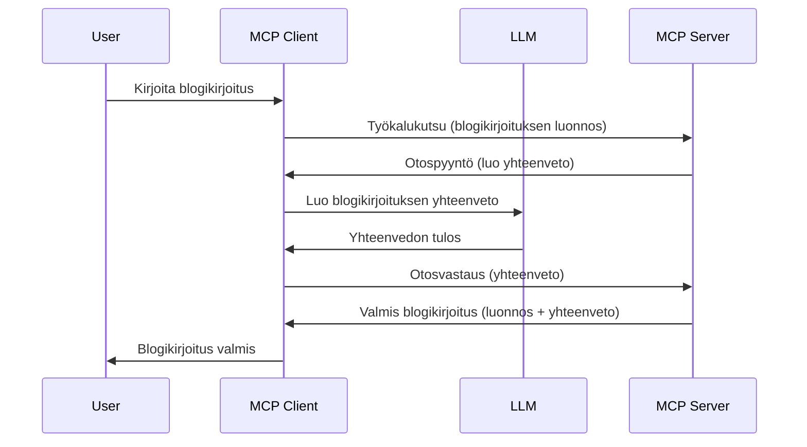

# Näytteenotto - delegoi ominaisuudet asiakkaalle

> **Vanhentumisilmoitus:** `2026-07-28` MCP-spesifikaation julkaisuversio merkitsee Näytteenoton vanhentuneeksi LLM-tarjoajien API:en suoran integraation hyväksi. Näytteenotto toimii edelleen versiossa `2025-11-25` ja vähintään vuoden ajan virallisen vanhentamisen jälkeen, joten kaikki tässä oppitunnissa on edelleen pätevää — mutta uusien palvelinsuunnittelujen tulee arvioida korvaavaa mallia. Katso lisää: [Mitä MCP:ssä muuttuu: 2026-07-28 julkaisuehdokas](../../01-CoreConcepts/mcp-2026-07-28-release-candidate.md).

Joskus MCP-asiakas ja MCP-palvelin tarvitsevat yhteistyötä yhteisen tavoitteen saavuttamiseksi. Saatat olla tilanteessa, jossa palvelin tarvitsee apua asiakkaalla sijaitsevasta LLM:stä. Tässä tilanteessa näytteenotto on se mitä sinun tulee käyttää.

Tutkitaanpa joitakin käyttötapauksia ja miten rakentaa ratkaisua, jossa näytteenotto on osa prosessia.

## Yleiskatsaus

Tässä oppitunnissa keskitymme selittämään, milloin ja missä näytteenottoa käytetään sekä miten se konfiguroidaan.

## Oppimistavoitteet

Tässä luvussa:

- Selitämme mitä näytteenotto on ja milloin sitä käytetään.
- Näytämme miten näytteenotto konfiguroidaan MCP:ssä.
- Tarjoamme esimerkkejä näytteenotosta käytännössä.

## Mitä näytteenotto on ja miksi sitä käyttää?

Näytteenotto on edistynyt ominaisuus, joka toimii seuraavasti:



### Näytteenottopyyntö

Ok, nyt kun meillä on yleiskuva uskottavasta skenaariosta, puhutaan palvelimen asiakkaalle lähettämästä näytteenottopyynnöstä. Tässä esimerkki pyynnöstä JSON-RPC-muodossa:

```json
{
  "jsonrpc": "2.0",
  "id": 1,
  "method": "sampling/createMessage",
  "params": {
    "messages": [
      {
        "role": "user",
        "content": {
          "type": "text",
          "text": "Create a blog post summary of the following blog post: <BLOG POST>"
        }
      }
    ],
    "modelPreferences": {
      "hints": [
        {
          "name": "claude-3-sonnet"
        }
      ],
      "intelligencePriority": 0.8,
      "speedPriority": 0.5
    },
    "systemPrompt": "You are a helpful assistant.",
    "maxTokens": 100
  }
}
```

Tässä on muutama huomionarvoinen seikka:

- Kehote, content -> text -kohdassa, on kehote, joka toimii ohjeena LLM:lle tiivistää blogikirjoituksen sisältö.

- **modelPreferences**. Tämä osio on juuri sitä, mieltymys, suositus siitä, mitä konfiguraatiota LLM:n kanssa pitäisi käyttää. Käyttäjä voi valita, noudattaako näitä suosituksia vai muuttaa niitä. Tässä tapauksessa suositellaan mallia, nopeutta ja älykkyyden tärkeysjärjestystä.
- **systemPrompt**, tämä on normaali järjestelmäkehote, joka antaa LLM:lle persoonallisuuden ja sisältää ohjaavia ohjeita.
- **maxTokens**, tämä on toinen ominaisuus, joka määrittää, kuinka monta tokenia suositellaan käytettäväksi tässä tehtävässä.

### Näytteenottovastaus

Tämä vastaus on mitä MCP-asiakas lopulta lähettää takaisin MCP-palvelimelle, tulos asiakkaan LLM:lle tekemästä kutsusta, odottaa vastausta ja rakentaa tämän viestin. Tässä miltä se voi näyttää JSON-RPC-muodossa:

```json
{
  "jsonrpc": "2.0",
  "id": 1,
  "result": {
    "role": "assistant",
    "content": {
      "type": "text",
      "text": "Here's your abstract <ABSTRACT>"
    },
    "model": "gpt-5",
    "stopReason": "endTurn"
  }
}
```

Huomaa, että vastaus on blogikirjoituksen tiivistelmä juuri niin kuin pyysimme. Huomaa myös, että käytetty `model` ei ole se, mitä pyysimme vaan "gpt-5" "claude-3-sonnet" sijaan. Tämä havainnollistaa, että käyttäjä voi muuttaa mielensä käytettävästä mallista, ja että näytteenottopyyntösi on suositus.

Ok, nyt kun ymmärrämme pääprosessin sekä hyödyllisen tehtävän "blogikirjoituksen luominen + tiivistelmä", katsotaan mitä meidän tulee tehdä saadaksemme se toimimaan.

### Viestityypit

Näytteenottoviestit eivät ole sidottuja pelkkään tekstiin vaan voit lähettää myös kuvia ja ääntä. Tässä miten JSON-RPC eroaa:

**Teksti**

```json
{
  "type": "text",
  "text": "The message content"
}
```

**Kuvasisältö**

```json
{
  "type": "image",
  "data": "base64-encoded-image-data",
  "mimeType": "image/jpeg"
}
```

**Äänisisältö**

```json
{
  "type": "audio",
  "data": "base64-encoded-audio-data",
  "mimeType": "audio/wav"
}
```

> HUOM: lisätietoja Näytteenotosta löytyy [virallisista dokumenteista](https://modelcontextprotocol.io/specification/2025-11-25/client/sampling)

## Näytteenoton konfigurointi asiakkaassa

> Huom: jos rakennat vain palvelinta, sinun ei tarvitse tehdä paljon tässä.

Asiakkaassa sinun tulee määritellä seuraava ominaisuus näin:

```json
{
  "capabilities": {
    "sampling": {}
  }
}
```

Tämä otetaan käyttöön, kun valittu asiakas alustetaan palvelimen kanssa.

## Esimerkki näytteenotosta käytännössä – Luo blogikirjoitus

Koodataan näytteenottopalvelin yhdessä, meidän tulee tehdä seuraavat:

1. Luo työkalu palvelimelle.
2. Työkalun tulee luoda näytteenottopyyntö.
3. Työkalun tulee odottaa asiakkaan vastausta tähän pyyntöön.
4. Työkalun tulos sitten tuotetaan.

Katsotaan koodi vaihe vaiheelta:

### -1- Luo työkalu

**python**

```python
@mcp.tool()
async def create_blog(title: str, content: str, ctx: Context[ServerSession, None]) -> str:
    """Create a blog post and generate a summary"""

```

### -2- Luo näytteenottopyyntö

Laajenna työkalua seuraavalla koodilla:

**python**

```python
post = BlogPost(
        id=len(posts) + 1,
        title=title,
        content=content,
        abstract=""
    )

prompt = f"Create an abstract of the following blog post: title: {title} and draft: {content} "

result = await ctx.session.create_message(
        messages=[
            SamplingMessage(
                role="user",
                content=TextContent(type="text", text=prompt),
            )
        ],
        max_tokens=100,
)

```

### -3- Odota vastausta ja palauta vastaus

**python**

```python
post.abstract = result.content.text

posts.append(post)

# palauta valmis tuote
return json.dumps({
    "id": post.title,
    "abstract": post.abstract
})
```

### -4- Koko koodi

**python**

```python
from starlette.applications import Starlette
from starlette.routing import Mount, Host

from mcp.server.fastmcp import Context, FastMCP

from mcp.server.session import ServerSession
from mcp.types import SamplingMessage, TextContent

import json


from uuid import uuid4
from typing import List
from pydantic import BaseModel


mcp = FastMCP("Blog post generator")

# app = FastAPI()

posts = []

class BlogPost(BaseModel):
    id: int
    title: str
    content: str
    abstract: str

posts: List[BlogPost] = []

@mcp.tool()
async def create_blog(title: str, content: str, ctx: Context[ServerSession, None]) -> str:
    """Create a blog post and generate a summary"""

    post = BlogPost(
        id=len(posts) + 1,
        title=title,
        content=content,
        abstract=""
    )

    prompt = f"Create an abstract of the following blog post: title: {title} and draft: {content} "

    result = await ctx.session.create_message(
        messages=[
            SamplingMessage(
                role="user",
                content=TextContent(type="text", text=prompt),
            )
        ],
        max_tokens=100,
    )

    post.abstract = result.content.text

    posts.append(post)

    # palauttaa koko blogikirjoituksen
    return json.dumps({
        "id": post.title,
        "abstract": post.abstract
    })

if __name__ == "__main__":
    print("Starting server...")
    # mcp.run()
    mcp.run(transport="streamable-http")

# käynnistä sovellus komennolla: python server.py
```

### -5- Testaus Visual Studio Codessa

Testataksesi tätä Visual Studio Codessa, tee seuraavasti:

1. Käynnistä palvelin terminaalissa
2. Lisää se *mcp.json*-tiedostoon (ja varmista että se on käynnissä) esimerkiksi näin:

   ```json
   "servers": {
      "blog-server": {
        "type": "http",
        "url": "http://localhost:8000/mcp"
      }
   }
   ```

3. Kirjoita kehote:

   ```text
   create a blog post named "Where Python comes from", the content is "Python is actually named after Monty Python Flying Circus"
   ```

4. Anna näytteenoton tapahtua. Ensimmäisellä kerralla kun testaat tätä, sinulta pyydetään hyväksymään lisäikkuna, sitten näet normaalin kehotteen suorittaa työkalu

5. Tarkastele tuloksia. Näet tulokset kauniisti renderöityinä GitHub Copilot Chatissa mutta voit myös tarkastella raakaa JSON-vastausta.

**Bonus**. Visual Studio Code -työkalut tukevat hyvin näytteenottoa. Voit konfiguroida näytteenoton käyttöoikeuksia asennetulle palvelimelle näin:

1. Mene laajennukset-osioon.
2. Valitse hammasratasikoni asennetun palvelimen vierestä "MCP SERVERS - INSTALLED" osiossa.
3. Valitse "Configure Model Access", tässä voit valita mitkä mallit GitHub Copilot saa käyttää näytteenoton aikana. Näet myös kaikki viimeaikaiset näytteenottopyynnöt valitsemalla "Show Sampling requests".

## Tehtävä

Tässä tehtävässä rakennat hiukan erilaista Näytteenotto-integraatiota, joka tukee tuotekuvauksen luomista. Tässä skenaario:

**Skenaario**: Verkkokaupan back office -työntekijä tarvitsee apua, tuotekuvausten laatiminen vie liikaa aikaa. Sinun tulee siis rakentaa ratkaisu, jossa voit kutsua työkalua "create_product" argumenteilla "title" ja "keywords" ja sen tulee tuottaa täydellinen tuote, mukaan lukien "description"-kenttä, joka täytetään asiakkaan LLM:n avulla.

VINKKI: käytä aikaisemmin oppimaasi rakentaaksesi tämä palvelin ja sen työkalu käyttäen näytteenottopyyntöä.

## Ratkaisu

[Ratkaisu](./solution/README.md)

## Tärkeimmät opit

Näytteenotto on tehokas ominaisuus, joka antaa palvelimelle mahdollisuuden delegoida tehtäviä asiakkaalle silloin, kun se tarvitsee LLM:n apua.

## Seuraavaksi

- [Luku 4 - Käytännön toteutus](../../04-PracticalImplementation/README.md)

---

<!-- CO-OP TRANSLATOR DISCLAIMER START -->
**Vastuuvapauslauseke**:
Tämä asiakirja on käännetty käyttämällä tekoälypohjaista käännöspalvelua [Co-op Translator](https://github.com/Azure/co-op-translator). Vaikka pyrimme tarkkuuteen, otathan huomioon, että automaattiset käännökset saattavat sisältää virheitä tai epätarkkuuksia. Alkuperäinen asiakirja sen alkuperäiskielellä on virallinen lähde. Tärkeissä asioissa suositellaan ammattimaista ihmiskäännöstä. Emme ole vastuussa tämän käännöksen käytöstä aiheutuvista väärinymmärryksistä tai tulkinnoista.
<!-- CO-OP TRANSLATOR DISCLAIMER END -->