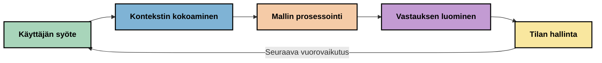
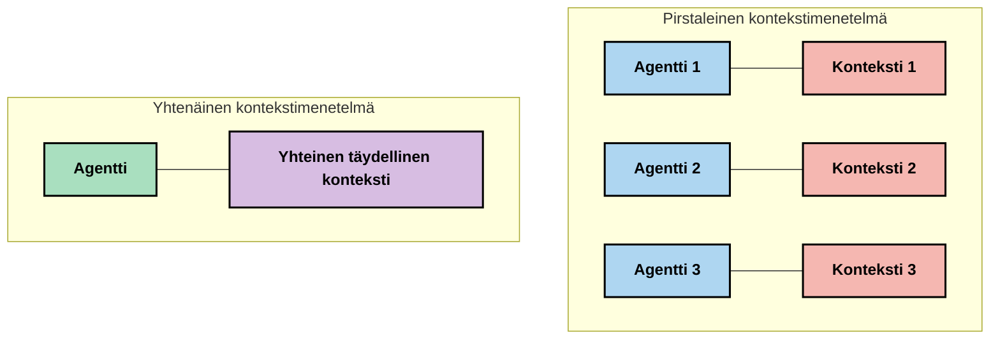
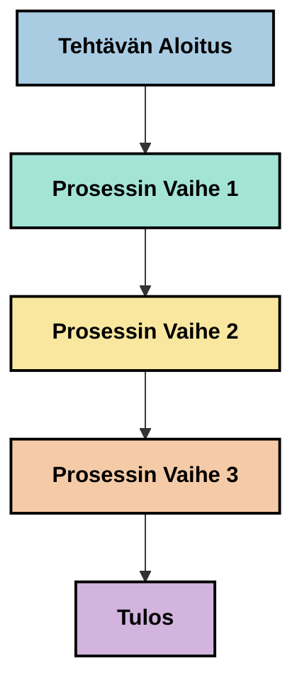
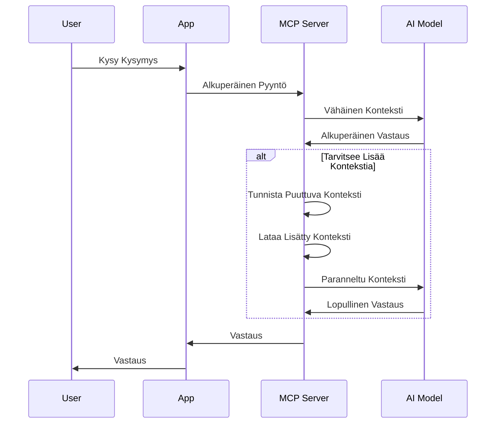
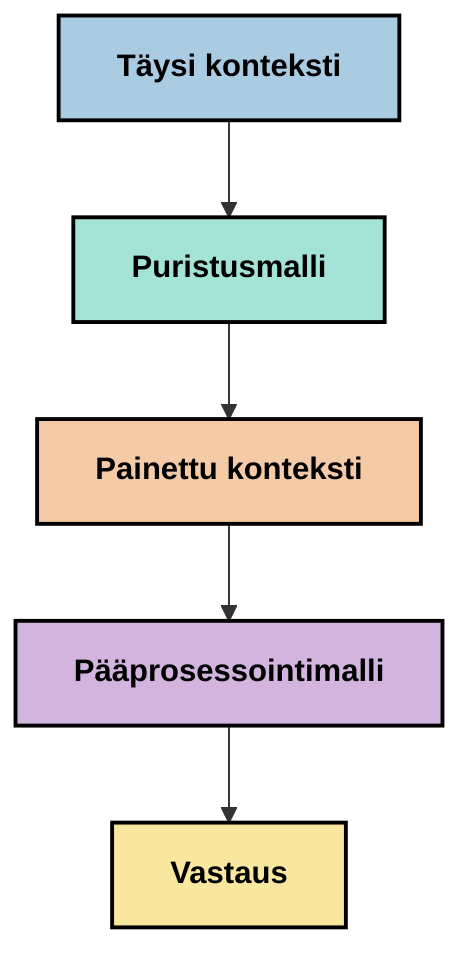
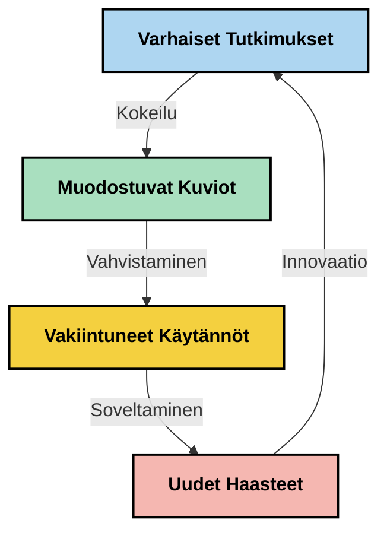

# Kontekstisuunnittelu: Nouseva käsite MCP-ekosysteemissä

## Yleiskatsaus

Kontekstisuunnittelu on nouseva käsite tekoälyn alalla, joka tutkii, miten tieto jäsennetään, välitetään ja ylläpidetään asiakas- ja tekoälypalvelujen vuorovaikutusten aikana. Mallikonstekstiprotokollan (MCP) ekosysteemin kehittyessä on yhä tärkeämpää ymmärtää, miten kontekstia hallitaan tehokkaasti. Tämä moduuli esittelee kontekstisuunnittelun käsitteen ja tutkii sen mahdollisia sovelluksia MCP-toteutuksissa.

## Oppimistavoitteet

Tämän moduulin lopuksi osaat:

- Ymmärtää kontekstisuunnittelun nousevan käsitteen ja sen mahdollisen roolin MCP-sovelluksissa
- Tunnistaa keskeiset haasteet kontekstinhallinnassa, joihin MCP-protokollan suunnittelu vastaa
- Tutkia tekniikoita mallin suorituskyvyn parantamiseksi paremman kontekstinhallinnan avulla
- Pohtia lähestymistapoja kontekstin tehokkuuden mittaamiseen ja arviointiin
- Soveltaa näitä nousevia käsitteitä parantaaksesi tekoälykokemuksia MCP-kehyksen avulla

## Johdatus kontekstisuunnitteluun

Kontekstisuunnittelu on nouseva käsite, joka keskittyy tieto- ja informaatiovirran tarkoitukselliseen suunnitteluun ja hallintaan käyttäjien, sovellusten ja tekoälymallien välillä. Toisin kuin vakiintuneet alat, kuten kehotteen suunnittelu, kontekstisuunnittelu on vielä käytännön toimijoiden määriteltävissä heidän pyrkiessään ratkaisemaan ainutlaatuisia haasteita tarjota tekoälymalleille oikeaa tietoa oikeaan aikaan.

Suuriin kielimalleihin (LLM) kehittyessä kontekstin merkitys on tullut yhä ilmeisemmäksi. Kontekstin laatu, relevanssi ja rakenne vaikuttavat suoraan mallin tuottamiin vastauksiin. Kontekstisuunnittelu tutkii tätä suhdetta ja pyrkii kehittämään periaatteita tehokkaaseen kontekstinhallintaan.

> "Vuonna 2025 mallimme ovat uskomattoman älykkäitä. Mutta edes älykkäin ihminen ei pystyisi tekemään työtään tehokkaasti ilman sitä kontekstia, mitä heille pyydetään tekemään... 'Kontekstisuunnittelu' on seuraava taso kehotteiden suunnittelussa. Se tarkoittaa tämän tekemistä automaattisesti dynaamisessa järjestelmässä." — Walden Yan, Cognition AI

Kontekstisuunnittelu saattaa käsittää:

1. **Kontekstin valinta**: Määrittää, mikä tieto on olennaista tietylle tehtävälle
2. **Kontekstin jäsentely**: Jäsentää tieto mallin ymmärryksen maksimoimiseksi
3. **Kontekstin välitys**: Optimoida, miten ja milloin tieto toimitetaan malleille
4. **Kontekstin ylläpito**: Hallita kontekstin tilaa ja kehitystä ajan myötä
5. **Kontekstin arviointi**: Mitata ja parantaa kontekstin tehokkuutta

Nämä painopistealueet ovat erityisen merkityksellisiä MCP-ekosysteemille, joka tarjoaa standardoidun tavan sovelluksille toimittaa kontekstia LLM-malleille.


## Kontekstimatkan näkökulma

Yksi tapa visualisoida kontekstisuunnittelua on jäljittää tiedon kulkua MCP-järjestelmän läpi:



### Keskeiset vaiheet kontekstimatkassa:

1. **Käyttäjän syöte**: Raaka tieto käyttäjältä (teksti, kuvat, dokumentit)
2. **Kontekstin kokoaminen**: Käyttäjän syötteen yhdistäminen järjestelmän kontekstiin, keskusteluhistoriaan ja muuhun haettuun tietoon
3. **Mallin käsittely**: Tekoälymalli käsittelee kokoamisen tuloksena olevan kontekstin
4. **Vastauksen luonti**: Malli tuottaa vastauksen annetun kontekstin perusteella
5. **Tilanhallinta**: Järjestelmä päivittää sisäisen tilansa vuorovaikutuksen perusteella

Tämä näkökulma korostaa kontekstin dynaamista luonnetta tekoälyjärjestelmissä ja nostaa esiin tärkeitä kysymyksiä siitä, miten tietoa kannattaa parhaiten hallita kussakin vaiheessa.

## Nousevia periaatteita kontekstisuunnittelussa

Kontekstisuunnittelun ala muotoutuu, ja joitakin varhaisia periaatteita on alettu tunnistaa käytännön toimijoilta. Näiden periaatteiden uskotaan auttavan MCP-toteutusten suunnittelussa:

### Periaate 1: Jaa konteksti kokonaisuudessaan

Konteksti tulisi jakaa kokonaisuudessaan kaikkien järjestelmän osien kesken sen sijaan, että se olisi pirstaloitunut useisiin agenteihin tai prosesseihin. Kun konteksti on jakautunut, eri osissa tehtävät päätökset saattavat olla ristiriitaisia.



MCP-sovelluksissa tämä viittaa siihen, että järjestelmä suunnitellaan niin, että konteksti virtaa saumattomasti koko putken läpi eikä ole erillään.

### Periaate 2: Tunnista, että toimet sisältävät implisiittisiä päätöksiä

Jokainen mallin suorittama toiminto sisältää implisiittisiä päätöksiä siitä, miten kontekstia tulkitaan. Kun useat komponentit toimivat eri kontekstien perusteella, nämä implisiittiset päätökset voivat konfliktin seurauksena johtaa epäjohdonmukaisiin lopputuloksiin.

Tämä periaate vaikuttaa merkittävästi MCP-sovelluksiin:
- Suosi lineaarista prosessointia monimutkaisissa tehtävissä fragmentoidun rinnakkaisen käsittelyn sijaan
- Varmista, että kaikkien päätöspisteiden käytettävissä on sama kontekstitieto
- Suunnittele järjestelmät siten, että myöhemmät vaiheet näkevät aikaisempien päätösten kokonaiskontekstin

### Periaate 3: Tasapainota kontekstin syvyys ikkunarajoitteiden kanssa

Keskustelujen ja prosessien pidentyessä konteksti-ikkunat lopulta ylittyvät. Tehokas kontekstisuunnittelu tutkii tapoja hallita jännitettä kattavan kontekstin ja teknisten rajoitusten välillä.

Mahdollisia lähestymistapoja ovat:
- Kontekstin puristus, joka säilyttää oleellisen tiedon vähentäen tokenien käyttöä
- Kontekstin asteittainen lataus nykyisiin tarpeisiin perustuen
- Aikaisempien vuorovaikutusten tiivistäminen säilyttäen keskeiset päätökset ja faktat

## Kontekstin haasteet ja MCP-protokollan suunnittelu

Mallikonstekstiprotokolla (MCP) on suunniteltu ottaen huomioon ainutlaatuiset kontekstinhallinnan haasteet. Näiden haasteiden ymmärtäminen auttaa selittämään MCP-protokollan suunnittelun keskeisiä piirteitä:


### Haaste 1: Kontekstin ikkunarajoitukset
Useimmilla tekoälymalleilla on kiinteä kontekstin ikkunan koko, joka rajoittaa käsiteltävän tiedon määrää kerralla.

**MCP:n suunnitteluvastaus:** 
- Protokolla tukee jäsenneltyä resurssipohjaista kontekstia, johon voidaan viitata tehokkaasti
- Resurssit voidaan paginoida ja ladata vaiheittain

### Haaste 2: Relevanssin määrittäminen
On vaikea määrittää, mikä tieto on merkityksellistä sisällytettäväksi kontekstiin.

**MCP:n suunnitteluvastaus:**
- Joustavat työkalut mahdollistavat tiedon dynaamisen hakemisen tarpeen perusteella
- Jäsennellyt kehotteet tuovat johdonmukaisuutta kontekstin järjestelyyn

### Haaste 3: Kontekstin pysyvyys
Tilaa on hallittava vuorovaikutusten yli huolellisesti.

**MCP:n suunnitteluvastaus:**
- Standardoitu istunnonhallinta
- Selkeästi määritellyt vuorovaikutusmallit kontekstin kehittymiselle

### Haaste 4: Monimodaalinen konteksti
Erilaiset tietotyypit (teksti, kuvat, jäsennelty data) vaativat erilaista käsittelyä.

**MCP:n suunnitteluvastaus:**
- Protokolla tukee erilaisia sisältötyyppejä
- Standardoitu monimodaalisen tiedon esitystapa

### Haaste 5: Turvallisuus ja tietosuoja
Konteksti sisältää usein arkaluonteista tietoa, joka pitää suojata.

**MCP:n suunnitteluvastaus:**
- Selkeät vastuunrajat asiakkaan ja palvelimen välillä
- Paikalliset käsittelyvaihtoehdot datan altistuksen minimoimiseksi

Näiden haasteiden ymmärtäminen ja MCP:n vastaus niihin muodostaa perustan kehittyneempien kontekstisuunnittelutekniikoiden tutkimiselle.

## Nousevia lähestymistapoja kontekstisuunnittelussa

Kontekstisuunnittelun alalla kehitetään useita lupaavia lähestymistapoja. Ne edustavat nykyistä ajattelua eivätkä vakiintuneita parhaita käytäntöjä, ja ne kehittynevät todennäköisesti kokemuksen karttuessa MCP-toteutuksissa.

### 1. Yksisäikeinen lineaarinen prosessointi

Moniagenttijärjestelmien rinnalle joissakin tapauksissa yksisäikeinen lineaarinen prosessointi tuottaa johdonmukaisempia tuloksia. Tämä vastaa periaatetta yhtenäisen kontekstin ylläpitämisestä.



Vaikka tämä lähestymistapa saattaa vaikuttaa vähemmän tehokkaalta kuin rinnakkainen prosessointi, se usein tuottaa eheämpiä ja luotettavampia tuloksia, sillä kukin vaihe rakentuu täydellisen ymmärryksen varaan aiemmista päätöksistä.

### 2. Kontekstin pilkkominen ja priorisointi

Jakamalla laajat kontekstit hallittaviin osiin ja priorisoimalla tärkeimmät osat.

```python
# Konseptuaalinen esimerkki: Kontekstin pilkkominen ja priorisointi
def process_with_chunked_context(documents, query):
    # 1. Pilko asiakirjat pienempiin osiin
    chunks = chunk_documents(documents)
    
    # 2. Laske relevanssipisteet jokaiselle osalle
    scored_chunks = [(chunk, calculate_relevance(chunk, query)) for chunk in chunks]
    
    # 3. Lajittele osat relevanssipisteiden mukaan
    sorted_chunks = sorted(scored_chunks, key=lambda x: x[1], reverse=True)
    
    # 4. Käytä merkityksellisimpiä osia kontekstina
    context = create_context_from_chunks([chunk for chunk, score in sorted_chunks[:5]])
    
    # 5. Käsittele priorisoidulla kontekstilla
    return generate_response(context, query)
```

Yllä oleva käsite havainnollistaa, kuinka suuria dokumentteja voidaan pilkkoa hallittaviin osiin ja valita niistä vain olennaisimmat kontekstiksi. Tämä lähestymistapa auttaa toimimaan konteksti-ikkunan rajoissa mutta hyödyntämään suuria tietokantoja.

### 3. Kontekstin asteittainen lataus

Ladataan konteksti tarpeen mukaan vaiheittain kerralla koko massan sijaan.



Asteittainen lataus aloittaa minimaalista kontekstista ja laajentaa sitä vain tarpeen vaatiessa. Tämä voi merkittävästi vähentää tokenien käyttöä yksinkertaisissa kyselyissä mahdollistaen samalla monimutkaisten kysymysten käsittelyn.

### 4. Kontekstin puristus ja tiivistys

Pienennetään kontekstin kokoa säilyttäen oleellinen tieto.



Kontekstin puristus keskittyy:
- Redundantin tiedon poistamiseen
- Pitkän sisällön tiivistämiseen
- Keskeisten faktojen ja yksityiskohtien poimimiseen
- Tärkeiden kontekstielementtien säilyttämiseen
- Tokenien tehokkaan käytön optimointiin

Tämä lähestymistapa on erityisen arvokas pitkien keskustelujen ylläpitämiseen konteksti-ikkunoissa tai suurten dokumenttien tehokkaaseen käsittelyyn. Jotkut toimijat käyttävät erityisiä malleja juuri kontekstin puristukseen ja keskusteluhistorian tiivistämiseen.


## Tutkivia näkökulmia kontekstisuunnittelussa

Kontekstisuunnittelun kenttää tutkiessa on hyvä pitää mielessä useita seikkoja MCP-toteutusten yhteydessä. Nämä eivät ole opastavia parhaita käytäntöjä, vaan tutkimisen arvoisia alueita, jotka voivat tuottaa parannuksia juuri sinun käyttötapauksessasi.

### Pohdi kontekstitavoitteitasi

Ennen monimutkaisten kontekstinhallintaratkaisujen käyttöönottoa määrittele selkeästi tavoitteesi:
- Mitä tietoa malli tarvitsee ollakseen menestyksekäs?
- Mikä tieto on olennaista ja mikä täydentävää?
- Mitkä ovat suorituskykyrajoitteet (viive, token-rajoitukset, kustannukset)?

### Tutki kerrostettua kontekstia

Joillain toimijoilla on menestystä kontekstin jäsentämisessä käsitteellisiin kerroksiin:
- **Ydinkerros**: Mallin aina tarvitsemat olennaiset tiedot
- **Tilannekerros**: Tähänhetkiseen vuorovaikutukseen liittyvä konteksti
- **Tukikerros**: Lisätieto, joka voi olla hyödyllistä
- **Varakerros**: Tieto, johon palataan vain tarvittaessa

### Tutki hakustrategioita

Kontekstin tehokkuus riippuu usein tiedon hakutavasta:
- Semanttinen haku ja upotukset olennaisen tiedon löytämiseksi
- Avainsanapohjainen haku tiettyjen faktojen löytämiseen
- Hybridimenetelmät, jotka yhdistävät useita hakuja
- Metadatan suodatus rajatakseen hakua kategorioiden, päivämäärien tai lähteiden perusteella

### Kokeile kontekstin eheyttä

Kontekstin rakenne ja virtaus vaikuttavat mallin ymmärrykseen:
- Ryhmittele liittyvä tieto yhteen
- Käytä johdonmukaista muotoilua ja järjestelyä
- Säilytä looginen tai aikajärjestys tilanteen mukaan
- Vältä ristiriitaista tietoa

### Arvioi monien agenttien arkkitehtuurien kompromisseja

Vaikka moniagenttijärjestelmät ovat suosittuja monissa tekoälykehyksissä, ne tuovat merkittäviä haasteita kontekstinhallinnalle:
- Kontekstin pirstoutuminen voi johtaa ristiriitaisiin päätöksiin agenttien välillä
- Rinnakkainen käsittely voi aiheuttaa vaikeasti sovitettavia konflikteja
- Agenttien välinen viestinnän kuormitus voi syödä suorituskykyetuja
- Kattava tilanhallinta vaaditaan eheyden ylläpitämiseksi

Usein yhden agentin lähestymistapa, jolla on kattava kontekstinhallinta, tuottaa luotettavampia tuloksia kuin useat erikoistuneet agentit fragmentoidulla kontekstilla.

### Kehitä arviointimenetelmiä

Parantaaksesi kontekstisuunnittelua ajan mittaan, mieti miten mittaat menestystäsi:
- A/B-testaus erilaisilla konksyon rakenteilla
- Seuraa tokenien käyttöä ja vasteaikoja
- Seuraa käyttäjien tyytyväisyyttä ja tehtävien valmistumisastetta
- Analysoi, milloin ja miksi kontekstistrategiat epäonnistuvat

Nämä näkökulmat edustavat aktiivista tutkimusaluetta kontekstisuunnittelussa. Alan kypsyessä todennäköisesti ilmenee selkeämpiä kaavoja ja käytäntöjä.

## Kontekstin tehokkuuden mittaaminen: kehittyvä kehys

Kontekstisuunnittelun noustessa käsitteeksi on alettu tutkia, miten sen tehokkuutta voitaisiin mitata. Vakiintunutta kehystä ei vielä ole, mutta useita mittareita pohditaan, jotka voisivat ohjata tulevaa työtä.

### Mahdollisia mittausulottuvuuksia


#### 1. Syötteen tehokkuus

- **Kontekstin ja vastauksen suhde**: Kuinka paljon kontekstia tarvitaan suhteessa vasteen kokoon?
- **Tokenien hyödyntäminen**: Kuinka suuri osa annetusta kontekstin tokeneista vaikuttaa vastaukseen?
- **Kontekstin pienentäminen**: Kuinka tehokkaasti voimme puristaa raakainformaatiota?

#### 2. Suorituskykytekijät

- **Viivevaikutus**: Miten kontekstinhallinta vaikuttaa vasteaikaan?
- **Tokenien talous**: Optimoimmeko tokenien käyttöä tehokkaasti?
- **Haun tarkkuus**: Kuinka relevanttia haettu tieto on?
- **Resurssien käyttö**: Mitä laskentaresursseja tarvitaan?

#### 3. Laatuun liittyvät tekijät

- **Vasteen relevanssi**: Kuinka hyvin vastaus vastaa kyselyä?
- **Faktatarkkuus**: Parantaako kontekstinhallinta faktojen oikeellisuutta?
- **Johdonmukaisuus**: Ovatko vastaukset johdonmukaisia samanlaisiin kyselyihin?
- **Harhojen määrä**: Vähentääkö parempi konteksti mallin harhoja?

#### 4. Käyttäjäkokemus

- **Seurantakyselyjen määrä**: Kuinka usein käyttäjät tarvitsevat täsmennystä?
- **Tehtävien suorittaminen**: Saavuttaako käyttäjä tavoitteensa?
- **Tyytyväisyysmittarit**: Miten käyttäjät arvioivat kokemustaan?

### Tutkivat mittausmenetelmät

Kokeillessasi kontekstisuunnittelua MCP-toteutuksissa harkitse seuraavia menetelmiä:

1. **Vertailut perustasoihin**: Määritä perustaso yksinkertaisilla kontekstimenetelmillä ennen edistyneempien kokeilua

2. **Askeltavat muutokset**: Muuta yhtä kontekstinhallinnan osa-aluetta kerrallaan vaikutusten erottamiseksi

3. **Käyttäjäkeskeinen arviointi**: Yhdistä määrälliset mittarit laadulliseen käyttäjäpalautteeseen

4. **Epäonnistumisanalyysi**: Tarkastele tilanteita, joissa kontekstistrategiat epäonnistuvat parannusmahdollisuuksien löytämiseksi

5. **Moniulotteinen arviointi**: Tasapainota tehokkuus, laatu ja käyttökokemus

Tämä kokeellinen, monipuolinen mittaustapa tukee kontekstisuunnittelun kehittyvää luonnetta.

## Lopuksi

Kontekstisuunnittelu on nouseva tutkimusalue, joka saattaa olla keskeinen tehokkaissa MCP-sovelluksissa. Huolellisesti tarkastelemalla, miten tieto virtaa järjestelmässäsi, voit mahdollisesti luoda tekoälykokemuksia, jotka ovat tehokkaampia, tarkempia ja arvokkaampia käyttäjille.

Tässä moduulissa esitellyt tekniikat ja lähestymistavat edustavat alan varhaista ajattelua eivätkä vakiintuneita käytäntöjä. Kontekstisuunnittelun odotetaan kehittyvän selkeämmin määritellyksi alueeksi tekoälyn kehittyessä ja ymmärryksen syventyessä. Toistaiseksi kokeilu ja huolellinen mittaaminen vaikuttavat olevan tuottavimmat menetelmät.

## Mahdolliset tulevat suuntaukset

Kontekstisuunnittelun ala on vielä alkuvaiheessa, mutta useita lupaavia suuntia on jo nähtävissä:

- Kontekstisuunnittelun periaatteet voivat vaikuttaa merkittävästi mallin suorituskykyyn, tehokkuuteen, käyttäjäkokemukseen ja luotettavuuteen
- Yksisäikeiset lähestymistavat, joissa on kattava kontekstinhallinta, saattavat voittaa moniagenttijärjestelmät monissa käyttötapauksissa
- Erikoistuneet kontekstin puristusmallit voivat tulla standardikomponenteiksi tekoälyputkissa
- Jännite kontekstin täydellisyyden ja token-rajoitusten välillä tulee todennäköisesti ohjaamaan innovointia kontekstinkäsittelyssä
- Kun mallien kyvyt tehokkaaseen ihmismäiseen viestintään kehittyvät, aito moniagenttiyhteistyö voi tulla entistä toteutettavammaksi
- MCP-toteutukset voivat kehittyä vakioimaan kontekstinhallinnan mallit, jotka noussevat nykyisistä kokeiluista



## Resurssit

### Viralliset MCP-resurssit
- [Model Context Protocol Website](https://modelcontextprotocol.io/)
- [Model Context Protocol Specification](https://github.com/modelcontextprotocol/modelcontextprotocol)
- [MCP Dokumentaatio](https://modelcontextprotocol.io/docs)
- [MCP C# SDK](https://github.com/modelcontextprotocol/csharp-sdk)
- [MCP Python SDK](https://github.com/modelcontextprotocol/python-sdk)
- [MCP TypeScript SDK](https://github.com/modelcontextprotocol/typescript-sdk)
- [MCP Inspector](https://github.com/modelcontextprotocol/inspector) - Visuaalinen testausväline MCP-palvelimille

### Kontekstitekniikan Artikkelit
- [Älä rakenna moniagentteja: Kontekstitekniikan periaatteet](https://cognition.ai/blog/dont-build-multi-agents) - Walden Yanin näkemyksiä kontekstitekniikan periaatteista
- [Käytännön opas agenttien rakentamiseen](https://cdn.openai.com/business-guides-and-resources/a-practical-guide-to-building-agents.pdf) - OpenAI:n opas tehokkaaseen agenttisuunnitteluun
- [Tehokkaiden agenttien rakentaminen](https://www.anthropic.com/engineering/building-effective-agents) - Anthropicin lähestymistapa agenttien kehitykseen

### Aiheeseen Liittyvä Tutkimus
- [Dynaaminen haun vahvistaminen suurissa kielimalleissa](https://arxiv.org/abs/2310.01487) - Tutkimusta dynaamisista hakumenetelmistä
- [Eksyksissä keskellä: Kuinka kielimallit käyttävät pitkiä konteksteja](https://arxiv.org/abs/2307.03172) - Tärkeä tutkimus kontekstin käsittelymalleista
- [Hierarkkinen tekstiin perustuva kuvagenerointi CLIP-latenteilla](https://arxiv.org/abs/2204.06125) - DALL-E 2 -artikkeli sisälsi näkemyksiä kontekstin jäsentämisestä
- [Kontekstin roolin tutkiminen suurissa kielimallien arkkitehtuureissa](https://aclanthology.org/2023.findings-emnlp.124/) - Viimeaikainen tutkimus kontekstin käsittelystä
- [Moniagenttiyhteistyö: Katsaus](https://arxiv.org/abs/2304.03442) - Tutkimus moniagenttijärjestelmistä ja niiden haasteista

### Lisäresurssit
- [Kontekstin ikkunan optimointitekniikat](https://learn.microsoft.com/en-us/azure/ai-services/openai/concepts/context-window)
- [Edistyneet RAG-tekniikat](https://www.microsoft.com/en-us/research/blog/retrieval-augmented-generation-rag-and-frontier-models/)
- [Semantic Kernel -dokumentaatio](https://github.com/microsoft/semantic-kernel)
- [AI-työkalut kontekstinhallintaan](https://github.com/microsoft/aitoolkit)

## Mitä seuraavaksi

- [5.15 MCP Custom Transport](../mcp-transport/README.md)

---

<!-- CO-OP TRANSLATOR DISCLAIMER START -->
**Vastuuvapauslauseke**:
Tämä asiakirja on käännetty käyttämällä tekoälypohjaista käännöspalvelua [Co-op Translator](https://github.com/Azure/co-op-translator). Vaikka pyrimme tarkkuuteen, otathan huomioon, että automaattiset käännökset saattavat sisältää virheitä tai epätarkkuuksia. Alkuperäinen asiakirja sen alkuperäiskielellä on virallinen lähde. Tärkeissä asioissa suositellaan ammattimaista ihmiskäännöstä. Emme ole vastuussa tämän käännöksen käytöstä aiheutuvista väärinymmärryksistä tai tulkinnoista.
<!-- CO-OP TRANSLATOR DISCLAIMER END -->