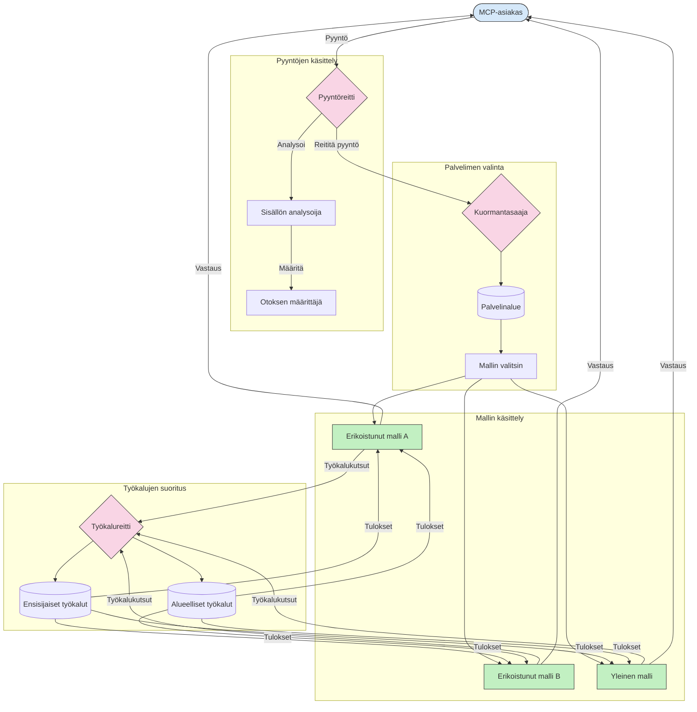

# Reititys mallikontekstiprotokollassa

Reititys on olennainen pyyntöjen ohjaamiseksi sopiville malleille, työkaluilla tai palveluille MCP-ekosysteemissä.

## Johdanto

Reititys Model Context Protocolissa (MCP) tarkoittaa pyyntöjen ohjaamista sopivimmille malleille tai palveluille eri kriteerien, kuten sisällön tyypin, käyttäjän kontekstin ja järjestelmän kuormituksen perusteella. Tämä takaa tehokkaan käsittelyn ja optimaalisen resurssien käytön.

## Oppimistavoitteet

Tämän oppitunnin jälkeen osaat:

- Ymmärtää reitityksen periaatteet MCP:ssä.
- Toteuttaa sisältöpohjaista reititystä pyyntöjen ohjaamiseksi erikoistuneille palveluille.
- Soveltaa älykkäitä kuormantasapainotusstrategioita resurssien optimointiin.
- Toteuttaa dynaamista työkalureititystä pyynnön kontekstin perusteella.

## Sisältöpohjainen reititys

Sisältöpohjainen reititys ohjaa pyynnöt erikoistuneisiin palveluihin pyynnön sisällön perusteella. Esimerkiksi koodigenerointiin liittyvät pyynnöt voidaan ohjata erikoistuneelle koodimallille, kun taas luovan kirjoittamisen pyynnöt voidaan lähettää luovalle kirjoitusmallille.

Tutkitaan esimerkkitoteutusta eri ohjelmointikielillä.

<details>
<summary>.NET</summary>

```csharp
// .NET Example: Content-based routing in MCP
public class ContentBasedRouter
{
    private readonly Dictionary<string, McpClient> _specializedClients;
    private readonly RoutingClassifier _classifier;
    
    public ContentBasedRouter()
    {
        // Initialize specialized clients for different domains
        _specializedClients = new Dictionary<string, McpClient>
        {
            ["code"] = new McpClient("https://code-specialized-mcp.com"),
            ["creative"] = new McpClient("https://creative-specialized-mcp.com"),
            ["scientific"] = new McpClient("https://scientific-specialized-mcp.com"),
            ["general"] = new McpClient("https://general-mcp.com")
        };
        
        // Initialize content classifier
        _classifier = new RoutingClassifier();
    }
    
    public async Task<McpResponse> RouteAndProcessAsync(string prompt, IDictionary<string, object> parameters = null)
    {
        // Classify the prompt to determine the best specialized service
        string category = await _classifier.ClassifyPromptAsync(prompt);
        
        // Get the appropriate client or fall back to general
        var client = _specializedClients.ContainsKey(category) 
            ? _specializedClients[category] 
            : _specializedClients["general"];
            
        Console.WriteLine($"Routing request to {category} specialized service");
        
        // Send request to the selected service
        return await client.SendPromptAsync(prompt, parameters);
    }
    
    // Simple classifier for routing decisions
    private class RoutingClassifier
    {
        public Task<string> ClassifyPromptAsync(string prompt)
        {
            prompt = prompt.ToLowerInvariant();
            
            if (prompt.Contains("code") || prompt.Contains("function") || 
                prompt.Contains("program") || prompt.Contains("algorithm"))
            {
                return Task.FromResult("code");
            }
            
            if (prompt.Contains("story") || prompt.Contains("creative") || 
                prompt.Contains("imagine") || prompt.Contains("design"))
            {
                return Task.FromResult("creative");
            }
            
            if (prompt.Contains("science") || prompt.Contains("research") || 
                prompt.Contains("analyze") || prompt.Contains("study"))
            {
                return Task.FromResult("scientific");
            }
            
            return Task.FromResult("general");
        }
    }
}
```

Edellisessä koodissa olemme:

- Luoneet `ContentBasedRouter`-luokan, joka ohjaa pyynnöt pyynnön sisällön perusteella.
- Alustaneet erikoistuneet asiakkaat eri aloille (koodi, luovuus, tiede, yleinen).
- Toteuttaneet yksinkertaisen luokittelijan, joka määrittää pyynnön kategorian ja ohjaa sen sopivalle erikoistuneelle palvelulle.
- Käyttäneet varajärjestelmää ohjaamaan pyynnöt yleiseen palveluun, jos erikoistunutta palvelua ei ole saatavilla.
- Toteuttaneet asynkronisen käsittelyn tehokkaaseen pyynnön käsittelyyn.
- Käyttäneet sanakirjaa, joka yhdistää sisältökategoriat erikoistuneisiin MCP-asiakkaisiin.
- Toteuttaneet yksinkertaisen luokittelijan, joka analysoi pyynnön ja palauttaa sopivan kategorian.
- Käyttäneet erikoistunutta asiakasta pyynnön lähettämiseksi ja vastauksen vastaanottamiseksi.
- Käsitelleet tilanteita, joissa pyyntö ei sovi mihinkään erikoistuneeseen kategoriaan ohjaamalla se yleiseen palveluun.

</details>

## Älykäs kuormantasapainotus

Kuormantasapainotus optimoi resurssien käytön ja varmistaa MCP-palvelujen korkean saatavuuden. Kuormantasapainotuksen toteutustapoja on monia, kuten round-robin, painotettu vasteaika tai sisältötietoinen strategia.

Tarkastellaan alla esimerkkiä, joka käyttää seuraavia strategioita:

- **Round Robin**: Jakaa pyynnöt tasaisesti käytettävissä olevien palvelimien kesken.
- **Painotettu vasteaika**: Ohjaa pyynnöt palvelimille niiden keskimääräisen vasteajan perusteella.
- **Sisältötietoinen**: Ohjaa pyynnöt erikoistuneille palvelimille pyynnön sisällön perusteella.

<details>
<summary>Java</summary>

```java
// Java-esimerkki: Älykäs kuormantasapainotus MCP-palvelimille
public class McpLoadBalancer {
    private final List<McpServerNode> serverNodes;
    private final LoadBalancingStrategy strategy;
    
    public McpLoadBalancer(List<McpServerNode> nodes, LoadBalancingStrategy strategy) {
        this.serverNodes = new ArrayList<>(nodes);
        this.strategy = strategy;
    }
    
    public McpResponse processRequest(McpRequest request) {
        // Valitse paras palvelin strategian perusteella
        McpServerNode selectedNode = strategy.selectNode(serverNodes, request);
        
        try {
            // Reititä pyyntö valitulle solmulle
            return selectedNode.processRequest(request);
        } catch (Exception e) {
            // Käsittele virhe - toteuta uudelleenyrittäminen tai varatoiminto
            System.err.println("Error processing request on node " + selectedNode.getId() + ": " + e.getMessage());
            
            // Merkitse solmu mahdollisesti epäterveeksi
            selectedNode.recordFailure();
            
            // Kokeile seuraavaa parasta solmua varatoimintona
            List<McpServerNode> remainingNodes = new ArrayList<>(serverNodes);
            remainingNodes.remove(selectedNode);
            
            if (!remainingNodes.isEmpty()) {
                McpServerNode fallbackNode = strategy.selectNode(remainingNodes, request);
                return fallbackNode.processRequest(request);
            } else {
                throw new RuntimeException("All MCP server nodes failed to process the request");
            }
        }
    }
    
    // Solmun terveyden tarkistustehtävä
    public void startHealthChecks(Duration interval) {
        ScheduledExecutorService scheduler = Executors.newScheduledThreadPool(1);
        scheduler.scheduleAtFixedRate(() -> {
            for (McpServerNode node : serverNodes) {
                try {
                    boolean isHealthy = node.checkHealth();
                    System.out.println("Node " + node.getId() + " health status: " + 
                                      (isHealthy ? "HEALTHY" : "UNHEALTHY"));
                } catch (Exception e) {
                    System.err.println("Health check failed for node " + node.getId());
                    node.setHealthy(false);
                }
            }
        }, 0, interval.toMillis(), TimeUnit.MILLISECONDS);
    }
    
    // Käyttöliittymä kuormantasapainotusstrategioille
    public interface LoadBalancingStrategy {
        McpServerNode selectNode(List<McpServerNode> nodes, McpRequest request);
    }
    
    // Pyörivä (round-robin) strategia
    public static class RoundRobinStrategy implements LoadBalancingStrategy {
        private AtomicInteger counter = new AtomicInteger(0);
        
        @Override
        public McpServerNode selectNode(List<McpServerNode> nodes, McpRequest request) {
            List<McpServerNode> healthyNodes = nodes.stream()
                .filter(McpServerNode::isHealthy)
                .collect(Collectors.toList());
            
            if (healthyNodes.isEmpty()) {
                throw new RuntimeException("No healthy nodes available");
            }
            
            int index = counter.getAndIncrement() % healthyNodes.size();
            return healthyNodes.get(index);
        }
    }
    
    // Painotettu vasteaikastrategia
    public static class ResponseTimeStrategy implements LoadBalancingStrategy {
        @Override
        public McpServerNode selectNode(List<McpServerNode> nodes, McpRequest request) {
            return nodes.stream()
                .filter(McpServerNode::isHealthy)
                .min(Comparator.comparing(McpServerNode::getAverageResponseTime))
                .orElseThrow(() -> new RuntimeException("No healthy nodes available"));
        }
    }
    
    // Sisältötietoinen strategia
    public static class ContentAwareStrategy implements LoadBalancingStrategy {
        @Override
        public McpServerNode selectNode(List<McpServerNode> nodes, McpRequest request) {
            // Määritä pyynnön ominaisuudet
            boolean isCodeRequest = request.getPrompt().contains("code") || 
                                   request.getAllowedTools().contains("codeInterpreter");
            
            boolean isCreativeRequest = request.getPrompt().contains("creative") || 
                                       request.getPrompt().contains("story");
            
            // Etsi erikoistuneita solmuja
            Optional<McpServerNode> specializedNode = nodes.stream()
                .filter(McpServerNode::isHealthy)
                .filter(node -> {
                    if (isCodeRequest && node.getSpecialization().equals("code")) {
                        return true;
                    }
                    if (isCreativeRequest && node.getSpecialization().equals("creative")) {
                        return true;
                    }
                    return false;
                })
                .findFirst();
            
            // Palauta erikoistunut solmu tai vähiten kuormitettu solmu
            return specializedNode.orElse(
                nodes.stream()
                    .filter(McpServerNode::isHealthy)
                    .min(Comparator.comparing(McpServerNode::getCurrentLoad))
                    .orElseThrow(() -> new RuntimeException("No healthy nodes available"))
            );
        }
    }
}
```

Edellisessä koodissa olemme:

- Luoneet `McpLoadBalancer`-luokan, joka hallinnoi listaa MCP-palvelinsolmuista ja ohjaa pyynnöt valitun kuormantasapainotusstrategian mukaan.
- Toteuttaneet eri kuormantasapainotusstrategiat: `RoundRobinStrategy`, `ResponseTimeStrategy` ja `ContentAwareStrategy`.
- Käyttäneet `ScheduledExecutorService`-palvelua tarkistamaan säännöllisesti palvelinsolmujen tilan.
- Toteuttaneet terveystarkistusmekanismin, joka merkitsee solmut terveiksi tai epäterveiksi vastauksien perusteella.
- Käsitelleet pyyntöjen käsittelyä virheenkäsittelyllä ja varajärjestelmällä korkean saatavuuden varmistamiseksi.
- Käyttäneet `McpServerNode`-luokkaa yksittäisten MCP-palvelinsolmujen esittämiseen, mukaan lukien niiden terveystila, keskimääräinen vasteaika ja nykyinen kuormitus.
- Toteuttaneet `McpRequest`-luokan, joka kapseloi pyynnön tiedot, kuten pyynnön ja sallitut työkalut.
- Käyttäneet Java Streamseja suodattamaan ja valitsemaan solmut terveystilan ja erikoistuneisuuden perusteella.

</details>

## Dynaaminen työkalureititys

Työkalureititys varmistaa, että työkalukutsut ohjataan sopivimmalle palvelulle kontekstin perusteella. Esimerkiksi säätyökalukutsu voidaan ohjata alueelliselle palvelimelle käyttäjän sijainnin perusteella, tai laskin voi tarvita käyttää tiettyä API-version osiota.

Tutustutaan esimerkkitoteutukseen, joka demonstroi dynaamista työkalureititystä pyynnön analyysin, alueellisten käyttöpaikkojen ja versionhallinnan perusteella.

<details>
<summary>Python</summary>

```python
# Python-esimerkki: Dynaaminen työkalujen reititys pyynnön analyysin perusteella
class McpToolRouter:
    def __init__(self):
        # Rekisteröi saatavilla olevat työkalupäätepisteet
        self.tool_endpoints = {
            "weatherTool": "https://weather-service.example.com/api",
            "calculatorTool": "https://calculator-service.example.com/compute",
            "databaseTool": "https://database-service.example.com/query",
            "searchTool": "https://search-service.example.com/search"
        }
        
        # Alueelliset päätepisteet globaalia jakelua varten
        self.regional_endpoints = {
            "us": {
                "weatherTool": "https://us-west.weather-service.example.com/api",
                "searchTool": "https://us.search-service.example.com/search"
            },
            "europe": {
                "weatherTool": "https://eu.weather-service.example.com/api",
                "searchTool": "https://eu.search-service.example.com/search"
            },
            "asia": {
                "weatherTool": "https://asia.weather-service.example.com/api",
                "searchTool": "https://asia.search-service.example.com/search"
            }
        }
        
        # Työkalun versiointituen toteutus
        self.tool_versions = {
            "weatherTool": {
                "default": "v2",
                "v1": "https://weather-service.example.com/api/v1",
                "v2": "https://weather-service.example.com/api/v2",
                "beta": "https://weather-service.example.com/api/beta"
            }
        }
    
    async def route_tool_request(self, tool_name, parameters, user_context=None):
        """Route a tool request to the appropriate endpoint based on context"""
        endpoint = self._select_endpoint(tool_name, parameters, user_context)
        
        if not endpoint:
            raise ValueError(f"No endpoint available for tool: {tool_name}")
        
        # Suorita varsinainen pyyntö valittuun päätepisteeseen
        return await self._execute_tool_request(endpoint, tool_name, parameters)
    
    def _select_endpoint(self, tool_name, parameters, user_context=None):
        """Select the most appropriate endpoint based on context"""
        # Peruspäätepiste rekisteristä
        if tool_name not in self.tool_endpoints:
            return None
            
        base_endpoint = self.tool_endpoints[tool_name]
        
        # Tarkista, tarvitsemmeko käyttää tiettyä työkalun versiota
        if tool_name in self.tool_versions:
            version_info = self.tool_versions[tool_name]
            
            # Käytä määriteltyä versiota tai oletusta
            requested_version = parameters.get("_version", version_info["default"])
            if requested_version in version_info:
                base_endpoint = version_info[requested_version]
        
        # Tarkista alueellinen reititys, jos käyttäjän alue on tiedossa
        if user_context and "region" in user_context:
            user_region = user_context["region"]
            
            if user_region in self.regional_endpoints:
                regional_tools = self.regional_endpoints[user_region]
                
                if tool_name in regional_tools:
                    # Käytä aluekohtaista päätepistettä
                    return regional_tools[tool_name]
        
        # Tarkista tietojen paikallisuusvaatimukset
        if user_context and "data_residency" in user_context:
            # Tämä toteuttaisi logiikan, jolla varmistetaan, että tiedot pysyvät määritellyllä lainkäyttöalueella
            pass
        
        # Tarkista viivepohjainen reititys
        if user_context and "latency_sensitive" in user_context and user_context["latency_sensitive"]:
            # Tämä toteuttaisi logiikan, jolla valitaan matalimman viiveen päätepiste
            pass
            
        return base_endpoint
        
    async def _execute_tool_request(self, endpoint, tool_name, parameters):
        """Execute the actual tool request to the selected endpoint"""
        try:
            async with aiohttp.ClientSession() as session:
                async with session.post(
                    endpoint,
                    json={"toolName": tool_name, "parameters": parameters},
                    headers={"Content-Type": "application/json"}
                ) as response:
                    if response.status == 200:
                        result = await response.json()
                        return result
                    else:
                        error_text = await response.text()
                        raise Exception(f"Tool execution failed: {error_text}")
        except Exception as e:
            # Toteuta uudelleenyrittämislogiikka tai varavaihtoehto
            print(f"Error executing tool {tool_name} at {endpoint}: {str(e)}")
            raise
```

Edellisessä koodissa olemme:

- Luoneet `McpToolRouter`-luokan, joka hallinnoi työkalureititystä pyynnön analyysin, alueellisten käyttöpaikkojen ja versionhallinnan perusteella.
- Rekisteröineet saatavilla olevat työkalupalvelupisteet ja alueelliset päätepisteet globaalin jakelun mahdollistamiseksi.
- Toteuttaneet dynaamisen reitityslogiikan, joka valitsee sopivan palvelupisteen käyttäjän kontekstin, kuten alueen ja tietosijainnin vaatimusten, mukaan.
- Toteuttaneet työkalujen versionhallinnan, joka antaa käyttäjille mahdollisuuden määrittää käytettävän työkalun version.
- Käyttäneet asynkronisia HTTP-pyyntöjä työkalukutsujen suorittamiseen ja vastausten käsittelyyn.

</details>

## Näytteenotto ja reititys MCP:ssä

Näytteenotto on keskeinen osa Model Context Protocolia (MCP), joka mahdollistaa tehokkaan pyyntöjen käsittelyn ja reitityksen. Se tarkoittaa saapuvien pyyntöjen analysointia sopivimman mallin tai palvelun määrittämiseksi eri kriteerien, kuten sisällön tyypin, käyttäjäkontekstin ja järjestelmän kuormituksen perusteella.

Näytteenoton ja reitityksen yhdistäminen luo vankan arkkitehtuurin, joka optimoi resurssien käytön ja varmistaa korkean saatavuuden. Näytteenottoa voidaan käyttää pyyntöjen luokitteluun, kun taas reititys ohjaa ne sopiviin malleihin tai palveluihin.

Seuraava kaavio havainnollistaa, miten näytteenotto ja reititys toimivat yhdessä kattavassa MCP-arkkitehtuurissa:



## Mitä seuraavaksi

- [5.6 Näytteenotto](../mcp-sampling/README.md)

---

<!-- CO-OP TRANSLATOR DISCLAIMER START -->
**Vastuuvapauslauseke**:
Tämä asiakirja on käännetty käyttämällä tekoälypohjaista käännöspalvelua [Co-op Translator](https://github.com/Azure/co-op-translator). Vaikka pyrimme tarkkuuteen, otathan huomioon, että automaattiset käännökset saattavat sisältää virheitä tai epätarkkuuksia. Alkuperäinen asiakirja sen alkuperäiskielellä on virallinen lähde. Tärkeissä asioissa suositellaan ammattimaista ihmiskäännöstä. Emme ole vastuussa tämän käännöksen käytöstä aiheutuvista väärinymmärryksistä tai tulkinnoista.
<!-- CO-OP TRANSLATOR DISCLAIMER END -->