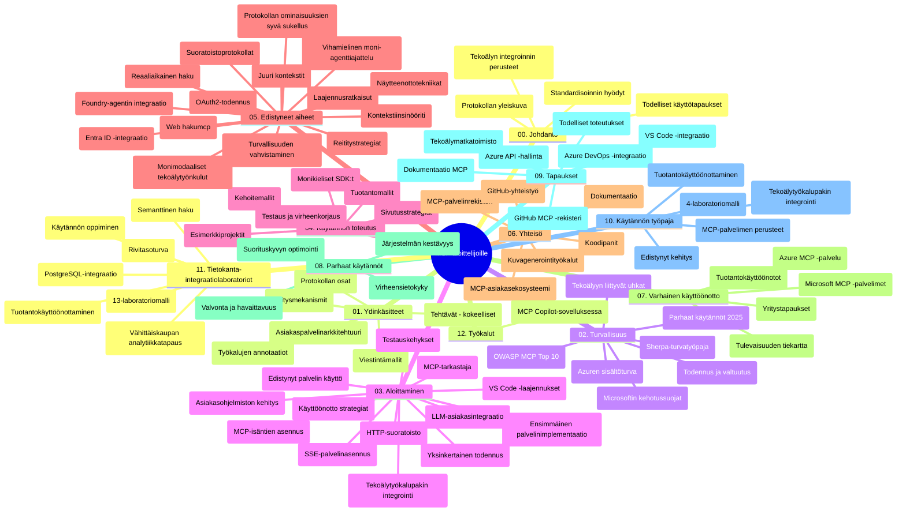

# Model Context Protocol (MCP) Aloittelijoille - Opas

Tämä opas tarjoaa yleiskatsauksen repositorion rakenteesta ja sisällöstä "Model Context Protocol (MCP) Aloittelijoille" -opetussuunnitelmaa varten. Käytä tätä opasta navigoidaksesi repositoriossa tehokkaasti ja hyödyntääksesi saatavilla olevat resurssit parhaalla mahdollisella tavalla.

## Repositorion yleiskatsaus

Model Context Protocol (MCP) on standardoitu kehys tekoälymallien ja asiakasohjelmien väliseen vuorovaikutukseen. MCP:n alkuperäinen luoja on Anthropic, ja sitä ylläpitää nykyään laajempi MCP-yhteisö virallisen GitHub-organisaation kautta. Tämä repositorio tarjoaa kattavan opetussuunnitelman, jossa on käytännön koodiesimerkkejä C#:ssa, Javassa, JavaScriptissä, Pythonissa ja TypeScriptissä, suunnattu tekoälykehittäjille, järjestelmäarkkitehdeille ja ohjelmistoinsinööreille.

## Visuaalinen opetussuunnitelman kartta

## Repositorion rakenne

Repositorio on jaettu kahteentoista pääosioon, jotka keskittyvät MCP:n eri osa-alueisiin:

1. **Johdanto (00-Introduction/)**
   - Yleiskatsaus Model Context Protocoliin
   - Miksi standardointi on tärkeää tekoälyputkissa
   - Käytännön käyttötapauksia ja hyötyjä

2. **Keskeiset käsitteet (01-CoreConcepts/)**
   - Asiakas-palvelinarkkitehtuuri
   - Protokollan keskeiset komponentit
   - Viestintämallit MCP:ssä
   - Tulevaisuuteen suuntaava: [Mitä MCP:ssä muuttuu: 2026-07-28 Release Candidate](./01-CoreConcepts/mcp-2026-07-28-release-candidate.md) — tilattoman protokollan ydin, laajennuskehys ja Roots/Sampling/Logging-vanhentumiset, joita odotetaan seuraavassa spesifikaatioversiossa

3. **Tietoturva (02-Security/)**
   - Tietoturvauhat MCP-pohjaisissa järjestelmissä
   - Parhaat käytännöt turvallisten toteutusten varmistamiseksi
   - Autentikointi- ja valtuutusstrategiat
   - **Kattava tietoturvadokumentaatio**:
     - MCP:n tietoturvan parhaat käytännöt 2025
     - Azure Content Safetyn toteutusopas
     - MCP:n tietoturvakontrollit ja -tekniikat
     - MCP:n parhaat käytännöt pikaopas
   - **Keskeiset tietoturva-aiheet**:
     - Kehoteinjektio ja työkalumyrkytyshyökkäykset
     - Istunnon kaappaaminen ja sekaisin oleva edustaja -ongelmat
     - Tokenien läpivientivulnerabiliteetit
     - Liialliset käyttöoikeudet ja pääsynvalvonta
     - Tekoälykomponenttien toimitusketjun turvallisuus
     - Microsoft Prompt Shields -integraatio

4. **Aloittaminen (03-GettingStarted/)**
   - Ympäristön asennus ja konfigurointi
   - Perus MCP -palvelimien ja -asiakkaiden luominen
   - Integraatio olemassa oleviin sovelluksiin
   - Sisältää osiot:
     - Ensimmäinen palvelin
     - Asiakasohjelmien kehitys
     - LLM-asiakasintegraatio
     - VS Code integraatio
     - Server-Sent Events (SSE) -palvelin
     - Edistynyt palvelimen käyttö
     - HTTP-suoratoisto
     - AI Toolkit -integraatio
     - Testausstrategiat
     - Julkaisumääritykset

5. **Käytännön toteutus (04-PracticalImplementation/)**
   - SDK:ien käyttö eri ohjelmointikielillä
   - Virheenkorjaus, testaus ja validointimenetelmät
   - Uudelleenkäytettävien kehotepohjien ja työnkulkujen luominen
   - Esimerkkiprojektit toteutusnäytteillä

6. **Edistyneet aiheet (05-AdvancedTopics/)**
   - Kontekstisuunnittelutekniikat
   - Foundry-agentin integraatio
   - Monimuotoiset tekoälytyönkulut
   - OAuth2-autentikointidemonstraatiot
   - Reaaliaikaiset hakutoiminnot
   - Reaaliaikainen suoratoisto
   - Root-kontekstien toteutus
   - Reititysstrategiat
   - Otantatekniikat
   - Skaalausmenetelmät
   - Tietoturvahuomiot
   - Entra ID:n tietoturvaintegraatio
   - Verkkohakujen integraatio
   - Vihamielinen moniedustajapohdinta (väittelymallit)

7. **Yhteisön panokset (06-CommunityContributions/)**
   - Miten antaa panoksesi koodiin ja dokumentaatioon
   - Yhteistyö GitHubin kautta
   - Yhteisön ohjaamat parannukset ja palautteet
   - Eri MCP-asiakkaiden käyttö (Claude Desktop, Cline, VSCode)
   - Suosittujen MCP-palvelimien käyttö, mukaan lukien kuvageneraattorit

8. **Varhaisen käyttöönoton opit (07-LessonsfromEarlyAdoption/)**
   - Todelliset toteutukset ja menestystarinat
   - MCP-pohjaisten ratkaisujen rakentaminen ja julkaisu
   - Trendit ja tulevaisuuden tiekartta
   - **Microsoft MCP -palvelimetopas**: Kattava opas 10 tuotantovalmiista Microsoft MCP -palvelimesta, mukaan lukien:
     - Microsoft Learn Docs MCP Server
     - Azure MCP Server (15+ erikoiskonetta)
     - GitHub MCP Server
     - Azure DevOps MCP Server
     - MarkItDown MCP Server
     - SQL Server MCP Server
     - Playwright MCP Server
     - Dev Box MCP Server
     - Microsoft Foundry MCP Server
     - Microsoft 365 Agents Toolkit MCP Server

9. **Parhaat käytännöt (08-BestPractices/)**
   - Suorituskyvyn hienosäätö ja optimointi
   - Vikasietoiset MCP-järjestelmät
   - Testaus- ja resilienssistrategiat

10. **Tapaustutkimukset (09-CaseStudy/)**
    - **Seitsemän kattavaa tapaustutkimusta**, jotka demonstroivat MCP:n monipuolisuutta erilaisissa tilanteissa:
    - **Azure AI Travel Agents**: Moniedustajien orkestrointi Azure OpenAI:n ja AI-haun kanssa
    - **Azure DevOps -integraatio**: Työnkulkujen automatisointi YouTube-datapäivityksillä
    - **Reaaliaikainen dokumentinhaku**: Python-konsoliasiakas HTTP-suoratoistolla
    - **Interaktiivinen opintosuunnitelman generoija**: Chainlit-verkkosovellus konversaatio-tekoälyllä
    - **In-editor dokumentaatio**: VS Code -integraatio GitHub Copilot -työnkulkujen kanssa
    - **Azure API Management**: Yritystason API-integraatio MCP-palvelimen luomisella
    - **GitHub MCP Registry**: Ekosysteemin kehittäminen ja agenttipohjainen integraatioalusta
    - Toteutus-esimerkkejä yritysintegroinnista, kehittäjätuottavuudesta ja ekosysteemikehityksestä

11. **Käytännön työpaja (10-StreamliningAIWorkflowsBuildingAnMCPServerWithAIToolkit/)**
    - Kattava käytännön työpaja, joka yhdistää MCP:n ja AI Toolkitin
    - Älykkäiden sovellusten rakentaminen, jotka yhdistävät tekoälymallit oikean maailman työkaluihin
    - Käytännölliset moduulit kattavat perusteet, räätälöidyn palvelinkehityksen ja tuotantojulkaisut
    - **Laboratoriorakenne**:
      - Lab 1: MCP-palvelimen perusteet
      - Lab 2: Edistynyt MCP-palvelin kehitys
      - Lab 3: AI Toolkit -integraatio
      - Lab 4: Tuotantojulkaisu ja skaalaus
    - Labrointipohjainen opetusaskel askeleelta ohjeineen

12. **MCP-palvelimen tietokantaintegraatiolaboratoriot (11-MCPServerHandsOnLabs/)**
    - **Kattava 13-laboratoriota sisältävä oppimispolku** tuotantovalmiiden MCP-palvelimien rakentamiseen PostgreSQL-integraatiolla
    - **Todellisen maailman vähittäiskaupan analytiikan toteutus** Zava Retail -käyttötapauksen avulla
    - **Yritystason mallit**, mukaan lukien rivikohtainen suojaus (RLS), semanttinen haku ja monivuokraajaisten tiedonsaantioikeudet
    - **Täydellinen laboratoriorakenne**:
      - **Labit 00-03: Perusteet** - Johdanto, arkkitehtuuri, tietoturva, ympäristön asennus
      - **Labit 04-06: MCP-palvelimen rakentaminen** - Tietokantasunnittelu, MCP-palvelimen toteutus, työkalujen kehitys
      - **Labit 07-09: Edistyneet ominaisuudet** - Semanttinen haku, testaus ja virheenkorjaus, VS Code integraatio
      - **Labit 10-12: Tuotanto & parhaat käytännöt** - Julkaisu, valvonta, optimointi
    - **Käsitellyt teknologiat**: FastMCP-kehys, PostgreSQL, Azure OpenAI, Azure Container Apps, Application Insights
    - **Oppimistavoitteet**: Tuotantovalmiit MCP-palvelimet, tietokantaintegraatiomallit, tekoälypohjainen analytiikka, yritystason tietoturva

13. **Työkalut (12-tooling/)**
    - Opiskele MCP:n käyttö Copilot-sovelluksessa ja muissa työkaluissa

## Lisäresurssit

Repositoriosta löytyy tukimateriaaleja:

- **Kuvakansio**: Sisältää kaavioita ja kuvituksia, joita käytetään opetussuunnitelmassa
- **Käännökset**: Monikielinen tuki automaattisilla dokumentaatiokäännöksillä
- **Viralliset MCP-resurssit**:
  - [MCP-dokumentaatio](https://modelcontextprotocol.io/)
  - [MCP-spesifikaatio](https://spec.modelcontextprotocol.io/)
  - [MCP GitHub-repositorio](https://github.com/modelcontextprotocol)

## Kuinka käyttää tätä repositoriota

1. **Järjestelmällinen oppiminen**: Seuraa lukuja järjestyksessä (00–11) rakenteellisen oppimiskokemuksen saamiseksi.
2. **Kielikohtainen painotus**: Jos olet kiinnostunut tietystä ohjelmointikielestä, tutustu näytteet-kansioihin löytääksesi toteutuksia haluamallasi kielellä.
3. **Käytännön toteutus**: Aloita osiossa "Getting Started" asettaaksesi ympäristön ja luodaksesi ensimmäisen MCP-palvelimesi ja asiakkaasi.
4. **Edistynyt tutkiminen**: Kun perusteet ovat hallussa, syvenny edistyneisiin aiheisiin laajentaaksesi tietämystäsi.
5. **Yhteisöön osallistuminen**: Liity MCP-yhteisöön GitHub-keskustelujen ja Discord-kanavien kautta saadaksesi yhteyden asiantuntijoihin ja muihin kehittäjiin.

## MCP-asiakkaat ja työkalut

Opetussuunnitelma kattaa erilaiset MCP-asiakkaat ja -työkalut:

1. **Viralliset asiakkaat**:
   - Visual Studio Code
   - MCP Visual Studio Codessa
   - Claude Desktop
   - Claude VSCodessa
   - Claude API

2. **Yhteisön asiakkaat**:
   - Cline (päätteeseen perustuva)
   - Cursor (koodieditori)
   - ChatMCP
   - Windsurf

3. **MCP-hallintatyökalut**:
   - MCP CLI
   - MCP Manager
   - MCP Linker
   - MCP Router

## Suosittuja MCP-palvelimia

Repositoriossa esitellään erilaisia MCP-palvelimia, mukaan lukien:

1. **Viralliset Microsoft MCP -palvelimet**:
   - Microsoft Learn Docs MCP Server
   - Azure MCP Server (yli 15 erikoiskonetta)
   - GitHub MCP Server
   - Azure DevOps MCP Server
   - MarkItDown MCP Server
   - SQL Server MCP Server
   - Playwright MCP Server
   - Dev Box MCP Server
   - Microsoft Foundry MCP Server
   - Microsoft 365 Agents Toolkit MCP Server

2. **Viralliset referenssipalvelimet**:
   - Filesystem
   - Fetch
   - Memory
   - Sequential Thinking

3. **Kuvageneraatiot**:
   - Azure OpenAI DALL-E 3
   - Stable Diffusion WebUI
   - Replicate

4. **Kehitystyökalut**:
   - Git MCP
   - Terminal Control
   - Code Assistant

5. **Erikoistuneet palvelimet**:
   - Salesforce
   - Microsoft Teams
   - Jira & Confluence

## Panostus

Tämä repositorio ottaa mielellään vastaan panoksia yhteisöltä. Katso osio Yhteisön panokset ohjeista, miten contributeerata tehokkaasti MCP-ekosysteemiin.

----

*Tämä opas päivitettiin viimeksi 5. helmikuuta 2026, ja se heijastaa tuoreinta MCP Spesifikaatiota 2025-11-25 sekä tarjoaa yleiskatsauksen repositorion sisällöstä tuona päivämääränä. Repositorion sisältöä voidaan päivittää tämän päivämäärän jälkeen.*

*Lisäys (2. heinäkuuta 2026): oppitunti MCP Spesifikaation  `2026-07-28` Release Candidate -versiosta lisättiin kohtaan [01-CoreConcepts](./01-CoreConcepts/mcp-2026-07-28-release-candidate.md); opetussuunnitelman perusta säilyy 2025-11-25 -versiossa, kunnes uusi spesifikaatio julkaistaan.*

---

<!-- CO-OP TRANSLATOR DISCLAIMER START -->
**Vastuuvapauslauseke**:
Tämä asiakirja on käännetty käyttämällä tekoälypohjaista käännöspalvelua [Co-op Translator](https://github.com/Azure/co-op-translator). Vaikka pyrimme tarkkuuteen, otathan huomioon, että automaattiset käännökset saattavat sisältää virheitä tai epätarkkuuksia. Alkuperäinen asiakirja sen alkuperäiskielellä on virallinen lähde. Tärkeissä asioissa suositellaan ammattimaista ihmiskäännöstä. Emme ole vastuussa tämän käännöksen käytöstä aiheutuvista väärinymmärryksistä tai tulkinnoista.
<!-- CO-OP TRANSLATOR DISCLAIMER END -->