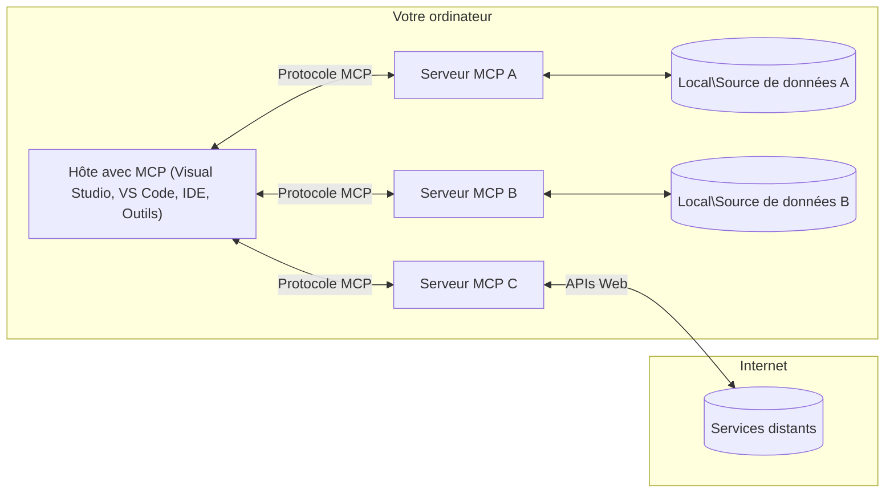

# Concepts de base MCP : Maîtriser le protocole de contexte de modèle pour l'intégration de l'IA

[](https://youtu.be/earDzWGtE84)

_(Cliquez sur l'image ci-dessus pour voir la vidéo de cette leçon)_

Le [Model Context Protocol (MCP)](https://github.com/modelcontextprotocol) est un cadre puissant et standardisé qui optimise la communication entre les grands modèles linguistiques (LLM) et les outils, applications et sources de données externes.  
Ce guide vous expliquera les concepts fondamentaux du MCP. Vous apprendrez son architecture client-serveur, ses composants essentiels, les mécanismes de communication et les bonnes pratiques d'implémentation.

- **Consentement explicite de l'utilisateur** : Tout accès aux données et toute opération requièrent l'approbation explicite de l'utilisateur avant exécution. Les utilisateurs doivent comprendre clairement quelles données seront accessibles et quelles actions seront réalisées, avec un contrôle granulaire des autorisations.

- **Protection de la confidentialité des données** : Les données utilisateur ne sont exposées qu'avec un consentement explicite et doivent être protégées par des contrôles d'accès robustes tout au long du cycle d'interaction. Les implémentations doivent empêcher toute transmission non autorisée et maintenir des limites strictes de confidentialité.

- **Sécurité de l'exécution des outils** : Chaque invocation d'outil nécessite le consentement explicite de l'utilisateur avec une compréhension claire des fonctionnalités, paramètres et impacts potentiels de l'outil. Des barrières de sécurité robustes doivent empêcher toute exécution involontaire, non sécurisée ou malveillante des outils.

- **Sécurité de la couche transport** : Tous les canaux de communication doivent utiliser des mécanismes adéquats de chiffrement et d'authentification. Les connexions distantes doivent implémenter des protocoles de transport sécurisés et une gestion appropriée des identifiants.

#### Directives de mise en œuvre :

- **Gestion des permissions** : Implémenter des systèmes de permissions fines qui permettent aux utilisateurs de contrôler quels serveurs, outils et ressources sont accessibles
- **Authentification & Autorisation** : Utiliser des méthodes d'authentification sécurisées (OAuth, clés API) avec une gestion correcte des jetons et leur expiration  
- **Validation des entrées** : Valider tous les paramètres et données selon des schémas définis pour prévenir les attaques par injection
- **Journalisation d'audit** : Maintenir des journaux complets de toutes les opérations pour la surveillance de sécurité et la conformité

## Vue d'ensemble

Cette leçon explore l'architecture fondamentale et les composants qui constituent l'écosystème du Model Context Protocol (MCP). Vous découvrirez l'architecture client-serveur, les composants clés et les mécanismes de communication qui alimentent les interactions MCP.

## Objectifs clés d'apprentissage

À la fin de cette leçon, vous serez capable de :

- Comprendre l'architecture client-serveur du MCP.
- Identifier les rôles et responsabilités des hôtes, clients et serveurs.
- Analyser les fonctionnalités principales qui font du MCP une couche d'intégration flexible.
- Apprendre comment circule l'information dans l'écosystème MCP.
- Obtenir des aperçus pratiques via des exemples de code en .NET, Java, Python et JavaScript.

## Architecture MCP : un examen approfondi

L'écosystème MCP repose sur un modèle client-serveur. Cette structure modulaire permet aux applications d'IA d'interagir efficacement avec des outils, bases de données, API et ressources contextuelles. Décomposons cette architecture en ses composants principaux.

Au cœur de MCP se trouve une architecture client-serveur où une application hôte peut se connecter à plusieurs serveurs :



- **Hôtes MCP** : Programmes comme VSCode, Claude Desktop, IDE ou outils d'IA qui souhaitent accéder aux données via MCP
- **Clients MCP** : Clients de protocole qui maintiennent des connexions 1:1 avec les serveurs
- **Serveurs MCP** : Programmes légers qui exposent chacun des capacités spécifiques via le protocole standardisé Model Context Protocol
- **Sources de données locales** : Fichiers, bases de données et services de votre ordinateur auxquels les serveurs MCP peuvent accéder de manière sécurisée
- **Services distants** : Systèmes externes disponibles sur Internet auxquels les serveurs MCP peuvent se connecter via des API.

Le protocole MCP est une norme évolutive utilisant un versionnage basé sur la date (format AAAA-MM-JJ). La version actuelle du protocole est **2025-11-25**. Vous pouvez voir les dernières mises à jour de la [spécification du protocole](https://modelcontextprotocol.io/specification/2025-11-25/)

> **À venir :** un candidat à la sortie pour la prochaine version de spécification, **2026-07-28**, a été annoncé en mai 2026 et est prévu pour le 28 juillet 2026. Il rend le protocole sans état au niveau transport (en supprimant la poignée de main `initialize` et les IDs de session), formalise un cadre Extensions, et déprécie Roots, Sampling et Logging au profit de nouvelles approches. Voir [Quoi de neuf dans MCP : le candidat à la sortie 2026-07-28](./mcp-2026-07-28-release-candidate.md) pour une analyse complète.

### 1. Hôtes

Dans le Model Context Protocol (MCP), les **Hôtes** sont des applications d'IA qui servent d'interface principale par laquelle les utilisateurs interagissent avec le protocole. Les hôtes coordonnent et gèrent les connexions à plusieurs serveurs MCP en créant des clients MCP dédiés pour chaque connexion serveur. Exemples d’hôtes :

- **Applications d'IA** : Claude Desktop, Visual Studio Code, Claude Code
- **Environnements de développement** : IDEs et éditeurs de code avec intégration MCP  
- **Applications personnalisées** : Agents et outils d'IA conçus sur mesure

Les **Hôtes** sont des applications qui coordonnent les interactions avec les modèles d'IA. Ils :

- **Orchestrent les modèles d'IA** : Exécutent ou interagissent avec les LLM pour générer des réponses et orchestrer les flux de travail IA
- **Gèrent les connexions clients** : Créent et maintiennent un client MCP par connexion serveur MCP
- **Contrôlent l'interface utilisateur** : Gèrent le flux de conversation, les interactions utilisateur et la présentation des réponses  
- **Appliquent la sécurité** : Contrôlent les autorisations, contraintes de sécurité et authentification
- **Gèrent le consentement utilisateur** : Administrent l'approbation utilisateur pour le partage de données et l'exécution d'outils


### 2. Clients

Les **Clients** sont des composants essentiels qui maintiennent des connexions dédiées en tête-à-tête entre les hôtes et les serveurs MCP. Chaque client MCP est instancié par l'hôte pour se connecter à un serveur MCP spécifique, assurant des canaux de communication organisés et sécurisés. Plusieurs clients permettent aux hôtes de se connecter à plusieurs serveurs simultanément.

Les **Clients** sont des composants connecteurs au sein de l'application hôte. Ils :

- **Communiquent via le protocole** : Envoient des requêtes JSON-RPC 2.0 aux serveurs avec des prompts et instructions
- **Négocient les capacités** : Négocient les fonctionnalités et versions du protocole prises en charge avec les serveurs lors de l'initialisation
- **Exécutent des outils** : Gèrent les requêtes d'exécution d'outils des modèles et traitent les réponses
- **Gèrent les mises à jour en temps réel** : Traitent les notifications et mises à jour en temps réel des serveurs
- **Traitement des réponses** : Traitent et formatent les réponses des serveurs pour affichage aux utilisateurs

### 3. Serveurs

Les **Serveurs** sont des programmes qui fournissent contexte, outils et capacités aux clients MCP. Ils peuvent s’exécuter localement (même machine que l’hôte) ou à distance (sur des plateformes externes), et sont responsables de traiter les requêtes client et d’offrir des réponses structurées. Les serveurs exposent des fonctionnalités spécifiques via le protocole standardisé Model Context Protocol.

Les **Serveurs** sont des services qui fournissent contexte et capacités. Ils :

- **Enregistrement des fonctionnalités** : Enregistrent et exposent les primitives disponibles (ressources, prompts, outils) aux clients
- **Traitement des requêtes** : Reçoivent et exécutent les appels d’outils, requêtes de ressources et prompts des clients
- **Fourniture de contexte** : Apportent des informations contextuelles et des données pour améliorer les réponses des modèles
- **Gestion d'état** : Maintiennent l’état des sessions et gèrent les interactions avec état si nécessaire

- **Notifications en temps réel** : Envoyer des notifications concernant les modifications et mises à jour des capacités aux clients connectés

Les serveurs peuvent être développés par n’importe qui pour étendre les capacités des modèles avec des fonctionnalités spécialisées, et ils supportent à la fois les scénarios de déploiement locaux et distants.

### 4. Primitives du serveur

Les serveurs dans le Model Context Protocol (MCP) fournissent trois **primitives** principales qui définissent les blocs fondamentaux pour des interactions riches entre clients, hôtes et modèles de langage. Ces primitives spécifient les types d’informations contextuelles et les actions disponibles via le protocole.

Les serveurs MCP peuvent exposer n’importe quelle combinaison des trois primitives principales suivantes :

#### Ressources 

Les **ressources** sont des sources de données fournissant des informations contextuelles aux applications d’IA. Elles représentent du contenu statique ou dynamique qui peut améliorer la compréhension du modèle et la prise de décision :

- **Données contextuelles** : Informations structurées et contexte pour la consommation par le modèle IA
- **Bases de connaissances** : Répertoires de documents, articles, manuels et articles de recherche
- **Sources de données locales** : Fichiers, bases de données et informations système locales  
- **Données externes** : Réponses d’API, services web et données systèmes distantes
- **Contenu dynamique** : Données en temps réel qui se mettent à jour selon des conditions externes

Les ressources sont identifiées par des URI et supportent la découverte via les méthodes `resources/list` et la récupération via `resources/read` :

```text
file://documents/project-spec.md
database://production/users/schema
api://weather/current
```

#### Invites

Les **prompts** sont des modèles réutilisables qui aident à structurer les interactions avec les modèles de langage. Ils fournissent des schémas d’interaction standardisés et des flux de travail modélisés :

- **Interactions basées sur des modèles** : Messages préstructurés et amorces de conversation
- **Modèles de flux de travail** : Séquences standardisées pour tâches et interactions courantes
- **Exemples few-shot** : Modèles basés sur des exemples pour l’instruction du modèle
- **Invites système** : Invites fondamentales définissant le comportement et le contexte du modèle
- **Modèles dynamiques** : Invites paramétrées qui s’adaptent à des contextes spécifiques

Les invites supportent la substitution de variables et peuvent être découvertes via `prompts/list` et récupérées avec `prompts/get` :

```markdown
Generate a {{task_type}} for {{product}} targeting {{audience}} with the following requirements: {{requirements}}
```

#### Outils

Les **outils** sont des fonctions exécutables que les modèles IA peuvent invoquer pour effectuer des actions spécifiques. Ils représentent les « verbes » de l’écosystème MCP, permettant aux modèles d’interagir avec des systèmes externes :

- **Fonctions exécutables** : Opérations distinctes que les modèles peuvent invoquer avec des paramètres spécifiques
- **Intégration système externe** : Appels d’API, requêtes de bases de données, opérations sur fichiers, calculs
- **Identité unique** : Chaque outil possède un nom, une description et un schéma de paramètres distincts
- **Entrées/Sorties structurées** : Les outils acceptent des paramètres validés et renvoient des réponses structurées et typées
- **Capacités d’action** : Permettent aux modèles d’effectuer des actions dans le monde réel et de récupérer des données en direct

Les outils sont définis avec JSON Schema pour la validation des paramètres, découverts via `tools/list` et exécutés via `tools/call`. Les outils peuvent également inclure des **icônes** comme métadonnées supplémentaires pour une meilleure présentation UI.

**Annotations des outils** : Les outils supportent des annotations comportementales (ex. `readOnlyHint`, `destructiveHint`) décrivant si un outil est en lecture seule ou destructeur, aidant les clients à prendre des décisions éclairées concernant l’exécution des outils.

Exemple de définition d’outil :

```typescript
server.tool(
  "search_products", 
  {
    query: z.string().describe("Search query for products"),
    category: z.string().optional().describe("Product category filter"),
    max_results: z.number().default(10).describe("Maximum results to return")
  }, 
  async (params) => {
    // Exécuter la recherche et retourner des résultats structurés
    return await productService.search(params);
  }
);
```

## Primitives clients

Dans le Model Context Protocol (MCP), les **clients** peuvent exposer des primitives permettant aux serveurs de demander des capacités complémentaires à l’application hôte. Ces primitives côté client permettent des implémentations serveur plus riches et interactives qui peuvent accéder aux capacités du modèle IA et aux interactions utilisateur.

### Échantillonnage

> **Avis de dépréciation :** le candidat à la version `2026-07-28` marque l’échantillonnage comme déprécié au profit d’une intégration directe avec les API des fournisseurs LLM. Il reste fonctionnel dans la version `2025-11-25` et pour au moins un an après toute dépréciation, mais les nouvelles conceptions devraient privilégier le modèle de remplacement. Voir [Ce qui change dans MCP : le candidat à la version 2026-07-28](./mcp-2026-07-28-release-candidate.md).

L’**échantillonnage** permet aux serveurs de demander des complétions de modèle de langage à l’application IA cliente. Cette primitive permet aux serveurs d’accéder aux capacités LLM sans intégrer leurs propres dépendances de modèle :

- **Accès indépendant du modèle** : Les serveurs peuvent demander des complétions sans inclure les SDK LLM ni gérer l’accès au modèle
- **IA initiée par le serveur** : Permet aux serveurs de générer automatiquement du contenu en utilisant le modèle IA du client
- **Interactions LLM récursives** : Supporte des scénarios complexes où les serveurs ont besoin d’assistance IA pour le traitement
- **Génération dynamique de contenu** : Permet aux serveurs de créer des réponses contextuelles avec le modèle de l’hôte
- **Support d’appels d’outils** : Les serveurs peuvent inclure des paramètres `tools` et `toolChoice` pour permettre au modèle client d’invoquer des outils pendant l’échantillonnage

L’échantillonnage est initié via la méthode `sampling/complete`, où les serveurs envoient des requêtes de complétion aux clients.

### Racines

> **Avis de dépréciation :** le candidat à la version `2026-07-28` marque les racines comme dépréciées au profit des paramètres d’outils, des URI de ressources ou de la configuration serveur. Elles restent fonctionnelles dans la version `2025-11-25` et pour au moins un an après toute dépréciation. Voir [Ce qui change dans MCP : le candidat à la version 2026-07-28](./mcp-2026-07-28-release-candidate.md).

Les **racines** fournissent un moyen standardisé pour les clients d’exposer les limites du système de fichiers aux serveurs, aidant ceux-ci à comprendre quels répertoires et fichiers ils peuvent accéder :

- **Limites du système de fichiers** : Définissent les limites où les serveurs peuvent opérer dans le système de fichiers
- **Contrôle d’accès** : Aident les serveurs à comprendre quels répertoires et fichiers ils ont la permission d’accéder
- **Mises à jour dynamiques** : Les clients peuvent notifier les serveurs lorsque la liste des racines change
- **Identification basée sur URI** : Les racines utilisent des URI `file://` pour identifier les répertoires et fichiers accessibles

Les racines sont découvertes via la méthode `roots/list`, les clients envoyant `notifications/roots/list_changed` lorsque les racines changent.

### Sollicitation  

La **sollicitation** permet aux serveurs de demander des informations supplémentaires ou une confirmation aux utilisateurs via l’interface client :

- **Demandes de saisie utilisateur** : Les serveurs peuvent demander des informations complémentaires lorsque nécessaires à l’exécution d’outils
- **Boîtes de dialogue de confirmation** : Solliciter l’approbation utilisateur pour des opérations sensibles ou impactantes
- **Flux de travail interactifs** : Permet aux serveurs de créer des interactions utilisateur étape par étape
- **Collecte dynamique de paramètres** : Rassembler les paramètres manquants ou optionnels pendant l’exécution d’outils

Les requêtes de sollicitation sont effectuées via la méthode `elicitation/request` pour collecter les saisies utilisateur via l’interface du client.

**Mode URL de sollicitation** : Les serveurs peuvent aussi demander des interactions utilisateur basées sur une URL, permettant aux serveurs de diriger les utilisateurs vers des pages web externes pour authentification, confirmation ou saisie de données.

### Journalisation


> **Avis de dépréciation :** le candidat à la sortie `2026-07-28` marque la journalisation comme dépréciée au profit de `stderr` pour les transports stdio et OpenTelemetry pour l'observabilité structurée. Elle continue à fonctionner dans la version `2025-11-25` et pendant au moins un an après toute dépréciation. Voir [Quoi de neuf dans MCP : Le candidat à la sortie 2026-07-28](./mcp-2026-07-28-release-candidate.md).

**La journalisation** permet aux serveurs d’envoyer des messages de journal structurés aux clients pour le débogage, la surveillance et la visibilité opérationnelle :

- **Support de débogage** : Permet aux serveurs de fournir des journaux d'exécution détaillés pour le dépannage
- **Surveillance opérationnelle** : Envoie des mises à jour de statut et des métriques de performance aux clients
- **Rapport d'erreurs** : Fournit un contexte détaillé des erreurs et des informations de diagnostic
- **Pistes d’audit** : Crée des journaux complets des opérations et décisions du serveur

Les messages de journalisation sont envoyés aux clients pour offrir une transparence sur les opérations du serveur et faciliter le débogage.

## Flux d'information dans MCP

Le Protocole de Contexte Modèle (MCP) définit un flux structuré d'informations entre hôtes, clients, serveurs et modèles. Comprendre ce flux aide à clarifier comment les requêtes utilisateur sont traitées et comment les outils externes et les données sont intégrés aux réponses du modèle.

- **L’hôte initie la connexion**  
  L'application hôte (comme un IDE ou une interface de chat) établit une connexion à un serveur MCP, généralement via STDIO, WebSocket ou un autre transport pris en charge.

- **Négociation des capacités**  
  Le client (intégré dans l'hôte) et le serveur échangent des informations sur leurs fonctionnalités, outils, ressources et versions de protocole prises en charge. Cela garantit que les deux parties comprennent les capacités disponibles pour la session.

- **Requête utilisateur**  
  L'utilisateur interagit avec l'hôte (par ex., saisit une invite ou une commande). L’hôte collecte cette saisie et la transmet au client pour traitement.

- **Utilisation de ressources ou d’outils**  
  - Le client peut demander un contexte ou des ressources supplémentaires au serveur (comme des fichiers, des entrées de base de données ou des articles de la base de connaissances) pour enrichir la compréhension du modèle.
  - Si le modèle détermine qu'un outil est nécessaire (par ex., pour récupérer des données, effectuer un calcul ou appeler une API), le client envoie une requête d'invocation d'outil au serveur, précisant le nom de l’outil et ses paramètres.

- **Exécution par le serveur**  
  Le serveur reçoit la demande de ressource ou d’outil, exécute les opérations nécessaires (par ex., exécuter une fonction, interroger une base de données ou récupérer un fichier), et renvoie les résultats au client sous un format structuré.

- **Génération de réponse**  
  Le client intègre les réponses du serveur (données de ressources, sorties d’outils, etc.) dans l’interaction en cours avec le modèle. Le modèle utilise ces informations pour générer une réponse complète et contextuellement pertinente.

- **Présentation du résultat**  
  L’hôte reçoit la sortie finale du client et la présente à l'utilisateur, souvent en incluant à la fois le texte généré par le modèle et les résultats des exécutions d’outils ou des recherches de ressources.

Ce flux permet à MCP de supporter des applications d'IA avancées, interactives et contextuellement conscientes en connectant de manière fluide les modèles avec des outils externes et des sources de données.

## Architecture & couches du protocole

MCP se compose de deux couches architecturales distinctes qui fonctionnent ensemble pour fournir un cadre de communication complet :

### Couche des données

La **Couche des données** implémente le protocole central MCP en utilisant **JSON-RPC 2.0** comme base. Cette couche définit la structure des messages, la sémantique et les schémas d'interaction :

#### Composants principaux :

- **Protocole JSON-RPC 2.0** : Toute la communication utilise un format de message JSON-RPC 2.0 standardisé pour les appels de méthode, réponses et notifications
- **Gestion du cycle de vie** : Gère l'initialisation de la connexion, la négociation des capacités et la terminaison de session entre clients et serveurs
- **Primitives serveur** : Permet aux serveurs de fournir des fonctionnalités de base via des outils, ressources et invites
- **Primitives client** : Permet aux serveurs de demander des échantillons à partir de LLMs, de solliciter la saisie utilisateur, et d’envoyer des messages de journalisation
- **Notifications en temps réel** : Supporte les notifications asynchrones pour des mises à jour dynamiques sans interrogation continue

#### Fonctionnalités clés :

- **Négociation de version du protocole** : Utilise une version basée sur une date (AAAA-MM-JJ) pour assurer la compatibilité
- **Découverte des capacités** : Clients et serveurs échangent les fonctionnalités supportées lors de l'initialisation
- **Sessions avec état** : Maintient l’état de connexion au travers de multiples interactions pour la continuité contextuelle

### Couche de transport

La **Couche de transport** gère les canaux de communication, l’encadrement des messages et l’authentification entre les participants MCP :

#### Mécanismes de transport pris en charge :

1. **Transport STDIO** :
   - Utilise les flux standard d’entrée/sortie pour une communication directe entre processus
   - Optimal pour les processus locaux sur la même machine sans surcharge réseau
   - Couramment utilisé pour les implémentations de serveurs MCP locaux

2. **Transport HTTP Streamable** :
   - Utilise HTTP POST pour les messages client-serveur  
   - Événements envoyés par le serveur (SSE) optionnels pour le streaming serveur-client
   - Permet la communication à distance entre serveurs via les réseaux
   - Supporte l’authentification HTTP standard (jetons bearer, clés API, en-têtes personnalisés)
   - MCP recommande OAuth pour une authentification sécurisée basée sur des jetons

#### Abstraction du transport :

La couche transport abstrait les détails de communication de la couche données, permettant d’utiliser le même format de message JSON-RPC 2.0 sur tous les mécanismes de transport. Cette abstraction permet aux applications de changer facilement entre serveurs locaux et distants.

### Considérations de sécurité

Les implémentations MCP doivent adhérer à plusieurs principes de sécurité essentiels pour garantir des interactions sûres, fiables et sécurisées dans toutes les opérations du protocole :

- **Consentement et contrôle utilisateur** : Les utilisateurs doivent donner un consentement explicite avant que toute donnée soit consultée ou opération réalisée. Ils doivent avoir un contrôle clair sur les données partagées et les actions autorisées, soutenu par des interfaces utilisateur intuitives pour revoir et approuver les activités.

- **Confidentialité des données** : Les données utilisateur ne doivent être exposées qu’avec consentement explicite et doivent être protégées par des contrôles d’accès appropriés. Les implémentations MCP doivent prévenir toute transmission non autorisée de données et assurer que la confidentialité est maintenue durant toutes les interactions.

- **Sécurité des outils** : Avant d’invoquer un outil, un consentement explicite de l’utilisateur est requis. Les utilisateurs doivent comprendre clairement les fonctionnalités de chaque outil, et des limites de sécurité robustes doivent être appliquées pour empêcher toute exécution involontaire ou dangereuse d’outils.

En suivant ces principes de sécurité, MCP garantit la confiance, la confidentialité et la sécurité des utilisateurs à travers toutes les interactions du protocole tout en permettant des intégrations puissantes d’IA.

## Exemples de code : composants clés

Voici des exemples de code dans plusieurs langages de programmation populaires illustrant comment implémenter les composants clés d’un serveur MCP et des outils.

### Exemple .NET : Création d’un serveur MCP simple avec outils

Voici un exemple pratique en .NET montrant comment implémenter un serveur MCP simple avec des outils personnalisés. Cet exemple présente comment définir et enregistrer des outils, gérer les requêtes, et connecter le serveur en utilisant le Protocole de Contexte Modèle.

```csharp
using System;
using System.Threading.Tasks;
using ModelContextProtocol.Server;
using ModelContextProtocol.Server.Transport;
using ModelContextProtocol.Server.Tools;

public class WeatherServer
{
    public static async Task Main(string[] args)
    {
        // Create an MCP server
        var server = new McpServer(
            name: "Weather MCP Server",
            version: "1.0.0"
        );
        
        // Register our custom weather tool
        server.AddTool<string, WeatherData>("weatherTool", 
            description: "Gets current weather for a location",
            execute: async (location) => {
                // Call weather API (simplified)
                var weatherData = await GetWeatherDataAsync(location);
                return weatherData;
            });
        
        // Connect the server using stdio transport
        var transport = new StdioServerTransport();
        await server.ConnectAsync(transport);
        
        Console.WriteLine("Weather MCP Server started");
        
        // Keep the server running until process is terminated
        await Task.Delay(-1);
    }
    
    private static async Task<WeatherData> GetWeatherDataAsync(string location)
    {
        // This would normally call a weather API
        // Simplified for demonstration
        await Task.Delay(100); // Simulate API call
        return new WeatherData { 
            Temperature = 72.5,
            Conditions = "Sunny",
            Location = location
        };
    }
}

public class WeatherData
{
    public double Temperature { get; set; }
    public string Conditions { get; set; }
    public string Location { get; set; }
}
```

### Exemple Java : composants serveur MCP

Cet exemple montre le même serveur MCP et l’enregistrement des outils que l’exemple .NET ci-dessus, mais implémenté en Java.

```java
import io.modelcontextprotocol.server.McpServer;
import io.modelcontextprotocol.server.McpToolDefinition;
import io.modelcontextprotocol.server.transport.StdioServerTransport;
import io.modelcontextprotocol.server.tool.ToolExecutionContext;
import io.modelcontextprotocol.server.tool.ToolResponse;

public class WeatherMcpServer {
    public static void main(String[] args) throws Exception {
        // Créer un serveur MCP
        McpServer server = McpServer.builder()
            .name("Weather MCP Server")
            .version("1.0.0")
            .build();
            
        // Enregistrer un outil météo
        server.registerTool(McpToolDefinition.builder("weatherTool")
            .description("Gets current weather for a location")
            .parameter("location", String.class)
            .execute((ToolExecutionContext ctx) -> {
                String location = ctx.getParameter("location", String.class);
                
                // Obtenir les données météo (simplifié)
                WeatherData data = getWeatherData(location);
                
                // Retourner une réponse formatée
                return ToolResponse.content(
                    String.format("Temperature: %.1f°F, Conditions: %s, Location: %s", 
                    data.getTemperature(), 
                    data.getConditions(), 
                    data.getLocation())
                );
            })
            .build());
        
        // Connecter le serveur en utilisant le transport stdio
        try (StdioServerTransport transport = new StdioServerTransport()) {
            server.connect(transport);
            System.out.println("Weather MCP Server started");
            // Maintenir le serveur en fonctionnement jusqu'à la fin du processus
            Thread.currentThread().join();
        }
    }
    
    private static WeatherData getWeatherData(String location) {
        // L'implémentation appellerait une API météo
        // Simplifié à des fins d'exemple
        return new WeatherData(72.5, "Sunny", location);
    }
}

class WeatherData {
    private double temperature;
    private String conditions;
    private String location;
    
    public WeatherData(double temperature, String conditions, String location) {
        this.temperature = temperature;
        this.conditions = conditions;
        this.location = location;
    }
    
    public double getTemperature() {
        return temperature;
    }
    
    public String getConditions() {
        return conditions;
    }
    
    public String getLocation() {
        return location;
    }
}
```

### Exemple Python : construction d’un serveur MCP

Cet exemple utilise fastmcp, veuillez donc vous assurer de l’installer d’abord :

```python
pip install fastmcp
```
Exemple de code :

```python
#!/usr/bin/env python3
import asyncio
from fastmcp import FastMCP
from fastmcp.transports.stdio import serve_stdio

# Créer un serveur FastMCP
mcp = FastMCP(
    name="Weather MCP Server",
    version="1.0.0"
)

@mcp.tool()
def get_weather(location: str) -> dict:
    """Gets current weather for a location."""
    return {
        "temperature": 72.5,
        "conditions": "Sunny",
        "location": location
    }

# Approche alternative utilisant une classe
class WeatherTools:
    @mcp.tool()
    def forecast(self, location: str, days: int = 1) -> dict:
        """Gets weather forecast for a location for the specified number of days."""
        return {
            "location": location,
            "forecast": [
                {"day": i+1, "temperature": 70 + i, "conditions": "Partly Cloudy"}
                for i in range(days)
            ]
        }

# Enregistrer les outils de la classe
weather_tools = WeatherTools()

# Démarrer le serveur
if __name__ == "__main__":
    asyncio.run(serve_stdio(mcp))
```

### Exemple JavaScript : création d’un serveur MCP

Cet exemple montre la création d’un serveur MCP en JavaScript et comment enregistrer deux outils liés à la météo.

```javascript
// Utilisation du SDK officiel du protocole Model Context
import { McpServer } from "@modelcontextprotocol/sdk/server/mcp.js";
import { StdioServerTransport } from "@modelcontextprotocol/sdk/server/stdio.js";
import { z } from "zod"; // Pour la validation des paramètres

// Créer un serveur MCP
const server = new McpServer({
  name: "Weather MCP Server",
  version: "1.0.0"
});

// Définir un outil météo
server.tool(
  "weatherTool",
  {
    location: z.string().describe("The location to get weather for")
  },
  async ({ location }) => {
    // Cela appellerait normalement une API météo
    // Simplifié pour la démonstration
    const weatherData = await getWeatherData(location);
    
    return {
      content: [
        { 
          type: "text", 
          text: `Temperature: ${weatherData.temperature}°F, Conditions: ${weatherData.conditions}, Location: ${weatherData.location}` 
        }
      ]
    };
  }
);

// Définir un outil de prévisions
server.tool(
  "forecastTool",
  {
    location: z.string(),
    days: z.number().default(3).describe("Number of days for forecast")
  },
  async ({ location, days }) => {
    // Cela appellerait normalement une API météo
    // Simplifié pour la démonstration
    const forecast = await getForecastData(location, days);
    
    return {
      content: [
        { 
          type: "text", 
          text: `${days}-day forecast for ${location}: ${JSON.stringify(forecast)}` 
        }
      ]
    };
  }
);

// Fonctions d'aide
async function getWeatherData(location) {
  // Simuler un appel API
  return {
    temperature: 72.5,
    conditions: "Sunny",
    location: location
  };
}

async function getForecastData(location, days) {
  // Simuler un appel API
  return Array.from({ length: days }, (_, i) => ({
    day: i + 1,
    temperature: 70 + Math.floor(Math.random() * 10),
    conditions: i % 2 === 0 ? "Sunny" : "Partly Cloudy"
  }));
}

// Connecter le serveur en utilisant le transport stdio
const transport = new StdioServerTransport();
server.connect(transport).catch(console.error);

console.log("Weather MCP Server started");
```

Cet exemple JavaScript illustre comment créer un serveur MCP avec le SDK du Protocole de Contexte Modèle. Il montre comment enregistrer deux outils nommés `weatherTool` et `forecastTool` et les rendre disponibles aux clients MCP via le `StdioServerTransport`.

## Sécurité et autorisation

MCP inclut plusieurs concepts et mécanismes intégrés pour gérer la sécurité et l’autorisation tout au long du protocole :

1. **Contrôle des permissions des outils** :  
  Les clients peuvent spécifier quels outils un modèle est autorisé à utiliser durant une session. Cela garantit que seuls les outils explicitement autorisés sont accessibles, réduisant le risque d’opérations involontaires ou dangereuses. Les permissions peuvent être configurées dynamiquement selon les préférences des utilisateurs, les politiques organisationnelles ou le contexte de l’interaction.

2. **Authentification** :  
  Les serveurs peuvent exiger une authentification avant de fournir l’accès aux outils, ressources ou opérations sensibles. Cela peut impliquer clés API, jetons OAuth ou autres schémas d’authentification. Une authentification appropriée garantit que seuls les clients et utilisateurs de confiance peuvent invoquer les capacités côté serveur.

3. **Validation** :  
  Une validation des paramètres est appliquée à toutes les invocations d’outils. Chaque outil définit les types, formats et contraintes attendus pour ses paramètres, et le serveur valide les requêtes entrantes en conséquence. Cela empêche des entrées mal formées ou malveillantes d’atteindre les implémentations d’outils et aide à préserver l’intégrité des opérations.

4. **Limitation de débit** :  
  Pour prévenir les abus et assurer une utilisation équitable des ressources serveur, les serveurs MCP peuvent appliquer des limites de débit pour les appels d’outils et l’accès aux ressources. Les limites peuvent être appliquées par utilisateur, par session ou globalement, aidant à se protéger contre les attaques par déni de service ou la consommation excessive de ressources.

En combinant ces mécanismes, MCP fournit une base sécurisée pour intégrer les modèles de langage avec des outils et sources de données externes, tout en offrant aux utilisateurs et développeurs un contrôle fin de l’accès et de l’utilisation.

## Messages du protocole & flux de communication

La communication MCP utilise des messages **JSON-RPC 2.0** structurés pour faciliter des interactions claires et fiables entre hôtes, clients et serveurs. Le protocole définit des schémas spécifiques de messages pour différents types d’opérations :

### Types principaux de messages :

#### **Messages d’initialisation**
- **Requête `initialize`** : Établit la connexion et négocie la version du protocole et les capacités
- **Réponse `initialize`** : Confirme les fonctionnalités supportées et les informations du serveur  
- **`notifications/initialized`** : Signale que l’initialisation est terminée et que la session est prête

#### **Messages de découverte**
- **Requête `tools/list`** : Découvre les outils disponibles sur le serveur
- **Requête `resources/list`** : Liste les ressources disponibles (sources de données)
- **Requête `prompts/list`** : Récupère les modèles d’invites disponibles

#### **Messages d’exécution**  
- **Requête `tools/call`** : Exécute un outil spécifique avec les paramètres fournis
- **Requête `resources/read`** : Récupère le contenu d’une ressource spécifique
- **Requête `prompts/get`** : Récupère un modèle d’invite avec des paramètres optionnels

#### **Messages côté client**
- **Requête `sampling/complete`** : Le serveur demande une complétion LLM via le client
- **`elicitation/request`** : Le serveur sollicite une saisie utilisateur via l’interface client
- **Messages de journalisation** : Le serveur envoie des messages de journal structurés au client

#### **Messages de notification**
- **`notifications/tools/list_changed`** : Le serveur notifie le client des changements d’outils
- **`notifications/resources/list_changed`** : Le serveur notifie le client des changements de ressources  
- **`notifications/prompts/list_changed`** : Le serveur notifie le client des changements de modèles d’invites

### Structure des messages :

Tous les messages MCP suivent le format JSON-RPC 2.0 avec :
- **Messages de requête** : Incluent `id`, `method`, et des `params` optionnels
- **Messages de réponse** : Incluent `id` et soit un `result` soit une `error`  
- **Messages de notification** : Incluent `method` et des `params` optionnels (sans `id` ni réponse attendue)

Cette communication structurée assure des interactions fiables, traçables et extensibles soutenant des scénarios avancés comme les mises à jour en temps réel, le chaînage d’outils, et la gestion robuste des erreurs.

### Tâches (Expérimental)

> **Regard vers l'avenir :** Le candidat à la sortie `2026-07-28` fait sortir les Tâches de la spécification expérimentale du cœur vers une extension dédiée des Tâches avec un cycle de vie repensé (`tasks/get`, `tasks/update`, `tasks/cancel` ; `tasks/list` est supprimé). Si vous développez avec l’API expérimentale décrite ci-dessous, prévoyez une migration. Voir [Quoi de neuf dans MCP : Le candidat à la sortie 2026-07-28](./mcp-2026-07-28-release-candidate.md).

Les **Tâches** sont une fonctionnalité expérimentale fournissant des enveloppes d'exécution durables permettant la récupération différée des résultats et le suivi du statut des requêtes MCP :

- **Opérations de longue durée** : Suivre les calculs coûteux, automatisation de flux de travail, et traitement par lots
- **Résultats différés** : Interroger le statut des tâches et récupérer les résultats à la fin des opérations
- **Suivi du statut** : Surveiller la progression des tâches à travers des états de cycle de vie définis
- **Opérations multi-étapes** : Prendre en charge des flux de travail complexes couvrant plusieurs interactions

Les Tâches enveloppent les requêtes MCP standard pour permettre des schémas d'exécution asynchrones pour les opérations ne pouvant pas être complétées immédiatement.

## Points clés à retenir

- **Architecture** : MCP utilise une architecture client-serveur où les hôtes gèrent plusieurs connexions clients vers des serveurs
- **Participants** : L’écosystème comprend les hôtes (applications IA), clients (connecteurs de protocole), et serveurs (fournisseurs de capacités)
- **Mécanismes de transport** : La communication supporte STDIO (local) et HTTP Streamable avec SSE optionnel (distant)
- **Primitives du cœur** : Les serveurs exposent outils (fonctions exécutables), ressources (sources de données), et invites (modèles)
- **Primitives client** : Les serveurs peuvent demander l'échantillonnage (complétions LLM avec support des appels d’outils), solliciter des saisies (y compris mode URL), définir des racines (limites système de fichiers), et la journalisation depuis les clients
- **Fonctionnalités expérimentales** : Les Tâches fournissent des enveloppes d’exécution durables pour les opérations longues
- **Fondation du protocole** : Basé sur JSON-RPC 2.0 avec versionnement basé sur date (actuel : 2025-11-25)
- **Capacités temps réel** : Supporte notifications pour mises à jour dynamiques et synchronisation en temps réel
- **Sécurité en priorité** : Consentement explicite de l'utilisateur, protection de la confidentialité des données, et transport sécurisé sont des exigences fondamentales

## Exercice

Concevez un outil MCP simple qui serait utile dans votre domaine. Définissez :
1. Quel serait le nom de l’outil
2. Quels paramètres il accepterait
3. Quelle sortie il retournerait
4. Comment un modèle pourrait utiliser cet outil pour résoudre les problèmes des utilisateurs


---

## Quelles sont les prochaines étapes

Suivant : [Chapitre 2 : Sécurité](../02-Security/README.md)


Curieux de savoir ce qui arrive après le `2025-11-25` ? Lisez [Ce qui change dans MCP : La Release Candidate du 2026-07-28](./mcp-2026-07-28-release-candidate.md).

---

<!-- CO-OP TRANSLATOR DISCLAIMER START -->
**Avertissement** :
Ce document a été traduit à l'aide du service de traduction automatique [Co-op Translator](https://github.com/Azure/co-op-translator). Bien que nous nous efforçions d'assurer l'exactitude, veuillez noter que les traductions automatisées peuvent contenir des erreurs ou des inexactitudes. Le document original dans sa langue native doit être considéré comme la source faisant autorité. Pour les informations critiques, il est recommandé de recourir à une traduction professionnelle réalisée par un humain. Nous ne saurions être tenus responsables des malentendus ou erreurs d'interprétation découlant de l'utilisation de cette traduction.
<!-- CO-OP TRANSLATOR DISCLAIMER END -->