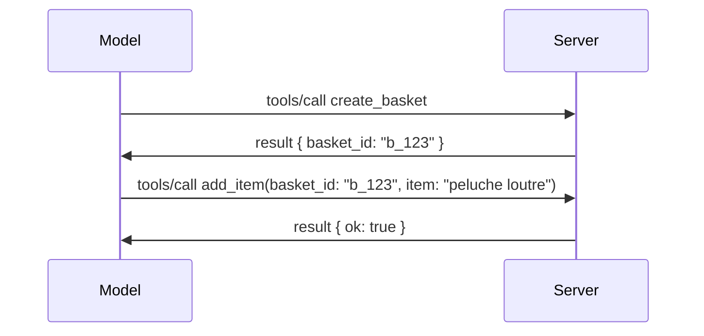

# Quelles sont les nouveautés dans MCP : Le Release Candidate du 2026-07-28

> **Statut :** Release Candidate. La spécification `2026-07-28` n'est pas finale au moment de la rédaction. Elle a été annoncée le 21 mai 2026, et est prévue pour la sortie le 28 juillet 2026. Tout ce qui est décrit dans cette leçon concerne le release candidate ; consultez la [spécification en brouillon](https://modelcontextprotocol.io/specification/draft) et son [journal des modifications](https://modelcontextprotocol.io/specification/draft/changelog) pour le dernier état avant de construire dessus. Le reste de ce cursus est basé sur la version stable actuelle, **MCP Specification 2025-11-25**, et sera mis à jour une fois que le `2026-07-28` sera publié.

## Vue d'ensemble

`2026-07-28` est la plus grande révision de MCP depuis son lancement. Six propositions d'amélioration de la spécification (SEPs) suppriment les sessions au niveau du protocole et rendent MCP sans état au niveau du transport, les extensions deviennent un mécanisme de premier plan et versionné, et plusieurs fonctionnalités que vous avez apprises plus tôt dans ce cursus (Roots, Sampling, Logging) sont désormais marquées comme obsolètes selon une nouvelle politique de cycle de vie. Cette leçon résume les changements, pourquoi ils sont importants, et ce que cela signifie pour le code que vous avez déjà écrit avec la version `2025-11-25`.

Source : [Le Release Candidate de la spécification MCP 2026-07-28](https://blog.modelcontextprotocol.io/posts/2026-07-28-release-candidate/) (Blog Model Context Protocol, David Soria Parra et Den Delimarsky).

## Objectifs d'apprentissage

À la fin de cette leçon, vous serez capable de :

- Expliquer pourquoi MCP migre vers un noyau de protocole sans état et quel problème cela résout pour les déploiements en scalabilité horizontale.
- Décrire comment la poignée de main `initialize`/`initialized` et l’en-tête `Mcp-Session-Id` sont remplacés.
- Identifier les nouveaux en-têtes `Mcp-Method` et `Mcp-Name` ainsi que les métadonnées de cache `ttlMs`/`cacheScope`.
- Reconnaître le cadre des Extensions et les deux extensions incluses dans cette version : MCP Apps et Tasks.
- Lister les six SEPs d’autorisation qui renforcent l’alignement sur OAuth 2.0 / OIDC.
- Identifier quelles fonctionnalités centrales (Roots, Sampling, Logging) sont maintenant déconseillées, et ce que cela signifie en pratique.
- Expliquer le changement vers un schéma JSON complet 2020-12 pour les `inputSchema`/`outputSchema` des outils.

## Un protocole sans état

Le changement principal : MCP devient sans état au niveau du protocole.

### Avant (2025-11-25) : les sessions vous lient à une instance de serveur

Appeler un outil via Streamable HTTP commence par une poignée de main `initialize`. Le serveur répond avec un en-tête `Mcp-Session-Id` que chaque requête suivante doit porter :

```http
POST /mcp HTTP/1.1
Mcp-Session-Id: 1868a90c-3a3f-4f5b
Content-Type: application/json

{"jsonrpc":"2.0","id":2,"method":"tools/call",
 "params":{"name":"search","arguments":{"q":"otters"}}}
```

Parce que la session est liée à l’instance de serveur qui l’a émise, les déploiements en scalabilité horizontale nécessitent un **routage collant** au niveau du répartiteur de charge et un **stockage partagé des sessions** entre instances.

### Après (2026-07-28) : chaque requête est autonome

```http
POST /mcp HTTP/1.1
MCP-Protocol-Version: 2026-07-28
Mcp-Method: tools/call
Mcp-Name: search
Content-Type: application/json

{"jsonrpc":"2.0","id":1,"method":"tools/call",
 "params":{"name":"search","arguments":{"q":"otters"},
           "_meta":{"io.modelcontextprotocol/clientInfo":{"name":"my-app","version":"1.0"}}}}
```

N’importe quelle instance de serveur peut gérer cette requête. Changements clés :

- **La poignée de main `initialize`/`initialized` est supprimée** ([SEP-2575](https://github.com/modelcontextprotocol/modelcontextprotocol/pull/2575)). La version du protocole, les informations du client et ses capacités passent dans `_meta` à chaque requête. Une nouvelle méthode `server/discover` permet au client de récupérer les capacités serveur en amont lorsqu’il en a besoin.
- **L’en-tête `Mcp-Session-Id` et la session au niveau protocolaire sont supprimés** ([SEP-2567](https://github.com/modelcontextprotocol/modelcontextprotocol/pull/2567)). Le routage collant et les stockages partagés de session ne sont plus requis au niveau du protocole.

### Protocole sans état, applications avec état

Supprimer la session au niveau protocolaire ne veut pas dire que votre serveur ne peut pas conserver un état. Le modèle recommandé est le même que celui utilisé historiquement par les API HTTP : générer un identifiant explicite (un `basket_id`, un `browser_id`) lors d’un appel d’outil, et faire passer cet identifiant en argument ordinaire lors des appels ultérieurs.



Cela rend l’état visible et raisonnable pour le modèle au lieu de le masquer dans des métadonnées de transport, et permet à n’importe quelle instance serveur de traiter n’importe quel appel.

### Requêtes serveur-vers-client, réorganisées

Un protocole sans état a toujours besoin d’un moyen pour qu’un serveur demande quelque chose au client au milieu d’un appel (par exemple, une invite de collecte d’informations) :

- **Les requêtes initiées par le serveur ne peuvent être émises que pendant que le serveur traite activement une requête client** ([SEP-2260](https://github.com/modelcontextprotocol/modelcontextprotocol/pull/2260)) — auparavant c’était une recommandation, désormais une exigence. L’utilisateur n’est jamais sollicité de manière intempestive.
- **Les requêtes multi-aller-retour** ([SEP-2322](https://github.com/modelcontextprotocol/modelcontextprotocol/pull/2322)) remplacent le maintien d’un flux SSE ouvert. À la place, le serveur retourne un `InputRequiredResult` :

  ```json
  {
    "resultType": "inputRequired",
    "inputRequests": {
      "confirm": {
        "type": "elicitation",
        "message": "Delete 3 files?",
        "schema": { "type": "boolean" }
      }
    },
    "requestState": "eyJzdGVwIjoxLCJmaWxlcyI6WyJhIiwiYiIsImMiXX0="
  }
  ```

  Le client collecte les réponses et réémet l’appel original avec `inputResponses` ainsi que le `requestState` en écho. N’importe quelle instance serveur peut reprendre la réémission car tout le nécessaire est dans la charge utile.

### Routable, cachable, traçable

Trois petits changements facilitent l’exploitation du trafic sans état :

- **Les en-têtes `Mcp-Method` et `Mcp-Name` sont obligatoires sur Streamable HTTP** ([SEP-2243](https://github.com/modelcontextprotocol/modelcontextprotocol/pull/2243)), pour que les répartiteurs de charge, gateways et limiteurs de débit puissent router selon l’opération sans inspecter le corps JSON. Les serveurs rejettent les requêtes aux en-têtes et corps discordants.
- **Les résultats de `tools/list` et les lectures de ressources transportent `ttlMs` et `cacheScope`** ([SEP-2549](https://github.com/modelcontextprotocol/modelcontextprotocol/pull/2549)), modélisés d’après HTTP `Cache-Control`. Les clients savent combien de temps un résultat de liste est valide et s’il peut être partagé entre utilisateurs, sans nécessiter un flux SSE longue durée pour être informés des changements.
- **La propagation du Contexte de Trace W3C dans `_meta` est documentée** ([SEP-414](https://github.com/modelcontextprotocol/modelcontextprotocol/pull/414)), précisant les noms de clé `traceparent`, `tracestate` et `baggage` pour qu’une trace distribuée puisse suivre un appel à travers le SDK client, le serveur MCP et les systèmes en aval dans un backend compatible [OpenTelemetry](https://opentelemetry.io/).

## Les extensions deviennent des concepts de premier plan

Les extensions existaient de façon informelle dans `2025-11-25`. [SEP-2133](https://github.com/modelcontextprotocol/modelcontextprotocol/pull/2133) les formalise :

- Les extensions sont identifiées par des identifiants DNS inversés.
- Elles sont négociées via une map `extensions` dans les capacités client et serveur.
- Elles vivent dans leurs propres dépôts `ext-*` avec des mainteneurs délégués et versionnent indépendamment de la spécification centrale.
- Une nouvelle piste Extensions dans le processus SEP leur donne un chemin de l’expérimental vers l’officiel.

Cette version inclut deux extensions officielles.

### MCP Apps : interfaces utilisateur rendues côté serveur

[MCP Apps](https://blog.modelcontextprotocol.io/posts/2026-01-26-mcp-apps/) ([SEP-1865](https://github.com/modelcontextprotocol/modelcontextprotocol/pull/1865)) permet aux serveurs d’envoyer des interfaces HTML interactives que les hôtes affichent dans un iframe sandboxé. Les outils déclarent leurs modèles d’interface à l’avance pour que les hôtes puissent précharger, mettre en cache et examiner la sécurité avant exécution. Vous avez déjà couvert les fondamentaux dans [Leçon 15 : MCP Apps](../03-GettingStarted/15-mcp-apps/README.md) — sous le cadre Extensions, MCP Apps est maintenant formellement une extension plutôt qu’une fonctionnalité centrale expérimentale.

### Tasks évolue vers une extension

Tasks est apparue comme une fonctionnalité centrale expérimentale dans `2025-11-25`. L’usage en production a révélé un besoin de refonte : la bonne place est désormais dans une extension : l'[extension Tasks](https://github.com/modelcontextprotocol/modelcontextprotocol/pull/2663) restructure le cycle de vie autour du modèle sans état — un serveur peut répondre à `tools/call` avec un identifiant de tâche, et le client la fait avancer avec `tasks/get`, `tasks/update` et `tasks/cancel`. La création de tâche est orientée serveur : le client annonce l’extension, et le serveur décide quand un appel doit être une tâche. `tasks/list` est supprimé parce qu’il ne peut pas être correctement borné sans sessions.

> **Note de migration :** si vous avez implémenté l’API Tasks expérimentale `2025-11-25`, vous devrez migrer vers le nouveau cycle de vie d’extension — il n’est pas rétrocompatible.

## Renforcement de l’autorisation

Six SEPs renforcent la [spécification d’autorisation](https://modelcontextprotocol.io/specification/draft/basic/authorization) pour un meilleur alignement avec les déploiements réels OAuth 2.0 / OpenID Connect :

| SEP | Changement |
|---|---|
| [SEP-2468](https://github.com/modelcontextprotocol/modelcontextprotocol/pull/2468) | Les clients doivent valider le paramètre `iss` dans les réponses d’autorisation selon [RFC 9207](https://www.rfc-editor.org/rfc/rfc9207), atténuant les attaques de confusion communes au pattern MCP client unique / serveurs multiples. Une version future exigera de rejeter les réponses sans `iss`. |
| [SEP-837](https://github.com/modelcontextprotocol/modelcontextprotocol/pull/837) | Les clients déclarent leur `application_type` OpenID Connect lors de l’enregistrement dynamique du client, évitant que les serveurs d’autorisation considèrent un client desktop/CLI par défaut comme `"web"` et rejettent son URI de redirection localhost. |
| [SEP-2352](https://github.com/modelcontextprotocol/modelcontextprotocol/pull/2352) | Les clients lient leurs identifiants enregistrés au `issuer` serveur d’autorisation émetteur et se réenregistrent quand une ressource migre entre serveurs d’autorisation. |
| [SEP-2207](https://github.com/modelcontextprotocol/modelcontextprotocol/pull/2207) | Documente comment demander des refresh tokens auprès de serveurs d’autorisation de type OpenID Connect. |
| [SEP-2350](https://github.com/modelcontextprotocol/modelcontextprotocol/pull/2350) | Clarifie l’accumulation de scope lors d’une autorisation renforcée (step-up). |
| [SEP-2351](https://github.com/modelcontextprotocol/modelcontextprotocol/pull/2351) | Clarifie le suffixe de découverte `.well-known`. |

Si vous construisez aujourd’hui un serveur d’autorisation pour MCP, commencez à fournir le champ `iss` dans les réponses d’autorisation — consultez [02-Security](../02-Security/README.md) pour les conseils actuels d’autorisation sur lesquels ceci s’appuiera.

## Roots, Sampling et Logging sont déconseillés

Sous la nouvelle [politique de cycle de vie des fonctionnalités](https://github.com/modelcontextprotocol/modelcontextprotocol/pull/2577) ([SEP-2577](https://github.com/modelcontextprotocol/modelcontextprotocol/pull/2577)), trois primitives client centrales que vous avez vues dans [Concepts fondamentaux](./README.md#roots) passent au statut **Déconseillé** :

| Fonctionnalité | Remplacement recommandé |
|---|---|
| Roots | Paramètres d’outil, URI de ressource, ou configuration serveur |
| Sampling | Intégration directe aux API des fournisseurs LLM |
| Logging | `stderr` pour les transports stdio ; OpenTelemetry pour l’observabilité structurée |

Ce sont des **dépréciations d’annotation uniquement** : les méthodes, types et drapeaux de capacité continuent de fonctionner dans cette version et dans toutes les versions publiées dans l’année qui suit. Supprimer totalement l’une d’elles nécessiterait un SEP séparé selon la politique de cycle de vie — donc rien ne casse dans vos exemples [Sampling](../03-GettingStarted/14-sampling/README.md) actuels, mais les nouveaux serveurs doivent préférer les modèles de remplacement ci-dessus.

## JSON Schema 2020-12 complet pour les outils

Les `inputSchema` et `outputSchema` des outils sont relevés au [JSON Schema 2020-12](https://json-schema.org/draft/2020-12) complet ([SEP-2106](https://github.com/modelcontextprotocol/modelcontextprotocol/pull/2106)) :

- Les schémas d’entrée gardent la contrainte racine `type: "object"` mais autorisent désormais la composition (`oneOf`, `anyOf`, `allOf`), les conditionnels et les références (`$ref`, `$defs`).
- Les schémas de sortie ne sont plus restreints, et `structuredContent` peut être n’importe quelle valeur JSON, pas uniquement un objet.
- Les implémentations ne doivent pas automatiquement déférencer les URI externes `$ref` et doivent limiter la profondeur de schéma et le temps de validation (une protection contre les attaques par déni de service à prendre en compte pour la validation serveur).

Par ailleurs, le code d’erreur pour une ressource manquante change de la valeur MCP custom `-32002` à la norme JSON-RPC `-32602` (Paramètres invalides) ([SEP-2164](https://github.com/modelcontextprotocol/modelcontextprotocol/pull/2164)). Si votre client détecte la valeur littérale `-32002`, vous devrez la mettre à jour.

## Comment le protocole évoluera dorénavant

Cette version contient des changements incompatibles, que les mainteneurs MCP ne souhaitent pas voir de manière récurrente. Trois SEPs de gouvernance visent à prévenir une répétition :

- La **politique de cycle de vie des fonctionnalités** donne à chaque fonctionnalité un parcours Actif → Déconseillé → Retiré avec au moins douze mois entre la dépréciation et le retrait possible le plus tôt.
- Le **cadre des Extensions** permet d’introduire de nouvelles capacités comme extensions opt-in et de les stabiliser là avant (éventuellement) de les intégrer au cœur de la spécification.

- Un SEP de piste standard ne peut plus atteindre le statut Final tant qu'un scénario correspondant ne figure pas dans la [suite de conformité](https://github.com/modelcontextprotocol/conformance) ([SEP-2484](https://github.com/modelcontextprotocol/modelcontextprotocol/pull/2484)) — la même suite contre laquelle le [système de niveaux SDK](https://github.com/modelcontextprotocol/modelcontextprotocol/pull/1777) évalue les SDK officiels.

## Calendrier de publication et validation

- Le candidat à la publication a été verrouillé le 21 mai 2026.
- La spécification finale est prévue pour le 28 juillet 2026.
- La période de dix semaines entre les deux permet aux mainteneurs du SDK et aux implémenteurs clients de valider les changements sur des charges de travail réelles ; les SDK de niveau 1 doivent fournir le support durant cette période selon le [système de niveaux SDK](https://modelcontextprotocol.io/docs/sdk).
- Suivez l'ensemble des changements dans la [spécification provisoire](https://modelcontextprotocol.io/specification/draft) et son [journal des modifications](https://modelcontextprotocol.io/specification/draft/changelog).

## Ce que cela signifie pour ce cursus

Tout ce que vous avez appris jusqu'à présent dans ce cours cible **2025-11-25**, qui reste la spécification stable actuelle jusqu'à la publication de `2026-07-28`. Concrètement :

- **Les sessions et la poignée de main `initialize`** (traitées dans [Concepts de base](./README.md) et [Leçon 6 : Streaming HTTP](../03-GettingStarted/06-http-streaming/README.md)) fonctionnent toujours comme documenté aujourd'hui, mais attendez-vous à ce qu'elles soient remplacées par le modèle de requête sans état ci-dessus dès que vous mettrez à jour vers des SDK compatibles `2026-07-28`.
- **L’échantillonnage et les racines** (également couverts dans [Concepts de base](./README.md)) restent pleinement fonctionnels mais sont obsolètes — les nouvelles conceptions doivent préférer les modèles de remplacement listés ci-dessus.
- **La fonctionnalité expérimentale Tasks**, si vous l'avez utilisée, devra être migrée vers le nouveau cycle de vie de l’extension Tasks.
- **Applications MCP** ([Leçon 15](../03-GettingStarted/15-mcp-apps/README.md)) n’est pas affectée en pratique ; elle est simplement déplacée sous le cadre formel des Extensions.

## Ressources supplémentaires

- [Candidat à la publication de la spécification MCP 2026-07-28 (article de blog)](https://blog.modelcontextprotocol.io/posts/2026-07-28-release-candidate/)
- [L’avenir des transports MCP](https://blog.modelcontextprotocol.io/posts/2025-12-19-mcp-transport-future/)
- [Spécification provisoire MCP](https://modelcontextprotocol.io/specification/draft)
- [Journal des modifications provisoire MCP](https://modelcontextprotocol.io/specification/draft/changelog)
- [Directives SEP](https://modelcontextprotocol.io/community/sep-guidelines)
- [Système de niveaux SDK MCP](https://modelcontextprotocol.io/docs/sdk)

## Étapes suivantes

Revenez à [Concepts de base](./README.md) ou continuez vers [Sécurité](../02-Security/README.md) pour voir comment les recommandations d’aujourd’hui `2025-11-25` correspondent à ce qui arrive.

---

<!-- CO-OP TRANSLATOR DISCLAIMER START -->
**Avertissement** :
Ce document a été traduit à l'aide du service de traduction automatique [Co-op Translator](https://github.com/Azure/co-op-translator). Bien que nous nous efforçions d'assurer l'exactitude, veuillez noter que les traductions automatisées peuvent contenir des erreurs ou des inexactitudes. Le document original dans sa langue native doit être considéré comme la source faisant autorité. Pour les informations critiques, il est recommandé de recourir à une traduction professionnelle réalisée par un humain. Nous ne saurions être tenus responsables des malentendus ou erreurs d'interprétation découlant de l'utilisation de cette traduction.
<!-- CO-OP TRANSLATOR DISCLAIMER END -->