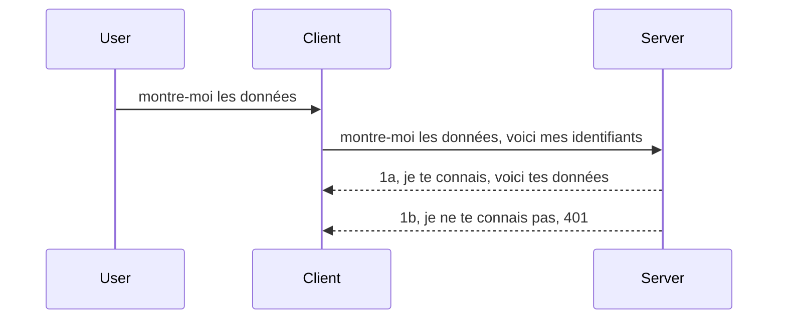

# Authentification simple

Les SDK MCP supportent l’utilisation d’OAuth 2.1 qui, pour être honnête, est un processus assez complexe impliquant des concepts comme le serveur d’authentification, le serveur de ressources, l’envoi des identifiants, l’obtention d’un code, l’échange du code contre un token bearer jusqu’à ce que vous puissiez enfin obtenir les données de la ressource. Si vous n’êtes pas habitué à OAuth, ce qui est une excellente chose à implémenter, il est judicieux de commencer par un niveau d’authentification basique et de monter en sécurité progressivement. C’est pourquoi ce chapitre existe, pour vous préparer à une authentification plus avancée.

## Authentification, que voulons-nous dire ?

L’authentification est l’abréviation d’authentification et d’autorisation. L’idée est que nous devons faire deux choses :

- **Authentification**, qui est le processus permettant de déterminer si l’on laisse une personne entrer dans notre maison, c’est-à-dire si elle a le droit d’être « ici », c’est-à-dire avoir accès à notre serveur de ressources où vivent les fonctionnalités de notre serveur MCP.
- **Autorisation**, est le processus pour savoir si un utilisateur doit avoir accès à ces ressources spécifiques qu’il demande, par exemple ces commandes ou ces produits, ou s’il est autorisé à lire le contenu mais pas à le supprimer par exemple.

## Identifiants : comment nous disons au système qui nous sommes

Eh bien, la plupart des développeurs web commencent à penser en termes de fournir un identifiant au serveur, généralement un secret qui dit s’ils sont autorisés à être ici (« Authentification »). Cet identifiant est généralement une version encodée en base64 du nom d’utilisateur et du mot de passe ou une clé API qui identifie de manière unique un utilisateur spécifique.

Cela implique de l’envoyer via un en-tête appelé « Authorization » comme ceci :

```json
{ "Authorization": "secret123" }
```

Ceci est généralement appelé authentification basique. Le fonctionnement général est le suivant :



Maintenant que nous comprenons comment cela fonctionne au niveau du flux, comment l’implémenter ? Eh bien, la plupart des serveurs web ont un concept appelé middleware, une partie de code qui s’exécute dans le cadre de la requête et qui peut vérifier les identifiants, et si ceux-ci sont valides, laisser passer la requête. Si la requête ne contient pas d’identifiants valides, vous obtenez une erreur d’authentification. Voyons comment cela peut être implémenté :

**Python**

```python
class AuthMiddleware(BaseHTTPMiddleware):
    async def dispatch(self, request, call_next):

        has_header = request.headers.get("Authorization")
        if not has_header:
            print("-> Missing Authorization header!")
            return Response(status_code=401, content="Unauthorized")

        if not valid_token(has_header):
            print("-> Invalid token!")
            return Response(status_code=403, content="Forbidden")

        print("Valid token, proceeding...")
       
        response = await call_next(request)
        # ajouter des en-têtes client ou modifier la réponse d'une manière quelconque
        return response


starlette_app.add_middleware(CustomHeaderMiddleware)
```

Ici, nous avons : 

- Créé un middleware appelé `AuthMiddleware` où sa méthode `dispatch` est invoquée par le serveur web.
- Ajouté le middleware au serveur web :

    ```python
    starlette_app.add_middleware(AuthMiddleware)
    ```

- Écrit une logique de validation qui vérifie si l’en-tête Authorization est présent et si le secret envoyé est valide :

    ```python
    has_header = request.headers.get("Authorization")
    if not has_header:
        print("-> Missing Authorization header!")
        return Response(status_code=401, content="Unauthorized")

    if not valid_token(has_header):
        print("-> Invalid token!")
        return Response(status_code=403, content="Forbidden")
    ```

    si le secret est présent et valide, nous laissons passer la requête en appelant `call_next` et retournons la réponse.

    ```python
    response = await call_next(request)
    # ajouter les en-têtes client ou modifier la réponse d'une certaine manière
    return response
    ```

Le fonctionnement est que lorsqu’une requête web est faite vers le serveur, le middleware sera invoqué et selon son implémentation, il laissera passer la requête ou renverra une erreur indiquant que le client n’est pas autorisé à continuer.

**TypeScript**

Ici, nous créons un middleware avec le framework populaire Express et interceptons la requête avant qu’elle n’atteigne le serveur MCP. Voici le code pour cela :

```typescript
function isValid(secret) {
    return secret === "secret123";
}

app.use((req, res, next) => {
    // 1. En-tête d'autorisation présent ?
    if(!req.headers["Authorization"]) {
        res.status(401).send('Unauthorized');
    }
    
    let token = req.headers["Authorization"];

    // 2. Vérifier la validité.
    if(!isValid(token)) {
        res.status(403).send('Forbidden');
    }

   
    console.log('Middleware executed');
    // 3. Passe la requête à l'étape suivante dans le pipeline de requête.
    next();
});
```

Dans ce code, nous :

1. Vérifions si l’en-tête Authorization est présent en premier lieu, sinon, nous envoyons une erreur 401.
2. Vérifions que l’identifiant/token est valide, sinon, nous envoyons une erreur 403.
3. Enfin, laissons passer la requête dans la pipeline de requête et retournons la ressource demandée.

## Exercice : Implémenter l’authentification

Mettons nos connaissances en pratique et essayons de l’implémenter. Voici le plan :

Serveur

- Créer un serveur web et une instance MCP.
- Implémenter un middleware pour le serveur.

Client 

- Envoyer une requête web, avec identifiant, via un en-tête.

### -1- Créer un serveur web et une instance MCP

> **Regard vers l’avant :** l’exemple TypeScript ci-dessous suit les transports HTTP dans une map `transports` indexée par `mcp-session-id`, selon la **Spécification MCP 2025-11-25**. Le candidat à la version `2026-07-28` supprime complètement la poignée de main `initialize` et l’ID de session, donc cette map de transport par session disparaît au bénéfice de requêtes sans état et autonomes. Voir [Ce qui change dans MCP : Le candidat à la version 2026-07-28](../../01-CoreConcepts/mcp-2026-07-28-release-candidate.md).

Dans notre première étape, nous devons créer l’instance du serveur web et le serveur MCP.

**Python**

Ici, nous créons une instance de serveur MCP, créons une application starlette web et l’hébergeons avec uvicorn.

```python
# création du serveur MCP

app = FastMCP(
    name="MCP Resource Server",
    instructions="Resource Server that validates tokens via Authorization Server introspection",
    host=settings["host"],
    port=settings["port"],
    debug=True
)

# création de l'application web starlette
starlette_app = app.streamable_http_app()

# service de l'application via uvicorn
async def run(starlette_app):
    import uvicorn
    config = uvicorn.Config(
            starlette_app,
            host=app.settings.host,
            port=app.settings.port,
            log_level=app.settings.log_level.lower(),
        )
    server = uvicorn.Server(config)
    await server.serve()

run(starlette_app)
```

Dans ce code, nous :

- Créons le serveur MCP.
- Construisons l’application starlette web à partir du serveur MCP, `app.streamable_http_app()`.
- Hébergeons et servons l’application web utilisant uvicorn `server.serve()`.

**TypeScript**

Ici, nous créons une instance du serveur MCP.

```typescript
const server = new McpServer({
      name: "example-server",
      version: "1.0.0"
    });

    // ... configurer les ressources serveur, les outils et les invites ...
```

Cette création du serveur MCP devra se faire dans notre définition de route POST /mcp, prenons donc le code ci-dessus et déplaçons-le ainsi :

```typescript
import express from "express";
import { randomUUID } from "node:crypto";
import { McpServer } from "@modelcontextprotocol/sdk/server/mcp.js";
import { StreamableHTTPServerTransport } from "@modelcontextprotocol/sdk/server/streamableHttp.js";
import { isInitializeRequest } from "@modelcontextprotocol/sdk/types.js"

const app = express();
app.use(express.json());

// Carte pour stocker les transports par ID de session
const transports: { [sessionId: string]: StreamableHTTPServerTransport } = {};

// Gérer les requêtes POST pour la communication client-serveur
app.post('/mcp', async (req, res) => {
  // Vérifier l'existence de l'ID de session
  const sessionId = req.headers['mcp-session-id'] as string | undefined;
  let transport: StreamableHTTPServerTransport;

  if (sessionId && transports[sessionId]) {
    // Réutiliser le transport existant
    transport = transports[sessionId];
  } else if (!sessionId && isInitializeRequest(req.body)) {
    // Nouvelle requête d'initialisation
    transport = new StreamableHTTPServerTransport({
      sessionIdGenerator: () => randomUUID(),
      onsessioninitialized: (sessionId) => {
        // Stocker le transport par ID de session
        transports[sessionId] = transport;
      },
      // La protection contre le rebinding DNS est désactivée par défaut pour la compatibilité rétroactive. Si vous exécutez ce serveur
      // localement, assurez-vous de définir :
      // enableDnsRebindingProtection : true,
      // allowedHosts : ['127.0.0.1'],
    });

    // Nettoyer le transport lorsqu'il est fermé
    transport.onclose = () => {
      if (transport.sessionId) {
        delete transports[transport.sessionId];
      }
    };
    const server = new McpServer({
      name: "example-server",
      version: "1.0.0"
    });

    // ... configurer les ressources, outils et invites du serveur ...

    // Se connecter au serveur MCP
    await server.connect(transport);
  } else {
    // Requête invalide
    res.status(400).json({
      jsonrpc: '2.0',
      error: {
        code: -32000,
        message: 'Bad Request: No valid session ID provided',
      },
      id: null,
    });
    return;
  }

  // Traiter la requête
  await transport.handleRequest(req, res, req.body);
});

// Gestionnaire réutilisable pour les requêtes GET et DELETE
const handleSessionRequest = async (req: express.Request, res: express.Response) => {
  const sessionId = req.headers['mcp-session-id'] as string | undefined;
  if (!sessionId || !transports[sessionId]) {
    res.status(400).send('Invalid or missing session ID');
    return;
  }
  
  const transport = transports[sessionId];
  await transport.handleRequest(req, res);
};

// Gérer les requêtes GET pour les notifications serveur-client via SSE
app.get('/mcp', handleSessionRequest);

// Gérer les requêtes DELETE pour la terminaison de session
app.delete('/mcp', handleSessionRequest);

app.listen(3000);
```

Vous voyez maintenant comment la création du serveur MCP a été déplacée dans `app.post("/mcp")`.

Passons à l’étape suivante : créer le middleware pour valider l’identifiant reçu.

### -2- Implémenter un middleware pour le serveur

Passons maintenant à la partie middleware. Ici, nous allons créer un middleware qui cherche un identifiant dans l’en-tête `Authorization` puis le valide. S’il est acceptable, la requête continuera pour faire ce qu’elle doit faire (par exemple lister les outils, lire une ressource ou toute autre fonctionnalité MCP demandée par le client).

**Python**

Pour créer le middleware, nous devons créer une classe qui hérite de `BaseHTTPMiddleware`. Deux éléments sont intéressants :

- La requête `request`, dont nous lisons les informations d’en-tête.
- `call_next` le callback que nous devons invoquer si le client a fourni un identifiant que nous acceptons.

D’abord, nous devons gérer le cas où l’en-tête `Authorization` est absent :

```python
has_header = request.headers.get("Authorization")

# aucun en-tête présent, échouer avec 401, sinon continuer.
if not has_header:
    print("-> Missing Authorization header!")
    return Response(status_code=401, content="Unauthorized")
```

Ici, nous envoyons un message 401 non autorisé car le client ne réussit pas l’authentification.

Ensuite, si un identifiant a été soumis, nous devons vérifier sa validité comme ceci :

```python
 if not valid_token(has_header):
    print("-> Invalid token!")
    return Response(status_code=403, content="Forbidden")
```

Notez comment nous envoyons un message 403 interdit ci-dessus. Voyons le middleware complet ci-dessous implémentant tout ce que nous avons mentionné :

```python
class AuthMiddleware(BaseHTTPMiddleware):
    async def dispatch(self, request, call_next):

        has_header = request.headers.get("Authorization")
        if not has_header:
            print("-> Missing Authorization header!")
            return Response(status_code=401, content="Unauthorized")

        if not valid_token(has_header):
            print("-> Invalid token!")
            return Response(status_code=403, content="Forbidden")

        print("Valid token, proceeding...")
        print(f"-> Received {request.method} {request.url}")
        response = await call_next(request)
        response.headers['Custom'] = 'Example'
        return response

```

Très bien, mais qu’en est-il de la fonction `valid_token` ? La voici :

```python
# NE PAS utiliser en production - améliorez-le !!
def valid_token(token: str) -> bool:
    # enlever le préfixe "Bearer "
    if token.startswith("Bearer "):
        token = token[7:]
        return token == "secret-token"
    return False
```

Évidemment, cela devrait être amélioré. 

IMPORTANT : Vous ne devez JAMAIS avoir des secrets comme celui-ci dans le code. Idéalement, vous devez récupérer la valeur à comparer depuis une source de données ou un fournisseur d’identité (IDP) ou mieux, laisser l’IDP faire la validation.

**TypeScript**

Pour implémenter cela avec Express, nous devons appeler la méthode `use` qui prend des fonctions middleware.

Nous devons :

- Interagir avec la variable request pour vérifier l’identifiant passé dans la propriété `Authorization`.
- Valider cet identifiant, et s’il est valide, laisser la requête continuer et faire ce que la demande MCP du client doit faire (par exemple lister les outils, lire la ressource ou toute autre demande MCP).

Ici, nous vérifions si l’en-tête `Authorization` est présent et si ce n’est pas le cas, nous bloquons la requête :

```typescript
if(!req.headers["authorization"]) {
    res.status(401).send('Unauthorized');
    return;
}
```

Si l’en-tête n’est pas envoyé, vous recevez un 401.

Ensuite, nous vérifions si l’identifiant est valide, sinon nous bloquons la requête avec un message légèrement différent :

```typescript
if(!isValid(token)) {
    res.status(403).send('Forbidden');
    return;
} 
```

Notez que vous obtenez maintenant une erreur 403.

Voici le code complet :

```typescript
app.use((req, res, next) => {
    console.log('Request received:', req.method, req.url, req.headers);
    console.log('Headers:', req.headers["authorization"]);
    if(!req.headers["authorization"]) {
        res.status(401).send('Unauthorized');
        return;
    }
    
    let token = req.headers["authorization"];

    if(!isValid(token)) {
        res.status(403).send('Forbidden');
        return;
    }  

    console.log('Middleware executed');
    next();
});
```

Nous avons configuré le serveur web pour accepter un middleware qui vérifie l’identifiant que le client est censé nous envoyer. Qu’en est-il du client lui-même ?

### -3- Envoyer une requête web avec l’identifiant dans l’en-tête

Nous devons nous assurer que le client passe cet identifiant dans l’en-tête. Comme nous allons utiliser un client MCP, nous devons voir comment faire cela.

**Python**

Pour le client, nous devons passer un en-tête avec l’identifiant comme ceci :

```python
# NE PAS coder en dur la valeur, ayez-la au minimum dans une variable d'environnement ou un stockage plus sécurisé
token = "secret-token"

async with streamablehttp_client(
        url = f"http://localhost:{port}/mcp",
        headers = {"Authorization": f"Bearer {token}"}
    ) as (
        read_stream,
        write_stream,
        session_callback,
    ):
        async with ClientSession(
            read_stream,
            write_stream
        ) as session:
            await session.initialize()
      
            # À FAIRE, ce que vous voulez faire dans le client, par ex. lister les outils, appeler les outils, etc.
```

Notez comment nous remplissons la propriété `headers` ainsi : ` headers = {"Authorization": f"Bearer {token}"}`.

**TypeScript**

Nous pouvons résoudre cela en deux étapes :

1. Remplir un objet de configuration avec notre identifiant.
2. Passer cet objet de configuration au transport.

```typescript

// NE PAS coder en dur la valeur comme montré ici. Au minimum, ayez-la comme une variable d'environnement et utilisez quelque chose comme dotenv (en mode dev).
let token = "secret123"

// définir un objet d'options de transport client
let options: StreamableHTTPClientTransportOptions = {
  sessionId: sessionId,
  requestInit: {
    headers: {
      "Authorization": "secret123"
    }
  }
};

// passer l'objet d'options au transport
async function main() {
   const transport = new StreamableHTTPClientTransport(
      new URL(serverUrl),
      options
   );
```

Ici, vous voyez comment nous avons créé un objet `options` et mis nos en-têtes sous la propriété `requestInit`.

IMPORTANT : Comment l’améliorer à partir d’ici ? Eh bien, l’implémentation actuelle présente des problèmes. D’abord, passer un identifiant de cette façon est assez risqué à moins d’avoir au minimum HTTPS. Même dans ce cas, l’identifiant peut être volé, vous avez besoin d’un système où vous pouvez facilement révoquer le token et ajouter des contrôles supplémentaires comme d’où dans le monde il vient, si la requête arrive trop souvent (comportement de bot), en résumé, il y a toute une série de préoccupations.

Cela dit, pour des API très simples où vous ne voulez pas que quelqu’un appelle votre API sans être authentifié, ce que nous avons ici est un bon départ.

Cela dit, essayons de renforcer un peu la sécurité en utilisant un format standardisé comme JSON Web Token, également connu sous le nom de JWT ou tokens « JOT ».

## JSON Web Tokens, JWT

Donc, nous essayons d’améliorer les choses à partir de l’envoi de simples identifiants. Quels sont les améliorations immédiates en adoptant JWT ?

- **Améliorations de sécurité**. Dans l’authentification basique, vous envoyez le nom d’utilisateur et le mot de passe codé en base64 (ou vous envoyez une clé API) encore et encore ce qui augmente le risque. Avec JWT, vous envoyez votre nom d’utilisateur et mot de passe et recevez un token en retour qui est également limité dans le temps, donc il expire. JWT vous permet un contrôle d’accès fin via les rôles, étendues et permissions.
- **Sans état et montée en charge**. Les JWT sont autonomes, ils contiennent toutes les infos utilisateur et éliminent la nécessité de stockage de session côté serveur. Le token peut également être validé localement.
- **Interopérabilité et fédération**. Les JWT sont au centre d’Open ID Connect et sont utilisés avec des fournisseurs d’identité connus comme Entra ID, Google Identity et Auth0. Ils permettent également l’authentification unique (SSO) et bien plus, ce qui les rend aptes aux entreprises.
- **Modularité et flexibilité**. Les JWT peuvent aussi être utilisés avec des API Gateways comme Azure API Management, NGINX, etc. Ils supportent aussi des scénarios d’authentification et communication serveur-à-service incluant usurpation et délégation.
- **Performance et mise en cache**. Les JWT peuvent être mis en cache après décodage ce qui réduit le besoin de parser. Cela aide particulièrement les applications à fort trafic car cela améliore le débit et réduit la charge sur l’infrastructure choisie.
- **Fonctionnalités avancées**. Ils supportent aussi l’introspection (vérification de validité sur serveur) et la révocation (rendre un token invalide).

Avec tous ces bénéfices, voyons comment passer notre implémentation au niveau supérieur.

## Transformer l’authentification basique en JWT

Donc, les changements à faire, de manière globale, sont :

- **Apprendre à construire un token JWT** et le préparer pour être envoyé du client vers le serveur.
- **Valider un token JWT**, et si valide, laisser le client accéder à nos ressources.
- **Stockage sécurisé des tokens**. Comment stocker ce token.
- **Protéger les routes**. Nous devons protéger les routes, en l’occurrence celles des fonctionnalités MCP spécifiques.
- **Ajouter des tokens de rafraîchissement**. Assurer d’avoir des tokens courts mais des tokens de rafraîchissement longs qui peuvent être utilisés pour obtenir de nouveaux tokens s’ils expirent. Aussi, avoir un endpoint de rafraîchissement et une stratégie de rotation.

### -1- Construire un token JWT

Tout d’abord, un token JWT a les parties suivantes :

- **header**, algorithme utilisé et type de token.
- **payload**, claims, comme sub (utilisateur ou entité que représente le token, généralement l’id utilisateur dans un scénario d’authentification), exp (date d’expiration) role (le rôle)
- **signature**, signée avec un secret ou une clé privée.

Pour cela, nous devons construire le header, le payload et le token encodé.

**Python**

```python

import jwt
import jwt
from jwt.exceptions import ExpiredSignatureError, InvalidTokenError
import datetime

# Clé secrète utilisée pour signer le JWT
secret_key = 'your-secret-key'

header = {
    "alg": "HS256",
    "typ": "JWT"
}

# les informations de l'utilisateur, ses revendications et son temps d'expiration
payload = {
    "sub": "1234567890",               # Sujet (ID utilisateur)
    "name": "User Userson",                # Réclamation personnalisée
    "admin": True,                     # Réclamation personnalisée
    "iat": datetime.datetime.utcnow(),# Délivré à
    "exp": datetime.datetime.utcnow() + datetime.timedelta(hours=1)  # Expiration
}

# l'encoder
encoded_jwt = jwt.encode(payload, secret_key, algorithm="HS256", headers=header)
```

Dans le code ci-dessus, nous avons :

- Défini un header utilisant HS256 comme algorithme et le type JWT.
- Construit un payload contenant un sujet ou un ID utilisateur, un nom d’utilisateur, un rôle, la date d’émission et la date d’expiration, implémentant ainsi la notion de validité temporelle dont nous avons parlé plus tôt.

**TypeScript**

Ici, nous aurons besoin de dépendances qui nous aideront à construire le token JWT.

Dépendances

```sh

npm install jsonwebtoken
npm install --save-dev @types/jsonwebtoken
```

Maintenant que tout ça est en place, créons le header, le payload et par là-même le token codé.

```typescript
import jwt from 'jsonwebtoken';

const secretKey = 'your-secret-key'; // Utiliser les variables d'environnement en production

// Définir la charge utile
const payload = {
  sub: '1234567890',
  name: 'User usersson',
  admin: true,
  iat: Math.floor(Date.now() / 1000), // Émis à
  exp: Math.floor(Date.now() / 1000) + 60 * 60 // Expire dans 1 heure
};

// Définir l'en-tête (optionnel, jsonwebtoken définit les valeurs par défaut)
const header = {
  alg: 'HS256',
  typ: 'JWT'
};

// Créer le jeton
const token = jwt.sign(payload, secretKey, {
  algorithm: 'HS256',
  header: header
});

console.log('JWT:', token);
```

Ce token est :

Signé avec HS256
Valable 1 heure
Inclus des claims comme sub, name, admin, iat et exp.

### -2- Valider un token

Nous devrons aussi valider un token, c’est quelque chose à faire côté serveur pour garantir que ce que le client nous envoie est valide. Il y a beaucoup de contrôles à faire ici, de la validation de structure à sa validité. Il est aussi conseillé d’ajouter d’autres contrôles pour vérifier si l’utilisateur est dans votre système, etc.

Pour valider un token, nous devons le décoder pour le lire puis commencer à vérifier sa validité :

**Python**

```python

# Décoder et vérifier le JWT
try:
    decoded = jwt.decode(token, secret_key, algorithms=["HS256"])
    print("✅ Token is valid.")
    print("Decoded claims:")
    for key, value in decoded.items():
        print(f"  {key}: {value}")
except ExpiredSignatureError:
    print("❌ Token has expired.")
except InvalidTokenError as e:
    print(f"❌ Invalid token: {e}")

```


Dans ce code, nous appelons `jwt.decode` en utilisant le token, la clé secrète et l'algorithme choisi en entrée. Notez comment nous utilisons une construction try-catch car une validation échouée mène à une erreur.

**TypeScript**

Ici, nous devons appeler `jwt.verify` pour obtenir une version décodée du token que nous pouvons analyser plus en détail. Si cet appel échoue, cela signifie que la structure du token est incorrecte ou qu'il n'est plus valide.

```typescript

try {
  const decoded = jwt.verify(token, secretKey);
  console.log('Decoded Payload:', decoded);
} catch (err) {
  console.error('Token verification failed:', err);
}
```

REMARQUE : comme mentionné précédemment, nous devrions effectuer des vérifications supplémentaires pour nous assurer que ce token désigne un utilisateur dans notre système et que l'utilisateur dispose des droits qu'il prétend avoir.

Ensuite, penchons-nous sur le contrôle d'accès basé sur les rôles, aussi appelé RBAC.

## Ajout du contrôle d'accès basé sur les rôles

L'idée est que nous voulons exprimer que différents rôles ont différentes permissions. Par exemple, nous supposons qu'un administrateur peut tout faire, qu'un utilisateur normal peut lire/écrire et qu'un invité ne peut que lire. Voici donc quelques niveaux de permission possibles :

- Admin.Write
- User.Read
- Guest.Read

Voyons comment nous pouvons implémenter ce type de contrôle avec un middleware. Les middlewares peuvent être ajoutés par route ainsi que pour toutes les routes.

**Python**

```python
from starlette.middleware.base import BaseHTTPMiddleware
from starlette.responses import JSONResponse
import jwt

# NE PAS avoir le secret dans le code comme ça, c'est uniquement à des fins de démonstration. Lisez-le depuis un endroit sûr.
SECRET_KEY = "your-secret-key" # mettre cela dans une variable d'environnement
REQUIRED_PERMISSION = "User.Read"

class JWTPermissionMiddleware(BaseHTTPMiddleware):
    async def dispatch(self, request, call_next):
        auth_header = request.headers.get("Authorization")
        if not auth_header or not auth_header.startswith("Bearer "):
            return JSONResponse({"error": "Missing or invalid Authorization header"}, status_code=401)

        token = auth_header.split(" ")[1]
        try:
            decoded = jwt.decode(token, SECRET_KEY, algorithms=["HS256"])
        except jwt.ExpiredSignatureError:
            return JSONResponse({"error": "Token expired"}, status_code=401)
        except jwt.InvalidTokenError:
            return JSONResponse({"error": "Invalid token"}, status_code=401)

        permissions = decoded.get("permissions", [])
        if REQUIRED_PERMISSION not in permissions:
            return JSONResponse({"error": "Permission denied"}, status_code=403)

        request.state.user = decoded
        return await call_next(request)


```

Il y a plusieurs façons différentes d'ajouter le middleware comme ci-dessous :

```python

# Alt 1 : ajouter un middleware lors de la construction de l'application starlette
middleware = [
    Middleware(JWTPermissionMiddleware)
]

app = Starlette(routes=routes, middleware=middleware)

# Alt 2 : ajouter un middleware après que l'application starlette est déjà construite
starlette_app.add_middleware(JWTPermissionMiddleware)

# Alt 3 : ajouter un middleware par route
routes = [
    Route(
        "/mcp",
        endpoint=..., # gestionnaire
        middleware=[Middleware(JWTPermissionMiddleware)]
    )
]
```

**TypeScript**

Nous pouvons utiliser `app.use` et un middleware qui s'exécutera pour toutes les requêtes.

```typescript
app.use((req, res, next) => {
    console.log('Request received:', req.method, req.url, req.headers);
    console.log('Headers:', req.headers["authorization"]);

    // 1. Vérifiez si l'en-tête d'autorisation a été envoyé

    if(!req.headers["authorization"]) {
        res.status(401).send('Unauthorized');
        return;
    }
    
    let token = req.headers["authorization"];

    // 2. Vérifiez si le jeton est valide
    if(!isValid(token)) {
        res.status(403).send('Forbidden');
        return;
    }  

    // 3. Vérifiez si l'utilisateur du jeton existe dans notre système
    if(!isExistingUser(token)) {
        res.status(403).send('Forbidden');
        console.log("User does not exist");
        return;
    }
    console.log("User exists");

    // 4. Vérifiez que le jeton a les bonnes autorisations
    if(!hasScopes(token, ["User.Read"])){
        res.status(403).send('Forbidden - insufficient scopes');
    }

    console.log("User has required scopes");

    console.log('Middleware executed');
    next();
});

```

Il y a plusieurs choses que notre middleware peut faire et que notre middleware DOIT faire, à savoir :

1. Vérifier si l'en-tête d'autorisation est présent
2. Vérifier si le token est valide, nous appelons `isValid` qui est une méthode que nous avons écrite qui vérifie l'intégrité et la validité du token JWT.
3. Vérifier que l'utilisateur existe dans notre système, nous devrions vérifier cela.

   ```typescript
    // utilisateurs dans la base de données
   const users = [
     "user1",
     "User usersson",
   ]

   function isExistingUser(token) {
     let decodedToken = verifyToken(token);

     // À FAIRE, vérifier si l'utilisateur existe dans la base de données
     return users.includes(decodedToken?.name || "");
   }
   ```

   Ci-dessus, nous avons créé une liste très simple `users`, qui devrait évidemment être dans une base de données.

4. De plus, nous devrions aussi vérifier que le token possède les bonnes permissions.

   ```typescript
   if(!hasScopes(token, ["User.Read"])){
        res.status(403).send('Forbidden - insufficient scopes');
   }
   ```

   Dans ce code ci-dessus du middleware, nous vérifions que le token contient la permission User.Read, sinon nous renvoyons une erreur 403. Voici la méthode d'assistance `hasScopes`.

   ```typescript
   function hasScopes(scope: string, requiredScopes: string[]) {
     let decodedToken = verifyToken(scope);
    return requiredScopes.every(scope => decodedToken?.scopes.includes(scope));
  }
   ```

Have a think which additional checks you should be doing, but these are the absolute minimum of checks you should be doing.

Using Express as a web framework is a common choice. There are helpers library when you use JWT so you can write less code.

- `express-jwt`, helper library that provides a middleware that helps decode your token.
- `express-jwt-permissions`, this provides a middleware `guard` that helps check if a certain permission is on the token.

Here's what these libraries can look like when used:

```typescript
const express = require('express');
const jwt = require('express-jwt');
const guard = require('express-jwt-permissions')();

const app = express();
const secretKey = 'your-secret-key'; // put this in env variable

// Decode JWT and attach to req.user
app.use(jwt({ secret: secretKey, algorithms: ['HS256'] }));

// Check for User.Read permission
app.use(guard.check('User.Read'));

// multiple permissions
// app.use(guard.check(['User.Read', 'Admin.Access']));

app.get('/protected', (req, res) => {
  res.json({ message: `Welcome ${req.user.name}` });
});

// Error handler
app.use((err, req, res, next) => {
  if (err.code === 'permission_denied') {
    return res.status(403).send('Forbidden');
  }
  next(err);
});

```

Maintenant que vous avez vu comment un middleware peut être utilisé à la fois pour l'authentification et l'autorisation, qu'en est-il de MCP, cela change-t-il la façon dont nous faisons l'authentification ? Découvrons-le dans la section suivante.

### -3- Ajouter le RBAC à MCP

Vous avez vu jusqu'à présent comment ajouter du RBAC via un middleware, cependant, pour MCP il n'y a pas de moyen simple d'ajouter un RBAC par fonctionnalité MCP, alors que fait-on ? Eh bien, nous devons simplement ajouter du code comme celui-ci qui vérifie dans ce cas si le client a les droits d'appeler un outil spécifique :

Vous avez plusieurs choix pour accomplir un RBAC par fonctionnalité, en voici quelques-uns :

- Ajouter une vérification pour chaque outil, ressource, prompt où vous devez vérifier le niveau de permission.

   **python**

   ```python
   @tool()
   def delete_product(id: int):
      try:
          check_permissions(role="Admin.Write", request)
      catch:
        pass # le client a échoué à l'autorisation, générer une erreur d'autorisation
   ```

   **typescript**

   ```typescript
   server.registerTool(
    "delete-product",
    {
      title: Delete a product",
      description: "Deletes a product",
      inputSchema: { id: z.number() }
    },
    async ({ id }) => {
      
      try {
        checkPermissions("Admin.Write", request);
        // todo, envoyer l'identifiant à productService et à l'entrée distante
      } catch(Exception e) {
        console.log("Authorization error, you're not allowed");  
      }

      return {
        content: [{ type: "text", text: `Deletected product with id ${id}` }]
      };
    }
   );
   ```


- Utiliser une approche serveur avancée et les gestionnaires de requêtes afin de minimiser le nombre d'endroits où vous devez faire la vérification.

   **Python**

   ```python
   
   tool_permission = {
      "create_product": ["User.Write", "Admin.Write"],
      "delete_product": ["Admin.Write"]
   }

   def has_permission(user_permissions, required_permissions) -> bool:
      # user_permissions : liste des permissions que l'utilisateur possède
      # required_permissions : liste des permissions requises pour l'outil
      return any(perm in user_permissions for perm in required_permissions)

   @server.call_tool()
   async def handle_call_tool(
     name: str, arguments: dict[str, str] | None
   ) -> list[types.TextContent]:
    # Supposer que request.user.permissions est une liste des permissions de l'utilisateur
     user_permissions = request.user.permissions
     required_permissions = tool_permission.get(name, [])
     if not has_permission(user_permissions, required_permissions):
        # Lancer l'erreur "Vous n'avez pas la permission d'appeler l'outil {name}"
        raise Exception(f"You don't have permission to call tool {name}")
     # continuer et appeler l'outil
     # ...
   ```   
   

   **TypeScript**

   ```typescript
   function hasPermission(userPermissions: string[], requiredPermissions: string[]): boolean {
       if (!Array.isArray(userPermissions) || !Array.isArray(requiredPermissions)) return false;
       // Retourner vrai si l'utilisateur a au moins une permission requise
       
       return requiredPermissions.some(perm => userPermissions.includes(perm));
   }
  
   server.setRequestHandler(CallToolRequestSchema, async (request) => {
      const { params: { name } } = request;
  
      let permissions = request.user.permissions;
  
      if (!hasPermission(permissions, toolPermissions[name])) {
         return new Error(`You don't have permission to call ${name}`);
      }
  
      // continuez..
   });
   ```

   Notez que vous devrez vous assurer que votre middleware assigne un token décodé à la propriété user de la requête afin que le code ci-dessus soit simplifié.

### En résumé

Maintenant que nous avons discuté de la manière d'ajouter du support pour le RBAC en général et pour MCP en particulier, il est temps d'essayer d'implémenter la sécurité par vous-même pour vous assurer que vous avez compris les concepts qui vous ont été présentés.

## Exercice 1 : Construire un serveur MCP et un client MCP utilisant une authentification basique

Ici, vous reprendrez ce que vous avez appris en terme d'envoi des identifiants via les en-têtes.

## Solution 1

[Solution 1](./code/basic/README.md)

## Exercice 2 : Améliorer la solution de l'Exercice 1 pour utiliser JWT

Prenez la première solution, mais cette fois, améliorons-la.

Au lieu d'utiliser l'authentification basique, utilisons JWT.

## Solution 2

[Solution 2](./solution/jwt-solution/README.md)

## Défi

Ajoutez le RBAC par outil que nous décrivons dans la section "Ajouter le RBAC à MCP".

## Résumé

Vous avez, espérons-le, beaucoup appris dans ce chapitre, de l'absence totale de sécurité, à la sécurité basique, au JWT et comment il peut être ajouté à MCP.

Nous avons construit une base solide avec des JWT personnalisés, mais à mesure que nous évoluons, nous nous orientons vers un modèle d’identité basé sur les standards. Adopter un fournisseur d’identité comme Entra ou Keycloak nous permet de déléguer l’émission, la validation et la gestion du cycle de vie des tokens à une plateforme de confiance — nous libérant pour nous concentrer sur la logique applicative et l’expérience utilisateur.

Pour cela, nous avons un chapitre plus [avancé sur Entra](../../05-AdvancedTopics/mcp-security-entra/README.md)

## Quelle est la suite

- Suivant : [Configuration des hôtes MCP](../12-mcp-hosts/README.md)

---

<!-- CO-OP TRANSLATOR DISCLAIMER START -->
**Avertissement** :
Ce document a été traduit à l'aide du service de traduction automatique [Co-op Translator](https://github.com/Azure/co-op-translator). Bien que nous nous efforçions d'assurer l'exactitude, veuillez noter que les traductions automatisées peuvent contenir des erreurs ou des inexactitudes. Le document original dans sa langue native doit être considéré comme la source faisant autorité. Pour les informations critiques, il est recommandé de recourir à une traduction professionnelle réalisée par un humain. Nous ne saurions être tenus responsables des malentendus ou erreurs d'interprétation découlant de l'utilisation de cette traduction.
<!-- CO-OP TRANSLATOR DISCLAIMER END -->