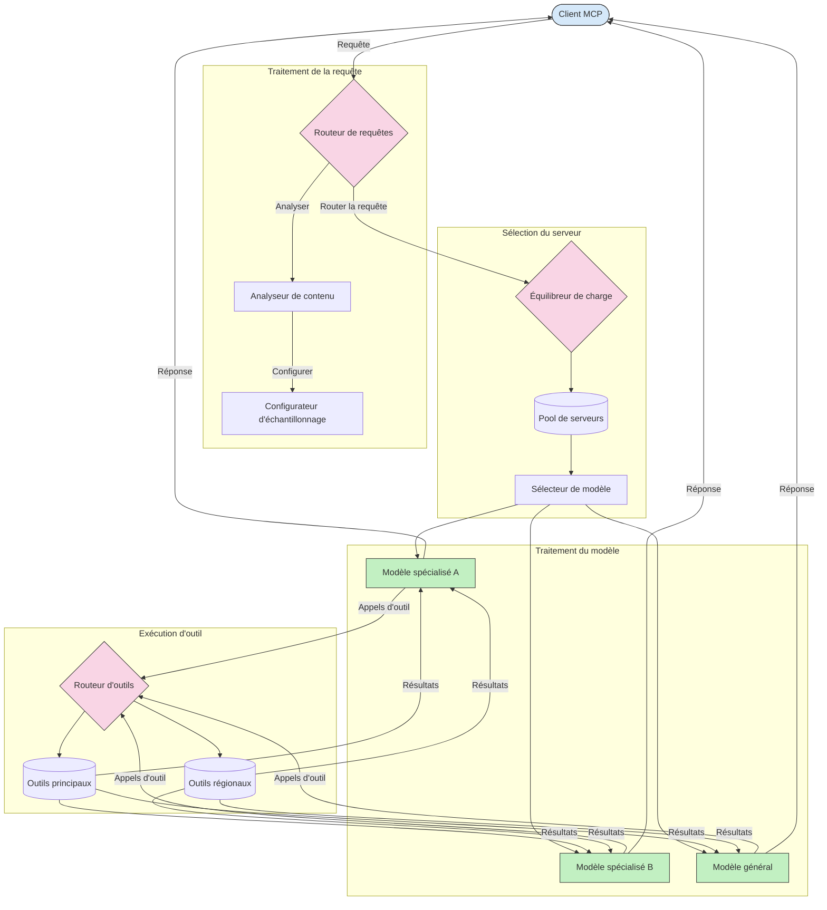

# Routage dans le Protocole de Contexte de Modèle

Le routage est essentiel pour diriger les requêtes vers les modèles, outils ou services appropriés au sein d'un écosystème MCP.

## Introduction

Le routage dans le Protocole de Contexte de Modèle (MCP) consiste à diriger les requêtes vers les modèles ou services les plus adaptés en fonction de divers critères tels que le type de contenu, le contexte utilisateur et la charge du système. Cela garantit un traitement efficace et une utilisation optimale des ressources.

## Objectifs d'apprentissage

À la fin de cette leçon, vous serez capable de :

- Comprendre les principes du routage dans MCP.
- Mettre en œuvre un routage basé sur le contenu pour diriger les requêtes vers des services spécialisés.
- Appliquer des stratégies intelligentes d'équilibrage de charge pour optimiser l'utilisation des ressources.
- Mettre en œuvre un routage dynamique des outils en fonction du contexte de la requête.

## Routage basé sur le contenu

Le routage basé sur le contenu dirige les requêtes vers des services spécialisés en fonction du contenu de la requête. Par exemple, les requêtes liées à la génération de code peuvent être dirigées vers un modèle de code spécialisé, tandis que les requêtes d'écriture créative peuvent être envoyées vers un modèle d'écriture créative.

Regardons un exemple d'implémentation dans différents langages de programmation.

<details>
<summary>.NET</summary>

```csharp
// .NET Example: Content-based routing in MCP
public class ContentBasedRouter
{
    private readonly Dictionary<string, McpClient> _specializedClients;
    private readonly RoutingClassifier _classifier;
    
    public ContentBasedRouter()
    {
        // Initialize specialized clients for different domains
        _specializedClients = new Dictionary<string, McpClient>
        {
            ["code"] = new McpClient("https://code-specialized-mcp.com"),
            ["creative"] = new McpClient("https://creative-specialized-mcp.com"),
            ["scientific"] = new McpClient("https://scientific-specialized-mcp.com"),
            ["general"] = new McpClient("https://general-mcp.com")
        };
        
        // Initialize content classifier
        _classifier = new RoutingClassifier();
    }
    
    public async Task<McpResponse> RouteAndProcessAsync(string prompt, IDictionary<string, object> parameters = null)
    {
        // Classify the prompt to determine the best specialized service
        string category = await _classifier.ClassifyPromptAsync(prompt);
        
        // Get the appropriate client or fall back to general
        var client = _specializedClients.ContainsKey(category) 
            ? _specializedClients[category] 
            : _specializedClients["general"];
            
        Console.WriteLine($"Routing request to {category} specialized service");
        
        // Send request to the selected service
        return await client.SendPromptAsync(prompt, parameters);
    }
    
    // Simple classifier for routing decisions
    private class RoutingClassifier
    {
        public Task<string> ClassifyPromptAsync(string prompt)
        {
            prompt = prompt.ToLowerInvariant();
            
            if (prompt.Contains("code") || prompt.Contains("function") || 
                prompt.Contains("program") || prompt.Contains("algorithm"))
            {
                return Task.FromResult("code");
            }
            
            if (prompt.Contains("story") || prompt.Contains("creative") || 
                prompt.Contains("imagine") || prompt.Contains("design"))
            {
                return Task.FromResult("creative");
            }
            
            if (prompt.Contains("science") || prompt.Contains("research") || 
                prompt.Contains("analyze") || prompt.Contains("study"))
            {
                return Task.FromResult("scientific");
            }
            
            return Task.FromResult("general");
        }
    }
}
```

Dans le code précédent, nous avons :

- Créé une classe `ContentBasedRouter` qui route les requêtes en fonction du contenu de l'invite.
- Initialisé des clients spécialisés pour différents domaines (code, créatif, scientifique, général).
- Mis en œuvre un classificateur simple qui détermine la catégorie de l'invite et la route vers le service spécialisé approprié.
- Utilisé un mécanisme de repli pour router les requêtes vers un service général si aucun service spécialisé n'est disponible.
- Mis en œuvre un traitement asynchrone pour gérer efficacement les requêtes.
- Utilisé un dictionnaire pour associer les catégories de contenu aux clients MCP spécialisés.
- Mis en œuvre un classificateur simple qui analyse l'invite et retourne la catégorie appropriée.
- Utilisé le client spécialisé pour envoyer la requête et recevoir une réponse.
- Géré les cas où l'invite ne correspond à aucune catégorie spécialisée en routant vers un service général.

</details>

## Équilibrage de charge intelligent

L'équilibrage de charge optimise l'utilisation des ressources et assure une haute disponibilité pour les services MCP. Il existe différentes façons de mettre en œuvre l'équilibrage de charge, telles que le round-robin, le temps de réponse pondéré ou les stratégies conscientes du contenu.

Regardons l'implémentation d'exemple ci-dessous qui utilise les stratégies suivantes :

- **Round Robin** : Distribue les requêtes uniformément entre les serveurs disponibles.
- **Temps de réponse pondéré** : Route les requêtes vers les serveurs en fonction de leur temps de réponse moyen.
- **Conscience du contenu** : Route les requêtes vers des serveurs spécialisés en fonction du contenu de la requête.

<details>
<summary>Java</summary>

```java
// Exemple Java : Répartition intelligente de charge pour les serveurs MCP
public class McpLoadBalancer {
    private final List<McpServerNode> serverNodes;
    private final LoadBalancingStrategy strategy;
    
    public McpLoadBalancer(List<McpServerNode> nodes, LoadBalancingStrategy strategy) {
        this.serverNodes = new ArrayList<>(nodes);
        this.strategy = strategy;
    }
    
    public McpResponse processRequest(McpRequest request) {
        // Sélectionner le meilleur serveur selon la stratégie
        McpServerNode selectedNode = strategy.selectNode(serverNodes, request);
        
        try {
            // Router la requête vers le nœud sélectionné
            return selectedNode.processRequest(request);
        } catch (Exception e) {
            // Gérer l'échec - implémenter une logique de nouvelle tentative ou de repli
            System.err.println("Error processing request on node " + selectedNode.getId() + ": " + e.getMessage());
            
            // Marquer le nœud comme potentiellement défaillant
            selectedNode.recordFailure();
            
            // Essayer le nœud suivant le mieux classé en repli
            List<McpServerNode> remainingNodes = new ArrayList<>(serverNodes);
            remainingNodes.remove(selectedNode);
            
            if (!remainingNodes.isEmpty()) {
                McpServerNode fallbackNode = strategy.selectNode(remainingNodes, request);
                return fallbackNode.processRequest(request);
            } else {
                throw new RuntimeException("All MCP server nodes failed to process the request");
            }
        }
    }
    
    // Tâche de vérification de l'état du nœud
    public void startHealthChecks(Duration interval) {
        ScheduledExecutorService scheduler = Executors.newScheduledThreadPool(1);
        scheduler.scheduleAtFixedRate(() -> {
            for (McpServerNode node : serverNodes) {
                try {
                    boolean isHealthy = node.checkHealth();
                    System.out.println("Node " + node.getId() + " health status: " + 
                                      (isHealthy ? "HEALTHY" : "UNHEALTHY"));
                } catch (Exception e) {
                    System.err.println("Health check failed for node " + node.getId());
                    node.setHealthy(false);
                }
            }
        }, 0, interval.toMillis(), TimeUnit.MILLISECONDS);
    }
    
    // Interface pour les stratégies de répartition de charge
    public interface LoadBalancingStrategy {
        McpServerNode selectNode(List<McpServerNode> nodes, McpRequest request);
    }
    
    // Stratégie round-robin
    public static class RoundRobinStrategy implements LoadBalancingStrategy {
        private AtomicInteger counter = new AtomicInteger(0);
        
        @Override
        public McpServerNode selectNode(List<McpServerNode> nodes, McpRequest request) {
            List<McpServerNode> healthyNodes = nodes.stream()
                .filter(McpServerNode::isHealthy)
                .collect(Collectors.toList());
            
            if (healthyNodes.isEmpty()) {
                throw new RuntimeException("No healthy nodes available");
            }
            
            int index = counter.getAndIncrement() % healthyNodes.size();
            return healthyNodes.get(index);
        }
    }
    
    // Stratégie pondérée par le temps de réponse
    public static class ResponseTimeStrategy implements LoadBalancingStrategy {
        @Override
        public McpServerNode selectNode(List<McpServerNode> nodes, McpRequest request) {
            return nodes.stream()
                .filter(McpServerNode::isHealthy)
                .min(Comparator.comparing(McpServerNode::getAverageResponseTime))
                .orElseThrow(() -> new RuntimeException("No healthy nodes available"));
        }
    }
    
    // Stratégie consciente du contenu
    public static class ContentAwareStrategy implements LoadBalancingStrategy {
        @Override
        public McpServerNode selectNode(List<McpServerNode> nodes, McpRequest request) {
            // Déterminer les caractéristiques de la requête
            boolean isCodeRequest = request.getPrompt().contains("code") || 
                                   request.getAllowedTools().contains("codeInterpreter");
            
            boolean isCreativeRequest = request.getPrompt().contains("creative") || 
                                       request.getPrompt().contains("story");
            
            // Trouver des nœuds spécialisés
            Optional<McpServerNode> specializedNode = nodes.stream()
                .filter(McpServerNode::isHealthy)
                .filter(node -> {
                    if (isCodeRequest && node.getSpecialization().equals("code")) {
                        return true;
                    }
                    if (isCreativeRequest && node.getSpecialization().equals("creative")) {
                        return true;
                    }
                    return false;
                })
                .findFirst();
            
            // Retourner un nœud spécialisé ou le nœud le moins chargé
            return specializedNode.orElse(
                nodes.stream()
                    .filter(McpServerNode::isHealthy)
                    .min(Comparator.comparing(McpServerNode::getCurrentLoad))
                    .orElseThrow(() -> new RuntimeException("No healthy nodes available"))
            );
        }
    }
}
```

Dans le code précédent, nous avons :

- Créé une classe `McpLoadBalancer` qui gère une liste de nœuds serveurs MCP et route les requêtes selon la stratégie d'équilibrage de charge sélectionnée.
- Mis en œuvre différentes stratégies d'équilibrage de charge : `RoundRobinStrategy`, `ResponseTimeStrategy` et `ContentAwareStrategy`.
- Utilisé un `ScheduledExecutorService` pour vérifier périodiquement la santé des nœuds serveurs.
- Mis en œuvre un mécanisme de vérification de santé qui marque les nœuds comme sains ou malsains selon leur réponse aux contrôles de santé.
- Géré le traitement des requêtes avec gestion des erreurs et logique de repli pour assurer une haute disponibilité.
- Utilisé une classe `McpServerNode` pour représenter les nœuds serveurs MCP individuels, incluant leur état de santé, temps de réponse moyen et charge actuelle.
- Mis en œuvre une classe `McpRequest` pour encapsuler les détails des requêtes comme l'invite et les outils autorisés.
- Utilisé les Streams Java pour filtrer et sélectionner les nœuds en fonction de l'état de santé et de la spécialisation.

</details>

## Routage dynamique des outils

Le routage des outils garantit que les appels d'outils sont dirigés vers le service le plus approprié en fonction du contexte. Par exemple, un appel d'outil météo peut devoir être routé vers un point de terminaison régional selon la localisation de l'utilisateur, ou un outil calculatrice peut devoir utiliser une version spécifique de l'API.

Regardons un exemple d'implémentation démontrant un routage dynamique des outils basé sur l'analyse des requêtes, les points de terminaison régionaux et la gestion des versions.

<details>
<summary>Python</summary>

```python
# Exemple Python : Routage dynamique des outils basé sur l'analyse de la requête
class McpToolRouter:
    def __init__(self):
        # Enregistrer les points de terminaison des outils disponibles
        self.tool_endpoints = {
            "weatherTool": "https://weather-service.example.com/api",
            "calculatorTool": "https://calculator-service.example.com/compute",
            "databaseTool": "https://database-service.example.com/query",
            "searchTool": "https://search-service.example.com/search"
        }
        
        # Points de terminaison régionaux pour la distribution globale
        self.regional_endpoints = {
            "us": {
                "weatherTool": "https://us-west.weather-service.example.com/api",
                "searchTool": "https://us.search-service.example.com/search"
            },
            "europe": {
                "weatherTool": "https://eu.weather-service.example.com/api",
                "searchTool": "https://eu.search-service.example.com/search"
            },
            "asia": {
                "weatherTool": "https://asia.weather-service.example.com/api",
                "searchTool": "https://asia.search-service.example.com/search"
            }
        }
        
        # Support de la version des outils
        self.tool_versions = {
            "weatherTool": {
                "default": "v2",
                "v1": "https://weather-service.example.com/api/v1",
                "v2": "https://weather-service.example.com/api/v2",
                "beta": "https://weather-service.example.com/api/beta"
            }
        }
    
    async def route_tool_request(self, tool_name, parameters, user_context=None):
        """Route a tool request to the appropriate endpoint based on context"""
        endpoint = self._select_endpoint(tool_name, parameters, user_context)
        
        if not endpoint:
            raise ValueError(f"No endpoint available for tool: {tool_name}")
        
        # Effectuer la requête réelle vers le point de terminaison sélectionné
        return await self._execute_tool_request(endpoint, tool_name, parameters)
    
    def _select_endpoint(self, tool_name, parameters, user_context=None):
        """Select the most appropriate endpoint based on context"""
        # Point de terminaison de base du registre
        if tool_name not in self.tool_endpoints:
            return None
            
        base_endpoint = self.tool_endpoints[tool_name]
        
        # Vérifier si nous devons utiliser une version spécifique de l'outil
        if tool_name in self.tool_versions:
            version_info = self.tool_versions[tool_name]
            
            # Utiliser la version spécifiée ou la version par défaut
            requested_version = parameters.get("_version", version_info["default"])
            if requested_version in version_info:
                base_endpoint = version_info[requested_version]
        
        # Vérifier le routage régional si la région de l'utilisateur est connue
        if user_context and "region" in user_context:
            user_region = user_context["region"]
            
            if user_region in self.regional_endpoints:
                regional_tools = self.regional_endpoints[user_region]
                
                if tool_name in regional_tools:
                    # Utiliser le point de terminaison spécifique à la région
                    return regional_tools[tool_name]
        
        # Vérifier les exigences de résidence des données
        if user_context and "data_residency" in user_context:
            # Cela permettrait d'implémenter une logique pour assurer que les données restent dans la juridiction spécifiée
            pass
        
        # Vérifier le routage basé sur la latence
        if user_context and "latency_sensitive" in user_context and user_context["latency_sensitive"]:
            # Cela permettrait d'implémenter une logique pour sélectionner le point de terminaison avec la latence la plus faible
            pass
            
        return base_endpoint
        
    async def _execute_tool_request(self, endpoint, tool_name, parameters):
        """Execute the actual tool request to the selected endpoint"""
        try:
            async with aiohttp.ClientSession() as session:
                async with session.post(
                    endpoint,
                    json={"toolName": tool_name, "parameters": parameters},
                    headers={"Content-Type": "application/json"}
                ) as response:
                    if response.status == 200:
                        result = await response.json()
                        return result
                    else:
                        error_text = await response.text()
                        raise Exception(f"Tool execution failed: {error_text}")
        except Exception as e:
            # Implémenter une logique de nouvelle tentative ou une stratégie de secours
            print(f"Error executing tool {tool_name} at {endpoint}: {str(e)}")
            raise
```

Dans le code précédent, nous avons :

- Créé une classe `McpToolRouter` qui gère le routage des outils basé sur l'analyse des requêtes, les points de terminaison régionaux et la gestion des versions.
- Enregistré les points de terminaison d'outils disponibles et les points de terminaison régionaux pour la distribution globale.
- Mis en œuvre une logique de routage dynamique qui sélectionne le point de terminaison approprié en fonction du contexte utilisateur, comme la région et les exigences de résidence des données.
- Mis en œuvre la gestion des versions pour les outils, permettant aux utilisateurs de spécifier quelle version d'un outil ils souhaitent utiliser.
- Utilisé des requêtes HTTP asynchrones pour exécuter les appels d'outils et gérer les réponses.

</details>

## Échantillonnage et architecture de routage dans MCP

L'échantillonnage est un composant critique du Protocole de Contexte de Modèle (MCP) qui permet un traitement et un routage efficaces des requêtes. Il consiste à analyser les requêtes entrantes pour déterminer le modèle ou service le plus approprié pour les gérer, en fonction de divers critères tels que le type de contenu, le contexte utilisateur et la charge du système.

L'échantillonnage et le routage peuvent être combinés pour créer une architecture robuste qui optimise l'utilisation des ressources et assure une haute disponibilité. Le processus d'échantillonnage peut être utilisé pour classifier les requêtes, tandis que le routage les dirige vers les modèles ou services appropriés.

Le diagramme ci-dessous illustre comment l'échantillonnage et le routage fonctionnent ensemble dans une architecture MCP complète :



## Et ensuite

- [5.6 Échantillonnage](../mcp-sampling/README.md)

---

<!-- CO-OP TRANSLATOR DISCLAIMER START -->
**Avertissement** :
Ce document a été traduit à l'aide du service de traduction automatique [Co-op Translator](https://github.com/Azure/co-op-translator). Bien que nous nous efforçions d'assurer l'exactitude, veuillez noter que les traductions automatisées peuvent contenir des erreurs ou des inexactitudes. Le document original dans sa langue native doit être considéré comme la source faisant autorité. Pour les informations critiques, il est recommandé de recourir à une traduction professionnelle réalisée par un humain. Nous ne saurions être tenus responsables des malentendus ou erreurs d'interprétation découlant de l'utilisation de cette traduction.
<!-- CO-OP TRANSLATOR DISCLAIMER END -->