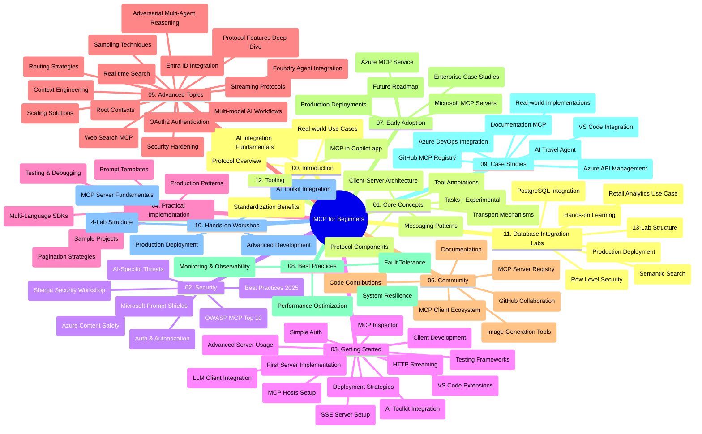

# Protocole de Contexte de Modèle (MCP) pour Débutants - Guide d'Étude

Ce guide d'étude fournit un aperçu de la structure et du contenu du dépôt pour le programme "Protocole de Contexte de Modèle (MCP) pour Débutants". Utilisez ce guide pour naviguer efficacement dans le dépôt et tirer le meilleur parti des ressources disponibles.

## Aperçu du Dépôt

Le Protocole de Contexte de Modèle (MCP) est un cadre standardisé pour les interactions entre modèles d'IA et applications clientes. Initialement créé par Anthropic, MCP est désormais maintenu par la communauté plus large MCP via l'organisation officielle GitHub. Ce dépôt fournit un programme complet avec des exemples de code pratiques en C#, Java, JavaScript, Python et TypeScript, destiné aux développeurs d'IA, architectes système et ingénieurs logiciels.

## Carte Visuelle du Programme

## Structure du Dépôt

Le dépôt est organisé en douze sections principales, chacune se concentrant sur différents aspects du MCP :

1. **Introduction (00-Introduction/)**
   - Aperçu du Protocole de Contexte de Modèle
   - Pourquoi la standardisation est importante dans les pipelines d'IA
   - Cas d'utilisation pratiques et avantages

2. **Concepts de Base (01-CoreConcepts/)**
   - Architecture client-serveur
   - Composants clés du protocole
   - Schémas de messagerie dans MCP
   - Regard vers l'avenir : [Ce qui change dans MCP : La Release Candidate du 2026-07-28](./01-CoreConcepts/mcp-2026-07-28-release-candidate.md) — le cœur de protocole sans état, le cadre d'extensions, et les dépréciations des Roots/Sampling/Logging attendues dans la prochaine version de la spécification

3. **Sécurité (02-Security/)**
   - Menaces de sécurité dans les systèmes basés sur MCP
   - Meilleures pratiques pour sécuriser les implémentations
   - Stratégies d'authentification et d'autorisation
   - **Documentation complète sur la sécurité** :
     - Meilleures Pratiques de Sécurité MCP 2025
     - Guide de mise en œuvre de la sécurité de contenu Azure
     - Contrôles et techniques de sécurité MCP
     - Référence rapide des meilleures pratiques MCP
   - **Sujets clés en sécurité** :
     - Attaques d'injection de prompts et empoisonnement d'outils
     - Détournement de session et problèmes de délégué confus
     - Vulnérabilités de passage de jetons
     - Permissions excessives et contrôle d'accès
     - Sécurité de la chaîne d'approvisionnement pour les composants IA
     - Intégration des Microsoft Prompt Shields

4. **Prise en Main (03-GettingStarted/)**
   - Configuration et paramétrage de l’environnement
   - Création des premiers serveurs et clients MCP
   - Intégration avec des applications existantes
   - Sections incluses pour :
     - Première implémentation de serveur
     - Développement client
     - Intégration du client LLM
     - Intégration VS Code
     - Serveur Server-Sent Events (SSE)
     - Usage avancé du serveur
     - Streaming HTTP
     - Intégration du AI Toolkit
     - Stratégies de test
     - Directives de déploiement

5. **Implémentation Pratique (04-PracticalImplementation/)**
   - Utilisation des SDKs dans différents langages de programmation
   - Techniques de débogage, test et validation
   - Conception de modèles et flux de travail réutilisables pour les prompts
   - Projets exemples avec exemples d’implémentation

6. **Sujets Avancés (05-AdvancedTopics/)**
   - Techniques d’ingénierie du contexte
   - Intégration de l’agent Foundry
   - Flux de travail AI multimodaux
   - Démos d’authentification OAuth2
   - Capacités de recherche en temps réel
   - Streaming en temps réel
   - Implémentation des contextes racines
   - Stratégies de routage
   - Techniques d’échantillonnage
   - Approches de mise à l’échelle
   - Considérations de sécurité
   - Intégration de la sécurité Entra ID
   - Intégration de la recherche web
   - Raisonnement multi-agent adversarial (modèles de débat)

7. **Contributions Communautaires (06-CommunityContributions/)**
   - Comment contribuer au code et à la documentation
   - Collaboration via GitHub
   - Améliorations et retours pilotés par la communauté
   - Utilisation de divers clients MCP (Claude Desktop, Cline, VSCode)
   - Travaux avec des serveurs MCP populaires incluant la génération d’images

8. **Leçons des Premiers Usages (07-LessonsfromEarlyAdoption/)**
   - Implémentations réelles et histoires à succès
   - Construction et déploiement de solutions basées sur MCP
   - Tendances et feuille de route future
   - **Guide des serveurs MCP Microsoft** : Guide complet de 10 serveurs MCP Microsoft prêts pour la production, incluant :
     - Serveur MCP Microsoft Learn Docs
     - Serveur MCP Azure (15+ connecteurs spécialisés)
     - Serveur MCP GitHub
     - Serveur MCP Azure DevOps
     - Serveur MCP MarkItDown
     - Serveur MCP SQL Server
     - Serveur MCP Playwright
     - Serveur MCP Dev Box
     - Serveur MCP Microsoft Foundry
     - Serveur MCP Microsoft 365 Agents Toolkit

9. **Bonnes Pratiques (08-BestPractices/)**
   - Ajustement des performances et optimisation
   - Conception de systèmes MCP tolérants aux pannes
   - Stratégies de test et de résilience

10. **Études de Cas (09-CaseStudy/)**
    - **Sept études de cas complètes** démontrant la polyvalence du MCP dans divers scénarios :
    - **Agents de Voyage Azure AI** : Orchestration multi-agent avec Azure OpenAI et AI Search
    - **Intégration Azure DevOps** : Automatisation des flux de travail avec mise à jour des données YouTube
    - **Récupération documentaire en temps réel** : Client console Python avec HTTP streaming
    - **Générateur interactif de plans d’étude** : Application web Chainlit avec IA conversationnelle
    - **Documentation dans l’éditeur** : Intégration VS Code avec workflows GitHub Copilot
    - **Gestion API Azure** : Intégration d’API d’entreprise avec création de serveurs MCP
    - **Registre MCP GitHub** : Développement d’écosystème et plateforme d’intégration agentique
    - Exemples d’implémentation couvrant intégration d’entreprise, productivité développeur et développement d’écosystème

11. **Atelier Pratique (10-StreamliningAIWorkflowsBuildingAnMCPServerWithAIToolkit/)**
    - Atelier pratique complet combinant MCP et AI Toolkit
    - Construction d’applications intelligentes reliant modèles d’IA et outils du monde réel
    - Modules pratiques couvrant les fondamentaux, le développement de serveurs personnalisés et les stratégies de déploiement en production
    - **Structure du laboratoire** :
      - Laboratoire 1 : Fondamentaux du serveur MCP
      - Laboratoire 2 : Développement avancé du serveur MCP
      - Laboratoire 3 : Intégration AI Toolkit
      - Laboratoire 4 : Déploiement et mise à l’échelle en production
    - Approche d’apprentissage basée sur des laboratoires avec instructions pas à pas

12. **Laboratoires d’Intégration de Base de Données Serveur MCP (11-MCPServerHandsOnLabs/)**
    - **Parcours d’apprentissage complet en 13 laboratoires** pour construire des serveurs MCP prêts pour la production avec intégration PostgreSQL
    - **Implémentation d’analyse retail en conditions réelles** utilisant le cas d’usage Zava Retail
    - **Patrons de niveau entreprise** incluant la sécurité au niveau des lignes (RLS), recherche sémantique et accès multi-locataires aux données
    - **Structure complète des laboratoires** :
      - **Laboratoires 00-03 : Fondations** - Introduction, Architecture, Sécurité, Configuration de l’environnement
      - **Laboratoires 04-06 : Construction du Serveur MCP** - Conception base de données, implémentation serveur MCP, développement d’outils
      - **Laboratoires 07-09 : Fonctionnalités Avancées** - Recherche sémantique, test & débogage, intégration VS Code
      - **Laboratoires 10-12 : Production & Bonnes Pratiques** - Déploiement, surveillance, optimisation
    - **Technologies couvertes** : Framework FastMCP, PostgreSQL, Azure OpenAI, Azure Container Apps, Application Insights
    - **Résultats d’apprentissage** : Serveurs MCP prêts pour la production, patrons d’intégration base de données, analyses assistées par IA, sécurité entreprise

13. **Outils (12-tooling/)**
    - Apprenez à utiliser MCP dans l’application Copilot et autres outils

## Ressources Supplémentaires

Le dépôt inclut des ressources complémentaires :

- **Dossier Images** : Contient des diagrammes et illustrations utilisés tout au long du programme
- **Traductions** : Support multilingue avec traductions automatiques de la documentation
- **Ressources officielles MCP** :
  - [Documentation MCP](https://modelcontextprotocol.io/)
  - [Spécification MCP](https://spec.modelcontextprotocol.io/)
  - [Dépôt MCP GitHub](https://github.com/modelcontextprotocol)

## Comment Utiliser Ce Dépôt

1. **Apprentissage Séquentiel** : Suivez les chapitres dans l’ordre (00 à 11) pour une expérience d’apprentissage structurée.
2. **Focalisation par Langage** : Si vous êtes intéressé par un langage de programmation particulier, explorez les dossiers samples pour des implémentations dans votre langage préféré.
3. **Implémentation Pratique** : Commencez par la section "Prise en Main" pour configurer votre environnement et créer votre premier serveur et client MCP.
4. **Exploration Avancée** : Une fois à l’aise avec les bases, plongez dans les sujets avancés pour étendre vos connaissances.
5. **Engagement Communautaire** : Rejoignez la communauté MCP via les discussions GitHub et les canaux Discord pour connecter avec les experts et autres développeurs.

## Clients et Outils MCP

Le programme couvre divers clients et outils MCP :

1. **Clients Officiels** :
   - Visual Studio Code 
   - MCP dans Visual Studio Code
   - Claude Desktop
   - Claude dans VSCode 
   - Claude API

2. **Clients Communautaires** :
   - Cline (terminal)
   - Cursor (éditeur de code)
   - ChatMCP
   - Windsurf

3. **Outils de Gestion MCP** :
   - MCP CLI
   - MCP Manager
   - MCP Linker
   - MCP Router

## Serveurs MCP Populaires

Le dépôt présente divers serveurs MCP, incluant :

1. **Serveurs MCP Officiels Microsoft** :
   - Serveur MCP Microsoft Learn Docs
   - Serveur MCP Azure (15+ connecteurs spécialisés)
   - Serveur MCP GitHub
   - Serveur MCP Azure DevOps
   - Serveur MCP MarkItDown
   - Serveur MCP SQL Server
   - Serveur MCP Playwright
   - Serveur MCP Dev Box
   - Serveur MCP Microsoft Foundry
   - Serveur MCP Microsoft 365 Agents Toolkit

2. **Serveurs de Référence Officiels** :
   - Filesystem
   - Fetch
   - Memory
   - Sequential Thinking

3. **Génération d’Images** :
   - Azure OpenAI DALL-E 3
   - Stable Diffusion WebUI
   - Replicate

4. **Outils de Développement** :
   - Git MCP
   - Contrôle du terminal
   - Assistant de code

5. **Serveurs Spécialisés** :
   - Salesforce
   - Microsoft Teams
   - Jira & Confluence

## Contribution

Ce dépôt accueille les contributions de la communauté. Voir la section Contributions Communautaires pour des conseils sur la façon de contribuer efficacement à l’écosystème MCP.

----

*Ce guide d'étude a été mis à jour pour la dernière fois le 5 février 2026, reflétant la dernière Spécification MCP 2025-11-25 et fournissant un aperçu du dépôt à cette date. Le contenu du dépôt peut être mis à jour après cette date.*

*Addendum (2 juillet 2026) : une leçon sur la Release Candidate de la Spécification MCP `2026-07-28` a été ajoutée sous [01-CoreConcepts](./01-CoreConcepts/mcp-2026-07-28-release-candidate.md) ; la base du programme reste 2025-11-25 jusqu’à la livraison de la nouvelle spécification.*

---

<!-- CO-OP TRANSLATOR DISCLAIMER START -->
**Avertissement** :
Ce document a été traduit à l'aide du service de traduction automatique [Co-op Translator](https://github.com/Azure/co-op-translator). Bien que nous nous efforçions d'assurer l'exactitude, veuillez noter que les traductions automatisées peuvent contenir des erreurs ou des inexactitudes. Le document original dans sa langue native doit être considéré comme la source faisant autorité. Pour les informations critiques, il est recommandé de recourir à une traduction professionnelle réalisée par un humain. Nous ne saurions être tenus responsables des malentendus ou erreurs d'interprétation découlant de l'utilisation de cette traduction.
<!-- CO-OP TRANSLATOR DISCLAIMER END -->