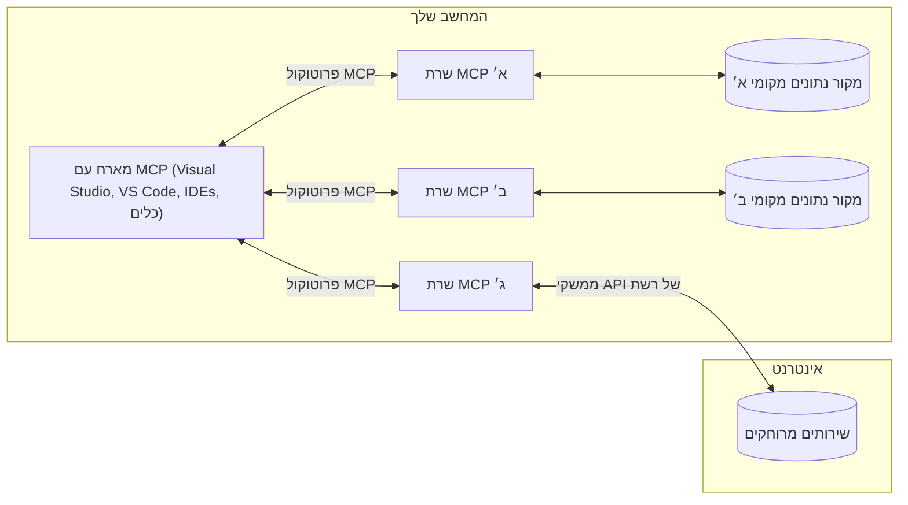

# מושגי ליבה ב-MCP: שליטה בפרוטוקול הקשר הדגמי לאינטגרציה של בינה מלאכותית

[](https://youtu.be/earDzWGtE84)

_(לחץ על התמונה למעלה כדי לצפות בסרטון של השיעור)_

[Model Context Protocol (MCP)](https://github.com/modelcontextprotocol) הוא מסגרת סטנדרטית ועוצמתית שמייעלת את התקשורת בין מודלים לשוניים גדולים (LLMs) לכלים חיצוניים, ליישומים ולמקורות נתונים. מדריך זה יסייע לך להבין את מושגי היסוד של MCP. תלמד על ארכיטקטורת לקוח-שרת, רכיבים חיוניים, מנגנוני תקשורת ופרקטיקות הטמעה מיטביות.

- **הסכמה מפורשת של המשתמש**: כל גישה לנתונים ופעולות דורשים אישור מפורש מהמستخدم לפני ביצוע. על המשתמשים להבין בבירור איזה נתונים ייגשו ואילו פעולות יבוצעו, עם שליטה מפורטת בהרשאות ואישורים.

- **הגנת פרטיות הנתונים**: נתוני המשתמש נחשפים רק בהסכמה מפורשת ויש להגן עליהם באמצעות בקרות גישה קפדניות לאורך כל מחזור האינטראקציה. יש למנוע העברת נתונים בלתי מורשית ולשמור על גבולות פרטיות מחמירים.

- **בטיחות ביצוע הכלים**: כל קריאה לכלי דורשת הסכמה מפורשת עם הבנה ברורה של פונקציונליות הכלי, הפרמטרים וההשפעות הפוטנציאליות. גבולות אבטחה חזקים מונעים ביצוע לא מכוון, לא בטוח או זדוני של כלים.

- **אבטחת שכבת התעבורה**: כל ערוצי התקשורת צריכים להשתמש בהצפנה ומתודות אימות מתאימות. חיבורים מרוחקים צריכים ליישם פרוטוקולי תעבורה מאובטחים וניהול נכסים נכון.

#### קווי הנחיה ליישום:

- **ניהול הרשאות**: יישום מערכות הרשאות מדויקות המאפשרות למשתמשים לשלוט באילו שרתים, כלים ומשאבים ניגשים
- **אימות ואישור**: שימוש בשיטות אימות מאובטחות (OAuth, מפתחות API) עם ניהול נכון של טוקנים ותוקף
- **אימות קלט**: אימות כל הפרמטרים וקלטי הנתונים בהתאם למבנים מוגדרים למניעת התקפות הזרקה
- **תיעוד ביקורת**: שמירת יומני פעולה מקיפים למעקב אבטחה וציות

## סקירה כללית

שיעור זה בוחן את הארכיטקטורה והמרכיבים הבסיסיים שמרכיבים את מערכת Model Context Protocol (MCP). תלמד על ארכיטקטורת לקוח-שרת, מרכיבים עיקריים ומנגנוני תקשורת שמאפשרים את האינטראקציות ב-MCP.

## יעדי למידה מרכזיים

בסיום השיעור תוכל:

- להבין את ארכיטקטורת לקוח-שרת של MCP.
- לזהות תפקידים ואחריות של מארחים, לקוחות ושרתים.
- לנתח את התכונות המרכזיות שהופכות את MCP לשכבת אינטגרציה גמישה.
- ללמוד כיצד המידע זורם בתוך מערכת MCP.
- לקבל תובנות מעשיות באמצעות דוגמאות קוד ב-.NET, Java, Python ו-JavaScript.

## ארכיטקטורת MCP: מבט מעמיק

אקוסיסטם MCP בנוי על מודל של לקוח-שרת. מבנה מודולרי זה מאפשר ליישומי בינה מלאכותית לתקשר עם כלים, מאגרי נתונים, API ומשאבים הקשריים בצורה יעילה. נפרק ארכיטקטורה זו למרכיביה הבסיסיים.

בבסיסו, MCP פועל על פי ארכיטקטורת לקוח-שרת שבה יישום מארח יכול להתחבר למספר שרתים:



- **מארחי MCP**: תוכניות כמו VSCode, Claude Desktop, סביבות פיתוח משולבות (IDEs) או כלים של בינה מלאכותית שרוצים לגשת לנתונים דרך MCP
- **לקוחות MCP**: לקוחות פרוטוקול שמתחזקים חיבורים 1:1 עם שרתים
- **שרתי MCP**: תוכניות קלות שמשדרות יכולות ייחודיות דרך פרוטוקול הקשר הדגמי הסטנדרטי
- **מקורות נתונים מקומיים**: קבצים, מאגרי נתונים ושירותים במחשב שלך שאליהם שרתי MCP יכולים לגשת בצורה מאובטחת
- **שירותים מרוחקים**: מערכות חיצוניות הזמינות דרך האינטרנט שאליהן שרתי MCP יכולים להתחבר באמצעות APIs.

פרוטוקול MCP הוא תקן מתפתח המשתמש בגרסת תאריך (בפורמט YYYY-MM-DD). גרסת הפרוטוקול הנוכחית היא **2025-11-25**. ניתן לצפות בעדכונים האחרונים ב[מפרט הפרוטוקול](https://modelcontextprotocol.io/specification/2025-11-25/)

> **מבט לעתיד:** מועמד שחרור לגרסת המפרט הבאה, **2026-07-28**, הוכרז במאי 2026 ומיועד להשקה ב-28 ביולי 2026. השחרור הופך את הפרוטוקול ללא מדינתי בשכבת התעבורה (ביטול ברכת היד `initialize` וזיהוי מושבים), מנסח מחדש מסגרת הרחבות, ומפסיק להשתמש ב-Roots, Sampling ו-Logging לטובת דפוסים חדשים. ראה [מה משתנה ב-MCP: מועמד השחרור 2026-07-28](./mcp-2026-07-28-release-candidate.md) לפירוט מלא.

### 1. מארחים

בפרוטוקול הקשר הדגמי (MCP), **מארחים** הם יישומי בינה מלאכותית המשמשים כממשק הראשי שאליו המשתמשים מתקשרים עם הפרוטוקול. המארחים מתאמים ומנהלים חיבורים למספר שרתי MCP על ידי יצירת לקוחות MCP ייעודיים לכל חיבור שרת. דוגמאות למארחים כוללות:

- **יישומי בינה מלאכותית**: Claude Desktop, Visual Studio Code, Claude Code
- **סביבות פיתוח**: IDEs ועורכי קוד עם אינטגרציה של MCP  
- **יישומים מותאמים אישית**: סוכני AI וכלים ייעודיים

**מארחים** הם יישומים המתאמים אינטראקציות עם מודלים של AI. הם:

- **מתזמנים מודלים של AI**: מבצעים או משתפים פעולה עם LLMs ליצירת תגובות ולניהול זרימות עבודה של AI
- **מנקים חיבורים ללקוחות**: יוצרים ומתחזקים לקוח MCP אחד לכל חיבור שרת MCP
- **שולטים בממשק המשתמש**: מנהלים את זרימת השיחה, אינטראקציות משתמש והצגת תגובות  
- **אוכפים אבטחה**: שולטים בהרשאות, מגבלות אבטחה ואימות
- **מטפלים בהסכמת המשתמש**: מנהלים אישורים לשיתוף נתונים והפעלת כלים


### 2. לקוחות

**לקוחות** הם רכיבים חיוניים שמתחזקים חיבורים סימטריים בין מארחים לשרתי MCP. כל לקוח MCP מיוצר על ידי המארח כדי להתחבר לשרת MCP ספציפי, ומבטיח ערוצי תקשורת מאורגנים ומאובטחים. לקוחות מרובים מאפשרים למארחים להתחבר לכמה שרתים במקביל.

**לקוחות** הם רכיבי חיבור בתוך יישום המארח. הם:

- **תקשורת פרוטוקול**: שולחים בקשות JSON-RPC 2.0 לשרתים עם בקשות והנחיות
- **משא ומתן על יכולות**: מנהלים משא ומתן על תכונות נתמכות וגרסאות פרוטוקול עם שרתים במהלך האתחול
- **ביצוע כלים**: מנהלים בקשות להפעלת כלים מהמודלים ומעבדים תגובות
- **עדכונים בזמן אמת**: מטפלים בהתראות ובעדכונים בזמן אמת מהשרתים
- **עיבוד תגובות**: מעבדים ומעצבנים תגובות מהשרת לתצוגה למשתמשים

### 3. שרתים

**שרתים** הם תוכניות המספקות הקשר, כלים ויכולות ללקוחות MCP. הם יכולים לפעול באופן מקומי (על אותו מחשב כמו המארח) או מרחוק (בפלטפורמות חיצוניות), ואחראיים על טיפול בבקשות הלקוחות ומתן תגובות מובנות. שרתים מציגים פונקציונליות ספציפית דרך פרוטוקול הקשר הדגמי הסטנדרטי.

**שרתים** הם שירותים המספקים הקשר ויכולות. הם:

- **רישום תכונות**: רושמים ומציגים פרימיטיבים זמינים (משאבים, בקשות, כלים) ללקוחות
- **עיבוד בקשות**: מקבלים ומבצעים קריאות לכלים, בקשות למשאבים ובקשות לבקשות מהלקוחות
- **מתן הקשר**: מספקים מידע ומידע הקשרי לשיפור תגובות המודל
- **ניהול מצב**: שומרים על מצב מושב וטיפול באינטראקציות בעלות מצב בעת הצורך
- **התראות בזמן אמת**: שולחים התראות על שינויים ביכולות ועדכונים ללקוחות מחוברים

ניתן לפתח שרתים על ידי כל אחד להרחבת יכולות המודל עם פונקציונליות מתמחה, והם תומכים בתרחישי פריסה מקומית ומרוחקת.

### 4. פרימיטיבים של השרת

שרתים בפרוטוקול הקשר הדגמי (MCP) מספקים שלושה **פרימיטיבים** עיקריים שמגדירים את אבני הבניין לאינטראקציות עשירות בין לקוחות, מארחים ומודלים לשוניים. פרימיטיבים אלו מגדירים את סוגי המידע ההקשרי והפעולות הזמינות דרך הפרוטוקול.

שרתים של MCP יכולים לחשוף כל שילוב מתוך שלושת הפרימיטיבים המרכזיים הבאים:

#### משאבים

**משאבים** הם מקורות נתונים המספקים מידע הקשרי ליישומי בינה מלאכותית. הם מייצגים תוכן סטטי או דינמי שיכול לשפר את הבנת המודל ותהליכי קבלת ההחלטות:

- **נתונים הקשריים**: מידע מובנה והקשר לצריכה ע"י מודל AI
- **בסיסי ידע**: מאגרי מסמכים, מאמרים, מדריכים ומחקרים
- **מקורות נתונים מקומיים**: קבצים, מסדי נתונים ומידע מערכת מקומי  
- **נתונים חיצוניים**: תגובות API, שירותי רשת ונתוני מערכות מרוחקות
- **תוכן דינמי**: נתונים בזמן אמת המתעדכנים בהתאם לנסיבות חיצוניות

משאבים מזוהים על ידי URI ותומכים בגילוי דרך הפקודה `resources/list` ושליפה באמצעות `resources/read`:

```text
file://documents/project-spec.md
database://production/users/schema
api://weather/current
```

#### בקשות

**בקשות** הן תבניות רב-שימושיות המסייעות למבנה אינטראקציות עם מודלים לשוניים. הן מספקות דפוסי אינטראקציה סטנדרטיים וזרימות עבודה בתבנית:

- **אינטראקציות מבוססות תבנית**: הודעות מובנות מראש ומתחילים לשיחה
- **תבניות זרימת עבודה**: רצפים סטנדרטיים למשימות ואינטראקציות נפוצות
- **דוגמאות מעטות**: תבניות מבוססות דוגמאות להנחיית מודלים
- **בקשות מערכת**: בקשות יסודיות שמגדירות התנהגות והקשר של המודל
- **תבניות דינמיות**: בקשות עם פרמטרים שמתקשרות להקשרים ספציפיים

בקשות תומכות בהחלפת משתנים וניתנות לגילוי דרך `prompts/list` וקריאה עם `prompts/get`:

```markdown
Generate a {{task_type}} for {{product}} targeting {{audience}} with the following requirements: {{requirements}}
```

#### כלים

**כלים** הם פונקציות שניתנות להפעלה שמודלים של AI יכולים להזמין לביצוע פעולות ספציפיות. הם מייצגים את "פעלים" באקוסיסטם MCP, ומאפשרים למודלים אינטראקציה עם מערכות חיצוניות:

- **פונקציות ניתנות להפעלה**: פעולות נפרדות שמודלים יכולים להפעיל עם פרמטרים ספציפיים
- **אינטגרציה עם מערכות חיצוניות**: קריאות API, שאילתות למסדי נתונים, פעולות על קבצים, חישובים
- **זהות ייחודית**: לכל כלי יש שם, תיאור וסכימת פרמטרים מובחנת
- **קלט ופלט מובנים**: כלים מקבלים פרמטרים מאומתים ומחזירים תגובות מופרדות ומסוגננות
- **יכולות פעולה**: מאפשרים למודלים לבצע פעולות בעולם האמיתי ולשלוף מידע חי

כלים מוגדרים באמצעות JSON Schema לאימות פרמטרים ומתגלהים דרך `tools/list` ומופעלים באמצעות `tools/call`. כלים יכולים לכלול גם **אייקונים** כמטא-דאטה משופרת להצגת ממשק משתמש.

**הערות על כלים**: כלים תומכים בהערות התנהגותיות (למשל `readOnlyHint`, `destructiveHint`) שמתארות האם הכלי לקריאה בלבד או הרסני, ומסייעות ללקוחות לקבל החלטות מושכלות לגבי הפעלת הכלי.

דוגמת הגדרה של כלי:

```typescript
server.tool(
  "search_products", 
  {
    query: z.string().describe("Search query for products"),
    category: z.string().optional().describe("Product category filter"),
    max_results: z.number().default(10).describe("Maximum results to return")
  }, 
  async (params) => {
    // בצע חיפוש והחזר תוצאות מובנות
    return await productService.search(params);
  }
);
```

## פרימיטיבים של הלקוח

בפרוטוקול הקשר הדגמי (MCP), **לקוחות** יכולים לחשוף פרימיטיבים שמאפשרים לשרתים לבקש יכולות נוספות מיישום המארח. פרימיטיבים בצד הלקוח מאפשרים מימושים עשירים ואינטראקטיביים יותר של שרתים הניגשים ליכולות מודל AI ולאינטראקציות משתמש.

### Sampling

> **הודעת הפסקת שימוש:** מועמד השחרור לגרסה `2026-07-28` מסמן את Sampling כהפסד ביכולת לטובת אינטגרציה ישירה עם APIs של ספקי LLM. היא ממשיכה לפעול ב-`2025-11-25` ולפחות שנה לאחר מכן, אך יש להעדיף את דפוס ההחלפה בעיצובים חדשים. ראה [מה משתנה ב-MCP: מועמד השחרור 2026-07-28](./mcp-2026-07-28-release-candidate.md).

**Sampling** מאפשר לשרתים לבקש השלמות מודל שפה מיישום AI של הלקוח. פרימיטיב זה מאפשר לשרתים לגשת ליכולות LLM מבלי לשלב SDK של מודל או לנהל גישה למודל:

- **גישה בלתי תלויה במודל**: שרתים יכולים לבקש השלמות ללא כלילת SDK או ניהול גישה למודל
- **AI ביוזמת השרת**: מאפשר לשרתים ליצור תוכן באופן אוטונומי באמצעות מודל הלקוח
- **אינטראקציות רקורסיביות עם LLM**: תומך בתרחישים מורכבים שבהם שרתים זקוקים לסיוע AI בעיבוד
- **יצירת תוכן דינמית**: מאפשר לשרתים ליצור תגובות הקשריות באמצעות מודל המארח
- **תמיכה בהפעלת כלים**: שרתים יכולים לכלול פרמטרים `tools` ו-`toolChoice` כדי לאפשר למודל הלקוח להפעיל כלים במהלך הדגימה

Sampling מופעל דרך הפקודה `sampling/complete`, שבה השרתים שולחים בקשות השלמה ללקוחות.

### Roots

> **הודעת הפסקת שימוש:** מועמד השחרור לגרסה `2026-07-28` מסמן את Roots כהפסד ביכולת לטובת פרמטרים של כלים, URI של משאבים או הגדרת שרת. היא ממשיכה לפעול ב-`2025-11-25` ולפחות שנה לאחר מכן. ראה [מה משתנה ב-MCP: מועמד השחרור 2026-07-28](./mcp-2026-07-28-release-candidate.md).

**Roots** מספקים דרך סטנדרטית ללקוחות לחשוף גבולות מערכת קבצים לשרתים, ומסייעים לשרתים להבין אילו תיקיות וקבצים יש להם גישה אליהם:

- **גבולות מערכת קבצים**: מגדירים את גבולות הפעולה של שרתים בתוך מערכת הקבצים
- **בקרת גישה**: מסייעים לשרתים להבין לאילו תיקיות וקבצים הם מורשים לגשת
- **עדכונים דינמיים**: לקוחות יכולים להודיע לשרתים כאשר רשימת השורשים משתנה
- **זיהוי מבוסס URI**: Roots משתמשים ב-URI מסוג `file://` לזיהוי תיקיות וקבצים נגישים

Roots מתגלים באמצעות פקודת `roots/list`, כאשר הלקוחות שולחים `notifications/roots/list_changed` כששורשים משתנים.

### Elicitation  

**Elicitation** מאפשר לשרתים לבקש מידע או אישור נוסף מהמשתמשים דרך ממשק הלקוח:

- **בקשות קלט משתמש**: שרתים יכולים לבקש מידע נוסף כשנדרש לביצוע כלים
- **תיבות אישור**: בקשה לאישור משתמש עבור פעולות רגישות או בעלות השפעה
- **זרימות עבודה אינטראקטיביות**: מאפשרים לשרתים ליצור אינטראקציות משתמש צעד-אחר-צעד
- **איסוף פרמטרים דינמי**: איסוף פרמטרים חסרים או אופציונליים במהלך ביצוע כלים

בקשות elicittion מתבצעות באמצעות הפקודה `elicitation/request` לאיסוף קלט משתמש דרך ממשק הלקוח.

**אמצעי Elicitation במצב URL**: שרתים יכולים גם לבקש אינטראקציות משתמש מבוססות URL, שמאפשרות לשרתים להפנות משתמשים לדפי אינטרנט חיצוניים לאימות, אישור או הזנת נתונים.

### Logging
> **הודעת הפסקת שימוש:** מועמד הגרסה `2026-07-28` מסמן את ה-Logging כהפסקת שימוש לטובת `stderr` עבור תחבורה בסטדיו ו-OpenTelemetry לצפייה מובנית. הוא ממשיך לפעול ב-`2025-11-25` ולפחות שנה לאחר כל הפסקת שימוש. ראה [מה משתנה ב-MCP: מועמד גרסת 2026-07-28](./mcp-2026-07-28-release-candidate.md).

**הקלטת יומנים (Logging)** מאפשרת לשרתים לשלוח הודעות יומן מובנות ללקוחות לצורך איתור תקלות, מעקב ונראות תפעולית:

- **תמיכה באיתור תקלות**: מאפשר לשרתים לספק יומני ביצוע מפורטים לפתרון בעיות  
- **מעקב תפעולי**: שליחת עדכוני סטטוס ומדדי ביצועים ללקוחות  
- **דיווח שגיאות**: מתן הקשר מפורט על שגיאות ומידע אבחוני  
- **רישומי ביקורת**: יצירת יומנים מקיפים של פעולות והחלטות השרת  

הודעות הקלטה נשלחות ללקוחות כדי לספק שקיפות על פעולות השרת ולסייע באיתור תקלות.

## זרימת מידע ב-MCP

פרוטוקול הקשר המודל (MCP) מגדיר זרימת מידע מובנית בין מארחים, לקוחות, שרתים ומודלים. הבנת הזרימה הזו מסייעת להבהיר כיצד מעובדים בקשות משתמש וכיצד כלים חיצוניים ונתונים משולבים בתגובות המודל.

- **המארח יוזם חיבור**  
יישום המארח (כגון IDE או ממשק בצ’אט) יוצר חיבור לשרת MCP, בדרך כלל באמצעות STDIO, WebSocket או תחבורה נתמכת נוספת.

- **משא ומתן על יכולות**  
הלקוח (שמשולב במארח) והשרת מחליפים מידע לגבי התכונות, הכלים, המשאבים וגרסאות הפרוטוקול שהם תומכים בהן. זה מבטיח ששני הצדדים מבינים אילו יכולות זמינות עבור המפגש.

- **בקשת משתמש**  
המשתמש מתקשר עם המארח (לדוגמה, מזין פקודה או הוראה). המארח אוסף את הקלט ומעביר אותו ללקוח לעיבוד.

- **שימוש במשאב או כלי**  
 - הלקוח עשוי לבקש הקשר או משאבים נוספים מהשרת (כגון קבצים, רשומות בבסיס נתונים, או מאמרי בסיס ידע) כדי להעשיר את הבנת המודל.  
 - אם המודל קובע צורך בכלי (לדוגמה, לשלוף נתונים, לבצע חישוב, או לקרוא ל-API), הלקוח שולח בקשה להפעיל כלי לשרת, ומציין את שם הכלי ואת הפרמטרים.

- **ביצוע בשרת**  
השרת מקבל את בקשת המשאב או הכלי, מבצע את הפעולות הדרושות (כגון הרצת פונקציה, שאילתא במסד נתונים, או אחזור קובץ), ומחזיר תוצאות ללקוח בפורמט מובנה.

- **יצירת תגובה**  
הלקוח משלב את תגובות השרת (נתוני משאבים, פלטים של כלים וכו') באינטראקציה השוטפת עם המודל. המודל משתמש במידע זה ליצירת תגובה מקיפה ורלוונטית הקשרית.

- **הצגת התוצאה**  
המארח מקבל את הפלט הסופי מהלקוח ומציגו למשתמש, לרוב כולל גם את הטקסט שנוצר על ידי המודל וגם את תוצאות הפעלת כלים או אחזור משאבים.

זרימה זו מאפשרת ל-MCP לתמוך ביישומי AI מתקדמים, אינטראקטיביים ומודעים להקשר, על ידי חיבור חלק בין מודלים לכלים ולמקורות נתונים חיצוניים.

## ארכיטקטורת הפרוטוקול ושכבות

MCP מורכב משתי שכבות ארכיטקטוניות מובחנות שעובדות יחד כדי לספק מסגרת תקשורת מלאה:

### שכבת הנתונים

שכבת הנתונים מממשת את פרוטוקול ה-MCP הבסיסי באמצעות **JSON-RPC 2.0** כבסיס שלה. שכבה זו מגדירה את מבנה ההודעה, הסמנטיקה, ודפוסי האינטראקציה:

#### רכיבים מרכזיים:

- **פרוטוקול JSON-RPC 2.0**: כל התקשורת משתמשת בפורמט הודעות JSON-RPC 2.0 סטנדרטי לקריאות שיטות, תגובות והודעות  
- **ניהול מחזור חיים**: מטפל ביצירת חיבור, משא ומתן על יכולות וסיום מפגשים בין לקוחות לשרתים  
- **פרימיטיבים של השרת**: מאפשרים לשרתים לספק פונקציונליות מרכזית באמצעות כלים, משאבים והוראות  
- **פרימיטיבים של הלקוח**: מאפשרים ללקוחות לבקש דגימה מ-LLM, להפיק קלט משתמש ולשלוח הודעות יומן  
- **התראות בזמן אמת**: תומך בהתראות אסינכרוניות לעדכונים דינמיים ללא סריקה

#### תכונות עיקריות:

- **משא ומתן על גרסת פרוטוקול**: משתמש בגרסאות מבוססות תאריך (YYYY-MM-DD) להבטחת תאימות  
- **גילוי יכולות**: לקוחות ושרתים מחליפים מידע על תכונות נתמכות בזמן ההתחברות  
- **מפגשים עם מצב**: שומר על מצב החיבור על פני אינטראקציות מרובות להמשכיות הקשר

### שכבת התחבורה

שכבת התחבורה מנהלת ערוצי תקשורת, יצירת מחרוזות הודעות, ואימות זהות בין משתתפי MCP:

#### מנגנוני תחבורה נתמכים:

1. **תחבורת STDIO**:  
   - משתמש בזרמי קלט/פלט סטנדרטיים לתקשורת ישירה בין תהליכים  
   - אופטימלי עבור תהליכים מקומיים על אותו המחשב ללא עומס רשת  
   - בשימוש נפוץ למימושי שרת MCP מקומיים

2. **תחבורת HTTP סטרימבילית**:  
   - משתמש ב-HTTP POST להודעות מהלקוח לשרת  
   - אירועי Server-Sent Events (SSE) אופציונליים לסטרימינג מהשרת ללקוח  
   - מאפשר תקשורת עם שרת מרוחק ברשתות  
   - תומך באימות HTTP סטנדרטי (אסימוני bearer, מפתחות API, כותרות מותאמות)  
   - MCP ממליץ על OAuth לאימות מבוסס אסימון מאובטח

#### הפשטת התחבורה:

שכבת התחבורה מפשטת פרטים טכניים של התקשורת משכבת הנתונים, ומאפשרת שימוש באותו פורמט הודעות JSON-RPC 2.0 בכל מנגנוני התחבורה. הפשטה זו מאפשרת לאפליקציות לעבור חלק בין שרתים מקומיים ומרוחקים.

### שיקולי אבטחה

מימושי MCP חייבים לעמוד בכמה עקרונות אבטחה קריטיים בכדי להבטיח אינטראקציות בטוחות, אמינות ומאובטחות לאורך כל פעולות הפרוטוקול:

- **הסכמה ושליטה של משתמש**: יש להשיג הסכמה מפורשת מהמשתמש לפני גישה לנתונים או ביצוע פעולות. למשתמשים צריכה להיות שליטה ברורה על איזה נתונים משותפים ואילו פעולות מורשות, בתמיכה בממשקי משתמש אינטואיטיביים לבחינה ואישור פעילויות.

- **פרטיות נתונים**: נתוני המשתמש צריכים להיחשף רק עם הסכמה מפורשת ולהיות מוגנים באמצעי controle גישה הולמים. מימושי MCP חייבים למנוע העברת נתונים לא מורשית ולהבטיח שפרטיות נשמרת בכל האינטראקציות.

- **בטיחות הכלים**: לפני הפעלת כל כלי, נדרשת הסכמה מפורשת של המשתמש. יש לספק הבנה ברורה של פונקציונליות כל כלי, ולהחיל גבולות אבטחה מחמירים למניעת הרצה לא מכוונת או לא בטוחה של כלים.

בעקבות עקרונות אבטחה אלו, MCP מבטיח אמון, פרטיות ובטיחות המשתמשים בכל האינטראקציות בפרוטוקול, תוך מתן אפשרות לאינטגרציות AI חזקות.

## דוגמאות קוד: רכיבים מרכזיים

להלן דוגמאות קוד בכמה שפות תכנות פופולריות הממחישות כיצד לממש רכיבים וכלים מרכזיים של שרת MCP.

### דוגמה ב-.NET: יצירת שרת MCP פשוט עם כלים

זוהי דוגמה פרקטית ב-.NET המדגימה כיצד לממש שרת MCP פשוט עם כלים מותאמים אישית. הדוגמה מראה כיצד להגדיר ולרשום כלים, לטפל בבקשות, ולחבר את השרת באמצעות פרוטוקול הקשר המודל.

```csharp
using System;
using System.Threading.Tasks;
using ModelContextProtocol.Server;
using ModelContextProtocol.Server.Transport;
using ModelContextProtocol.Server.Tools;

public class WeatherServer
{
    public static async Task Main(string[] args)
    {
        // Create an MCP server
        var server = new McpServer(
            name: "Weather MCP Server",
            version: "1.0.0"
        );
        
        // Register our custom weather tool
        server.AddTool<string, WeatherData>("weatherTool", 
            description: "Gets current weather for a location",
            execute: async (location) => {
                // Call weather API (simplified)
                var weatherData = await GetWeatherDataAsync(location);
                return weatherData;
            });
        
        // Connect the server using stdio transport
        var transport = new StdioServerTransport();
        await server.ConnectAsync(transport);
        
        Console.WriteLine("Weather MCP Server started");
        
        // Keep the server running until process is terminated
        await Task.Delay(-1);
    }
    
    private static async Task<WeatherData> GetWeatherDataAsync(string location)
    {
        // This would normally call a weather API
        // Simplified for demonstration
        await Task.Delay(100); // Simulate API call
        return new WeatherData { 
            Temperature = 72.5,
            Conditions = "Sunny",
            Location = location
        };
    }
}

public class WeatherData
{
    public double Temperature { get; set; }
    public string Conditions { get; set; }
    public string Location { get; set; }
}
```

### דוגמה ב-Java: רכיבי שרת MCP

דוגמה זו מדגימה את אותו שרת MCP ורישום כלים כמו בדוגמת ה-.NET למעלה, אך מיושם ב-Java.

```java
import io.modelcontextprotocol.server.McpServer;
import io.modelcontextprotocol.server.McpToolDefinition;
import io.modelcontextprotocol.server.transport.StdioServerTransport;
import io.modelcontextprotocol.server.tool.ToolExecutionContext;
import io.modelcontextprotocol.server.tool.ToolResponse;

public class WeatherMcpServer {
    public static void main(String[] args) throws Exception {
        // צור שרת MCP
        McpServer server = McpServer.builder()
            .name("Weather MCP Server")
            .version("1.0.0")
            .build();
            
        // רישום כלי מזג אוויר
        server.registerTool(McpToolDefinition.builder("weatherTool")
            .description("Gets current weather for a location")
            .parameter("location", String.class)
            .execute((ToolExecutionContext ctx) -> {
                String location = ctx.getParameter("location", String.class);
                
                // קבל נתוני מזג אוויר (מפושט)
                WeatherData data = getWeatherData(location);
                
                // החזר תגובה מעוצבת
                return ToolResponse.content(
                    String.format("Temperature: %.1f°F, Conditions: %s, Location: %s", 
                    data.getTemperature(), 
                    data.getConditions(), 
                    data.getLocation())
                );
            })
            .build());
        
        // חבר את השרת באמצעות תעבורת stdio
        try (StdioServerTransport transport = new StdioServerTransport()) {
            server.connect(transport);
            System.out.println("Weather MCP Server started");
            // השאר את השרת פועל עד שהפעולה תסתיים
            Thread.currentThread().join();
        }
    }
    
    private static WeatherData getWeatherData(String location) {
        // היישום יזמין ממשק API למזג אוויר
        // מפושט למטרות דוגמה
        return new WeatherData(72.5, "Sunny", location);
    }
}

class WeatherData {
    private double temperature;
    private String conditions;
    private String location;
    
    public WeatherData(double temperature, String conditions, String location) {
        this.temperature = temperature;
        this.conditions = conditions;
        this.location = location;
    }
    
    public double getTemperature() {
        return temperature;
    }
    
    public String getConditions() {
        return conditions;
    }
    
    public String getLocation() {
        return location;
    }
}
```

### דוגמה בפייתון: בניית שרת MCP

דוגמה זו משתמשת ב-fastmcp, לכן יש לוודא שהיא מותקנת תחילה:

```python
pip install fastmcp
```
דוגמת קוד:

```python
#!/usr/bin/env python3
import asyncio
from fastmcp import FastMCP
from fastmcp.transports.stdio import serve_stdio

# יצירת שרת FastMCP
mcp = FastMCP(
    name="Weather MCP Server",
    version="1.0.0"
)

@mcp.tool()
def get_weather(location: str) -> dict:
    """Gets current weather for a location."""
    return {
        "temperature": 72.5,
        "conditions": "Sunny",
        "location": location
    }

# גישה חלופית באמצעות מחלקה
class WeatherTools:
    @mcp.tool()
    def forecast(self, location: str, days: int = 1) -> dict:
        """Gets weather forecast for a location for the specified number of days."""
        return {
            "location": location,
            "forecast": [
                {"day": i+1, "temperature": 70 + i, "conditions": "Partly Cloudy"}
                for i in range(days)
            ]
        }

# הרשמת כלי מחלקה
weather_tools = WeatherTools()

# התחלת השרת
if __name__ == "__main__":
    asyncio.run(serve_stdio(mcp))
```

### דוגמה ב-JavaScript: יצירת שרת MCP

דוגמה זו מראה יצירת שרת MCP ב-JavaScript וכיצד לרשום שני כלים הקשורים למזג אוויר.

```javascript
// שימוש ב-SDK הרשמי של פרוטוקול הקשר למודל
import { McpServer } from "@modelcontextprotocol/sdk/server/mcp.js";
import { StdioServerTransport } from "@modelcontextprotocol/sdk/server/stdio.js";
import { z } from "zod"; // לבדיקת פרמטרים

// יצירת שרת MCP
const server = new McpServer({
  name: "Weather MCP Server",
  version: "1.0.0"
});

// הגדרת כלי מזג אוויר
server.tool(
  "weatherTool",
  {
    location: z.string().describe("The location to get weather for")
  },
  async ({ location }) => {
    // בדרך כלל זה היה קורא ל-API של מזג האוויר
    // מפושט להדגמה
    const weatherData = await getWeatherData(location);
    
    return {
      content: [
        { 
          type: "text", 
          text: `Temperature: ${weatherData.temperature}°F, Conditions: ${weatherData.conditions}, Location: ${weatherData.location}` 
        }
      ]
    };
  }
);

// הגדרת כלי תחזית
server.tool(
  "forecastTool",
  {
    location: z.string(),
    days: z.number().default(3).describe("Number of days for forecast")
  },
  async ({ location, days }) => {
    // בדרך כלל זה היה קורא ל-API של מזג האוויר
    // מפושט להדגמה
    const forecast = await getForecastData(location, days);
    
    return {
      content: [
        { 
          type: "text", 
          text: `${days}-day forecast for ${location}: ${JSON.stringify(forecast)}` 
        }
      ]
    };
  }
);

// פונקציות עזר
async function getWeatherData(location) {
  // סימולציית קריאת API
  return {
    temperature: 72.5,
    conditions: "Sunny",
    location: location
  };
}

async function getForecastData(location, days) {
  // סימולציית קריאת API
  return Array.from({ length: days }, (_, i) => ({
    day: i + 1,
    temperature: 70 + Math.floor(Math.random() * 10),
    conditions: i % 2 === 0 ? "Sunny" : "Partly Cloudy"
  }));
}

// חיבור השרת באמצעות תקשורת stdio
const transport = new StdioServerTransport();
server.connect(transport).catch(console.error);

console.log("Weather MCP Server started");
```

דוגמת JavaScript זו מדגימה כיצד ליצור שרת MCP באמצעות SDK של פרוטוקול הקשר המודל. היא מראה כיצד לרשום שני כלים בשם `weatherTool` ו-`forecastTool` ולעשות אותם זמינים ללקוחות MCP דרך `StdioServerTransport`.

## אבטחה והרשאות

MCP כולל כמה מושגים ומנגנונים מובנים לניהול אבטחה והרשאות לאורך כל הפרוטוקול:

1. **בקרת הרשאות לכלים**:  
  לקוחות יכולים לציין אילו כלים מודל מורשה להשתמש בהם במהלך מפגש. זה מוודא שרק כלים שאושרו במפורש נגישים, ומפחית סיכון להפעלות לא מכוונות או לא בטוחות. הרשאות יכולות להיות מוגדרות באופן דינמי לפי העדפות משתמש, מדיניות ארגונית או הקשר האינטראקציה.

2. **אימות זהות**:  
  שרתים יכולים לדרוש אימות זהות לפני מתן גישה לכלים, משאבים, או פעולות רגישות. זה יכול לכלול מפתחות API, אסימוני OAuth, או סכמות אימות נוספות. אימות תקין מבטיח שרק לקוחות ומשתמשים מהימנים יכולים להפעיל יכולות צד שרת.

3. **ולידציה**:  
  מתקיימת אימות פרמטרים לכל קריאות הכלים. כל כלי מגדיר סוגים, פורמטים, והגבלות צפויים לפרמטרים שלו, והשרת מבצע אימות מתאים לבקשות נכנסות. זה מונע קלט שגוי או זדוני ופועל לשמירת שלמות הפעולות.

4. **הגבלת שיעור (Rate Limiting)**:  
  כדי למנוע ניצול לרעה ולהבטיח שימוש הוגן במשאבי השרת, שרתי MCP יכולים להטמיע הגבלת שיעור לקריאות כלים וגישה למשאבים. ניתן להחיל הגבלות לפי משתמש, לפי מפגש, או באופן גלובלי, ומדיניות זו מסייעת בהגנה מפני התקפות מניעת שירות או צריכת משאבים מופרזת.

בשילוב מנגנונים אלו, MCP מספקת בסיס מאובטח לאינטגרציה בין מודלי שפה לכלים ולמקורות נתונים חיצוניים, ומעניקה למשתמשים ולמפתחים שליטה מדויקת בגישה ובשימוש.

## הודעות הפרוטוקול וזרימת תקשורת

תקשורת MCP משתמשת בהודעות מובנות בפורמט **JSON-RPC 2.0** כדי לאפשר אינטראקציות ברורות ואמינות בין מארחים, לקוחות ושרתים. הפרוטוקול מגדיר דפוסי הודעות ספציפיים לסוגי פעולות שונות:

### סוגי הודעות עיקריים:

#### **הודעות אתחול**
- בקשת `initialize`: יוצר חיבור, מבצע משא ומתן על גרסת הפרוטוקול ויכולות  
- תגובת `initialize`: מאשרת תכונות נתמכות ומידע על השרת  
- `notifications/initialized`: מציין שהאתחול הושלם והמפגש מוכן

#### **הודעות גילוי**
- בקשת `tools/list`: מגלים את הכלים הזמינים מהשרת  
- בקשת `resources/list`: מציג רשימת המשאבים הזמינים (מקורות נתונים)  
- בקשת `prompts/list`: מאחזר תבניות פרומפט זמינות

#### **הודעות ביצוע**  
- בקשת `tools/call`: מריץ כלי ספציפי עם הפרמטרים המסופקים  
- בקשת `resources/read`: מושך תוכן ממשאב ספציפי  
- בקשת `prompts/get`: מביא תבנית פרומפט עם פרמטרים אופציונליים

#### **הודעות צד לקוח**
- בקשת `sampling/complete`: השרת מבקש השלמה מ-LLM מהלקוח  
- בקשת `elicitation/request`: השרת מבקש קלט משתמש דרך ממשק הלקוח  
- הודעות יומן: השרת שולח הודעות יומן מובנות ללקוח

#### **הודעות התראה**
- `notifications/tools/list_changed`: השרת מודיע ללקוח על שינויים בכלים  
- `notifications/resources/list_changed`: השרת מודיע ללקוח על שינויים במשאבים  
- `notifications/prompts/list_changed`: השרת מודיע ללקוח על שינויים בפרומפטים

### מבנה ההודעה:

כל הודעות MCP עוקבות אחרי פורמט JSON-RPC 2.0 הכולל:  
- הודעות בקשה: כוללות `id`, `method`, ופרמטרים אופציונליים `params`  
- הודעות תגובה: כוללות `id` ואת אחד מ-`result` או `error`  
- הודעות התראה: כוללות `method` ופרמטרים אופציונליים `params` (ללא `id` וללא ציפייה לתגובה)

תקשורת מובנית זו מבטיחה אינטראקציות אמינות, ניתנות למעקב והרחבה, התומכות בתרחישים מתקדמים כגון עדכונים בזמן אמת, שרשור כלים, וטיפול איתן בשגיאות.

### משימות (ניסיוני)

> **מבט קדימה:** מועמד הגרסה `2026-07-28` מעביר את ה-Tasks מהגדרת הליבה הניסיונית להרחבת משימות ייעודית עם מחזור חיים מחודש (`tasks/get`, `tasks/update`, `tasks/cancel`; הרשימה `tasks/list` מוסרת). אם אתה מפתח על סמך ה-API הניסיוני המתואר למטה, תכנן לעבור. ראה [מה משתנה ב-MCP: מועמד גרסת 2026-07-28](./mcp-2026-07-28-release-candidate.md).

**משימות** הן תכונה ניסיונית שמספקת עטיפות ביצוע עמידות המאפשרות קבלת תוצאות מאוחרת ומעקב סטטוס עבור בקשות MCP:

- **פעולות ארוכות טווח**: מעקב אחר חישובים יקרים, אוטומציה של זרימות עבודה ועיבוד אצוות  
- **תוצאות דחויות**: סריקה לקבלת סטטוס משימה וקבלת תוצאות בסיום הפעולות  
- **מעקב סטטוס**: מעקב אחר התקדמות המשימה דרך מצבי מחזור חיים מוגדרים  
- **פעולות מרובות שלבים**: תמיכה בזרימות עבודה מורכבות שמכילות אינטראקציות מרובות

משימות עוטפות בקשות MCP סטנדרטיות כדי לאפשר דפוסי ביצוע אסינכרוניים עבור פעולות שאינן יכולות להסתיים מיידית.

## נקודות מפתח

- **ארכיטקטורה**: MCP משתמש בארכיטקטורת לקוח-שרת שבה מארחים מנהלים חיבורים מרובים ללקוחות אל שרתים  
- **משתתפים**: האקוסיסטם כולל מארחים (אפליקציות AI), לקוחות (מחברי פרוטוקול) ושרתים (ספקי יכולות)  
- **מנגנוני תחבורה**: התקשורת תומכת ב-STDIO (מקומי) ו-HTTP סטרימבילי עם SSE אופציונלי (מרוחק)  
- **פרימיטיבים מרכזיים**: שרתים מציעים כלים (פונקציות להרצה), משאבים (מקורות נתונים) והוראות (תבניות)  
- **פרימיטיבים בצד לקוח**: שרתים יכולים לבקש דגימה (השלמות LLM עם תמיכה בקריאת כלים), הפקת קלט (כולל מצב URL), גבולות מערכת קבצים ורישום יומנים מהלקוחות  
- **תכונות ניסיוניות**: משימות מספקות עטיפות ביצוע עמידות לפעולות ארוכות טווח  
- **יסוד הפרוטוקול**: מבוסס על JSON-RPC 2.0 עם גרסה מבוססת תאריך (נוכחית: 2025-11-25)  
- **יכולות בזמן אמת**: תומך בהתראות לעדכונים דינמיים וסנכרון בזמן אמת  
- **אבטחה בראש סדר העדיפויות**: הסכמה מפורשת של משתמש, הגנת פרטיות נתונים ותחבורה מאובטחת הן דרישות ליבה

## תרגיל

עצב כלי MCP פשוט שיהיה שימושי בתחום שלך. הגדר:  
1. איך קוראים לכלי  
2. אילו פרמטרים הוא יקבל  
3. איזה פלט הוא יחזיר  
4. איך מודל עשוי להשתמש בכלי זה כדי לפתור בעיות משתמש

---

## מה הלאה

הבא: [פרק 2: אבטחה](../02-Security/README.md)
סקרן מה יגיע אחרי `2025-11-25`? קרא את [מה משתנה ב-MCP: מועמד לגרסה 2026-07-28](./mcp-2026-07-28-release-candidate.md).

---

<!-- CO-OP TRANSLATOR DISCLAIMER START -->
**כתב ויתור**:
מסמך זה תורגם באמצעות שירות תרגום אוטומטי [Co-op Translator](https://github.com/Azure/co-op-translator). למרות שאנו שואפים לדיוק, יש לקחת בחשבון שתרגומים אוטומטיים עלולים להכיל שגיאות או אי-דיוקים. יש להחשיב את המסמך המקורי בשפתו הטבעית כמקור הסמכות. למידע קריטי מומלץ להשתמש בתרגום מקצועי על ידי מתרגם אדם. אנו לא אחראים לכל אי-הבנה או פירוש שגוי הנובע מהשימוש בתרגום זה.
<!-- CO-OP TRANSLATOR DISCLAIMER END -->