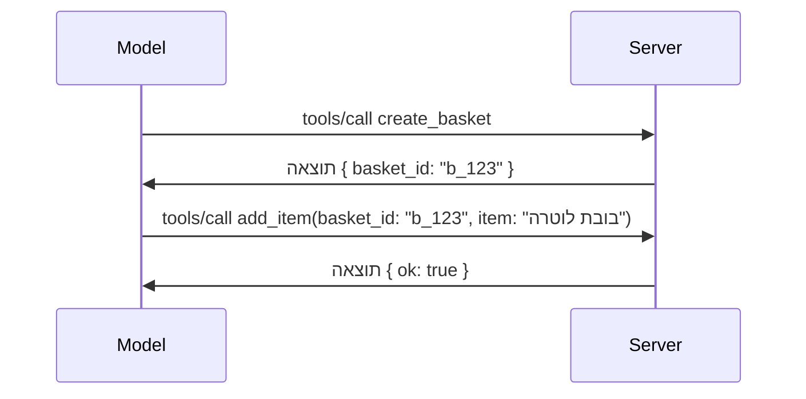

# מה משתנה ב-MCP: מועמד לשחרור של 2026-07-28

> **סטטוס:** מועמד לשחרור. המפרט `2026-07-28` אינו סופי בעת הכתיבה. הוא הוכרז ב-21 במאי 2026, ומתוכנן לצאת ב-28 ביולי 2026. כל מה שבשיעור זה מתאר את מועמד השחרור; בדוק את [מפרט הטיוטה](https://modelcontextprotocol.io/specification/draft) ואת [יומן השינויים](https://modelcontextprotocol.io/specification/draft/changelog) שלו למידע העדכני ביותר לפני שתבנה מולו. שאר התכנית הלימודית הזו נכתבה מול הגרסה היציבה הנוכחית, **מפרט MCP 2025-11-25**, ועדכון יבוצע כשהגרסה `2026-07-28` תשוחרר.

## סקירה כללית

`2026-07-28` היא העדכון הכי גדול של MCP מאז ההשקה. שישה הצעות לשיפור מפרט (SEPs) מסירות את הסשנים ברמת הפרוטוקול והופכות את MCP לפרוטוקול ללא מצב בשכבת התעבורה, ההרחבות הופכות למנגנון בעל מעמד ראשון ומתועדות גרסאות עבורן, וכמה תכונות שלמדתם מוקדם יותר בתכנית (Roots, Sampling, Logging) מסומנות כמיושנות תחת מדיניות מחזור חיים חדשה. שיעור זה מסכם מה משתנה, למה זה חשוב, ומה המשמעות לקוד שכבר כתבת מול `2025-11-25`.

מקור: [מועמד לשחרור מפרט MCP של 2026-07-28](https://blog.modelcontextprotocol.io/posts/2026-07-28-release-candidate/) (בלוג Model Context Protocol, דייוויד סוריה פארה ודן דלימרסקי).

## מטרות הלמידה

בסוף השיעור תוכל/י:

- להסביר מדוע MCP עובר לגרעין פרוטוקול ללא מצב ואיזה בעיה זה פותר בפריסות משורטטות אופקית.
- לתאר איך מחליפים את ברכת היד `initialize`/`initialized` ואת כותרת `Mcp-Session-Id`.
- לזהות את כותרות `Mcp-Method` ו-`Mcp-Name` החדשות ואת מטא-דאטת האחסון במטמון `ttlMs`/`cacheScope`.
- להכיר את מסגרת ההרחבות ואת שתי ההרחבות שמגיעות עם השחרור הזה: MCP Apps ו-Tasks.
- למנות את שש ה-SEPs של הרשאה שמחמירים את ההתאמה ל-OAuth 2.0 / OIDC.
- לזהות אילו תכונות ליבה (Roots, Sampling, Logging) מסומנות כמיושנות, ומה המשמעות בפועל.
- להסביר את השינוי של Full JSON Schema 2020-12 עבור כלי `inputSchema`/`outputSchema`.

## פרוטוקול ללא מצב

העדכון המרכזי: MCP הופך לפרוטוקול ללא מצב בשכבת הפרוטוקול.

### לפני (2025-11-25): סשנים קושרים אותך למופע שרת יחיד

קריאה לכלי דרך Streamable HTTP מתחילה בבירכת יד `initialize`. השרת משיב עם כותרת `Mcp-Session-Id` שכל בקשה אחרי מכן חייבת לשאת:

```http
POST /mcp HTTP/1.1
Mcp-Session-Id: 1868a90c-3a3f-4f5b
Content-Type: application/json

{"jsonrpc":"2.0","id":2,"method":"tools/call",
 "params":{"name":"search","arguments":{"q":"otters"}}}
```
  
מכיוון שהסשן קשור למופע השרת שהנפיק אותו, פריסות מורחבות אופקית דורשות **ניתוב צמוד** באיזון העומס ו-**אחסון סשנים משותף** בין המופעים.

### אחרי (2026-07-28): כל בקשה עצמאית

```http
POST /mcp HTTP/1.1
MCP-Protocol-Version: 2026-07-28
Mcp-Method: tools/call
Mcp-Name: search
Content-Type: application/json

{"jsonrpc":"2.0","id":1,"method":"tools/call",
 "params":{"name":"search","arguments":{"q":"otters"},
           "_meta":{"io.modelcontextprotocol/clientInfo":{"name":"my-app","version":"1.0"}}}}
```
  
כל מופע שרת יכול לטפל בבקשה הזו. שינויים מרכזיים:

- **ברכת היד `initialize`/`initialized` מוסרת** ([SEP-2575](https://github.com/modelcontextprotocol/modelcontextprotocol/pull/2575)). גרסת הפרוטוקול, מידע על הלקוח, ויכולות הלקוח עוברים ל-`_meta` בכל בקשה. שיטת `server/discover` חדשה מאפשרת ללקוח להביא את יכולות השרת מראש כשנדרשות.
- **כותרת `Mcp-Session-Id` והסשן ברמת הפרוטוקול מוסרים** ([SEP-2567](https://github.com/modelcontextprotocol/modelcontextprotocol/pull/2567)). אין עוד דרישה לניתוב צמוד או לאחסון סשנים משותף בשכבת הפרוטוקול.

### פרוטוקול ללא מצב, אפליקציות עם מצב

הסרת הסשן ברמת הפרוטוקול אינה אומרת שהשרת שלך אינו יכול להיות בעל מצב. הדפוס המומלץ הוא זהה למה ש-HTTP API תמיד השתמש בו: מייצרים ידית מפורשת (לדוגמה, `basket_id`, `browser_id`) מאחת הקריאות לכלי, והמודל מחזיר את הידית כפרמטר שגרתי בקריאות הבאות.


  
זה עושה את המצב גלוי והגיוני למודל במקום להסתיר אותו במטא-דאטת התעבורה, וזה מאפשר לכל מופע שרת לטפל בכל קריאה.

### בקשות מהשרת ללקוח, בארכיטקטורה מחדש

פרוטוקול ללא מצב עדיין צריך דרך שבה שרת יכול לבקש מהלקוח משהו באמצע קריאה (למשל, בקשת הפעלה):

- **בקשות שהשרת יוזם מותרות רק כאשר השרת מעבד ב actively בקשת לקוח** ([SEP-2260](https://github.com/modelcontextprotocol/modelcontextprotocol/pull/2260)) — קודם כך הומלץ, עכשיו חובה. המשתמש אף פעם לא מוצג עם בקשה פתאומית.
- **בקשות מרובות סבבים** ([SEP-2322](https://github.com/modelcontextprotocol/modelcontextprotocol/pull/2322)) מחליפות את החזקת זרם SSE פתוח. במקום זאת, השרת מחזיר `InputRequiredResult`:

  ```json
  {
    "resultType": "inputRequired",
    "inputRequests": {
      "confirm": {
        "type": "elicitation",
        "message": "Delete 3 files?",
        "schema": { "type": "boolean" }
      }
    },
    "requestState": "eyJzdGVwIjoxLCJmaWxlcyI6WyJhIiwiYiIsImMiXX0="
  }
  ```
  
הלקוח אוסף את התשובות ומוציא מחדש את הקריאה המקורית עם `inputResponses` בתוספת `requestState` המוחזר. כל מופע שרת יכול לתפוס את הניסיון מחדש כי כל מה שנדרש נמצא במשא.

### ניתוב, מטמון, ומעקב

שלושה שינויים קטנים מקלים על הפעלת תעבורת פרוטוקול ללא מצב:

- **כותרות `Mcp-Method` ו-`Mcp-Name` דרושות ב-Streamable HTTP** ([SEP-2243](https://github.com/modelcontextprotocol/modelcontextprotocol/pull/2243)) כך שמאזני עומס, שערים, ומגבלי שיעור יוכלו לנתב לפי הפעולה מבלי לעיין בגוף JSON. שרתים דוחים בקשות בהם הכותרות והגוף לא מתאימות.
- **תוצאות `tools/list` וקריאת משאבים נושאות `ttlMs` ו-`cacheScope`** ([SEP-2549](https://github.com/modelcontextprotocol/modelcontextprotocol/pull/2549)) , בדומה ל-HTTP `Cache-Control`. לקוחות יודעים כמה זמן התוצאה טרייה והאם בטוח לשתף בין משתמשים מבלי צורך בזרם SSE ארוך טווח ללמוד על שינויים.
- **תיעוד הפצת הקשר עקיבה W3C ב-`_meta`** ([SEP-414](https://github.com/modelcontextprotocol/modelcontextprotocol/pull/414)), מתקן את שמות המפתחות `traceparent`, `tracestate` ו-`baggage` כך שעקיבה מבוזרת תוכל לעקוב אחרי קריאה בין ה-SDK של הלקוח, שרת MCP ומערכות נוספות ב-backend התואם ל-[OpenTelemetry](https://opentelemetry.io/).

## הרחבות הופכות למעמד ראשון

הרחבות היו קיימות במוד בלתי רשמי ב-`2025-11-25`. [SEP-2133](https://github.com/modelcontextprotocol/modelcontextprotocol/pull/2133) פורמל אותן:

- הרחבות מזוהות על ידי מזהים בסגנון reverse-DNS.
- הן מנוהלות דרך מפות `extensions` ביכולות הלקוח והשרת.
- הן מתארחות במאגרים נפרדים בשם `ext-*` עם מנהלים ייעודיים ומוגדרות בגרסאות נפרדות מהמפרט הראשי.
- מסלול הרחבות חדש בתהליך SEP נותן להן נתיב מנסיוני לרשמי.

שחרור זה מביא שתי הרחבות רשמיות.

### MCP Apps: ממשקי משתמש המוצגים בשרת

[MCP Apps](https://blog.modelcontextprotocol.io/posts/2026-01-26-mcp-apps/) ([SEP-1865](https://github.com/modelcontextprotocol/modelcontextprotocol/pull/1865)) מאפשר לשרתים לשלוח ממשקי HTML אינטראקטיביים שהמאחסנים מציגים במסגרת iframe מבודדת. כלים מצהירים על תבניות ממשק המשתמש מראש כדי שהאירוח יוכל לקדם הורדה, לאחסן במטמון ולבדוק ביטחון לפני שהכל רץ. כבר למדת את היסודות ב[שיעור 15: MCP Apps](../03-GettingStarted/15-mcp-apps/README.md) — תחת מסגרת ההרחבות, MCP Apps הוא כעת הרחבה רשמית ולא תכונה ניסיונית ב-Core.

### Tasks מועברים להרחבה

Tasks נכנסו כתכונת core ניסיונית ב-`2025-11-25`. השימוש בפרודקשן חשף צורך בעיצוב מחודש כך שהבית הנכון הוא הרחבה: [ההרחבה Tasks](https://github.com/modelcontextprotocol/modelcontextprotocol/pull/2663) מעצבת מחדש את מחזור החיים סביב המודל ללא מצב — השרת יכול לענות ל-`tools/call` עם ידית משימה, והלקוח מנהל אותה עם `tasks/get`, `tasks/update`, ו-`tasks/cancel`. יצירת משימה מופעלת על ידי השרת: הלקוח מצהיר על ההרחבה, והשרת מחליט מתי קריאה תתבצע כמשימה. `tasks/list` מוסרת לגמרי כי היא לא יכולה להיסקר בטוח בלי סשנים.

> **הערת הגירה:** אם יישמת את ה-API הניסיוני `2025-11-25` של Tasks, תצטרך להגר למחזור החיים החדש של ההרחבה — הוא אינו תואם לאחור.

## חיזוק הרשאות

שישה SEPs מחזקים את [מפרט ההרשאה](https://modelcontextprotocol.io/specification/draft/basic/authorization) כדי להתאים טוב יותר לפריסות OAuth 2.0 / OpenID Connect אמיתיות:

| SEP | שינוי |
|---|---|
| [SEP-2468](https://github.com/modelcontextprotocol/modelcontextprotocol/pull/2468) | לקוחות חייבים לאמת את הפרמטר `iss` בתגובות הרשאה לפי [RFC 9207](https://www.rfc-editor.org/rfc/rfc9207), למנוע התקפות ערבוב המוכרות בדוגמת MCP של לקוח יחיד והרבה שרתים. גרסה עתידית תחייב לדחות תגובות חסרות `iss`. |
| [SEP-837](https://github.com/modelcontextprotocol/modelcontextprotocol/pull/837) | לקוחות מצהירים על `application_type` של OpenID Connect ברישום דינמי של לקוח, כדי למנוע ששרת ההרשאה יגדיר כברירת מחדל לקוח שולחני/CLI כ-`"web"` ויסרב ל-redirect URI של localhost שלו. |
| [SEP-2352](https://github.com/modelcontextprotocol/modelcontextprotocol/pull/2352) | לקוחות מקשרים את האישורים הרשומים ל-`issuer` של שרת ההרשאה שהנפיק אותם ומרשמים מחדש כשהמשאב עובר בין שרתי הרשאה. |
| [SEP-2207](https://github.com/modelcontextprotocol/modelcontextprotocol/pull/2207) | מתעד איך לבקש טוקני רענון משרתי הרשאה בסגנון OpenID Connect. |
| [SEP-2350](https://github.com/modelcontextprotocol/modelcontextprotocol/pull/2350) | מחדד צבירת ההרשאות במהלך העלאת הרשאות במדרג. |
| [SEP-2351](https://github.com/modelcontextprotocol/modelcontextprotocol/pull/2351) | מחדד את הסיומת `.well-known` לגילוי. |

אם אתה בונה שרת הרשאה עבור MCP כיום, התחל לספק `iss` בתגובות הרשאה כבר עכשיו — עיין ב-[02-Security](../02-Security/README.md) לקבלת הנחיות ההרשאה העכשוויות שעליהן זה יתבסס.

## Roots, Sampling ו-Logging הם מיושנים

מתחת ל[מדיניות מחזור החיים של תכונות](https://github.com/modelcontextprotocol/modelcontextprotocol/pull/2577) ([SEP-2577](https://github.com/modelcontextprotocol/modelcontextprotocol/pull/2577)), שלוש פרמיטיבים ללקוח שלמדתם ב-[מושגי ליבה](./README.md#roots) עוברים לסטטוס **Deprecated**:

| תכונה | תחליף מומלץ |
|---|---|
| Roots | פרמטרים של כלי, URI של משאבים, או תצורת שרת |
| Sampling | אינטגרציה ישירה עם API של ספקי LLM |
| Logging | `stderr` עבור תובלות stdio; OpenTelemetry לצפייה מובנית |

אלו הן **הצהרות מיושנות בלבד**: השיטות, הסוגים, ודגלי היכולת ממשיכים לעבוד בשחרור זה ובכל גרסת מפרט שפורסמה בתוך שנה ממנו. הסרת כל אחת מהן לגמרי תדרוש SEP נפרד תחת מדיניות מחזור החיים — כך ששום דבר לא יישבר בדוגמאות [Sampling](../03-GettingStarted/14-sampling/README.md) הקיימות, אך שרתים חדשים אמורים להעדיף את תבניות ההחלפה שהוזכרו.

## Full JSON Schema 2020-12 לכלים

הערכות `inputSchema` ו-`outputSchema` לכלי שודרגו ל-[JSON Schema 2020-12 מלא](https://json-schema.org/draft/2020-12) ([SEP-2106](https://github.com/modelcontextprotocol/modelcontextprotocol/pull/2106)):

- סכימות הקלט ממשיכות לדרוש מגבלה על שורש מסוג `type: "object"` אך עתה יכולות לכלול קומפוזיציה (`oneOf`, `anyOf`, `allOf`), תנאים, והפניות (`$ref`, `$defs`).
- סכימות הפלט אינן מוגבלות יותר, ו-`structuredContent` יכול להיות כל ערך JSON ולא רק אובייקט.
- ביצועים לא אמורים להפנות אוטומטית URI חיצוניים של `$ref` ויש להגביל את עומק הסכמה ואת זמן האימות (שיקול למניעת שירות מנועב אם האימות נעשה בצד השרת).

בנוסף, קוד השגיאה של משאב חסר משתנה מ-מכיל MCP מותאם `-32002` לסטנדרט JSON-RPC `-32602` (Invalid Params) ([SEP-2164](https://github.com/modelcontextprotocol/modelcontextprotocol/pull/2164)). אם הלקוח שלך מזהה לפי הערך המילולי `-32002`, תצטרך לעדכן אותו.

## איך הפרוטוקול יתפתח מכאן

שחרור זה מכיל שינויים שיבושיים, שלמנהלי MCP אין כוונה שיהיו לנורמה בעתיד. שלושה SEPs לניהול שואפים למנוע חזרה על זה:

- **מדיניות מחזור החיים לתכונות** מעניקה לכל תכונה נתיב Active → Deprecated → Removed עם לפחות 12 חודשים בין ההכרזה כהזנחה להסרה מוקדמת אפשרית.
- **מסגרת ההרחבות** מאפשרת להוסיף יכולות חדשות כהרחבות בהפעלת בחירה ומאפשרת לייצב אותן לפני כניסה לפרוטוקול הראשי, אם בכלל.

- SEP במסלול הסטנדרטים איננו יכול להגיע למעמד סופי עד שתסריט מתאים ינחת ב-[קונפורמציה סוויט](https://github.com/modelcontextprotocol/conformance) ([SEP-2484](https://github.com/modelcontextprotocol/modelcontextprotocol/pull/2484)) — אותה סוויט שבה [מערכת הדרגות SDK](https://github.com/modelcontextprotocol/modelcontextprotocol/pull/1777) מדרגת SDK רשמיים.

## לוח זמנים לשחרור ואימות

- מועמד להשקה ננעל ב-21 במאי 2026.
- המפרט הסופי מתוכנן ל-28 ביולי 2026.
- חלון של עשרה שבועות בין השניים מאפשר למתחזקי SDK ולמיישמי לקוחות לאמת את השינויים מול עומסי עבודה אמיתיים; SDK של דרגה 1 צפויים לשלב תמיכה בתוך חלון זה תחת [מערכת הדרגות SDK](https://modelcontextprotocol.io/docs/sdk).
- עקבו אחר סט השינויים המלא ב-[מפרט טיוטה](https://modelcontextprotocol.io/specification/draft) ו-[יומן השינויים שלו](https://modelcontextprotocol.io/specification/draft/changelog).

## משמעות הדבר עבור תוכנית הלימודים הזו

כל מה שלמדתם עד כה בקורס מכוון ל-**2025-11-25**, שהוא עדיין המפרט היציב הנוכחי עד ש־`2026-07-28` ישוחרר. למעשה:

- **מפגשים ו'הידית הפתיחה' initialize** (כוסה ב-[מושגים עיקריים](./README.md) ו-[שיעור 6: סטרימינג HTTP](../03-GettingStarted/06-http-streaming/README.md)) עדיין עובדים כפי שמותר היום, אך צפוי שהם יוחלפו על ידי מודל הבקשות ללא מצב שתואר לעיל כשאתם מחדשים ל-SDKים תואמי `2026-07-28`.
- **דגימת שורשים** (גם בכסוי ב-[מושגים עיקריים](./README.md)) נשארים פונקציונליים אך מוצאים מהשימוש — עיצובים חדשים צריכים להעדיף את תבניות ההחלפה המפורטות לעיל.
- **תכונת המשימות הניסיונית**, אם השתמשתם בה, תצטרך להיגרר למחזור החיים החדש של הרחבת המשימות.
- **אפליקציות MCP** ([שיעור 15](../03-GettingStarted/15-mcp-apps/README.md)) לא מושפעות בפועל; הן פשוט עוברות תחת מסגרת ההרחבות הרשמית.

## משאבים נוספים

- [מועמד לשחרור מפרט MCP 2026-07-28 (פוסט בלוג)](https://blog.modelcontextprotocol.io/posts/2026-07-28-release-candidate/)
- [עתיד ההובלות של MCP](https://blog.modelcontextprotocol.io/posts/2025-12-19-mcp-transport-future/)
- [טיוטת מפרט MCP](https://modelcontextprotocol.io/specification/draft)
- [יומן שינויים לטיוטת MCP](https://modelcontextprotocol.io/specification/draft/changelog)
- [הנחיות SEP](https://modelcontextprotocol.io/community/sep-guidelines)
- [מערכת דרגות MCP SDK](https://modelcontextprotocol.io/docs/sdk)

## צעדים הבאים

חזרו אל [מושגים עיקריים](./README.md) או המשיכו אל [אבטחה](../02-Security/README.md) כדי לראות כיצד ההדרכה של היום `2025-11-25` מתאימה למה שבא.

---

<!-- CO-OP TRANSLATOR DISCLAIMER START -->
**כתב ויתור**:
מסמך זה תורגם באמצעות שירות תרגום אוטומטי [Co-op Translator](https://github.com/Azure/co-op-translator). למרות שאנו שואפים לדיוק, יש לקחת בחשבון שתרגומים אוטומטיים עלולים להכיל שגיאות או אי-דיוקים. יש להחשיב את המסמך המקורי בשפתו הטבעית כמקור הסמכות. למידע קריטי מומלץ להשתמש בתרגום מקצועי על ידי מתרגם אדם. אנו לא אחראים לכל אי-הבנה או פירוש שגוי הנובע מהשימוש בתרגום זה.
<!-- CO-OP TRANSLATOR DISCLAIMER END -->