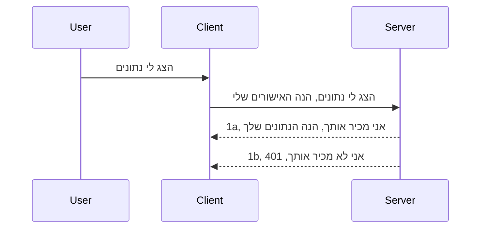

# אימות פשוט

MCP SDKs תומכות בשימוש ב-OAuth 2.1, שזו תהליך די מורכב הכולל מושגים כמו שרת אימות, שרת משאבים, שליחת אישורים, קבלת קוד, החלפת הקוד לטוקן נושא (bearer token) עד שבסופו של דבר אפשר לקבל את נתוני המשאב. אם אינכם רגילים ל-OAuth, שזה דבר מצוין ליישום, מומלץ להתחיל ברמת אימות בסיסית ולבנות עד לאבטחה טובה וטובה יותר. בגלל זה הקיים הפרק הזה, כדי לבנות אתכם לאימות מתקדם יותר.

## אימות, על מה אנחנו מדברים?

אימות זו קיצור של authentication ואישור (authorization). הרעיון הוא שעלינו לעשות שני דברים:

- **אימות (Authentication)**, שהוא התהליך של לברר האם אנחנו מרשים לאדם להיכנס לבית שלנו, שיש לו את הזכות להיות "פה", כלומר שיש לו גישה לשרת המשאבים שלנו שבו תכונות שרת ה-MCP שלנו נמצאות.
- **אישור (Authorization)**, הוא התהליך של לברר אם משתמש צריך לקבל גישה למשאבים הספציפיים שהוא מבקש, למשל הזמנות אלו או מוצרים אלו, או האם הוא מורשה לקרוא את התוכן אך לא למחוק כדוגמה נוספת.

## אישורים: איך אנחנו אומרים למערכת מי אנחנו

ובכן, רוב מפתחי האינטרנט מתחילים לחשוב במונחים של מתן אישור לשרת, בדרך כלל סוד שאומר אם הם מורשים להיות כאן - "Authentication". האישור הזה בדרך כלל הוא גרסה מקודדת ב-base64 של שם משתמש וסיסמה או מפתח API שמזהה משתמש ספציפי בצורה ייחודית.

זה כרוך בשליחתו דרך כותרת שנקראת "Authorization" כך:

```json
{ "Authorization": "secret123" }
```

זה בדרך כלל נקרא אימות בסיסי. איך הזרימה הכללית עובדת אחר כך הוא כך:



עכשיו כשהבנו איך זה עובד מבחינת זרימה, איך מיישמים את זה? ובכן, רוב שרתי האינטרנט כוללים מושג שנקרא middleware, חתיכת קוד שרצה כחלק מבקשה שיכולה לאמת אישורים, ואם האישורים תקינים יכולים לאפשר לבקשה לעבור. אם הבקשה לא כוללת אישורים תקינים, מקבלים שגיאת אימות. בואו נראה איך אפשר ליישם את זה:

**Python**

```python
class AuthMiddleware(BaseHTTPMiddleware):
    async def dispatch(self, request, call_next):

        has_header = request.headers.get("Authorization")
        if not has_header:
            print("-> Missing Authorization header!")
            return Response(status_code=401, content="Unauthorized")

        if not valid_token(has_header):
            print("-> Invalid token!")
            return Response(status_code=403, content="Forbidden")

        print("Valid token, proceeding...")
       
        response = await call_next(request)
        # הוסף כל כותרות לקוח או שנה את התגובה בדרך כלשהי
        return response


starlette_app.add_middleware(CustomHeaderMiddleware)
```

כאן יש לנו: 

- יצרנו middleware שנקרא `AuthMiddleware` שבו השיטה `dispatch` קוראת על ידי שרת האינטרנט.
- הוספנו את ה-middleware לשרת האינטרנט:

    ```python
    starlette_app.add_middleware(AuthMiddleware)
    ```

- כתבנו לוגיקת אימות שבודקת אם כותרת Authorization קיימת ואם הסוד שנשלח תקין:

    ```python
    has_header = request.headers.get("Authorization")
    if not has_header:
        print("-> Missing Authorization header!")
        return Response(status_code=401, content="Unauthorized")

    if not valid_token(has_header):
        print("-> Invalid token!")
        return Response(status_code=403, content="Forbidden")
    ```

    אם הסוד קיים ותקין, אנחנו מרשים לבקשה לעבור על ידי קריאה ל-`call_next` ומחזירים את התגובה.

    ```python
    response = await call_next(request)
    # להוסיף כותרות לקוח כלשהן או לשנות את התגובה בדרך כלשהי
    return response
    ```

איך זה עובד הוא שאם מתקבלת בקשת רשת אל השרת, ה-middleware ייקרא ובהתאם למימושו הוא יאשר לבקשה לעבור או יחזיר שגיאה שמציינת שללקוח אין הרשאה להמשיך.

**TypeScript**

פה אנחנו יוצרים middleware עם המסגרת הפופולרית Express ותופסים את הבקשה לפני שהיא מגיעה לשרת MCP. הנה הקוד לכך:

```typescript
function isValid(secret) {
    return secret === "secret123";
}

app.use((req, res, next) => {
    // 1. כותרת האישור קיימת?
    if(!req.headers["Authorization"]) {
        res.status(401).send('Unauthorized');
    }
    
    let token = req.headers["Authorization"];

    // 2. בדוק תקפות.
    if(!isValid(token)) {
        res.status(403).send('Forbidden');
    }

   
    console.log('Middleware executed');
    // 3. מעביר את הבקשה לשלב הבא בצינור הבקשות.
    next();
});
```

בקוד הזה:

1. אנחנו בודקים אם כותרת Authorization קיימת מלכתחילה, אם לא, שולחים שגיאה 401.
2. מוודאים שהאישור/טוקן תקין, אם לא, שולחים שגיאה 403.
3. בסוף מעבירים את הבקשה בצינור הבקשות ומחזירים את המשאב המבוקש.

## תרגיל: יישום אימות

בואו ניקח את הידע שלנו ונתחיל לממש. התוכנית היא:

שרת

- ליצור שרת אינטרנט ומופע MCP.
- לממש middleware עבור השרת.

לקוח

- לשלוח בקשת רשת, עם אישור, דרך הכותרת.

### -1- יצירת שרת אינטרנט ומופע MCP

> **מבט קדימה:** בדוגמת TypeScript למטה עוקבים אחר תחבורות HTTP במפת `transports` שממוקמת לפי `mcp-session-id`, לפי **מפרט MCP 2025-11-25**. מועמד לשחרור `2026-07-28` מסיר את היד המקשרת `initialize` ואת מזהה הסשן לחלוטין, כך שמפת התחבורה per-session הזו תחלף בגישה ללא מצב (stateless) ועם בקשות עצמאיות. ראו [מה משתנה ב-MCP: מועמד לשחרור 2026-07-28](../../01-CoreConcepts/mcp-2026-07-28-release-candidate.md).

בשלב הראשון שלנו, אנחנו צריכים ליצור מופע של שרת הרשת ושרת ה-MCP.

**Python**

כאן אנחנו יוצרים מופע שרת MCP, יוצרים אפליקציית starlette ומארחים אותה בעזרת uvicorn.

```python
# יצירת שרת MCP

app = FastMCP(
    name="MCP Resource Server",
    instructions="Resource Server that validates tokens via Authorization Server introspection",
    host=settings["host"],
    port=settings["port"],
    debug=True
)

# יצירת אפליקציית ווב starlette
starlette_app = app.streamable_http_app()

# הגשת האפליקציה דרך uvicorn
async def run(starlette_app):
    import uvicorn
    config = uvicorn.Config(
            starlette_app,
            host=app.settings.host,
            port=app.settings.port,
            log_level=app.settings.log_level.lower(),
        )
    server = uvicorn.Server(config)
    await server.serve()

run(starlette_app)
```

בקוד הזה:

- יוצרים את שרת ה-MCP.
- בונים את אפליקציית starlette מהשרת MCP, `app.streamable_http_app()`.
- מארחים ומפעילים את אפליקציית הרשת באמצעות uvicorn `server.serve()`.

**TypeScript**

כאן אנחנו יוצרים מופע שרת MCP.

```typescript
const server = new McpServer({
      name: "example-server",
      version: "1.0.0"
    });

    // ... להגדיר משאבי שרת, כלים והנחיות ...
```

יצירת שרת MCP זו תצטרך להתרחש בתוך הגדרת הנתיב POST /mcp, אז ניקח את הקוד למעלה ונעביר אותו כך:

```typescript
import express from "express";
import { randomUUID } from "node:crypto";
import { McpServer } from "@modelcontextprotocol/sdk/server/mcp.js";
import { StreamableHTTPServerTransport } from "@modelcontextprotocol/sdk/server/streamableHttp.js";
import { isInitializeRequest } from "@modelcontextprotocol/sdk/types.js"

const app = express();
app.use(express.json());

// מפה לאחסון תחבורה לפי מזהה סשן
const transports: { [sessionId: string]: StreamableHTTPServerTransport } = {};

// טיפול בבקשות POST לתקשורת לקוח-שרת
app.post('/mcp', async (req, res) => {
  // בדוק קיום מזהה סשן
  const sessionId = req.headers['mcp-session-id'] as string | undefined;
  let transport: StreamableHTTPServerTransport;

  if (sessionId && transports[sessionId]) {
    // שימוש חוזר בתחבורה קיימת
    transport = transports[sessionId];
  } else if (!sessionId && isInitializeRequest(req.body)) {
    // בקשת אתחול חדשה
    transport = new StreamableHTTPServerTransport({
      sessionIdGenerator: () => randomUUID(),
      onsessioninitialized: (sessionId) => {
        // אחסן את התחבורה לפי מזהה סשן
        transports[sessionId] = transport;
      },
      // הגנת DNS rebinding מושבתת כברירת מחדל לתאימות לאחור. אם אתה מפעיל את השרת הזה
      // באופן מקומי, ודא להגדיר:
      // enableDnsRebindingProtection: true,
      // allowedHosts: ['127.0.0.1'],
    });

    // נקה את התחבורה בעת סגירה
    transport.onclose = () => {
      if (transport.sessionId) {
        delete transports[transport.sessionId];
      }
    };
    const server = new McpServer({
      name: "example-server",
      version: "1.0.0"
    });

    // ... הגדר משאבים, כלים והנחיות של השרת ...

    // התחבר לשרת MCP
    await server.connect(transport);
  } else {
    // בקשה לא חוקית
    res.status(400).json({
      jsonrpc: '2.0',
      error: {
        code: -32000,
        message: 'Bad Request: No valid session ID provided',
      },
      id: null,
    });
    return;
  }

  // טיפול בבקשה
  await transport.handleRequest(req, res, req.body);
});

// מנהל שניתן להשתמש בו מחדש עבור בקשות GET ו-DELETE
const handleSessionRequest = async (req: express.Request, res: express.Response) => {
  const sessionId = req.headers['mcp-session-id'] as string | undefined;
  if (!sessionId || !transports[sessionId]) {
    res.status(400).send('Invalid or missing session ID');
    return;
  }
  
  const transport = transports[sessionId];
  await transport.handleRequest(req, res);
};

// טיפול בבקשות GET עבור התראות שרת-לקוח באמצעות SSE
app.get('/mcp', handleSessionRequest);

// טיפול בבקשות DELETE לסיום סשן
app.delete('/mcp', handleSessionRequest);

app.listen(3000);
```

כעת אתם רואים כיצד יצירת שרת MCP הועברה לתוך `app.post("/mcp")`.

בואו נעבור לשלב הבא: יצירת ה-middleware כדי שנוכל לאמת את האישור שנכנס.

### -2- יישום middleware עבור השרת

בואו נעבור לקטע ה-middleware. כאן ניצור middleware שמחפש אישור בכותרת `Authorization` ומאמת אותו. אם הוא מקובל, הבקשה תמשיך ותעשה את מה שהיא צריכה (למשל רשימת כלים, קריאת משאב או כל פונקציונליות MCP שהלקוח ביקש).

**Python**

ליצירת ה-middleware, צריך ליצור מחלקה שיורשת מ-`BaseHTTPMiddleware`. יש שני אלמנטים מעניינים:

- הבקשה `request`, שממנה נקרא את פרטי הכותרת.
- `call_next` הקריאה חוזרת שיש להפעיל אם הלקוח הביא אישור שאנחנו מקבלים.

ראשית, צריך לטפל במקרה שכותרת `Authorization` חסרה:

```python
has_header = request.headers.get("Authorization")

# אין כותרת, נכשל עם 401, אחרת ממשיכים.
if not has_header:
    print("-> Missing Authorization header!")
    return Response(status_code=401, content="Unauthorized")
```

כאן אנחנו שולחים הודעת 401 לא מורשה כי הלקוח נכשל באימות.

אחר כך, אם הוגש אישור, צריך לבדוק את תקינותו כך:

```python
 if not valid_token(has_header):
    print("-> Invalid token!")
    return Response(status_code=403, content="Forbidden")
```

שימו לב שאנו שולחים הודעת 403 אסור למעלה. בואו נראה את ה-middleware המלא למטה שמממש את כל מה שהזכרנו:

```python
class AuthMiddleware(BaseHTTPMiddleware):
    async def dispatch(self, request, call_next):

        has_header = request.headers.get("Authorization")
        if not has_header:
            print("-> Missing Authorization header!")
            return Response(status_code=401, content="Unauthorized")

        if not valid_token(has_header):
            print("-> Invalid token!")
            return Response(status_code=403, content="Forbidden")

        print("Valid token, proceeding...")
        print(f"-> Received {request.method} {request.url}")
        response = await call_next(request)
        response.headers['Custom'] = 'Example'
        return response

```

מצוין, אבל מה עם הפונקציה `valid_token`? הנה היא למטה:

```python
# לא להשתמש בפרודקשן - לשפר את זה !!
def valid_token(token: str) -> bool:
    # הסר את הקידומת "Bearer "
    if token.startswith("Bearer "):
        token = token[7:]
        return token == "secret-token"
    return False
```

כמובן שזו יכולה להשתפר.

חשוב: אסור שתהיו עם סודות כאלה בקוד. רצוי לקבל את הערך להשוואה ממקור נתונים או מספק שירותי זהות (IDP) או אפילו יותר טוב, לתת ל-IDP לאמת את זה.

**TypeScript**

כדי לממש את זה עם Express, צריכים לקרוא ל-`use` שמקבלת פונקציות middleware.

צריך:

- לעבוד עם המשתנה הבקשה כדי לבדוק את האישורים שנשלחו בפרופרטי `Authorization`.
- לאמת את האישורים, ואם תקינים לאפשר לבקשה להמשיך ולקבל מה שהלקוח מבקש ב-MCP (למשל רשימת כלים, קריאת משאבים וכו').

כאן, אנחנו בודקים אם הכותרת `Authorization` קיימת ואם לא, מפסיקים את הבקשה:

```typescript
if(!req.headers["authorization"]) {
    res.status(401).send('Unauthorized');
    return;
}
```

אם הכותרת לא נשלחה מלכתחילה, תקבלו 401.

אחר כך, בודקים אם האישורים תקינים, ואם לא, שוב מפסיקים את הבקשה אך עם הודעה שונה:

```typescript
if(!isValid(token)) {
    res.status(403).send('Forbidden');
    return;
} 
```

כאן אתם רואים שתקבלו שגיאה 403.

הנה כל הקוד:

```typescript
app.use((req, res, next) => {
    console.log('Request received:', req.method, req.url, req.headers);
    console.log('Headers:', req.headers["authorization"]);
    if(!req.headers["authorization"]) {
        res.status(401).send('Unauthorized');
        return;
    }
    
    let token = req.headers["authorization"];

    if(!isValid(token)) {
        res.status(403).send('Forbidden');
        return;
    }  

    console.log('Middleware executed');
    next();
});
```

הגדרנו את שרת האינטרנט לקבל middleware שיבדוק את האישורים שהלקוח מקווה לשלוח לנו. מה עם הלקוח עצמו?

### -3- שליחת בקשת רשת עם אישורים דרך הכותרת

עלינו לוודא שהלקוח מעביר את האישורים דרך הכותרת. מאחר ונשתמש בלקוח MCP לעשות זאת, צריך להבין איך עושים זאת.

**Python**

עבור הלקוח, צריך להעביר כותרת עם אישור כך:

```python
# אל תקבע את הערך בקוד, שמור אותו לפחות במשתנה סביבה או באחסון מאובטח יותר
token = "secret-token"

async with streamablehttp_client(
        url = f"http://localhost:{port}/mcp",
        headers = {"Authorization": f"Bearer {token}"}
    ) as (
        read_stream,
        write_stream,
        session_callback,
    ):
        async with ClientSession(
            read_stream,
            write_stream
        ) as session:
            await session.initialize()
      
            # TODO, מה שאתה רוצה שיבוצע בצד הלקוח, לדוגמה רשימת כלים, קריאת כלים וכו'.
```

שימו לב שאנחנו מאכלסים את המאפיין `headers` כך ` headers = {"Authorization": f"Bearer {token}"}`.

**TypeScript**

אפשר לפתור זאת בשני שלבים:

1. למלא אובייקט הגדרות עם האישור.
2. להעביר את אובייקט ההגדרות לתחבורה.

```typescript

// אל תקבע את הערך כאן בקוד בצורה קשיחה. לפחות שמור אותו כמשתנה סביבה ותשתמש במשהו כמו dotenv (במצב פיתוח).
let token = "secret123"

// הגדר אובייקט אפשרויות להובלה של לקוח
let options: StreamableHTTPClientTransportOptions = {
  sessionId: sessionId,
  requestInit: {
    headers: {
      "Authorization": "secret123"
    }
  }
};

// העבר את אובייקט האופציות להובלה
async function main() {
   const transport = new StreamableHTTPClientTransport(
      new URL(serverUrl),
      options
   );
```

כאן אתם רואים איך היינו צריכים ליצור אובייקט `options` ולמקם את הכותרות תחת `requestInit`.

חשוב: איך משפרים את זה מכאן? ובכן, המימוש הנוכחי כולל כמה בעיות. ראשית, העברת אישורים כזו היא בסיכון גבוה אם אין HTTPS. גם אז, האישור יכול להיגנב ולכן צריך מערכת בה אפשר לבטל בקלות את הטוקן ולהוסיף בדיקות נוספות כמו מאיפה בעולם הטוקן מגיע, האם הבקשה מתבצעת בתדירות גבוהה מדי (התנהגות בוט), בקיצור יש מלא דברים שיש להתחשב בהם.

עם זאת, לממשקי API מאוד פשוטים שרוצים למנוע גישה ללא אימות מהווה התחלה טובה.

עם זאת, ננסה לחזק את האבטחה מעט באמצעות שימוש בפורמט סטנדרטי כמו JSON Web Token, הידוע גם כ-JWT או "JOT".

## JSON Web Tokens, JWT

אז, אנחנו מנסים לשפר את הדברים מעבר לשליחת אישורים פשוטים. מה המשפרות המיידיות שהתקבלות JWT?

- **שפרי אבטחה**. באימות בסיסי, אתה שולח שוב ושוב שם משתמש וסיסמה מקודדים ב-base64 (או מפתח API) מה שמעלה את הסיכון. עם JWT, שולחים את שם המשתמש והסיסמה ולקבל טוקן בתמורה, והוא גם מוגבל בזמן כלומר יפוג. JWT מאפשר שליטה מדויקת באמצעות תפקידים, טווחים והרשאות.
- **ללא מצב וסקלאביליות**. JWT הם עצמאים, נושאים את כל המידע של המשתמש ומבטלים את הצורך באחסון סשן צד שרת. הטוקן גם ניתן לאימות מקומי.
- **אינטרופרביליות ופדרציה**. JWT הוא מרכזי ב-Open ID Connect ומשמש עם ספקי זהות ידועים כמו Entra ID, Google Identity ו-Auth0. הם גם מאפשרים שימוש בכניסה חד-פעמית (SSO) והרבה יותר, מה שהופך אותו לרמת ארגון.
- **מודולריות וגמישות**. JWT גם משמש עם שערי API כמו Azure API Management, NGINX ועוד. תומך בתרחישי אימות ושיחה בין שרת-לשרת כולל ייצוג והאצלה.
- **ביצועים ומטמון**. JWT יכול להיות במטמון אחרי פענוח, מה שמפחית צורך בפרסינג מחודש. זה עוזר במיוחד באפליקציות עם תנועה גבוהה כי זה משפר תעבורה ומפחית עומס על התשתית.
- **תכונות מתקדמות**. תומך גם באינטראוספקציה (בדיקת תקינות בשרת) ובביטול (הפיכת הטוקן לבלתי חוקי).

עם כל היתרונות האלה, בואו נראה איך נוכל לקחת את המימוש שלנו לשלב הבא.

## המרת אימות בסיסי ל-JWT

אז השינויים שעלינו לעשות ברמה גבוהה ביותר הם:

- **ללמוד לבנות טוקן JWT** ולהכין אותו לשליחה מהלקוח לשרת.
- **לאמת טוקן JWT**, ואם תקין, לאפשר ללקוח לקבל את המשאבים שלנו.
- **אחסון מאובטח של הטוקן**. איך נשמור את הטוקן הזה.
- **הגנה על הנתיבים**. עלינו להגן על הנתיבים, במקרה שלנו על נתיבי MCP ותכונות ספציפיות.
- **הוספת טוקני רענון**. לדאוג ליצירת טוקנים קצרים חיים אך עם טוקני רענון ארוכי חיים שניתן להשתמש בהם לקבלת טוקנים חדשים אם הם פגים. גם לוודא שיש נקודת רענון ואסטרטגיית סיבוב.

### -1- בניית טוקן JWT

ראשית, טוקן JWT מורכב מהחלקים הבאים:

- **header**, האלגוריתם וסוג הטוקן.
- **payload**, תביעות, כמו sub (המשתמש או הישות שהטוקן מייצג. במקרה אימות זה בדרך כלל מזהה המשתמש), exp (מועד תפוגה), role (תפקיד).
- **signature**, חתימה עם סוד או מפתח פרטי.

לזה, נצטרך לבנות את ה-header, ה-payload והטוקן המקודד.

**Python**

```python

import jwt
import jwt
from jwt.exceptions import ExpiredSignatureError, InvalidTokenError
import datetime

# מפתח סודי המשמש לחתימת JWT
secret_key = 'your-secret-key'

header = {
    "alg": "HS256",
    "typ": "JWT"
}

# מידע המשתמש וטענותיו וזמן התפוגה שלו
payload = {
    "sub": "1234567890",               # נושא (מזהה המשתמש)
    "name": "User Userson",                # טענה מותאמת אישית
    "admin": True,                     # טענה מותאמת אישית
    "iat": datetime.datetime.utcnow(),# נוצר בתאריך
    "exp": datetime.datetime.utcnow() + datetime.timedelta(hours=1)  # תאריך תפוגה
}

# קידוד שלו
encoded_jwt = jwt.encode(payload, secret_key, algorithm="HS256", headers=header)
```

בקוד למעלה:

- הגדרנו header שמשתמש ב-HS256 כאלגוריתם והגדרנו type להיות JWT.
- בנינו payload שמכיל נושא או מזהה משתמש, שם משתמש, תפקיד, מתי הונפק ומתי יפוג, וכך מיישם את ההיבט הבזמן שציינו קודם.

**TypeScript**

כאן נצטרך כמה תלותיות שיסייעו לנו לבנות את הטוקן JWT.

תלותיות

```sh

npm install jsonwebtoken
npm install --save-dev @types/jsonwebtoken
```

כעת כשיש לנו את זה, בואו ניצור את ה-header, ה-payload ודרך זה ניצור את הטוקן המקודד.

```typescript
import jwt from 'jsonwebtoken';

const secretKey = 'your-secret-key'; // השתמש במשתני סביבה בפרודקשן

// הגדר את המטען
const payload = {
  sub: '1234567890',
  name: 'User usersson',
  admin: true,
  iat: Math.floor(Date.now() / 1000), // נוצר ב
  exp: Math.floor(Date.now() / 1000) + 60 * 60 // פג תוקף תוך שעה
};

// הגדר את הכותרת (אופציונלי, jsonwebtoken מגדיר ברירות מחדל)
const header = {
  alg: 'HS256',
  typ: 'JWT'
};

// צור את הטוקן
const token = jwt.sign(payload, secretKey, {
  algorithm: 'HS256',
  header: header
});

console.log('JWT:', token);
```

הטוקן הזה:

חתום באמצעות HS256
בתוקף לשעה אחת
כולל תביעות כמו sub, name, admin, iat, ו-exp.

### -2- אימות טוקן

נזדקק גם לאמת טוקן, זאת פעולה שצריך לבצע בשרת כדי לוודא שהלקוח שולח אכן אישור תקף. ישנן בדיקות רבות שיש לעשות, החל מאימות המבנה ועד לתוקף. מומלץ להוסיף בדיקות נוספות כמו שמוודאים שהמשתמש נמצא במערכת ועוד.

כדי לאמת טוקן, צריך לפענח אותו כדי שנוכל לקרוא אותו ואז להתחיל לבדוק את תקינותו:

**Python**

```python

# לפרש ולאמת את ה-JWT
try:
    decoded = jwt.decode(token, secret_key, algorithms=["HS256"])
    print("✅ Token is valid.")
    print("Decoded claims:")
    for key, value in decoded.items():
        print(f"  {key}: {value}")
except ExpiredSignatureError:
    print("❌ Token has expired.")
except InvalidTokenError as e:
    print(f"❌ Invalid token: {e}")

```

בקוד זה, אנו קוראים ל-`jwt.decode` באמצעות הטוקן, מפתח הסוד והאלגוריתם הנבחר כקלט. שימו לב כיצד אנו משתמשים במבנה try-catch משום שאימות שנכשל מוביל לשגיאה.

**TypeScript**

כאן עלינו לקרוא ל-`jwt.verify` כדי לקבל גרסה מפורשת של הטוקן שנוכל לנתח הלאה. אם קריאה זו נכשלת, משמעות הדבר שהמבנה של הטוקן שגוי או שהוא כבר לא תקף.

```typescript

try {
  const decoded = jwt.verify(token, secretKey);
  console.log('Decoded Payload:', decoded);
} catch (err) {
  console.error('Token verification failed:', err);
}
```

NOTE: כפי שנאמר קודם לכן, עלינו לבצע בדיקות נוספות כדי לוודא שטוקן זה מתייחס למשתמש במערכת שלנו ולוודא שלמשתמש יש את הזכויות שהוא טוען שיש לו.

כעת, בואו נבחן בקרת גישה מבוססת תפקידים, הידועה גם כ-RBAC.

## הוספת בקרת גישה מבוססת תפקיד

הרעיון הוא שאנו רוצים להביע שתפקידים שונים מקבלים הרשאות שונות. לדוגמה, אנו מניחים שמנהל יכול לעשות הכל, שמשתמש רגיל יכול לקרוא/לכתוב ואורח יכול רק לקרוא. לכן, להלן כמה רמות הרשאה אפשריות:

- Admin.Write 
- User.Read
- Guest.Read

בואו נראה כיצד ניתן לממש בקרת גישה כזו עם middleware. ניתן להוסיף middleware לכל נתיב בנפרד וגם לכל הנתיבים.

**Python**

```python
from starlette.middleware.base import BaseHTTPMiddleware
from starlette.responses import JSONResponse
import jwt

# אל תכלול את הסוד בקוד, זה מיועד רק למטרות הדגמה. קרא אותו ממקום מוגן.
SECRET_KEY = "your-secret-key" # שים את זה במשתנה סביבה
REQUIRED_PERMISSION = "User.Read"

class JWTPermissionMiddleware(BaseHTTPMiddleware):
    async def dispatch(self, request, call_next):
        auth_header = request.headers.get("Authorization")
        if not auth_header or not auth_header.startswith("Bearer "):
            return JSONResponse({"error": "Missing or invalid Authorization header"}, status_code=401)

        token = auth_header.split(" ")[1]
        try:
            decoded = jwt.decode(token, SECRET_KEY, algorithms=["HS256"])
        except jwt.ExpiredSignatureError:
            return JSONResponse({"error": "Token expired"}, status_code=401)
        except jwt.InvalidTokenError:
            return JSONResponse({"error": "Invalid token"}, status_code=401)

        permissions = decoded.get("permissions", [])
        if REQUIRED_PERMISSION not in permissions:
            return JSONResponse({"error": "Permission denied"}, status_code=403)

        request.state.user = decoded
        return await call_next(request)


```

יש כמה דרכים שונות להוסיף את ה-middleware כמו למטה:

```python

# אלט 1: הוסף middleware בזמן בניית יישום starlette
middleware = [
    Middleware(JWTPermissionMiddleware)
]

app = Starlette(routes=routes, middleware=middleware)

# אלט 2: הוסף middleware לאחר שיישום starlette כבר נבנה
starlette_app.add_middleware(JWTPermissionMiddleware)

# אלט 3: הוסף middleware לכל נתיב
routes = [
    Route(
        "/mcp",
        endpoint=..., # מנהל
        middleware=[Middleware(JWTPermissionMiddleware)]
    )
]
```

**TypeScript**

ניתן להשתמש ב-`app.use` וב-middleware שרץ עבור כל הבקשות.

```typescript
app.use((req, res, next) => {
    console.log('Request received:', req.method, req.url, req.headers);
    console.log('Headers:', req.headers["authorization"]);

    // 1. בדוק אם כותרת האישור נשלחה

    if(!req.headers["authorization"]) {
        res.status(401).send('Unauthorized');
        return;
    }
    
    let token = req.headers["authorization"];

    // 2. בדוק אם הטוקן תקף
    if(!isValid(token)) {
        res.status(403).send('Forbidden');
        return;
    }  

    // 3. בדוק אם משתמש הטוקן קיים במערכת שלנו
    if(!isExistingUser(token)) {
        res.status(403).send('Forbidden');
        console.log("User does not exist");
        return;
    }
    console.log("User exists");

    // 4. אמת שהטוקן מכיל את ההרשאות הנכונות
    if(!hasScopes(token, ["User.Read"])){
        res.status(403).send('Forbidden - insufficient scopes');
    }

    console.log("User has required scopes");

    console.log('Middleware executed');
    next();
});

```

יש כמה דברים שה-middleware שלנו יכול וצריך לעשות, כלומר:

1. לבדוק אם כותרת authorization קיימת
2. לבדוק אם הטוקן תקף, אנו קוראים ל-`isValid` שהיא שיטה שכתבנו שבודקת את השלמות והתקפות של טוקן JWT.
3. לאמת שקיימ המשתמש במערכת שלנו, עלינו לבדוק זאת.

   ```typescript
    // משתמשים במסד הנתונים
   const users = [
     "user1",
     "User usersson",
   ]

   function isExistingUser(token) {
     let decodedToken = verifyToken(token);

     // עוד לבדיקת, האם המשתמש קיים במסד הנתונים
     return users.includes(decodedToken?.name || "");
   }
   ```

   למעלה יצרנו רשימת `users` פשוטה, שלמעשה אמורה להיות במסד נתונים.

4. בנוסף, עלינו לוודא שלטוקן יש את ההרשאות הנכונות.

   ```typescript
   if(!hasScopes(token, ["User.Read"])){
        res.status(403).send('Forbidden - insufficient scopes');
   }
   ```

   בקוד למעלה מה-middleware, אנו בודקים שהטוקן מכיל הרשאת User.Read, ואם לא, נשלח שגיאה 403. למטה היא שיטת העזר `hasScopes`.

   ```typescript
   function hasScopes(scope: string, requiredScopes: string[]) {
     let decodedToken = verifyToken(scope);
    return requiredScopes.every(scope => decodedToken?.scopes.includes(scope));
  }
   ```

Have a think which additional checks you should be doing, but these are the absolute minimum of checks you should be doing.

Using Express as a web framework is a common choice. There are helpers library when you use JWT so you can write less code.

- `express-jwt`, helper library that provides a middleware that helps decode your token.
- `express-jwt-permissions`, this provides a middleware `guard` that helps check if a certain permission is on the token.

Here's what these libraries can look like when used:

```typescript
const express = require('express');
const jwt = require('express-jwt');
const guard = require('express-jwt-permissions')();

const app = express();
const secretKey = 'your-secret-key'; // put this in env variable

// Decode JWT and attach to req.user
app.use(jwt({ secret: secretKey, algorithms: ['HS256'] }));

// Check for User.Read permission
app.use(guard.check('User.Read'));

// multiple permissions
// app.use(guard.check(['User.Read', 'Admin.Access']));

app.get('/protected', (req, res) => {
  res.json({ message: `Welcome ${req.user.name}` });
});

// Error handler
app.use((err, req, res, next) => {
  if (err.code === 'permission_denied') {
    return res.status(403).send('Forbidden');
  }
  next(err);
});

```

כעת ראית איך ניתן להשתמש ב-middleware לאימות ואישור, ומה עם MCP, האם זה משנה את האופן שבו אנו עושים אימות? בואו נגלה בסעיף הבא.

### -3- הוספת RBAC ל-MCP

עד כה ראית כיצד ניתן להוסיף RBAC דרך middleware, עם זאת, עבור MCP אין דרך קלה להוסיף RBAC עבור כל תכונה של MCP, אז מה עושים? פשוט נוסיף קוד כזה שבודק במקרה זה אם ללקוח יש את הזכויות לקרוא לכלי מסוים:

יש לך כמה אפשרויות שונות כיצד לבצע RBAC עבור כל תכונה, הנה כמה:

- הוסף בדיקה עבור כל כלי, משאב, פרומפט שבו צריך לבדוק את רמת ההרשאה.

   **python**

   ```python
   @tool()
   def delete_product(id: int):
      try:
          check_permissions(role="Admin.Write", request)
      catch:
        pass # הלקוח נכשל באישור, להעלות שגיאת אישור
   ```

   **typescript**

   ```typescript
   server.registerTool(
    "delete-product",
    {
      title: Delete a product",
      description: "Deletes a product",
      inputSchema: { id: z.number() }
    },
    async ({ id }) => {
      
      try {
        checkPermissions("Admin.Write", request);
        // לביצוע, לשלוח מזהה ל-productService ולרשומת מרוחקת
      } catch(Exception e) {
        console.log("Authorization error, you're not allowed");  
      }

      return {
        content: [{ type: "text", text: `Deletected product with id ${id}` }]
      };
    }
   );
   ```


- השתמש בגישת שרת מתקדמת ובמנגנוני טיפול בבקשות כדי למזער את מספר המקומות שבהם עליך לבצע את הבדיקה.

   **Python**

   ```python
   
   tool_permission = {
      "create_product": ["User.Write", "Admin.Write"],
      "delete_product": ["Admin.Write"]
   }

   def has_permission(user_permissions, required_permissions) -> bool:
      # user_permissions: רשימת ההרשאות שיש למשתמש
      # required_permissions: רשימת ההרשאות הנדרשות לכלי
      return any(perm in user_permissions for perm in required_permissions)

   @server.call_tool()
   async def handle_call_tool(
     name: str, arguments: dict[str, str] | None
   ) -> list[types.TextContent]:
    # הנח request.user.permissions היא רשימת ההרשאות של המשתמש
     user_permissions = request.user.permissions
     required_permissions = tool_permission.get(name, [])
     if not has_permission(user_permissions, required_permissions):
        # העלה שגיאה "אין לך הרשאה לקרוא לכלי {name}"
        raise Exception(f"You don't have permission to call tool {name}")
     # המשך וקרא לכלי
     # ...
   ```   
   

   **TypeScript**

   ```typescript
   function hasPermission(userPermissions: string[], requiredPermissions: string[]): boolean {
       if (!Array.isArray(userPermissions) || !Array.isArray(requiredPermissions)) return false;
       // החזר אמת אם למשתמש יש לפחות הרשאה אחת דרושה
       
       return requiredPermissions.some(perm => userPermissions.includes(perm));
   }
  
   server.setRequestHandler(CallToolRequestSchema, async (request) => {
      const { params: { name } } = request;
  
      let permissions = request.user.permissions;
  
      if (!hasPermission(permissions, toolPermissions[name])) {
         return new Error(`You don't have permission to call ${name}`);
      }
  
      // המשך..
   });
   ```

   שים לב, עליך לוודא שה-middleware שלך מגדיר טוקן מפורש למאפיין user של הבקשה כך שהקוד למעלה יהיה פשוט.

### סיכום

כעת שהסברנו כיצד להוסיף תמיכה ב-RBAC בכלל וב-MCP בפרט, הגיע הזמן לנסות לממש אבטחה בעצמך כדי לוודא שהבנת את המושגים שהוצגו לך.

## משימה 1: בנה שרת MCP ולקוח MCP באמצעות אימות בסיסי

כאן תשתמש במה שלמדת לגבי שליחת קרדנציאלים באמצעות כותרות.

## פתרון 1

[פתרון 1](./code/basic/README.md)

## משימה 2: שדרג את הפתרון מהמשימה 1 לשימוש ב-JWT

קח את הפתרון הראשון אבל הפעם, נשפר אותו.

במקום להשתמש ב-Basic Auth, נשתמש ב-JWT.

## פתרון 2

[פתרון 2](./solution/jwt-solution/README.md)

## אתגר

הוסף RBAC לכל כלי כפי שתואר בסעיף "הוספת RBAC ל-MCP".

## סיכום

מקווים שלמדת המון בפרק זה, מאבטחה לא קיימת בכלל, לאבטחה בסיסית, ל-JWT ואיך ניתן להוסיף אותו ל-MCP.

בנינו בסיס איתן עם JWT מותאמים אישית, אבל כשאנחנו מתרחבים, אנו עוברים למודל זהות מבוסס סטנדרטים. אימוץ ספק זהות כמו Entra או Keycloak מאפשר לנו להעביר את הנפקת הטוקנים, אימותם וניהול מחזור החיים לפלטפורמה אמינה — מה שמשחרר אותנו להתמקד בלוגיקת האפליקציה ובחוויית המשתמש.

לשם כך, יש לנו פרק מתקדם יותר על Entra [advanced chapter on Entra](../../05-AdvancedTopics/mcp-security-entra/README.md)

## מה הלאה

- הבא: [הגדרת מארחי MCP](../12-mcp-hosts/README.md)

---

<!-- CO-OP TRANSLATOR DISCLAIMER START -->
**כתב ויתור**:
מסמך זה תורגם באמצעות שירות תרגום אוטומטי [Co-op Translator](https://github.com/Azure/co-op-translator). למרות שאנו שואפים לדיוק, יש לקחת בחשבון שתרגומים אוטומטיים עלולים להכיל שגיאות או אי-דיוקים. יש להחשיב את המסמך המקורי בשפתו הטבעית כמקור הסמכות. למידע קריטי מומלץ להשתמש בתרגום מקצועי על ידי מתרגם אדם. אנו לא אחראים לכל אי-הבנה או פירוש שגוי הנובע מהשימוש בתרגום זה.
<!-- CO-OP TRANSLATOR DISCLAIMER END -->