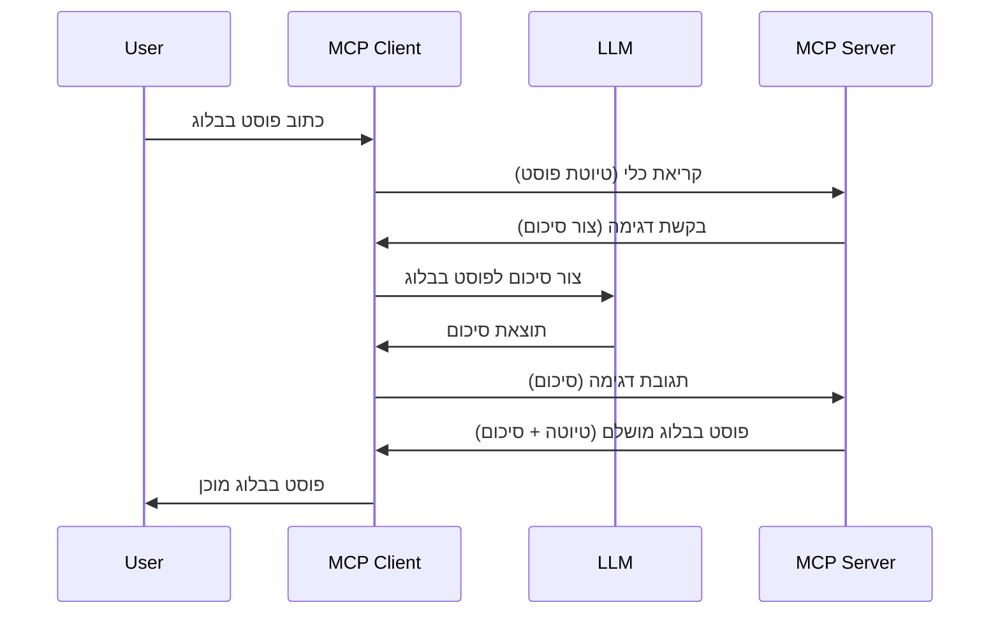

# דגימה - הסמכת תכונות ללקוח

> **הודעת פסילה:** מועמד שחרור מפרט MCP מ-`2026-07-28` מסמן את הדגימה כמפוטרת לטובת אינטגרציה ישירה עם APIs של ספקי LLM. דגימה ממשיכה לעבוד ב-`2025-11-25` ובמשך לפחות שנה אחרי כל פסילה פורמלית, כך שהכל בשיעור זה נשאר בתוקף — אך תכנוני שרת חדשים צריכים להעריך את דפוס ההחלפה. ראה [מה משתנה ב-MCP: מועמד שחרור 2026-07-28](../../01-CoreConcepts/mcp-2026-07-28-release-candidate.md).

לפעמים, יש צורך שהלקוח MCP והשרת MCP ישתפו פעולה כדי להשיג מטרה משותפת. ייתכן שתהיה מקרה שבו השרת זקוק לעזרת LLM שנמצא בצד הלקוח. במצב כזה, הדגימה היא מה שכדאי להשתמש בו.

בואו נחקור כמה מקרי שימוש וכיצד לבנות פתרון הכולל דגימה.

## סקירה כללית

בשיעור זה, נתמקד בהסבר מתי ואיפה להשתמש בדגימה וכיצד להגדיר אותה.

## מטרות למידה

בפרק זה ניגע ב:

- הסבר מהי דגימה ומתי להשתמש בה.
- הצגת אופן הגדרת דגימה ב-MCP.
- מתן דוגמאות של דגימה בפעולה.

## מהי דגימה ולמה להשתמש בה?

דגימה היא תכונה מתקדמת הפועלת בדרך הבאה:



### בקשת דגימה

טוב, עכשיו יש לנו מבט כללי על תרחיש אמין, בוא נדבר על בקשת הדגימה שהשרת שולח ללקוח. כך יכולה להיראות בקשה כזו בפורמט JSON-RPC:

```json
{
  "jsonrpc": "2.0",
  "id": 1,
  "method": "sampling/createMessage",
  "params": {
    "messages": [
      {
        "role": "user",
        "content": {
          "type": "text",
          "text": "Create a blog post summary of the following blog post: <BLOG POST>"
        }
      }
    ],
    "modelPreferences": {
      "hints": [
        {
          "name": "claude-3-sonnet"
        }
      ],
      "intelligencePriority": 0.8,
      "speedPriority": 0.5
    },
    "systemPrompt": "You are a helpful assistant.",
    "maxTokens": 100
  }
}
```

יש כאן כמה נקודות שכדאי לציין:

- Prompt, תחת content -> text, הוא ההנעה שלנו שהיא הוראה ל-LLM לסכם תוכן פוסט בבלוג.

- **modelPreferences**. חלק זה הוא בדיוק כך, העדפה, המלצה על איזה תצורה להשתמש עם ה-LLM. המשתמש יכול לבחור האם ללכת עם ההמלצות הללו או לשנות אותן. במקרה זה יש המלצות על דגם לשימוש ועל סדר עדיפות בין מהירות לאינטליגנציה.
- **systemPrompt**, זה ההנעה הרגילה שלך שמתן ל-LLM שלך אישיות ומכילה הוראות הנחיה.
- **maxTokens**, זהו מאפיין נוסף שמשמש להגיד כמה טוקנים מומלץ להשתמש במשימה זו.

### תגובת דגימה

תגובה זו היא מה שלבסוף לקוח MCP מחזיר לשרת MCP והיא התוצאה של הלקוח שקרא ל-LLM, מחכה לתגובה ואז בונה את ההודעה הזו. כך יכולה להיראות בפורמט JSON-RPC:

```json
{
  "jsonrpc": "2.0",
  "id": 1,
  "result": {
    "role": "assistant",
    "content": {
      "type": "text",
      "text": "Here's your abstract <ABSTRACT>"
    },
    "model": "gpt-5",
    "stopReason": "endTurn"
  }
}
```

שים לב שהתגובה היא תקציר של פוסט הבלוג בדיוק כפי שביקשנו. שים לב גם שהמודל used איננו מה שביקשנו אלא "gpt-5" במקום "claude-3-sonnet". זה ממחיש שהמשתמש יכול לשנות את דעתו לגבי מה לשימוש ובקשת הדגימה שלך היא המלצה.

טוב, עכשיו כשאנחנו מבינים את הזרימה העיקרית, ומשימה שימושית לשימוש בזה "יצירת פוסט בבלוג + תקציר", בוא נראה מה צריך לעשות כדי שזה יעבוד.

### סוגי הודעות

הודעות דגימה אינן מוגבלות רק לטקסט אלא ניתן גם לשלוח תמונות וקול. כך נראה JSON-RPC שונה:

**טקסט**

```json
{
  "type": "text",
  "text": "The message content"
}
```

**תוכן תמונה**

```json
{
  "type": "image",
  "data": "base64-encoded-image-data",
  "mimeType": "image/jpeg"
}
```

**תוכן אודיו**

```json
{
  "type": "audio",
  "data": "base64-encoded-audio-data",
  "mimeType": "audio/wav"
}
```

> הערה: למידע מפורט יותר על דגימה, עיין ב-[המסמכים הרשמיים](https://modelcontextprotocol.io/specification/2025-11-25/client/sampling)

## כיצד להגדיר דגימה בלקוח

> הערה: אם אתה בונה שרת בלבד, אין צורך לעשות הרבה כאן.

בלקוח, עליך לציין את התכונה הבאה כך:

```json
{
  "capabilities": {
    "sampling": {}
  }
}
```

זוהי תופעל עם אתחול הלקוח הנבחר עם השרת.

## דוגמא לדגימה בפעולה - יצירת פוסט בבלוג

בואו נכין שרת דגימה יחד, נצטרך לעשות את הדברים הבאים:

1. ליצור כלי בשרת.
1. הכלי יוצר בקשת דגימה.
1. הכלי מחכה לתשובת בקשת הדגימה של הלקוח.
1. לאחר מכן יש לייצר את תוצאת הכלי.

בוא נראה את הקוד שלב אחר שלב:

### -1- יצירת הכלי

**python**

```python
@mcp.tool()
async def create_blog(title: str, content: str, ctx: Context[ServerSession, None]) -> str:
    """Create a blog post and generate a summary"""

```

### -2- יצירת בקשת דגימה

הרחב את הכלי שלך עם הקוד הבא:

**python**

```python
post = BlogPost(
        id=len(posts) + 1,
        title=title,
        content=content,
        abstract=""
    )

prompt = f"Create an abstract of the following blog post: title: {title} and draft: {content} "

result = await ctx.session.create_message(
        messages=[
            SamplingMessage(
                role="user",
                content=TextContent(type="text", text=prompt),
            )
        ],
        max_tokens=100,
)

```

### -3- המתנה לתגובה והחזרת התגובה

**python**

```python
post.abstract = result.content.text

posts.append(post)

# להחזיר את המוצר המלא
return json.dumps({
    "id": post.title,
    "abstract": post.abstract
})
```

### -4- קוד מלא

**python**

```python
from starlette.applications import Starlette
from starlette.routing import Mount, Host

from mcp.server.fastmcp import Context, FastMCP

from mcp.server.session import ServerSession
from mcp.types import SamplingMessage, TextContent

import json


from uuid import uuid4
from typing import List
from pydantic import BaseModel


mcp = FastMCP("Blog post generator")

# app = FastAPI()

posts = []

class BlogPost(BaseModel):
    id: int
    title: str
    content: str
    abstract: str

posts: List[BlogPost] = []

@mcp.tool()
async def create_blog(title: str, content: str, ctx: Context[ServerSession, None]) -> str:
    """Create a blog post and generate a summary"""

    post = BlogPost(
        id=len(posts) + 1,
        title=title,
        content=content,
        abstract=""
    )

    prompt = f"Create an abstract of the following blog post: title: {title} and draft: {content} "

    result = await ctx.session.create_message(
        messages=[
            SamplingMessage(
                role="user",
                content=TextContent(type="text", text=prompt),
            )
        ],
        max_tokens=100,
    )

    post.abstract = result.content.text

    posts.append(post)

    # החזר את הפוסט המלא בבלוג
    return json.dumps({
        "id": post.title,
        "abstract": post.abstract
    })

if __name__ == "__main__":
    print("Starting server...")
    # mcp.run()
    mcp.run(transport="streamable-http")

# הרץ את האפליקציה עם: python server.py
```

### -5- בדיקה ב-Visual Studio Code

כדי לבדוק זאת ב-Visual Studio Code, בצע את הפעולות הבאות:

1. הפעל את השרת בטרמינל.
1. הוסף אותו ל-*mcp.json* (ודא שהוא פעיל) לדוגמה כך:

   ```json
   "servers": {
      "blog-server": {
        "type": "http",
        "url": "http://localhost:8000/mcp"
      }
   }
   ```

1. הקלד הנעה:

   ```text
   create a blog post named "Where Python comes from", the content is "Python is actually named after Monty Python Flying Circus"
   ```

1. אפשר לדגימה להתרחש. בפעם הראשונה שתבדוק זאת יוצג דיאלוג נוסף שתצטרך לאשר, אז תראה את הדיאלוג הרגיל שמבקש ממך להריץ כלי.

1. בדוק תוצאות. תראה את התוצאות מוצגות יפה ב-GitHub Copilot Chat אך תוכל גם לבדוק את תגובת ה-JSON הגולמית.

**בונוס**. כלי Visual Studio Code תומכים היטב בדגימה. תוכל להגדיר גישת דגימה על השרת שהתקנת כך:

1. עבור ללשונית ההרחבות.
1. בחר באייקון גלגל השיניים של השרת שהתקנת בקטגוריית "MCP SERVERS - INSTALLED".
1. בחר ב-"Configure Model Access", כאן תוכל לבחור אילו דגמים GitHub Copilot מורשה להשתמש בהם בעת ביצוע דגימה. תוכל גם לראות את כל בקשות הדגימה שהתרחשו לאחרונה על ידי בחירה ב-"Show Sampling requests".

## מטלה

במטלה זו, תבנה דגימה מעט שונה, כלומר אינטגרציית דגימה התומכת ביצירת תיאור מוצר. הנה התרחיש שלך:

**תרחיש**: עובד במשרד האחורי של סחר אלקטרוני זקוק לעזרה, זה לוקח יותר מדי זמן ליצור תיאורי מוצרים. לכן, תבנה פתרון שבו תוכל לקרוא לכלי "create_product" עם "title" ו-"keywords" כארגומנטים, והוא יפיק מוצר שלם כולל שדה "description" שישמש ל-LLM של הלקוח למלא אותו.

טיפ: השתמש במה שלמדת קודם לבניית השרת והכלי הזה באמצעות בקשת דגימה.

## פתרון

[פתרון](./solution/README.md)

## נקודות מפתח

דגימה היא תכונה עוצמתית המאפשרת לשרת להסמיך משימות ללקוח כאשר הוא זקוק לעזרת LLM.

## מה הלאה

- [פרק 4 - יישום מעשי](../../04-PracticalImplementation/README.md)

---

<!-- CO-OP TRANSLATOR DISCLAIMER START -->
**כתב ויתור**:
מסמך זה תורגם באמצעות שירות תרגום אוטומטי [Co-op Translator](https://github.com/Azure/co-op-translator). למרות שאנו שואפים לדיוק, יש לקחת בחשבון שתרגומים אוטומטיים עלולים להכיל שגיאות או אי-דיוקים. יש להחשיב את המסמך המקורי בשפתו הטבעית כמקור הסמכות. למידע קריטי מומלץ להשתמש בתרגום מקצועי על ידי מתרגם אדם. אנו לא אחראים לכל אי-הבנה או פירוש שגוי הנובע מהשימוש בתרגום זה.
<!-- CO-OP TRANSLATOR DISCLAIMER END -->