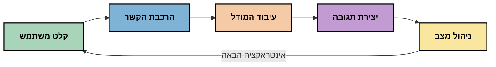
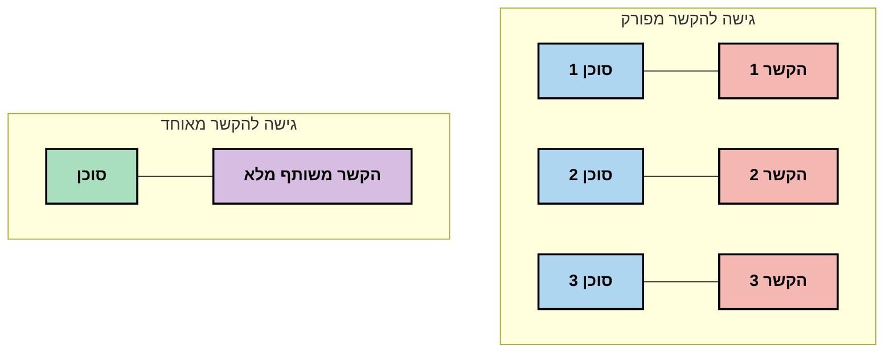
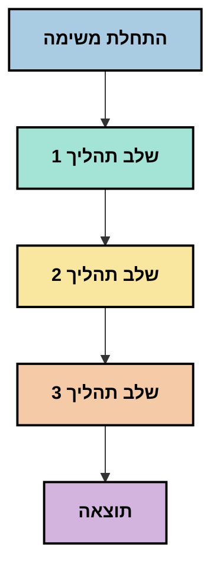
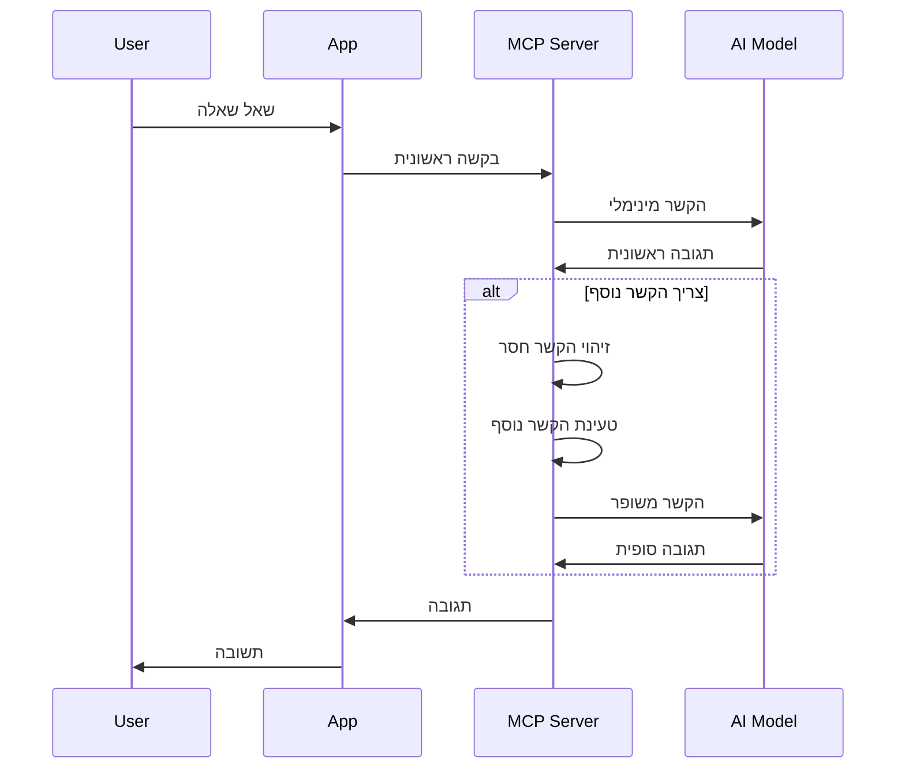
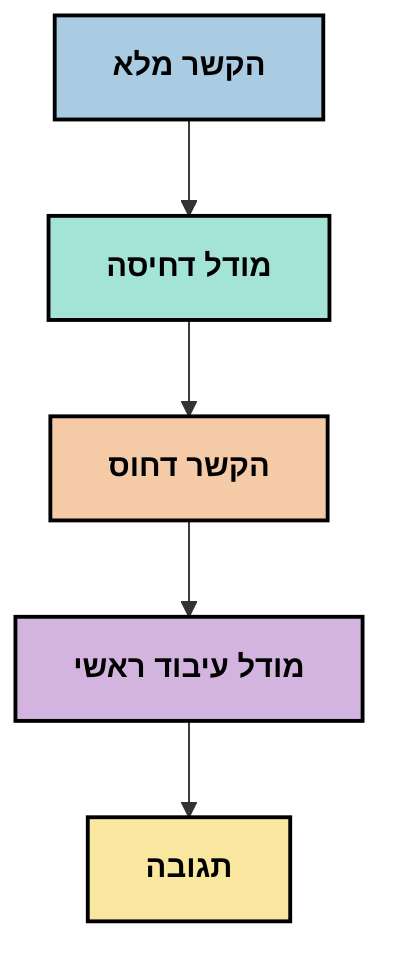
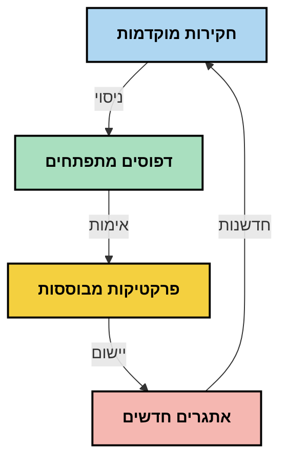

# הנדסת הקשר: מושג מתפתח במערכת האקולוגית של MCP

## סקירה כללית

הנדסת הקשר היא מושג מתפתח בתחום ה-AI החוקר כיצד מידע מובנה, מועבר ומנוהל לאורך אינטראקציות בין לקוחות לשירותי AI. ככל שמערכת האקולוגית של פרוטוקול הקשר למודל (MCP) מתפתחת, ההבנה כיצד לנהל הקשר בצורה יעילה נעשית חשובה יותר ויותר. מודול זה מציג את מושג הנדסת הקשר וחוקר את יישומיו האפשריים במימושי MCP.

## מטרות הלמידה

בסיום מודול זה, תוכל:

- להבין את המושג המתהווה של הנדסת הקשר ואת תפקידו הפוטנציאלי ביישומי MCP
- לזהות את האתגרים המרכזיים בניהול הקשר שפרוטוקול MCP מתמודד איתם
- לחקור טכניקות לשיפור ביצועי המודל באמצעות טיפול טוב יותר בהקשר
- לשקול גישות למדידה והערכה של יעילות הקשר
- ליישם את המושגים המתהווים הללו לשיפור חוויות AI במסגרת MCP

## מבוא להנדסת הקשר

הנדסת הקשר היא מושג מתהווה המתמקד בתכנון ובניהול מכוון של זרימת המידע בין משתמשים, יישומים ודגמי AI. בניגוד לתחומים מבוססים כמו הנדסת הפרומפט, הנדסת הקשר עדיין מוגדרת על ידי המתרגלים עצמם כאשר הם פועלים לפתור את האתגרים הייחודיים של מתן המידע הנכון לדגמי AI בזמן הנכון.

עם ההתפתחות של דגמים לשוניים גדולים (LLMs), חשיבות הקשר הפכה לברורה יותר ויותר. איכות, רלוונטיות ומבנה ההקשר שאנו מספקים משפיעים ישירות על תפוקת המודל. הנדסת הקשר חוקרת קשר זה ושואפת לפתח עקרונות לניהול הקשר יעיל.

> "בשנת 2025, המודלים שם חכמים באופן קיצוני. אבל אפילו האדם החכם ביותר לא יוכל לבצע את עבודתו ביעילות בלי ההקשר של מה שמתבקש ממנו... 'הנדסת הקשר' היא הרמה הבאה של הנדסת הפרומפט. מדובר באוטומציה במערכת דינמית." — וולדן יאן, Cognition AI

הנדסת הקשר עלולה לכלול:

1. **בחירת הקשר**: קביעת אילו מידע רלוונטי למשימה נתונה
2. **מבנה ההקשר**: ארגון המידע למקסום הבנת המודל
3. **העברת ההקשר**: אופטימיזציה של האופן והמועד בו המידע נשלח למודלים
4. **תחזוקת ההקשר**: ניהול המצב והתפתחות ההקשר לאורך זמן
5. **הערכת ההקשר**: מדידה ושיפור יעילות ההקשר

תחומים אלו רלוונטיים במיוחד למערכת האקולוגית של MCP, המספקת דרך מאופיינת ליישומים לספק הקשר ל-LLMs.


## נקודת מבט על מסע ההקשר

דרך אחת להמחיש הנדסת הקשר היא לעקוב אחר מסע המידע במערכת MCP:



### שלבים מרכזיים במסע ההקשר:

1. **קלט משתמש**: מידע גולמי מהמשתמש (טקסט, תמונות, מסמכים)
2. **הרכבת הקשר**: שילוב קלט המשתמש עם הקשר המערכת, היסטוריית השיחה ומידע משוחזר אחר
3. **עיבוד המודל**: המודל מעבד את ההקשר המורכב
4. **יצירת תגובה**: המודל מייצר פלט בהתבסס על ההקשר המסופק
5. **ניהול מצב**: המערכת מעדכנת את מצבה הפנימי בהתבסס על האינטראקציה

פרספקטיבה זו מדגישה את הטבע הדינמי של הקשר במערכות AI ומעלה שאלות חשובות כיצד לנהל את המידע בצורה מיטבית בכל שלב.

## עקרונות מתהווים בהנדסת הקשר

בתחום הנדסת הקשר העולה, מתחילים להופיע עקרונות מוקדמים מצד המתרגלים. עקרונות אלו עשויים לסייע בהנחיית בחירות מימוש MCP:

### עיקרון 1: שיתוף הקשר בשלמותו

הקשר צריך להיות משותף בשלמותו בין כל רכיבי המערכת במקום להיות מפוזר בין סוכנים או תהליכים שונים. כאשר ההקשר מפוצל, החלטות שהתקבלו בחלק אחד במערכת עלולות להתנגש עם אלה שמתקבלות במקומות אחרים.



ביישומי MCP, זה מרמז על תכנון מערכות שבהן ההקשר זורם בצורה חלקה לאורך כל הצינור במקום להיות מקוטע.

### עיקרון 2: הכרה בכך שפעולות נושאות החלטות מרומזות

כל פעולה שהמודל מבצע מגלמת החלטות מרומזות לגבי אופן הפרשנות של ההקשר. כאשר רכיבים מרובים פועלים על הקשרים שונים, החלטות מרומזות אלו עלולות להתנגש ולהוביל לתוצאות לא עקביות.

לעיקרון זה השלכות חשובות על יישומי MCP:
- העדפת עיבוד לינארי של משימות מורכבות על פני ביצוע מקבילי עם הקשר מפוצל
- הבטחת שכל נקודות ההחלטה יקבלו גישה לאותם המידע ההקשרי
- תכנון מערכות שבהן שלבים מאוחרים יכולים לראות את כל ההקשר של החלטות קודמות

### עיקרון 3: איזון עומק ההקשר עם מגבלות החלון

עם התארכות שיחות ותהליכים, חלונות ההקשר מתמלאים בסופו של דבר. הנדסת הקשר היעילה חוקרת גישות לניהול מתח זה בין הקשר מקיף למגבלות טכניות.

גישות פוטנציאליות שנבדקות כוללות:
- דחיסת הקשר שמתוחזקת מידע חיוני תוך הפחתת שימוש בטוקנים
- טעינה הדרגתית של ההקשר בהתבסס על רלוונטיות לצרכים הנוכחיים
- סיכום אינטראקציות קודמות תוך שימור החלטות ועובדות מרכזיות

## אתגרי הקשר ועיצוב פרוטוקול MCP

פרוטוקול הקשר למודל (MCP) עוצב עם מודעות לאתגרים הייחודיים בניהול הקשר. הבנת האתגרים הללו מסבירה היבטים מרכזיים בעיצוב הפרוטוקול:


### אתגר 1: מגבלות חלון הקשר
רוב מודלי ה-AI מוגבלים בגודל חלון הקשר, מגבלת כמות המידע שיכולים לעבד בפעם אחת.

**תגובה של עיצוב MCP:**
- הפרוטוקול תומך בהקשר מובנה מבוסס משאבים שניתן להפנות אליהם ביעילות
- משאבים יכולים להיות מחולקים לעמודים ונטענים בהדרגה

### אתגר 2: קביעת רלוונטיות
קשה לקבוע איזה מידע הכי רלוונטי לכלול בהקשר.

**תגובה של עיצוב MCP:**
- כלים גמישים מאפשרים שליפה דינמית של מידע לפי צורך
- פרומפטים מובנים מאפשרים ארגון הקשר עקבי

### אתגר 3: עמידות הקשר
ניהול מצב לאורך אינטראקציות דורש מעקב מדויק אחרי ההקשר.

**תגובה של עיצוב MCP:**
- ניהול מושבים סטנדרטי
- דפוסי אינטראקציה מוגדרים בבירור להתפתחות ההקשר

### אתגר 4: הקשר מולטי-מודאלי
סוגי נתונים שונים (טקסט, תמונות, נתונים מובנים) מצריכים טיפול שונה.

**תגובה של עיצוב MCP:**
- עיצוב הפרוטוקול מתחשב בסוגי תוכן שונים
- ייצוג סטנדרטי של מידע מולטי-מודאלי

### אתגר 5: אבטחה ופרטיות
הקשר מכיל לעיתים מידע רגיש שיש להגן עליו.

**תגובה של עיצוב MCP:**
- הגדרות ברורות בין אחריות הלקוח לשרת
- אפשרויות עיבוד מקומי לצמצום חשיפת נתונים

הבנת האתגרים הללו ואופן ההתמודדות של MCP איתם מהווה בסיס לחקר טכניקות מתקדמות בהנדסת הקשר.

## גישות מתהוות בהנדסת הקשר

במהלך התפתחות תחום הנדסת הקשר, מספר גישות מבטיחות מתחילות להתגלות. אלו מייצגות חשיבה עכשווית יותר מאשר שיטות מוכחות, וכנראה יתפתחו במהלך קבלת ניסיון רחבה יותר עם מימושי MCP.

### 1. עיבוד לינארי חד-סלילי

בניגוד לארכיטקטורות רב-סוכניות שמפזרות הקשר, חלק מהמתרגלים מוצאים שעיבוד לינארי חד-סלילי מביא לתוצאות עקביות יותר. זה מתיישב עם העיקרון של שמירה על הקשר מאוחד.



למרות שגישה זו עשויה להיראות פחות יעילה מעיבוד מקבילי, לעיתים היא מביאה לתוצאות קוהרנטיות ואמינות יותר כי כל שלב נבנה על הבנה מלאה של החלטות קודמות.

### 2. פיצול הקשר והעדפת חלקים

חלוקת הקשרים גדולים לחלקים ניתנים לניהול והעדפת החלקים החשובים ביותר.

```python
# דוגמה רעיונית: חלוקת ותיוג ראיות להקשר
def process_with_chunked_context(documents, query):
    # 1. לפרק מסמכים ליחידות קטנות יותר
    chunks = chunk_documents(documents)
    
    # 2. לחשב ציוני רלוונטיות עבור כל יחידה
    scored_chunks = [(chunk, calculate_relevance(chunk, query)) for chunk in chunks]
    
    # 3. למיין את היחידות לפי ציון הרלוונטיות
    sorted_chunks = sorted(scored_chunks, key=lambda x: x[1], reverse=True)
    
    # 4. להשתמש ביחידות הרלוונטיות ביותר כהקשר
    context = create_context_from_chunks([chunk for chunk, score in sorted_chunks[:5]])
    
    # 5. לעבד עם ההקשר המועדף
    return generate_response(context, query)
```

הרעיון לעיל ממחיש כיצד ניתן לפצל מסמכים גדולים לחלקים זעירים ולבחור רק את החלקים הרלוונטיים ביותר להקשר. גישה זו עוזרת להתמודד עם מגבלות חלון ההקשר וגם לנצל מאגרי ידע נרחבים.

### 3. טעינה הדרגתית של ההקשר

טעינת ההקשר בהדרגה לפי הצורך במקום בבת אחת.



טעינה הדרגתית מתחילה בהקשר מינימלי ומתרחבת רק כשנדרש. זה מפחית משמעותית שימוש בטוקנים עבור שאילתות פשוטות תוך שמירה על היכולת להתמודד עם שאלות מורכבות.

### 4. דחיסת הקשר וסיכום

הפחתת גודל ההקשר תוך שימור מידע חיוני.



דחיסת הקשר מתמקדת ב:
- הסרת מידע מיותר
- סיכום תוכן ארוך
- חילוץ עובדות ופרטים מרכזיים
- שימור אלמנטים קריטיים של ההקשר
- אופטימיזציה לשימוש יעיל בטוקנים

גישה זו עשויה להיות בעלת ערך רב לשמירה על שיחות ארוכות במסגרת חלונות ההקשר או לעיבוד מסמכים גדולים ביעילות. יש המתבססים על מודלים ייעודיים לדחיסה וסיכום היסטוריית שיחה.


## שיקולים חקרניים בהנדסת הקשר

בעת חקר תחום הנדסת הקשר המתפתח, כמה שיקולים ראויים לזכור בעת עבודה עם מימושי MCP. אלו אינם שיטות מוכתבות אלא תחומי חקירה שעשויים להביא לשיפורים בשימוש הספציפי שלך.

### שקול את מטרות ההקשר שלך

לפני יישום פתרונות ניהול הקשר מורכבים, הבהר מה אתה מנסה להשיג:
- איזה מידע ספציפי המודל צריך כדי להצליח?
- איזה מידע חיוני ואיזה משלים?
- מה מגבלות הביצועים שלך (שהייה, מגבלות טוקנים, עלויות)?

### חקור גישות הקשר רב–שכבתיות

חלק מהמתרגלים מצליחים עם הקשר המוסדר בשכבות רעיוניות:
- **שכבת יסוד**: מידע חיוני שהמודל תמיד צריך
- **שכבת מקרה**: הקשר ייחודי לאינטראקציה הנוכחית
- **שכבת תמיכה**: מידע נוסף שעשוי לסייע
- **שכבת גיבוי**: מידע נגיש רק בעת צורך

### בדוק אסטרטגיות שליפה

יעילות ההקשר שלך תלויה לעיתים קרובות באיך אתה מושך מידע:
- חיפוש סמנטי והטמעה למציאת מידע רלוונטי רעיונית
- חיפוש מבוסס מילות מפתח לפרטים עובדתיים מסוימים
- גישות היברידיות שמשלבות שיטות שליפה מרובות
- סינון מטאדטה לצמצום היקף לפי קטגוריות, תאריכים או מקורות

### נסה את הלכידות של ההקשר

מבנה וזרימת ההקשר עלולים להשפיע על הבנת המודל:
- לקבץ מידע קשור יחד
- להשתמש בעיצוב וארגון עקביים
- לשמור על סדר לוגי או כרונולוגי במידה והגיוני
- להמנע ממידע סותר

### שקול את הפשרות של ארכיטקטורות רב-סוכניות

בעוד שארכיטקטורות רב-סוכניות פופולריות במסגרות AI רבות, הן מביאות איתן אתגרים משמעותיים לניהול הקשר:
- פיצול הקשר עלול להוביל להחלטות בלתי עקביות בין סוכנים
- עיבוד מקבילי עלול לגרום להתנגשויות שקשה ליישב
- עומסי תקשורת בין סוכנים עשויים לבטל את יתרונות הביצועים
- נדרש ניהול מצב מורכב לשמירת לכידות

במקרים רבים, גישה חד-סוכנית עם ניהול קשר מקיף עשויה להביא לתוצאות אמינות יותר מאשר סוכנים רבים עם הקשר מפוצל.

### פתח שיטות הערכה

לשיפור הנדסת הקשר לאורך זמן, שקול כיצד תמדוד הצלחה:
- בדיקות A/B של מבני הקשר השונים
- ניטור שימוש בטוקנים וזמני תגובה
- מעקב אחר שביעות רצון המשתמשים ושיעורי סיום משימות
- ניתוח מקרים שבהם אסטרטגיות הקשר נכשלות

שיקולים אלו מייצגים תחומי חקירה פעילים בתחום הנדסת הקשר. ככל שהתחום יתפתח, צפויות להופיע תבניות ושיטות ברורות יותר.

## מדידת יעילות ההקשר: מסגרת מתפתחת

כשהנדסת הקשר מתפתחת כמושג, מתרגלים מתחילים לחקור כיצד למדוד את יעילותה. לא קיימת מסגרת מוסכמת עדיין, אך נבחנות מדדים שונים שעשויים לסייע לכוון עבודה עתידית.

### ממדי מדידה פוטנציאליים


#### 1. שיקולי יעילות קלט

- **יחס הקשר לתגובה**: כמה הקשר נדרש ביחס לגודל התגובה?
- **שימוש בטוקנים**: איזה אחוז מהטוקנים של ההקשר משפיע לכאורה על התגובה?
- **הפחתת קשר**: עד כמה ניתן לדחוס את המידע הגולמי ביעילות?

#### 2. שיקולי ביצועים

- **השפעת השהייה**: כיצד ניהול ההקשר משפיע על זמן התגובה?
- **כלכלת טוקנים**: האם אנו מייעלים את השימוש בטוקנים?
- **דיוק השליפה**: כמה המידע שנשלף רלוונטי?
- **שימוש במשאבים**: אילו משאבים מחשוביים נדרשים?

#### 3. שיקולי איכות

- **רלוונטיות תגובה**: עד כמה התגובה מתייחסת לשאלה?
- **דיוק עובדתי**: האם ניהול ההקשר משפר את נכונות העובדות?
- **עקביות**: האם התגובות עקביות בין שאילתות דומות?
- **שיעור הזיות**: האם הקשר טוב יותר מפחית הזיות של המודל?

#### 4. שיקולי חווית משתמש

- **שיעור המשך**: כמה פעמים המשתמשים זקוקים להבהרה נוספת?
- **סיום משימה**: האם המשתמשים משיגים את מטרותיהם?
- **מדדי שביעות רצון**: כיצד המשתמשים מדרגים את החוויה שלהם?

### גישות חקרניות למדידה

בעת ניסוי בהנדסת הקשר במימושי MCP, שקול את הגישות החקרניות הבאות:

1. **השוואות בסיס**: יצירת נקודת ייחוס עם גישות הקשר פשוטות לפני בדיקת שיטות מורכבות יותר

2. **שינויים הדרגתיים**: שינוי היבט אחד בזמנית לנטרל השפעות

3. **הערכת משתמש**: שילוב מדדים כמותיים עם משוב איכותי מהמשתמשים

4. **ניתוח כישלונות**: בחינת מקרים בהם אסטרטגיות הקשר נכשלות להבנת שיפורים פוטנציאליים

5. **הערכה רב-ממדית**: שקילת פשרות בין יעילות, איכות וחווית משתמש

גישה ניסיונית ורב-ממדית למדידה מתיישבת עם אופיין המתהווה של הנדסת הקשר.

## מילים אחרונות

הנדסת הקשר היא תחום חקר מתפתח שעשוי להיות מרכזי ביישומי MCP יעילים. על ידי מחשבה מושכלת על זרימת המידע במערכת שלך, ניתן ליצור חוויות AI יעילות, מדויקות ובעלות ערך רב יותר למשתמשים.

הטכניקות והגישות המוצגות במודול זה מייצגות חשיבה מוקדמת בתחום זה, לא שיטות מוסכמות. הנדסת הקשר עשויה להתפתח לתחום מוגדר יותר ככל שהיכולות שלנו עם AI מתרחבות וההבנה מעמיקה. בינתיים, ניסוי בשילוב מדידה זהירה נראה הגישה הפורייה ביותר.

## כיווני עתיד פוטנציאליים

תחום הנדסת הקשר נמצא עדיין בתחילתו, אך מספר כיוונים מבטיחים מתגלים:

- עקרונות הנדסת הקשר עשויים להשפיע משמעותית על ביצועי מודלים, יעילות, חווית משתמש ואמינות
- גישות חד-סליליות עם ניהול קשר כוללני עשויות להוביל ביצועים טובים יותר מארכיטקטורות רב-סוכניות עבור מקרי שימוש רבים
- מודלי דחיסת הקשר ייעודיים עשויים להפוך לרכיבים סטנדרטיים בצינורות AI
- המתח בין שלמות הקשר למגבלות הטוקנים צפוי להניע חדשנות בטיפול בהקשר
- עם התקדמות המודלים בתקשורת יעילה בדומה לבני אדם, שיתוף פעולה אמיתי בין סוכנים עשוי להפוך לברת קיימא יותר
- מימושי MCP עשויים להתפתח לסטנדרטיזציה של דפוסי ניהול קשר שיוצאים מהניסויים הנוכחיים



## משאבים

### משאבי MCP רשמיים
- [אתר פרוטוקול הקשר למודל](https://modelcontextprotocol.io/)
- [מפרט פרוטוקול הקשר למודל](https://github.com/modelcontextprotocol/modelcontextprotocol)
- [תיעוד MCP](https://modelcontextprotocol.io/docs)
- [ממשק הפיתוח MCP C#](https://github.com/modelcontextprotocol/csharp-sdk)
- [ממשק הפיתוח MCP Python](https://github.com/modelcontextprotocol/python-sdk)
- [ממשק הפיתוח MCP TypeScript](https://github.com/modelcontextprotocol/typescript-sdk)
- [מפקח MCP](https://github.com/modelcontextprotocol/inspector) - כלי בדיקה ויזואלית לשרתי MCP

### מאמרים בהנדסת הקשר
- [אל תבנו סוכנים מרובי-משימות: עקרונות הנדסת הקשר](https://cognition.ai/blog/dont-build-multi-agents) - תובנות של ולדן יאן על עקרונות הנדסת הקשר
- [מדריך מעשי לבניית סוכנים](https://cdn.openai.com/business-guides-and-resources/a-practical-guide-to-building-agents.pdf) - מדריך OpenAI לעיצוב סוכנים יעילים
- [בניית סוכנים יעילים](https://www.anthropic.com/engineering/building-effective-agents) - גישת Anthropic לפיתוח סוכנים

### מחקר קשור
- [הגברה דינמית של שחזור למודלים גדולים של שפה](https://arxiv.org/abs/2310.01487) - מחקר על גישות דינמיות לשחזור
- [אבודים באמצע: כיצד מודלים לשוניים משתמשים בהקשרים ארוכים](https://arxiv.org/abs/2307.03172) - מחקר חשוב על דפוסי עיבוד הקשר
- [יצירת תמונות היררכית מותנית טקסט עם CLIP Latents](https://arxiv.org/abs/2204.06125) - מאמר DALL-E 2 עם תובנות על מבנה הקשר
- [חקר תפקיד ההקשר בארכיטקטורות מודלים לשוניים גדולים](https://aclanthology.org/2023.findings-emnlp.124/) - מחקר עדכני על טיפול בהקשר
- [שיתוף פעולה בין סוכנים מרובי: סקר](https://arxiv.org/abs/2304.03442) - מחקר על מערכות סוכנים מרובים והאתגרים שלהן

### משאבים נוספים
- [טכניקות אופטימיזציה לחלון הקשר](https://learn.microsoft.com/en-us/azure/ai-services/openai/concepts/context-window)
- [טכניקות RAG מתקדמות](https://www.microsoft.com/en-us/research/blog/retrieval-augmented-generation-rag-and-frontier-models/)
- [תיעוד Semantic Kernel](https://github.com/microsoft/semantic-kernel)
- [ערכת כלים בינה מלאכותית לניהול הקשר](https://github.com/microsoft/aitoolkit)

## מה הלאה

- [5.15 העברה מותאמת MCP](../mcp-transport/README.md)

---

<!-- CO-OP TRANSLATOR DISCLAIMER START -->
**כתב ויתור**:
מסמך זה תורגם באמצעות שירות תרגום אוטומטי [Co-op Translator](https://github.com/Azure/co-op-translator). למרות שאנו שואפים לדיוק, יש לקחת בחשבון שתרגומים אוטומטיים עלולים להכיל שגיאות או אי-דיוקים. יש להחשיב את המסמך המקורי בשפתו הטבעית כמקור הסמכות. למידע קריטי מומלץ להשתמש בתרגום מקצועי על ידי מתרגם אדם. אנו לא אחראים לכל אי-הבנה או פירוש שגוי הנובע מהשימוש בתרגום זה.
<!-- CO-OP TRANSLATOR DISCLAIMER END -->