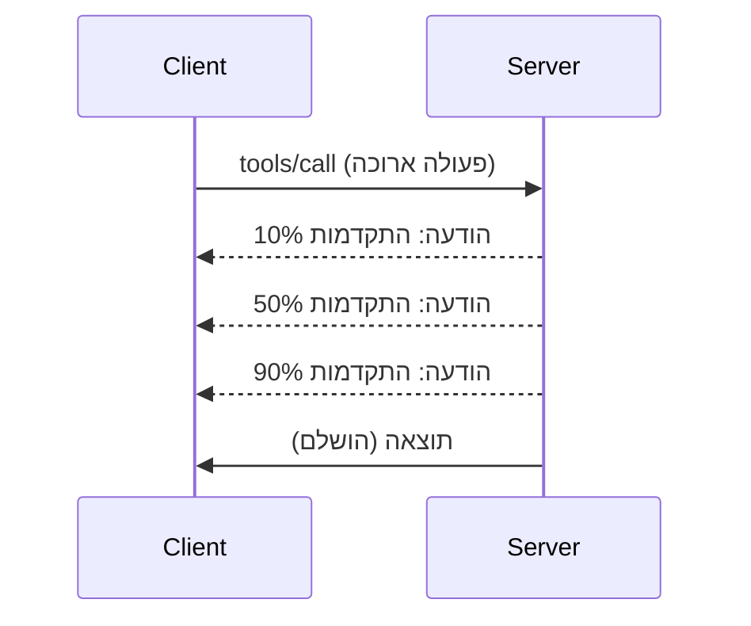

# חקירת תכונות פרוטוקול MCP לעומק

המדריך הזה בוחן תכונות מתקדמות של פרוטוקול MCP שמעבר לטיפול בסיסי בכלים ובמשאבים. הבנת תכונות אלו עוזרת לכם לבנות שרתי MCP חזקים, ידידותיים למשתמש ומוכנים לייצור.

> **מבט קדימה:** הגרסה המועמדת ל־`2026-07-28` מפסיקה להשתמש במבנה ההצפנה Logging (בעדיפות ל־`stderr` עבור stdio ו־OpenTelemetry לניטור מובנה), מסירה את מודל ה־`initialize`/session שמוזכר באירועי מחזור חיי השרת למטה, ומעבירה את תכונת המשימות הניסיונית להרחבת משימות ייעודית עם מחזור חיים חדש `tasks/get`/`tasks/update`/`tasks/cancel`. ראו [מה משתנה ב־MCP: גרסת מועמד 2026-07-28](../../01-CoreConcepts/mcp-2026-07-28-release-candidate.md).

## תכונות מכוסות

1. **התראות התקדמות** - דיווח על התקדמות עבור פעולות ארוכות טווח  
2. **ביטול בקשות** - לאפשר ללקוחות לבטל בקשות בתהליך  
3. **תבניות משאב** - יצירת URI דינמי עם פרמטרים  
4. **אירועי מחזור חיים של שרת** - איתחול וסגירה נכונים  
5. **בקרת רישום** - תצורת רישום בצד השרת  
6. **תבניות טיפול בשגיאות** - תגובות שגיאה עקביות  

---

## 1. התראות התקדמות

עבור פעולות שלוקחות זמן (עיבוד נתונים, הורדת קבצים, קריאות API), התראות התקדמות שומרות על משתמשים מעודכנים.

### איך זה עובד


  
### יישום בפייתון

```python
from mcp.server import Server, NotificationOptions
from mcp.types import ProgressNotification
import asyncio

app = Server("progress-server")

@app.tool()
async def process_large_file(file_path: str, ctx) -> str:
    """Process a large file with progress updates."""
    
    # קבל גודל קובץ לחישוב ההתקדמות
    file_size = os.path.getsize(file_path)
    processed = 0
    
    with open(file_path, 'rb') as f:
        while chunk := f.read(8192):
            # עיבוד קטע
            await process_chunk(chunk)
            processed += len(chunk)
            
            # שלח הודעת התקדמות
            progress = (processed / file_size) * 100
            await ctx.send_notification(
                ProgressNotification(
                    progressToken=ctx.request_id,
                    progress=progress,
                    total=100,
                    message=f"Processing: {progress:.1f}%"
                )
            )
    
    return f"Processed {file_size} bytes"

@app.tool()
async def batch_operation(items: list[str], ctx) -> str:
    """Process multiple items with progress."""
    
    results = []
    total = len(items)
    
    for i, item in enumerate(items):
        result = await process_item(item)
        results.append(result)
        
        # דווח על ההתקדמות לאחר כל פריט
        await ctx.send_notification(
            ProgressNotification(
                progressToken=ctx.request_id,
                progress=i + 1,
                total=total,
                message=f"Processed {i + 1}/{total}: {item}"
            )
        )
    
    return f"Completed {total} items"
```
  
### יישום בטייפסקריפט

```typescript
import { Server } from "@modelcontextprotocol/sdk/server/index.js";

server.setRequestHandler(CallToolSchema, async (request, extra) => {
  const { name, arguments: args } = request.params;
  
  if (name === "process_data") {
    const items = args.items as string[];
    const results = [];
    
    for (let i = 0; i < items.length; i++) {
      const result = await processItem(items[i]);
      results.push(result);
      
      // שלח התראה על ההתקדמות
      await extra.sendNotification({
        method: "notifications/progress",
        params: {
          progressToken: request.id,
          progress: i + 1,
          total: items.length,
          message: `Processing item ${i + 1}/${items.length}`
        }
      });
    }
    
    return { content: [{ type: "text", text: JSON.stringify(results) }] };
  }
});
```
  
### טיפול בצד הלקוח (פייתון)

```python
async def handle_progress(notification):
    """Handle progress notifications from server."""
    params = notification.params
    print(f"Progress: {params.progress}/{params.total} - {params.message}")

# רשום מטפל
session.on_notification("notifications/progress", handle_progress)

# קריאת כלי (עדכוני התקדמות יגיעו דרך המטפל)
result = await session.call_tool("process_large_file", {"file_path": "/data/large.csv"})
```
  
---

## 2. ביטול בקשות

מאפשר ללקוחות לבטל בקשות שלא דרושות עוד או שלוקחות יותר מדי זמן.

### יישום בפייתון

```python
from mcp.server import Server
from mcp.types import CancelledError
import asyncio

app = Server("cancellable-server")

@app.tool()
async def long_running_search(query: str, ctx) -> str:
    """Search that can be cancelled."""
    
    results = []
    
    try:
        for page in range(100):  # חפש דרך עמודים רבים
            # בדוק אם התקבלה בקשת ביטול
            if ctx.is_cancelled:
                raise CancelledError("Search cancelled by user")
            
            # סמלץ חיפוש בעמוד
            page_results = await search_page(query, page)
            results.extend(page_results)
            
            # השהיה קצרה מאפשרת בדיקות ביטול
            await asyncio.sleep(0.1)
            
    except CancelledError:
        # החזר תוצאות חלקיות
        return f"Cancelled. Found {len(results)} results before cancellation."
    
    return f"Found {len(results)} total results"

@app.tool()
async def download_file(url: str, ctx) -> str:
    """Download with cancellation support."""
    
    async with aiohttp.ClientSession() as session:
        async with session.get(url) as response:
            total_size = int(response.headers.get('content-length', 0))
            downloaded = 0
            chunks = []
            
            async for chunk in response.content.iter_chunked(8192):
                if ctx.is_cancelled:
                    return f"Download cancelled at {downloaded}/{total_size} bytes"
                
                chunks.append(chunk)
                downloaded += len(chunk)
            
            return f"Downloaded {downloaded} bytes"
```
  
### יישום הקשר ביטול

```python
class CancellableContext:
    """Context object that tracks cancellation state."""
    
    def __init__(self, request_id: str):
        self.request_id = request_id
        self._cancelled = asyncio.Event()
        self._cancel_reason = None
    
    @property
    def is_cancelled(self) -> bool:
        return self._cancelled.is_set()
    
    def cancel(self, reason: str = "Cancelled"):
        self._cancel_reason = reason
        self._cancelled.set()
    
    async def check_cancelled(self):
        """Raise if cancelled, otherwise continue."""
        if self.is_cancelled:
            raise CancelledError(self._cancel_reason)
    
    async def sleep_or_cancel(self, seconds: float):
        """Sleep that can be interrupted by cancellation."""
        try:
            await asyncio.wait_for(
                self._cancelled.wait(),
                timeout=seconds
            )
            raise CancelledError(self._cancel_reason)
        except asyncio.TimeoutError:
            pass  # פסק זמן רגיל, המשך
```
  
### ביטול בצד הלקוח

```python
import asyncio

async def search_with_timeout(session, query, timeout=30):
    """Search with automatic cancellation on timeout."""
    
    task = asyncio.create_task(
        session.call_tool("long_running_search", {"query": query})
    )
    
    try:
        result = await asyncio.wait_for(task, timeout=timeout)
        return result
    except asyncio.TimeoutError:
        # בקשת ביטול
        await session.send_notification({
            "method": "notifications/cancelled",
            "params": {"requestId": task.request_id, "reason": "Timeout"}
        })
        return "Search timed out"
```
  
---

## 3. תבניות משאב

תבניות משאב מאפשרות בניית URI דינמי עם פרמטרים, שימושי ל־APIs ולמסדי נתונים.

### הגדרת תבניות

```python
from mcp.server import Server
from mcp.types import ResourceTemplate

app = Server("template-server")

@app.list_resource_templates()
async def list_templates() -> list[ResourceTemplate]:
    """Return available resource templates."""
    return [
        ResourceTemplate(
            uriTemplate="db://users/{user_id}",
            name="User Profile",
            description="Fetch user profile by ID",
            mimeType="application/json"
        ),
        ResourceTemplate(
            uriTemplate="api://weather/{city}/{date}",
            name="Weather Data",
            description="Historical weather for city and date",
            mimeType="application/json"
        ),
        ResourceTemplate(
            uriTemplate="file://{path}",
            name="File Content",
            description="Read file at given path",
            mimeType="text/plain"
        )
    ]

@app.read_resource()
async def read_resource(uri: str) -> str:
    """Read resource, expanding template parameters."""
    
    # נתח את ה-URI כדי להפיק פרמטרים
    if uri.startswith("db://users/"):
        user_id = uri.split("/")[-1]
        return await fetch_user(user_id)
    
    elif uri.startswith("api://weather/"):
        parts = uri.replace("api://weather/", "").split("/")
        city, date = parts[0], parts[1]
        return await fetch_weather(city, date)
    
    elif uri.startswith("file://"):
        path = uri.replace("file://", "")
        return await read_file(path)
    
    raise ValueError(f"Unknown resource URI: {uri}")
```
  
### יישום בטייפסקריפט

```typescript
server.setRequestHandler(ListResourceTemplatesSchema, async () => {
  return {
    resourceTemplates: [
      {
        uriTemplate: "github://repos/{owner}/{repo}/issues/{issue_number}",
        name: "GitHub Issue",
        description: "Fetch a specific GitHub issue",
        mimeType: "application/json"
      },
      {
        uriTemplate: "db://tables/{table}/rows/{id}",
        name: "Database Row",
        description: "Fetch a row from a database table",
        mimeType: "application/json"
      }
    ]
  };
});

server.setRequestHandler(ReadResourceSchema, async (request) => {
  const uri = request.params.uri;
  
  // פרש URI של נושא בגיטהאב
  const githubMatch = uri.match(/^github:\/\/repos\/([^/]+)\/([^/]+)\/issues\/(\d+)$/);
  if (githubMatch) {
    const [_, owner, repo, issueNumber] = githubMatch;
    const issue = await fetchGitHubIssue(owner, repo, parseInt(issueNumber));
    return {
      contents: [{
        uri,
        mimeType: "application/json",
        text: JSON.stringify(issue, null, 2)
      }]
    };
  }
  
  throw new Error(`Unknown resource URI: ${uri}`);
});
```
  
---

## 4. אירועי מחזור חיים של שרת

איתחול וסגירה נכונים מבטיחים ניהול משאבים נקי.

### ניהול מחזור חיים בפייתון

```python
from mcp.server import Server
from contextlib import asynccontextmanager

app = Server("lifecycle-server")

# מצב משותף
db_connection = None
cache = None

@asynccontextmanager
async def lifespan(server: Server):
    """Manage server lifecycle."""
    global db_connection, cache
    
    # אתחול
    print("🚀 Server starting...")
    db_connection = await create_database_connection()
    cache = await create_cache_client()
    print("✅ Resources initialized")
    
    yield  # השרת רץ כאן
    
    # כיבוי
    print("🛑 Server shutting down...")
    await db_connection.close()
    await cache.close()
    print("✅ Resources cleaned up")

app = Server("lifecycle-server", lifespan=lifespan)

@app.tool()
async def query_database(sql: str) -> str:
    """Use the shared database connection."""
    result = await db_connection.execute(sql)
    return str(result)
```
  
### מחזור חיים בטייפסקריפט

```typescript
import { Server } from "@modelcontextprotocol/sdk/server/index.js";

class ManagedServer {
  private server: Server;
  private dbConnection: DatabaseConnection | null = null;
  
  constructor() {
    this.server = new Server({
      name: "lifecycle-server",
      version: "1.0.0"
    });
    
    this.setupHandlers();
  }
  
  async start() {
    // לאתחל משאבים
    console.log("🚀 Server starting...");
    this.dbConnection = await createDatabaseConnection();
    console.log("✅ Database connected");
    
    // להפעיל שרת
    await this.server.connect(transport);
  }
  
  async stop() {
    // לנקות משאבים
    console.log("🛑 Server shutting down...");
    if (this.dbConnection) {
      await this.dbConnection.close();
    }
    await this.server.close();
    console.log("✅ Cleanup complete");
  }
  
  private setupHandlers() {
    this.server.setRequestHandler(CallToolSchema, async (request) => {
      // להשתמש ב-this.dbConnection בבטחה
      // ...
    });
  }
}

// שימוש עם כיבוי חלק
const server = new ManagedServer();

process.on('SIGINT', async () => {
  await server.stop();
  process.exit(0);
});

await server.start();
```
  
---

## 5. בקרת רישום

MCP תומך ברמות רישום בצד השרת שניתן לשלוט בהן מהלקוח.

### יישום רמות רישום

```python
from mcp.server import Server
from mcp.types import LoggingLevel
import logging

app = Server("logging-server")

# מיפוי רמות MCP לרמות רישום בפייתון
LEVEL_MAP = {
    LoggingLevel.DEBUG: logging.DEBUG,
    LoggingLevel.INFO: logging.INFO,
    LoggingLevel.WARNING: logging.WARNING,
    LoggingLevel.ERROR: logging.ERROR,
}

logger = logging.getLogger("mcp-server")

@app.set_logging_level()
async def set_logging_level(level: LoggingLevel) -> None:
    """Handle client request to change logging level."""
    python_level = LEVEL_MAP.get(level, logging.INFO)
    logger.setLevel(python_level)
    logger.info(f"Logging level set to {level}")

@app.tool()
async def debug_operation(data: str) -> str:
    """Tool with various logging levels."""
    logger.debug(f"Processing data: {data}")
    
    try:
        result = process(data)
        logger.info(f"Successfully processed: {result}")
        return result
    except Exception as e:
        logger.error(f"Processing failed: {e}")
        raise
```
  
### שליחת הודעות יומן ללקוח

```python
@app.tool()
async def complex_operation(input: str, ctx) -> str:
    """Operation that logs to client."""
    
    # שלח התראת יומן ללקוח
    await ctx.send_log(
        level="info",
        message=f"Starting complex operation with input: {input}"
    )
    
    # מבצע עבודה...
    result = await do_work(input)
    
    await ctx.send_log(
        level="debug",
        message=f"Operation complete, result size: {len(result)}"
    )
    
    return result
```
  
---

## 6. תבניות טיפול בשגיאות

טיפול שגיאות עקבי משפר את תהליך איתור התקלות וחוויית המשתמש.

### קודי שגיאה ב־MCP

```python
from mcp.types import McpError, ErrorCode

class ToolError(McpError):
    """Base class for tool errors."""
    pass

class ValidationError(ToolError):
    """Invalid input parameters."""
    def __init__(self, message: str):
        super().__init__(ErrorCode.INVALID_PARAMS, message)

class NotFoundError(ToolError):
    """Requested resource not found."""
    def __init__(self, resource: str):
        super().__init__(ErrorCode.INVALID_REQUEST, f"Not found: {resource}")

class PermissionError(ToolError):
    """Access denied."""
    def __init__(self, action: str):
        super().__init__(ErrorCode.INVALID_REQUEST, f"Permission denied: {action}")

class InternalError(ToolError):
    """Internal server error."""
    def __init__(self, message: str):
        super().__init__(ErrorCode.INTERNAL_ERROR, message)
```
  
### תגובות שגיאה מובנות

```python
@app.tool()
async def safe_operation(input: str) -> str:
    """Tool with comprehensive error handling."""
    
    # אמת קלט
    if not input:
        raise ValidationError("Input cannot be empty")
    
    if len(input) > 10000:
        raise ValidationError(f"Input too large: {len(input)} chars (max 10000)")
    
    try:
        # בדוק הרשאות
        if not await check_permission(input):
            raise PermissionError(f"read {input}")
        
        # בצע פעולה
        result = await perform_operation(input)
        
        if result is None:
            raise NotFoundError(input)
        
        return result
        
    except ConnectionError as e:
        raise InternalError(f"Database connection failed: {e}")
    except TimeoutError as e:
        raise InternalError(f"Operation timed out: {e}")
    except Exception as e:
        # רשם שגיאות לא צפויות
        logger.exception(f"Unexpected error in safe_operation")
        raise InternalError(f"Unexpected error: {type(e).__name__}")
```
  
### טיפול בשגיאות בטייפסקריפט

```typescript
import { McpError, ErrorCode } from "@modelcontextprotocol/sdk/types.js";

function validateInput(data: unknown): asserts data is ValidInput {
  if (typeof data !== "object" || data === null) {
    throw new McpError(
      ErrorCode.InvalidParams,
      "Input must be an object"
    );
  }
  // אימות נוסף...
}

server.setRequestHandler(CallToolSchema, async (request) => {
  try {
    validateInput(request.params.arguments);
    
    const result = await performOperation(request.params.arguments);
    
    return {
      content: [{ type: "text", text: JSON.stringify(result) }]
    };
    
  } catch (error) {
    if (error instanceof McpError) {
      throw error;  // כבר שגיאת MCP
    }
    
    // המרת שגיאות אחרות
    if (error instanceof NotFoundError) {
      throw new McpError(ErrorCode.InvalidRequest, error.message);
    }
    
    // שגיאה לא ידועה
    console.error("Unexpected error:", error);
    throw new McpError(
      ErrorCode.InternalError,
      "An unexpected error occurred"
    );
  }
});
```
  
---

## תכונות ניסיוניות (MCP 2025-11-25)

תכונות אלה מסומנות כניסיוניות במפרט:

### משימות (פעולות ארוכות טווח)

```python
# משימות מאפשרות מעקב אחרי פעולות ארוכות טווח עם מצב
@app.task()
async def training_task(model_id: str, data_path: str, ctx) -> str:
    """Long-running ML training task."""
    
    # דווח על תחילת המשימה
    await ctx.report_status("running", "Initializing training...")
    
    # לולאת אימון
    for epoch in range(100):
        await train_epoch(model_id, data_path, epoch)
        await ctx.report_status(
            "running",
            f"Training epoch {epoch + 1}/100",
            progress=epoch + 1,
            total=100
        )
    
    await ctx.report_status("completed", "Training finished")
    return f"Model {model_id} trained successfully"
```
  
### הערות כלי

```python
# הערות מספקות מטאדאטה לגבי התנהגות הכלי
@app.tool(
    annotations={
        "destructive": False,      # אינו משנה נתונים
        "idempotent": True,        # בטוח לנסות שוב
        "timeout_seconds": 30,     # משך מקסימלי צפוי
        "requires_approval": False # לא נדרש אישור משתמש
    }
)
async def safe_query(query: str) -> str:
    """A read-only database query tool."""
    return await execute_read_query(query)
```
  
---

## מה הלאה

- [מודול 8 - שיטות עבודה מומלצות](../../08-BestPractices/README.md)  
- [5.14 - הנדסת הקשר](../mcp-contextengineering/README.md)  
- [יומן שינויים במפרט MCP](https://spec.modelcontextprotocol.io/)  

---

## משאבים נוספים

- [מפרט MCP 2025-11-25](https://spec.modelcontextprotocol.io/specification/2025-11-25/)  
- [קודי שגיאה JSON-RPC 2.0](https://www.jsonrpc.org/specification#error_object)  
- [דוגמאות SDK בפייתון](https://github.com/modelcontextprotocol/python-sdk/tree/main/examples)  
- [דוגמאות SDK בטייפסקריפט](https://github.com/modelcontextprotocol/typescript-sdk/tree/main/examples)

---

<!-- CO-OP TRANSLATOR DISCLAIMER START -->
**כתב ויתור**:
מסמך זה תורגם באמצעות שירות תרגום אוטומטי [Co-op Translator](https://github.com/Azure/co-op-translator). למרות שאנו שואפים לדיוק, יש לקחת בחשבון שתרגומים אוטומטיים עלולים להכיל שגיאות או אי-דיוקים. יש להחשיב את המסמך המקורי בשפתו הטבעית כמקור הסמכות. למידע קריטי מומלץ להשתמש בתרגום מקצועי על ידי מתרגם אדם. אנו לא אחראים לכל אי-הבנה או פירוש שגוי הנובע מהשימוש בתרגום זה.
<!-- CO-OP TRANSLATOR DISCLAIMER END -->