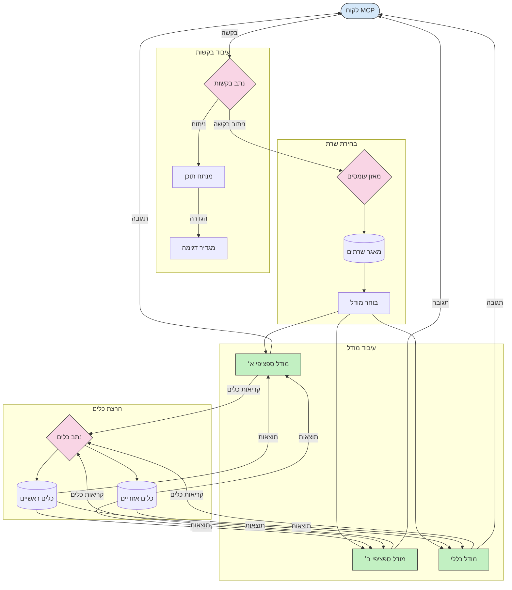

# ניתוב בפרוטוקול הקשר לדגם

ניתוב חיוני להפניית בקשות לדגמים, כלים או שירותים מתאימים בתוך אקוסיסטם MCP.

## מבוא

ניתוב בפרוטוקול הקשר לדגם (MCP) כולל הפניית בקשות לדגמים או שירותים המתאימים ביותר בהתבסס על קריטריונים שונים כגון סוג התוכן, הקשר המשתמש ועומס המערכת. זה מבטיח עיבוד יעיל וניצול מיטבי של משאבים.

## יעדי הלמידה

בסיום שיעור זה, תוכל:

- להבין את עקרונות הניתוב ב-MCP.
- ליישם ניתוב מבוסס תוכן להפניית בקשות לשירותים המתמחים בכך.
- להחיל אסטרטגיות איזון עומסים חכמות כדי לייעל שימוש במשאבים.
- ליישם ניתוב דינמי של כלים בהתבסס על הקשר הבקשה.

## ניתוב מבוסס תוכן

ניתוב מבוסס תוכן מפנה בקשות לשירותים מתמחים על בסיס תוכן הבקשה. לדוגמה, בקשות הקשורות ליצירת קוד יכולות להיות מנותבות לדגם קוד מיוחד, בעוד שבקשות כתיבה יצירתית יכולות להישלח לדגם כתיבה יצירתית.

הנה דוגמה ליישום בשפות תכנות שונות.

<details>
<summary>.NET</summary>

```csharp
// .NET Example: Content-based routing in MCP
public class ContentBasedRouter
{
    private readonly Dictionary<string, McpClient> _specializedClients;
    private readonly RoutingClassifier _classifier;
    
    public ContentBasedRouter()
    {
        // Initialize specialized clients for different domains
        _specializedClients = new Dictionary<string, McpClient>
        {
            ["code"] = new McpClient("https://code-specialized-mcp.com"),
            ["creative"] = new McpClient("https://creative-specialized-mcp.com"),
            ["scientific"] = new McpClient("https://scientific-specialized-mcp.com"),
            ["general"] = new McpClient("https://general-mcp.com")
        };
        
        // Initialize content classifier
        _classifier = new RoutingClassifier();
    }
    
    public async Task<McpResponse> RouteAndProcessAsync(string prompt, IDictionary<string, object> parameters = null)
    {
        // Classify the prompt to determine the best specialized service
        string category = await _classifier.ClassifyPromptAsync(prompt);
        
        // Get the appropriate client or fall back to general
        var client = _specializedClients.ContainsKey(category) 
            ? _specializedClients[category] 
            : _specializedClients["general"];
            
        Console.WriteLine($"Routing request to {category} specialized service");
        
        // Send request to the selected service
        return await client.SendPromptAsync(prompt, parameters);
    }
    
    // Simple classifier for routing decisions
    private class RoutingClassifier
    {
        public Task<string> ClassifyPromptAsync(string prompt)
        {
            prompt = prompt.ToLowerInvariant();
            
            if (prompt.Contains("code") || prompt.Contains("function") || 
                prompt.Contains("program") || prompt.Contains("algorithm"))
            {
                return Task.FromResult("code");
            }
            
            if (prompt.Contains("story") || prompt.Contains("creative") || 
                prompt.Contains("imagine") || prompt.Contains("design"))
            {
                return Task.FromResult("creative");
            }
            
            if (prompt.Contains("science") || prompt.Contains("research") || 
                prompt.Contains("analyze") || prompt.Contains("study"))
            {
                return Task.FromResult("scientific");
            }
            
            return Task.FromResult("general");
        }
    }
}
```

בקוד שלמעלה, ביצענו:

- יצירת מחלקת `ContentBasedRouter` שמנתבת בקשות בהתבסס על תוכן ההנחיה.
- אתחול לקוחות מתמחים לתחומים שונים (קוד, יצירתי, מדעי, כללי).
- יישום מסווג פשוט שקובע את קטגוריית ההנחיה ומפנה אותה לשירות המתמחה המתאים.
- שימוש במנגנון גיבוי להכוונת בקשות לשירות כללי אם אין שירות מתמחה זמין.
- ביצוע עיבוד אסינכרוני לטיפול יעיל בבקשות.
- שימוש במילון למיפוי קטגוריות תוכן ללקוחות MCP מתמחים.
- יישום מסווג פשוט שמנתח את ההנחיה ומחזיר את הקטגוריה המתאימה.
- שימוש בלקוח המתמחה לשליחת הבקשה וקבלת תגובה.
- טיפול במקרים בהם ההנחיה אינה תואמת לשום קטגוריה מתמחה על ידי ניתוב לשירות כללי.

</details>

## איזון עומסים חכם

איזון עומסים מייעל את ניצול המשאבים ומבטיח זמינות גבוהה לשירותי MCP. יש דרכים שונות ליישום איזון עומסים, כגון סבב רונד, משקל זמן תגובה או אסטרטגיות מותאמות תוכן.

הנה דוגמה ליישום המשתמש באסטרטגיות הבאות:

- **סבב רונד**: מפזר בקשות באופן שווה בין השרתים הזמינים.
- **משקל זמן תגובה**: מנותב לשרתים בהתאם לזמן התגובה הממוצע שלהם.
- **מודע תוכן**: מנותב לשרתים מתמחים בהתבסס על תוכן הבקשה.

<details>
<summary>Java</summary>

```java
// דוגמת Java: איזון עומס חכם עבור שרתי MCP
public class McpLoadBalancer {
    private final List<McpServerNode> serverNodes;
    private final LoadBalancingStrategy strategy;
    
    public McpLoadBalancer(List<McpServerNode> nodes, LoadBalancingStrategy strategy) {
        this.serverNodes = new ArrayList<>(nodes);
        this.strategy = strategy;
    }
    
    public McpResponse processRequest(McpRequest request) {
        // בחר את השרת הטוב ביותר על פי האסטרטגיה
        McpServerNode selectedNode = strategy.selectNode(serverNodes, request);
        
        try {
            // נהל את הבקשה אל הצומת הנבחר
            return selectedNode.processRequest(request);
        } catch (Exception e) {
            // טיפול בכשל - יישם לוגיקה של ניסיון חוזר או חלופה
            System.err.println("Error processing request on node " + selectedNode.getId() + ": " + e.getMessage());
            
            // סמן את הצומת כפוטנציאלית לא בריאה
            selectedNode.recordFailure();
            
            // נסה את הצומת הטוב הבא כחלופה
            List<McpServerNode> remainingNodes = new ArrayList<>(serverNodes);
            remainingNodes.remove(selectedNode);
            
            if (!remainingNodes.isEmpty()) {
                McpServerNode fallbackNode = strategy.selectNode(remainingNodes, request);
                return fallbackNode.processRequest(request);
            } else {
                throw new RuntimeException("All MCP server nodes failed to process the request");
            }
        }
    }
    
    // משימת בדיקת בריאות הצומת
    public void startHealthChecks(Duration interval) {
        ScheduledExecutorService scheduler = Executors.newScheduledThreadPool(1);
        scheduler.scheduleAtFixedRate(() -> {
            for (McpServerNode node : serverNodes) {
                try {
                    boolean isHealthy = node.checkHealth();
                    System.out.println("Node " + node.getId() + " health status: " + 
                                      (isHealthy ? "HEALTHY" : "UNHEALTHY"));
                } catch (Exception e) {
                    System.err.println("Health check failed for node " + node.getId());
                    node.setHealthy(false);
                }
            }
        }, 0, interval.toMillis(), TimeUnit.MILLISECONDS);
    }
    
    // ממשק לאסטרטגיות איזון עומס
    public interface LoadBalancingStrategy {
        McpServerNode selectNode(List<McpServerNode> nodes, McpRequest request);
    }
    
    // אסטרטגיית סיבוב
    public static class RoundRobinStrategy implements LoadBalancingStrategy {
        private AtomicInteger counter = new AtomicInteger(0);
        
        @Override
        public McpServerNode selectNode(List<McpServerNode> nodes, McpRequest request) {
            List<McpServerNode> healthyNodes = nodes.stream()
                .filter(McpServerNode::isHealthy)
                .collect(Collectors.toList());
            
            if (healthyNodes.isEmpty()) {
                throw new RuntimeException("No healthy nodes available");
            }
            
            int index = counter.getAndIncrement() % healthyNodes.size();
            return healthyNodes.get(index);
        }
    }
    
    // אסטרטגיית זמן תגובה משוקלל
    public static class ResponseTimeStrategy implements LoadBalancingStrategy {
        @Override
        public McpServerNode selectNode(List<McpServerNode> nodes, McpRequest request) {
            return nodes.stream()
                .filter(McpServerNode::isHealthy)
                .min(Comparator.comparing(McpServerNode::getAverageResponseTime))
                .orElseThrow(() -> new RuntimeException("No healthy nodes available"));
        }
    }
    
    // אסטרטגיית מודעות תוכן
    public static class ContentAwareStrategy implements LoadBalancingStrategy {
        @Override
        public McpServerNode selectNode(List<McpServerNode> nodes, McpRequest request) {
            // קבע את מאפייני הבקשה
            boolean isCodeRequest = request.getPrompt().contains("code") || 
                                   request.getAllowedTools().contains("codeInterpreter");
            
            boolean isCreativeRequest = request.getPrompt().contains("creative") || 
                                       request.getPrompt().contains("story");
            
            // מצא צמתים מומחים
            Optional<McpServerNode> specializedNode = nodes.stream()
                .filter(McpServerNode::isHealthy)
                .filter(node -> {
                    if (isCodeRequest && node.getSpecialization().equals("code")) {
                        return true;
                    }
                    if (isCreativeRequest && node.getSpecialization().equals("creative")) {
                        return true;
                    }
                    return false;
                })
                .findFirst();
            
            // החזר צומת מומחה או צומת בעל העומס הנמוך ביותר
            return specializedNode.orElse(
                nodes.stream()
                    .filter(McpServerNode::isHealthy)
                    .min(Comparator.comparing(McpServerNode::getCurrentLoad))
                    .orElseThrow(() -> new RuntimeException("No healthy nodes available"))
            );
        }
    }
}
```

בקוד שלמעלה, ביצענו:

- יצירת מחלקת `McpLoadBalancer` שמנהלת רשימת נקודות שרת MCP ומנתבת בקשות בהתבסס על אסטרטגיית איזון העומסים הנבחרת.
- יישום אסטרטגיות איזון עומסים שונות: `RoundRobinStrategy`, `ResponseTimeStrategy`, ו-`ContentAwareStrategy`.
- שימוש ב-`ScheduledExecutorService` לבדיקת בריאות תקופתית של נקודות השרת.
- יישום מנגנון בדיקת בריאות שמסמן נקודות כתקינות או לא תקינות בהתבסס על תגובתן לבדיקה.
- טיפול בעיבוד בקשות עם טיפול בשגיאות ולוגיקת גיבוי להבטחת זמינות גבוהה.
- שימוש במחלקת `McpServerNode` לייצוג נקודות שרת MCP בודדות, כולל מצב הבריאות, זמן התגובה הממוצע והעומס הנוכחי.
- יישום מחלקת `McpRequest` לאיפיון פרטי הבקשה כגון ההנחיה והכלים המותרים.
- שימוש ב-Java Streams לסינון ובחירה של נקודות בהתבסס על מצב הבריאות והמומחיות.

</details>

## ניתוב דינמי של כלים

ניתוב כלים מבטיח שקריאות כלים מנותבות לשירות המתאים ביותר בהתבסס על ההקשר. לדוגמה, קריאת כלי מזג אוויר עשויה להצריך הפנייה לנקודת קצה אזורית בהתבסס על מיקום המשתמש, או שקריאת מחשבון עשויה להזדקק לשימוש בגרסה ספציפית של ה-API.

הנה דוגמה ליישום שמדגים ניתוב דינמי של כלים בהתבסס על ניתוח בקשה, נקודות קצה אזוריות ותמיכה בגרסאות.

<details>
<summary>Python</summary>

```python
# דוגמה בפייתון: ניתוב דינמי של כלים בהתבסס על ניתוח הבקשה
class McpToolRouter:
    def __init__(self):
        # רישום נקודות קצה זמינות של הכלים
        self.tool_endpoints = {
            "weatherTool": "https://weather-service.example.com/api",
            "calculatorTool": "https://calculator-service.example.com/compute",
            "databaseTool": "https://database-service.example.com/query",
            "searchTool": "https://search-service.example.com/search"
        }
        
        # נקודות קצה אזוריות להפצה גלובלית
        self.regional_endpoints = {
            "us": {
                "weatherTool": "https://us-west.weather-service.example.com/api",
                "searchTool": "https://us.search-service.example.com/search"
            },
            "europe": {
                "weatherTool": "https://eu.weather-service.example.com/api",
                "searchTool": "https://eu.search-service.example.com/search"
            },
            "asia": {
                "weatherTool": "https://asia.weather-service.example.com/api",
                "searchTool": "https://asia.search-service.example.com/search"
            }
        }
        
        # תמיכה בניהול גרסאות של כלים
        self.tool_versions = {
            "weatherTool": {
                "default": "v2",
                "v1": "https://weather-service.example.com/api/v1",
                "v2": "https://weather-service.example.com/api/v2",
                "beta": "https://weather-service.example.com/api/beta"
            }
        }
    
    async def route_tool_request(self, tool_name, parameters, user_context=None):
        """Route a tool request to the appropriate endpoint based on context"""
        endpoint = self._select_endpoint(tool_name, parameters, user_context)
        
        if not endpoint:
            raise ValueError(f"No endpoint available for tool: {tool_name}")
        
        # ביצוע הבקשה בפועל לנקודת הקצה שנבחרה
        return await self._execute_tool_request(endpoint, tool_name, parameters)
    
    def _select_endpoint(self, tool_name, parameters, user_context=None):
        """Select the most appropriate endpoint based on context"""
        # נקודת הקצה הבסיסית מהרשומה
        if tool_name not in self.tool_endpoints:
            return None
            
        base_endpoint = self.tool_endpoints[tool_name]
        
        # בדיקה אם יש צורך להשתמש בגרסת כלי ספציפית
        if tool_name in self.tool_versions:
            version_info = self.tool_versions[tool_name]
            
            # שימוש בגרסה המפורשת או בברירת המחדל
            requested_version = parameters.get("_version", version_info["default"])
            if requested_version in version_info:
                base_endpoint = version_info[requested_version]
        
        # בדיקה לניתוב אזורי אם ידוע אזור המשתמש
        if user_context and "region" in user_context:
            user_region = user_context["region"]
            
            if user_region in self.regional_endpoints:
                regional_tools = self.regional_endpoints[user_region]
                
                if tool_name in regional_tools:
                    # שימוש בנקודת קצה מיוחדת לאזור
                    return regional_tools[tool_name]
        
        # בדיקה לדרישות התיישבות נתונים
        if user_context and "data_residency" in user_context:
            # זה יישם לוגיקה להבטיח שהנתונים יישארו בתחומי הרשות שצוינו
            pass
        
        # בדיקה לניתוב מבוסס על השהיה
        if user_context and "latency_sensitive" in user_context and user_context["latency_sensitive"]:
            # זה יישם לוגיקה לבחירת נקודת הקצה עם ההשהיה הנמוכה ביותר
            pass
            
        return base_endpoint
        
    async def _execute_tool_request(self, endpoint, tool_name, parameters):
        """Execute the actual tool request to the selected endpoint"""
        try:
            async with aiohttp.ClientSession() as session:
                async with session.post(
                    endpoint,
                    json={"toolName": tool_name, "parameters": parameters},
                    headers={"Content-Type": "application/json"}
                ) as response:
                    if response.status == 200:
                        result = await response.json()
                        return result
                    else:
                        error_text = await response.text()
                        raise Exception(f"Tool execution failed: {error_text}")
        except Exception as e:
            # יישום לוגיקת ניסיון חוזר או אסטרטגיית גיבוי
            print(f"Error executing tool {tool_name} at {endpoint}: {str(e)}")
            raise
```

בקוד שלמעלה, ביצענו:

- יצירת מחלקת `McpToolRouter` שמנהלת ניתוב כלים בהתבסס על ניתוח בקשה, נקודות קצה אזוריות ותמיכה בגרסאות.
- רישום נקודות קצה של כלים זמינים ונקודות קצה אזוריות להפצה גלובלית.
- יישום לוגיקת ניתוב דינמית שבוחרת בנקודת הקצה המתאימה בהתבסס על הקשר המשתמש, כגון אזור ודרישות אחסון נתונים.
- יישום תמיכה בגרסאות לכלים, המאפשרת למשתמשים לציין איזו גרסה של כלי הם רוצים להשתמש.
- שימוש בבקשות HTTP אסינכרוניות לביצוע קריאות לכלים ולטיפול בתגובות.

</details>

## ארכיטקטורת דגימה וניתוב ב-MCP

דגימה היא רכיב קריטי בפרוטוקול הקשר לדגם (MCP) המאפשר עיבוד וניתוב יעיל של בקשות. היא כוללת ניתוח של בקשות נכנסות כדי לקבוע את הדגם או השירות המתאים ביותר לטיפול בהן, בהתבסס על קריטריונים שונים כגון סוג התוכן, הקשר המשתמש ועומס המערכת.

ניתן לשלב דגימה וניתוב ליצירת ארכיטקטורה איתנה שממקסמת ניצול משאבים ומבטיחה זמינות גבוהה. תהליך הדגימה יכול לשמש לסיווג בקשות, בעוד שהניתוב מפנה אותן לדגמים או שירותים המתאימים.

הדיאגרמה למטה ממחישה כיצד דגימה וניתוב פועלים יחד בארכיטקטורת MCP מקיפה:



## מה הלאה

- [5.6 דגימה](../mcp-sampling/README.md)

---

<!-- CO-OP TRANSLATOR DISCLAIMER START -->
**כתב ויתור**:
מסמך זה תורגם באמצעות שירות תרגום אוטומטי [Co-op Translator](https://github.com/Azure/co-op-translator). למרות שאנו שואפים לדיוק, יש לקחת בחשבון שתרגומים אוטומטיים עלולים להכיל שגיאות או אי-דיוקים. יש להחשיב את המסמך המקורי בשפתו הטבעית כמקור הסמכות. למידע קריטי מומלץ להשתמש בתרגום מקצועי על ידי מתרגם אדם. אנו לא אחראים לכל אי-הבנה או פירוש שגוי הנובע מהשימוש בתרגום זה.
<!-- CO-OP TRANSLATOR DISCLAIMER END -->