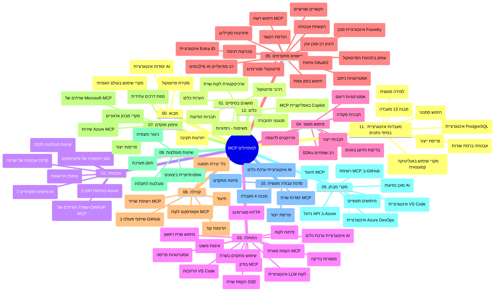

# פרוטוקול הקשר הדגם (MCP) למתחילים - מדריך לימוד

מדריך לימוד זה מספק סקירה כללית על מבנה ותוכן המאגר עבור תכנית הלימודים "פרוטוקול הקשר הדגם (MCP) למתחילים". השתמש במדריך זה כדי לנווט במאגר בצורה יעילה ולהפיק את המרב מהמשאבים הזמינים.

## סקירת המאגר

פרוטוקול הקשר הדגם (MCP) הוא מסגרת סטנדרטית לאינטראקציות בין דגמי בינה מלאכותית ויישומי לקוח. בתחילה נוצר על ידי Anthropic, MCP מתוחזק כיום על ידי קהילת MCP הרחבה דרך ארגון GitHub הרשמי. מאגר זה מספק תכנית לימודים מקיפה עם דוגמאות קוד מעשיות ב-C#, Java, JavaScript, Python, ו-TypeScript, המיועדות למפתחי AI, אדריכלי מערכות ומהנדסי תוכנה.

## מפת תכנית לימודים ויזואלית

## מבנה המאגר

המאגר מאורגן לשנים עשר חלקים עיקריים, כאשר כל אחד מתמקד בהיבטים שונים של MCP:

1. **מבוא (00-Introduction/)**
   - סקירה כללית של פרוטוקול הקשר הדגם
   - מדוע סטנדרטיזציה חשובה בצינורות AI
   - מקרי שימוש מעשיים ויתרונות

2. **מושגים מרכזיים (01-CoreConcepts/)**
   - ארכיטקטורת לקוח-שרת
   - מרכיבי הפרוטוקול המרכזיים
   - דפוסי הודעות ב-MCP
   - מבט לעתיד: [מה משתנה ב-MCP: מועמד להשקה 2026-07-28](./01-CoreConcepts/mcp-2026-07-28-release-candidate.md) — ליבת הפרוטוקול חסרת המצב, מסגרת ההרחבות, ודחיית Roots/Sampling/Logging הצפויה בגרסת המפרט הבאה

3. **אבטחה (02-Security/)**
   - איומי אבטחה במערכות מבוססות MCP
   - שיטות מומלצות לאבטחת יישומים
   - אסטרטגיות אימות והרשאות
   - **תיעוד אבטחה מקיף**:
     - שיטות אבטחה מומלצות MCP 2025
     - מדריך יישום אבטחת תוכן Azure
     - בקרות וטכניקות אבטחה ב-MCP
     - רפרנס מהיר לשיטות מיטביות ב-MCP
   - **נושאי אבטחה מרכזיים**:
     - הזרקת פקודות ותקיפות הרעלת כלים
     - חטיפת מושבים ובעיות תפקיד מבלבל
     - פרצות מעבר אסימון
     - הרשאות מופרזות ובקרת גישה
     - אבטחת שרשרת אספקה לרכיבי AI
     - אינטגרציית Microsoft Prompt Shields

4. **התחלה (03-GettingStarted/)**
   - הקמת סביבה וקונפיגורציה
   - יצירת שרתי ולקוחות MCP בסיסיים
   - שילוב עם יישומים קיימים
   - כולל חלקים עבור:
     - מימוש שרת ראשון
     - פיתוח לקוח
     - שילוב לקוח LLM
     - שילוב עם VS Code
     - שרת SSE (Server-Sent Events)
     - שימוש מתקדם בשרת
     - סטרימינג HTTP
     - שילוב AI Toolkit
     - אסטרטגיות בדיקה
     - הנחיות לפרישה

5. **מימוש מעשי (04-PracticalImplementation/)**
   - שימוש ב-SDK בשפות תכנות שונות
   - ניפוי שגיאות, בדיקה וטכניקות אימות
   - יצירת תבניות פרומפט וזרימות עבודה רב-פעמיות
   - פרויקטים לדוגמה עם דוגמאות מימוש

6. **נושאים מתקדמים (05-AdvancedTopics/)**
   - טכניקות הנדסת הקשר
   - אינטגרציית Foundry agent
   - זרימות עבודה רב-מודליות של AI
   - הדגמות אימות OAuth2
   - יכולות חיפוש בזמן אמת
   - סטרימינג בזמן אמת
   - מימוש הקשרים Root
   - אסטרטגיות ניתוב
   - טכניקות דגימה
   - גישות להרחבה
   - שקילת נושאי אבטחה
   - אינטגרציית אבטחת Entra ID
   - אינטגרציית חיפוש באינטרנט
   - הסקת סוכנים מרובה עוינת (דפוסי ויכוח)

7. **תרומות קהילתיות (06-CommunityContributions/)**
   - כיצד לתרום קוד ותיעוד
   - שיתופי פעולה דרך GitHub
   - שדרוגים והערות מונחי קהילה
   - שימוש בלקוחות MCP שונים (Claude Desktop, Cline, VSCode)
   - עבודה עם שרתי MCP פופולריים כולל יצירת תמונות

8. **לקחים מאימוץ מוקדם (07-LessonsfromEarlyAdoption/)**
   - מימושים והצלחות מהעולם האמיתי
   - בנייה ופריסה של פתרונות מבוססי MCP
   - מגמות ומפת דרכים עתידית
   - **מדריך שרתי Microsoft MCP**: מדריך מקיף ל-10 שרתי MCP מוכנים לייצור של מיקרוסופט כולל:
     - Microsoft Learn Docs MCP Server
     - Azure MCP Server (מעל 15 מחברים מיוחדים)
     - GitHub MCP Server
     - Azure DevOps MCP Server
     - MarkItDown MCP Server
     - SQL Server MCP Server
     - Playwright MCP Server
     - Dev Box MCP Server
     - Microsoft Foundry MCP Server
     - Microsoft 365 Agents Toolkit MCP Server

9. **שיטות מיטביות (08-BestPractices/)**
   - כוונון וביצוע אופטימיזציה
   - תכנון מערכות MCP עמידות לתקלות
   - אסטרטגיות בדיקה ועמידות

10. **מקרי בוחן (09-CaseStudy/)**
    - **שבעה מקרי בוחן מקיפים** המדגימים את הרב-גונית של MCP בתרחישים שונים:
    - **סוכני נסיעות בינה מלאכותית של Azure**: תזמור רב-סוכני עם Azure OpenAI ו-AI Search
    - **אינטגרציית Azure DevOps**: אוטומציה של תהליכי עבודה עם עדכוני נתוני YouTube
    - **שליפת תיעוד בזמן אמת**: לקוח קונסול Python עם סטרימינג HTTP
    - **מחולל תוכנית לימוד אינטראקטיבי**: אפליקציית רשת Chainlit עם AI שיחתי
    - **תיעוד בעורך**: שילוב VS Code עם זרימות עבודה של GitHub Copilot
    - **ניהול API של Azure**: אינטגרציית API ארגונית עם יצירת שרת MCP
    - **רישום MCP של GitHub**: פיתוח אקוסיסטם ופלטפורמת אינטגרציית סוכנים
    - דוגמאות מימוש הכוללות אינטגרציית ארגונים, פרודוקטיביות מפתחים ופיתוח אקוסיסטם

11. **סדנת מעשית (10-StreamliningAIWorkflowsBuildingAnMCPServerWithAIToolkit/)**
    - סדנת מעשית מקיפה המשלבת MCP עם AI Toolkit
    - בניית יישומים אינטיליגנטיים המחברים דגמי AI עם כלים מעולם האמיתי
    - מודולים מעשיים המכסים יסודות, פיתוח שרת מותאם, ואסטרטגיות פריסה לייצור
    - **מבנה המעבדה**:
      - מעבדה 1: יסודות שרת MCP
      - מעבדה 2: פיתוח שרת MCP מתקדם
      - מעבדה 3: אינטגרציית AI Toolkit
      - מעבדה 4: פריסה והרחבה לייצור
    - גישת למידה מבוססת מעבדות עם הוראות שלב-אחר-שלב

12. **מעבדות אינטגרציה למסד נתונים של שרת MCP (11-MCPServerHandsOnLabs/)**
    - **מסלול למידה מקיף של 13 מעבדות** לבניית שרתי MCP מוכנים לייצור עם אינטגרציית PostgreSQL
    - **מימוש ניתוח קמעונאי מהעולם האמיתי** באמצעות מקרה שימוש Zava Retail
    - **דפוסים ארגוניים** כולל אבטחת שורה (RLS), חיפוש סמנטי וגישה מרובת שוכרים לנתונים
    - **מבנה המעבדה המלא**:
      - **מעבדות 00-03: יסודות** - מבוא, ארכיטקטורה, אבטחה, הקמת סביבה
      - **מעבדות 04-06: בניית שרת MCP** - עיצוב מסד נתונים, מימוש שרת MCP, פיתוח כלים
      - **מעבדות 07-09: תכונות מתקדמות** - חיפוש סמנטי, בדיקות וניפוי שגיאות, שילוב VS Code
      - **מעבדות 10-12: ייצור ושיטות מיטביות** - פריסה, ניטור, אופטימיזציה
    - **טכנולוגיות מכוסות**: מסגרת FastMCP, PostgreSQL, Azure OpenAI, Azure Container Apps, Application Insights
    - **תוצאות למידה**: שרתי MCP מוכנים לייצור, דפוסי אינטגרציית מסד נתונים, ניתוחי AI, אבטחה ארגונית

13. **כלים (12-tooling/)**
    - למד כיצד להשתמש ב-MCP באפליקציית Copilot וכלים נוספים

## משאבים נוספים

המאגר כולל משאבים תומכים:

- **תיקיית תמונות**: מכילה דיאגרמות ואיורים המשמשים לאורך תכנית הלימודים
- **תרגומים**: תמיכה רב-לשונית עם תרגומים אוטומטיים של התיעוד
- **משאבים רשמיים של MCP**:
  - [תיעוד MCP](https://modelcontextprotocol.io/)
  - [מפרט MCP](https://spec.modelcontextprotocol.io/)
  - [מאגר MCP ב-GitHub](https://github.com/modelcontextprotocol)

## כיצד להשתמש במאגר זה

1. **למידה סדרתית**: עקוב אחרי הפרקים בסדר (00 עד 11) לחוויית לימוד מובנית.
2. **מיקוד בשפה ספציפית**: אם מעוניין בשפת תכנות מסוימת, חקור את תיקיות הדוגמאות למימושים בשפתך המועדפת.
3. **מימוש מעשי**: התחל בחלק "Getting Started" כדי להקים את סביבת העבודה וליצור את שרת ולקוח MCP הראשונים שלך.
4. **חקר מתקדם**: לאחר שתרגיש נוח עם היסודות, צלול לנושאים המתקדמים להרחבת הידע.
5. **מעורבות קהילתית**: הצטרף לקהילת MCP באמצעות דיוני GitHub וערוצי Discord כדי להתחבר למומחים ולמפתחים אחרים.

## לקוחות וכלי MCP

תכנית הלימודים מכסה לקוחות וכלי MCP שונים:

1. **לקוחות רשמיים**:
   - Visual Studio Code
   - MCP ב-Visual Studio Code
   - Claude Desktop
   - Claude ב-VSCode
   - Claude API

2. **לקוחות קהילתיים**:
   - Cline (מבוסס טרמינל)
   - Cursor (עורך קוד)
   - ChatMCP
   - Windsurf

3. **כלי ניהול MCP**:
   - MCP CLI
   - MCP Manager
   - MCP Linker
   - MCP Router

## שרתי MCP פופולריים

המאגר מציג שרתי MCP שונים, כולל:

1. **שרתי MCP רשמיים של מיקרוסופט**:
   - Microsoft Learn Docs MCP Server
   - Azure MCP Server (מעל 15 מחברים מיוחדים)
   - GitHub MCP Server
   - Azure DevOps MCP Server
   - MarkItDown MCP Server
   - SQL Server MCP Server
   - Playwright MCP Server
   - Dev Box MCP Server
   - Microsoft Foundry MCP Server
   - Microsoft 365 Agents Toolkit MCP Server

2. **שרתי הפניה רשמיים**:
   - Filesystem
   - Fetch
   - Memory
   - Sequential Thinking

3. **יצירת תמונות**:
   - Azure OpenAI DALL-E 3
   - Stable Diffusion WebUI
   - Replicate

4. **כלי פיתוח**:
   - Git MCP
   - Terminal Control
   - Code Assistant

5. **שרתים מיוחדים**:
   - Salesforce
   - Microsoft Teams
   - Jira & Confluence

## תרומה

מאגר זה מקבל בברכה תרומות מהקהילה. ראה את חלק "Community Contributions" למידע כיצד לתרום ביעילות לאקוסיסטם של MCP.

----

*מדריך לימוד זה עודכן לאחרונה ב-5 בפברואר 2026, משקף את מפרט MCP העדכני מ-25 בנובמבר 2025 ומספק סקירה של המאגר נכון לתאריך זה. תוכן המאגר עשוי להתעדכן לאחר תאריך זה.*

*תוספת (2 ביולי 2026): נוספה שיעור על מועמד להשקת מפרט MCP `2026-07-28` תחת [01-CoreConcepts](./01-CoreConcepts/mcp-2026-07-28-release-candidate.md); בסיס תכנית הלימודים נשאר 2025-11-25 עד שמשחררים את המפרט החדש.*

---

<!-- CO-OP TRANSLATOR DISCLAIMER START -->
**כתב ויתור**:
מסמך זה תורגם באמצעות שירות תרגום אוטומטי [Co-op Translator](https://github.com/Azure/co-op-translator). למרות שאנו שואפים לדיוק, יש לקחת בחשבון שתרגומים אוטומטיים עלולים להכיל שגיאות או אי-דיוקים. יש להחשיב את המסמך המקורי בשפתו הטבעית כמקור הסמכות. למידע קריטי מומלץ להשתמש בתרגום מקצועי על ידי מתרגם אדם. אנו לא אחראים לכל אי-הבנה או פירוש שגוי הנובע מהשימוש בתרגום זה.
<!-- CO-OP TRANSLATOR DISCLAIMER END -->