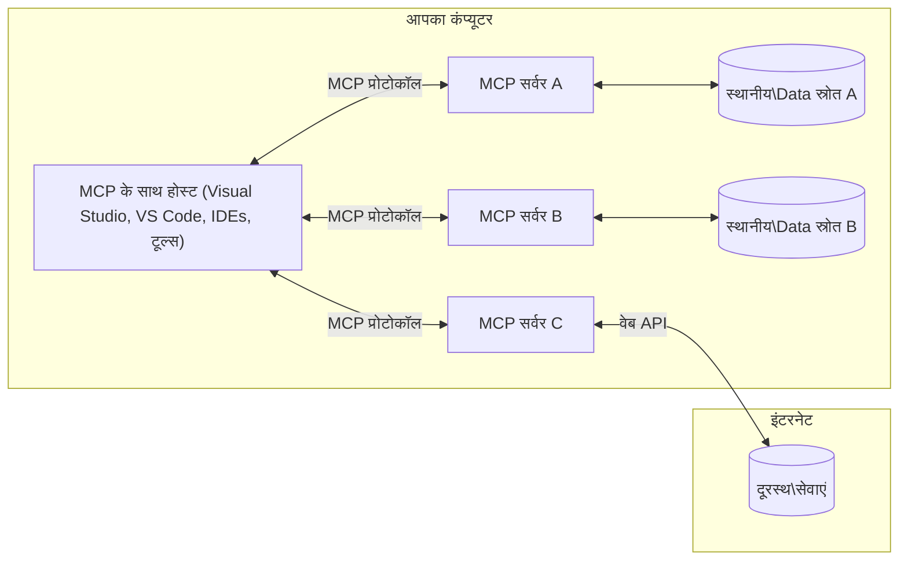

# MCP मूल अवधारणाएँ: AI एकीकरण के लिए मॉडल संदर्भ प्रोटोकॉल में महारत हासिल करना

[](https://youtu.be/earDzWGtE84)

_(इस पाठ का वीडियो देखने के लिए ऊपर की छवि पर क्लिक करें)_

[Model Context Protocol (MCP)](https://github.com/modelcontextprotocol) एक शक्तिशाली, मानकीकृत फ्रेमवर्क है जो बड़े भाषा मॉडल्स (LLMs) और बाहरी उपकरणों, अनुप्रयोगों, और डेटा स्रोतों के बीच संचार को अनुकूलित करता है।
यह गाइड आपको MCP के मूल सिद्धांतों से परिचित कराएगा। आप इसके क्लाइंट-सर्वर वास्तुकला, आवश्यक घटकों, संचार मेकेनिक्स, और कार्यान्वयन सर्वोत्तम प्रथाओं के बारे में जानेंगे।

- **स्पष्ट उपयोगकर्ता सहमति**: सभी डेटा एक्सेस और संचालन निष्पादन से पहले स्पष्ट उपयोगकर्ता अनुमोदन आवश्यक है। उपयोगकर्ताओं को स्पष्ट रूप से समझना चाहिए कि कौन सा डेटा एक्सेस किया जाएगा और कौन से कार्य performed किए जाएंगे, जिसमें अनुमतियों और अधिकारों पर सूक्ष्म नियंत्रण शामिल है।

- **डेटा गोपनीयता संरक्षण**: उपयोगकर्ता डेटा केवल स्पष्ट सहमति के साथ ही प्रदर्शित किया जाता है और पूरे इंटरैक्शन जीवनचक्र में मजबूत एक्सेस नियंत्रण द्वारा सुरक्षित रखा जाना चाहिए। कार्यान्वयन को अनधिकृत डेटा प्रसारण को रोकना चाहिए और कड़ी गोपनीयता सीमाएं बनाए रखनी चाहिए।

- **उपकरण निष्पादन सुरक्षा**: प्रत्येक उपकरण को चलाने के लिए स्पष्ट उपयोगकर्ता सहमति आवश्यक है जिसमें उपकरण की कार्यक्षमता, पैरामीटर और संभावित प्रभाव की स्पष्ट समझ हो। मजबूत सुरक्षा सीमाएं अनपेक्षित, असुरक्षित, या दुर्भावनापूर्ण उपकरण निष्पादन को रोकनी चाहिए।

- **परिवहन परत सुरक्षा**: सभी संचार चैनलों को उपयुक्त एन्क्रिप्शन और प्रमाणीकरण तंत्र का उपयोग करना चाहिए। दूरस्थ कनेक्शन को सुरक्षित प्रेषण प्रोटोकॉल और उचित क्रेडेंशियल प्रबंध लागू करना चाहिए।

#### कार्यान्वयन दिशानिर्देश:

- **अनुमति प्रबंधन**: सूक्ष्म अनुमतियों वाली प्रणालियाँ लागू करें जो उपयोगकर्ताओं को नियंत्रित करने दें कि कौन से सर्वर, उपकरण, और संसाधन उपलब्ध हैं
- **प्रमाणीकरण और प्राधिकरण**: सुरक्षित प्रमाणीकरण विधियों (OAuth, API कुंजी) का उपयोग करें जिसमें उचित टोकन प्रबंधन और срок समाप्ति हो  
- **इनपुट सत्यापन**: सभी पैरामीटर और डेटा इनपुट को परिभाषित योजनाओं के अनुसार सत्यापित करें ताकि इंजेक्शन हमलों को रोका जा सके
- **ऑडिट लॉगिंग**: सुरक्षा निगरानी और अनुपालन के लिए सभी संचालन के व्यापक लॉग बनाए रखें

## अवलोकन

यह पाठ मॉडल संदर्भ प्रोटोकॉल (MCP) पारिस्थितिकी तंत्र की मूलभूत वास्तुकला और घटकों का अन्वेषण करता है। आप क्लाइंट-सर्वर वास्तुकला, प्रमुख घटकों, और संचार तंत्र के बारे में जानेंगे जो MCP इंटरैक्शन को संचालित करते हैं।

## मुख्य शिक्षण उद्देश्य

इस पाठ के अंत तक, आप:

- MCP क्लाइंट-सर्वर वास्तुकला को समझेंगे।
- होस्ट, क्लाइंट, और सर्वर की भूमिकाओं और ज़िम्मेदारियों को पहचानेंगे।
- उन मुख्य विशेषताओं का विश्लेषण करेंगे जो MCP को एक लचीला एकीकरण परत बनाती हैं।
- जानेंगे कि MCP पारिस्थितिकी तंत्र के भीतर जानकारी कैसे प्रवाहित होती है।
- .NET, जावा, पाइथन, और जावास्क्रिप्ट में कोड उदाहरणों के माध्यम से व्यावहारिक अंतर्दृष्टि प्राप्त करेंगे।

## MCP वास्तुकला: एक गहराई से दृष्टि

MCP पारिस्थितिकी तंत्र एक क्लाइंट-सर्वर मॉडल पर आधारित है। यह माडुलर संरचना AI अनुप्रयोगों को उपकरणों, डेटाबेस, API, और संदर्भ संसाधनों के साथ कुशलता से संवाद करने की अनुमति देती है। आइए इस वास्तुकला को इसके मूल घटकों में विभाजित करें।

अपने मूल में, MCP क्लाइंट-सर्वर वास्तुकला का पालन करता है जहाँ एक होस्ट अनुप्रयोग कई सर्वरों से जुड़ सकता है:



- **MCP होस्ट्स**: VSCode, Claude Desktop, IDE, या AI उपकरण जैसी प्रोग्राम जो MCP के माध्यम से डेटा तक पहुँचना चाहते हैं
- **MCP क्लाइंट्स**: प्रोटोकॉल क्लाइंट जो सर्वरों के साथ 1:1 कनेक्शन बनाए रखते हैं
- **MCP सर्वर्स**: हल्के प्रोग्राम जो मानकीकृत मॉडल संदर्भ प्रोटोकॉल के माध्यम से विशिष्ट क्षमताएँ प्रदान करते हैं
- **स्थानीय डेटा स्रोत**: आपके कंप्यूटर की फ़ाइलें, डेटाबेस, और सेवाएं जिन्हें MCP सर्वर सुरक्षित रूप से एक्सेस कर सकते हैं
- **रिमोट सेवाएं**: बाहरी सिस्टम जो इंटरनेट के माध्यम से उपलब्ध हैं और जिनसे MCP सर्वर API के माध्यम से जुड़ सकते हैं

MCP प्रोटोकॉल एक विकसित होता हुआ मानक है जो तारीख आधारित संस्करण का उपयोग करता है (YYYY-MM-DD प्रारूप)। वर्तमान प्रोटोकॉल संस्करण **2025-11-25** है। आप [प्रोटोकॉल विनिर्देशन](https://modelcontextprotocol.io/specification/2025-11-25/) में नवीनतम अपडेट देख सकते हैं।

> **आगे देखने पर:** अगली विनिर्देशन संस्करण, **2026-07-28**, के लिए रिलीज़ उम्मीदवार मई 2026 में घोषित किया गया था और इसे 28 जुलाई 2026 को भेजा जाना निर्धारित है। यह प्रोटोकॉल को परिवहन परत पर स्टेटलेस बनाता है (श्रृंखला प्रारंभ और सत्र आईडी को हटाता है), एक्सटेंशंस फ्रेमवर्क को औपचारिक बनाता है, और रूट्स, सैम्पलिंग, और लॉगिंग को नए पैटर्न के पक्ष में अप्रचलित करता है। पूरा विवरण देखें [MCP में क्या बदल रहा है: 2026-07-28 रिलीज उम्मीदवार](./mcp-2026-07-28-release-candidate.md)।

### 1. होस्ट्स

मॉडल संदर्भ प्रोटोकॉल (MCP) में, **होस्ट्स** AI अनुप्रयोग होते हैं जो उपयोगकर्ताओं के लिए प्रोटोकॉल के साथ इंटरैक्शन का प्राथमिक इंटरफ़ेस प्रदान करते हैं। होस्ट्स कई MCP सर्वरों से कनेक्शन को समन्वित और प्रबंधित करते हैं प्रत्येक सर्वर कनेक्शन के लिए समर्पित MCP क्लाइंट बनाकर। होस्ट्स के उदाहरण हैं:

- **AI अनुप्रयोग**: Claude Desktop, Visual Studio Code, Claude Code
- **विकास परिवेश**: IDE और कोड संपादक जिनमें MCP एकीकरण होता है  
- **कस्टम अनुप्रयोग**: प्रयोजन-निर्मित AI एजेंट और उपकरण

**होस्ट्स** वे अनुप्रयोग हैं जो AI मॉडल इंटरैक्शन का समन्वय करते हैं। वे:

- **AI मॉडल्स का समन्वयन**: प्रतिक्रियाएँ उत्पन्न करने के लिए LLMs को निष्पादित या इंटरैक्ट करें और AI कार्यप्रवाह को समन्वित करें
- **क्लाइंट कनेक्शन प्रबंधन**: प्रत्येक MCP सर्वर कनेक्शन के लिए एक MCP क्लाइंट बनाएं और बनाए रखें
- **उपयोगकर्ता इंटरफ़ेस नियंत्रण**: बातचीत प्रवाह, उपयोगकर्ता इंटरैक्शन, और प्रतिक्रिया प्रस्तुति को संभालें  
- **सुरक्षा लागू करें**: अनुमतियाँ, सुरक्षा प्रतिबंध, और प्रमाणीकरण नियंत्रित करें
- **उपयोगकर्ता सहमति को संभालना**: डेटा साझा करने और उपकरण निष्पादन के लिए उपयोगकर्ता अनुमोदन प्रबंधित करें


### 2. क्लाइंट्स

**क्लाइंट्स** आवश्यक घटक हैं जो होस्ट्स और MCP सर्वरों के बीच समर्पित एक-से-एक कनेक्शन बनाए रखते हैं। प्रत्येक MCP क्लाइंट होस्ट द्वारा विशिष्ट MCP सर्वर से जुड़ने के लिए इंस्टैंस किया जाता है, जिससे व्यवस्थित और सुरक्षित संचार चैनल सुनिश्चित होते हैं। कई क्लाइंट्स होस्ट्स को एक साथ कई सर्वरों से जुड़ने देते हैं।

**क्लाइंट्स** होस्ट एप्लिकेशन के भीतर कनेक्टर घटक हैं। वे:

- **प्रोटोकॉल संचार**: सर्वरों को JSON-RPC 2.0 अनुरोध भेजें जिसमें प्रॉम्प्ट और निर्देश हों
- **क्षमता वार्ता**: प्रारंभिकरण के दौरान सर्वरों के साथ समर्थित सुविधाओं और प्रोटोकॉल संस्करणों पर बातचीत करें
- **उपकरण निष्पादन**: मॉडल से उपकरण निष्पादन अनुरोधों को प्रबंधित करें और प्रतिक्रियाएं संसाधित करें
- **रियल-टाइम अपडेट**: सर्वरों से सूचनाएं और रियल-टाइम अपडेट संभालें
- **प्रतिक्रिया प्रसंस्करण**: उपयोगकर्ताओं को दिखाने के लिए सर्वर प्रतिक्रियाओं को संसाधित और स्वरूपित करें

### 3. सर्वर्स

**सर्वर्स** कार्यक्रम हैं जो MCP क्लाइंट्स को संदर्भ, उपकरण, और क्षमताएं प्रदान करते हैं। वे स्थानीय स्तर पर (होस्ट के समान मशीन) या दूरस्थ स्तर पर (बाहरी प्लेटफार्मों पर) निष्पादित हो सकते हैं, और ग्राहक अनुरोधों को संभालने और संरचित प्रतिक्रिया प्रदान करने के लिए जिम्मेदार होते हैं। सर्वर मानकीकृत मॉडल संदर्भ प्रोटोकॉल के माध्यम से विशिष्ट कार्यक्षमता का प्रदर्शन करते हैं।

**सर्वर्स** सेवाएं हैं जो संदर्भ और क्षमताएं प्रदान करती हैं। वे:

- **विशेषता पंजीकरण**: उपलब्ध प्राइमिटिव्स (संसाधन, प्रॉम्प्ट, उपकरण) को क्लाइंट्स के लिए पंजीकृत और प्रदर्शित करें
- **अनुरोध प्रसंस्करण**: क्लाइंट्स से उपकरण कॉल, संसाधन अनुरोध, और प्रॉम्प्ट अनुरोध प्राप्त करें और निष्पादित करें
- **संदर्भ प्रदान करना**: मॉडल प्रतिक्रियाओं को बेहतर बनाने के लिए संदर्भ जानकारी और डेटा प्रदान करें
- **स्थिति प्रबंधन**: सत्र स्थिति बनाए रखें और आवश्यकतानुसार राज्यपूर्ण इंटरैक्शन संभालें

- **रियल-टाइम सूचनाएं**: क्षमता परिवर्तनों और अपडेट के बारे में कनेक्टेड क्लाइंट्स को सूचनाएं भेजें

कोई भी मॉडल क्षमताओं को विशेषीकृत कार्यक्षमता के साथ बढ़ाने के लिए सर्वर विकसित कर सकता है, और वे दोनों स्थानीय और दूरस्थ तैनाती परिदृश्यों का समर्थन करते हैं।

### 4. सर्वर प्रिमिटिव्स

मॉडल संदर्भ प्रोटोकॉल (MCP) में सर्वर तीन मूल **प्रिमिटिव्स** प्रदान करते हैं जो क्लाइंट्स, होस्ट्स और भाषा मॉडलों के बीच समृद्ध इंटरैक्शन के बुनियादी बिल्डिंग ब्लॉक्स को परिभाषित करते हैं। ये प्रिमिटिव्स प्रोटोकॉल के माध्यम से उपलब्ध संदर्भात्मक जानकारी और क्रियाओं के प्रकारों को निर्दिष्ट करते हैं।

MCP सर्वर निम्नलिखित तीन मुख्य प्रिमिटिव्स में से किसी भी संयोजन को एक्सपोज़ कर सकते हैं:

#### संसाधन (Resources)

**संसाधन** वे डेटा स्रोत हैं जो एआई अनुप्रयोगों को संदर्भ जानकारी प्रदान करते हैं। वे स्थिर या गतिशील सामग्री का प्रतिनिधित्व करते हैं जो मॉडल की समझ और निर्णय लेने में सुधार कर सकते हैं:

- **संदर्भात्मक डेटा**: एआई मॉडल के उपयोग के लिए संरचित जानकारी और संदर्भ
- **ज्ञान आधार**: दस्तावेज़ संग्रह, लेख, मैनुअल और शोध पत्र
- **स्थानीय डेटा स्रोत**: फ़ाइलें, डेटाबेस, और स्थानीय सिस्टम जानकारी  
- **बाहरी डेटा**: एपीआई प्रतिक्रियाएं, वेब सेवाएं, और दूरस्थ सिस्टम डेटा
- **गतिशील सामग्री**: बाहरी परिस्थितियों के आधार पर समय-समय पर अपडेट होने वाला रियल-टाइम डेटा

संसाधनों की पहचान URI द्वारा की जाती है और ये `resources/list` के माध्यम से खोज और `resources/read` के माध्यम से पुनः प्राप्त किया जा सकता है:

```text
file://documents/project-spec.md
database://production/users/schema
api://weather/current
```

#### प्रॉम्प्ट्स (Prompts)

**प्रॉम्प्ट्स** पुन: प्रयोज्य टेम्पलेट्स हैं जो भाषा मॉडलों के साथ इंटरैक्शन को संरचित करने में मदद करते हैं। वे मानकीकृत इंटरैक्शन पैटर्न और टेम्प्लेटेड वर्कफ्लोज़ प्रदान करते हैं:

- **टेम्पलेट-आधारित इंटरैक्शन**: पूर्व-संरचित संदेश और वार्तालाप प्रारंभकर्ता
- **वर्कफ़्लो टेम्पलेट्स**: सामान्य कार्यों और इंटरैक्शनों के लिए मानकीकृत अनुक्रम
- **कुछ-उदाहरण टेम्प्लेट्स**: मॉडल निर्देश के लिए उदाहरण-आधारित टेम्पलेट्स
- **सिस्टम प्रॉम्प्ट्स**: मॉडल व्यवहार और संदर्भ को परिभाषित करने वाले मौलिक प्रॉम्प्ट्स
- **गतिशील टेम्पलेट्स**: विशिष्ट संदर्भों के अनुरूप पैरामीटरयुक्त प्रॉम्प्ट्स

प्रॉम्प्ट्स वैरिएबल प्रतिस्थापन का समर्थन करते हैं और इन्हें `prompts/list` के माध्यम से खोजा और `prompts/get` के साथ पुनः प्राप्त किया जा सकता है:

```markdown
Generate a {{task_type}} for {{product}} targeting {{audience}} with the following requirements: {{requirements}}
```

#### उपकरण (Tools)

**उपकरण** निष्पादन योग्य फ़ंक्शन होते हैं जिन्हें AI मॉडल विशिष्ट क्रियाओं को करने के लिए कॉल कर सकते हैं। वे MCP इकोसिस्टम के "क्रियाएं" हैं, जो मॉडल को बाहरी सिस्टम के साथ इंटरैक्ट करने में सक्षम बनाते हैं:

- **निष्पादन योग्य फ़ंक्शन**: पृथक संचालन जिन्हें मॉडल विशिष्ट पैरामीटर के साथ कॉल कर सकते हैं
- **बाहरी सिस्टम एकीकरण**: एपीआई कॉल, डेटाबेस क्वेरी, फ़ाइल संचालन, गणनाएँ
- **अद्वितीय पहचान**: प्रत्येक टूल का अलग नाम, विवरण और पैरामीटर योजना होती है
- **संरचित I/O**: टूल मान्य पैरामीटर स्वीकार करते हैं और संरचित, टाइप किए गए उत्तर लौटाते हैं
- **कृति क्षमताएं**: मॉडल को वास्तविक दुनिया की क्रियाएं करने और लाइव डेटा प्राप्त करने में सक्षम बनाना

टूल JSON Schema के साथ पैरामीटर मान्यता के लिए परिभाषित किए जाते हैं और `tools/list` के माध्यम से खोजे जाते हैं और `tools/call` के माध्यम से निष्पादित होते हैं। बेहतर UI प्रस्तुति के लिए टूल्स में अतिरिक्त मेटाडेटा के रूप में **आइकॉन** भी शामिल हो सकते हैं।

**टूल एनोटेशन**: टूल व्यवहार एनोटेशन (जैसे, `readOnlyHint`, `destructiveHint`) का समर्थन करते हैं जो यह बताते हैं कि टूल केवल पढ़ने वाला है या विनाशकारी है, जिससे क्लाइंट्स को टूल निष्पादन के बारे में सूचित निर्णय लेने में मदद मिलती है।

टूल परिभाषा का उदाहरण:

```typescript
server.tool(
  "search_products", 
  {
    query: z.string().describe("Search query for products"),
    category: z.string().optional().describe("Product category filter"),
    max_results: z.number().default(10).describe("Maximum results to return")
  }, 
  async (params) => {
    // खोज चलाएं और संरचित परिणाम लौटाएं
    return await productService.search(params);
  }
);
```

## क्लाइंट प्रिमिटिव्स

मॉडल संदर्भ प्रोटोकॉल (MCP) में, **क्लाइंट्स** प्रिमिटिव्स को एक्सपोज़ कर सकते हैं जो सर्वरों को होस्ट ऐप्लिकेशन से अतिरिक्त क्षमताओं का अनुरोध करने में सक्षम बनाती हैं। ये क्लाइंट-साइड प्रिमिटिव्स अधिक समृद्ध, अधिक इंटरैक्टिव सर्वर कार्यान्वयन की अनुमति देते हैं जो एआई मॉडल क्षमताओं और उपयोगकर्ता इंटरैक्शन तक पहुँच सकते हैं।

### सैंपलिंग (Sampling)

> **डिप्रिकेशन नोटिस:** `2026-07-28` रिलीज़ कैंडीडेट सैंपलिंग को LLM प्रोवाइडर एपीआई के प्रत्यक्ष एकीकरण के पक्ष में डिप्रिकेटेड घोषित करता है। यह `2025-11-25` और डिप्रिकेशन के कम से कम एक साल बाद भी काम करता रहेगा, लेकिन नए डिज़ाइन प्रतिस्थापन पैटर्न को प्राथमिकता देनी चाहिए। देखें [MCP में क्या बदल रहा है: 2026-07-28 रिलीज़ कैंडीडेट](./mcp-2026-07-28-release-candidate.md)।

**सैंपलिंग** सर्वरों को क्लाइंट के AI अनुप्रयोग से भाषा मॉडल पूर्णताएं अनुरोध करने की अनुमति देता है। यह प्रिमिटिव सर्वरों को उनकी अपनी मॉडल निर्भरताओं को संलग्न किए बिना LLM क्षमताओं तक पहुँचने में सक्षम बनाता है:

- **मॉडल-स्वतंत्र पहुँच**: सर्वर पूर्णताएं अनुरोध कर सकते हैं बिना LLM SDKs शामिल किए या मॉडल एक्सेस प्रबंधित किए
- **सर्वर-प्रेरित AI**: सर्वरों को क्लाइंट के AI मॉडल का उपयोग करके स्वतंत्र रूप से सामग्री उत्पन्न करने में सक्षम बनाता है
- **पुनरावर्तक LLM इंटरैक्शन**: जटिल परिदृश्यों का समर्थन करता है जहां सर्वरों को प्रसंस्करण के लिए AI सहायता की आवश्यकता होती है
- **गतिशील सामग्री निर्माण**: सर्वरों को होस्ट के मॉडल का उपयोग करके संदर्भ प्रतिक्रियाएं बनाने की अनुमति देता है
- **टूल कॉलिंग समर्थन**: सर्वर सैंपलिंग के दौरान क्लाइंट के मॉडल को टूल्स को कॉल करने में सक्षम बनाने के लिए `tools` और `toolChoice` पैरामीटर शामिल कर सकते हैं

सैंपलिंग `sampling/complete` विधि के माध्यम से शुरू की जाती है, जहां सर्वर क्लाइंट्स को पूर्णता अनुरोध भेजते हैं।

### रूट्स (Roots)

> **डिप्रिकेशन नोटिस:** `2026-07-28` रिलीज़ कैंडीडेट रूट्स को टूल पैरामीटर, संसाधन URI, या सर्वर कॉन्फ़िगरेशन के पक्ष में डिप्रिकेट करता है। यह `2025-11-25` और डिप्रिकेशन के कम से कम एक साल बाद भी काम करता रहेगा। देखें [MCP में क्या बदल रहा है: 2026-07-28 रिलीज़ कैंडीडेट](./mcp-2026-07-28-release-candidate.md)।

**रूट्स** क्लाइंट्स को सर्वरों के लिए फाइल सिस्टम सीमाओं को मानकीकृत तरीके से एक्सपोज़ करने की अनुमति देते हैं, जिससे सर्वर यह समझ सकते हैं कि उन्हें किन निर्देशिकाओं और फ़ाइलों तक पहुंच है:

- **फाइल सिस्टम सीमाएं**: यह परिभाषित करती हैं कि सर्वर फाइल सिस्टम के किस हिस्से में काम कर सकते हैं
- **पहुंच नियंत्रण**: सर्वरों को यह समझने में मदद करते हैं कि उन्हें किन निर्देशिकाओं और फ़ाइलों तक पहुंच की अनुमति है
- **गतिशील अपडेट्स**: क्लाइंट्स सर्वरों को सूचित कर सकते हैं जब रूट्स की सूची बदलती है
- **URI-आधारित पहचान**: रूट्स `file://` URI का उपयोग कर एक्सेस की जाने वाली निर्देशिकाओं और फ़ाइलों की पहचान करते हैं

रूट `roots/list` विधि के माध्यम से खोजे जाते हैं, और क्लाइंट्स रूट्स में परिवर्तन होने पर `notifications/roots/list_changed` भेजते हैं।

### प्रेरणा (Elicitation)  

**प्रेरणा** सर्वरों को उपयोगकर्ताओं से अतिरिक्त जानकारी या पुष्टि के लिए क्लाइंट इंटरफ़ेस के माध्यम से अनुरोध करने की अनुमति देती है:

- **उपयोगकर्ता इनपुट अनुरोध**: जब टूल निष्पादन के लिए आवश्यक हो तो सर्वर अतिरिक्त जानकारी मांग सकते हैं
- **पुष्टि संवाद**: संवेदनशील या प्रभावशाली कार्यों के लिए उपयोगकर्ता की अनुमति का अनुरोध करें
- **इंटरैक्टिव वर्कफ़्लोज़**: सर्वरों को चरण-दर-चरण उपयोगकर्ता इंटरैक्शन बनाने की अनुमति देता है
- **गतिशील पैरामीटर संग्रह**: टूल निष्पादन के दौरान गुम या वैकल्पिक पैरामीटर इकट्ठा करें

प्रेरणा अनुरोध `elicitation/request` विधि का उपयोग करके किए जाते हैं ताकि क्लाइंट के इंटरफ़ेस के माध्यम से उपयोगकर्ता इनपुट एकत्र किया जा सके।

**URL मोड प्रेरणा**: सर्वर URL-आधारित उपयोगकर्ता इंटरैक्शन भी अनुरोध कर सकते हैं, जिससे वे उपयोगकर्ताओं को प्रमाणीकरण, पुष्टि, या डेटा प्रविष्टि के लिए बाहरी वेब पृष्ठों पर निर्देशित कर सकते हैं।

### लॉगिंग


> **डिप्रिकेशन सूचना:** `2026-07-28` रिलीज़ उम्मीदवार लॉगिंग को stdio ट्रांसपोर्ट्स के लिए `stderr` और संरचित अवलोकनीयता के लिए OpenTelemetry के पक्ष में डिप्रिकेट के रूप में चिह्नित करता है। यह `2025-11-25` में और किसी भी डिप्रिकेशन के कम से कम एक साल बाद भी काम करता रहता है। देखें [MCP में क्या बदल रहा है: 2026-07-28 रिलीज़ उम्मीदवार](./mcp-2026-07-28-release-candidate.md)।

**लॉगिंग** सर्वरों को डिबगिंग, निगरानी, और संचालनात्मक दृश्यता के लिए संरचित लॉग संदेश ग्राहकों को भेजने की अनुमति देता है:

- **डिबगिंग समर्थन**: सर्वरों को समस्याएँ हल करने के लिए विस्तृत निष्पादन लॉग प्रदान करने में सक्षम बनाना
- **संचालनात्मक निगरानी**: स्टेटस अपडेट और प्रदर्शन मेट्रिक्स क्लाइंट्स को भेजना
- **त्रुटि रिपोर्टिंग**: विस्तृत त्रुटि संदर्भ और डायग्नोस्टिक जानकारी प्रदान करना
- **ऑडिट ट्रेल्स**: सर्वर संचालन और निर्णयों के व्यापक लॉग बनाना

लॉगिंग संदेशों को क्लाइंटों को भेजा जाता है ताकि सर्वर संचालन में पारदर्शिता प्रदान की जा सके और डिबगिंग को सरल बनाया जा सके।

## MCP में सूचना प्रवाह

मॉडल संदर्भ प्रोटोकॉल (MCP) होस्ट्स, क्लाइंट्स, सर्वर्स, और मॉडलों के बीच सूचना के संरचित प्रवाह को परिभाषित करता है। इस प्रवाह को समझना यह स्पष्ट करने में मदद करता है कि उपयोगकर्ता अनुरोध कैसे संसाधित होते हैं और बाहरी उपकरण और डेटा मॉडल प्रतिक्रियाओं में कैसे समाहित होते हैं।

- **होस्ट कनेक्शन शुरू करता है**  
  होस्ट एप्लिकेशन (जैसे IDE या चैट इंटरफ़ेस) आमतौर पर STDIO, WebSocket, या अन्य समर्थित ट्रांसपोर्ट के माध्यम से एक MCP सर्वर से कनेक्शन स्थापित करता है।

- **क्षमता वार्ता (Capability Negotiation)**  
  होस्ट के अंतर्निहित क्लाइंट और सर्वर अपने समर्थित फीचर्स, टूल्स, संसाधनों और प्रोटोकॉल संस्करणों के बारे में जानकारी का आदान-प्रदान करते हैं। यह सुनिश्चित करता है कि दोनों पक्ष सत्र के लिए उपलब्ध क्षमताओं को समझते हैं।

- **उपयोगकर्ता अनुरोध**  
  उपयोगकर्ता होस्ट के साथ इंटरैक्ट करता है (जैसे एक प्रॉम्प्ट या कमांड दर्ज करता है)। होस्ट यह इनपुट एकत्र करता है और इसे प्रसंस्करण के लिए क्लाइंट को भेजता है।

- **संसाधन या टूल का उपयोग**  
  - क्लाइंट सर्वर से अतिरिक्त संदर्भ या संसाधन (जैसे फाइलें, डेटाबेस प्रविष्टियाँ, या नॉलेज बेस लेख) अनुरोध कर सकता है ताकि मॉडल की समझ बेहतर हो सके।
  - यदि मॉडल तय करता है कि किसी टूल की आवश्यकता है (जैसे डेटा प्राप्त करना, गणना करना, या API कॉल करना), तो क्लाइंट सर्वर को टूल इनवोकेशन अनुरोध भेजता है, जिसमें टूल का नाम और पैरामीटर होते हैं।

- **सर्वर निष्पादन**  
  सर्वर संसाधन या टूल अनुरोध प्राप्त करता है, आवश्यक ऑपरेशन्स (जैसे फ़ंक्शन चलाना, डेटाबेस क्वेरी, या फ़ाइल पुनःप्राप्त करना) करता है, और परिणाम संरचित प्रारूप में क्लाइंट को लौटाता है।

- **प्रतिक्रिया निर्माण**  
  क्लाइंट सर्वर की प्रतिक्रियाओं (संसाधन डेटा, टूल आउटपुट आदि) को जारी मॉडल इंटरैक्शन में समाहित करता है। मॉडल इस जानकारी का उपयोग एक व्यापक और संदर्भानुकूल उत्तर उत्पन्न करने के लिए करता है।

- **परिणाम प्रस्तुति**  
  होस्ट क्लाइंट से अंतिम आउटपुट प्राप्त करता है और इसे उपयोगकर्ता को प्रस्तुत करता है, अक्सर मॉडल का उत्पन्न टेक्स्ट और किसी भी टूल निष्पादनों या संसाधन खोज के परिणाम दोनों को शामिल करते हुए।

यह प्रवाह MCP को उन्नत, इंटरैक्टिव, और संदर्भ-जागरूक AI अनुप्रयोगों का समर्थन करने में सक्षम बनाता है, जो मॉडल को बाहरी टूल्स और डेटा स्रोतों से निर्बाध रूप से जोड़ता है।

## प्रोटोकॉल आर्किटेक्चर और परतें

MCP दो अलग-अलग आर्किटेक्चरल परतों से बना है जो एक पूर्ण संचार ढांचा प्रदान करने के लिए मिलकर काम करती हैं:

### डेटा परत

**डेटा परत** MCP प्रोटोकॉल को **JSON-RPC 2.0** को आधार बनाकर लागू करती है। यह परत संदेश की संरचना, अर्थशास्त्र, और इंटरैक्शन पैटर्न को परिभाषित करती है:

#### मुख्य घटक:

- **JSON-RPC 2.0 प्रोटोकॉल**: सभी संचार विधि कॉल, प्रतिक्रियाओं और सूचनाओं के लिए मानकीकृत JSON-RPC 2.0 संदेश स्वरूप का उपयोग करता है
- **जीवनचक्र प्रबंधन**: कनेक्शन आरंभ, क्षमता वार्ता, और क्लाइंट्स और सर्वर्स के बीच सत्र समाप्ति को संभालता है
- **सर्वर मूलभूत तत्त्व**: टूल्स, संसाधन, और प्रॉम्प्ट के माध्यम से सर्वर को मूल कार्यक्षमता प्रदान करने में सक्षम बनाता है
- **क्लाइंट मूलभूत तत्त्व**: सर्वरों को LLM से सैंपलिंग, उपयोगकर्ता इनपुट प्राप्त करने, और लॉग संदेश भेजने में सक्षम बनाता है
- **रीयल-टाइम सूचनाएं**: पोलिंग के बिना गतिशील अपडेट के लिए असिंक्रोनस सूचनाओं का समर्थन करता है

#### मुख्य विशेषताएँ:

- **प्रोटोकॉल संस्करण वार्ता**: संगतता सुनिश्चित करने के लिए दिनांक-आधारित संस्करणकरण (YYYY-MM-DD) का उपयोग करता है
- **क्षमता खोज**: क्लाइंट्स और सर्वर्स प्रारंभ में समर्थित फीचर जानकारी का आदान-प्रदान करते हैं
- **राज्यपूर्ण सत्र**: संदर्भ निरंतरता के लिए कई इंटरैक्शन के बीच कनेक्शन स्थिति बनाए रखता है

### ट्रांसपोर्ट परत

**ट्रांसपोर्ट परत** MCP भागीदारों के बीच संचार चैनल, संदेश फ्रेमिंग, और प्रमाणीकरण का प्रबंधन करती है:

#### समर्थित ट्रांसपोर्ट तंत्र:

1. **STDIO ट्रांसपोर्ट**:
   - सीधे प्रक्रिया संचार के लिए मानक इनपुट/आउटपुट स्ट्रीम का उपयोग करता है
   - बिना नेटवर्क ओवरहेड के समान मशीन पर स्थानीय प्रक्रियाओं के लिए उपयुक्त
   - स्थानीय MCP सर्वर कार्यान्वयन के लिए आमतौर पर उपयोग किया जाता है

2. **स्ट्रीमेबल HTTP ट्रांसपोर्ट**:
   - क्लाइंट से सर्वर तक संदेशों के लिए HTTP POST का उपयोग करता है  
   - सर्वर से क्लाइंट को स्ट्रीमिंग के लिए वैकल्पिक सर्वर-सेंट इवेंट्स (SSE)
   - नेटवर्क्स के पार दूरस्थ सर्वर संचार सक्षम करता है
   - मानक HTTP प्रमाणीकरण (बेयरर टोकन, API कुंजियाँ, कस्टम हेडर) का समर्थन करता है
   - सुरक्षित टोकन-आधारित प्रमाणीकरण के लिए MCP OAuth की सिफारिश करता है

#### ट्रांसपोर्ट अमूर्तता:

ट्रांसपोर्ट लेयर डेटा लेयर से संचार विवरण को अमूर्त करती है, जिससे सभी ट्रांसपोर्ट तंत्रों में समान JSON-RPC 2.0 संदेश प्रारूप सक्षम होता है। यह अमूर्तता अनुप्रयोगों को स्थानीय और दूरस्थ सर्वर के बीच सहजता से स्विच करने देती है।

### सुरक्षा विचार

MCP कार्यान्वयन को सभी प्रोटोकॉल संचालन के दौरान सुरक्षित, विश्वसनीय और सुरक्षित इंटरैक्शन सुनिश्चित करने के लिए कई महत्वपूर्ण सुरक्षा सिद्धांतों का पालन करना चाहिए:

- **उपयोगकर्ता सहमति और नियंत्रण**: उपयोगकर्ताओं को डेटा तक पहुँचने या ऑपरेशन्स करने से पहले स्पष्ट सहमति प्रदान करनी चाहिए। उनके पास यह स्पष्ट नियंत्रण होना चाहिए कि कौन सा डेटा साझा किया जाता है और कौन सी क्रियाएँ प्रमाणित होती हैं, जिन्हें समीक्षा और अनुमोदन के लिए सहज उपयोगकर्ता इंटरफेस के माध्यम से समर्थित होना चाहिए।

- **डेटा गोपनीयता**: उपयोगकर्ता डेटा केवल स्पष्ट सहमति के साथ ही दिखाया जाना चाहिए और उपयुक्त पहुंच नियंत्रण द्वारा सुरक्षित होना चाहिए। MCP कार्यान्वयन को अनधिकृत डेटा ट्रांसमिशन से बचाव करना चाहिए और सभी इंटरैक्शन में गोपनीयता बनाए रखना चाहिए।

- **टूल सुरक्षा**: किसी भी टूल को इनवोक करने से पहले स्पष्ट उपयोगकर्ता सहमति आवश्यक है। उपयोगकर्ताओं को प्रत्येक टूल की कार्यक्षमता का स्पष्ट समझ होनी चाहिए, और अनपेक्षित या असुरक्षित टूल निष्पादन को रोकने के लिए मजबूत सुरक्षा सीमाएं लागू होनी चाहिए।

इन सुरक्षा सिद्धांतों का पालन करके, MCP उपयोगकर्ता विश्वास, गोपनीयता, और सुरक्षा को सभी प्रोटोकॉल इंटरैक्शन के दौरान बनाए रखता है जबकि शक्तिशाली AI सूचनात्मक संयोजन को सक्षम करता है।

## कोड उदाहरण: मुख्य घटक

नीचे कई लोकप्रिय प्रोग्रामिंग भाषाओं में कोड उदाहरण दिए गए हैं जो दिखाते हैं कि MCP सर्वर के मुख्य घटकों और टूल्स को कैसे लागू किया जाता है।

### .NET उदाहरण: टूल्स के साथ एक सरल MCP सर्वर बनाना

यहाँ एक व्यावहारिक .NET कोड उदाहरण है जो दिखाता है कि कैसे एक सरल MCP सर्वर को कस्टम टूल्स के साथ लागू किया जाए। यह उदाहरण टूल्स को परिभाषित करने, पंजीकृत करने, अनुरोधों को संभालने, और मॉडल संदर्भ प्रोटोकॉल का उपयोग करके सर्वर को कनेक्ट करने के तरीके को प्रदर्शित करता है।

```csharp
using System;
using System.Threading.Tasks;
using ModelContextProtocol.Server;
using ModelContextProtocol.Server.Transport;
using ModelContextProtocol.Server.Tools;

public class WeatherServer
{
    public static async Task Main(string[] args)
    {
        // Create an MCP server
        var server = new McpServer(
            name: "Weather MCP Server",
            version: "1.0.0"
        );
        
        // Register our custom weather tool
        server.AddTool<string, WeatherData>("weatherTool", 
            description: "Gets current weather for a location",
            execute: async (location) => {
                // Call weather API (simplified)
                var weatherData = await GetWeatherDataAsync(location);
                return weatherData;
            });
        
        // Connect the server using stdio transport
        var transport = new StdioServerTransport();
        await server.ConnectAsync(transport);
        
        Console.WriteLine("Weather MCP Server started");
        
        // Keep the server running until process is terminated
        await Task.Delay(-1);
    }
    
    private static async Task<WeatherData> GetWeatherDataAsync(string location)
    {
        // This would normally call a weather API
        // Simplified for demonstration
        await Task.Delay(100); // Simulate API call
        return new WeatherData { 
            Temperature = 72.5,
            Conditions = "Sunny",
            Location = location
        };
    }
}

public class WeatherData
{
    public double Temperature { get; set; }
    public string Conditions { get; set; }
    public string Location { get; set; }
}
```

### जावा उदाहरण: MCP सर्वर घटक

यह उदाहरण उपर्युक्त .NET उदाहरण के समान MCP सर्वर और टूल पंजीकरण दिखाता है, लेकिन इसे जावा में लागू किया गया है।

```java
import io.modelcontextprotocol.server.McpServer;
import io.modelcontextprotocol.server.McpToolDefinition;
import io.modelcontextprotocol.server.transport.StdioServerTransport;
import io.modelcontextprotocol.server.tool.ToolExecutionContext;
import io.modelcontextprotocol.server.tool.ToolResponse;

public class WeatherMcpServer {
    public static void main(String[] args) throws Exception {
        // एक MCP सर्वर बनाएं
        McpServer server = McpServer.builder()
            .name("Weather MCP Server")
            .version("1.0.0")
            .build();
            
        // एक मौसम उपकरण पंजीकृत करें
        server.registerTool(McpToolDefinition.builder("weatherTool")
            .description("Gets current weather for a location")
            .parameter("location", String.class)
            .execute((ToolExecutionContext ctx) -> {
                String location = ctx.getParameter("location", String.class);
                
                // मौसम डेटा प्राप्त करें (सरलीकृत)
                WeatherData data = getWeatherData(location);
                
                // स्वरूपित प्रतिक्रिया लौटाएं
                return ToolResponse.content(
                    String.format("Temperature: %.1f°F, Conditions: %s, Location: %s", 
                    data.getTemperature(), 
                    data.getConditions(), 
                    data.getLocation())
                );
            })
            .build());
        
        // stdio ट्रांसपोर्ट का उपयोग करके सर्वर से कनेक्ट करें
        try (StdioServerTransport transport = new StdioServerTransport()) {
            server.connect(transport);
            System.out.println("Weather MCP Server started");
            // प्रक्रिया समाप्त होने तक सर्वर चलाते रहें
            Thread.currentThread().join();
        }
    }
    
    private static WeatherData getWeatherData(String location) {
        // कार्यान्वयन मौसम API को कॉल करेगा
        // उदाहरण उद्देश्यों के लिए सरलीकृत
        return new WeatherData(72.5, "Sunny", location);
    }
}

class WeatherData {
    private double temperature;
    private String conditions;
    private String location;
    
    public WeatherData(double temperature, String conditions, String location) {
        this.temperature = temperature;
        this.conditions = conditions;
        this.location = location;
    }
    
    public double getTemperature() {
        return temperature;
    }
    
    public String getConditions() {
        return conditions;
    }
    
    public String getLocation() {
        return location;
    }
}
```

### पाइथन उदाहरण: MCP सर्वर बनाना

यह उदाहरण fastmcp का उपयोग करता है, कृपया पहले इसे इंस्टॉल करना सुनिश्चित करें:

```python
pip install fastmcp
```
Code Sample:

```python
#!/usr/bin/env python3
import asyncio
from fastmcp import FastMCP
from fastmcp.transports.stdio import serve_stdio

# एक FastMCP सर्वर बनाएं
mcp = FastMCP(
    name="Weather MCP Server",
    version="1.0.0"
)

@mcp.tool()
def get_weather(location: str) -> dict:
    """Gets current weather for a location."""
    return {
        "temperature": 72.5,
        "conditions": "Sunny",
        "location": location
    }

# एक वर्ग का उपयोग करके वैकल्पिक दृष्टिकोण
class WeatherTools:
    @mcp.tool()
    def forecast(self, location: str, days: int = 1) -> dict:
        """Gets weather forecast for a location for the specified number of days."""
        return {
            "location": location,
            "forecast": [
                {"day": i+1, "temperature": 70 + i, "conditions": "Partly Cloudy"}
                for i in range(days)
            ]
        }

# वर्ग उपकरण पंजीकृत करें
weather_tools = WeatherTools()

# सर्वर शुरू करें
if __name__ == "__main__":
    asyncio.run(serve_stdio(mcp))
```

### जावास्क्रिप्ट उदाहरण: MCP सर्वर बनाना

यह उदाहरण जावास्क्रिप्ट में MCP सर्वर बनाने और दो मौसम संबंधी टूल्स को पंजीकृत करने को दिखाता है।

```javascript
// आधिकारिक मॉडल संदर्भ प्रोटोकॉल SDK का उपयोग करना
import { McpServer } from "@modelcontextprotocol/sdk/server/mcp.js";
import { StdioServerTransport } from "@modelcontextprotocol/sdk/server/stdio.js";
import { z } from "zod"; // पैरामीटर मान्यता के लिए

// एक MCP सर्वर बनाएँ
const server = new McpServer({
  name: "Weather MCP Server",
  version: "1.0.0"
});

// एक मौसम टूल परिभाषित करें
server.tool(
  "weatherTool",
  {
    location: z.string().describe("The location to get weather for")
  },
  async ({ location }) => {
    // यह आमतौर पर एक मौसम API को कॉल करेगा
    // प्रदर्शन के लिए सरल किया गया
    const weatherData = await getWeatherData(location);
    
    return {
      content: [
        { 
          type: "text", 
          text: `Temperature: ${weatherData.temperature}°F, Conditions: ${weatherData.conditions}, Location: ${weatherData.location}` 
        }
      ]
    };
  }
);

// एक पूर्वानुमान टूल परिभाषित करें
server.tool(
  "forecastTool",
  {
    location: z.string(),
    days: z.number().default(3).describe("Number of days for forecast")
  },
  async ({ location, days }) => {
    // यह आमतौर पर एक मौसम API को कॉल करेगा
    // प्रदर्शन के लिए सरल किया गया
    const forecast = await getForecastData(location, days);
    
    return {
      content: [
        { 
          type: "text", 
          text: `${days}-day forecast for ${location}: ${JSON.stringify(forecast)}` 
        }
      ]
    };
  }
);

// सहायक फ़ंक्शन
async function getWeatherData(location) {
  // API कॉल का अनुकरण करें
  return {
    temperature: 72.5,
    conditions: "Sunny",
    location: location
  };
}

async function getForecastData(location, days) {
  // API कॉल का अनुकरण करें
  return Array.from({ length: days }, (_, i) => ({
    day: i + 1,
    temperature: 70 + Math.floor(Math.random() * 10),
    conditions: i % 2 === 0 ? "Sunny" : "Partly Cloudy"
  }));
}

// stdio ट्रांसपोर्ट का उपयोग करके सर्वर से कनेक्ट करें
const transport = new StdioServerTransport();
server.connect(transport).catch(console.error);

console.log("Weather MCP Server started");
```

यह जावास्क्रिप्ट उदाहरण मॉडल संदर्भ प्रोटोकॉल SDK का उपयोग करके MCP सर्वर बनाने का तरीका दर्शाता है। यह `weatherTool` और `forecastTool` नामक दो टूल्स को पंजीकृत करने और उन्हें `StdioServerTransport` के माध्यम से MCP क्लाइंट्स के लिए उपलब्ध कराने का तरीका दिखाता है।

## सुरक्षा और प्राधिकरण

MCP में प्रोटोकॉल के दौरान सुरक्षा और प्राधिकरण प्रबंधन के लिए कई अंतर्निर्मित अवधारणाएँ और तंत्र शामिल हैं:

1. **टूल अनुमति नियंत्रण**:  
  क्लाइंट यह निर्दिष्ट कर सकता है कि मॉडल को सत्र के दौरान किन टूल्स का उपयोग करने की अनुमति है। यह सुनिश्चित करता है कि केवल स्पष्ट रूप से अधिकृत टूल तक ही पहुंच हो, जिससे अनचाहे या असुरक्षित संचालन का जोखिम कम होता है। अनुमति को उपयोगकर्ता वरीयताओं, संगठनात्मक नीतियों, या इंटरैक्शन के संदर्भ के आधार पर गतिशील रूप से कॉन्फ़िगर किया जा सकता है।

2. **प्रमाणीकरण**:  
  सर्वर टूल्स, संसाधनों, या संवेदनशील संचालन तक पहुंच से पहले प्रमाणीकरण की मांग कर सकते हैं। इसमें API कीज़, OAuth टोकन, या अन्य प्रमाणीकरण योजनाएँ शामिल हो सकती हैं। उचित प्रमाणीकरण सुनिश्चित करता है कि केवल विश्वसनीय क्लाइंट और उपयोगकर्ता ही सर्वर-साइड क्षमताओं को इनवोक कर सकें।

3. **वैधता जांच**:  
  सभी टूल इनवोकेशन्स के लिए पैरामीटर वैधता लागू होती है। प्रत्येक टूल अपने पैरामीटर के अपेक्षित प्रकार, प्रारूप, और प्रतिबंध परिभाषित करता है, और सर्वर आने वाले अनुरोधों को तदनुसार मान्य करता है। यह विकृत या दुर्भावनापूर्ण इनपुट को टूल कार्यान्वयन तक पहुँचने से रोकता है और संचालन की अखंडता बनाए रखता है।

4. **रेट लिमिटिंग**:  
  दुरुपयोग रोकने और सर्वर संसाधनों के उचित उपयोग को सुनिश्चित करने के लिए, MCP सर्वर टूल कॉल और संसाधन पहुँच के लिए रेट लिमिटिंग लागू कर सकते हैं। रेट लिमिट प्रति उपयोगकर्ता, प्रति सत्र, या वैश्विक स्तर पर लागू की जा सकती है, और यह डिनायल-ऑफ-सर्विस हमलों या अत्यधिक संसाधन उपभोग से सुरक्षा करती है।

इन तंत्रों के संयोजन से, MCP भाषा मॉडलों को बाहरी टूल्स और डेटा स्रोतों के साथ सुरक्षित एकीकरण प्रदान करता है, जबकि उपयोगकर्ताओं और डेवलपर्स को पहुंच और उपयोग पर सूक्ष्म नियंत्रण देता है।

## प्रोटोकॉल संदेश और संचार प्रवाह

MCP संचार स्पष्ट और भरोसेमंद इंटरैक्शन को सक्षम बनाने के लिए संरचित **JSON-RPC 2.0** संदेशों का उपयोग करता है। प्रोटोकॉल विभिन्न प्रकार के ऑपरेशन्स के लिए विशिष्ट संदेश पैटर्न परिभाषित करता है:

### मुख्य संदेश प्रकार:

#### **आरंभिककरण संदेश (Initialization Messages)**
- **`initialize` अनुरोध**: कनेक्शन स्थापित करता है और प्रोटोकॉल संस्करण तथा क्षमताओं पर बातचीत करता है
- **`initialize` प्रतिक्रिया**: समर्थित विशेषताएँ और सर्वर जानकारी की पुष्टि करता है  
- **`notifications/initialized`**: संकेत देता है कि प्रारंभिककरण पूरा हो गया है और सत्र तैयार है

#### **खोज संदेश (Discovery Messages)**
- **`tools/list` अनुरोध**: सर्वर से उपलब्ध टूल्स की खोज करता है
- **`resources/list` अनुरोध**: उपलब्ध संसाधनों (डेटा स्रोतों) की सूची देता है
- **`prompts/list` अनुरोध**: उपलब्ध प्रॉम्प्ट टेम्पलेट प्राप्त करता है

#### **निष्पादन संदेश (Execution Messages)**  
- **`tools/call` अनुरोध**: दिए गए पैरामीटरों के साथ एक विशिष्ट टूल निष्पादित करता है
- **`resources/read` अनुरोध**: किसी विशिष्ट संसाधन से सामग्री प्राप्त करता है
- **`prompts/get` अनुरोध**: वैकल्पिक पैरामीटरों के साथ एक प्रॉम्प्ट टेम्पलेट लाता है

#### **क्लाइंट-साइड संदेश (Client-side Messages)**
- **`sampling/complete` अनुरोध**: उपयोगकर्ता से LLM पूर्णता के लिए सर्वर से अनुरोध
- **`elicitation/request`**: क्लाइंट इंटरफ़ेस के माध्यम से उपयोगकर्ता इनपुट के लिए सर्वर से अनुरोध
- **लॉगिंग संदेश**: सर्वर क्लाइंट को संरचित लॉग संदेश भेजता है

#### **सूचनात्मक संदेश (Notification Messages)**
- **`notifications/tools/list_changed`**: सर्वर क्लाइंट को टूल परिवर्तनों की सूचना देता है
- **`notifications/resources/list_changed`**: सर्वर क्लाइंट को संसाधन परिवर्तन की सूचना देता है  
- **`notifications/prompts/list_changed`**: सर्वर क्लाइंट को प्रॉम्प्ट परिवर्तनों की सूचना देता है

### संदेश संरचना:

सभी MCP संदेश JSON-RPC 2.0 स्वरूप का पालन करते हैं जिसमें:
- **अनुरोध संदेश**: `id`, `method`, और वैकल्पिक `params` शामिल होते हैं
- **प्रतिक्रिया संदेश**: `id` और या तो `result` या `error` शामिल होते हैं  
- **सूचना संदेश**: `method` और वैकल्पिक `params` शामिल होते हैं (कोई `id` या प्रतिक्रिया अपेक्षित नहीं)

यह संरचित संचार भरोसेमंद, ट्रेस करने योग्य, और विस्तार योग्य इंटरैक्शन सुनिश्चित करता है जो वास्तविक समय अपडेट, टूल चेनिंग, और मजबूत त्रुटि हैंडलिंग जैसे उन्नत परिदृश्यों का समर्थन करता है।

### कार्य (प्रयोगात्मक)

> **आगे देखते हुए:** `2026-07-28` रिलीज़ उम्मीदवार कार्यों को प्रयोगात्मक मूल विनिर्देशन से समर्पित कार्य एक्सटेंशन में स्थानांतरित करता है जिसमें पुनःडिज़ाइन किए गए जीवनचक्र (`tasks/get`, `tasks/update`, `tasks/cancel`; `tasks/list` हटा दिया गया है) होते हैं। यदि आप नीचे वर्णित प्रयोगात्मक API के खिलाफ निर्मित करते हैं, तो स्थानांतरण योजना बनाएं। देखें [MCP में क्या बदल रहा है: 2026-07-28 रिलीज़ उम्मीदवार](./mcp-2026-07-28-release-candidate.md)।

**कार्य (Tasks)** एक प्रयोगात्मक फीचर है जो MCP अनुरोधों के लिए स्थायी निष्पादन आवरण प्रदान करता है, जो परिणाम प्राप्य की देरी और स्थिति ट्रैकिंग सक्षम करता है:

- **लंबे चलने वाले ऑपरेशंस**: महंगे गणनाओं, वर्कफ़्लो स्वचालन, और बैच प्रसंस्करण को ट्रैक करता है
- **स्थगित परिणाम**: कार्य की स्थिति के लिए पोलिंग करता है और ऑपरेशन्स पूरा होने पर परिणाम प्राप्त करता है
- **स्थिति ट्रैकिंग**: परिभाषित जीवनचक्र स्थितियों के माध्यम से कार्य प्रगति की निगरानी करता है
- **मल्टी-स्टेप ऑपरेशन्स**: कई इंटरैक्शन को शामिल करने वाले जटिल वर्कफ़्लो का समर्थन करता है

कार्य मानक MCP अनुरोधों को आवृत करते हैं ताकि उन ऑपरेशनों के लिए असिंक्रोनस निष्पादन पैटर्न सक्षम हो सकें जो तुरंत पूरा नहीं हो सकते।

## मुख्य निष्कर्ष

- **आर्किटेक्चर**: MCP क्लाइंट-सर्वर आर्किटेक्चर का उपयोग करता है जहाँ होस्ट्स सर्वर्स के कई क्लाइंट कनेक्शंस का प्रबंधन करते हैं
- **भागीदार**: पारिस्थितिकी तंत्र में होस्ट्स (AI अनुप्रयोग), क्लाइंट्स (प्रोटोकॉल कनेक्टर्स), और सर्वर्स (क्षमता प्रदाता) शामिल हैं
- **ट्रांसपोर्ट तंत्र**: संचार STDIO (स्थानीय) और स्ट्रीमेबल HTTP के साथ वैकल्पिक SSE (दूरस्थ) का समर्थन करता है
- **प्राथमिक मूलभूत तत्त्व**: सर्वर टूल्स (कार्यशील फ़ंक्शन), संसाधन (डेटा स्रोत), और प्रॉम्प्ट (टेम्पलेट) उजागर करते हैं
- **क्लाइंट मूलभूत तत्त्व**: सर्वर क्लाइंट से सैंपलिंग (टूल कॉलिंग समर्थन के साथ LLM पूर्णताएँ), इलीसिटेशन (यूजर इनपुट सहित URL मोड), रूट्स (फाइल सिस्टम सीमाएं), और लॉगिंग का अनुरोध कर सकते हैं
- **प्रयोगात्मक फीचर्स**: कार्य लंबे चलने वाले ऑपरेशन्स के लिए स्थायी निष्पादन आवरण प्रदान करते हैं
- **प्रोटोकॉल आधार**: JSON-RPC 2.0 पर आधारित, दिनांक-आधारित संस्करणकरण (वर्तमान: 2025-11-25)
- **रीयल-टाइम क्षमताएँ**: गतिशील अपडेट और रीयल-टाइम समकालिकीकरण के लिए सूचनाओं का समर्थन करता है
- **सुरक्षा प्रमुखता**: स्पष्ट उपयोगकर्ता सहमति, डेटा गोपनीयता सुरक्षा, और सुरक्षित ट्रांसपोर्ट मुख्य आवश्यकताएँ हैं

## अभ्यास

अपने डोमेन में उपयोगी एक सरल MCP टूल डिजाइन करें। परिभाषित करें:
1. टूल का नाम क्या होगा
2. यह कौन से पैरामीटर स्वीकार करेगा
3. यह कौन सा आउटपुट लौटाएगा
4. एक मॉडल इस टूल का उपयोग उपयोगकर्ता समस्याएँ हल करने के लिए कैसे कर सकता है


---

## आगे क्या

अगला: [अध्याय 2: सुरक्षा](../02-Security/README.md)


जिज्ञासु हैं कि `2025-11-25` के बाद क्या आ रहा है? पढ़ें [एमसीपी में क्या बदल रहा है: 2026-07-28 रिलीज़ कैंडिडेट](./mcp-2026-07-28-release-candidate.md)।

---

<!-- CO-OP TRANSLATOR DISCLAIMER START -->
**अस्वीकरण**:
इस दस्तावेज़ का अनुवाद AI अनुवाद सेवा [Co-op Translator](https://github.com/Azure/co-op-translator) का उपयोग करके किया गया है। जबकि हम सटीकता के लिए प्रयास करते हैं, कृपया ध्यान दें कि स्वचालित अनुवादों में त्रुटियाँ या अशुद्धियाँ हो सकती हैं। मूल दस्तावेज़ अपनी मूल भाषा में ही प्रामाणिक स्रोत माना जाना चाहिए। महत्वपूर्ण जानकारी के लिए, पेशेवर मानव अनुवाद की सिफारिश की जाती है। इस अनुवाद के उपयोग से उत्पन्न किसी भी गलतफहमी या गलत व्याख्या के लिए हम उत्तरदायी नहीं हैं।
<!-- CO-OP TRANSLATOR DISCLAIMER END -->