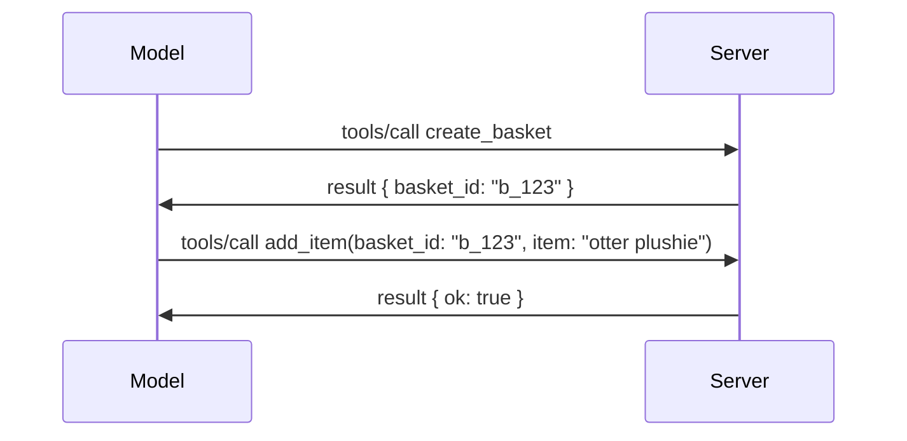

# MCP में क्या बदल रहा है: 2026-07-28 रिलीज़ उम्मीदवार

> **स्थिति:** रिलीज़ उम्मीदवार। `2026-07-28` विनिर्देशन लेखन के समय अंतिम नहीं है। इसे 21 मई 2026 को घोषणा की गई थी, और इसे 28 जुलाई 2026 को जारी करने का कार्यक्रम है। इस पाठ में सब कुछ रिलीज़ उम्मीदवार का वर्णन करता है; इसके खिलाफ निर्माण करने से पहले नवीनतम स्थिति के लिए [ड्राफ्ट विनिर्देशन](https://modelcontextprotocol.io/specification/draft) और इसके [चेंजलॉग](https://modelcontextprotocol.io/specification/draft/changelog) की जाँच करें। इस पाठ्यक्रम के बाकी हिस्से वर्तमान स्थिर रिलीज़, **MCP विनिर्देशन 2025-11-25** के खिलाफ लिखा गया है, और `2026-07-28` के आने पर अपडेट किया जाएगा।

## अवलोकन

`2026-07-28` MCP का सबसे बड़ा संशोधन है जब से इसकी शुरुआत हुई। छह विनिर्देशन संवर्धन प्रस्ताव (SEPs) प्रोटोकॉल-स्तर सत्रों को हटाते हैं और ट्रांसपोर्ट लेयर पर MCP को स्टेटलेस बनाते हैं, एक्सटेंशंस पहली कक्षा की, संस्करण-युक्त विधि बन जाते हैं, और कई विशेषताएँ जिन्हें आपने इस पाठ्यक्रम में पहले सीखा (रूट्स, सैंपलिंग, लॉगिंग) एक नए जीवनचक्र नीति के तहत अप्रचलित घोषित की जाती हैं। यह पाठ सारांश करता है कि क्या बदल रहा है, यह क्यों महत्वपूर्ण है, और इसका अर्थ आपके द्वारा पहले से लिखे गए `2025-11-25` कोड के लिए क्या है।

स्रोत: [The 2026-07-28 MCP Specification Release Candidate](https://blog.modelcontextprotocol.io/posts/2026-07-28-release-candidate/) (Model Context Protocol ब्लॉग, डेविड सोरिया पर्रा और डेन डेलिमार्स्की)।

## सीखने के उद्देश्य

इस पाठ के अंत तक, आप सक्षम होंगे:

- समझाएं कि MCP एक स्टेटलेस प्रोटोकॉल कोर की ओर क्यों बढ़ रहा है और यह क्षैतिज रूप से स्केल किए गए परिनियोजनों के लिए कौन सी समस्या हल करता है।
- वर्णन करें कि `initialize`/`initialized` हैंडशेक और `Mcp-Session-Id` हेडर को कैसे प्रतिस्थापित किया गया है।
- नए `Mcp-Method` और `Mcp-Name` हेडर्स और `ttlMs`/`cacheScope` कैशिंग मेटाडेटा की पहचान करें।
- एक्सटेंशंस फ्रेमवर्क को पहचानें और इस रिलीज़ के साथ भेजे जाने वाले दो एक्सटेंशंस: MCP ऐप्स और टास्क।
- छह प्राधिकरण SEPs को सूचीबद्ध करें जो OAuth 2.0 / OIDC संरेखण को मजबूत करते हैं।
- पहचानें कि कौन सी कोर विशेषताएँ (रूट्स, सैंपलिंग, लॉगिंग) अब अप्रचलित हैं, और इसका व्यवहार में क्या अर्थ है।
- टूल `inputSchema`/`outputSchema` के लिए Full JSON Schema 2020-12 परिवर्तन समझाएं।

## एक स्टेटलेस प्रोटोकॉल

मुख्य परिवर्तन: MCP प्रोटोकॉल लेयर पर स्टेटलेस हो जाता है।

### पहले (2025-11-25): सत्र आपको एक सर्वर इंस्टेंस से जोड़ते हैं

Streamable HTTP पर एक टूल कॉल करना `initialize` हैंडशेक के साथ शुरू होता है। सर्वर एक `Mcp-Session-Id` हेडर के साथ जवाब देता है जिसे हर बाद की अनुरोध में ले जाना आवश्यक होता है:

```http
POST /mcp HTTP/1.1
Mcp-Session-Id: 1868a90c-3a3f-4f5b
Content-Type: application/json

{"jsonrpc":"2.0","id":2,"method":"tools/call",
 "params":{"name":"search","arguments":{"q":"otters"}}}
```

क्योंकि सत्र उस सर्वर इंस्टेंस से जुड़ा होता है जिसने इसे जारी किया, क्षैतिज रूप से स्केल किए गए परिनियोजन में लोड बैलेंसर पर **चिपकने वाली रूटिंग** और इंस्टेंस के बीच एक **साझा सत्र स्टोर** की आवश्यकता होती है।

### बाद में (2026-07-28): हर अनुरोध स्व-सम्पूर्ण होता है

```http
POST /mcp HTTP/1.1
MCP-Protocol-Version: 2026-07-28
Mcp-Method: tools/call
Mcp-Name: search
Content-Type: application/json

{"jsonrpc":"2.0","id":1,"method":"tools/call",
 "params":{"name":"search","arguments":{"q":"otters"},
           "_meta":{"io.modelcontextprotocol/clientInfo":{"name":"my-app","version":"1.0"}}}}
```

कोई भी सर्वर इंस्टेंस इस अनुरोध को संभाल सकता है। मुख्य बदलाव:

- **`initialize`/`initialized` हैंडशेक हटाया गया है** ([SEP-2575](https://github.com/modelcontextprotocol/modelcontextprotocol/pull/2575))। प्रोटोकॉल संस्करण, क्लाइंट जानकारी, और क्लाइंट क्षमताएँ हर अनुरोध में `_meta` में चली जाती हैं। एक नया `server/discover` मेथड क्लाइंट को सर्वर क्षमताएँ पहले से प्राप्त करने देता है।
- **`Mcp-Session-Id` हेडर और प्रोटोकॉल-स्तर सत्र निकाल दिए गए हैं** ([SEP-2567](https://github.com/modelcontextprotocol/modelcontextprotocol/pull/2567))। प्रोटोकॉल लेयर पर चिपकने वाली रूटिंग और साझा सत्र स्टोर अब आवश्यक नहीं हैं।

### स्टेटलेस प्रोटोकॉल, स्टेटफुल एप्लिकेशन

प्रोटोकॉल-स्तर सत्र हटाने का अर्थ यह नहीं है कि आपका सर्वर स्टेटफुल नहीं हो सकता। अनुशंसित पैटर्न वही है जो HTTP APIs ने हमेशा उपयोग किया है: एक स्पष्ट हैंडल (जैसे `basket_id`, `browser_id`) एक टूल कॉल से बनाएं, और मॉडल उस हैंडल को बाद के कॉल में एक सामान्य आर्गुमेंट के रूप में वापस पास करे।



इससे राज्य मॉडल के लिए स्पष्ट और समझने योग्य हो जाता है बजाय ट्रांसपोर्ट मेटाडेटा में छिपाने के, और कोई भी सर्वर इंस्टेंस कोई भी कॉल संभाल सकता है।

### सर्वर-से-क्लाइंट अनुरोध, पुनर्गठित

स्टेटलेस प्रोटोकॉल को अभी भी सर्वर को कॉल के बीच में क्लाइंट से कुछ पूछने का तरीका चाहिए (जैसे, एक elicitation prompt):

- **सर्वर-प्रेरित अनुरोध केवल तब जारी किए जा सकते हैं जब सर्वर सक्रिय रूप से क्लाइंट अनुरोध को संसाधित कर रहा हो** ([SEP-2260](https://github.com/modelcontextprotocol/modelcontextprotocol/pull/2260)) — पहले यह एक अनुशंसा थी, अब अनिवार्य। उपयोगकर्ता को अचानक से कहीं नहीं पूछा जाता।
- **मल्टी राउंड-ट्रिप अनुरोध** ([SEP-2322](https://github.com/modelcontextprotocol/modelcontextprotocol/pull/2322)) खुले SSE स्ट्रीम को होल्ड रखने की जगह लेते हैं। इसके बजाय, सर्वर `InputRequiredResult` लौटाता है:

  ```json
  {
    "resultType": "inputRequired",
    "inputRequests": {
      "confirm": {
        "type": "elicitation",
        "message": "Delete 3 files?",
        "schema": { "type": "boolean" }
      }
    },
    "requestState": "eyJzdGVwIjoxLCJmaWxlcyI6WyJhIiwiYiIsImMiXX0="
  }
  ```

  क्लाइंट उत्तर एकत्र करता है और मूल कॉल को `inputResponses` के साथ पुनः जारी करता है साथ ही `requestState` echo के साथ। किसी भी सर्वर इंस्टेंस के लिए पुनः प्रयास लेना संभव है क्योंकि आवश्यक सब कुछ पेलोड में होता है।

### रूटेबल, कैश करने योग्य, ट्रेस करने योग्य

तीन छोटे बदलाव स्टेटलेस ट्रैफिक को संचालित करना आसान बनाते हैं:

- **Streamable HTTP पर `Mcp-Method` और `Mcp-Name` हेडर आवश्यक हैं** ([SEP-2243](https://github.com/modelcontextprotocol/modelcontextprotocol/pull/2243)), ताकि लोड बैलेंसर, गेटवे, और रेट लिमिटर JSON बॉडी की जाँच किए बिना ऑपरेशन के आधार पर रूट कर सकें। सर्वर उन अनुरोधों को अस्वीकार करते हैं जहां हेडर और बॉडी असंगत होते हैं।
- **`tools/list` और संसाधन पढ़ने के परिणाम `ttlMs` और `cacheScope` के साथ आते हैं** ([SEP-2549](https://github.com/modelcontextprotocol/modelcontextprotocol/pull/2549)), जो HTTP `Cache-Control` पर आधारित हैं। क्लाइंट जानते हैं कि एक सूची परिणाम कितनी देर तक ताज़ा रहता है और क्या इसे उपयोगकर्ताओं के बीच सुरक्षित रूप से साझा किया जा सकता है, बिना लंबी अवधि के SSE स्ट्रीम की आवश्यकता के।
- **W3C Trace Context प्रचार का विवरण `_meta` में दिया गया है** ([SEP-414](https://github.com/modelcontextprotocol/modelcontextprotocol/pull/414)), जिससे `traceparent`, `tracestate`, और `baggage` कुंजी नाम फिक्स होते हैं ताकि एक वितरित ट्रेस क्लाइंट SDK, MCP सर्वर और डाउनस्ट्रीम सिस्टम में एक [OpenTelemetry](https://opentelemetry.io/)-संगत बैकएंड में एक कॉल का अनुसरण कर सके।

## एक्सटेंशंस पहली कक्षा बन जाते हैं

एक्सटेंशंस `2025-11-25` में अनौपचारिक रूप से मौजूद थे। [SEP-2133](https://github.com/modelcontextprotocol/modelcontextprotocol/pull/2133) उन्हें औपचारिक करता है:

- एक्सटेंशंस रिवर्स-DNS IDs द्वारा पहचाने जाते हैं।
- इन्हें क्लाइंट और सर्वर क्षमताओं पर `extensions` मानचित्र के माध्यम से वार्ता किया जाता है।
- ये अपने स्वयं के `ext-*` रिपोजिटरीज़ में रहते हैं, प्रतिनिधि रखरखावकर्ताओं के साथ, और मूल विनिर्देशन से स्वतंत्र रूप से संस्करणित होते हैं।
- SEP प्रक्रिया में एक नया Extensions Track इन्हें प्रयोगात्मक से आधिकारिक तक ले जाने का मार्ग देता है।

इस रिलीज में दो आधिकारिक एक्सटेंशंस शामिल हैं।

### MCP ऐप्स: सर्वर-रेंडर की गई यूजर इंटरफेस

[MCP Apps](https://blog.modelcontextprotocol.io/posts/2026-01-26-mcp-apps/) ([SEP-1865](https://github.com/modelcontextprotocol/modelcontextprotocol/pull/1865)) सर्वरों को इंटरैक्टिव HTML इंटरफेस भेजने देता है जिन्हें होस्ट एक sandboxed iframe में रेंडर करते हैं। टूल अपने UI टेम्पलेट्स पहले से घोषित करते हैं ताकि होस्ट उन्हें प्रीफ़ेच, कैश, और सिक्योरिटी समीक्षा कर सकें। आपने पहले ही इसे [Lesson 15: MCP Apps](../03-GettingStarted/15-mcp-apps/README.md) में सीखा है — एक्सटेंशंस फ्रेमवर्क के तहत, MCP Apps अब औपचारिक रूप से एक एक्सटेंशन है न कि एक प्रयोगात्मक कोर फीचर।

### टास्क एक एक्सटेंशन बन था

टास्क `2025-11-25` में एक प्रयोगात्मक कोर फीचर के रूप में भेजे गए थे। उत्पादन उपयोग में इतना पुन:डिजाइन सामने आया कि इसका सही घर एक एक्सटेंशन है: [Tasks एक्सटेंशन](https://github.com/modelcontextprotocol/modelcontextprotocol/pull/2663) स्टेटलेस मॉडल के चारों ओर जीवनचक्र को फिर से आकार देता है — एक सर्वर टास्क हैंडल के साथ `tools/call` का उत्तर दे सकता है, और क्लाइंट इसे `tasks/get`, `tasks/update`, और `tasks/cancel` के साथ आगे बढ़ाता है। टास्क निर्माण सर्वर-निर्देशित होता है: क्लाइंट एक्सटेंशन की घोषणा करता है, और सर्वर तय करता है कि कब कॉल को टास्क के रूप में चलाना चाहिए। `tasks/list` पूरी तरह हटा दिया गया है क्योंकि इसे सत्रों के बिना सुरक्षित रूप से सीमित नहीं किया जा सकता।

> **स्थानांतरण नोट:** यदि आपने प्रयोगात्मक `2025-11-25` टास्क API को लागू किया है, तो आपको नए एक्सटेंशन जीवनचक्र में स्थानांतरण करना होगा — यह पिछली संगतता नहीं रखता।

## प्राधिकरण कड़ा करना

छह SEPs प्राधिकरण विनिर्देशन को कड़ा करते हैं ताकि यह वास्तविक OAuth 2.0 / OpenID Connect परिनियोजनों के साथ अधिक करीबी संरेखण करे:

| SEP | परिवर्तन |
|---|---|
| [SEP-2468](https://github.com/modelcontextprotocol/modelcontextprotocol/pull/2468) | क्लाइंट को प्राधिकरण प्रतिक्रियाओं पर `iss` पैरामीटर की [RFC 9207](https://www.rfc-editor.org/rfc/rfc9207) के अनुसार वैधता जांच करनी चाहिए, जो MCP के सिंगल-क्लाइंट, बहु-सर्वर पैटर्न में आम मिक्स-अप हमलों को कम करता है। भविष्य में कोई संस्करण `iss` गायब प्रतिक्रिया को अस्वीकार करना आवश्यक करेगा। |
| [SEP-837](https://github.com/modelcontextprotocol/modelcontextprotocol/pull/837) | क्लाइंट डायनेमिक क्लाइंट रजिस्ट्रेशन के दौरान अपना OpenID Connect `application_type` घोषित करते हैं, जिससे प्राधिकरण सर्वर डेस्कटॉप/CLI क्लाइंट को डिफ़ॉल्ट `"web"` सेट करना और उसके localhost रीडायरेक्ट URI को अस्वीकार करना से बचते हैं। |
| [SEP-2352](https://github.com/modelcontextprotocol/modelcontextprotocol/pull/2352) | क्लाइंट पंजीकृत क्रेडेंशियल को जारी करने वाले प्राधिकरण सर्वर के `issuer` से बांधते हैं और जब संसाधन प्राधिकरण सर्वरों के बीच माइग्रेट होता है तो पुनः पंजीकरण करते हैं। |
| [SEP-2207](https://github.com/modelcontextprotocol/modelcontextprotocol/pull/2207) | OpenID Connect-शैली के प्राधिकरण सर्वरों से रिफ्रेश टोकन अनुरोध करने का दस्तावेज। |
| [SEP-2350](https://github.com/modelcontextprotocol/modelcontextprotocol/pull/2350) | स्टेप-अप प्राधिकरण के दौरान स्कोप संचयन को स्पष्ट करता है। |
| [SEP-2351](https://github.com/modelcontextprotocol/modelcontextprotocol/pull/2351) | `.well-known` डिस्कवरी उपसर्ग को स्पष्ट करता है। |

यदि आप आज MCP के लिए प्राधिकरण सर्वर बना रहे हैं, तो अभी से प्राधिकरण प्रतिक्रियाओं पर `iss` देना शुरू करें — वर्तमान प्राधिकरण गाइडेंस के लिए देखें [02-Security](../02-Security/README.md) जिसे यह बनाएगा।

## रूट्स, सैंपलिंग, और लॉगिंग अप्रचलित हैं

नए [विशेषता जीवनचक्र नीति](https://github.com/modelcontextprotocol/modelcontextprotocol/pull/2577) ([SEP-2577](https://github.com/modelcontextprotocol/modelcontextprotocol/pull/2577)) के तहत, तीन कोर क्लाइंट प्रिमिटिव्स जिन्हें आपने [Core Concepts](./README.md#roots) में सीखा, **अप्रचलित** स्थिति पर जाते हैं:

| विशेषता | अनुशंसित प्रतिस्थापन |
|---|---|
| रूट्स | टूल पैरामीटर, संसाधन URI, या सर्वर कॉन्फ़िगरेशन |
| सैंपलिंग | LLM प्रदाता APIs के साथ प्रत्यक्ष एकीकरण |
| लॉगिंग | stdio ट्रांसपोर्ट के लिए `stderr`; संरचित निगरानी के लिए OpenTelemetry |

ये **केवल एनोटेशन-स्तर की अप्रचलित घोषणाएं** हैं: इस रिलीज़ और उसके बाद एक वर्ष में प्रकाशित हर विनिर्देशन संस्करण में मेथड्स, टाइप्स, और क्षमता फ्लैग काम करते रहेंगे। इन्हें पूरी तरह हटाने के लिए जीवनचक्र नीति के तहत एक अलग SEP की आवश्यकता होगी — इसलिए आज आपके मौजूदा [सैंपलिंग](../03-GettingStarted/14-sampling/README.md) उदाहरण टूटेंगे नहीं, लेकिन नए सर्वरों को उपरोक्त प्रतिस्थापन पैटर्न को प्राथमिकता देनी चाहिए।

## टूल्स के लिए Full JSON Schema 2020-12

टूल `inputSchema` और `outputSchema` पूर्ण [JSON Schema 2020-12](https://json-schema.org/draft/2020-12) पर लिफ्ट हो गए हैं ([SEP-2106](https://github.com/modelcontextprotocol/modelcontextprotocol/pull/2106)):

- इनपुट स्कीमाओं में अब भी `type: "object"` रूट प्रतिबंध है लेकिन अब संयोजन (`oneOf`, `anyOf`, `allOf`), स्थिति, और संदर्भ (`$ref`, `$defs`) की अनुमति है।
- आउटपुट स्कीमाओं पर कोई प्रतिबंध नहीं है, और `structuredContent` अब केवल ऑब्जेक्ट नहीं, किसी भी JSON मान हो सकता है।
- कार्यान्वयन को बाहरी `$ref` URIs का स्वत: संदर्भ नहीं करना चाहिए और स्कीमा गहराई और सत्यापन समय को सीमित करना चाहिए (यह एक डिनायल-ऑफ-सर्विस विचार है जब आप सर्वर-साइड स्कीमा सत्यापन करते हैं)।

अलग से, संसाधन न मिलने पर त्रुटि कोड MCP-विशिष्ट `-32002` से बदल कर JSON-RPC मानक `-32602` (Invalid Params) हो गया है ([SEP-2164](https://github.com/modelcontextprotocol/modelcontextprotocol/pull/2164))। यदि आपका क्लाइंट literal `-32002` मान के आधार पर मैच करता है, तो आपको इसे अपडेट करना होगा।

## प्रोटोकॉल यहाँ से कैसे विकसित होता है

यह रिलीज़ तोड़ने वाले बदलावों को शामिल करता है, जिसे MCP मेंटेनर्स भविष्य के लिए सामान्य बनाने का इरादा नहीं रखते। तीन गवर्नेंस SEPs इसका पुनरावृत्ति रोकने का प्रयास करते हैं:

- **विशेषता जीवनचक्र नीति** हर फीचर को सक्रिय → अप्रचलित → हटाए जाने वाला मार्ग देता है, जिसमें अप्रचलन और संभावित हटाने के बीच कम से कम बारह महीने का अंतर होता है।
- **एक्सटेंशंस फ्रेमवर्क** नए क्षमताओं को वैकल्पिक एक्सटेंशंस के रूप में भेजने देता है और वहां स्थिर होने तक लेकर जाता है, इसके बाद (यदि कभी) मूल विनिर्देशन में शामिल किया जाएगा।

- एक Standards Track SEP तब तक Final स्थिति तक नहीं पहुँच सकता जब तक कि एक मेल खाने वाला परिदृश्य [conformance suite](https://github.com/modelcontextprotocol/conformance) ([SEP-2484](https://github.com/modelcontextprotocol/modelcontextprotocol/pull/2484)) में शामिल नहीं हो जाता — वही सूट जिसके खिलाफ [SDK tier system](https://github.com/modelcontextprotocol/modelcontextprotocol/pull/1777) आधिकारिक SDKs का स्कोर करता है।

## रिलीज़ टाइमलाइन और सत्यापन

- रिलीज़ कैंडिडेट को 21 मई, 2026 को लॉक किया गया था।
- अंतिम विनिर्देश 28 जुलाई, 2026 के लिए निर्धारित है।
- इन दोनों के बीच का दस सप्ताह का समय SDK रखरखावकर्ताओं और क्लाइंट कार्यान्वयनकर्ताओं को असली वर्कलोड के खिलाफ परिवर्तनों का सत्यापन करने देता है; Tier 1 SDKs से अपेक्षा की जाती है कि वे इस विंडो के भीतर समर्थन भेजें [SDK tier system](https://modelcontextprotocol.io/docs/sdk) के तहत।
- बदलावों के पूरे सेट को [ड्राफ्ट विनिर्देश](https://modelcontextprotocol.io/specification/draft) और उसके [चेंजलॉग](https://modelcontextprotocol.io/specification/draft/changelog) में ट्रैक करें।

## इस पाठ्यक्रम के लिए इसका क्या मतलब है

इस कोर्स में अब तक आपने जो कुछ सीखा है, वह **2025-11-25** को लक्षित करता है, जो वर्तमान स्थिर विनिर्देश है जब तक कि `2026-07-28` जारी न हो। स्पष्ट रूप से:

- **सत्र और `initialize` हैंडशेक** (जो [Core Concepts](./README.md) और [Lesson 6: HTTP Streaming](../03-GettingStarted/06-http-streaming/README.md) में कवर किए गए हैं) आज जैसा दस्तावेजीकृत है वैसा ही काम करते हैं, लेकिन इन्हें उस स्टेटलेस रिक्वेस्ट मॉडल द्वारा बदल दिया जाएगा जब आप `2026-07-28`-संगत SDKs में अपग्रेड करेंगे।
- **Sampling और Roots** (जो [Core Concepts](./README.md) में भी कवर किए गए हैं) पूरी तरह से कार्यात्मक हैं लेकिन अप्रचलित हैं — नए डिज़ाइनों को ऊपर सूचीबद्ध प्रतिस्थापन पैटर्न को प्राथमिकता देनी चाहिए।
- **प्रयोगात्मक Tasks फीचर**, यदि आपने इसका उपयोग किया है, तो इसे Tasks एक्सटेंशन के नए लाइफसायकल में माइग्रेट करने की आवश्यकता होगी।
- **MCP ऐप्स** ([Lesson 15](../03-GettingStarted/15-mcp-apps/README.md)) व्यवहार में अप्रभावित हैं; यह केवल औपचारिक एक्सटेंशंस फ्रेमवर्क के अंतर्गत आ जाएगा।

## अतिरिक्त संसाधन

- [2026-07-28 MCP विनिर्देश रिलीज़ कैंडिडेट (ब्लॉग पोस्ट)](https://blog.modelcontextprotocol.io/posts/2026-07-28-release-candidate/)
- [MCP ट्रांसपोर्ट का भविष्य](https://blog.modelcontextprotocol.io/posts/2025-12-19-mcp-transport-future/)
- [MCP ड्राफ्ट विनिर्देश](https://modelcontextprotocol.io/specification/draft)
- [MCP ड्राफ्ट चेंजलॉग](https://modelcontextprotocol.io/specification/draft/changelog)
- [SEP दिशानिर्देश](https://modelcontextprotocol.io/community/sep-guidelines)
- [MCP SDK टियर सिस्टम](https://modelcontextprotocol.io/docs/sdk)

## अगले कदम

वापस जाएं [Core Concepts](./README.md) पर या जारी रखें [Security](../02-Security/README.md) की ओर यह देखने के लिए कि आज का `2025-11-25` मार्गदर्शन आने वाले संस्करणों के साथ कैसे जुड़ता है।

---

<!-- CO-OP TRANSLATOR DISCLAIMER START -->
**अस्वीकरण**:
इस दस्तावेज़ का अनुवाद AI अनुवाद सेवा [Co-op Translator](https://github.com/Azure/co-op-translator) का उपयोग करके किया गया है। जबकि हम सटीकता के लिए प्रयास करते हैं, कृपया ध्यान दें कि स्वचालित अनुवादों में त्रुटियाँ या अशुद्धियाँ हो सकती हैं। मूल दस्तावेज़ अपनी मूल भाषा में ही प्रामाणिक स्रोत माना जाना चाहिए। महत्वपूर्ण जानकारी के लिए, पेशेवर मानव अनुवाद की सिफारिश की जाती है। इस अनुवाद के उपयोग से उत्पन्न किसी भी गलतफहमी या गलत व्याख्या के लिए हम उत्तरदायी नहीं हैं।
<!-- CO-OP TRANSLATOR DISCLAIMER END -->