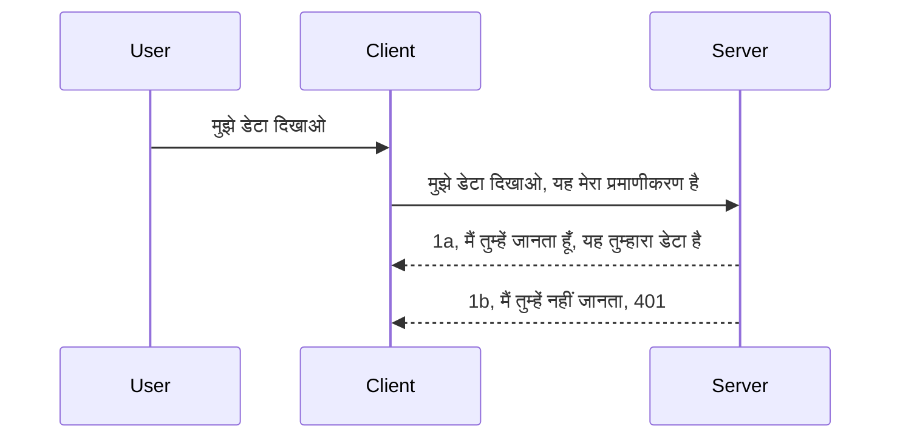

# सरल प्रमाणीकरण

MCP SDKs OAuth 2.1 के उपयोग का समर्थन करते हैं जो कि एक काफी जटिल प्रक्रिया है जिसमें ऑथ सर्वर, रिसोर्स सर्वर, क्रेडेंशियल पोस्ट करना, कोड प्राप्त करना, कोड को बीयरर टोकन में एक्सचेंज करना शामिल है जब तक कि आप अंततः अपने रिसोर्स डेटा को प्राप्त न कर सकें। यदि आप OAuth में अनजान हैं जो कि लागू करने के लिए एक शानदार चीज़ है, तो कुछ मूल स्तर के प्रमाणीकरण के साथ शुरू करना और बेहतर और बेहतर सुरक्षा की ओर बढ़ना एक अच्छा विचार है। इसीलिए यह अध्याय मौजूद है, ताकि आपको अधिक उन्नत प्रमाणीकरण के लिए तैयार किया जा सके।

## प्रमाणीकरण, हमारा मतलब क्या है?

प्रमाणीकरण का मतलब है authentication और authorization। विचार यह है कि हमें दो काम करने हैं:

- **प्रमाणीकरण**, जो यह पता लगाने की प्रक्रिया है कि क्या हम किसी व्यक्ति को हमारे घर में प्रवेश करने देते हैं, कि वे "यहाँ" होने के लिए सही अधिकार रखते हैं अर्थात हमारे रिसोर्स सर्वर पर पहुंच है जहाँ हमारे MCP Server की सुविधाएँ होती हैं।
- **अधिकार निर्धारण**, यह पता लगाने की प्रक्रिया है कि उपयोगकर्ता को इन विशिष्ट संसाधनों तक पहुंच होनी चाहिए या नहीं, उदाहरण के लिए ये आदेश या ये उत्पाद, या कि वे सामग्री पढ़ सकते हैं लेकिन हटा नहीं सकते हैं जैसा एक अन्य उदाहरण है।

## क्रेडेंशियल: हम सिस्टम को बताते हैं कि हम कौन हैं

अधिकतर वेब डेवलपर्स आमतौर पर सर्वर को एक क्रेडेंशियल प्रदान करने की सोचते हैं, आमतौर पर एक गुप्त जानकारी जो बताती है कि क्या उन्हें यहाँ "प्रमाणीकरण" के लिए अनुमति है। यह क्रेडेंशियल आमतौर पर उपयोगकर्ता नाम और पासवर्ड का base64 एन्कोडेड संस्करण या एक API की होती है जो विशिष्ट उपयोगकर्ता को पहचानती है।

इसे "Authorization" नामक हेडर के माध्यम से भेजा जाता है जैसे:

```json
{ "Authorization": "secret123" }
```

इसे आमतौर पर बेसिक प्रमाणीकरण कहा जाता है। पूरी प्रक्रिया इस प्रकार काम करती है:



अब जब हम इसे फلو की दृष्टि से समझ चुके हैं, तो इसे कैसे लागू करें? अधिकतर वेब सर्वरों में मिडलवेयर की अवधारणा होती है, एक ऐसा कोड का हिस्सा जो रिक्वेस्ट के भाग के रूप में चलता है जो क्रेडेंशियल्स को सत्यापित कर सकता है, और यदि क्रेडेंशियल वैध हैं तो रिक्वेस्ट को पास कर देता है। यदि क्रेडेंशियल वैध नहीं हैं तो आपको प्रमाणीकरण त्रुटि मिलती है। आइए देखें कि इसे कैसे लागू किया जा सकता है:

**Python**

```python
class AuthMiddleware(BaseHTTPMiddleware):
    async def dispatch(self, request, call_next):

        has_header = request.headers.get("Authorization")
        if not has_header:
            print("-> Missing Authorization header!")
            return Response(status_code=401, content="Unauthorized")

        if not valid_token(has_header):
            print("-> Invalid token!")
            return Response(status_code=403, content="Forbidden")

        print("Valid token, proceeding...")
       
        response = await call_next(request)
        # किसी भी ग्राहक हेडर को जोड़ें या प्रतिक्रिया में किसी भी प्रकार का परिवर्तन करें
        return response


starlette_app.add_middleware(CustomHeaderMiddleware)
```

यहाँ हमने:

- `AuthMiddleware` नामक एक मिडलवेयर बनाया है जहाँ इसका `dispatch` मेथड वेब सर्वर द्वारा कॉल किया जाता है।
- मिडलवेयर को वेब सर्वर में जोड़ा है:

    ```python
    starlette_app.add_middleware(AuthMiddleware)
    ```

- सत्यापन लॉजिक लिखा है जो जांचता है कि Authorization हेडर मौजूद है या नहीं और जो गुप्त जानकारी भेजी गई है वह वैध है या नहीं:

    ```python
    has_header = request.headers.get("Authorization")
    if not has_header:
        print("-> Missing Authorization header!")
        return Response(status_code=401, content="Unauthorized")

    if not valid_token(has_header):
        print("-> Invalid token!")
        return Response(status_code=403, content="Forbidden")
    ```

अगर गुप्त जानकारी मौजूद और वैध है तो हम `call_next` को कॉल करके रिक्वेस्ट को पास कर देते हैं और प्रतिक्रिया लौटाते हैं।

    ```python
    response = await call_next(request)
    # किसी भी कस्टमर हेडर को जोड़ें या प्रतिक्रिया में किसी तरह का परिवर्तन करें
    return response
    ```

इसका काम ऐसे है कि अगर सर्वर की ओर कोई वेब रिक्वेस्ट की जाती है तो मिडलवेयर कॉल होगा और अपने कार्यान्वयन के अनुसार या तो रिक्वेस्ट को पास कर देगा या ऐसा त्रुटि संदेश लौटाएगा जो दर्शाता है कि क्लाइंट को आगे बढ़ने की अनुमति नहीं है।

**TypeScript**

यहाँ हम लोकप्रिय फ्रेमवर्क Express का उपयोग कर एक मिडलवेयर बनाते हैं जो रिक्वेस्ट को MCP Server तक पहुँचने से पहले इंटरसेप्ट करता है। कोड इस प्रकार है:

```typescript
function isValid(secret) {
    return secret === "secret123";
}

app.use((req, res, next) => {
    // 1. प्राधिकरण हेडर मौजूद है?
    if(!req.headers["Authorization"]) {
        res.status(401).send('Unauthorized');
    }
    
    let token = req.headers["Authorization"];

    // 2. वैधता की जांच करें।
    if(!isValid(token)) {
        res.status(403).send('Forbidden');
    }

   
    console.log('Middleware executed');
    // 3. अनुरोध को अनुरोध पाइपलाइन के अगले चरण में भेजता है।
    next();
});
```

इस कोड में हम:

1. सबसे पहले जांचते हैं कि Authorization हेडर मौजूद है या नहीं, यदि नहीं है, तो 401 त्रुटि भेजते हैं।
2. सुनिश्चित करते हैं कि क्रेडेंशियल/टोकन वैध है, यदि नहीं तो 403 त्रुटि भेजते हैं।
3. अंत में रिक्वेस्ट पाइपलाइन में रिक्वेस्ट को पास करते हैं और मांगी गई संसाधन लौटाते हैं।

## अभ्यास: प्रमाणीकरण लागू करें

आइए अपनी जानकारी लेकर इसे लागू करने की कोशिश करें। योजना इस प्रकार है:

सर्वर

- एक वेब सर्वर और MCP इंस्टेंस बनाया जाएगा।
- सर्वर के लिए एक मिडलवेयर लागू करें।

क्लाइंट

- क्रेडेंशियल के साथ वेब रिक्वेस्ट भेजें, हेडर के माध्यम से।

### -1- एक वेब सर्वर और MCP इंस्टेंस बनाएं

> **आगे देखते हुए:** नीचे दिया गया TypeScript उदाहरण HTTP ट्रांसपोर्ट्स को `mcp-session-id` के द्वारा की जाने वाली `transports` मैप में ट्रैक करता है, जैसा कि **MCP स्पेसिफिकेशन 2025-11-25** में है। `2026-07-28` रिलीज कैंडिडेट से `initialize` हैंडशेक और सेशन ID पूरी तरह हटा दी गई है, इसलिए यह प्रति-सेशन ट्रांसपोर्ट मैप स्टेटलेस, स्व-समाहित रिक्वेस्ट्स के पक्ष में समाप्त हो जाएगी। देखें [MCP में क्या बदल रहा है: 2026-07-28 रिलीज कैंडिडेट](../../01-CoreConcepts/mcp-2026-07-28-release-candidate.md)।

हमारे पहले चरण में, हमें वेब सर्वर इंस्टेंस और MCP सर्वर बनाना होगा।

**Python**

यहाँ हम एक MCP सर्वर इंस्टेंस बनाते हैं, एक starlette वेब ऐप बनाते हैं और इसे uvicorn के साथ होस्ट करते हैं।

```python
# MCP सर्वर बना रहा है

app = FastMCP(
    name="MCP Resource Server",
    instructions="Resource Server that validates tokens via Authorization Server introspection",
    host=settings["host"],
    port=settings["port"],
    debug=True
)

# starlette वेब ऐप बना रहा है
starlette_app = app.streamable_http_app()

# uvicorn के माध्यम से ऐप को सर्व कर रहा है
async def run(starlette_app):
    import uvicorn
    config = uvicorn.Config(
            starlette_app,
            host=app.settings.host,
            port=app.settings.port,
            log_level=app.settings.log_level.lower(),
        )
    server = uvicorn.Server(config)
    await server.serve()

run(starlette_app)
```

इस कोड में हमने:

- MCP सर्वर बनाया।
- MCP सर्वर से starlette वेब ऐप, `app.streamable_http_app()` बनाया।
- uvicorn `server.serve()` का उपयोग करके वेब ऐप को होस्ट और सर्व किया।

**TypeScript**

यहाँ हम MCP सर्वर का इंस्टेंस बनाते हैं।

```typescript
const server = new McpServer({
      name: "example-server",
      version: "1.0.0"
    });

    // ... सर्वर संसाधन, उपकरण, और प्रॉम्प्ट सेट करें ...
```

यह MCP Server निर्माण हमारे POST /mcp रूट डिफिनिशन के अंदर होना चाहिए, इसलिए ऊपर दिया कोड इस प्रकार ले चलें:

```typescript
import express from "express";
import { randomUUID } from "node:crypto";
import { McpServer } from "@modelcontextprotocol/sdk/server/mcp.js";
import { StreamableHTTPServerTransport } from "@modelcontextprotocol/sdk/server/streamableHttp.js";
import { isInitializeRequest } from "@modelcontextprotocol/sdk/types.js"

const app = express();
app.use(express.json());

// सत्र आईडी द्वारा ट्रांसपोर्ट्स को स्टोर करने का मैप
const transports: { [sessionId: string]: StreamableHTTPServerTransport } = {};

// क्लाइंट-से-सर्वर संचार के लिए POST अनुरोधों को संभालें
app.post('/mcp', async (req, res) => {
  // अस्तित्व में सत्र आईडी की जांच करें
  const sessionId = req.headers['mcp-session-id'] as string | undefined;
  let transport: StreamableHTTPServerTransport;

  if (sessionId && transports[sessionId]) {
    // मौजूदा ट्रांसपोर्ट का पुन: उपयोग करें
    transport = transports[sessionId];
  } else if (!sessionId && isInitializeRequest(req.body)) {
    // नया प्रारंभिक अनुरोध
    transport = new StreamableHTTPServerTransport({
      sessionIdGenerator: () => randomUUID(),
      onsessioninitialized: (sessionId) => {
        // सत्र आईडी द्वारा ट्रांसपोर्ट स्टोर करें
        transports[sessionId] = transport;
      },
      // DNS रीबाइंडिंग सुरक्षा पिछड़ेपन संगतता के लिए डिफ़ॉल्ट रूप से अक्षम है। यदि आप यह सर्वर
      // स्थानीय रूप से चला रहे हैं, तो सुनिश्चित करें कि सेट करें:
      // enableDnsRebindingProtection: true,
      // allowedHosts: ['127.0.0.1'],
    });

    // बंद होने पर ट्रांसपोर्ट साफ़ करें
    transport.onclose = () => {
      if (transport.sessionId) {
        delete transports[transport.sessionId];
      }
    };
    const server = new McpServer({
      name: "example-server",
      version: "1.0.0"
    });

    // ... सर्वर संसाधनों, उपकरणों, और प्रॉम्प्ट्स को सेट करें ...

    // MCP सर्वर से कनेक्ट करें
    await server.connect(transport);
  } else {
    // अमान्य अनुरोध
    res.status(400).json({
      jsonrpc: '2.0',
      error: {
        code: -32000,
        message: 'Bad Request: No valid session ID provided',
      },
      id: null,
    });
    return;
  }

  // अनुरोध को संभालें
  await transport.handleRequest(req, res, req.body);
});

// GET और DELETE अनुरोधों के लिए पुन: प्रयोज्य हैंडलर
const handleSessionRequest = async (req: express.Request, res: express.Response) => {
  const sessionId = req.headers['mcp-session-id'] as string | undefined;
  if (!sessionId || !transports[sessionId]) {
    res.status(400).send('Invalid or missing session ID');
    return;
  }
  
  const transport = transports[sessionId];
  await transport.handleRequest(req, res);
};

// सर्वर-से-क्लाइंट सूचनाओं के लिए GET अनुरोधों को SSE के माध्यम से संभालें
app.get('/mcp', handleSessionRequest);

// सत्र समापन के लिए DELETE अनुरोधों को संभालें
app.delete('/mcp', handleSessionRequest);

app.listen(3000);
```

अब आप देख सकते हैं कि MCP Server का निर्माण `app.post("/mcp")` के भीतर किया गया।

आइए अगले चरण पर बढ़ें, मिडलवेयर बनाएं जिससे हम आ रहे क्रेडेंशियल की जांच कर सकें।

### -2- सर्वर के लिए मिडलवेयर लागू करें

अब मिडलवेयर की बारी है। यहाँ हम एक मिडलवेयर बनाएंगे जो `Authorization` हेडर में क्रेडेंशियल देखता है और उसे मान्य करता है। यदि स्वीकार्य हो तो रिक्वेस्ट वह करेगा जो आवश्यक हो (जैसे टूल्स की सूची दिखाना, संसाधन पढ़ना या क्लाइंट द्वारा मांगी गई कोई MCP सुविधा)।

**Python**

मिडलवेयर बनाने के लिए, हमें `BaseHTTPMiddleware` से विरासत में मिली एक क्लास बनानी होगी। दो महत्वपूर्ण हिस्से हैं:

- रिक्वेस्ट `request`, जिससे हेडर जानकारी पढ़ती है।
- `call_next` कॉलबैक जिसे तब कॉल करना है जब क्लाइंट एक स्वीकार्य क्रेडेंशियल लाता है।

पहले, हमें वह स्थिति संभालनी है जब `Authorization` हेडर गायब हो:

```python
has_header = request.headers.get("Authorization")

# कोई हेडर मौजूद नहीं है, 401 के साथ असफल हो जाएं, अन्यथा आगे बढ़ें।
if not has_header:
    print("-> Missing Authorization header!")
    return Response(status_code=401, content="Unauthorized")
```

यहाँ हम 401 unauthorized संदेश भेजते हैं क्योंकि क्लाइंट प्रमाणीकरण विफल कर रहा है।

अगला, यदि क्रेडेंशियल सबमिट किया गया है, तो हमें इसकी वैधता जांचनी होगी:

```python
 if not valid_token(has_header):
    print("-> Invalid token!")
    return Response(status_code=403, content="Forbidden")
```

ऊपर देखिए कि 403 forbidden संदेश कैसे भेजा गया है। चलिए पूरा मिडलवेयर देखें जो ऊपर वर्णित सब कुछ लागू करता है:

```python
class AuthMiddleware(BaseHTTPMiddleware):
    async def dispatch(self, request, call_next):

        has_header = request.headers.get("Authorization")
        if not has_header:
            print("-> Missing Authorization header!")
            return Response(status_code=401, content="Unauthorized")

        if not valid_token(has_header):
            print("-> Invalid token!")
            return Response(status_code=403, content="Forbidden")

        print("Valid token, proceeding...")
        print(f"-> Received {request.method} {request.url}")
        response = await call_next(request)
        response.headers['Custom'] = 'Example'
        return response

```

शानदार, लेकिन `valid_token` फंक्शन के बारे में क्या? यह नीचे है:

```python
# उत्पादन के लिए उपयोग न करें - इसे सुधारें !!
def valid_token(token: str) -> bool:
    # "Bearer " उपसर्ग को हटाएं
    if token.startswith("Bearer "):
        token = token[7:]
        return token == "secret-token"
    return False
```

इसे स्पष्ट रूप से सुधारने की आवश्यकता है।

IMPORTANT: आपको ऐसा रहस्य कोड में कभी नहीं रखना चाहिए। आदर्श रूप से आप तुलना करने के लिए मान किसी डेटा स्रोत से या IDP (identity service provider) से प्राप्त करें या बेहतर यह है कि IDP स्वयं सत्यापन करे।

**TypeScript**

Express के साथ इसे लागू करने के लिए, हमें `use` मेथड कॉल करना होगा जो मिडलवेयर फंक्शन लेती है।

हमें:

- रिक्वेस्ट वेरिएबल के साथ इंटरैक्ट करना है ताकि `Authorization` प्रॉपर्टी में पास किया गया क्रेडेंशियल जांचा जा सके।
- क्रेडेंशियल का सत्यापन करना है, यदि मैना हो तो रिक्वेस्ट को जारी रखने देना और क्लाइंट की MCP रिक्वेस्ट को वह करने देना जो आवश्यक हो (जैसे टूल्स की सूची दिखाना, संसाधन पढ़ना या MCP से संबंधित अन्य कोई चीज)।

यहाँ, हम देख रहे हैं कि क्या `Authorization` हेडर मौजूद है, और यदि नहीं है, तो हम रिक्वेस्ट को आगे नहीं जाने देते:

```typescript
if(!req.headers["authorization"]) {
    res.status(401).send('Unauthorized');
    return;
}
```

यदि हेडर शुरू में भेजा ही नहीं गया है, तो आपको 401 मिलता है।

अगला, हम जांचते हैं कि क्रेडेंशियल वैध है या नहीं, यदि नहीं तो हम फिर से रिक्वेस्ट रोकते हैं लेकिन थोड़े अलग संदेश के साथ:

```typescript
if(!isValid(token)) {
    res.status(403).send('Forbidden');
    return;
} 
```

अब आप 403 त्रुटि प्राप्त करते हैं।

यहाँ पूरा कोड है:

```typescript
app.use((req, res, next) => {
    console.log('Request received:', req.method, req.url, req.headers);
    console.log('Headers:', req.headers["authorization"]);
    if(!req.headers["authorization"]) {
        res.status(401).send('Unauthorized');
        return;
    }
    
    let token = req.headers["authorization"];

    if(!isValid(token)) {
        res.status(403).send('Forbidden');
        return;
    }  

    console.log('Middleware executed');
    next();
});
```

हमने वेब सर्वर को इस प्रकार सेट किया है कि वह मिडलवेयर के माध्यम से क्लाइंट द्वारा भेजे गए क्रेडेंशियल की जांच करता है। क्लाइंट खुद कैसा होगा?

### -3- हेडर के माध्यम से क्रेडेंशियल के साथ वेब रिक्वेस्ट भेजें

हमें सुनिश्चित करना होगा कि क्लाइंट क्रेडेंशियल को हेडर द्वारा पास कर रहा है। क्योंकि हम MCP क्लाइंट का उपयोग करेंगे, हमें पता लगाना होगा कि यह कैसे किया जाता है।

**Python**

क्लाइंट के लिए, हमें इस प्रकार हेडर के साथ क्रेडेंशियल पास करना होगा:

```python
# मान को हार्डकोड न करें, इसे कम से कम एक पर्यावरण चर या अधिक सुरक्षित भंडारण में रखें
token = "secret-token"

async with streamablehttp_client(
        url = f"http://localhost:{port}/mcp",
        headers = {"Authorization": f"Bearer {token}"}
    ) as (
        read_stream,
        write_stream,
        session_callback,
    ):
        async with ClientSession(
            read_stream,
            write_stream
        ) as session:
            await session.initialize()
      
            # TODO, क्लाइंट में आप क्या करना चाहते हैं, जैसे टूल्स की सूची बनाना, टूल्स को कॉल करना आदि।
```

देखें कि हमने `headers` प्रॉपर्टी इस प्रकार भरी है ` headers = {"Authorization": f"Bearer {token}"}`.

**TypeScript**

इसे हम दो चरणों में हल कर सकते हैं:

1. अपने क्रेडेंशियल के साथ एक कॉन्फ़िगरेशन ऑब्जेक्ट भरें।
2. इस कॉन्फ़िगरेशन ऑब्जेक्ट को ट्रांसपोर्ट को पास करें।

```typescript

// मान को सीधे कोड में न लिखें जैसा कि यहां दिखाया गया है। कम से कम इसे एक एन्वायरनमेंट वेरियेबल के रूप में रखें और विकास मोड में dotenv जैसी चीज़ का उपयोग करें।
let token = "secret123"

// एक क्लाइंट ट्रांसपोर्ट विकल्प ऑब्जेक्ट परिभाषित करें
let options: StreamableHTTPClientTransportOptions = {
  sessionId: sessionId,
  requestInit: {
    headers: {
      "Authorization": "secret123"
    }
  }
};

// विकल्प ऑब्जेक्ट को ट्रांसपोर्ट में पास करें
async function main() {
   const transport = new StreamableHTTPClientTransport(
      new URL(serverUrl),
      options
   );
```

यहां आप देखेंगे कि हमें एक `options` ऑब्जेक्ट बनाना पड़ा और अपने हेडर्स को `requestInit` प्रॉपर्टी के अंतर्गत रखना पड़ा।

IMPORTANT: इसे बेहतर कैसे बनाएं? वर्तमान कार्यान्वयन में कुछ समस्याएं हैं। सबसे पहले, अगर आप क्रेडेंशियल इस तरह पास करते हैं तो यह जोखिम भरा है जब तक कि आपके पास कम से कम HTTPS न हो। तब भी क्रेडेंशियल चोरी हो सकता है इसलिए आपको ऐसा सिस्टम चाहिए जिसमें आप आसानी से टोकन रद्द कर सकें और अतिरिक्त जांचें कर सकें जैसे यह दुनिया के कहाँ से आ रहा है, क्या रिक्वेस्ट बहुत बार हो रही है (बॉट जैसा व्यवहार), सारांश में, बहुत सारी चिंताएँ हैं।

फिर भी, बहुत सरल API के लिए जहां आप नहीं चाहते कि कोई आपकी API को बिना प्रमाणीकरण के कॉल करे, जो हमने किया वह एक अच्छी शुरुआत है।

इसे ध्यान में रखते हुए, चलिए सुरक्षा को थोड़ा और मजबूत करते हैं एक मानकीकृत प्रारूप JSON Web Token, जिसे JWT या "JOT" टोकन भी कहा जाता है, का उपयोग करके।

## JSON वेब टोकन, JWT

तो, हम बहुत सरल क्रेडेंशियल भेजने से बेहतर करने की कोशिश कर रहे हैं। JWT अपनाने से हमें क्या तात्कालिक सुधार मिलता है?

- **सुरक्षा सुधार**। बेसिक ऑथ में आप यूज़रनेम और पासवर्ड को बार-बार base64 एन्कोडेड टोकन के रूप में (या API की के रूप में) भेजते हैं जो जोखिम बढ़ाता है। JWT के साथ आप अपना यूज़रनेम और पासवर्ड भेजते हैं और बदले में एक टोकन प्राप्त करते हैं, जो समयबद्ध भी होता है यानी यह समाप्त हो जाएगा। JWT आपको भूमिकाओं, स्कोप, और अनुमतियों के उपयोग से सूक्ष्म-ग्रेन वाली पहुंच नियंत्रण सरलता से करने देता है।
- **स्टेटलेसनेस और स्केलेबिलिटी**। JWT स्व-समाहित होते हैं, वे सभी उपयोगकर्ता जानकारी अपने साथ लेकर चलते हैं और सर्वर-साइड सेशन स्टोरेज की जरूरत समाप्त कर देते हैं। टोकन को स्थानीय स्तर पर भी मान्य किया जा सकता है।
- **इंटरऑपरेबिलिटी और फेडरेशन**। JWT Open ID Connect का केंद्र है और ज्ञात पहचान प्रदाताओं जैसे Entra ID, Google Identity, और Auth0 के साथ उपयोग किया जाता है। वे सिंगल साइन-ऑन और बहुत कुछ संभव बनाते हैं जिससे यह एंटरप्राइज-ग्रेड बन जाता है।
- **मॉड्यूलरिटी और लचीलापन**। JWT API गेटवे जैसे Azure API Management, NGINX आदि के साथ भी उपयोग किए जा सकते हैं। यह प्रमाणीकरण परिदृश्यों और सर्वर-से-सेवा संचार सहित नकल और प्रतिनिधित्व परिदृश्यों का समर्थन करता है।
- **प्रदर्शन और कैशिंग**। JWT डिकोडिंग के बाद कैश हो सकते हैं जिससे पार्सिंग की जरूरत कम हो जाती है। यह विशेषत: उच्च-ट्रैफ़िक ऐप्स के लिए throughput सुधारता है और आपकी चुनी हुई बुनियादी ढांचे पर लोड कम करता है।
- **उन्नत विशेषताएँ**। यह introspection (सर्वर पर वैधता जांच) और revocation (टोकन को अमान्य बनाना) का भी समर्थन करता है।

इन सभी लाभों के साथ, आइए देखें कि कैसे हम अपने कार्यान्वयन को अगले स्तर पर ले जा सकते हैं।

## बेसिक ऑथ को JWT में बदलना

तो, उच्च स्तरीय स्तर पर हमें जिन बदलावों की आवश्यकता है वे हैं:

- **JWT टोकन बनाना सीखें** और इसे क्लाइंट से सर्वर तक भेजने के लिए तैयार करें।
- **JWT टोकन का सत्यापन करें**, और यदि वैध हो तो क्लाइंट को हमारे संसाधन दें।
- **सुरक्षित टोकन भंडारण**। इस टोकन को कैसे संग्रहीत करें।
- **रूट्स की सुरक्षा करें**। हमें रूट्स और हमारे मामले में विशिष्ट MCP सुविधाओं की सुरक्षा करनी है।
- **रिफ्रेश टोकन जोड़ें**। सुनिश्चित करें कि हम छोटे जीवनकाल वाले टोकन बनाएं लेकिन लंबे जीवनकाल वाले रिफ्रेश टोकन हों जो पुराने टोकन समाप्त हो गए हों तो नए टोकन प्राप्त करने के लिए इस्तेमाल हो सकें। एक रिफ्रेश एंडपॉइंट और रोटेशन रणनीति भी सुनिश्चित करें।

### -1- JWT टोकन बनाएं

सबसे पहले, JWT टोकन के निम्न भाग होते हैं:

- **हेडर**, उपयोग की गई एल्गोरिदम और टोकन प्रकार।
- **पेलोड**, दावे जैसे sub (जिस उपयोगकर्ता या इकाई का टोकन प्रतिनिधित्व करता है। प्रमाणीकरण परिदृश्य में यह आमतौर पर उपयोगकर्ता ID होती है), exp (समय समाप्ति), role (भूमिका)
- **सिग्नेचर**, एक रहस्य या निजी कुंजी के साथ हस्ताक्षरित।

इसके लिए, हमें हेडर, पेलोड और एन्कोडेड टोकन बनाना होगा।

**Python**

```python

import jwt
import jwt
from jwt.exceptions import ExpiredSignatureError, InvalidTokenError
import datetime

# JWT को साइन करने के लिए उपयोग किया गया गुप्त कुंजी
secret_key = 'your-secret-key'

header = {
    "alg": "HS256",
    "typ": "JWT"
}

# उपयोगकर्ता जानकारी और उसके दावे और समाप्ति समय
payload = {
    "sub": "1234567890",               # विषय (उपयोगकर्ता ID)
    "name": "User Userson",                # कस्टम दावा
    "admin": True,                     # कस्टम दावा
    "iat": datetime.datetime.utcnow(),# जारी किया गया
    "exp": datetime.datetime.utcnow() + datetime.timedelta(hours=1)  # समाप्ति
}

# इसे एन्कोड करें
encoded_jwt = jwt.encode(payload, secret_key, algorithm="HS256", headers=header)
```

ऊपर दिए गए कोड में हमने:

- HS256 एल्गोरिदम का उपयोग करते हुए और प्रकार को JWT के रूप में परिभाषित करते हुए हेडर बनाया।
- ऐसा पेलोड बनाया जिसमें विषय या उपयोगकर्ता आईडी, उपयोगकर्ता नाम, भूमिका, जारी करने का समय और समाप्ति समय शामिल है जिससे समयबद्ध पहलू लागू होता है जैसा हमने पहले बताया।

**TypeScript**

यहाँ कुछ निर्भरताएँ होंगी जो हमें JWT टोकन बनाने में मदद करेंगी।

निर्भरताएँ

```sh

npm install jsonwebtoken
npm install --save-dev @types/jsonwebtoken
```

अब जब यह तैयार है तो चलिए हेडर, पेलोड बनाएं और उसके माध्यम से एन्कोडेड टोकन बनाएं।

```typescript
import jwt from 'jsonwebtoken';

const secretKey = 'your-secret-key'; // उत्पादन में env vars का उपयोग करें

// पेलोड को परिभाषित करें
const payload = {
  sub: '1234567890',
  name: 'User usersson',
  admin: true,
  iat: Math.floor(Date.now() / 1000), // जारी किया गया
  exp: Math.floor(Date.now() / 1000) + 60 * 60 // 1 घंटे में समाप्त हो जाता है
};

// हेडर को परिभाषित करें (वैकल्पिक, jsonwebtoken डिफ़ॉल्ट सेट करता है)
const header = {
  alg: 'HS256',
  typ: 'JWT'
};

// टोकन बनाएं
const token = jwt.sign(payload, secretKey, {
  algorithm: 'HS256',
  header: header
});

console.log('JWT:', token);
```

यह टोकन है:

HS256 का उपयोग करके हस्ताक्षरित
1 घंटे के लिए मान्य
दावे शामिल हैं जैसे sub, name, admin, iat, और exp।

### -2- टोकन का सत्यापन करें

हमें टोकन का सत्यापन भी करना होगा, यह कोई ऐसा काम है जो हमें सर्वर पर करना चाहिए ताकि यह सुनिश्चित किया जा सके कि क्लाइंट जो कुछ भेज रहा है वह वास्तव में वैध है। यहाँ कई जांचें हैं जिन्हें हमें करनी चाहिए, इसकी संरचना से लेकर इसकी वैधता तक। आपको अन्य जांच भी जोड़नी प्रोत्साहित की जाती हैं जैसे कि उपयोगकर्ता आपकी प्रणाली में है या नहीं आदि।

टोकन सत्यापन के लिए, हमें इसे डिकोड करना होगा ताकि हम इसे पढ़ सकें और फिर इसकी वैधता जांचना शुरू कर सकें:

**Python**

```python

# JWT को डिकोड करें और सत्यापित करें
try:
    decoded = jwt.decode(token, secret_key, algorithms=["HS256"])
    print("✅ Token is valid.")
    print("Decoded claims:")
    for key, value in decoded.items():
        print(f"  {key}: {value}")
except ExpiredSignatureError:
    print("❌ Token has expired.")
except InvalidTokenError as e:
    print(f"❌ Invalid token: {e}")

```


इस कोड में, हम टोकन, सीक्रेट की और चुने हुए एल्गोरिथ्म को इनपुट के रूप में उपयोग करते हुए `jwt.decode` को कॉल करते हैं। ध्यान दें कि हम कैसे एक try-catch संरचना का उपयोग करते हैं क्योंकि विफल सत्यापन के कारण एक त्रुटि उत्पन्न होती है।

**TypeScript**

यहां हमें टोकन का डिकोडेड संस्करण प्राप्त करने के लिए `jwt.verify` को कॉल करना होगा जिसे हम आगे विश्लेषण कर सकें। यदि यह कॉल विफल होता है, तो इसका मतलब है कि टोकन की संरचना गलत है या यह अब मान्य नहीं है।

```typescript

try {
  const decoded = jwt.verify(token, secretKey);
  console.log('Decoded Payload:', decoded);
} catch (err) {
  console.error('Token verification failed:', err);
}
```

नोट: जैसा कि पहले बताया गया है, हमें अतिरिक्त जांच करनी चाहिए यह सुनिश्चित करने के लिए कि यह टोकन हमारे सिस्टम में एक उपयोगकर्ता की ओर इशारा करता है और यह सुनिश्चित करें कि उपयोगकर्ता के पास वह अधिकार हैं जो वह दावा करता है।

अब, आइए भूमिका आधारित एक्सेस नियंत्रण, जिसे RBAC भी कहा जाता है, के बारे में देखें।

## भूमिका आधारित एक्सेस नियंत्रण जोड़ना

विचार यह है कि हम यह व्यक्त करना चाहते हैं कि विभिन्न भूमिकाओं के विभिन्न अनुमतियाँ होती हैं। उदाहरण के लिए, हम मानते हैं कि एक एडमिन सब कुछ कर सकता है, एक सामान्य उपयोगकर्ता पढ़/लिख सकता है और एक अतिथि केवल पढ़ सकता है। इसलिए, यहां कुछ संभावित अनुमति स्तर हैं:

- Admin.Write 
- User.Read
- Guest.Read

आइए देखें कि हम इसे मिडलवेयर के साथ कैसे लागू कर सकते हैं। मिडलवेयर को प्रति रूट के लिए और सभी रूट्स के लिए जोड़ा जा सकता है।

**Python**

```python
from starlette.middleware.base import BaseHTTPMiddleware
from starlette.responses import JSONResponse
import jwt

# कोड में सीक्रेट न रखें, जैसे कि यह केवल प्रदर्शन के लिए है। इसे किसी सुरक्षित स्थान से पढ़ें।
SECRET_KEY = "your-secret-key" # इसे इनवायरनमेंट वेरिएबल में रखें।
REQUIRED_PERMISSION = "User.Read"

class JWTPermissionMiddleware(BaseHTTPMiddleware):
    async def dispatch(self, request, call_next):
        auth_header = request.headers.get("Authorization")
        if not auth_header or not auth_header.startswith("Bearer "):
            return JSONResponse({"error": "Missing or invalid Authorization header"}, status_code=401)

        token = auth_header.split(" ")[1]
        try:
            decoded = jwt.decode(token, SECRET_KEY, algorithms=["HS256"])
        except jwt.ExpiredSignatureError:
            return JSONResponse({"error": "Token expired"}, status_code=401)
        except jwt.InvalidTokenError:
            return JSONResponse({"error": "Invalid token"}, status_code=401)

        permissions = decoded.get("permissions", [])
        if REQUIRED_PERMISSION not in permissions:
            return JSONResponse({"error": "Permission denied"}, status_code=403)

        request.state.user = decoded
        return await call_next(request)


```

इसे जोड़ने के कुछ अलग-अलग तरीके नीचे दिए गए हैं:

```python

# विकल्प 1: स्टारलेट ऐप का निर्माण करते समय मिडलवेयर जोड़ें
middleware = [
    Middleware(JWTPermissionMiddleware)
]

app = Starlette(routes=routes, middleware=middleware)

# विकल्प 2: स्टारलेट ऐप के पहले से बनाए जाने के बाद मिडलवेयर जोड़ें
starlette_app.add_middleware(JWTPermissionMiddleware)

# विकल्प 3: प्रति रूट मिडलवेयर जोड़ें
routes = [
    Route(
        "/mcp",
        endpoint=..., # हैंडलर
        middleware=[Middleware(JWTPermissionMiddleware)]
    )
]
```

**TypeScript**

हम `app.use` और एक मिडलवेयर का उपयोग कर सकते हैं जो सभी अनुरोधों के लिए चलेगा।

```typescript
app.use((req, res, next) => {
    console.log('Request received:', req.method, req.url, req.headers);
    console.log('Headers:', req.headers["authorization"]);

    // 1. जांचें कि ऑथराइजेशन हेडर भेजा गया है या नहीं

    if(!req.headers["authorization"]) {
        res.status(401).send('Unauthorized');
        return;
    }
    
    let token = req.headers["authorization"];

    // 2. जांचें कि टोकन वैध है या नहीं
    if(!isValid(token)) {
        res.status(403).send('Forbidden');
        return;
    }  

    // 3. जांचें कि टोकन उपयोगकर्ता हमारे सिस्टम में मौजूद है या नहीं
    if(!isExistingUser(token)) {
        res.status(403).send('Forbidden');
        console.log("User does not exist");
        return;
    }
    console.log("User exists");

    // 4. सत्यापित करें कि टोकन के पास सही अनुमतियां हैं
    if(!hasScopes(token, ["User.Read"])){
        res.status(403).send('Forbidden - insufficient scopes');
    }

    console.log("User has required scopes");

    console.log('Middleware executed');
    next();
});

```

हमारी मिडलवेयर क्या कर सकती है और क्या करनी चाहिए, इसके कई पहलू हैं, जैसे:

1. जाँच करें कि authorization हेडर मौजूद है या नहीं
2. जाँच करें कि टोकन मान्य है या नहीं, हम `isValid` कॉल करते हैं, जो हमने लिखा एक मेथड है जो JWT टोकन की अखंडता और वैधता जांचता है।
3. सत्यापित करें कि उपयोगकर्ता हमारे सिस्टम में मौजूद है, हमें इसे जांचना चाहिए।

   ```typescript
    // DB में उपयोगकर्ता
   const users = [
     "user1",
     "User usersson",
   ]

   function isExistingUser(token) {
     let decodedToken = verifyToken(token);

     // TODO, जांचें कि उपयोगकर्ता DB में मौजूद है या नहीं
     return users.includes(decodedToken?.name || "");
   }
   ```

   ऊपर, हमने एक बहुत सरल `users` सूची बनाई है, जो जाहिर तौर पर एक डेटाबेस में होनी चाहिए।

4. इसके अतिरिक्त, हमें यह भी जांचना चाहिए कि टोकन के पास सही अनुमतियाँ हैं।

   ```typescript
   if(!hasScopes(token, ["User.Read"])){
        res.status(403).send('Forbidden - insufficient scopes');
   }
   ```

   ऊपर इस मिडलवेयर कोड में, हम चेक करते हैं कि टोकन में User.Read अनुमति है या नहीं, अगर नहीं तो हम 403 त्रुटि भेजते हैं। नीचे `hasScopes` हेल्पर मेथड है।

   ```typescript
   function hasScopes(scope: string, requiredScopes: string[]) {
     let decodedToken = verifyToken(scope);
    return requiredScopes.every(scope => decodedToken?.scopes.includes(scope));
  }
   ```

Have a think which additional checks you should be doing, but these are the absolute minimum of checks you should be doing.

Using Express as a web framework is a common choice. There are helpers library when you use JWT so you can write less code.

- `express-jwt`, helper library that provides a middleware that helps decode your token.
- `express-jwt-permissions`, this provides a middleware `guard` that helps check if a certain permission is on the token.

Here's what these libraries can look like when used:

```typescript
const express = require('express');
const jwt = require('express-jwt');
const guard = require('express-jwt-permissions')();

const app = express();
const secretKey = 'your-secret-key'; // put this in env variable

// Decode JWT and attach to req.user
app.use(jwt({ secret: secretKey, algorithms: ['HS256'] }));

// Check for User.Read permission
app.use(guard.check('User.Read'));

// multiple permissions
// app.use(guard.check(['User.Read', 'Admin.Access']));

app.get('/protected', (req, res) => {
  res.json({ message: `Welcome ${req.user.name}` });
});

// Error handler
app.use((err, req, res, next) => {
  if (err.code === 'permission_denied') {
    return res.status(403).send('Forbidden');
  }
  next(err);
});

```

अब आपने देखा कि मिडलवेयर का उपयोग प्रमाणीकरण और प्राधिकरण दोनों के लिए कैसे किया जा सकता है, तो MCP क्या है, क्या यह प्रमाणीकरण का तरीका बदलता है? आइए अगले भाग में पता लगाएं।

### -3- MCP में RBAC जोड़ना

आपने अब तक देखा है कि आप मिडलवेयर के माध्यम से RBAC कैसे जोड़ सकते हैं, हालाँकि, MCP के लिए किसी भी MCP फीचर के लिए RBAC जोड़ना आसान नहीं है, तो हम क्या करते हैं? खैर, हमें इस तरह का कोड जोड़ना होगा जो चेक करे कि क्लाइंट के पास किसी विशेष टूल को कॉल करने के अधिकार हैं या नहीं:

आपके पास फीचर-विशेष RBAC लागू करने के कई विकल्प हैं, यहां कुछ हैं:

- प्रत्येक टूल, संसाधन, प्रॉम्प्ट के लिए एक जांच जोड़ें जहाँ आपको अनुमति स्तर की जांच करनी हो।

   **python**

   ```python
   @tool()
   def delete_product(id: int):
      try:
          check_permissions(role="Admin.Write", request)
      catch:
        pass # क्लाइंट प्रमाणीकरण विफल हुआ, प्रमाणीकरण त्रुटि उठाएं
   ```

   **typescript**

   ```typescript
   server.registerTool(
    "delete-product",
    {
      title: Delete a product",
      description: "Deletes a product",
      inputSchema: { id: z.number() }
    },
    async ({ id }) => {
      
      try {
        checkPermissions("Admin.Write", request);
        // करने के लिए, productService और remote entry को id भेजें
      } catch(Exception e) {
        console.log("Authorization error, you're not allowed");  
      }

      return {
        content: [{ type: "text", text: `Deletected product with id ${id}` }]
      };
    }
   );
   ```


- उन्नत सर्वर दृष्टिकोण और अनुरोध हैंडलर का उपयोग करें ताकि आपको जांच करने के लिए कम से कम स्थानों की आवश्यकता हो।

   **Python**

   ```python
   
   tool_permission = {
      "create_product": ["User.Write", "Admin.Write"],
      "delete_product": ["Admin.Write"]
   }

   def has_permission(user_permissions, required_permissions) -> bool:
      # user_permissions: उपयोगकर्ता के पास अनुमतियों की सूची
      # required_permissions: उपकरण के लिए आवश्यक अनुमतियों की सूची
      return any(perm in user_permissions for perm in required_permissions)

   @server.call_tool()
   async def handle_call_tool(
     name: str, arguments: dict[str, str] | None
   ) -> list[types.TextContent]:
    # मान लें कि request.user.permissions उपयोगकर्ता के लिए अनुमतियों की एक सूची है
     user_permissions = request.user.permissions
     required_permissions = tool_permission.get(name, [])
     if not has_permission(user_permissions, required_permissions):
        # त्रुटि उत्पन्न करें "आपके पास टूल {name} कॉल करने की अनुमति नहीं है"
        raise Exception(f"You don't have permission to call tool {name}")
     # जारी रखें और टूल कॉल करें
     # ...
   ```   
   

   **TypeScript**

   ```typescript
   function hasPermission(userPermissions: string[], requiredPermissions: string[]): boolean {
       if (!Array.isArray(userPermissions) || !Array.isArray(requiredPermissions)) return false;
       // यदि उपयोगकर्ता के पास कम से कम एक आवश्यक अनुमति है तो सत्य लौटाएं
       
       return requiredPermissions.some(perm => userPermissions.includes(perm));
   }
  
   server.setRequestHandler(CallToolRequestSchema, async (request) => {
      const { params: { name } } = request;
  
      let permissions = request.user.permissions;
  
      if (!hasPermission(permissions, toolPermissions[name])) {
         return new Error(`You don't have permission to call ${name}`);
      }
  
      // जारी रखें..
   });
   ```

   ध्यान दें, आपको यह सुनिश्चित करना होगा कि आपकी मिडलवेयर अनुरोध की user प्रॉपर्टी को डिकोडेड टोकन असाइन करे ताकि ऊपर दिया गया कोड सरल बने।

### संक्षेप में

अब जब हमने सामान्य रूप से और विशेष रूप से MCP के लिए RBAC को जोड़ने के तरीके पर चर्चा की, तो यह आपके लिए सुरक्षा को स्वयं लागू करने का समय है ताकि आप प्रस्तुत अवधारणाओं को अच्छी तरह समझ सकें।

## असाइनमेंट 1: बेसिक ऑथेंटिकेशन का उपयोग करके एक mcp सर्वर और mcp क्लाइंट बनाएं

यहां आप उन बातों को लागू करेंगे जो आपने हेडर्स के माध्यम से क्रेडेंशियल भेजने के संबंध में सीखी हैं।

## समाधान 1

[Solution 1](./code/basic/README.md)

## असाइनमेंट 2: असाइनमेंट 1 के समाधान को JWT का उपयोग करने के लिए अपग्रेड करें

पहला समाधान लें लेकिन इस बार, इसे बेहतर बनाएं।

बेसिक ऑथ की जगह अब JWT का उपयोग करें।

## समाधान 2

[Solution 2](./solution/jwt-solution/README.md)

## चुनौती

"MCP में RBAC जोड़ें" अनुभाग में वर्णित प्रति टूल RBAC जोड़ें।

## सारांश

आपको उम्मीद है कि आपने इस अध्याय में बहुत कुछ सीखा है, बिना सुरक्षा से लेकर बेसिक सुरक्षा तक, JWT तक और इसे MCP में कैसे जोड़ा जा सकता है।

हमने कस्टम JWTs के साथ एक मजबूत नींव बनाई है, लेकिन जब हम स्केल करते हैं, तो हम एक मानक-आधारित पहचान मॉडल की ओर बढ़ रहे हैं। Entra या Keycloak जैसे IdP को अपनाने से हम टोकन जारी करने, सत्यापन और जीवनचक्र प्रबंधन को एक विश्वसनीय प्लेटफ़ॉर्म को सौंप सकते हैं — जिससे हम ऐप लॉजिक और उपयोगकर्ता अनुभव पर ध्यान केंद्रित कर सकें।

इसके लिए, हमारे पास एक और [उन्नत अध्याय Entra पर](../../05-AdvancedTopics/mcp-security-entra/README.md) है

## आगे क्या है

- अगला: [MCP होस्ट्स सेट अप करना](../12-mcp-hosts/README.md)

---

<!-- CO-OP TRANSLATOR DISCLAIMER START -->
**अस्वीकरण**:
इस दस्तावेज़ का अनुवाद AI अनुवाद सेवा [Co-op Translator](https://github.com/Azure/co-op-translator) का उपयोग करके किया गया है। जबकि हम सटीकता के लिए प्रयास करते हैं, कृपया ध्यान दें कि स्वचालित अनुवादों में त्रुटियाँ या अशुद्धियाँ हो सकती हैं। मूल दस्तावेज़ अपनी मूल भाषा में ही प्रामाणिक स्रोत माना जाना चाहिए। महत्वपूर्ण जानकारी के लिए, पेशेवर मानव अनुवाद की सिफारिश की जाती है। इस अनुवाद के उपयोग से उत्पन्न किसी भी गलतफहमी या गलत व्याख्या के लिए हम उत्तरदायी नहीं हैं।
<!-- CO-OP TRANSLATOR DISCLAIMER END -->