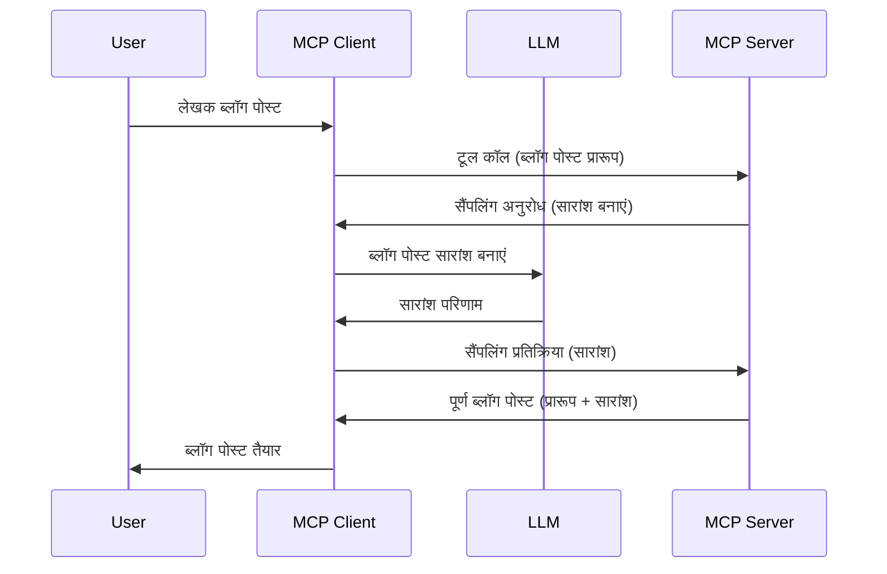

# सैंपलिंग - क्लाइंट को फीचर्स सौंपना

> **अस्थायीकरण सूचना:** `2026-07-28` MCP विनिर्देशन रिलीज उम्मीदवार सैंपलिंग को LLM प्रदाता APIs के साथ सीधे एकीकरण के पक्ष में अस्थायी घोषित करता है। सैंपलिंग `2025-11-25` में और किसी भी औपचारिक अस्थायीकरण के बाद कम से कम एक साल तक काम करता रहेगा, इसलिए इस पाठ में सब कुछ वैध है — लेकिन नए सर्वर डिज़ाइन को प्रतिस्थापन पैटर्न पर विचार करना चाहिए। देखें [MCP में क्या बदल रहा है: 2026-07-28 रिलीज उम्मीदवार](../../01-CoreConcepts/mcp-2026-07-28-release-candidate.md)।

कभी-कभी, आपको MCP क्लाइंट और MCP सर्वर को एक सामान्य लक्ष्य प्राप्त करने के लिए सहयोग करना होता है। आपकी ऐसी स्थिति हो सकती है जहाँ सर्वर को क्लाइंट पर मौजूद LLM की मदद की जरूरत हो। इस स्थिति के लिए, सैंपलिंग का उपयोग करना चाहिए।

आइए कुछ उपयोग मामलों का पता लगाएं और सैंपलिंग से संबंधित समाधान कैसे बनाएं।

## अवलोकन

इस पाठ में, हम बताएंगे कि सैंपलिंग कब और कहाँ उपयोग करना है और इसे कैसे कॉन्फ़िगर करें।

## सीखने के उद्देश्य

इस अध्याय में, हम:

- समझाएंगे कि सैंपलिंग क्या है और इसे कब उपयोग करना चाहिए।
- MCP में सैंपलिंग को कैसे कॉन्फ़िगर करें, दिखाएंगे।
- सैंपलिंग के व्यावहारिक उदाहरण प्रस्तुत करेंगे।

## सैंपलिंग क्या है और इसे क्यों उपयोग करें?

सैंपलिंग एक उन्नत फीचर है जो निम्नलिखित तरीके से काम करता है:



### सैंपलिंग अनुरोध

ठीक है, अब हमारे पास एक भरोसेमंद परिदृश्य का व्यापक दृश्य है, आइए बात करें उस सैंपलिंग अनुरोध की जो सर्वर क्लाइंट को भेजता है। JSON-RPC प्रारूप में ऐसा अनुरोध इस प्रकार दिख सकता है:

```json
{
  "jsonrpc": "2.0",
  "id": 1,
  "method": "sampling/createMessage",
  "params": {
    "messages": [
      {
        "role": "user",
        "content": {
          "type": "text",
          "text": "Create a blog post summary of the following blog post: <BLOG POST>"
        }
      }
    ],
    "modelPreferences": {
      "hints": [
        {
          "name": "claude-3-sonnet"
        }
      ],
      "intelligencePriority": 0.8,
      "speedPriority": 0.5
    },
    "systemPrompt": "You are a helpful assistant.",
    "maxTokens": 100
  }
}
```

यहां कुछ बातें हैं जिन पर ध्यान देना जरूरी है:

- कंटेंट -> टेक्स्ट के अंतर्गत प्रॉम्प्ट, वह हमारा प्रॉम्प्ट है जो LLM को ब्लॉग पोस्ट सामग्री का सारांश बनाने का निर्देश है।

- **modelPreferences**. यह खंड केवल एक प्राथमिकता है, LLM के साथ उपयोग करने के लिए किन कॉन्फ़िगरेशन का उपयोग करना है इसकी सिफारिश। उपयोगकर्ता इन सिफारिशों को स्वीकार या बदल सकता है। इस मामले में मॉडल, गति, और बुद्धिमत्ता प्राथमिकता के बारे में सिफारिशें हैं।
- **systemPrompt**, यह आपका सामान्य सिस्टम प्रॉम्प्ट है जो आपके LLM को एक व्यक्तित्व देता है और मार्गदर्शन निर्देश शामिल करता है।
- **maxTokens**, यह एक और गुण है जो बताता है कि इस कार्य के लिए कितने टोकन उपयोग करने की सलाह दी जाती है।

### सैंपलिंग प्रतिक्रिया

यह प्रतिक्रिया MCP क्लाइंट द्वारा MCP सर्वर को भेजी जाती है और यह क्लाइंट द्वारा LLM को कॉल करने, उस प्रतिक्रिया के आने तक प्रतीक्षा करने और फिर यह संदेश बनाने का परिणाम है। JSON-RPC में यह इस प्रकार दिख सकता है:

```json
{
  "jsonrpc": "2.0",
  "id": 1,
  "result": {
    "role": "assistant",
    "content": {
      "type": "text",
      "text": "Here's your abstract <ABSTRACT>"
    },
    "model": "gpt-5",
    "stopReason": "endTurn"
  }
}
```

ध्यान दें कि प्रतिक्रिया ब्लॉग पोस्ट का सारांश है जैसा हमने मांगा था। साथ ही ध्यान दें कि उपयोग किया गया `model` वह नहीं है जो हमने मांगा था बल्कि "gpt-5" है "claude-3-sonnet" के ऊपर। यह दिखाने के लिए है कि उपयोगकर्ता क्या इस्तेमाल करना है इस पर अपनी राय बदल सकता है और आपकी सैंपलिंग अनुरोध केवल एक सिफारिश है।

ठीक है, अब जब हम मुख्य प्रवाह समझ चुके हैं, और उपयोगी कार्य "ब्लॉग पोस्ट निर्माण + सारांश" का उपयोग करते हैं, तो देखें कि इसे काम करने के लिए हमें क्या करना है।

### संदेश प्रकार

सैंपलिंग संदेश केवल टेक्स्ट तक सीमित नहीं हैं बल्कि आप चित्र और ऑडियो भी भेज सकते हैं। JSON-RPC कुछ इस प्रकार विभिन्न दिखता है:

**टेक्स्ट**

```json
{
  "type": "text",
  "text": "The message content"
}
```

**छवि सामग्री**

```json
{
  "type": "image",
  "data": "base64-encoded-image-data",
  "mimeType": "image/jpeg"
}
```

**ऑडियो सामग्री**

```json
{
  "type": "audio",
  "data": "base64-encoded-audio-data",
  "mimeType": "audio/wav"
}
```

> NOTE: सैंपलिंग के बारे में अधिक विस्तृत जानकारी के लिए, [औपचारिक दस्तावेज़](https://modelcontextprotocol.io/specification/2025-11-25/client/sampling) देखें

## क्लाइंट में सैंपलिंग कैसे कॉन्फ़िगर करें

> नोट: यदि आप केवल सर्वर बना रहे हैं, तो यहां ज्यादा करने की आवश्यकता नहीं है।

एक क्लाइंट में, आपको निम्न फीचर इस प्रकार निर्दिष्ट करना होगा:

```json
{
  "capabilities": {
    "sampling": {}
  }
}
```

इसे तब उठाया जाएगा जब आपका चयनित क्लाइंट सर्वर के साथ आरंभ होगा।

## सैंपलिंग के उदाहरण - एक ब्लॉग पोस्ट बनाएं

आइए एक सैंपलिंग सर्वर को साथ में कोड करें, हमें निम्न करना होगा:

1. सर्वर पर एक टूल बनाएँ।
1. कहा गया टूल सैंपलिंग अनुरोध बनाए।
1. टूल को क्लाइंट के सैंपलिंग अनुरोध के उत्तर मिलने तक प्रतीक्षा करनी चाहिए।
1. फिर टूल परिणाम उत्पन्न होना चाहिए।

चलिए कोड को चरण दर चरण देखें:

### -1- टूल बनाएं

**python**

```python
@mcp.tool()
async def create_blog(title: str, content: str, ctx: Context[ServerSession, None]) -> str:
    """Create a blog post and generate a summary"""

```

### -2- एक सैंपलिंग अनुरोध बनाएँ

अपने टूल का विस्तार निम्न कोड से करें:

**python**

```python
post = BlogPost(
        id=len(posts) + 1,
        title=title,
        content=content,
        abstract=""
    )

prompt = f"Create an abstract of the following blog post: title: {title} and draft: {content} "

result = await ctx.session.create_message(
        messages=[
            SamplingMessage(
                role="user",
                content=TextContent(type="text", text=prompt),
            )
        ],
        max_tokens=100,
)

```

### -3- प्रतिक्रिया का इंतजार करें और प्रतिक्रिया लौटाएं

**python**

```python
post.abstract = result.content.text

posts.append(post)

# पूरा उत्पाद लौटाएं
return json.dumps({
    "id": post.title,
    "abstract": post.abstract
})
```

### -4- पूरा कोड

**python**

```python
from starlette.applications import Starlette
from starlette.routing import Mount, Host

from mcp.server.fastmcp import Context, FastMCP

from mcp.server.session import ServerSession
from mcp.types import SamplingMessage, TextContent

import json


from uuid import uuid4
from typing import List
from pydantic import BaseModel


mcp = FastMCP("Blog post generator")

# app = FastAPI()

posts = []

class BlogPost(BaseModel):
    id: int
    title: str
    content: str
    abstract: str

posts: List[BlogPost] = []

@mcp.tool()
async def create_blog(title: str, content: str, ctx: Context[ServerSession, None]) -> str:
    """Create a blog post and generate a summary"""

    post = BlogPost(
        id=len(posts) + 1,
        title=title,
        content=content,
        abstract=""
    )

    prompt = f"Create an abstract of the following blog post: title: {title} and draft: {content} "

    result = await ctx.session.create_message(
        messages=[
            SamplingMessage(
                role="user",
                content=TextContent(type="text", text=prompt),
            )
        ],
        max_tokens=100,
    )

    post.abstract = result.content.text

    posts.append(post)

    # पूरी ब्लॉग पोस्ट लौटाएं
    return json.dumps({
        "id": post.title,
        "abstract": post.abstract
    })

if __name__ == "__main__":
    print("Starting server...")
    # mcp.run()
    mcp.run(transport="streamable-http")

# ऐप चलाने के लिए: python server.py
```

### -5- Visual Studio Code में इसका परीक्षण करना

Visual Studio Code में इसे परीक्षण करने के लिए, निम्न करें:

1. टर्मिनल में सर्वर शुरू करें
1. इसे *mcp.json* में जोड़ें (और सुनिश्चित करें कि यह चालू है) जैसे:

   ```json
   "servers": {
      "blog-server": {
        "type": "http",
        "url": "http://localhost:8000/mcp"
      }
   }
   ```

1. एक प्रॉम्प्ट टाइप करें:

   ```text
   create a blog post named "Where Python comes from", the content is "Python is actually named after Monty Python Flying Circus"
   ```

1. सैंपलिंग को होने दें। जब आप इसे पहली बार टेस्ट करेंगे तो आपको एक अतिरिक्त संवाद मिलेगा जिसे स्वीकार करना होगा, फिर आप टूल चलाने के लिए सामान्य संवाद देखेंगे

1. परिणामों का निरीक्षण करें। आप परिणामों को GitHub Copilot Chat में सुंदरता से प्रस्तुत देखेंगे और आप कच्चे JSON प्रतिक्रिया का भी निरीक्षण कर सकते हैं।

**बोनस**। Visual Studio Code टूलिंग में सैंपलिंग का अच्छा समर्थन है। आप अपने इंस्टॉल किए गए सर्वर पर सैंपलिंग एक्सेस को इस तरह कॉन्फ़िगर कर सकते हैं:

1. एक्सटेंशन सेक्शन पर जाएं।
1. "MCP SERVERS - INSTALLED" सेक्शन में अपने इंस्टॉल किए गए सर्वर के लिए कॉग आइकन चुनें।
1 "Configure Model Access" चुनें, यहाँ आप चयन कर सकते हैं कि GitHub Copilot सैंपलिंग करते समय किन मॉडलों का उपयोग कर सकता है। आप हाल ही में हुए सभी सैंपलिंग अनुरोध भी "Show Sampling requests" चुनकर देख सकते हैं।

## असाइनमेंट

इस असाइनमेंट में, आप थोड़ा अलग सैंपलिंग बनाएंगे अर्थात एक सैंपलिंग एकीकरण जो उत्पाद विवरण उत्पन्न करने का समर्थन करता है। यहाँ आपका परिदृश्य है:

**परिदृश्य**: एक ई-कॉमर्स में बैक ऑफिस कर्मचारी को मदद चाहिए, उत्पाद विवरण बनाने में बहुत समय लगता है। इसलिए, आपको ऐसा समाधान बनाना है जहाँ आप "create_product" नाम का टूल कॉल करें "title" और "keywords" तर्क के साथ और यह एक पूर्ण उत्पाद उत्पन्न करे जिसमें "description" क्षेत्र शामिल हो जो क्लाइंट के LLM द्वारा भरा जाए।

टिप: इस सर्वर और इसके टूल को सैंपलिंग अनुरोध का उपयोग करके बनाने के लिए आपने जो पहले सीखा उसका उपयोग करें।

## समाधान

[समाधान](./solution/README.md)

## मुख्य बातें

सैंपलिंग एक शक्तिशाली फीचर है जो सर्वर को यह सक्षम बनाता है कि जब उसे LLM की मदद चाहिए तो वह टास्क्स क्लाइंट को सौंप सके।

## आगे क्या है

- [अध्याय 4 - व्यावहारिक क्रियान्वयन](../../04-PracticalImplementation/README.md)

---

<!-- CO-OP TRANSLATOR DISCLAIMER START -->
**अस्वीकरण**:
इस दस्तावेज़ का अनुवाद AI अनुवाद सेवा [Co-op Translator](https://github.com/Azure/co-op-translator) का उपयोग करके किया गया है। जबकि हम सटीकता के लिए प्रयास करते हैं, कृपया ध्यान दें कि स्वचालित अनुवादों में त्रुटियाँ या अशुद्धियाँ हो सकती हैं। मूल दस्तावेज़ अपनी मूल भाषा में ही प्रामाणिक स्रोत माना जाना चाहिए। महत्वपूर्ण जानकारी के लिए, पेशेवर मानव अनुवाद की सिफारिश की जाती है। इस अनुवाद के उपयोग से उत्पन्न किसी भी गलतफहमी या गलत व्याख्या के लिए हम उत्तरदायी नहीं हैं।
<!-- CO-OP TRANSLATOR DISCLAIMER END -->