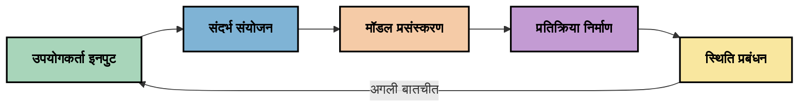
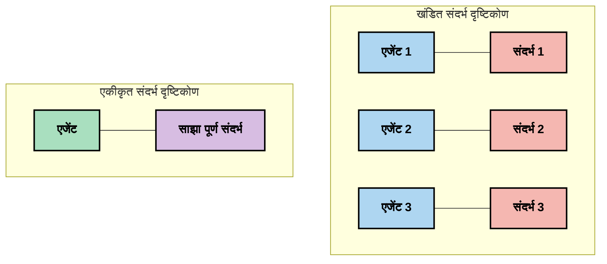
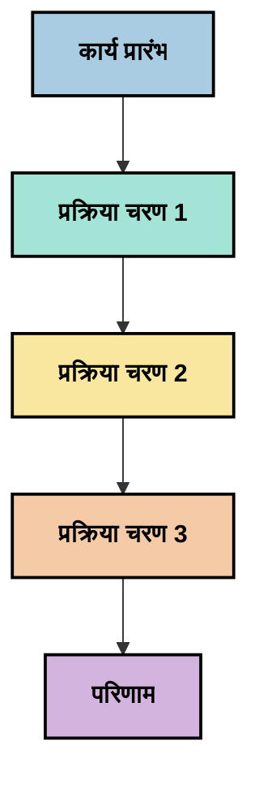
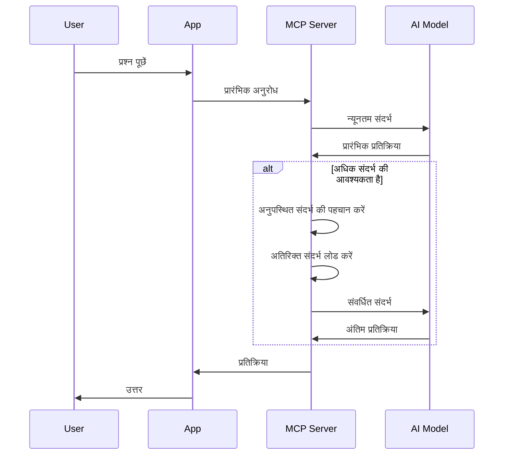
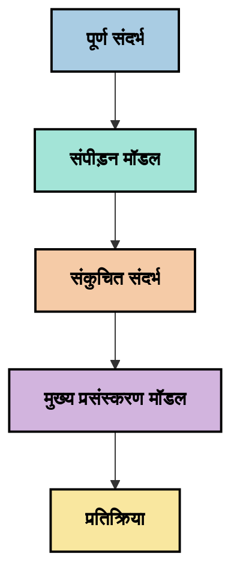
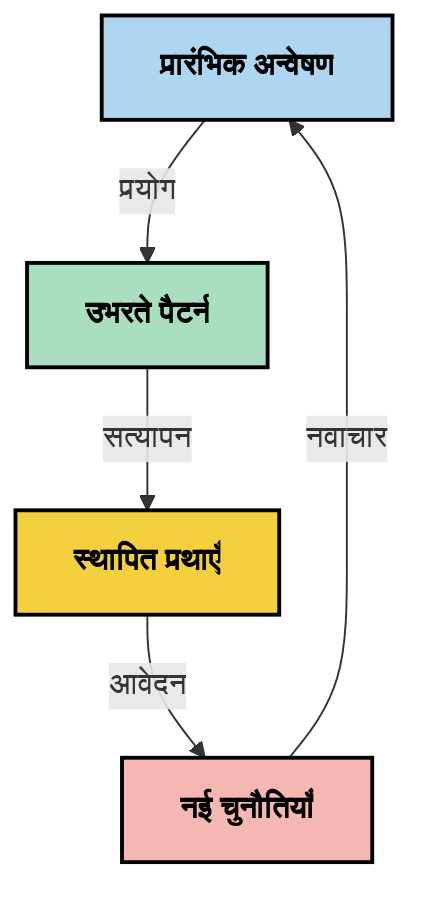

# संदर्भ इंजीनियरिंग: एमसीपी इकोसिस्टम में एक उभरता हुआ विचार

## अवलोकन

संदर्भ इंजीनियरिंग एआई क्षेत्र में एक उभरता हुआ विचार है जो ग्राहक और एआई सेवाओं के बीच इंटरैक्शन के दौरान सूचना कैसे संरचित, वितरित और बनाए रखी जाती है, इसका पता लगाता है। जैसे-जैसे मॉडल संदर्भ प्रोटोकॉल (MCP) इकोसिस्टम विकसित हो रहा है, संदर्भ का प्रभावी प्रबंधन कैसे किया जाए इसे समझना अधिक महत्वपूर्ण होता जा रहा है। यह मॉड्यूल संदर्भ इंजीनियरिंग की अवधारणा को प्रस्तुत करता है और MCP कार्यान्वयन में इसके संभावित अनुप्रयोगों का अन्वेषण करता है।

## सीखने के उद्देश्य

इस मॉड्यूल के अंत तक, आप सक्षम होंगे:

- संदर्भ इंजीनियरिंग की उभरती अवधारणा और MCP अनुप्रयोगों में इसकी संभावित भूमिका को समझना
- संदर्भ प्रबंधन में प्रमुख चुनौतियों की पहचान करना जिन्हें MCP प्रोटोकॉल डिज़ाइन संबोधित करता है
- बेहतर संदर्भ प्रबंधन के माध्यम से मॉडल प्रदर्शन सुधारने की तकनीकों का पता लगाना
- संदर्भ प्रभावशीलता को मापने और मूल्यांकन करने के दृष्टिकोण पर विचार करना
- MCP फ्रेमवर्क के माध्यम से एआई अनुभवों में सुधार के लिए इन उभरते हुए विचारों को लागू करना

## संदर्भ इंजीनियरिंग का परिचय

संदर्भ इंजीनियरिंग एक उभरता हुआ विचार है जो उपयोगकर्ताओं, अनुप्रयोगों, और एआई मॉडलों के बीच सूचना प्रवाह के जानबूझकर डिज़ाइन और प्रबंधन पर केंद्रित है। प्रांप्ट इंजीनियरिंग जैसे स्थापित क्षेत्रों के विपरीत, संदर्भ इंजीनियरिंग अभी भी प्रैक्टिशनर्स द्वारा परिभाषित किया जा रहा है क्योंकि वे एआई मॉडलों को सही समय पर सही जानकारी प्रदान करने की अनूठी चुनौतियों को हल करने का प्रयास कर रहे हैं।

जैसे-जैसे बड़े भाषा मॉडल (LLMs) विकसित हुए हैं, संदर्भ का महत्व बढ़ता गया है। हम जो संदर्भ प्रदान करते हैं उसकी गुणवत्ता, प्रासंगिकता, और संरचना सीधे मॉडल के आउटपुट को प्रभावित करती है। संदर्भ इंजीनियरिंग इस संबंध का अन्वेषण करता है और प्रभावी संदर्भ प्रबंधन के लिए सिद्धांत विकसित करने का प्रयास करता है।

> "2025 में, वहां के मॉडल बेहद बुद्धिमान होंगे। लेकिन सबसे बुद्धिमान मानव भी उस संदर्भ के बिना अपने काम को प्रभावी ढंग से नहीं कर पाएगा जिसे उनसे पूछा जा रहा है... 'संदर्भ इंजीनियरिंग' प्रांप्ट इंजीनियरिंग का अगला स्तर है। यह एक गतिशील प्रणाली में इसे स्वचालित रूप से करने के बारे में है।" — वाल्डन यान, कॉग्निशन एआई

संदर्भ इंजीनियरिंग में निम्नलिखित शामिल हो सकते हैं:

1. **संदर्भ चयन**: किसी कार्य के लिए कौन सी जानकारी प्रासंगिक है यह निर्धारित करना
2. **संदर्भ संरचना**: मॉडल की समझ को अधिकतम करने के लिए सूचना का संगठन
3. **संदर्भ वितरण**: जानकारी को मॉडलों को कैसे और कब भेजा जाए इसका अनुकूलन
4. **संदर्भ रखरखाव**: समय के साथ संदर्भ की स्थिति और विकास का प्रबंधन
5. **संदर्भ मूल्यांकन**: संदर्भ की प्रभावशीलता को मापना और सुधारना

ये ध्यान के क्षेत्र विशेष रूप से MCP इकोसिस्टम के लिए प्रासंगिक हैं, जो एप्लिकेशंस को LLMs को संदर्भ प्रदान करने का एक मानकीकृत तरीका प्रदान करता है।


## संदर्भ यात्रा दृष्टिकोण

संदर्भ इंजीनियरिंग की कल्पना करने का एक तरीका यह है कि सूचना MCP सिस्टम में यात्रा कैसे करती है:



### संदर्भ यात्रा के प्रमुख चरण:

1. **उपयोगकर्ता इनपुट**: उपयोगकर्ता से कच्ची जानकारी (टेक्स्ट, छवियां, दस्तावेज़)
2. **संदर्भ संयोजन**: उपयोगकर्ता इनपुट को सिस्टम संदर्भ, बातचीत के इतिहास और अन्य पुनः प्राप्त जानकारी के साथ संयोजित करना
3. **मॉडल प्रसंस्करण**: एआई मॉडल संयोजित संदर्भ को संसाधित करता है
4. **प्रतिक्रिया उत्पादन**: मॉडल प्रदान किए गए संदर्भ के आधार पर आउटपुट उत्पन्न करता है
5. **स्थिति प्रबंधन**: सिस्टम इंटरेक्शन के आधार पर अपनी आंतरिक स्थिति अपडेट करता है

यह दृष्टिकोण एआई सिस्टम में संदर्भ की गतिशील प्रकृति को उजागर करता है और प्रत्येक चरण में सूचना के सर्वोत्तम प्रबंधन के बारे में महत्वपूर्ण प्रश्न उठाता है।

## संदर्भ इंजीनियरिंग में उभरते सिद्धांत

जैसे-जैसे संदर्भ इंजीनियरिंग क्षेत्र आकार ले रहा है, कुछ प्रारंभिक सिद्धांत प्रैक्टिशनर्स से उभरने लगे हैं। ये सिद्धांत MCP कार्यान्वयन विकल्पों के लिए मार्गदर्शन कर सकते हैं:

### सिद्धांत 1: संदर्भ को पूरी तरह साझा करें

सिस्टम के सभी घटकों के बीच संदर्भ को पूरी तरह से साझा किया जाना चाहिए बजाय कि इसे कई एजेंटों या प्रक्रियाओं में फाड़ा जाए। जब संदर्भ वितरित होता है, तो सिस्टम के एक भाग में लिए गए निर्णय अन्य जगह लिए गए निर्णयों से टकरा सकते हैं।



MCP अनुप्रयोगों में, यह सुझाव देता है कि ऐसे सिस्टम डिज़ाइन करें जहां संदर्भ पूरी पाइपलाइन में निर्बाध रूप से प्रवाहित हो बजाय कि इसे खण्डित किया जाए।

### सिद्धांत 2: समझें कि क्रियाएं अप्रत्यक्ष निर्णय लेती हैं

मॉडल द्वारा की गई प्रत्येक क्रिया संदर्भ की व्याख्या के बारे में अप्रत्यक्ष निर्णयों को स्पष्ट करती है। जब कई घटक विभिन्न संदर्भों पर कार्रवाई करते हैं, तो ये अप्रत्यक्ष निर्णय विरोधाभासी हो सकते हैं, जिससे असंगत परिणाम उत्पन्न हो सकते हैं।

इस सिद्धांत के MCP अनुप्रयोगों के लिए महत्वपूर्ण निहितार्थ हैं:
- जटिल कार्यों की रेखीय प्रोसेसिंग को प्राथमिकता दें न कि खंडित संदर्भ के साथ समानांतर निष्पादन
- सुनिश्चित करें कि सभी निर्णय बिंदुओं को समान संदर्भित जानकारी तक पहुंच हो
- ऐसे सिस्टम डिज़ाइन करें जहां बाद के चरण पहले के निर्णयों का पूरा संदर्भ देख सकें

### सिद्धांत 3: संदर्भ गहराई और विंडो सीमाओं में संतुलन बनाएँ

जैसे-जैसे बातचीत और प्रक्रियाएँ लंबी होती हैं, संदर्भ विंडो अंततः भर जाती हैं। प्रभावी संदर्भ इंजीनियरिंग व्यापक संदर्भ और तकनीकी सीमाओं के बीच इस तनाव को प्रबंधित करने के लिए दृष्टिकोण खोजती है।

संभावित दृष्टिकोण जिनकी खोज की जा रही है, वे शामिल हैं:
- संदर्भ संपीड़न जो आवश्यक जानकारी बनाए रखते हुए टोकन उपयोग कम करता है
- वर्तमान आवश्यकताओं के अनुसार प्रासंगिकता पर आधारित प्रगतिशील संदर्भ लोडिंग
- पिछले इंटरैक्शन का सारांश बनाना जबकि प्रमुख निर्णयों और तथ्यों को संरक्षित करना

## संदर्भ चुनौतियाँ और MCP प्रोटोकॉल डिज़ाइन

मॉडल संदर्भ प्रोटोकॉल (MCP) को संदर्भ प्रबंधन की विशिष्ट चुनौतियों की समझ के साथ डिज़ाइन किया गया था। इन चुनौतियों को समझना MCP प्रोटोकॉल डिज़ाइन के प्रमुख पहलुओं को स्पष्ट करता है:


### चुनौती 1: संदर्भ विंडो की सीमाएँ
अधिकांश एआई मॉडलों की संदर्भ विंडो आकार सीमित होती है, जिससे वे एक बार में कितनी जानकारी संसाधित कर सकते हैं वह सीमित होता है।

**MCP डिज़ाइन प्रतिक्रिया:** 
- प्रोटोकॉल संरचित, संसाधन-आधारित संदर्भ का समर्थन करता है जिसे कुशलतापूर्वक संदर्भित किया जा सकता है
- संसाधन पृष्ठबद्ध किए जा सकते हैं और प्रगतिशील रूप से लोड किए जा सकते हैं

### चुनौती 2: प्रासंगिकता निर्धारण
संदर्भ में शामिल करने के लिए सबसे प्रासंगिक जानकारी निर्धारित करना कठिन है।

**MCP डिज़ाइन प्रतिक्रिया:**
- लचीले टूलिंग से आवश्यकता के आधार पर जानकारी की गतिशील पुनर्प्राप्ति संभव होती है
- संरचित प्रांप्ट से सुसंगत संदर्भ संगठन सक्षम होता है

### चुनौती 3: संदर्भ निरंतरता
इंटरैक्शन के दौरान स्थिति का प्रबंधन संदर्भ की सावधानीपूर्वक निगरानी की मांग करता है।

**MCP डिज़ाइन प्रतिक्रिया:**
- मानकीकृत सत्र प्रबंधन
- संदर्भ विकास के लिए स्पष्ट रूप से परिभाषित इंटरैक्शन पैटर्न

### चुनौती 4: बहु-मोड संदर्भ
विभिन्न प्रकार के डेटा (टेक्स्ट, छवियां, संरचित डेटा) के लिए भिन्न प्रबंधन आवश्यक है।

**MCP डिज़ाइन प्रतिक्रिया:**
- प्रोटोकॉल डिज़ाइन विभिन्न सामग्री प्रकारों को स्वीकार करता है
- बहु-मोडल जानकारी के मानकीकृत प्रतिनिधित्व

### चुनौती 5: सुरक्षा और गोपनीयता
संदर्भ में अक्सर संवेदनशील जानकारी होती है जिसे सुरक्षित रखना आवश्यक होता है।

**MCP डिज़ाइन प्रतिक्रिया:**
- क्लाइंट और सर्वर जिम्मेदारियों के बीच स्पष्ट सीमाएं
- डेटा एक्सपोज़र को कम करने के लिए स्थानीय प्रसंस्करण विकल्प

इन चुनौतियों को समझना और MCP के इनके समाधान प्रदान करने के तरीके को जानना संदर्भ इंजीनियरिंग की अधिक उन्नत तकनीकों की खोज के लिए आधार प्रदान करता है।

## उभरते संदर्भ इंजीनियरिंग दृष्टिकोण

जैसे-जैसे संदर्भ इंजीनियरिंग क्षेत्र विकसित हो रहा है, कुछ आशाजनक दृष्टिकोण उभर रहे हैं। ये स्थापित सर्वोत्तम प्रथाएं नहीं हैं बल्कि वर्तमान सोच का प्रतिनिधित्व करते हैं, और MCP कार्यान्वयनों के साथ अधिक अनुभव के साथ ये विकसित होंगे।

### 1. सिंगल-थ्रेडेड रेखीय प्रोसेसिंग

संदर्भ को वितरित करने वाली बहु-एजेंट संरचनाओं के विपरीत, कुछ प्रैक्टिशनर्स पाते हैं कि सिंगल-थ्रेडेड रेखीय प्रोसेसिंग अधिक सुसंगत परिणाम देती है। यह एकीकृत संदर्भ बनाए रखने के सिद्धांत के अनुरूप है।



यह दृष्टिकोण समानांतर प्रोसेसिंग की तुलना में कम कुशल लग सकता है, लेकिन अक्सर अधिक सुसंगत और विश्वसनीय परिणाम देता है क्योंकि प्रत्येक चरण पिछले निर्णयों की पूरी समझ पर आधारित होता है।

### 2. संदर्भ टुकड़ा करना और प्राथमिकता देना

बड़े संदर्भों को प्रबंधनीय टुकड़ों में तोड़ना और सबसे महत्वपूर्ण को प्राथमिकता देना।

```python
# वैचारिक उदाहरण: संदर्भ खंडन और प्राथमिकता
def process_with_chunked_context(documents, query):
    # 1. दस्तावेज़ों को छोटे हिस्सों में तोड़ें
    chunks = chunk_documents(documents)
    
    # 2. प्रत्येक हिस्से के लिए प्रासंगिकता स्कोर गणना करें
    scored_chunks = [(chunk, calculate_relevance(chunk, query)) for chunk in chunks]
    
    # 3. प्रासंगिकता स्कोर के अनुसार हिस्सों को क्रमबद्ध करें
    sorted_chunks = sorted(scored_chunks, key=lambda x: x[1], reverse=True)
    
    # 4. सबसे प्रासंगिक हिस्सों का संदर्भ के रूप में उपयोग करें
    context = create_context_from_chunks([chunk for chunk, score in sorted_chunks[:5]])
    
    # 5. प्राथमिकता वाले संदर्भ के साथ प्रक्रिया करें
    return generate_response(context, query)
```

ऊपर के विचार से पता चलता है कि हम बड़े दस्तावेज़ों को प्रबंधनीय टुकड़ों में कैसे तोड़ सकते हैं और संदर्भ के लिए केवल सबसे प्रासंगिक भाग चुन सकते हैं। यह दृष्टिकोण संदर्भ विंडो सीमाओं के भीतर काम करने में मदद कर सकता है जबकि बड़े ज्ञान आधारों का लाभ उठाता है।

### 3. प्रगतिशील संदर्भ लोडिंग

आवश्यकता के अनुसार संदर्भ को धीरे-धीरे लोड करना न कि एक साथ सभी को।



प्रगतिशील संदर्भ लोडिंग न्यूनतम संदर्भ के साथ शुरू होती है और केवल आवश्यक होने पर विस्तारित होती है। यह सरल प्रश्नों के लिए टोकन उपयोग को काफी कम कर सकता है जबकि जटिल प्रश्नों को संभालने की क्षमता बनाए रखता है।

### 4. संदर्भ संपीड़न और सारांश

आवश्यक जानकारी बनाये रखते हुए संदर्भ का आकार कम करना।



संदर्भ संपीड़न निम्नलिखित पर केंद्रित है:
- अधिशेष जानकारी हटाना
- लंबी सामग्री का सारांश बनाना
- प्रमुख तथ्यों और विवरण निकालना
- महत्वपूर्ण संदर्भ तत्वों को संरक्षित करना
- टोकन दक्षता के लिए अनुकूलित करना

यह दृष्टिकोण संदर्भ विंडो के भीतर लंबी बातचीत बनाए रखने या बड़े दस्तावेजों को कुशलता से संसाधित करने के लिए विशेष रूप से मूल्यवान हो सकता है। कुछ प्रैक्टिशनर्स बातचीत इतिहास के संदर्भ संपीड़न और सारांश के लिए विशिष्ट मॉडल का उपयोग कर रहे हैं।


## अन्वेषणात्मक संदर्भ इंजीनियरिंग विचार

जैसे-जैसे हम संदर्भ इंजीनियरिंग के उभरते क्षेत्र का अन्वेषण करते हैं, MCP कार्यान्वयन के साथ काम करते समय कुछ विचार रखने योग्य हैं। ये अनिवार्य सर्वोत्तम प्रथाएं नहीं बल्कि ऐसे क्षेत्र हैं जहां अन्वेषण से आपके विशिष्ट उपयोग मामले में सुधार हो सकता है।

### अपने संदर्भ लक्ष्यों पर विचार करें

जटिल संदर्भ प्रबंधन समाधानों को लागू करने से पहले, स्पष्ट रूप से बताएं कि आप क्या हासिल करना चाहते हैं:
- मॉडल को सफल होने के लिए किन विशिष्ट जानकारी की आवश्यकता है?
- कौन सी जानकारी आवश्यक है और कौन सी पूरक है?
- आपकी प्रदर्शन सीमाएँ क्या हैं (देर होना, टोकन सीमाएं, लागत)?

### परतदार संदर्भ दृष्टिकोणों का अन्वेषण करें

कुछ प्रैक्टिशनर्स ने संदर्भ को वैचारिक परतों में व्यवस्थित करने में सफलता पाई है:
- **कोर लेयर**: आवश्यक जानकारी जो मॉडल को हमेशा चाहिए
- **स्थितिजन्य लेयर**: वर्तमान इंटरैक्शन के लिए विशिष्ट संदर्भ
- **सहायक लेयर**: अतिरिक्त जानकारी जो मददगार हो सकती है
- **फॉलबैक लेयर**: जानकारी जो केवल आवश्यकता होने पर एक्सेस की जाती है

### पुनः प्राप्ति रणनीतियों की जांच करें

आपका संदर्भ अक्सर इस बात पर निर्भर करता है कि आप जानकारी कैसे पुनः प्राप्त करते हैं:
- अवधारणात्मक रूप से प्रासंगिक जानकारी खोजने के लिए सेमांटिक सर्च और एम्बेडिंग
- विशिष्ट तथ्यात्मक विवरणों के लिए कीवर्ड-आधारित खोज
- कई पुनः प्राप्ति विधियों को संयोजित करने वाले हाइब्रिड दृष्टिकोण
- श्रेणियों, तिथियों, या स्रोतों के आधार पर दायरा सीमित करने के लिए मेटाडेटा फ़िल्टरिंग

### संदर्भ निरंतरता के साथ प्रयोग करें

आपके संदर्भ की संरचना और प्रवाह मॉडल की समझ को प्रभावित कर सकते हैं:
- संबंधित जानकारी को एक साथ समूहित करना
- सुसंगत फॉर्मेटिंग और संगठन का उपयोग करना
- जहां उपयुक्त हो तार्किक या कालानुक्रमिक क्रम बनाए रखना
- विरोधाभासी जानकारी से बचना

### बहु-एजेंट संरचनाओं के ट्रेडऑफ़ तौलें

जबकि बहु-एजेंट संरचनाएं कई एआई फ्रेमवर्क में लोकप्रिय हैं, ये संदर्भ प्रबंधन के लिए महत्वपूर्ण चुनौतियों के साथ आती हैं:
- संदर्भ खंडन एजेंटों के बीच असंगत निर्णयों का कारण बन सकता है
- समानांतर प्रोसेसिंग ऐसे संघर्ष ला सकती है जिन्हें सुलझाना मुश्किल होता है
- एजेंटों के बीच संचार अधिभार प्रदर्शन लाभों को समाप्त कर सकता है
- समन्वय बनाए रखने के लिए जटिल स्थिति प्रबंधन आवश्यक है

कई मामलों में, व्यापक संदर्भ प्रबंधन के साथ एकल-एजेंट दृष्टिकोण संदर्भ खंडित कई विशिष्ट एजेंटों की तुलना में अधिक विश्वसनीय परिणाम दे सकता है।

### मूल्यांकन विधियाँ विकसित करें

समय के साथ संदर्भ इंजीनियरिंग में सुधार के लिए, विचार करें कि आप सफलता को कैसे मापेंगे:
- विभिन्न संदर्भ संरचनाओं का A/B परीक्षण
- टोकन उपयोग और प्रतिक्रिया समय की निगरानी
- उपयोगकर्ता संतुष्टि और कार्य पूर्णता दरों को ट्रैक करना
- यह विश्लेषण करना कि संदर्भ रणनीतियाँ कब और क्यों विफल होती हैं

ये विचार संदर्भ इंजीनियरिंग क्षेत्र में सक्रिय अन्वेषण के क्षेत्र हैं। जैसे-जैसे यह क्षेत्र परिपक्व होगा, अधिक निश्चित पैटर्न और प्रथाएं उभरेंगी।

## संदर्भ प्रभावशीलता मापन: एक विकसित होता हुआ फ्रेमवर्क

संदर्भ इंजीनियरिंग जैसे जैसे एक अवधारणा के रूप में उभर रही है, प्रैक्टिशनर्स इसकी प्रभावशीलता को कैसे मापा जाए इस पर विचार करने लगे हैं। अभी तक कोई स्थापित फ्रेमवर्क मौजूद नहीं है, लेकिन विभिन्न मेट्रिक्स पर विचार किया जा रहा है जो भविष्य के कार्य को मार्गदर्शन कर सकते हैं।

### संभावित मापन आयाम


#### 1. इनपुट दक्षता विचार

- **संदर्भ-से-प्रतिक्रिया अनुपात**: प्रतिक्रिया के आकार के सापेक्ष कितना संदर्भ आवश्यक है?
- **टोकन उपयोग**: प्रदान किए गए संदर्भ टोकन का कितना प्रतिशत प्रतिक्रिया को प्रभावित करता प्रतीत होता है?
- **संदर्भ कमी**: हम कच्ची जानकारी को कितना प्रभावी ढंग से संपीड़ित कर सकते हैं?

#### 2. प्रदर्शन विचार

- **लेटेंसी प्रभाव**: संदर्भ प्रबंधन प्रतिक्रिया समय को कैसे प्रभावित करता है?
- **टोकन अर्थव्यवस्था**: क्या हम टोकन उपयोग को प्रभावी ढंग से अनुकूलित कर रहे हैं?
- **पुनर्प्राप्ति सटीकता**: पुनः प्राप्त जानकारी कितनी प्रासंगिक है?
- **संसाधन उपयोग**: आवश्यक कम्प्यूटेशनल संसाधन क्या हैं?

#### 3. गुणवत्ता विचार

- **प्रतिक्रिया प्रासंगिकता**: प्रतिक्रिया सवाल को कितनी अच्छी तरह संबोधित करती है?
- **तथ्यात्मक सटीकता**: क्या संदर्भ प्रबंधन तथ्यात्मक शुद्धता में सुधार करता है?
- **संगति**: समान प्रश्नों पर प्रतिक्रियाएँ कितनी सुसंगत हैं?
- **हैलुसिनेशन दर**: क्या बेहतर संदर्भ मॉडल के भ्रामक परिणामों को कम करता है?

#### 4. उपयोगकर्ता अनुभव विचार

- **फॉलो-अप दर**: उपयोगकर्ताओं को कितनी बार स्पष्टीकरण की आवश्यकता होती है?
- **कार्य पूरा करना**: क्या उपयोगकर्ता अपने लक्ष्यों को सफलतापूर्वक प्राप्त करते हैं?
- **संतुष्टि सूचकांक**: उपयोगकर्ता अपने अनुभव को कैसे रेट करते हैं?

### मापन के लिए अन्वेषणात्मक दृष्टिकोण

MCP कार्यान्वयन में संदर्भ इंजीनियरिंग के साथ प्रयोग करते समय, इन अन्वेषणात्मक दृष्टिकोणों पर विचार करें:

1. **बेसलाइन तुलनाएँ**: अधिक परिष्कृत विधियों का परीक्षण करने से पहले सरल संदर्भ दृष्टिकोण के साथ एक बेसलाइन स्थापित करें

2. **क्रमिक परिवर्तन**: संदर्भ प्रबंधन के एक पहलू को एक समय में बदलें ताकि उसके प्रभाव को अलग किया जा सके

3. **उपयोगकर्ता-केंद्रित मूल्यांकन**: मात्रात्मक मेट्रिक्स को गुणात्मक उपयोगकर्ता प्रतिक्रिया के साथ संयोजित करें

4. **विफलता विश्लेषण**: उन मामलों की जांच करें जहां संदर्भ रणनीतियाँ विफल होती हैं ताकि संभावित सुधार समझे जा सकें

5. **बहुआयामी आकलन**: दक्षता, गुणवत्ता, और उपयोगकर्ता अनुभव के बीच ट्रेड-ऑफ़ पर विचार करें

मापन के लिए यह प्रयोगात्मक, बहुआयामी दृष्टिकोण संदर्भ इंजीनियरिंग की उभरती प्रकृति के अनुरूप है।

## समापन विचार

संदर्भ इंजीनियरिंग अन्वेषण का एक उभरता हुआ क्षेत्र है जो प्रभावी MCP अनुप्रयोगों के लिए केंद्रीय साबित हो सकता है। अपने सिस्टम में सूचना के प्रवाह पर विचारपूर्वक ध्यान देकर, आप संभवतः अधिक कुशल, सटीक, और उपयोगकर्ताओं के लिए मूल्यवान एआई अनुभव बना सकते हैं।

इस मॉड्यूल में वर्णित तकनीकें और दृष्टिकोण इस क्षेत्र में प्रारंभिक सोच का प्रतिनिधित्व करते हैं, स्थापित प्रथाओं का नहीं। जैसे-जैसे एआई क्षमताएं विकसित होती हैं और हमारी समझ गहराती है, संदर्भ इंजीनियरिंग एक अधिक परिभाषित अनुशासन बन सकता है। फिलहाल, सावधानीपूर्वक मापन के साथ प्रयोग सबसे उत्पादक दृष्टिकोण प्रतीत होता है।

## संभावित भविष्य के निर्देश

संदर्भ इंजीनियरिंग का क्षेत्र अभी शुरुआती चरण में है, लेकिन कई आशाजनक दिशाएं उभर रही हैं:

- संदर्भ इंजीनियरिंग सिद्धांत मॉडल प्रदर्शन, दक्षता, उपयोगकर्ता अनुभव, और विश्वसनीयता पर महत्वपूर्ण प्रभाव डाल सकते हैं
- व्यापक संदर्भ प्रबंधन के साथ सिंगल-थ्रेडेड दृष्टिकोण कई उपयोग मामलों के लिए बहु-एजेंट संरचनाओं को पीछे छोड़ सकते हैं
- विशिष्ट संदर्भ संपीड़न मॉडल एआई पाइपलाइनों में मानक घटक बन सकते हैं
- संदर्भ पूर्णता और टोकन सीमाओं के बीच तनाव संदर्भ प्रबंधन में नवाचार को प्रेरित करेगा
- जैसे-जैसे मॉडल मानव-सदृश संचार में अधिक सक्षम होते हैं, वास्तविक बहु-एजेंट सहयोग अधिक व्यवहार्य हो सकता है
- MCP कार्यान्वयन वर्तमान प्रयोगों से उभरने वाले संदर्भ प्रबंधन पैटर्न को मानकीकृत करने के लिए विकसित हो सकते हैं



## संसाधन

### आधिकारिक MCP संसाधन
- [Model Context Protocol Website](https://modelcontextprotocol.io/)
- [Model Context Protocol Specification](https://github.com/modelcontextprotocol/modelcontextprotocol)

- [MCP दस्तावेज़ीकरण](https://modelcontextprotocol.io/docs)
- [MCP C# SDK](https://github.com/modelcontextprotocol/csharp-sdk)
- [MCP Python SDK](https://github.com/modelcontextprotocol/python-sdk)
- [MCP TypeScript SDK](https://github.com/modelcontextprotocol/typescript-sdk)
- [MCP इंस्पेक्टर](https://github.com/modelcontextprotocol/inspector) - MCP सर्वरों के लिए विज़ुअल परीक्षण उपकरण

### संदर्भ अभियांत्रिकी लेख
- [मल्टी-एजेंट्स न बनाएं: संदर्भ अभियांत्रिकी के सिद्धांत](https://cognition.ai/blog/dont-build-multi-agents) - वाल्डेन यान के संदर्भ अभियांत्रिकी सिद्धांतों पर विचार
- [एजेंट्स बनाने के लिए व्यावहारिक मार्गदर्शिका](https://cdn.openai.com/business-guides-and-resources/a-practical-guide-to-building-agents.pdf) - प्रभावी एजेंट डिज़ाइन पर OpenAI का मार्गदर्शन
- [प्रभावी एजेंट्स बनाना](https://www.anthropic.com/engineering/building-effective-agents) - एजेंट विकास के लिए Anthropic का दृष्टिकोण

### संबंधित अनुसंधान
- [बड़े भाषा मॉडलों के लिए डायनेमिक पुनःप्राप्ति संवर्धन](https://arxiv.org/abs/2310.01487) - डायनेमिक पुनःप्राप्ति विधियों पर अनुसंधान
- [बीच में खोया: भाषा मॉडल लंबे संदर्भों का उपयोग कैसे करते हैं](https://arxiv.org/abs/2307.03172) - संदर्भ प्रसंस्करण पैटर्न पर महत्वपूर्ण अनुसंधान
- [CLIP लेटेंट्स के साथ श्रेणीबद्ध टेक्स्ट-आधारित इमेज निर्माण](https://arxiv.org/abs/2204.06125) - संदर्भ संरचना पर DALL-E 2 पेपर के विचार
- [बड़े भाषा मॉडल वास्तुकलाओं में संदर्भ की भूमिका का अन्वेषण](https://aclanthology.org/2023.findings-emnlp.124/) - संदर्भ प्रबंधन पर हालिया अनुसंधान
- [मल्टी-एजेंट सहयोग: एक सर्वेक्षण](https://arxiv.org/abs/2304.03442) - मल्टी-एजेंट प्रणाली और उनके चुनौतियों पर अनुसंधान

### अतिरिक्त संसाधन
- [संदर्भ विंडो अनुकूलन तकनीकें](https://learn.microsoft.com/en-us/azure/ai-services/openai/concepts/context-window)
- [उन्नत RAG तकनीकें](https://www.microsoft.com/en-us/research/blog/retrieval-augmented-generation-rag-and-frontier-models/)
- [सेमांटिक कर्नेल दस्तावेज़ीकरण](https://github.com/microsoft/semantic-kernel)
- [संदर्भ प्रबंधन के लिए AI टूलकिट](https://github.com/microsoft/aitoolkit)

## आगे क्या है

- [5.15 MCP कस्टम ट्रांसपोर्ट](../mcp-transport/README.md)

---

<!-- CO-OP TRANSLATOR DISCLAIMER START -->
**अस्वीकरण**:
इस दस्तावेज़ का अनुवाद AI अनुवाद सेवा [Co-op Translator](https://github.com/Azure/co-op-translator) का उपयोग करके किया गया है। जबकि हम सटीकता के लिए प्रयास करते हैं, कृपया ध्यान दें कि स्वचालित अनुवादों में त्रुटियाँ या अशुद्धियाँ हो सकती हैं। मूल दस्तावेज़ अपनी मूल भाषा में ही प्रामाणिक स्रोत माना जाना चाहिए। महत्वपूर्ण जानकारी के लिए, पेशेवर मानव अनुवाद की सिफारिश की जाती है। इस अनुवाद के उपयोग से उत्पन्न किसी भी गलतफहमी या गलत व्याख्या के लिए हम उत्तरदायी नहीं हैं।
<!-- CO-OP TRANSLATOR DISCLAIMER END -->