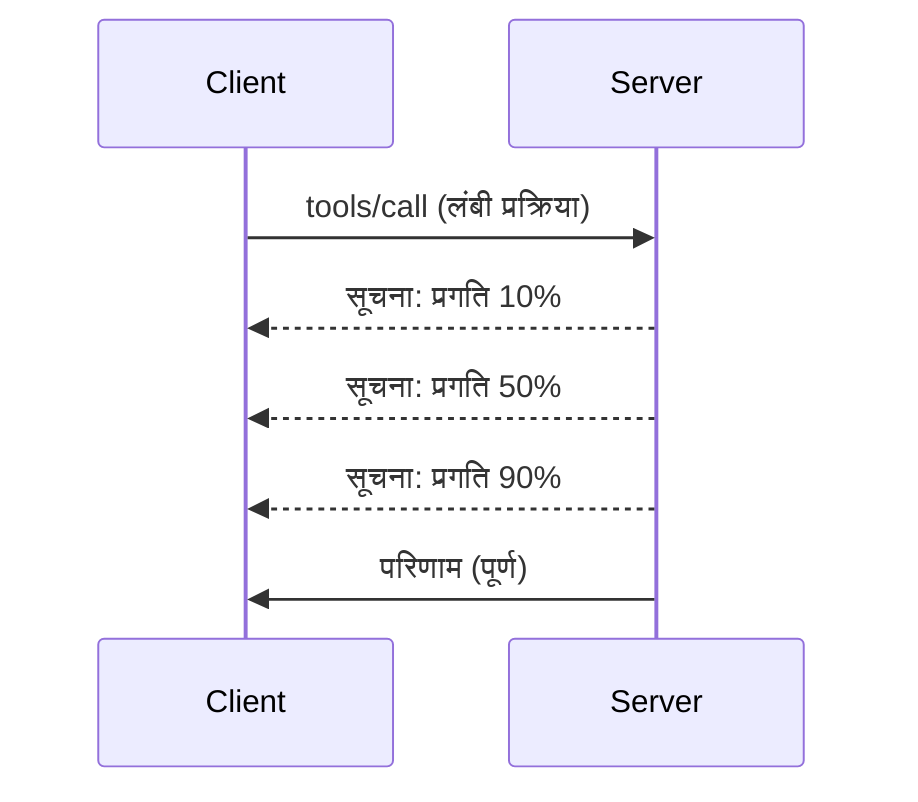

# MCP प्रोटोकॉल फीचर्स डीप डायव

यह गाइड उन्नत MCP प्रोटोकॉल फीचर्स का अन्वेषण करता है जो बुनियादी टूल और संसाधन प्रबंधन से परे जाते हैं। इन फीचर्स को समझने से आप अधिक मजबूत, उपयोगकर्ता-मित्रवत, और उत्पादन-तैयार MCP सर्वर बना सकते हैं।

> **आगे की ओर देखते हुए:** `2026-07-28` रिलीज़ उम्मीदवार Logging प्रिमिटिव को डिप्रिकेट करता है (stdio के लिए `stderr` और संरचित ऑब्ज़र्वेबिलिटी के लिए OpenTelemetry को प्राथमिकता देते हुए), नीचे Server Lifecycle Events में संदर्भित `initialize`/सेशन मॉडल को हटाता है, और प्रायोगिक Tasks फीचर को एक समर्पित Tasks एक्सटेंशन में ले जाता है जिसमें नया `tasks/get`/`tasks/update`/`tasks/cancel` लाइफसाइकिल होता है। देखें [MCP में क्या बदल रहा है: 2026-07-28 रिलीज़ उम्मीदवार](../../01-CoreConcepts/mcp-2026-07-28-release-candidate.md)।

## कवर किए गए फीचर्स

1. **प्रगति सूचनाएं** - लंबी चलने वाली प्रक्रियाओं के लिए प्रगति की रिपोर्ट
2. **अनुरोध रद्दीकरण** - क्लाइंट्स को इन-फ्लाइट अनुरोध रद्द करने की अनुमति देना
3. **संसाधन टेम्पलेट्स** - पैरामीटर के साथ डायनामिक संसाधन URI
4. **सर्वर लाइफसाइकिल इवेंट्स** - उचित प्रारंभ और बंद करना
5. **लॉगिंग नियंत्रण** - सर्वर-साइड लॉगिंग कॉन्फ़िगरेशन
6. **त्रुटि हैंडलिंग पैटर्न** - सुसंगत त्रुटि प्रतिक्रियाएं

---

## 1. प्रगति सूचनाएं

ऐसी प्रक्रियाओं के लिए जो समय लेती हैं (डेटा प्रोसेसिंग, फाइल डाउनलोड, API कॉल), प्रगति सूचनाएं उपयोगकर्ताओं को सूचित रखती हैं।

### यह कैसे काम करता है



### पायथन कार्यान्वयन

```python
from mcp.server import Server, NotificationOptions
from mcp.types import ProgressNotification
import asyncio

app = Server("progress-server")

@app.tool()
async def process_large_file(file_path: str, ctx) -> str:
    """Process a large file with progress updates."""
    
    # प्रगति गणना के लिए फ़ाइल आकार प्राप्त करें
    file_size = os.path.getsize(file_path)
    processed = 0
    
    with open(file_path, 'rb') as f:
        while chunk := f.read(8192):
            # खंड संसाधित करें
            await process_chunk(chunk)
            processed += len(chunk)
            
            # प्रगति सूचना भेजें
            progress = (processed / file_size) * 100
            await ctx.send_notification(
                ProgressNotification(
                    progressToken=ctx.request_id,
                    progress=progress,
                    total=100,
                    message=f"Processing: {progress:.1f}%"
                )
            )
    
    return f"Processed {file_size} bytes"

@app.tool()
async def batch_operation(items: list[str], ctx) -> str:
    """Process multiple items with progress."""
    
    results = []
    total = len(items)
    
    for i, item in enumerate(items):
        result = await process_item(item)
        results.append(result)
        
        # प्रत्येक आइटम के बाद प्रगति रिपोर्ट करें
        await ctx.send_notification(
            ProgressNotification(
                progressToken=ctx.request_id,
                progress=i + 1,
                total=total,
                message=f"Processed {i + 1}/{total}: {item}"
            )
        )
    
    return f"Completed {total} items"
```

### टाइपस्क्रिप्ट कार्यान्वयन

```typescript
import { Server } from "@modelcontextprotocol/sdk/server/index.js";

server.setRequestHandler(CallToolSchema, async (request, extra) => {
  const { name, arguments: args } = request.params;
  
  if (name === "process_data") {
    const items = args.items as string[];
    const results = [];
    
    for (let i = 0; i < items.length; i++) {
      const result = await processItem(items[i]);
      results.push(result);
      
      // प्रगति सूचना भेजें
      await extra.sendNotification({
        method: "notifications/progress",
        params: {
          progressToken: request.id,
          progress: i + 1,
          total: items.length,
          message: `Processing item ${i + 1}/${items.length}`
        }
      });
    }
    
    return { content: [{ type: "text", text: JSON.stringify(results) }] };
  }
});
```

### क्लाइंट हैंडलिंग (पायथन)

```python
async def handle_progress(notification):
    """Handle progress notifications from server."""
    params = notification.params
    print(f"Progress: {params.progress}/{params.total} - {params.message}")

# रजिस्ट्री हैंडलर
session.on_notification("notifications/progress", handle_progress)

# टूल कॉल करें (प्रगति अपडेट्स हैंडलर के माध्यम से आयेंगे)
result = await session.call_tool("process_large_file", {"file_path": "/data/large.csv"})
```

---

## 2. अनुरोध रद्दीकरण

उन अनुरोधों को रद्द करने की अनुमति दें जो अब आवश्यक नहीं हैं या बहुत अधिक समय ले रहे हैं।

### पायथन कार्यान्वयन

```python
from mcp.server import Server
from mcp.types import CancelledError
import asyncio

app = Server("cancellable-server")

@app.tool()
async def long_running_search(query: str, ctx) -> str:
    """Search that can be cancelled."""
    
    results = []
    
    try:
        for page in range(100):  # कई पृष्ठों में खोजें
            # जांचें कि क्या रद्दीकरण का अनुरोध किया गया था
            if ctx.is_cancelled:
                raise CancelledError("Search cancelled by user")
            
            # पृष्ठ खोज का अनुकरण करें
            page_results = await search_page(query, page)
            results.extend(page_results)
            
            # छोटा विलंब रद्दीकरण जांच की अनुमति देता है
            await asyncio.sleep(0.1)
            
    except CancelledError:
        # आंशिक परिणाम लौटाएं
        return f"Cancelled. Found {len(results)} results before cancellation."
    
    return f"Found {len(results)} total results"

@app.tool()
async def download_file(url: str, ctx) -> str:
    """Download with cancellation support."""
    
    async with aiohttp.ClientSession() as session:
        async with session.get(url) as response:
            total_size = int(response.headers.get('content-length', 0))
            downloaded = 0
            chunks = []
            
            async for chunk in response.content.iter_chunked(8192):
                if ctx.is_cancelled:
                    return f"Download cancelled at {downloaded}/{total_size} bytes"
                
                chunks.append(chunk)
                downloaded += len(chunk)
            
            return f"Downloaded {downloaded} bytes"
```

### रद्दीकरण संदर्भ को लागू करना

```python
class CancellableContext:
    """Context object that tracks cancellation state."""
    
    def __init__(self, request_id: str):
        self.request_id = request_id
        self._cancelled = asyncio.Event()
        self._cancel_reason = None
    
    @property
    def is_cancelled(self) -> bool:
        return self._cancelled.is_set()
    
    def cancel(self, reason: str = "Cancelled"):
        self._cancel_reason = reason
        self._cancelled.set()
    
    async def check_cancelled(self):
        """Raise if cancelled, otherwise continue."""
        if self.is_cancelled:
            raise CancelledError(self._cancel_reason)
    
    async def sleep_or_cancel(self, seconds: float):
        """Sleep that can be interrupted by cancellation."""
        try:
            await asyncio.wait_for(
                self._cancelled.wait(),
                timeout=seconds
            )
            raise CancelledError(self._cancel_reason)
        except asyncio.TimeoutError:
            pass  # सामान्य टाइमआउट, जारी रखें
```

### क्लाइंट-साइड रद्दीकरण

```python
import asyncio

async def search_with_timeout(session, query, timeout=30):
    """Search with automatic cancellation on timeout."""
    
    task = asyncio.create_task(
        session.call_tool("long_running_search", {"query": query})
    )
    
    try:
        result = await asyncio.wait_for(task, timeout=timeout)
        return result
    except asyncio.TimeoutError:
        # अनुरोध रद्द करना
        await session.send_notification({
            "method": "notifications/cancelled",
            "params": {"requestId": task.request_id, "reason": "Timeout"}
        })
        return "Search timed out"
```

---

## 3. संसाधन टेम्पलेट्स

संसाधन टेम्पलेट्स पैरामीटर के साथ डायनामिक URI निर्माण की अनुमति देते हैं, जो API और डेटाबेस के लिए उपयोगी हैं।

### टेम्पलेट्स को परिभाषित करना

```python
from mcp.server import Server
from mcp.types import ResourceTemplate

app = Server("template-server")

@app.list_resource_templates()
async def list_templates() -> list[ResourceTemplate]:
    """Return available resource templates."""
    return [
        ResourceTemplate(
            uriTemplate="db://users/{user_id}",
            name="User Profile",
            description="Fetch user profile by ID",
            mimeType="application/json"
        ),
        ResourceTemplate(
            uriTemplate="api://weather/{city}/{date}",
            name="Weather Data",
            description="Historical weather for city and date",
            mimeType="application/json"
        ),
        ResourceTemplate(
            uriTemplate="file://{path}",
            name="File Content",
            description="Read file at given path",
            mimeType="text/plain"
        )
    ]

@app.read_resource()
async def read_resource(uri: str) -> str:
    """Read resource, expanding template parameters."""
    
    # URI को पार्स करके पैरामीटर निकालें
    if uri.startswith("db://users/"):
        user_id = uri.split("/")[-1]
        return await fetch_user(user_id)
    
    elif uri.startswith("api://weather/"):
        parts = uri.replace("api://weather/", "").split("/")
        city, date = parts[0], parts[1]
        return await fetch_weather(city, date)
    
    elif uri.startswith("file://"):
        path = uri.replace("file://", "")
        return await read_file(path)
    
    raise ValueError(f"Unknown resource URI: {uri}")
```

### टाइपस्क्रिप्ट कार्यान्वयन

```typescript
server.setRequestHandler(ListResourceTemplatesSchema, async () => {
  return {
    resourceTemplates: [
      {
        uriTemplate: "github://repos/{owner}/{repo}/issues/{issue_number}",
        name: "GitHub Issue",
        description: "Fetch a specific GitHub issue",
        mimeType: "application/json"
      },
      {
        uriTemplate: "db://tables/{table}/rows/{id}",
        name: "Database Row",
        description: "Fetch a row from a database table",
        mimeType: "application/json"
      }
    ]
  };
});

server.setRequestHandler(ReadResourceSchema, async (request) => {
  const uri = request.params.uri;
  
  // GitHub समस्या URI को पार्स करें
  const githubMatch = uri.match(/^github:\/\/repos\/([^/]+)\/([^/]+)\/issues\/(\d+)$/);
  if (githubMatch) {
    const [_, owner, repo, issueNumber] = githubMatch;
    const issue = await fetchGitHubIssue(owner, repo, parseInt(issueNumber));
    return {
      contents: [{
        uri,
        mimeType: "application/json",
        text: JSON.stringify(issue, null, 2)
      }]
    };
  }
  
  throw new Error(`Unknown resource URI: ${uri}`);
});
```

---

## 4. सर्वर लाइफसाइकिल इवेंट्स

उचित प्रारंभ और बंद करने का प्रबंधन साफ-सुथरे संसाधन प्रबंधन को सुनिश्चित करता है।

### पायथन लाइफसाइकिल प्रबंधन

```python
from mcp.server import Server
from contextlib import asynccontextmanager

app = Server("lifecycle-server")

# साझा स्थिति
db_connection = None
cache = None

@asynccontextmanager
async def lifespan(server: Server):
    """Manage server lifecycle."""
    global db_connection, cache
    
    # प्रारंभ
    print("🚀 Server starting...")
    db_connection = await create_database_connection()
    cache = await create_cache_client()
    print("✅ Resources initialized")
    
    yield  # सर्वर यहाँ चलता है
    
    # बंद करना
    print("🛑 Server shutting down...")
    await db_connection.close()
    await cache.close()
    print("✅ Resources cleaned up")

app = Server("lifecycle-server", lifespan=lifespan)

@app.tool()
async def query_database(sql: str) -> str:
    """Use the shared database connection."""
    result = await db_connection.execute(sql)
    return str(result)
```

### टाइपस्क्रिप्ट लाइफसाइकिल

```typescript
import { Server } from "@modelcontextprotocol/sdk/server/index.js";

class ManagedServer {
  private server: Server;
  private dbConnection: DatabaseConnection | null = null;
  
  constructor() {
    this.server = new Server({
      name: "lifecycle-server",
      version: "1.0.0"
    });
    
    this.setupHandlers();
  }
  
  async start() {
    // संसाधनों को प्रारंभ करें
    console.log("🚀 Server starting...");
    this.dbConnection = await createDatabaseConnection();
    console.log("✅ Database connected");
    
    // सर्वर शुरू करें
    await this.server.connect(transport);
  }
  
  async stop() {
    // संसाधनों की सफाई करें
    console.log("🛑 Server shutting down...");
    if (this.dbConnection) {
      await this.dbConnection.close();
    }
    await this.server.close();
    console.log("✅ Cleanup complete");
  }
  
  private setupHandlers() {
    this.server.setRequestHandler(CallToolSchema, async (request) => {
      // इस.dbConnection का सुरक्षित उपयोग करें
      // ...
    });
  }
}

// सुगम शटडाउन के साथ उपयोग
const server = new ManagedServer();

process.on('SIGINT', async () => {
  await server.stop();
  process.exit(0);
});

await server.start();
```

---

## 5. लॉगिंग नियंत्रण

MCP सर्वर-साइड लॉगिंग स्तरों का समर्थन करता है जिसे क्लाइंट नियंत्रित कर सकते हैं।

### लॉगिंग स्तरों को लागू करना

```python
from mcp.server import Server
from mcp.types import LoggingLevel
import logging

app = Server("logging-server")

# MCP स्तरों को Python लॉगिंग स्तरों से मैप करें
LEVEL_MAP = {
    LoggingLevel.DEBUG: logging.DEBUG,
    LoggingLevel.INFO: logging.INFO,
    LoggingLevel.WARNING: logging.WARNING,
    LoggingLevel.ERROR: logging.ERROR,
}

logger = logging.getLogger("mcp-server")

@app.set_logging_level()
async def set_logging_level(level: LoggingLevel) -> None:
    """Handle client request to change logging level."""
    python_level = LEVEL_MAP.get(level, logging.INFO)
    logger.setLevel(python_level)
    logger.info(f"Logging level set to {level}")

@app.tool()
async def debug_operation(data: str) -> str:
    """Tool with various logging levels."""
    logger.debug(f"Processing data: {data}")
    
    try:
        result = process(data)
        logger.info(f"Successfully processed: {result}")
        return result
    except Exception as e:
        logger.error(f"Processing failed: {e}")
        raise
```

### क्लाइंट को लॉग संदेश भेजना

```python
@app.tool()
async def complex_operation(input: str, ctx) -> str:
    """Operation that logs to client."""
    
    # लॉग सूचना क्लाइंट को भेजें
    await ctx.send_log(
        level="info",
        message=f"Starting complex operation with input: {input}"
    )
    
    # काम करें...
    result = await do_work(input)
    
    await ctx.send_log(
        level="debug",
        message=f"Operation complete, result size: {len(result)}"
    )
    
    return result
```

---

## 6. त्रुटि हैंडलिंग पैटर्न

सुसंगत त्रुटि हैंडलिंग डिबगिंग और उपयोगकर्ता अनुभव को बेहतर बनाती है।

### MCP त्रुटि कोड

```python
from mcp.types import McpError, ErrorCode

class ToolError(McpError):
    """Base class for tool errors."""
    pass

class ValidationError(ToolError):
    """Invalid input parameters."""
    def __init__(self, message: str):
        super().__init__(ErrorCode.INVALID_PARAMS, message)

class NotFoundError(ToolError):
    """Requested resource not found."""
    def __init__(self, resource: str):
        super().__init__(ErrorCode.INVALID_REQUEST, f"Not found: {resource}")

class PermissionError(ToolError):
    """Access denied."""
    def __init__(self, action: str):
        super().__init__(ErrorCode.INVALID_REQUEST, f"Permission denied: {action}")

class InternalError(ToolError):
    """Internal server error."""
    def __init__(self, message: str):
        super().__init__(ErrorCode.INTERNAL_ERROR, message)
```

### संरचित त्रुटि प्रतिक्रियाएं

```python
@app.tool()
async def safe_operation(input: str) -> str:
    """Tool with comprehensive error handling."""
    
    # इनपुट को मान्य करें
    if not input:
        raise ValidationError("Input cannot be empty")
    
    if len(input) > 10000:
        raise ValidationError(f"Input too large: {len(input)} chars (max 10000)")
    
    try:
        # अनुमतियों की जांच करें
        if not await check_permission(input):
            raise PermissionError(f"read {input}")
        
        # ऑपरेशन करें
        result = await perform_operation(input)
        
        if result is None:
            raise NotFoundError(input)
        
        return result
        
    except ConnectionError as e:
        raise InternalError(f"Database connection failed: {e}")
    except TimeoutError as e:
        raise InternalError(f"Operation timed out: {e}")
    except Exception as e:
        # अनपेक्षित त्रुटियों को लॉग करें
        logger.exception(f"Unexpected error in safe_operation")
        raise InternalError(f"Unexpected error: {type(e).__name__}")
```

### टाइपस्क्रिप्ट में त्रुटि हैंडलिंग

```typescript
import { McpError, ErrorCode } from "@modelcontextprotocol/sdk/types.js";

function validateInput(data: unknown): asserts data is ValidInput {
  if (typeof data !== "object" || data === null) {
    throw new McpError(
      ErrorCode.InvalidParams,
      "Input must be an object"
    );
  }
  // और अधिक मान्यकरण...
}

server.setRequestHandler(CallToolSchema, async (request) => {
  try {
    validateInput(request.params.arguments);
    
    const result = await performOperation(request.params.arguments);
    
    return {
      content: [{ type: "text", text: JSON.stringify(result) }]
    };
    
  } catch (error) {
    if (error instanceof McpError) {
      throw error;  // पहले से ही एक MCP त्रुटि
    }
    
    // अन्य त्रुटियों को परिवर्तित करें
    if (error instanceof NotFoundError) {
      throw new McpError(ErrorCode.InvalidRequest, error.message);
    }
    
    // अज्ञात त्रुटि
    console.error("Unexpected error:", error);
    throw new McpError(
      ErrorCode.InternalError,
      "An unexpected error occurred"
    );
  }
});
```

---

## प्रायोगिक फीचर्स (MCP 2025-11-25)

ये फीचर्स विनिर्देशन में प्रायोगिक के रूप में चिह्नित हैं:

### टास्क्स (लंबी चलने वाली प्रक्रियाएं)

```python
# कार्यों के साथ राज्य के साथ लंबी अवधि तक चलने वाले संचालन का ट्रैकिंग करना संभव होता है
@app.task()
async def training_task(model_id: str, data_path: str, ctx) -> str:
    """Long-running ML training task."""
    
    # कार्य शुरू होने की रिपोर्ट करें
    await ctx.report_status("running", "Initializing training...")
    
    # प्रशिक्षण लूप
    for epoch in range(100):
        await train_epoch(model_id, data_path, epoch)
        await ctx.report_status(
            "running",
            f"Training epoch {epoch + 1}/100",
            progress=epoch + 1,
            total=100
        )
    
    await ctx.report_status("completed", "Training finished")
    return f"Model {model_id} trained successfully"
```

### टूल एनोटेशन

```python
# एनोटेशन टूल व्यवहार के बारे में मेटाडेटा प्रदान करते हैं
@app.tool(
    annotations={
        "destructive": False,      # डेटा को संशोधित नहीं करता है
        "idempotent": True,        # पुन: प्रयास करने के लिए सुरक्षित
        "timeout_seconds": 30,     # अपेक्षित अधिकतम अवधि
        "requires_approval": False # उपयोगकर्ता की मंजूरी की आवश्यकता नहीं है
    }
)
async def safe_query(query: str) -> str:
    """A read-only database query tool."""
    return await execute_read_query(query)
```

---

## आगे क्या है

- [मॉड्यूल 8 - सर्वोत्तम प्रथाएं](../../08-BestPractices/README.md)
- [5.14 - संदर्भ इंजीनियरिंग](../mcp-contextengineering/README.md)
- [MCP विनिर्देशन चेंजलॉग](https://spec.modelcontextprotocol.io/)

---

## अतिरिक्त संसाधन

- [MCP विनिर्देशन 2025-11-25](https://spec.modelcontextprotocol.io/specification/2025-11-25/)
- [JSON-RPC 2.0 त्रुटि कोड](https://www.jsonrpc.org/specification#error_object)
- [पायथन SDK उदाहरण](https://github.com/modelcontextprotocol/python-sdk/tree/main/examples)
- [टाइपस्क्रिप्ट SDK उदाहरण](https://github.com/modelcontextprotocol/typescript-sdk/tree/main/examples)

---

<!-- CO-OP TRANSLATOR DISCLAIMER START -->
**अस्वीकरण**:
इस दस्तावेज़ का अनुवाद AI अनुवाद सेवा [Co-op Translator](https://github.com/Azure/co-op-translator) का उपयोग करके किया गया है। जबकि हम सटीकता के लिए प्रयास करते हैं, कृपया ध्यान दें कि स्वचालित अनुवादों में त्रुटियाँ या अशुद्धियाँ हो सकती हैं। मूल दस्तावेज़ अपनी मूल भाषा में ही प्रामाणिक स्रोत माना जाना चाहिए। महत्वपूर्ण जानकारी के लिए, पेशेवर मानव अनुवाद की सिफारिश की जाती है। इस अनुवाद के उपयोग से उत्पन्न किसी भी गलतफहमी या गलत व्याख्या के लिए हम उत्तरदायी नहीं हैं।
<!-- CO-OP TRANSLATOR DISCLAIMER END -->