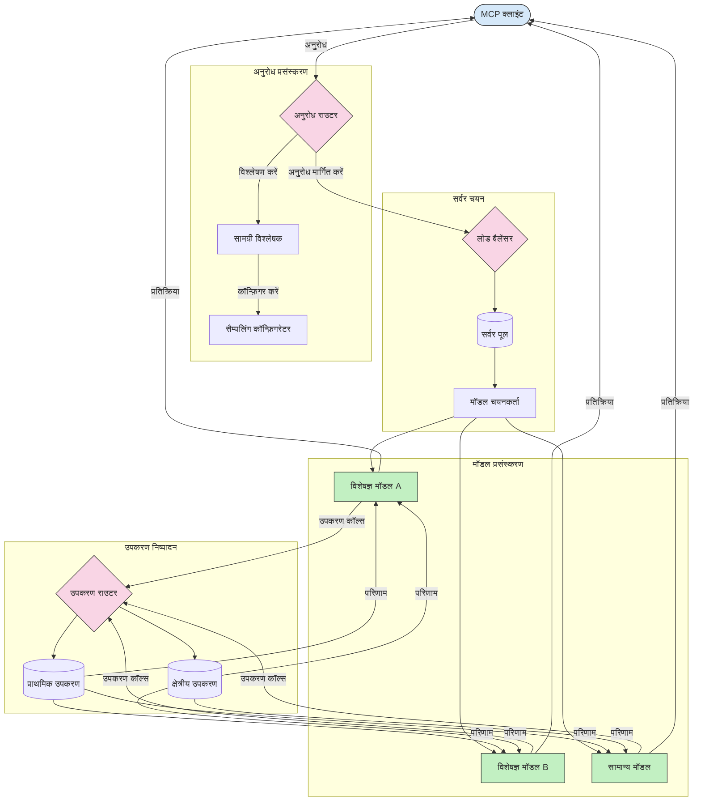

# मॉडल संदर्भ प्रोटोकॉल में रूटिंग

रूटिंग MCP इकोसिस्टम के भीतर उचित मॉडलों, टूल्स, या सेवाओं को अनुरोध निर्देशित करने के लिए आवश्यक है।

## परिचय

मॉडल संदर्भ प्रोटोकॉल (MCP) में रूटिंग विभिन्न मानदंडों जैसे कि सामग्री प्रकार, उपयोगकर्ता संदर्भ, और सिस्टम लोड के आधार पर सबसे उपयुक्त मॉडलों या सेवाओं को अनुरोध निर्देशित करने का कार्य है। यह कुशल प्रोसेसिंग और अनुकूल संसाधन उपयोग सुनिश्चित करता है।

## सीखने के उद्देश्य

इस पाठ के अंत तक, आप सक्षम होंगे:

- MCP में रूटिंग के सिद्धांतों को समझें।
- विशेष सेवाओं को अनुरोध निर्देशित करने के लिए सामग्री-आधारित रूटिंग लागू करें।
- संसाधन उपयोग को अनुकूलित करने के लिए बुद्धिमान लोड बैलेंसिंग रणनीतियों को लागू करें।
- अनुरोध संदर्भ के आधार पर डायनामिक टूल रूटिंग लागू करें।

## सामग्री-आधारित रूटिंग

सामग्री-आधारित रूटिंग अनुरोध की सामग्री के आधार पर विशेष सेवाओं को निर्देशित करती है। उदाहरण के लिए, कोड जनरेशन से संबंधित अनुरोधों को एक विशेषीकृत कोड मॉडल को भेजा जा सकता है, जबकि रचनात्मक लेखन अनुरोधों को एक रचनात्मक लेखन मॉडल को भेजा जा सकता है।

आइए विभिन्न प्रोग्रामिंग भाषाओं में एक उदाहरण कार्यान्वयन देखें।

<details>
<summary>.NET</summary>

```csharp
// .NET Example: Content-based routing in MCP
public class ContentBasedRouter
{
    private readonly Dictionary<string, McpClient> _specializedClients;
    private readonly RoutingClassifier _classifier;
    
    public ContentBasedRouter()
    {
        // Initialize specialized clients for different domains
        _specializedClients = new Dictionary<string, McpClient>
        {
            ["code"] = new McpClient("https://code-specialized-mcp.com"),
            ["creative"] = new McpClient("https://creative-specialized-mcp.com"),
            ["scientific"] = new McpClient("https://scientific-specialized-mcp.com"),
            ["general"] = new McpClient("https://general-mcp.com")
        };
        
        // Initialize content classifier
        _classifier = new RoutingClassifier();
    }
    
    public async Task<McpResponse> RouteAndProcessAsync(string prompt, IDictionary<string, object> parameters = null)
    {
        // Classify the prompt to determine the best specialized service
        string category = await _classifier.ClassifyPromptAsync(prompt);
        
        // Get the appropriate client or fall back to general
        var client = _specializedClients.ContainsKey(category) 
            ? _specializedClients[category] 
            : _specializedClients["general"];
            
        Console.WriteLine($"Routing request to {category} specialized service");
        
        // Send request to the selected service
        return await client.SendPromptAsync(prompt, parameters);
    }
    
    // Simple classifier for routing decisions
    private class RoutingClassifier
    {
        public Task<string> ClassifyPromptAsync(string prompt)
        {
            prompt = prompt.ToLowerInvariant();
            
            if (prompt.Contains("code") || prompt.Contains("function") || 
                prompt.Contains("program") || prompt.Contains("algorithm"))
            {
                return Task.FromResult("code");
            }
            
            if (prompt.Contains("story") || prompt.Contains("creative") || 
                prompt.Contains("imagine") || prompt.Contains("design"))
            {
                return Task.FromResult("creative");
            }
            
            if (prompt.Contains("science") || prompt.Contains("research") || 
                prompt.Contains("analyze") || prompt.Contains("study"))
            {
                return Task.FromResult("scientific");
            }
            
            return Task.FromResult("general");
        }
    }
}
```

उपरोक्त कोड में, हमने:

- `ContentBasedRouter` क्लास बनाया है जो प्रॉम्प्ट की सामग्री के आधार पर अनुरोधों को रूट करता है।
- विभिन्न डोमेन (कोड, रचनात्मक, वैज्ञानिक, सामान्य) के लिए विशिष्ट क्लाइंट्स इनिशियलाइज़ किए हैं।
- एक सरल क्लासिफायर लागू किया है जो प्रॉम्प्ट की श्रेणी निर्धारित करता है और इसे उपयुक्त विशेषीकृत सेवा को रूट करता है।
- एक फॉलबैक मेकेनिज्म का उपयोग किया है ताकि यदि कोई विशेषीकृत सेवा उपलब्ध न हो तो अनुरोधों को सामान्य सेवा को रूट किया जा सके।
- अनुरोधों को कुशलतापूर्वक हैंडल करने के लिए असिंक्रोनस प्रोसेसिंग लागू की है।
- सामग्री श्रेणियों को विशेषीकृत MCP क्लाइंट्स से मैप करने के लिए एक डिक्शनरी का उपयोग किया है।
- एक सरल क्लासिफायर लागू किया है जो प्रॉम्प्ट का विश्लेषण करता है और उपयुक्त श्रेणी लौटाता है।
- अनुरोध भेजने और प्रतिक्रिया प्राप्त करने के लिए विशेषीकृत क्लाइंट का उपयोग किया है।
- उन मामलों को संभाला है जहां प्रॉम्प्ट किसी भी विशेषीकृत श्रेणी से मेल नहीं खाता, सामान्य सेवा को रूटिंग कर के।

</details>

## बुद्धिमान लोड बैलेंसिंग

लोड बैलेंसिंग संसाधन उपयोग को अनुकूलित करता है और MCP सेवाओं के लिए उच्च उपलब्धता सुनिश्चित करता है। लोड बैलेंसिंग लागू करने के विभिन्न तरीके हैं, जैसे राउंड-रॉबिन, वेटेड रिस्पांस टाइम, या कंटेंट-अवेयर रणनीतियाँ।

आइए नीचे दिए गए उदाहरण कार्यान्वयन को देखें जो निम्नलिखित रणनीतियों का उपयोग करता है:

- **राउंड रॉबिन**: उपलब्ध सर्वरों में समान रूप से अनुरोध वितरित करता है।
- **वेटेड रिस्पांस टाइम**: सर्वरों को उनके औसत प्रतिक्रिया समय के आधार पर अनुरोध भेजता है।
- **कंटेंट-अवेयर**: अनुरोध की सामग्री के आधार पर विशेषीकृत सर्वरों को निर्देशित करता है।

<details>
<summary>Java</summary>

```java
// Java उदाहरण: MCP सर्वरों के लिए बुद्धिमान लोड संतुलन
public class McpLoadBalancer {
    private final List<McpServerNode> serverNodes;
    private final LoadBalancingStrategy strategy;
    
    public McpLoadBalancer(List<McpServerNode> nodes, LoadBalancingStrategy strategy) {
        this.serverNodes = new ArrayList<>(nodes);
        this.strategy = strategy;
    }
    
    public McpResponse processRequest(McpRequest request) {
        // रणनीति के आधार पर सर्वश्रेष्ठ सर्वर चुनें
        McpServerNode selectedNode = strategy.selectNode(serverNodes, request);
        
        try {
            // चयनित नोड को अनुरोध रूट करें
            return selectedNode.processRequest(request);
        } catch (Exception e) {
            // विफलता से निपटें - पुनः प्रयास या फॉलबैक लॉजिक लागू करें
            System.err.println("Error processing request on node " + selectedNode.getId() + ": " + e.getMessage());
            
            // नोड को संभावित रूप से अस्वास्थ्यकर के रूप में चिह्नित करें
            selectedNode.recordFailure();
            
            // फॉलबैक के रूप में अगला सबसे अच्छा नोड आज़माएँ
            List<McpServerNode> remainingNodes = new ArrayList<>(serverNodes);
            remainingNodes.remove(selectedNode);
            
            if (!remainingNodes.isEmpty()) {
                McpServerNode fallbackNode = strategy.selectNode(remainingNodes, request);
                return fallbackNode.processRequest(request);
            } else {
                throw new RuntimeException("All MCP server nodes failed to process the request");
            }
        }
    }
    
    // नोड स्वास्थ्य जांच कार्य
    public void startHealthChecks(Duration interval) {
        ScheduledExecutorService scheduler = Executors.newScheduledThreadPool(1);
        scheduler.scheduleAtFixedRate(() -> {
            for (McpServerNode node : serverNodes) {
                try {
                    boolean isHealthy = node.checkHealth();
                    System.out.println("Node " + node.getId() + " health status: " + 
                                      (isHealthy ? "HEALTHY" : "UNHEALTHY"));
                } catch (Exception e) {
                    System.err.println("Health check failed for node " + node.getId());
                    node.setHealthy(false);
                }
            }
        }, 0, interval.toMillis(), TimeUnit.MILLISECONDS);
    }
    
    // लोड संतुलन रणनीतियों के लिए इंटरफ़ेस
    public interface LoadBalancingStrategy {
        McpServerNode selectNode(List<McpServerNode> nodes, McpRequest request);
    }
    
    // राउंड-रॉबिन रणनीति
    public static class RoundRobinStrategy implements LoadBalancingStrategy {
        private AtomicInteger counter = new AtomicInteger(0);
        
        @Override
        public McpServerNode selectNode(List<McpServerNode> nodes, McpRequest request) {
            List<McpServerNode> healthyNodes = nodes.stream()
                .filter(McpServerNode::isHealthy)
                .collect(Collectors.toList());
            
            if (healthyNodes.isEmpty()) {
                throw new RuntimeException("No healthy nodes available");
            }
            
            int index = counter.getAndIncrement() % healthyNodes.size();
            return healthyNodes.get(index);
        }
    }
    
    // भारित प्रतिक्रिया समय रणनीति
    public static class ResponseTimeStrategy implements LoadBalancingStrategy {
        @Override
        public McpServerNode selectNode(List<McpServerNode> nodes, McpRequest request) {
            return nodes.stream()
                .filter(McpServerNode::isHealthy)
                .min(Comparator.comparing(McpServerNode::getAverageResponseTime))
                .orElseThrow(() -> new RuntimeException("No healthy nodes available"));
        }
    }
    
    // सामग्री-सचेत रणनीति
    public static class ContentAwareStrategy implements LoadBalancingStrategy {
        @Override
        public McpServerNode selectNode(List<McpServerNode> nodes, McpRequest request) {
            // अनुरोध की विशेषताएँ निर्धारित करें
            boolean isCodeRequest = request.getPrompt().contains("code") || 
                                   request.getAllowedTools().contains("codeInterpreter");
            
            boolean isCreativeRequest = request.getPrompt().contains("creative") || 
                                       request.getPrompt().contains("story");
            
            // विशिष्ट नोड खोजें
            Optional<McpServerNode> specializedNode = nodes.stream()
                .filter(McpServerNode::isHealthy)
                .filter(node -> {
                    if (isCodeRequest && node.getSpecialization().equals("code")) {
                        return true;
                    }
                    if (isCreativeRequest && node.getSpecialization().equals("creative")) {
                        return true;
                    }
                    return false;
                })
                .findFirst();
            
            // विशिष्ट नोड या सबसे कम लोड वाला नोड लौटाएं
            return specializedNode.orElse(
                nodes.stream()
                    .filter(McpServerNode::isHealthy)
                    .min(Comparator.comparing(McpServerNode::getCurrentLoad))
                    .orElseThrow(() -> new RuntimeException("No healthy nodes available"))
            );
        }
    }
}
```

उपरोक्त कोड में, हमने:

- `McpLoadBalancer` क्लास बनाया है जो MCP सर्वर नोड्स की सूची प्रबंधित करता है और चयनित लोड बैलेंसिंग रणनीति के आधार पर अनुरोध रूट करता है।
- विभिन्न लोड बैलेंसिंग रणनीतियाँ लागू की हैं: `RoundRobinStrategy`, `ResponseTimeStrategy`, और `ContentAwareStrategy`।
- सर्वर नोड्स के स्वास्थ्य की नियमित जांच के लिए `ScheduledExecutorService` का उपयोग किया है।
- एक स्वास्थ्य जांच मेकेनिज्म लागू किया है जो प्रतिक्रिया के आधार पर नोड्स को स्वस्थ या अस्वस्थ चिह्नित करता है।
- उच्च उपलब्धता सुनिश्चित करने के लिए त्रुटि हैंडलिंग और फॉलबैक लॉजिक के साथ अनुरोध प्रसंस्करण को संभाला है।
- प्रत्येक MCP सर्वर नोड का प्रतिनिधित्व करने के लिए `McpServerNode` क्लास का उपयोग किया है, जिसमें उनकी स्वास्थ्य स्थिति, औसत प्रतिक्रिया समय, और वर्तमान लोड शामिल हैं।
- अनुरोध विवरण जैसे प्रॉम्प्ट और अनुमति प्राप्त टूल्स को संलग्न करने के लिए `McpRequest` क्लास लागू किया है।
- स्वास्थ्य स्थिति और विशेषज्ञता के आधार पर नोड्स को छांटने और चुनने के लिए Java Streams का उपयोग किया है।

</details>

## डायनेमिक टूल रूटिंग

टूल रूटिंग सुनिश्चित करता है कि टूल कॉल्स संदर्भ के आधार पर सबसे उपयुक्त सेवा को निर्देशित किए जाते हैं। उदाहरण के लिए, मौसम टूल कॉल को उपयोगकर्ता के स्थान के आधार पर एक क्षेत्रीय एंडपॉइंट को भेजा जा सकता है, या एक कैलकुलेटर टूल को API के किसी विशिष्ट संस्करण का उपयोग करना पड़ सकता है।

आइए एक उदाहरण कार्यान्वयन देखें जो अनुरोध विश्लेषण, क्षेत्रीय एंडपॉइंट्स, और संस्करण समर्थन के आधार पर डायनेमिक टूल रूटिंग को दर्शाता है।

<details>
<summary>Python</summary>

```python
# पायथन उदाहरण: अनुरोध विश्लेषण के आधार पर डायनेमिक टूल रूटिंग
class McpToolRouter:
    def __init__(self):
        # उपलब्ध टूल एंडपॉइंट्स पंजीकृत करें
        self.tool_endpoints = {
            "weatherTool": "https://weather-service.example.com/api",
            "calculatorTool": "https://calculator-service.example.com/compute",
            "databaseTool": "https://database-service.example.com/query",
            "searchTool": "https://search-service.example.com/search"
        }
        
        # वैश्विक वितरण के लिए क्षेत्रीय एंडपॉइंट्स
        self.regional_endpoints = {
            "us": {
                "weatherTool": "https://us-west.weather-service.example.com/api",
                "searchTool": "https://us.search-service.example.com/search"
            },
            "europe": {
                "weatherTool": "https://eu.weather-service.example.com/api",
                "searchTool": "https://eu.search-service.example.com/search"
            },
            "asia": {
                "weatherTool": "https://asia.weather-service.example.com/api",
                "searchTool": "https://asia.search-service.example.com/search"
            }
        }
        
        # टूल संस्करण समर्थन
        self.tool_versions = {
            "weatherTool": {
                "default": "v2",
                "v1": "https://weather-service.example.com/api/v1",
                "v2": "https://weather-service.example.com/api/v2",
                "beta": "https://weather-service.example.com/api/beta"
            }
        }
    
    async def route_tool_request(self, tool_name, parameters, user_context=None):
        """Route a tool request to the appropriate endpoint based on context"""
        endpoint = self._select_endpoint(tool_name, parameters, user_context)
        
        if not endpoint:
            raise ValueError(f"No endpoint available for tool: {tool_name}")
        
        # चयनित एंडपॉइंट पर वास्तविक अनुरोध करें
        return await self._execute_tool_request(endpoint, tool_name, parameters)
    
    def _select_endpoint(self, tool_name, parameters, user_context=None):
        """Select the most appropriate endpoint based on context"""
        # रजिस्ट्री से बेस एंडपॉइंट
        if tool_name not in self.tool_endpoints:
            return None
            
        base_endpoint = self.tool_endpoints[tool_name]
        
        # जांचें कि क्या हमें किसी विशिष्ट टूल संस्करण का उपयोग करना है
        if tool_name in self.tool_versions:
            version_info = self.tool_versions[tool_name]
            
            # निर्दिष्ट संस्करण या डिफ़ॉल्ट का उपयोग करें
            requested_version = parameters.get("_version", version_info["default"])
            if requested_version in version_info:
                base_endpoint = version_info[requested_version]
        
        # जांचें कि यदि उपयोगकर्ता क्षेत्र ज्ञात हो तो क्षेत्रीय रूटिंग आवश्यक है
        if user_context and "region" in user_context:
            user_region = user_context["region"]
            
            if user_region in self.regional_endpoints:
                regional_tools = self.regional_endpoints[user_region]
                
                if tool_name in regional_tools:
                    # क्षेत्र-विशिष्ट एंडपॉइंट का उपयोग करें
                    return regional_tools[tool_name]
        
        # डेटा निवासीता आवश्यकताओं की जांच करें
        if user_context and "data_residency" in user_context:
            # यह यह सुनिश्चित करने के लिए तर्क लागू करेगा कि डेटा निर्दिष्ट क्षेत्राधिकार में ही रहे
            pass
        
        # लेटेंसी-आधारित रूटिंग की जांच करें
        if user_context and "latency_sensitive" in user_context and user_context["latency_sensitive"]:
            # यह सबसे कम लेटेंसी एंडपॉइंट चुनने के लिए तर्क लागू करेगा
            pass
            
        return base_endpoint
        
    async def _execute_tool_request(self, endpoint, tool_name, parameters):
        """Execute the actual tool request to the selected endpoint"""
        try:
            async with aiohttp.ClientSession() as session:
                async with session.post(
                    endpoint,
                    json={"toolName": tool_name, "parameters": parameters},
                    headers={"Content-Type": "application/json"}
                ) as response:
                    if response.status == 200:
                        result = await response.json()
                        return result
                    else:
                        error_text = await response.text()
                        raise Exception(f"Tool execution failed: {error_text}")
        except Exception as e:
            # पुन: प्रयास तर्क या फालबैक रणनीति लागू करें
            print(f"Error executing tool {tool_name} at {endpoint}: {str(e)}")
            raise
```

उपरोक्त कोड में, हमने:

- `McpToolRouter` क्लास बनाया है जो अनुरोध विश्लेषण, क्षेत्रीय एंडपॉइंट्स, और संस्करण समर्थन के आधार पर टूल रूटिंग प्रबंधित करता है।
- उपलब्ध टूल एंडपॉइंट्स और वैश्विक वितरण के लिए क्षेत्रीय एंडपॉइंट्स को पंजीकृत किया है।
- उपयोगकर्ता संदर्भ जैसे क्षेत्र और डेटा आवास आवश्यकताओं के आधार पर उपयुक्त एंडपॉइंट चुनने के लिए डायनेमिक रूटिंग लॉजिक लागू किया है।
- टूल्स के लिए संस्करण समर्थन लागू किया है, जिससे उपयोगकर्ता यह निर्दिष्ट कर सकते हैं कि वे किस संस्करण का उपयोग करना चाहते हैं।
- टूल कॉल्स को निष्पादित करने और प्रतिक्रियाओं को संभालने के लिए असिंक्रोनस HTTP अनुरोधों का उपयोग किया है।

</details>

## MCP में सैंपलिंग और रूटिंग वास्तुकला

सैंपलिंग मॉडल संदर्भ प्रोटोकॉल (MCP) का एक महत्वपूर्ण घटक है जो कुशल अनुरोध प्रसंस्करण और रूटिंग की अनुमति देता है। इसमें आने वाले अनुरोधों का विश्लेषण करना शामिल है ताकि विभिन्न मानदंडों जैसे सामग्री प्रकार, उपयोगकर्ता संदर्भ, और सिस्टम लोड के आधार पर उन्हें संभालने के लिए सबसे उपयुक्त मॉडल या सेवा निर्धारित की जा सके।

सैंपलिंग और रूटिंग को मिलाकर एक मजबूत वास्तुकला बनाई जा सकती है जो संसाधन उपयोग को अनुकूलित करती है और उच्च उपलब्धता सुनिश्चित करती है। सैंपलिंग प्रक्रिया का उपयोग अनुरोधों को वर्गीकृत करने के लिए किया जा सकता है, जबकि रूटिंग उन्हें उचित मॉडलों या सेवाओं को निर्देशित करती है।

नीचे दिया गया चित्र दर्शाता है कि कैसे सैंपलिंग और रूटिंग मिलकर एक व्यापक MCP वास्तुकला में काम करते हैं:



## आगे क्या है

- [5.6 Sampling](../mcp-sampling/README.md)

---

<!-- CO-OP TRANSLATOR DISCLAIMER START -->
**अस्वीकरण**:
इस दस्तावेज़ का अनुवाद AI अनुवाद सेवा [Co-op Translator](https://github.com/Azure/co-op-translator) का उपयोग करके किया गया है। जबकि हम सटीकता के लिए प्रयास करते हैं, कृपया ध्यान दें कि स्वचालित अनुवादों में त्रुटियाँ या अशुद्धियाँ हो सकती हैं। मूल दस्तावेज़ अपनी मूल भाषा में ही प्रामाणिक स्रोत माना जाना चाहिए। महत्वपूर्ण जानकारी के लिए, पेशेवर मानव अनुवाद की सिफारिश की जाती है। इस अनुवाद के उपयोग से उत्पन्न किसी भी गलतफहमी या गलत व्याख्या के लिए हम उत्तरदायी नहीं हैं।
<!-- CO-OP TRANSLATOR DISCLAIMER END -->