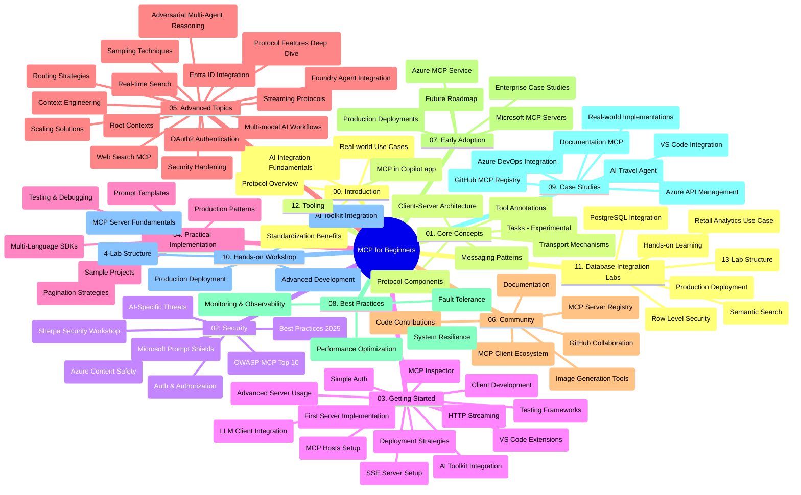

# शुरुआती के लिए मॉडल संदर्भ प्रोटोकॉल (MCP) - अध्ययन गाइड

यह अध्ययन गाइड "शुरुआती के लिए मॉडल संदर्भ प्रोटोकॉल (MCP)" पाठ्यक्रम के लिए रिपॉजिटरी संरचना और सामग्री का अवलोकन प्रदान करता है। इस गाइड का उपयोग रिपॉजिटरी में कुशलतापूर्वक नेविगेट करने और उपलब्ध संसाधनों का अधिकतम उपयोग करने के लिए करें।

## रिपॉजिटरी का अवलोकन

मॉडल संदर्भ प्रोटोकॉल (MCP) AI मॉडलों और क्लाइंट एप्लिकेशन के बीच इंटरैक्शन के लिए एक मानकीकृत फ्रेमवर्क है। इसे शुरू में Anthropic द्वारा बनाया गया था, लेकिन अब इसे आधिकारिक GitHub संगठन के माध्यम से व्यापक MCP समुदाय द्वारा बनाए रखा जाता है। यह रिपॉजिटरी C#, Java, JavaScript, Python, और TypeScript में हाथों-हाथ कोड उदाहरणों के साथ एक व्यापक पाठ्यक्रम प्रदान करती है, जिसे AI डेवलपर्स, सिस्टम आर्किटेक्ट्स, और सॉफ्टवेयर इंजीनियरों के लिए डिज़ाइन किया गया है।

## दृश्य पाठ्यक्रम मानचित्र

## रिपॉजिटरी संरचना

रिपॉजिटरी बारह मुख्य अनुभागों में व्यवस्थित है, जो MCP के विभिन्न पहलुओं पर केंद्रित हैं:

1. **परिचय (00-Introduction/)**
   - मॉडल संदर्भ प्रोटोकॉल का अवलोकन
   - AI पाइपलाइनों में मानकीकरण क्यों महत्वपूर्ण है
   - व्यावहारिक उपयोग मामले और लाभ

2. **कोर अवधारणाएँ (01-CoreConcepts/)**
   - क्लाइंट-सर्वर आर्किटेक्चर
   - मुख्य प्रोटोकॉल घटक
   - MCP में मैसेजिंग पैटर्न
   - आगे की ओर देखना: [MCP में क्या बदल रहा है: 2026-07-28 रिलीज़ कैंडिडेट](./01-CoreConcepts/mcp-2026-07-28-release-candidate.md) — अगली विनिर्देशन संस्करण में अपेक्षित स्टेटलेस प्रोटोकॉल कोर, एक्सटेंशंस फ्रेमवर्क, और रूट्स/सैंपलिंग/लॉगिंग का परित्याग

3. **सुरक्षा (02-Security/)**
   - MCP-आधारित सिस्टम में सुरक्षा खतरे
   - कार्यान्वयन सुरक्षित करने के सर्वोत्तम अभ्यास
   - प्रमाणीकरण और प्राधिकरण रणनीतियाँ
   - **व्यापक सुरक्षा दस्तावेज़ीकरण**:
     - MCP सुरक्षा सर्वोत्तम अभ्यास 2025
     - Azure सामग्री सुरक्षा कार्यान्वयन गाइड
     - MCP सुरक्षा नियंत्रण और तकनीकें
     - MCP सर्वोत्तम अभ्यास त्वरित संदर्भ
   - **मुख्य सुरक्षा विषय**:
     - प्रॉम्प्ट इंजेक्शन और टूल पॉयज़निंग हमले
     - सत्र हाईजैकिंग और कन्फ्यूज्ड डिप्टी समस्याएं
     - टोकन पासथ्रू कमजोरियाँ
     - अत्यधिक अनुमतियाँ और एक्सेस नियंत्रण
     - AI घटकों की सप्लाई चेन सुरक्षा
     - माइक्रोसॉफ्ट प्रॉम्प्ट शील्ड्स इंटीग्रेशन

4. **शुरुआत करना (03-GettingStarted/)**
   - परिवेश सेटअप और विन्यास
   - बुनियादी MCP सर्वर और क्लाइंट बनाना
   - मौजूदा अनुप्रयोगों के साथ एकीकरण
   - इसमें निम्नलिखित अनुभाग शामिल हैं:
     - पहला सर्वर कार्यान्वयन
     - क्लाइंट विकास
     - LLM क्लाइंट एकीकरण
     - VS कोड एकीकरण
     - सर्वर-सेंट इवेंट्स (SSE) सर्वर
     - उन्नत सर्वर उपयोग
     - HTTP स्ट्रीमिंग
     - AI टूलकिट एकीकरण
     - परीक्षण रणनीतियाँ
     - परिनियोजन दिशानिर्देश

5. **व्यावहारिक कार्यान्वयन (04-PracticalImplementation/)**
   - विभिन्न प्रोग्रामिंग भाषाओं में SDK का उपयोग
   - डिबगिंग, परीक्षण, और मान्यता तकनीकें
   - पुन: प्रयोज्य प्रॉम्प्ट टेम्पलेट्स और वर्कफ़्लोज़ बनाना
   - कार्यान्वयन उदाहरणों के साथ नमूना प्रोजेक्ट्स

6. **उन्नत विषय (05-AdvancedTopics/)**
   - संदर्भ इंजीनियरिंग तकनीकें
   - Foundry एजेंट एकीकरण
   - मल्टी-मोडल AI वर्कफ़्लोज़ 
   - OAuth2 प्रमाणीकरण डेमो
   - रियल-टाइम सर्च क्षमताएँ
   - रियल-टाइम स्ट्रीमिंग
   - रूट संदर्भ कार्यान्वयन
   - रूटिंग रणनीतियाँ
   - सैंपलिंग तकनीकें
   - स्केलिंग दृष्टिकोण
   - सुरक्षा विचार
   - Entra ID सुरक्षा एकीकरण
   - वेब सर्च एकीकरण
   - विरोधात्मक मल्टी-एजेंट तर्क (बहस पैटर्न)

7. **समुदाय योगदान (06-CommunityContributions/)**
   - कोड और दस्तावेज़ योगदान कैसे करें
   - GitHub के माध्यम से सहयोग
   - समुदाय-संचालित सुधार और प्रतिक्रिया
   - विभिन्न MCP क्लाइंट्स का उपयोग (Claude Desktop, Cline, VSCode)
   - लोकप्रिय MCP सर्वर्स के साथ काम करना जिसमें इमेज जनरेशन शामिल है

8. **आरंभिक अंगीकार से सीखें (07-LessonsfromEarlyAdoption/)**
   - वास्तविक दुनिया के कार्यान्वयन और सफलता कहानियाँ
   - MCP-आधारित समाधान बनाना और तैनात करना
   - रुझान और भविष्य का रोडमैप
   - **Microsoft MCP सर्वर्स गाइड**: 10 उत्पादन-तैयार Microsoft MCP सर्वर्स के लिए व्यापक मार्गदर्शिका जिसमें शामिल हैं:
     - Microsoft Learn Docs MCP सर्वर
     - Azure MCP सर्वर (15+ विशिष्ट कनेक्टर्स)
     - GitHub MCP सर्वर
     - Azure DevOps MCP सर्वर
     - MarkItDown MCP सर्वर
     - SQL Server MCP सर्वर
     - Playwright MCP सर्वर
     - Dev Box MCP सर्वर
     - Microsoft Foundry MCP सर्वर
     - Microsoft 365 Agents Toolkit MCP सर्वर

9. **सर्वोत्तम अभ्यास (08-BestPractices/)**
   - प्रदर्शन ट्यूनिंग और अनुकूलन
   - दोष सहिष्णु MCP सिस्टम डिजाइन करना
   - परीक्षण और लचीलापन रणनीतियाँ

10. **केस अध्ययन (09-CaseStudy/)**
    - **सात व्यापक केस अध्ययन** जो MCP की विविध परिस्थितियों में बहुमुखी प्रतिभा दिखाते हैं:
    - **Azure AI ट्रैवल एजेंट्स**: Azure OpenAI और AI सर्च के साथ मल्टी-एजेंट ऑर्केस्ट्रेशन
    - **Azure DevOps एकीकरण**: YouTube डेटा अपडेट के साथ वर्कफ़्लो प्रक्रियाओं का स्वचालन
    - **रियल-टाइम दस्तावेज़ीकरण पुनः प्राप्ति**: स्ट्रीमिंग HTTP के साथ Python कंसोल क्लाइंट
    - **इंटरएक्टिव स्टडी प्लान जनरेटर**: Chainlit वेब ऐप के साथ संवादात्मक AI
    - **इन-एडिटर दस्तावेज़ीकरण**: GitHub Copilot वर्कफ़्लोज़ के साथ VS कोड एकीकरण
    - **Azure API प्रबंधन**: MCP सर्वर निर्माण के साथ एंटरप्राइज़ API एकीकरण
    - **GitHub MCP रजिस्ट्री**: इकोसिस्टम विकास और एजेंटिक एकीकरण प्लेटफ़ॉर्म
    - उद्यम एकीकरण, डेवलपर उत्पादकता, और इकोसिस्टम विकास के उदाहरण कार्यान्वयन

11. **हैंड्स-ऑन कार्यशाला (10-StreamliningAIWorkflowsBuildingAnMCPServerWithAIToolkit/)**
    - MCP को AI टूलकिट के साथ जोड़ने वाली व्यापक हैंड्स-ऑन कार्यशाला
    - AI मॉडलों को वास्तविक-विश्व उपकरणों से जोड़ने वाले बुद्धिमान अनुप्रयोग बनाना
    - मूल बातें, कस्टम सर्वर विकास, और उत्पादन तैनाती रणनीतियों को कवर करने वाले व्यावहारिक मॉड्यूल
    - **प्रयोगशाला संरचना**:
      - प्रयोगशाला 1: MCP सर्वर के मूल सिद्धांत
      - प्रयोगशाला 2: उन्नत MCP सर्वर विकास
      - प्रयोगशाला 3: AI टूलकिट एकीकरण
      - प्रयोगशाला 4: उत्पादन तैनाती और स्केलिंग
    - चरण-दर-चरण निर्देशों के साथ प्रयोगशाला-आधारित सीखने का तरीका

12. **MCP सर्वर डेटाबेस इंटीग्रेशन लैब्स (11-MCPServerHandsOnLabs/)**
    - उत्पादन-तैयार MCP सर्वर्स के निर्माण के लिए **व्यापक 13-प्रयोगशाला सीखने का मार्ग** PostgreSQL इंटीग्रेशन के साथ
    - **वास्तविक दुनिया के रिटेल एनालिटिक्स कार्यान्वयन** ज़ावा रिटेल उपयोग केस का उपयोग करते हुए
    - **एंटरप्राइज़-ग्रेड पैटर्न** जिनमें शामिल हैं रो लेवल सिक्योरिटी (RLS), सेमेंटिक सर्च, और मल्टी-टेनेंट डेटा एक्सेस
    - **पूर्ण प्रयोगशाला संरचना**:
      - **प्रयोगशालाएँ 00-03: नींव** - परिचय, आर्किटेक्चर, सुरक्षा, परिवेश सेटअप
      - **प्रयोगशालाएँ 04-06: MCP सर्वर बनाना** - डेटाबेस डिज़ाइन, MCP सर्वर कार्यान्वयन, टूल विकास
      - **प्रयोगशालाएँ 07-09: उन्नत फीचर्स** - सेमेंटिक सर्च, परीक्षण और डिबगिंग, VS कोड एकीकरण
      - **प्रयोगशालाएँ 10-12: उत्पादन और सर्वोत्तम अभ्यास** - तैनाती, निगरानी, अनुकूलन
    - **शामिल तकनीकें**: FastMCP फ्रेमवर्क, PostgreSQL, Azure OpenAI, Azure कंटेनर ऐप्स, एप्लिकेशन इनसाइट्स
    - **सीखने के परिणाम**: उत्पादन-तैयार MCP सर्वर, डेटाबेस इंटीग्रेशन पैटर्न, AI-शक्तिकृत एनालिटिक्स, एंटरप्राइज़ सुरक्षा

13. **टूलिंग (12-tooling/)**
    - जानें कि MCP को Copilot ऐप और अन्य टूल्स में कैसे उपयोग करें

## अतिरिक्त संसाधन

रिपॉजिटरी में समर्थन संसाधन शामिल हैं:

- **इमेज फोल्डर**: पाठ्यक्रम भर में प्रयुक्त डायग्राम और चित्र
- **अनुवाद**: दस्तावेज़ीकरण के बहुभाषी स्वचालित अनुवाद
- **आधिकारिक MCP संसाधन**:
  - [MCP Documentation](https://modelcontextprotocol.io/)
  - [MCP Specification](https://spec.modelcontextprotocol.io/)
  - [MCP GitHub Repository](https://github.com/modelcontextprotocol)

## इस रिपॉजिटरी का उपयोग कैसे करें

1. **क्रमिक शिक्षा**: संरचित सीखने के लिए अध्यायों को क्रम में (00 से 11 तक) पढ़ें।
2. **भाषा-केंद्रित फोकस**: यदि आप किसी विशिष्ट प्रोग्रामिंग भाषा में रुचि रखते हैं, तो नमूना निर्देशिकाओं में अपनी पसंदीदा भाषा के लिए कार्यान्वयन देखें।
3. **व्यावहारिक कार्यान्वयन**: अपने परिवेश को सेट अप करने और अपना पहला MCP सर्वर एवं क्लाइंट बनाने के लिए "शुरुआत करना" अनुभाग से शुरू करें।
4. **उन्नत अन्वेषण**: बुनियादी बातों में निपुण होने के बाद, अपने ज्ञान का विस्तार करने के लिए उन्नत विषयों में गहराई से उतरें।
5. **समुदाय सहभागिता**: विशेषज्ञों और अन्य डेवलपर्स से जुड़ने के लिए GitHub चर्चाओं और Discord चैनलों के माध्यम से MCP समुदाय में शामिल हों।

## MCP क्लाइंट्स और टूल्स

पाठ्यक्रम में विभिन्न MCP क्लाइंट्स और टूल्स शामिल हैं:

1. **आधिकारिक क्लाइंट्स**:
   - Visual Studio Code 
   - Visual Studio Code में MCP
   - Claude Desktop
   - VSCode में Claude 
   - Claude API

2. **समुदाय क्लाइंट्स**:
   - Cline (टर्मिनल-आधारित)
   - Cursor (कोड संपादक)
   - ChatMCP
   - Windsurf

3. **MCP प्रबंधन टूल्स**:
   - MCP CLI
   - MCP मैनेजर
   - MCP लिंकर्स
   - MCP राउटर

## लोकप्रिय MCP सर्वर

रिपॉजिटरी में विभिन्न MCP सर्वर्स शामिल हैं, जैसे:

1. **आधिकारिक Microsoft MCP सर्वर्स**:
   - Microsoft Learn Docs MCP सर्वर
   - Azure MCP सर्वर (15+ विशेष कनेक्टर्स)
   - GitHub MCP सर्वर
   - Azure DevOps MCP सर्वर
   - MarkItDown MCP सर्वर
   - SQL Server MCP सर्वर
   - Playwright MCP सर्वर
   - Dev Box MCP सर्वर
   - Microsoft Foundry MCP सर्वर
   - Microsoft 365 Agents Toolkit MCP सर्वर

2. **आधिकारिक संदर्भ सर्वर्स**:
   - फ़ाइल सिस्टम
   - Fetch
   - मेमोरी
   - अनुक्रमिक सोच

3. **इमेज जनरेशन**:
   - Azure OpenAI DALL-E 3
   - स्टेबल डिफ्यूज़न वेबयूआई
   - Replicate

4. **विकास टूल्स**:
   - Git MCP
   - टर्मिनल नियंत्रण
   - कोड असिस्टेंट

5. **विशिष्ट सर्वर्स**:
   - Salesforce
   - Microsoft Teams
   - Jira और Confluence

## योगदान

यह रिपॉजिटरी समुदाय से योगदान स्वीकार करती है। MCP इकोसिस्टम में प्रभावी योगदान के लिए मार्गदर्शन के लिए समुदाय योगदान अनुभाग देखें।

----

*इस अध्ययन गाइड को आखिरी बार 5 फरवरी, 2026 को अपडेट किया गया था, जो नवीनतम MCP विनिर्देशन 2025-11-25 को दर्शाता है और उस तिथि तक रिपॉजिटरी का अवलोकन प्रदान करता है। रिपॉजिटरी सामग्री इस तिथि के बाद अपडेट हो सकती है।*

*परिशिष्ट (2 जुलाई, 2026): `2026-07-28` MCP विनिर्देशन रिलीज़ कैंडिडेट पर एक पाठ [01-CoreConcepts](./01-CoreConcepts/mcp-2026-07-28-release-candidate.md) के अंतर्गत जोड़ा गया; पाठ्यक्रम आधार 2025-11-25 बना रहता है जब तक नई विनिर्देशन जारी नहीं होती।*

---

<!-- CO-OP TRANSLATOR DISCLAIMER START -->
**अस्वीकरण**:
इस दस्तावेज़ का अनुवाद AI अनुवाद सेवा [Co-op Translator](https://github.com/Azure/co-op-translator) का उपयोग करके किया गया है। जबकि हम सटीकता के लिए प्रयास करते हैं, कृपया ध्यान दें कि स्वचालित अनुवादों में त्रुटियाँ या अशुद्धियाँ हो सकती हैं। मूल दस्तावेज़ अपनी मूल भाषा में ही प्रामाणिक स्रोत माना जाना चाहिए। महत्वपूर्ण जानकारी के लिए, पेशेवर मानव अनुवाद की सिफारिश की जाती है। इस अनुवाद के उपयोग से उत्पन्न किसी भी गलतफहमी या गलत व्याख्या के लिए हम उत्तरदायी नहीं हैं।
<!-- CO-OP TRANSLATOR DISCLAIMER END -->