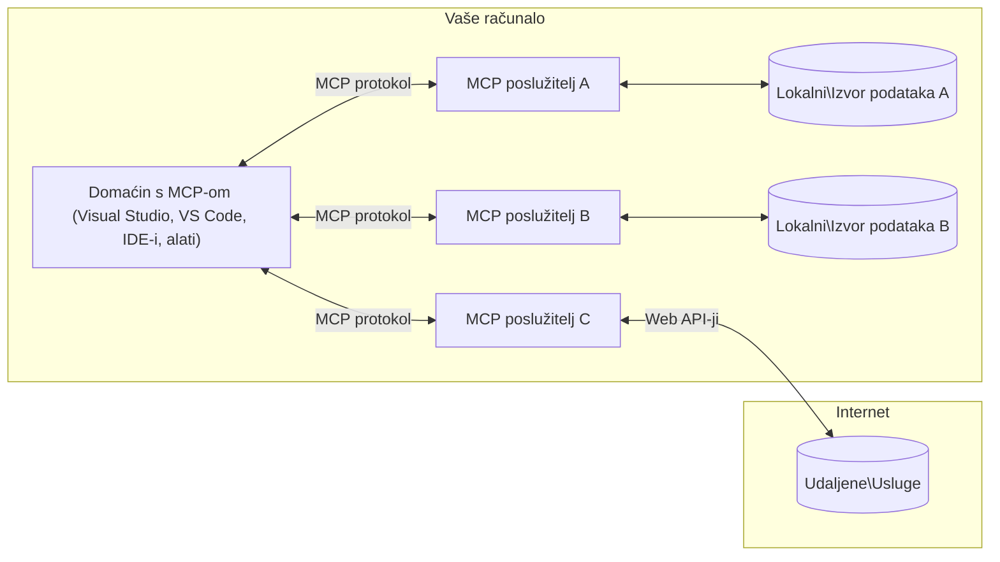

# Osnovni Koncepti MCP-a: Ovladavanje Protokolom Konteksta Modela za AI Integraciju

[](https://youtu.be/earDzWGtE84)

_(Kliknite sliku iznad za pregled videa ove lekcije)_

[Model Context Protocol (MCP)](https://github.com/modelcontextprotocol) je moćan, standardizirani okvir koji optimizira komunikaciju između velikih jezičnih modela (LLM-ova) i vanjskih alata, aplikacija i izvora podataka.
Ovaj vodič će vas provesti kroz osnovne koncepte MCP-a. Naučit ćete o njegovoj klijent-poslužiteljskoj arhitekturi, ključnim komponentama, mehanizmima komunikacije te najboljim praksama implementacije.

- **Jasna korisnička suglasnost**: Pristup svim podacima i operacijama zahtijeva izričitu korisničku suglasnost prije izvršenja. Korisnici moraju jasno razumjeti koji će se podaci koristiti i koje će se radnje vršiti, s detaljnom kontrolom dozvola i autorizacija.

- **Zaštita privatnosti podataka**: Korisnički se podaci izlažu samo uz izričitu suglasnost i moraju biti zaštićeni snažnim kontrolama pristupa tijekom cijelog životnog ciklusa interakcije. Implementacije moraju spriječiti neovlašteni prijenos podataka i održavati stroge granice privatnosti.

- **Sigurnost izvršavanja alata**: Svaki poziv alata zahtijeva izričitu korisničku suglasnost s jasnim razumijevanjem funkcionalnosti alata, parametara i potencijalnog utjecaja. Snažne sigurnosne granice moraju spriječiti nenamjerno, nesigurno ili zlonamjerno izvršavanje alata.

- **Sigurnost sloja prijenosa**: Svi komunikacijski kanali trebaju koristiti odgovarajuće mehanizme enkripcije i autentikacije. Udaljene veze trebaju implementirati sigurne protokole prijenosa i pravilno upravljanje vjerodajnicama.

#### Smjernice za implementaciju:

- **Upravljanje dozvolama**: Implementirajte sustave detaljnih dozvola koje korisnicima omogućuju kontrolu pristupa poslužiteljima, alatima i resursima
- **Autentikacija i autorizacija**: Koristite sigurne metode autentikacije (OAuth, API ključevi) s pravilnim upravljanjem tokenima i istekom
- **Validacija unosa**: Provjeravajte sve parametre i ulaze podataka prema definiranih shemama radi sprječavanja injekcijskih napada
- **Evidencija aktivnosti**: Održavajte sveobuhvatne zapise svih operacija za sigurnosni nadzor i usklađenost

## Pregled

Ova lekcija istražuje temeljnu arhitekturu i komponente koje čine ekosustav Model Context Protocol-a (MCP). Naučit ćete o klijent-poslužiteljskoj arhitekturi, ključnim komponentama i komunikacijskim mehanizmima koji pokreću MCP interakcije.

## Ključni ciljevi učenja

Do kraja ove lekcije, moći ćete:

- Razumjeti klijent-poslužiteljsku arhitekturu MCP-a.
- Prepoznati uloge i odgovornosti domaćina, klijenata i poslužitelja.
- Analizirati osnovne značajke koje čine MCP fleksibilnim slojem za integraciju.
- Naučiti kako informacije teku unutar MCP ekosustava.
- Steći praktične uvide kroz primjere koda u .NET, Javi, Pythonu i JavaScriptu.

## Arhitektura MCP-a: Dublji pogled

MCP ekosustav je izgrađen na modelu klijent-poslužitelj. Ova modularna struktura omogućava AI aplikacijama učinkovitu interakciju s alatima, bazama podataka, API-jima i kontekstualnim resursima. Rastavimo ovu arhitekturu na njezine osnovne komponente.

U svojoj suštini, MCP slijedi klijent-poslužiteljsku arhitekturu gdje aplikacija domaćin može povezati se s više poslužitelja:



- **MCP domaćini**: Programi poput VSCode, Claude Desktop, IDE-ovi ili AI alati koji žele pristupiti podacima putem MCP-a
- **MCP klijenti**: Klijenti protokola koji održavaju 1:1 veze s poslužiteljima
- **MCP poslužitelji**: Laki programi koji svaki izlažu specifične mogućnosti putem standardiziranog Model Context Protocol-a
- **Lokalni izvori podataka**: Datoteke, baze podataka i usluge vašeg računala kojima MCP poslužitelji mogu sigurno pristupiti
- **Udaljene usluge**: Vanjski sustavi dostupni preko interneta s kojima se MCP poslužitelji mogu povezati putem API-ja.

MCP Protokol je razvijajući se standard koji koristi vremenski bazirano verzioniranje (format YYYY-MM-DD). Trenutna verzija protokola je **2025-11-25**. Najnovije izmjene možete vidjeti u [specifikaciji protokola](https://modelcontextprotocol.io/specification/2025-11-25/)

> **Pogled unaprijed:** kandidat za izdanje sljedeće verzije specifikacije, **2026-07-28**, najavljen je u svibnju 2026. i planiran za izdanje 28. srpnja 2026. Čini protokol bezstanjskim na transportnoj razini (uklanja `initialize` ručni pozdrav i ID-ove sesije), formalizira okvire proširenja i zastarijeva Roots, Sampling i Logging u korist novih obrazaca. Pogledajte [Što se mijenja u MCP-u: kandidat za izdanje 2026-07-28](./mcp-2026-07-28-release-candidate.md) za detaljan pregled.

### 1. Domaćini

U Model Context Protocol-u (MCP), **domaćini** su AI aplikacije koje služe kao primarno sučelje kroz koje korisnici komuniciraju s protokolom. Domaćini koordiniraju i upravljaju vezama s više MCP poslužitelja stvaranjem posvećenih MCP klijenata za svaku poslužiteljsku vezu. Primjeri domaćina uključuju:

- **AI aplikacije**: Claude Desktop, Visual Studio Code, Claude Code
- **Razvojna okruženja**: IDE i uređivači koda s MCP integracijom
- **Prilagođene aplikacije**: Specijalizirani AI agenti i alati

**Domaćini** su aplikacije koje koordiniraju interakcije AI modela. Oni:

- **Orkestriraju AI modele**: Izvršavaju ili komuniciraju s LLM-ovima za generiranje odgovora i koordinaciju AI tokova rada
- **Upravljaju klijentskim vezama**: Kreiraju i održavaju jednog MCP klijenta po vezi s MCP poslužiteljem
- **Kontroliraju korisničko sučelje**: Rukovode tijekovima razgovora, korisničkim interakcijama i prikazom odgovora
- **Provode sigurnost**: Kontroliraju dozvole, sigurnosna ograničenja i autentikaciju
- **Rukovode korisničkom suglasnošću**: Upravljaju korisničkim odobrenjem za dijeljenje podataka i izvršavanje alata


### 2. Klijenti

**Klijenti** su ključne komponente koje održavaju posvećene veze jedan na jedan između domaćina i MCP poslužitelja. Svaki MCP klijent instancira domaćin kako bi se povezao sa specifičnim MCP poslužiteljem, osiguravajući organizirane i sigurne komunikacijske kanale. Višestruki klijenti omogućuju domaćinima istovremene veze s više poslužitelja.

**Klijenti** su povezivačke komponente unutar aplikacije domaćina. Oni:

- **Komunikacija protokolom**: Šalju JSON-RPC 2.0 zahtjeve poslužiteljima s upitima i uputama
- **Pregovaranje o mogućnostima**: Pregovaraju podržane značajke i verzije protokola s poslužiteljima tijekom inicijalizacije
- **Izvršavanje alata**: Upravljaju zahtjevima za izvršavanje alata od modela i obrađuju odgovore
- **Ažuriranja u stvarnom vremenu**: Rukovode obavijestima i ažuriranjima u stvarnom vremenu od poslužitelja
- **Obrada odgovora**: Obradjuju i formatiraju odgovore poslužitelja za prikaz korisnicima

### 3. Poslužitelji

**Poslužitelji** su programi koji pružaju kontekst, alate i mogućnosti MCP klijentima. Mogu raditi lokalno (na istom računalu kao domaćin) ili udaljeno (na vanjskim platformama) te su odgovorni za obradu zahtjeva klijenata i pružanje strukturiranih odgovora. Poslužitelji izlažu specifične funkcionalnosti putem standardiziranog Model Context Protocol-a.

**Poslužitelji** su usluge koje pružaju kontekst i mogućnosti. Oni:

- **Registracija značajki**: Registriraju i izlažu dostupne primitivne značajke (resurse, upite, alate) klijentima
- **Obrada zahtjeva**: Primaju i izvršavaju pozive alata, zahtjeve za resurse i upite s klijenata
- **Pružanje konteksta**: Pružaju kontekstualne informacije i podatke za poboljšanje odgovora modela
- **Upravljanje stanjem**: Održavaju status sesije i upravljaju interakcijama sa stanjem po potrebi
- **Obavijesti u stvarnom vremenu**: Šalju obavijesti o promjenama mogućnosti i ažuriranjima povezanih klijenata

Poslužitelje može razviti bilo tko kako bi proširio mogućnosti modela specijaliziranom funkcionalnošću, i podržavaju i lokalne i udaljene scenarije implementacije.

### 4. Primitivi poslužitelja

Poslužitelji u Model Context Protocol-u (MCP) pružaju tri osnovna **primitiva** koja definiraju temeljne gradivne blokove za bogate interakcije između klijenata, domaćina i jezičnih modela. Ovi primitivni elementi specificiraju vrste kontekstualnih informacija i akcija dostupnih putem protokola.

MCP poslužitelji mogu izlagati bilo koju kombinaciju sljedećih triju osnovnih primitiva:

#### Resursi

**Resursi** su izvori podataka koji pružaju kontekstualne informacije AI aplikacijama. Oni predstavljaju statički ili dinamički sadržaj koji može poboljšati razumijevanje i donošenje odluka modela:

- **Kontekstualni podaci**: Strukturirane informacije i kontekst za konzumaciju od strane AI modela
- **Baze znanja**: Spremišta dokumenata, članci, priručnici i istraživački radovi
- **Lokalni izvori podataka**: Datoteke, baze podataka i informacije lokalnog sustava
- **Vanjski podaci**: Odgovori API-ja, web usluge i podaci udaljenih sustava
- **Dinamički sadržaj**: Podaci u stvarnom vremenu koji se ažuriraju prema vanjskim uvjetima

Resursi su identificirani URI-jevima i podržavaju otkrivanje kroz metode `resources/list` i dohvat kroz `resources/read`:

```text
file://documents/project-spec.md
database://production/users/schema
api://weather/current
```

#### Upiti (Prompts)

**Upiti** su ponovo iskoristive predloške koji pomažu strukturiranju interakcija s jezičnim modelima. Oni pružaju standardizirane obrasce interakcija i predložene tokove rada:

- **Interakcije temeljene na predlošcima**: Unaprijed strukturirane poruke i početnici razgovora
- **Predlošci tijeka rada**: Standardizirani slijedovi za uobičajene zadatke i interakcije
- **Primjeri malog broja uzoraka**: Predlošci temeljeni na primjerima za upute modelu
- **Sistemski upiti**: Temeljni upiti koji definiraju ponašanje modela i kontekst
- **Dinamički predlošci**: Parametrizirani upiti koji se prilagođavaju specifičnim kontekstima

Upiti podržavaju zamjenu varijabli i mogu se otkriti putem `prompts/list` i dohvatiti metodom `prompts/get`:

```markdown
Generate a {{task_type}} for {{product}} targeting {{audience}} with the following requirements: {{requirements}}
```

#### Alati

**Alati** su izvršne funkcije koje AI modeli mogu pozivati za obavljanje specifičnih radnji. Oni predstavljaju "glagole" MCP ekosustava, omogućujući modelima interakciju s vanjskim sustavima:

- **Izvršne funkcije**: Diskretne operacije koje modeli mogu pozivati s određenim parametrima
- **Integracija s vanjskim sustavima**: Pozivi API-ja, upiti baza podataka, rad s datotekama, izračuni
- **Jedinstveni identitet**: Svaki alat ima jedinstveno ime, opis i shemu parametara
- **Strukturirani ulaz/izlaz**: Alati prihvaćaju validirane parametre i vraćaju strukturirane, tipizirane odgovore
- **Mogućnosti izvođenja radnji**: Omogućuju modelima izvođenje radnji u stvarnom svijetu i pristup uživo podacima

Alati su definirani JSON Shemom za validaciju parametara i otkrivaju se metodama `tools/list` te se izvršavaju putem `tools/call`. Alati također mogu uključivati **ikone** kao dodatne metapodatke za bolju prezentaciju sučelja.

**Bilješke o alatima**: Alati podržavaju opisne bilješke o ponašanju (npr. `readOnlyHint`, `destructiveHint`) koje opisuju je li alat samo za čitanje ili destruktivan, pomažući klijentima u donošenju informiranih odluka o izvršavanju alata.

Primjer definicije alata:

```typescript
server.tool(
  "search_products", 
  {
    query: z.string().describe("Search query for products"),
    category: z.string().optional().describe("Product category filter"),
    max_results: z.number().default(10).describe("Maximum results to return")
  }, 
  async (params) => {
    // Izvrši pretraživanje i vrati strukturirane rezultate
    return await productService.search(params);
  }
);
```

## Primitivi klijenta

U Model Context Protocol-u (MCP), **klijenti** mogu izlagati primitivne značajke koje omogućuju poslužiteljima da zatraže dodatne mogućnosti od aplikacije domaćina. Ovi klijentski primitivni elementi omogućuju bogatije, interaktivnije implementacije poslužitelja koje mogu pristupiti mogućnostima AI modela i korisničkim interakcijama.

### Uzorkovanje (Sampling)

> **Obavijest o zastarijevanju:** kandidat za izdanje verzije `2026-07-28` obilježava Sampling kao zastario u korist izravne integracije s API-jima pružatelja LLM-a. Nastavlja raditi u verziji `2025-11-25` i najmanje godinu dana nakon zastarijevanja, ali novi dizajni trebaju preferirati zamjenski obrazac. Pogledajte [Što se mijenja u MCP-u: kandidat za izdanje 2026-07-28](./mcp-2026-07-28-release-candidate.md).

**Uzorkovanje** omogućuje poslužiteljima da zatraže dovršetke jezičnog modela iz AI aplikacije klijenta. Ovaj primitiv omogućuje poslužiteljima pristup mogućnostima LLM-a bez ugrađivanja vlastitih zavisnosti modela:

- **Neovisni pristup modelu**: Poslužitelji mogu tražiti dovršetke bez uključivanja SDK-ova LLM-a ili upravljanja pristupom modelu
- **AI iniciran od strane poslužitelja**: Omogućuje poslužiteljima autonomno generiranje sadržaja koristeći model klijenta
- **Rekurzivne LLM interakcije**: Podržava složene situacije gdje poslužitelji trebaju AI pomoć za obradu
- **Dinamičko generiranje sadržaja**: Omogućuje poslužiteljima stvaranje kontekstualnih odgovora koristeći model domaćina
- **Podrška za pozivanje alata**: Poslužitelji mogu uključiti parametre `tools` i `toolChoice` za omogućavanje modelu klijenta da poziva alate tijekom uzorkovanja

Uzorkovanje se pokreće metodom `sampling/complete`, gdje poslužitelji šalju zahtjeve za dovršetke klijentima.

### Korijeni (Roots)

> **Obavijest o zastarijevanju:** kandidat za izdanje verzije `2026-07-28` označava Roots kao zastarjele u korist parametara alata, URI-jeva resursa ili konfiguracije poslužitelja. Nastavlja raditi u verziji `2025-11-25` i najmanje godinu dana nakon zastarijevanja. Pogledajte [Što se mijenja u MCP-u: kandidat za izdanje 2026-07-28](./mcp-2026-07-28-release-candidate.md).

**Korijeni** pružaju standardizirani način za klijente da izlože granice datotečnog sustava poslužiteljima, pomažući poslužiteljima da razumiju do kojih direktorija i datoteka imaju pristup:

- **Granice datotečnog sustava**: Definiraju granice unutar kojih poslužitelji mogu djelovati u datotečnom sustavu
- **Kontrola pristupa**: Pomažu poslužiteljima razumjeti do kojih direktorija i datoteka imaju dozvolu za pristup
- **Dinamička ažuriranja**: Klijenti mogu obavještavati poslužitelje kada se popis korijena promijeni
- **URI-bazirana indentifikacija**: Korijeni koriste `file://` URI-jeve za identifikaciju dostupnih direktorija i datoteka

Korijeni se otkrivaju putem metode `roots/list`, pri čemu klijenti šalju `notifications/roots/list_changed` kad se korijeni promijene.

### Istraživanje (Elicitation)

**Istraživanje** omogućuje poslužiteljima da putem klijentskog sučelja zatraže dodatne informacije ili potvrdu od korisnika:

- **Zahtjevi za korisničkim unosom**: Poslužitelji mogu tražiti dodatne informacije kad su potrebne za izvršavanje alata
- **Dijalozi potvrde**: Traže odobrenje korisnika za osjetljive ili utjecajne operacije
- **Interaktivni tokovi rada**: Omogućuju poslužiteljima stvaranje korak-po-korak korisničkih interakcija
- **Dinamičko prikupljanje parametara**: Prikuplja nedostajuće ili opcionalne parametre tijekom izvršavanja alata

Zahtjevi za istraživanjem ostvaruju se metodom `elicitation/request` za prikupljanje korisničkog unosa kroz sučelje klijenta.

**Istraživanje putem URL načina**: Poslužitelji također mogu tražiti korisničke interakcije temeljene na URL-ovima, dopuštajući poslužiteljima da usmjere korisnike na vanjske web stranice za autentikaciju, potvrdu ili unos podataka.

### Evidencija


> **Obavijest o zastarjelosti:** kandidat za izdanje `2026-07-28` označava Logiranje kao zastarjelo u korist `stderr` za stdio prijenosnike i OpenTelemetry za strukturiranu vidljivost. Nastavlja raditi u `2025-11-25` i barem godinu dana nakon bilo kakve zastarjelosti. Pogledajte [Što se mijenja u MCP-u: Kandidat za izdanje 2026-07-28](./mcp-2026-07-28-release-candidate.md).

**Logiranje** omogućuje poslužiteljima slanje strukturiranih zapisnih poruka klijentima za ispravljanje pogrešaka, praćenje i operativnu vidljivost:

- **Podrška za ispravljanje pogrešaka**: Omogućuje poslužiteljima pružanje detaljnih zapisa izvršenja za otklanjanje poteškoća
- **Operativno praćenje**: Šalje ažuriranja statusa i metrike izvedbe klijentima
- **Izvještavanje o pogreškama**: Pruža detaljan kontekst pogreške i dijagnostičke informacije
- **Revizijske staze**: Stvara sveobuhvatne zapise o operacijama i odlukama poslužitelja

Poruke za logiranje šalju se klijentima kako bi se osigurala transparentnost operacija poslužitelja i olakšalo ispravljanje pogrešaka.

## Protok informacija u MCP-u

Model Context Protocol (MCP) definira strukturirani protok informacija između domaćina, klijenata, poslužitelja i modela. Razumijevanje ovog protoka pomaže razjasniti kako se obrađuju korisnički zahtjevi i kako se vanjski alati i podaci integriraju u odgovore modela.

- **Domaćin pokreće vezu**  
  Aplikacija domaćina (kao što je IDE ili sučelje za chat) uspostavlja vezu s MCP poslužiteljem, obično preko STDIO, WebSocket ili drugog podržanog prijenosnika.

- **Pregovaranje mogućnosti**  
  Klijent (ugrađen u domaćina) i poslužitelj razmjenjuju informacije o svojim podržanim značajkama, alatima, resursima i verzijama protokola. To osigurava da obje strane razumiju koje su mogućnosti dostupne za sesiju.

- **Korisnički zahtjev**  
  Korisnik komunicira s domaćinom (npr. unosi prompt ili naredbu). Domaćin prikuplja ovaj ulaz i prosljeđuje ga klijentu na obradu.

- **Korištenje resursa ili alata**  
  - Klijent može zatražiti dodatni kontekst ili resurse od poslužitelja (poput datoteka, unosa u bazu podataka ili članaka iz baze znanja) da obogati razumijevanje modela.
  - Ako model utvrdi da je potreban alat (npr. za dohvat podataka, izvođenje izračuna ili pozivanje API-ja), klijent šalje zahtjev za poziv alata poslužitelju, navodeći ime alata i parametre.

- **Izvršenje na poslužitelju**  
  Poslužitelj prima zahtjev za resursom ili alatom, izvršava potrebne operacije (poput pokretanja funkcije, upita u bazu podataka ili dohvaćanja datoteke) i vraća rezultate klijentu u strukturiranom formatu.

- **Generiranje odgovora**  
  Klijent integrira odgovore poslužitelja (podatke resursa, izlaze alata itd.) u tekuću interakciju s modelom. Model koristi ove informacije za generiranje sveobuhvatnog i kontekstualno relevantnog odgovora.

- **Prikaz rezultata**  
  Domaćin prima konačni ispis od klijenta i prezentira ga korisniku, često uključujući i generirani tekst modela te bilo koje rezultate iz izvršenja alata ili pretraživanja resursa.

Taj protok omogućava MCP-u podršku za napredne, interaktivne i kontekstualno svjesne AI aplikacije besprijekornim povezivanjem modela s vanjskim alatima i izvorima podataka.

## Arhitektura i slojevi protokola

MCP se sastoji od dva različita arhitektonska sloja koja zajednički pružaju kompletan okvir za komunikaciju:

### Sloj podataka

**Sloj podataka** implementira osnovni MCP protokol koristeći **JSON-RPC 2.0** kao temelj. Ovaj sloj definira strukturu poruka, semantiku i obrasce interakcije:

#### Osnovne komponente:

- **JSON-RPC 2.0 protokol**: Sva komunikacija koristi standardizirani JSON-RPC 2.0 format poruka za pozive metoda, odgovore i obavijesti
- **Upravljanje životnim ciklusom**: Rukuje inicijalizacijom veze, pregovaranjem mogućnosti i prekidom sesije između klijenata i poslužitelja
- **Primjeri poslužitelja**: Omogućuje poslužiteljima pružanje osnovne funkcionalnosti putem alata, resursa i prompta
- **Primjeri klijenta**: Omogućuje poslužiteljima traženje uzorkovanja iz LLM-a, ispitivanje korisničkog unosa i slanje zapisnih poruka
- **Obavijesti u stvarnom vremenu**: Podržava asinkrone obavijesti za dinamička ažuriranja bez ispitivanja stanja

#### Ključne značajke:

- **Pregovaranje verzije protokola**: Koristi verzioniranje na temelju datuma (GGGG-MM-DD) radi osiguranja kompatibilnosti
- **Otkrivanje mogućnosti**: Klijenti i poslužitelji razmjenjuju informacije o podržanim značajkama tijekom inicijalizacije
- **Sesije s očuvanjem stanja**: Održava stanje veze kroz više interakcija radi kontinuiteta konteksta

### Sloj prijenosa

**Sloj prijenosa** upravlja komunikacijskim kanalima, oblikovanjem poruka i autentikacijom između MCP sudionika:

#### Podržani mehanizmi prijenosa:

1. **STDIO prijenos**:
   - Koristi standardne ulazno/izlazne tokove za izravnu komunikaciju procesa
   - Optimalan za lokalne procese na istom računalu bez mrežnog opterećenja
   - Često se koristi za lokalne implementacije MCP poslužitelja

2. **Prenosivi HTTP prijenos**:
   - Koristi HTTP POST za poruke od klijenta prema poslužitelju  
   - Opcionalni Server-Sent Events (SSE) za streaming podataka od poslužitelja prema klijentu
   - Omogućava udaljenu komunikaciju poslužitelja preko mreža
   - Podržava standardnu HTTP autentikaciju (bearer tokeni, API ključevi, prilagođeni zaglavlja)
   - MCP preporučuje OAuth za sigurnu autentikaciju temeljenu na tokenima

#### Apstrakcija prijenosa:

Sloj prijenosa apstrahira detalje komunikacije od sloja podataka, omogućavajući isti JSON-RPC 2.0 format poruka preko svih mehanizama prijenosa. Ova apstrakcija omogućava aplikacijama neprimjetno prebacivanje između lokalnih i udaljenih poslužitelja.

### Sigurnosni aspekti

MCP implementacije moraju se pridržavati nekoliko ključnih sigurnosnih načela kako bi osigurale sigurne, pouzdane i zaštitne interakcije kroz sve protokolarne operacije:

- **Složeni pristanak korisnika i kontrola**: Korisnici moraju eksplicitno pristati prije pristupa bilo kakvim podacima ili izvršavanja operacija. Trebaju imati jasno upravljanje nad time koji se podaci dijele i koje su akcije autorizirane, uz intuitivne korisničke sučelja za pregled i odobrenje aktivnosti.

- **Privatnost podataka**: Korisnički podaci smiju biti izloženi samo uz izričiti pristanak i moraju biti zaštićeni odgovarajućim kontrolama pristupa. MCP implementacije moraju spriječiti neovlašteni prijenos podataka i osigurati da se privatnost održava tijekom svih interakcija.

- **Sigurnost alata**: Prije pozivanja bilo kojeg alata potreban je izričiti pristanak korisnika. Korisnici trebaju jasno razumjeti funkcionalnost svakog alata, a moraju se provoditi čvrste sigurnosne granice kako bi se spriječilo neželjeno ili nesigurno izvršenje alata.

Pridržavajući se ovih sigurnosnih načela, MCP osigurava povjerenje korisnika, zaštitu privatnosti i sigurnost kroz sve protokolarne interakcije, istovremeno omogućujući moćne AI integracije.

## Primjeri koda: Ključne komponente

Ispod su primjeri koda u nekoliko popularnih programskih jezika koji ilustriraju kako implementirati ključne MCP komponente poslužitelja i alate.

### Primjer .NET-a: Izrada jednostavnog MCP poslužitelja s alatima

Evo praktičnog primjera koda u .NET-u koji pokazuje kako implementirati jednostavan MCP poslužitelj s prilagođenim alatima. Ovaj primjer prikazuje kako definirati i registrirati alate, obrađivati zahtjeve i povezati poslužitelj koristeći Model Context Protocol.

```csharp
using System;
using System.Threading.Tasks;
using ModelContextProtocol.Server;
using ModelContextProtocol.Server.Transport;
using ModelContextProtocol.Server.Tools;

public class WeatherServer
{
    public static async Task Main(string[] args)
    {
        // Create an MCP server
        var server = new McpServer(
            name: "Weather MCP Server",
            version: "1.0.0"
        );
        
        // Register our custom weather tool
        server.AddTool<string, WeatherData>("weatherTool", 
            description: "Gets current weather for a location",
            execute: async (location) => {
                // Call weather API (simplified)
                var weatherData = await GetWeatherDataAsync(location);
                return weatherData;
            });
        
        // Connect the server using stdio transport
        var transport = new StdioServerTransport();
        await server.ConnectAsync(transport);
        
        Console.WriteLine("Weather MCP Server started");
        
        // Keep the server running until process is terminated
        await Task.Delay(-1);
    }
    
    private static async Task<WeatherData> GetWeatherDataAsync(string location)
    {
        // This would normally call a weather API
        // Simplified for demonstration
        await Task.Delay(100); // Simulate API call
        return new WeatherData { 
            Temperature = 72.5,
            Conditions = "Sunny",
            Location = location
        };
    }
}

public class WeatherData
{
    public double Temperature { get; set; }
    public string Conditions { get; set; }
    public string Location { get; set; }
}
```

### Primjer u Javi: Komponente MCP poslužitelja

Ovaj primjer prikazuje isti MCP poslužitelj i registraciju alata kao i gornji .NET primjer, ali implementiran u Javi.

```java
import io.modelcontextprotocol.server.McpServer;
import io.modelcontextprotocol.server.McpToolDefinition;
import io.modelcontextprotocol.server.transport.StdioServerTransport;
import io.modelcontextprotocol.server.tool.ToolExecutionContext;
import io.modelcontextprotocol.server.tool.ToolResponse;

public class WeatherMcpServer {
    public static void main(String[] args) throws Exception {
        // Kreiraj MCP poslužitelj
        McpServer server = McpServer.builder()
            .name("Weather MCP Server")
            .version("1.0.0")
            .build();
            
        // Registriraj vremenski alat
        server.registerTool(McpToolDefinition.builder("weatherTool")
            .description("Gets current weather for a location")
            .parameter("location", String.class)
            .execute((ToolExecutionContext ctx) -> {
                String location = ctx.getParameter("location", String.class);
                
                // Dohvati podatke o vremenu (pojednostavljeno)
                WeatherData data = getWeatherData(location);
                
                // Vrati formatirani odgovor
                return ToolResponse.content(
                    String.format("Temperature: %.1f°F, Conditions: %s, Location: %s", 
                    data.getTemperature(), 
                    data.getConditions(), 
                    data.getLocation())
                );
            })
            .build());
        
        // Spoji poslužitelj koristeći stdio transport
        try (StdioServerTransport transport = new StdioServerTransport()) {
            server.connect(transport);
            System.out.println("Weather MCP Server started");
            // Održi poslužitelj aktivnim dok proces ne bude zaustavljen
            Thread.currentThread().join();
        }
    }
    
    private static WeatherData getWeatherData(String location) {
        // Implementacija bi pozvala vremenski API
        // Pojednostavljeno za potrebe primjera
        return new WeatherData(72.5, "Sunny", location);
    }
}

class WeatherData {
    private double temperature;
    private String conditions;
    private String location;
    
    public WeatherData(double temperature, String conditions, String location) {
        this.temperature = temperature;
        this.conditions = conditions;
        this.location = location;
    }
    
    public double getTemperature() {
        return temperature;
    }
    
    public String getConditions() {
        return conditions;
    }
    
    public String getLocation() {
        return location;
    }
}
```

### Primjer u Pythonu: Izgradnja MCP poslužitelja

Ovaj primjer koristi fastmcp, stoga ga instalirajte prije upotrebe:

```python
pip install fastmcp
```
Primjer koda:

```python
#!/usr/bin/env python3
import asyncio
from fastmcp import FastMCP
from fastmcp.transports.stdio import serve_stdio

# Kreirajte FastMCP poslužitelj
mcp = FastMCP(
    name="Weather MCP Server",
    version="1.0.0"
)

@mcp.tool()
def get_weather(location: str) -> dict:
    """Gets current weather for a location."""
    return {
        "temperature": 72.5,
        "conditions": "Sunny",
        "location": location
    }

# Alternativni pristup korištenjem klase
class WeatherTools:
    @mcp.tool()
    def forecast(self, location: str, days: int = 1) -> dict:
        """Gets weather forecast for a location for the specified number of days."""
        return {
            "location": location,
            "forecast": [
                {"day": i+1, "temperature": 70 + i, "conditions": "Partly Cloudy"}
                for i in range(days)
            ]
        }

# Registrirajte alate klase
weather_tools = WeatherTools()

# Pokrenite poslužitelj
if __name__ == "__main__":
    asyncio.run(serve_stdio(mcp))
```

### Primjer u JavaScriptu: Izrada MCP poslužitelja

Ovaj primjer prikazuje kreiranje MCP poslužitelja u JavaScriptu i kako registrirati dva alata povezana s vremenom.

```javascript
// Korištenje službenog Model Context Protocol SDK-a
import { McpServer } from "@modelcontextprotocol/sdk/server/mcp.js";
import { StdioServerTransport } from "@modelcontextprotocol/sdk/server/stdio.js";
import { z } from "zod"; // Za provjeru parametara

// Kreiraj MCP poslužitelj
const server = new McpServer({
  name: "Weather MCP Server",
  version: "1.0.0"
});

// Definiraj alat za vremensku prognozu
server.tool(
  "weatherTool",
  {
    location: z.string().describe("The location to get weather for")
  },
  async ({ location }) => {
    // Ovo bi obično pozivalo vremenski API
    // Pojednostavljeno za demonstraciju
    const weatherData = await getWeatherData(location);
    
    return {
      content: [
        { 
          type: "text", 
          text: `Temperature: ${weatherData.temperature}°F, Conditions: ${weatherData.conditions}, Location: ${weatherData.location}` 
        }
      ]
    };
  }
);

// Definiraj alat za prognozu
server.tool(
  "forecastTool",
  {
    location: z.string(),
    days: z.number().default(3).describe("Number of days for forecast")
  },
  async ({ location, days }) => {
    // Ovo bi obično pozivalo vremenski API
    // Pojednostavljeno za demonstraciju
    const forecast = await getForecastData(location, days);
    
    return {
      content: [
        { 
          type: "text", 
          text: `${days}-day forecast for ${location}: ${JSON.stringify(forecast)}` 
        }
      ]
    };
  }
);

// Pomoćne funkcije
async function getWeatherData(location) {
  // Simuliraj poziv API-ja
  return {
    temperature: 72.5,
    conditions: "Sunny",
    location: location
  };
}

async function getForecastData(location, days) {
  // Simuliraj poziv API-ja
  return Array.from({ length: days }, (_, i) => ({
    day: i + 1,
    temperature: 70 + Math.floor(Math.random() * 10),
    conditions: i % 2 === 0 ? "Sunny" : "Partly Cloudy"
  }));
}

// Poveži poslužitelj koristeći stdio transport
const transport = new StdioServerTransport();
server.connect(transport).catch(console.error);

console.log("Weather MCP Server started");
```

Ovaj JavaScript primjer pokazuje kako kreirati MCP poslužitelj koristeći Model Context Protocol SDK. Prikazuje kako registrirati dva alata nazvana `weatherTool` i `forecastTool` i učiniti ih dostupnima MCP klijentima kroz `StdioServerTransport`.

## Sigurnost i autorizacija

MCP uključuje nekoliko ugrađenih koncepata i mehanizama za upravljanje sigurnošću i autorizacijom kroz cijeli protokol:

1. **Kontrola dopuštenja alata**:  
  Klijenti mogu specificirati koje alate model smije koristiti tijekom sesije. To osigurava da su dostupni samo eksplicitno autorizirani alati, smanjujući rizik od neželjenih ili nesigurnih operacija. Dozvole se mogu dinamički konfigurirati prema preferencijama korisnika, organizacijskim pravilima ili kontekstu interakcije.

2. **Autentikacija**:  
  Poslužitelji mogu zahtijevati autentikaciju prije odobravanja pristupa alatima, resursima ili osjetljivim operacijama. To može uključivati API ključeve, OAuth tokene ili druge sheme autentikacije. Ispravna autentikacija osigurava da samo pouzdani klijenti i korisnici mogu pozivati mogućnosti na strani poslužitelja.

3. **Validacija**:  
  Provjera parametara se primjenjuje za sve pozive alata. Svaki alat definira očekivane tipove, formate i ograničenja za svoje parametre, a poslužitelj validira dolazne zahtjeve u skladu s tim. To sprječava da neispravan ili zlonamjeran ulaz dođe do implementacija alata i pomaže održati integritet operacija.

4. **Ograničenje brzine**:  
  Kako bi se spriječila zloupotreba i osiguralo pošteno korištenje resursa poslužitelja, MCP poslužitelji mogu implementirati ograničenja učestalosti za pozive alata i pristup resursima. Ograničenja se mogu primjenjivati po korisniku, po sesiji ili globalno te pomažu u zaštiti od napada uskraćivanja usluge ili pretjerane potrošnje resursa.

Kombiniranjem ovih mehanizama MCP pruža sigurnu osnovu za integraciju jezičnih modela s vanjskim alatima i izvorima podataka, uz dopuštanje finog upravljanja pristupom i korištenjem korisnicima i programerima.

## Poruke protokola i tijek komunikacije

MCP komunikacija koristi strukturirane **JSON-RPC 2.0** poruke za olakšavanje jasnih i pouzdanih interakcija između domaćina, klijenata i poslužitelja. Protokol definira specifične obrasce poruka za različite vrste operacija:

### Osnovne vrste poruka:

#### **Poruke inicijalizacije**
- **Zahtjev `initialize`**: Uspostavlja vezu i pregovara verziju protokola i mogućnosti
- **Odgovor `initialize`**: Potvrđuje podržane značajke i informacije o poslužitelju  
- **`notifications/initialized`**: Signalizira da je inicijalizacija završena i sesija je spremna

#### **Poruke za otkrivanje**
- **Zahtjev `tools/list`**: Otkriva dostupne alate od poslužitelja
- **Zahtjev `resources/list`**: Navodi dostupne resurse (izvore podataka)
- **Zahtjev `prompts/list`**: Dohvaća dostupne predloške promptova

#### **Poruke izvršenja**  
- **Zahtjev `tools/call`**: Izvršava određeni alat s danim parametrima
- **Zahtjev `resources/read`**: Dohvaća sadržaj određenog resursa
- **Zahtjev `prompts/get`**: Dohvaća predložak prompta s neobaveznim parametrima

#### **Poruke s klijentske strane**
- **Zahtjev `sampling/complete`**: Poslužitelj traži dovršetak LLM-a od klijenta
- **`elicitation/request`**: Poslužitelj traži unos korisnika putem klijentskog sučelja
- **Poruke logiranja**: Poslužitelj šalje strukturirane zapisne poruke klijentu

#### **Poruke obavijesti**
- **`notifications/tools/list_changed`**: Poslužitelj obavještava klijente o promjenama alata
- **`notifications/resources/list_changed`**: Poslužitelj obavještava klijente o promjenama resursa  
- **`notifications/prompts/list_changed`**: Poslužitelj obavještava klijente o promjenama promptova

### Struktura poruka:

Sve MCP poruke slijede JSON-RPC 2.0 format s:
- **Porukama zahtjeva**: Sadrže `id`, `method` i neobavezne `params`
- **Porukama odgovora**: Sadrže `id` i ili `result` ili `error`  
- **Porukama obavijesti**: Sadrže `method` i neobavezne `params` (nema `id` i nema očekivanog odgovora)

Ova strukturirana komunikacija osigurava pouzdane, pratljive i proširive interakcije podržavajući napredne scenarije poput ažuriranja u realnom vremenu, povezivanje alata i robusno rukovanje pogreškama.

### Zadaci (eksperimentalno)

> **Gledajući unaprijed:** kandidat za izdanje `2026-07-28` premješta Zadatke iz eksperimentalne osnovne specifikacije u namjenski dodatak za Zadataka s redizajniranim životnim ciklusom (`tasks/get`, `tasks/update`, `tasks/cancel`; `tasks/list` je uklonjen). Ako gradite prema eksperimentalnom API-ju opisanom niže, planirajte migraciju. Pogledajte [Što se mijenja u MCP-u: Kandidat za izdanje 2026-07-28](./mcp-2026-07-28-release-candidate.md).

**Zadaci** su eksperimentalna značajka koja pruža postojane omotače za izvršenje omogućujući odgođeno dohvaćanje rezultata i praćenje statusa za MCP zahtjeve:

- **Dugotrajne operacije**: Praćenje skupih izračuna, automatizacije radnih tijekova i obrada u paketima
- **Odgođeni rezultati**: Ispitivanje statusa zadatka i dohvat rezultata kada operacije završe
- **Praćenje statusa**: Nadzor napretka zadatka kroz definirane faze životnog ciklusa
- **Višestepene operacije**: Podrška za složene radne tokove koji obuhvaćaju više interakcija

Zadaci omotavaju standardne MCP zahtjeve kako bi omogućili asinkrone obrasce izvršenja za operacije koje se ne mogu odmah završiti.

## Ključni zaključci

- **Arhitektura**: MCP koristi klijent-poslužitelj arhitekturu gdje domaćini upravljaju višestrukim klijentskim vezama prema poslužiteljima
- **Sudionici**: Ekosustav uključuje domaćine (AI aplikacije), klijente (protokolarne priključke) i poslužitelje (pružatelje mogućnosti)
- **Mehanizmi prijenosa**: Komunikacija podržava STDIO (lokalno) i prenosi HTTP s opcionalnim SSE (udaljeno)
- **Osnovne primitivne funkcije**: Poslužitelji izlažu alate (izvršne funkcije), resurse (izvore podataka) i promtove (predloške)
- **Klijentske primitivne funkcije**: Poslužitelji mogu zahtijevati uzorkovanje (LLM dovršetke s podrškom za pozive alata), ispitivanje (korisnički unos uključujući URL način), korijene (granice datotečnog sustava) i logiranje od klijenata
- **Eksperimentalne značajke**: Zadaci pružaju postojane omotače izvršenja za dugotrajne operacije
- **Temelj protokola**: Izgrađen na JSON-RPC 2.0 s verzioniranjem na temelju datuma (trenutno: 2025-11-25)
- **Mogućnosti u stvarnom vremenu**: Podržava obavijesti za dinamička ažuriranja i sinkronizaciju u stvarnom vremenu
- **Sigurnost na prvom mjestu**: Izričiti pristanak korisnika, zaštita privatnosti podataka i sigurni prijenos su osnovni zahtjevi

## Vježba

Osmislite jednostavan MCP alat koji bi bio koristan u vašem području. Definirajte:
1. Kako bi se alat zvao
2. Koje bi parametre primao
3. Koji bi izlaz vraćao
4. Kako bi model mogao koristiti ovaj alat za rješavanje korisničkih problema


---

## Što slijedi

Sljedeće: [Poglavlje 2: Sigurnost](../02-Security/README.md)


Znatiželjni što dolazi nakon `2025-11-25`? Pročitajte [Što se mijenja u MCP-u: Kandidat za izdanje 2026-07-28](./mcp-2026-07-28-release-candidate.md).

---

<!-- CO-OP TRANSLATOR DISCLAIMER START -->
**Napomena**:
Ovaj dokument je preveden korištenjem AI prevoditeljskog servisa [Co-op Translator](https://github.com/Azure/co-op-translator). Iako težimo točnosti, imajte na umu da automatski prijevodi mogu sadržavati greške ili netočnosti. Izvorni dokument na izvornom jeziku treba smatrati autoritativnim izvorom. Za važne informacije preporuča se profesionalni ljudski prijevod. Nismo odgovorni za bilo kakva nesporazumevanja ili pogrešne interpretacije koje proizlaze iz korištenja ovog prijevoda.
<!-- CO-OP TRANSLATOR DISCLAIMER END -->