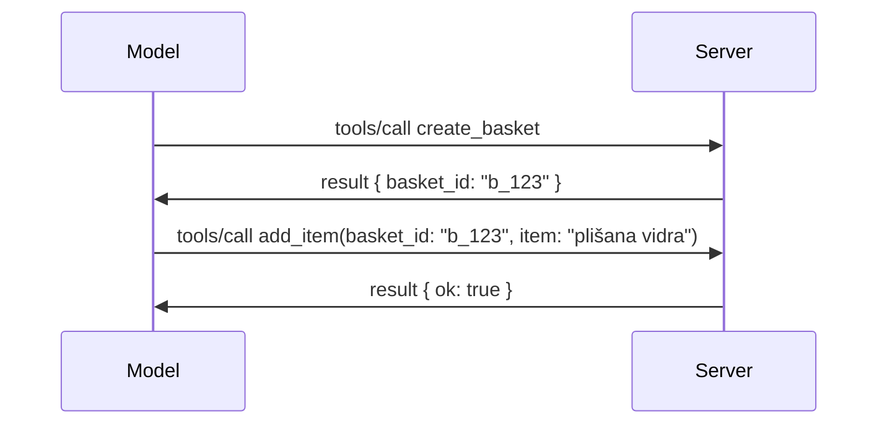

# Što se mijenja u MCP-u: Kandidat za izdanje 2026-07-28

> **Status:** Kandidat za izdanje. Specifikacija `2026-07-28` nije konačna u trenutku pisanja. Najavljena je 21. svibnja 2026. i planirano je izdanje 28. srpnja 2026. Sve u ovom satu opisuje kandidata za izdanje; provjerite [nacrt specifikacije](https://modelcontextprotocol.io/specification/draft) i njezin [dnevnik promjena](https://modelcontextprotocol.io/specification/draft/changelog) za najnoviji status prije nego što gradite prema njoj. Ostatak ovog kurikuluma napisan je prema trenutačnom stabilnom izdanju, **MCP Specifikacija 2025-11-25**, i bit će ažuriran nakon što `2026-07-28` bude izdana.

## Pregled

`2026-07-28` je najveća revizija MCP-a od njegovog lansiranja. Šest Proposals za unapređenje specifikacije (SEPs) uklanja protokolske sesije i čini MCP bezdržavnim na transportnoj razini, proširenja postaju mehanizam prvoklasni i verzioniran, a nekoliko značajki koje ste ranije naučili u ovom kurikulumu (Korijeni, Uzorkovanje, Dnevnik) označene su kao zastarjele prema novoj politici životnog ciklusa. Ova lekcija sažima što se mijenja, zašto je važno i što znači za kod koji ste već napisali prema `2025-11-25`.

Izvor: [The 2026-07-28 MCP Specification Release Candidate](https://blog.modelcontextprotocol.io/posts/2026-07-28-release-candidate/) (Model Context Protocol Blog, David Soria Parra i Den Delimarsky).

## Ciljevi učenja

Do kraja ovog sata moći ćete:

- Objasniti zašto MCP prelazi na bezdržavni protokol i koji problem rješava za horizontalno skalirane implementacije.
- Opišite kako su zamijenjeni rukovanje `initialize`/`initialized` i zaglavlje `Mcp-Session-Id`.
- Prepoznajte nova zaglavlja `Mcp-Method` i `Mcp-Name` te predmemorijske metapodatke `ttlMs`/`cacheScope`.
- Prepoznajte okvir za proširenja i dva proširenja uključena u ovo izdanje: MCP Apps i Tasks.
- Nabrojite šest SEP-ova za autorizaciju koji učvršćuju usklađenost s OAuth 2.0 / OIDC.
- Prepoznajte koja su temeljna svojstva (Korijeni, Uzorkovanje, Dnevnik) sada zastarjela i što to praktično znači.
- Objasnite promjenu u Full JSON Schema 2020-12 za alate `inputSchema`/`outputSchema`.

## Bezdržavni protokol

Glavna promjena: MCP postaje bezdržavni na razini protokola.

### Prije (2025-11-25): sesije vas vežu za jedan poslužitelj

Pozivanje alata preko Streamable HTTP započinje rukovanjem `initialize`. Poslužitelj odgovara zaglavljem `Mcp-Session-Id` koje svaki sljedeći zahtjev mora nositi:

```http
POST /mcp HTTP/1.1
Mcp-Session-Id: 1868a90c-3a3f-4f5b
Content-Type: application/json

{"jsonrpc":"2.0","id":2,"method":"tools/call",
 "params":{"name":"search","arguments":{"q":"otters"}}}
```

Budući da je sesija vezana uz poslužiteljsku instancu koja ju je izdala, horizontalno skalirane implementacije trebaju **sticky routing** na load balanceru i **zajedničko spremište sesija** između instanci.

### Nakon (2026-07-28): svaki zahtjev je samostalan

```http
POST /mcp HTTP/1.1
MCP-Protocol-Version: 2026-07-28
Mcp-Method: tools/call
Mcp-Name: search
Content-Type: application/json

{"jsonrpc":"2.0","id":1,"method":"tools/call",
 "params":{"name":"search","arguments":{"q":"otters"},
           "_meta":{"io.modelcontextprotocol/clientInfo":{"name":"my-app","version":"1.0"}}}}
```

Bilo koja poslužiteljska instanca može obraditi ovaj zahtjev. Ključne promjene:

- **Rukovanje `initialize`/`initialized` je uklonjeno** ([SEP-2575](https://github.com/modelcontextprotocol/modelcontextprotocol/pull/2575)). Verzija protokola, podaci o klijentu i mogućnosti klijenta premještaju se u `_meta` za svaki zahtjev. Novi `server/discover` način omogućuje klijentu da prethodno preuzme mogućnosti poslužitelja ako su mu potrebne.
- **Zaglavlje `Mcp-Session-Id` i protokolska sesija su uklonjeni** ([SEP-2567](https://github.com/modelcontextprotocol/modelcontextprotocol/pull/2567)). Sticky routing i zajedničko spremište sesija više nisu potrebni na razini protokola.

### Bezdržavni protokol, državne aplikacije

Uklanjanje protokolske sesije ne znači da vaš poslužitelj ne može biti državni. Preporučeni uzorak isti je kao što HTTP API-jevi uvijek koriste: izradite eksplicitni oblik (npr. `basket_id`, `browser_id`) iz jednog poziva alata i neka model prenese taj oblik nazad kao običan argument u kasnijim pozivima.



To čini državu vidljivom i razumljivom modelu umjesto da je skriva u metapodacima transporta, a dozvoljava bilo kojoj poslužiteljskoj instanci da obradi bilo koji poziv.

### Zahtjevi s poslužitelja klijentu, restrukturirani

Bezdržavnom protokolu i dalje treba način da poslužitelj zatraži nešto od klijenta tijekom poziva (npr. poticaj za ispitivanje):

- **Zahtjevi koje inicira poslužitelj mogu se izdavati samo dok poslužitelj aktivno obrađuje zahtjev klijenta** ([SEP-2260](https://github.com/modelcontextprotocol/modelcontextprotocol/pull/2260)) — prije preporuka, sada obavezno. Korisnik nije nikada iznenada upitan.
- **Višekratni zahtjevi s više rundi** ([SEP-2322](https://github.com/modelcontextprotocol/modelcontextprotocol/pull/2322)) zamjenjuju držanje otvorenog SSE toka. Umjesto toga, poslužitelj vraća `InputRequiredResult`:

  ```json
  {
    "resultType": "inputRequired",
    "inputRequests": {
      "confirm": {
        "type": "elicitation",
        "message": "Delete 3 files?",
        "schema": { "type": "boolean" }
      }
    },
    "requestState": "eyJzdGVwIjoxLCJmaWxlcyI6WyJhIiwiYiIsImMiXX0="
  }
  ```

  Klijent prikuplja odgovore i ponovno šalje izvorni poziv s `inputResponses` plus odjeknuti `requestState`. Bilo koja poslužiteljska instanca može prihvatiti ponovni pokušaj jer je sve potrebno u teretu.

### Usmjerljivo, predmemorirano, praćeno

Tri manje promjene čine bezdržavni promet lakšim za upravljanje:

- **Zaglavlja `Mcp-Method` i `Mcp-Name` su obavezna na Streamable HTTP** ([SEP-2243](https://github.com/modelcontextprotocol/modelcontextprotocol/pull/2243)), tako da load balanceri, gateway-i i rate limiteri mogu usmjeravati na osnovi operacije bez pregleda JSON tijela. Poslužitelji odbijaju zahtjeve u kojima se zaglavlja i tijelo ne slažu.
- **`tools/list` i rezultati čitanja resursa nose `ttlMs` i `cacheScope`** ([SEP-2549](https://github.com/modelcontextprotocol/modelcontextprotocol/pull/2549)), modelirani prema HTTP `Cache-Control`. Klijenti znaju koliko je rezultat liste svjež i je li sigurno dijeliti ga među korisnicima, bez potrebe za dugotrajnim SSE tokom za praćenje promjena.
- **Propagacija W3C Trace Context u `_meta` je dokumentirana** ([SEP-414](https://github.com/modelcontextprotocol/modelcontextprotocol/pull/414)), popravljajući nazive ključeva `traceparent`, `tracestate` i `baggage` kako bi distribuirano praćenje moglo pratiti poziv kroz SDK klijenta, MCP poslužitelj i downstream sustave u [OpenTelemetry](https://opentelemetry.io/)-kompatibilnom backendu.

## Proširenja postaju prvoklasna

Proširenja su neformalno postojala u `2025-11-25`. [SEP-2133](https://github.com/modelcontextprotocol/modelcontextprotocol/pull/2133) ih formalizira:

- Proširenja se identificiraju obrnuto-DNS ID-ovima.
- Pregovaraju se kroz mapu `extensions` u sposobnostima klijenta i poslužitelja.
- Žive u vlastitim `ext-*` repozitorijima s delegiranim održavateljima i verzioniraju se neovisno o osnovnoj specifikaciji.
- Novi Extensions Track u SEP procesu pruža im put od eksperimentalnog do službenog.

Ovo izdanje donosi dva službena proširenja.

### MCP Apps: korisnička sučelja renderirana na poslužitelju

[MCP Apps](https://blog.modelcontextprotocol.io/posts/2026-01-26-mcp-apps/) ([SEP-1865](https://github.com/modelcontextprotocol/modelcontextprotocol/pull/1865)) omogućuje poslužiteljima da šalju interaktivna HTML sučelja koja domaćini pohranjuju u sandboxirani iframe. Alati deklariraju svoje predloške UI unaprijed kako bi domaćini mogli unaprijed dohvatiti, keširati i sigurnosno ih pregledati prije nego što se bilo što pokrene. Osnovama ste već pokrili u [15. lekciji: MCP Apps](../03-GettingStarted/15-mcp-apps/README.md) — pod okvir za proširenja, MCP Apps je sada formalno proširenje, a ne eksperimentalna temeljna značajka.

### Tasks prelazi u proširenje

Tasks su ušli kao eksperimentalna temeljna značajka u `2025-11-25`. Produkcijska upotreba otkrila je dosta preinaka tako da je pravo mjesto za to proširenje: [Tasks proširenje](https://github.com/modelcontextprotocol/modelcontextprotocol/pull/2663) oblikuje životni ciklus oko bezdržavnog modela — poslužitelj može odgovoriti na `tools/call` s upravljačem zadatka, a klijent ga dalje pokreće s `tasks/get`, `tasks/update` i `tasks/cancel`. Kreiranje zadatka inicira poslužitelj: klijent oglašava proširenje, a poslužitelj odlučuje kada se poziv treba izvršiti kao zadatak. `tasks/list` je u potpunosti uklonjen jer se ne može sigurno ograničiti bez sesija.

> **Napomena za migraciju:** ako ste implementirali eksperimentalni API Tasks `2025-11-25`, morat ćete ga migrirati na novi životni ciklus proširenja — nije unatrag kompatibilan.

## Ojačavanje autorizacije

Šest SEP-ova ojačava [specifikaciju autorizacije](https://modelcontextprotocol.io/specification/draft/basic/authorization) kako bi se bolje uskladila sa stvarnim OAuth 2.0 / OpenID Connect implementacijama:

| SEP | Promjena |
|---|---|
| [SEP-2468](https://github.com/modelcontextprotocol/modelcontextprotocol/pull/2468) | Klijenti moraju validirati `iss` parametar na odgovorima autorizacije prema [RFC 9207](https://www.rfc-editor.org/rfc/rfc9207), smanjujući napade miješanja koji su česti u MCP-ovom obrascu jednoprostornog klijenta i više poslužitelja. Buduća verzija će zahtijevati odbijanje odgovora bez `iss`. |
| [SEP-837](https://github.com/modelcontextprotocol/modelcontextprotocol/pull/837) | Klijenti deklariraju svoj OpenID Connect `application_type` tijekom Dinamičke registracije klijenta, izbjegavajući da autorizacijski poslužitelji podrazumijevaju desktop/CLI klijenta kao `"web"` i odbijaju njegov localhost redirect URI. |
| [SEP-2352](https://github.com/modelcontextprotocol/modelcontextprotocol/pull/2352) | Klijenti vežu registrirane vjerodajnice za `issuer` autorizacijskog poslužitelja koji ih je izdao i ponovno registriraju kad se resurs premjesti između poslužitelja. |
| [SEP-2207](https://github.com/modelcontextprotocol/modelcontextprotocol/pull/2207) | Dokumentira kako zatražiti osvježavajuće tokene od OpenID Connect stila autorizacijskih poslužitelja. |
| [SEP-2350](https://github.com/modelcontextprotocol/modelcontextprotocol/pull/2350) | Precizira akumulaciju scope-a tijekom povisivanja autorizacije. |
| [SEP-2351](https://github.com/modelcontextprotocol/modelcontextprotocol/pull/2351) | Precizira sufiks za `.well-known` otkrivanje. |

Ako danas gradite autorizacijski poslužitelj za MCP, počnite odmah slati `iss` u odgovorima autorizacije — pogledajte [02-Security](../02-Security/README.md) za trenutne smjernice koje će se nadograđivati.

## Korijeni, Uzorkovanje i Dnevnik su zastarjeli

Prema novoj [politici životnog ciklusa značajki](https://github.com/modelcontextprotocol/modelcontextprotocol/pull/2577) ([SEP-2577](https://github.com/modelcontextprotocol/modelcontextprotocol/pull/2577)), tri osnovne klijentske primitivne vrijednosti koje ste naučili o u [Temeljni pojmovi](./README.md#roots) prelaze u status **Zastarjelo**:

| Značajka | Preporučena zamjena |
|---|---|
| Korijeni | Parametri alata, URI-jevi resursa ili konfiguracija poslužitelja |
| Uzorkovanje | Izravna integracija s API-jima pružatelja LLM-a |
| Dnevnik | `stderr` za stdio transportere; OpenTelemetry za strukturiranu preglednost |

Ove su **zastarjelosti samo za označavanje**: metode, tipovi i zastavice sposobnosti nastavljaju raditi u ovom izdanju i u svakoj verziji specifikacije objavljenoj unutar godine dana nakon njega. Uklanjanje bilo čega će zahtijevati poseban SEP prema politici životnog ciklusa — pa vam postojeći [uzorci uzorkovanja](../03-GettingStarted/14-sampling/README.md) danas neće prestati raditi, no novi poslužitelji trebaju preferirati gornje zamjenske obrasce.

## Potpuni JSON Schema 2020-12 za alate

`inputSchema` i `outputSchema` alata podignuti su na puni [JSON Schema 2020-12](https://json-schema.org/draft/2020-12) ([SEP-2106](https://github.com/modelcontextprotocol/modelcontextprotocol/pull/2106)):

- Ulazni sheme zadržavaju korijenski ograničavajući `type: "object"` ali sada dopuštaju kompoziciju (`oneOf`, `anyOf`, `allOf`), uvjete i reference (`$ref`, `$defs`).
- Izlazni sheme su neograničene i `structuredContent` sada može biti bilo koja JSON vrijednost, a ne samo objekt.
- Implementacije ne smiju automatski dereferencirati vanjske `$ref` URI-jeve i trebaju ograničiti dubinu sheme i vrijeme validacije (zaštita od DoS napada ako validacija skida sheme s poslužitelja).

Osobno, kod pogreške za nedostajući resurs mijenja se s MCP-prilagođenog `-32002` na JSON-RPC standardni `-32602` (Neispravni parametri) ([SEP-2164](https://github.com/modelcontextprotocol/modelcontextprotocol/pull/2164)). Ako vaš klijent podudara doslovni `-32002` vrijednost, bit će potrebno ažuriranje.

## Kako protokol napreduje odavde

Ovo izdanje sadrži prelomne promjene koje MCP održavatelji ne namjeravaju da budu pravilo ubuduće. Tri upravljačka SEP-a ciljaju spriječiti ponavljanje:

- **Politika životnog ciklusa značajki** daje svakom značajkom put od Aktivno → Zastarjelo → Uklonjeno s najmanje dvanaest mjeseci između zastarjelosti i najranijeg mogućeg uklanjanja.
- **Okvir za proširenja** omogućuje novo funkcionalnosti da se isporuči kao opcionalna proširenja i stabilizira tamo prije nego što (ako ikad) pređe u osnovnu specifikaciju.

- SEP na putu standarda više ne može dosegnuti status Final dok se odgovarajući scenarij ne pojavi u [skupu za usklađenost](https://github.com/modelcontextprotocol/conformance) ([SEP-2484](https://github.com/modelcontextprotocol/modelcontextprotocol/pull/2484)) — isti skup na koji [sustav razina SDK](https://github.com/modelcontextprotocol/modelcontextprotocol/pull/1777) ocjenjuje službene SDK-ove.

## Vremenski okvir izdanja i validacija

- Kandidat za izdanje zaključan je 21. svibnja 2026.
- Konačna specifikacija planirana je za 28. srpnja 2026.
- Desetotjedni razmak između ta dva datuma omogućava održavateljima SDK-a i implementatorima klijentskih aplikacija da validiraju promjene u stvarnim radnim opterećenjima; očekuje se da će SDK-ovi razine 1 isporučiti podršku unutar ovog razdoblja prema [sustavu razina SDK](https://modelcontextprotocol.io/docs/sdk).
- Pratite cijeli skup promjena u [nacrtu specifikacije](https://modelcontextprotocol.io/specification/draft) i njenom [dnevniku promjena](https://modelcontextprotocol.io/specification/draft/changelog).

## Što to znači za ovaj kurikulum

Sve što ste dosad naučili u ovom tečaju cilja na **2025-11-25**, što ostaje trenutna stabilna specifikacija dok ne izađe izdanje `2026-07-28`. Konkretno:

- **Sesije i rukovanje `initialize`** (obrađeno u [Osnovnim pojmovima](./README.md) i [Lekcija 6: HTTP Streaming](../03-GettingStarted/06-http-streaming/README.md)) još uvijek rade kao što je danas dokumentirano, ali očekujte da će ih zamijeniti model bezdržavnog zahtjeva nakon nadogradnje na SDK-ove kompatibilne s `2026-07-28`.
- **Uzorčenje i korijeni** (također obrađeno u [Osnovnim pojmovima](./README.md)) ostaju u potpunosti funkcionalni ali su zastarjeli — novi dizajni trebali bi koristiti obrasce zamjene navedene gore.
- **Eksperimentalna značajka Tasks**, ako ste je koristili, trebat će migraciju na novi životni ciklus proširenja Tasks.
- **MCP aplikacije** ([Lekcija 15](../03-GettingStarted/15-mcp-apps/README.md)) u praksi nisu pogođene; one se jednostavno premještaju pod formalni okvir proširenja.

## Dodatni izvori

- [Kandidat za izdanje MCP specifikacije 28.07.2026. (blog post)](https://blog.modelcontextprotocol.io/posts/2026-07-28-release-candidate/)
- [Budućnost MCP transporta](https://blog.modelcontextprotocol.io/posts/2025-12-19-mcp-transport-future/)
- [Nacrt MCP specifikacije](https://modelcontextprotocol.io/specification/draft)
- [Dnevnik promjena MCP nacrta](https://modelcontextprotocol.io/specification/draft/changelog)
- [Upute za SEP](https://modelcontextprotocol.io/community/sep-guidelines)
- [Sustav razina MCP SDK-a](https://modelcontextprotocol.io/docs/sdk)

## Sljedeći koraci

Vratite se na [Osnovne pojmove](./README.md) ili nastavite na [Sigurnost](../02-Security/README.md) da vidite kako se današnja smjernica `2025-11-25` odnosi na nadolazeće promjene.

---

<!-- CO-OP TRANSLATOR DISCLAIMER START -->
**Napomena**:
Ovaj dokument je preveden korištenjem AI prevoditeljskog servisa [Co-op Translator](https://github.com/Azure/co-op-translator). Iako težimo točnosti, imajte na umu da automatski prijevodi mogu sadržavati greške ili netočnosti. Izvorni dokument na izvornom jeziku treba smatrati autoritativnim izvorom. Za važne informacije preporuča se profesionalni ljudski prijevod. Nismo odgovorni za bilo kakva nesporazumevanja ili pogrešne interpretacije koje proizlaze iz korištenja ovog prijevoda.
<!-- CO-OP TRANSLATOR DISCLAIMER END -->