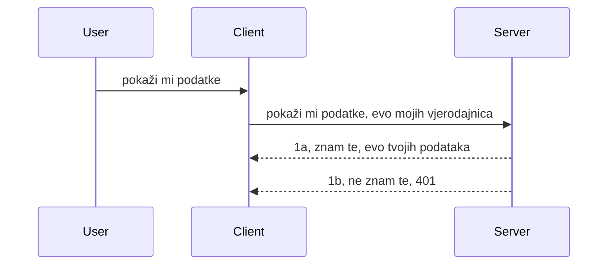

# Jednostavna autentifikacija

MCP SDK-ovi podržavaju korištenje OAuth 2.1 koji je, da budemo pošteni, prilično složen proces koji uključuje koncepte poput auth servera, resource servera, slanja vjerodajnica, dobivanja koda, razmjene koda za bearer token dok na kraju ne dobijete podatke o resursu. Ako niste navikli na OAuth što je sjajna stvar za implementirati, dobra je ideja započeti s nekim osnovnim nivoom autentifikacije i graditi prema boljoj i boljoj sigurnosti. Zato postoji ovo poglavlje, da vas izgradi do naprednije autentifikacije.

## Autentifikacija, što podrazumijevamo?

Autentifikacija je skraćeno za autentifikaciju i autorizaciju. Ideja je da moramo napraviti dvije stvari:

- **Autentifikacija**, što je proces utvrđivanja dopuštamo li osobi ulaz u naš dom, da li ima pravo biti "ovdje" tj. imati pristup našem resource serveru gdje žive značajke našeg MCP Servera.
- **Autorizacija**, je proces utvrđivanja bi li korisnik trebao imati pristup specifičnim resursima za koje traži, na primjer ovim narudžbama ili ovim proizvodima ili je li mu dopušteno čitati sadržaj ali ne i brisati, kao drugi primjer.

## Vjerodajnice: kako sustavu kažemo tko smo

Pa, većina web programera najčešće počinje razmišljati u terminima pružanja vjerodajnice poslužitelju, obično nekog tajnog ključa koji kaže jesu li dopušteni biti ovdje "Autentifikacija". Ova vjerodajnica je obično base64 kodirana verzija korisničkog imena i lozinke ili API ključ koji jedinstveno identificira specifičnog korisnika.

To uključuje slanje putem zaglavlja nazvanog "Authorization" ovako:

```json
{ "Authorization": "secret123" }
```

To se obično naziva osnovna autentifikacija. Kako ukupni tijek tada funkcionira je na sljedeći način:



Sad kad razumijemo kako to radi s aspekta tijeka, kako ćemo to implementirati? Pa, većina web poslužitelja ima koncept zvan middleware, dio koda koji se izvršava kao dio zahtjeva i može provjeriti vjerodajnice, a ako su vjerodajnice valjane može proslijediti zahtjev dalje. Ako zahtjev nema valjane vjerodajnice, dobit ćete grešku autentifikacije. Pogledajmo kako to možemo implementirati:

**Python**

```python
class AuthMiddleware(BaseHTTPMiddleware):
    async def dispatch(self, request, call_next):

        has_header = request.headers.get("Authorization")
        if not has_header:
            print("-> Missing Authorization header!")
            return Response(status_code=401, content="Unauthorized")

        if not valid_token(has_header):
            print("-> Invalid token!")
            return Response(status_code=403, content="Forbidden")

        print("Valid token, proceeding...")
       
        response = await call_next(request)
        # dodajte bilo koje korisničke zaglavlja ili na neki način promijenite odgovor
        return response


starlette_app.add_middleware(CustomHeaderMiddleware)
```

Ovdje imamo:

- Kreirali smo middleware nazvan `AuthMiddleware` gdje ga je web server pozvao putem metode `dispatch`.
- Dodali middleware web serveru:

    ```python
    starlette_app.add_middleware(AuthMiddleware)
    ```

- Napisali validacijsku logiku koja provjerava postoji li Authorization zaglavlje i je li tajni ključ koji se šalje valjan:

    ```python
    has_header = request.headers.get("Authorization")
    if not has_header:
        print("-> Missing Authorization header!")
        return Response(status_code=401, content="Unauthorized")

    if not valid_token(has_header):
        print("-> Invalid token!")
        return Response(status_code=403, content="Forbidden")
    ```

    ako je tajni ključ prisutan i valjan, prosljeđujemo zahtjev pozivom `call_next` i vraćamo odgovor.

    ```python
    response = await call_next(request)
    # dodajte bilo kakve prilagođene zaglavlja ili promijenite odgovor na neki način
    return response
    ```

Kako to radi je da ako je web zahtjev upućen prema serveru, middleware će biti pozvan i s obzirom na implementaciju dozvolit će zahtjevu prolaz ili vratiti grešku koja označava da klijent nema pravo nastaviti.

**TypeScript**

Ovdje stvaramo middleware s popularnim frameworkom Express i presrećemo zahtjev prije nego što stigne do MCP Servera. Ovo je kod za to:

```typescript
function isValid(secret) {
    return secret === "secret123";
}

app.use((req, res, next) => {
    // 1. Postoji zaglavlje autorizacije?
    if(!req.headers["Authorization"]) {
        res.status(401).send('Unauthorized');
    }
    
    let token = req.headers["Authorization"];

    // 2. Provjerite valjanost.
    if(!isValid(token)) {
        res.status(403).send('Forbidden');
    }

   
    console.log('Middleware executed');
    // 3. Prosljeđuje zahtjev sljedećem koraku u obradi zahtjeva.
    next();
});
```

U ovom kodu:

1. Provjeravamo postoji li uopće Authorization zaglavlje, ako ne postoji, šaljemo grešku 401.
2. Provjeravamo je li vjerodajnica/token valjan, ako nije, šaljemo grešku 403.
3. Na kraju prosljeđujemo zahtjev u lanac zahtjeva i vraćamo traženi resurs.

## Vježba: Implementirajte autentifikaciju

Iskoristit ćemo naše znanje i pokušati to implementirati. Evo plana:

Server

- Kreirajte web server i MCP instancu.
- Implementirajte middleware za server.

Klijent

- Pošaljite web zahtjev, s vjerodajnicom, preko zaglavlja.

### -1- Kreirajte web server i MCP instancu

> **Pogled unaprijed:** TypeScript primjer ispod prati HTTP transportove u `transports` mapi po ključu `mcp-session-id`, prema **MCP specifikaciji 2025-11-25**. Izlazni kandidat `2026-07-28` uklanja `initialize` rukovanje i sesijski ID potpuno, tako da ova mapa po sesijama nestaje u korist bezdržavnih, samostalnih zahtjeva. Pogledajte [Što se mijenja u MCP-u: Kandidat za izdanje 2026-07-28](../../01-CoreConcepts/mcp-2026-07-28-release-candidate.md).

U prvom koraku trebamo stvoriti web server instancu i MCP Server.

**Python**

Ovdje stvaramo MCP server instancu, kreiramo starlette web aplikaciju i hostamo je s uvicornom.

```python
# kreiranje MCP servera

app = FastMCP(
    name="MCP Resource Server",
    instructions="Resource Server that validates tokens via Authorization Server introspection",
    host=settings["host"],
    port=settings["port"],
    debug=True
)

# kreiranje starlette web aplikacije
starlette_app = app.streamable_http_app()

# posluživanje aplikacije putem uvicorn-a
async def run(starlette_app):
    import uvicorn
    config = uvicorn.Config(
            starlette_app,
            host=app.settings.host,
            port=app.settings.port,
            log_level=app.settings.log_level.lower(),
        )
    server = uvicorn.Server(config)
    await server.serve()

run(starlette_app)
```

U ovom kodu:

- Kreirali smo MCP Server.
- Konstruirali starlette web aplikaciju iz MCP Servera, `app.streamable_http_app()`.
- Hostamo i pokrećemo web aplikaciju koristeći uvicorn `server.serve()`.

**TypeScript**

Ovdje stvaramo MCP Server instancu.

```typescript
const server = new McpServer({
      name: "example-server",
      version: "1.0.0"
    });

    // ... postavite resurse servera, alate i upite ...
```

Ova kreacija MCP Servera će se morati dogoditi unutar definicije PUTANJE POST /mcp, pa uzmimo gornji kod i premjestimo ga ovako:

```typescript
import express from "express";
import { randomUUID } from "node:crypto";
import { McpServer } from "@modelcontextprotocol/sdk/server/mcp.js";
import { StreamableHTTPServerTransport } from "@modelcontextprotocol/sdk/server/streamableHttp.js";
import { isInitializeRequest } from "@modelcontextprotocol/sdk/types.js"

const app = express();
app.use(express.json());

// Mapa za pohranu transporta po ID-u sesije
const transports: { [sessionId: string]: StreamableHTTPServerTransport } = {};

// Obrada POST zahtjeva za komunikaciju klijent-poslužitelj
app.post('/mcp', async (req, res) => {
  // Provjeri postojeći ID sesije
  const sessionId = req.headers['mcp-session-id'] as string | undefined;
  let transport: StreamableHTTPServerTransport;

  if (sessionId && transports[sessionId]) {
    // Ponovno koristi postojeći transport
    transport = transports[sessionId];
  } else if (!sessionId && isInitializeRequest(req.body)) {
    // Novi zahtjev za inicijalizaciju
    transport = new StreamableHTTPServerTransport({
      sessionIdGenerator: () => randomUUID(),
      onsessioninitialized: (sessionId) => {
        // Pohrani transport po ID-u sesije
        transports[sessionId] = transport;
      },
      // Zaštita od DNS ponovnog vezanja je prema zadanim postavkama onemogućena radi kompatibilnosti unatrag. Ako pokrećete ovaj poslužitelj
      // lokalno, obavezno postavite:
      // enableDnsRebindingProtection: true,
      // allowedHosts: ['127.0.0.1'],
    });

    // Očisti transport kada se zatvori
    transport.onclose = () => {
      if (transport.sessionId) {
        delete transports[transport.sessionId];
      }
    };
    const server = new McpServer({
      name: "example-server",
      version: "1.0.0"
    });

    // ... postavi resurse poslužitelja, alate i upite ...

    // Poveži se na MCP poslužitelj
    await server.connect(transport);
  } else {
    // Neispravan zahtjev
    res.status(400).json({
      jsonrpc: '2.0',
      error: {
        code: -32000,
        message: 'Bad Request: No valid session ID provided',
      },
      id: null,
    });
    return;
  }

  // Obradi zahtjev
  await transport.handleRequest(req, res, req.body);
});

// Ponovno upotrebljivi rukovatelj za GET i DELETE zahtjeve
const handleSessionRequest = async (req: express.Request, res: express.Response) => {
  const sessionId = req.headers['mcp-session-id'] as string | undefined;
  if (!sessionId || !transports[sessionId]) {
    res.status(400).send('Invalid or missing session ID');
    return;
  }
  
  const transport = transports[sessionId];
  await transport.handleRequest(req, res);
};

// Obrada GET zahtjeva za obavijesti poslužitelj-klijent putem SSE
app.get('/mcp', handleSessionRequest);

// Obrada DELETE zahtjeva za završetak sesije
app.delete('/mcp', handleSessionRequest);

app.listen(3000);
```

Sad vidite kako je kreacija MCP Servera premještena unutar `app.post("/mcp")`.

Krenimo na sljedeći korak kreiranja middlewarea da možemo validirati dolaznu vjerodajnicu.

### -2- Implementirajte middleware za server

Nastavimo s dijelom middlewarea. Ovdje ćemo izraditi middleware koji traži vjerodajnicu u zaglavlju `Authorization` i validira ju. Ako je prihvatljiva, zahtjev će nastaviti na ono što treba (npr. listati alate, čitati resurs ili bilo koju MCP funkcionalnost za koju klijent traži).

**Python**

Za kreiranje middlewarea trebamo izraditi klasu koja nasljeđuje `BaseHTTPMiddleware`. Postoje dva zanimljiva dijela:

- Zahtjev `request` s kojeg čitamo informacije iz zaglavlja.
- `call_next` je callback koji moramo pozvati ako klijent donese prihvatljivu vjerodajnicu.

Prvo, moramo obraditi slučaj ako nedostaje `Authorization` zaglavlje:

```python
has_header = request.headers.get("Authorization")

# nema zaglavlja, neuspjeh s 401, inače nastavi dalje.
if not has_header:
    print("-> Missing Authorization header!")
    return Response(status_code=401, content="Unauthorized")
```

Ovdje šaljemo 401 unauthorized poruku jer klijent ne prolazi autentifikaciju.

Sljedeće, ako je vjerodajnica poslana, moramo provjeriti njezinu valjanost ovako:

```python
 if not valid_token(has_header):
    print("-> Invalid token!")
    return Response(status_code=403, content="Forbidden")
```

Primijetite kako šaljemo 403 forbidden poruku gore. Pogledajmo puni middleware ispod koji implementira sve što smo naveli:

```python
class AuthMiddleware(BaseHTTPMiddleware):
    async def dispatch(self, request, call_next):

        has_header = request.headers.get("Authorization")
        if not has_header:
            print("-> Missing Authorization header!")
            return Response(status_code=401, content="Unauthorized")

        if not valid_token(has_header):
            print("-> Invalid token!")
            return Response(status_code=403, content="Forbidden")

        print("Valid token, proceeding...")
        print(f"-> Received {request.method} {request.url}")
        response = await call_next(request)
        response.headers['Custom'] = 'Example'
        return response

```

Odlično, a što je s funkcijom `valid_token`? Evo je ispod:

```python
# NE koristite za produkciju - poboljšajte to !!
def valid_token(token: str) -> bool:
    # ukloni prefiks "Bearer "
    if token.startswith("Bearer "):
        token = token[7:]
        return token == "secret-token"
    return False
```

Ovo bi naravno trebalo poboljšati.

VAŽNO: Nikada ne smijete imati tajne ovakve u kodu. Idealno biste trebali vrijednost za usporedbu dobiti iz izvora podataka ili od IDP-a (identity service providera) ili još bolje, neka IDP provodi validaciju.

**TypeScript**

Za implementaciju s Expressom, moramo pozvati metodu `use` koja prima middleware funkcije.

Moramo:

- Komunicirati s varijablom zahtjeva da provjerimo proslijeđenu vjerodajnicu u `Authorization` svojstvu.
- Validirati vjerodajnicu, i ako je valjana, dopustiti zahtjevu da nastavi i dopustiti MCP zahtjevu klijenta da radi što treba (npr. listanje alata, čitanje resursa ili bilo što drugo povezano s MCP-om).

Ovdje provjeravamo postoji li `Authorization` zaglavlje i ako ne postoji, zaustavljamo prolazak zahtjeva:

```typescript
if(!req.headers["authorization"]) {
    res.status(401).send('Unauthorized');
    return;
}
```

Ako zaglavlje nije poslano u prvom redu, vraćate 401.

Sljedeće, provjeravamo je li vjerodajnica valjana, ako nije opet zaustavljamo zahtjev, ali s drugačijom porukom:

```typescript
if(!isValid(token)) {
    res.status(403).send('Forbidden');
    return;
} 
```

Primijetite kako sada dobivate 403 grešku.

Evo cijelog koda:

```typescript
app.use((req, res, next) => {
    console.log('Request received:', req.method, req.url, req.headers);
    console.log('Headers:', req.headers["authorization"]);
    if(!req.headers["authorization"]) {
        res.status(401).send('Unauthorized');
        return;
    }
    
    let token = req.headers["authorization"];

    if(!isValid(token)) {
        res.status(403).send('Forbidden');
        return;
    }  

    console.log('Middleware executed');
    next();
});
```

Postavili smo web server da prihvati middleware koji provjerava vjerodajnicu koju klijent, nadamo se, šalje. Što je s klijentom samim?

### -3- Pošaljite web zahtjev s vjerodajnicom preko zaglavlja

Moramo osigurati da klijent šalje vjerodajnicu preko zaglavlja. Pošto ćemo koristiti MCP klijenta za to, moramo shvatiti kako se to radi.

**Python**

Za klijenta moramo poslati zaglavlje s vjerodajnicom ovako:

```python
# NEMOJTE tvrdo kodirati vrijednost, barem je spremite u varijablu okoline ili sigurnije spremište
token = "secret-token"

async with streamablehttp_client(
        url = f"http://localhost:{port}/mcp",
        headers = {"Authorization": f"Bearer {token}"}
    ) as (
        read_stream,
        write_stream,
        session_callback,
    ):
        async with ClientSession(
            read_stream,
            write_stream
        ) as session:
            await session.initialize()
      
            # TODO, što želite da se napravi na klijentu, npr. popis alata, pozivanje alata itd.
```

Primijetite kako popunjavamo `headers` svojstvo ovako ` headers = {"Authorization": f"Bearer {token}"}`.

**TypeScript**

Možemo to riješiti u dva koraka:

1. Popunimo konfiguracijski objekt našim vjerodajnicama.
2. Proslijedimo konfiguracijski objekt u transport.

```typescript

// NEMOJTE kodirati vrijednost izravno kao što je prikazano ovdje. Najmanje je držite kao varijablu okoline i koristite nešto poput dotenv (u razvojnom načinu).
let token = "secret123"

// definirajte objekt opcija klijentskog transporta
let options: StreamableHTTPClientTransportOptions = {
  sessionId: sessionId,
  requestInit: {
    headers: {
      "Authorization": "secret123"
    }
  }
};

// proslijedite objekt opcija transportu
async function main() {
   const transport = new StreamableHTTPClientTransport(
      new URL(serverUrl),
      options
   );
```

Ovdje gore vidite kako smo morali kreirati objekt `options` i staviti naše zaglavlja pod `requestInit` svojstvo.

VAŽNO: Kako to poboljšati odavde? Pa, trenutna implementacija ima neke probleme. Prvo, prijenos vjerodajnice ovako je prilično riskantan osim ako barem nemate HTTPS. Čak i tada, vjerodajnica može biti ukradena, pa vam treba sustav gdje lako možete opozvati token i dodati dodatne provjere poput odakle u svijetu dolazi, događa li se zahtjev prečesto (ponašanje bota), ukratko, ima cijeli niz briga.

Treba reći, za vrlo jednostavne API-je gdje ne želite da bilo tko poziva vaš API bez autentifikacije, ovo što imamo ovdje je dobar početak.

S tim rečeno, pokušajmo malo ojačati sigurnost korištenjem standardiziranog formata poput JSON Web Tokena, poznatog kao JWT ili "JOT" tokeni.

## JSON Web Tokeni, JWT

Dakle, pokušavamo poboljšati stvari u odnosu na slanje vrlo jednostavnih vjerodajnica. Koja su neposredna poboljšanja koja dobivamo primjenom JWT-a?

- **Poboljšanja sigurnosti**. U osnovnoj autentifikaciji šaljete korisničko ime i lozinku kao base64 kodirani token (ili šaljete API ključ) iznova i iznova što povećava rizik. S JWT-om šaljete korisničko ime i lozinku i zauzvrat dobivate token koji je vremenski ograničen što znači da će isteći. JWT vam također omogućuje lako korištenje granularne kontrole pristupa korištenjem uloga, opsega i dozvola.
- **Bezdržavnost i skalabilnost**. JWT-ovi su samostalni, nose sve korisničke informacije i eliminiraju potrebu za pohranom sesije na strani poslužitelja. Token se može također validirati lokalno.
- **Interoperabilnost i federacija**. JWT je središnji u Open ID Connect i koristi se s poznatim identitetskim pružateljima poput Entra ID, Google Identity i Auth0. Također omogućuje jedinstvenu prijavu (single sign on) i mnogo više što ga čini poduzećnim standardom.
- **Modularnost i fleksibilnost**. JWT se također može koristiti s API Gatewayjima poput Azure API Management, NGINX i drugih. Podržava scenarije autentifikacije i komunikacije server-server uključujući impersonaciju i delegaciju.
- **Performanse i keširanje**. JWT može biti keširan nakon dekodiranja što smanjuje potrebu za parsiranjem. Ovo posebno pomaže kod aplikacija s velikim prometom jer poboljšava propusnost i smanjuje opterećenje vaše infrastrukture.
- **Napredne značajke**. Također podržava introspekciju (provjeru valjanosti na serveru) i opoziv (učiniti token nevažećim).

Sa svim ovim prednostima, pogledajmo kako možemo s našom implementacijom napraviti korak više.

## Pretvaranje osnovne autentifikacije u JWT

Dakle, promjene koje trebamo napraviti na visokoj razini su:

- **Naučiti kako konstruirati JWT token** i pripremiti ga za slanje od klijenta prema serveru.
- **Validirati JWT token**, i ako je valjan, dopustiti klijentu pristup našim resursima.
- **Sigurno spremanje tokena**. Kako pohraniti ovaj token.
- **Zaštita ruta**. Trebamo zaštititi rute, u našem slučaju, trebamo zaštititi rute i specifične MCP značajke.
- **Dodavanje refresh tokena**. Osigurati kreiranje tokena kratkog vijeka trajanja ali i refresh tokena dugog vijeka koji se mogu koristiti za dobivanje novih tokena ako istekne. Također osigurati postojiće refresh endpoint i strategiju rotacije.

### -1- Konstruiranje JWT tokena

Prvo, JWT token ima sljedeće dijelove:

- **zaglavlje**, algoritam koji se koristi i tip tokena.
- **payload**, tvrdnje (claims), poput sub (korisnik ili entitet koji token predstavlja. U auth scenariju to je tipično korisnički ID), exp (kada ističe), role (uloga)
- **potpis**, potpisan s tajnim ključem ili privatnim ključem.

Za ovo ćemo trebati konstruirati zaglavlje, payload i enkodirani token.

**Python**

```python

import jwt
import jwt
from jwt.exceptions import ExpiredSignatureError, InvalidTokenError
import datetime

# Tajni ključ koji se koristi za potpisivanje JWT-a
secret_key = 'your-secret-key'

header = {
    "alg": "HS256",
    "typ": "JWT"
}

# korisničke informacije, njegove tvrdnje i vrijeme isteka
payload = {
    "sub": "1234567890",               # Predmet (ID korisnika)
    "name": "User Userson",                # Prilagođena tvrdnja
    "admin": True,                     # Prilagođena tvrdnja
    "iat": datetime.datetime.utcnow(),# Vrijeme izdavanja
    "exp": datetime.datetime.utcnow() + datetime.timedelta(hours=1)  # Vrijeme isteka
}

# kodirati ga
encoded_jwt = jwt.encode(payload, secret_key, algorithm="HS256", headers=header)
```

U gornjem kodu smo:

- Definirali zaglavlje koristeći HS256 kao algoritam i tip JWT.
- Konstruirali payload koji sadrži subject ili korisnički ID, korisničko ime, ulogu, kada je izdan i kada istječe čime implementiramo vremensko ograničenje o kojem smo ranije govorili.

**TypeScript**

Ovdje ćemo trebati nekoliko ovisnosti koje će nam pomoći u konstrukciji JWT tokena.

Ovisnosti

```sh

npm install jsonwebtoken
npm install --save-dev @types/jsonwebtoken
```

Sad kad to imamo, napravimo zaglavlje, payload i kroz njih kreirajmo enkodirani token.

```typescript
import jwt from 'jsonwebtoken';

const secretKey = 'your-secret-key'; // Koristite varijable okoline u produkciji

// Definirajte korisni teret
const payload = {
  sub: '1234567890',
  name: 'User usersson',
  admin: true,
  iat: Math.floor(Date.now() / 1000), // Izdano u
  exp: Math.floor(Date.now() / 1000) + 60 * 60 // Istječe za 1 sat
};

// Definirajte zaglavlje (opcionalno, jsonwebtoken postavlja zadane vrijednosti)
const header = {
  alg: 'HS256',
  typ: 'JWT'
};

// Kreirajte token
const token = jwt.sign(payload, secretKey, {
  algorithm: 'HS256',
  header: header
});

console.log('JWT:', token);
```

Ovaj token je:

Potpisan koristeći HS256
Vrijedi 1 sat
Uključuje tvrdnje poput sub, name, admin, iat, i exp.

### -2- Validacija tokena

Također ćemo trebati validirati token, to je nešto što bismo trebali napraviti na serveru kako bismo osigurali da je ono što nam klijent šalje zapravo valjano. Trebamo napraviti mnoge provjere od validacije strukture do valjanosti. Također se potiče da dodate druge provjere da vidite je li korisnik u vašem sustavu i slično.

Za validaciju tokena, moramo ga dekodirati da ga možemo pročitati i onda početi provjeravati njegovu valjanost:

**Python**

```python

# Dekodiraj i provjeri JWT
try:
    decoded = jwt.decode(token, secret_key, algorithms=["HS256"])
    print("✅ Token is valid.")
    print("Decoded claims:")
    for key, value in decoded.items():
        print(f"  {key}: {value}")
except ExpiredSignatureError:
    print("❌ Token has expired.")
except InvalidTokenError as e:
    print(f"❌ Invalid token: {e}")

```


U ovom kodu pozivamo `jwt.decode` koristeći token, tajni ključ i odabrani algoritam kao ulaz. Primijetite kako koristimo konstrukciju try-catch jer neuspjela validacija dovodi do podizanja pogreške.

**TypeScript**

Ovdje moramo pozvati `jwt.verify` kako bismo dobili dekodiranu verziju tokena koju možemo daljnje analizirati. Ako ovaj poziv ne uspije, to znači da je struktura tokena neispravna ili više nije valjana.

```typescript

try {
  const decoded = jwt.verify(token, secretKey);
  console.log('Decoded Payload:', decoded);
} catch (err) {
  console.error('Token verification failed:', err);
}
```

NAPOMENA: kao što je ranije spomenuto, trebali bismo provesti dodatne provjere kako bismo osigurali da ovaj token upućuje na korisnika u našem sustavu i da korisnik ima prava koja tvrdi da ima.

Zatim, pogledajmo kontrolu pristupa temeljenu na ulogama, također poznatu kao RBAC.

## Dodavanje kontrole pristupa temeljenog na ulogama

Ideja je da želimo izraziti da različite uloge imaju različite dozvole. Na primjer, pretpostavljamo da administrator može učiniti sve, da obični korisnik može čitati/pisati i da gost može samo čitati. Stoga, evo nekih mogućih razina dozvola:

- Admin.Write
- User.Read
- Guest.Read

Pogledajmo kako takvu kontrolu možemo implementirati pomoću middleware-a. Middlewarei se mogu dodati po ruti kao i za sve rute.

**Python**

```python
from starlette.middleware.base import BaseHTTPMiddleware
from starlette.responses import JSONResponse
import jwt

# NE DRŽITE tajnu u kodu, ovo je samo za demonstraciju. Pročitajte je s sigurnog mjesta.
SECRET_KEY = "your-secret-key" # stavite ovo u env varijablu
REQUIRED_PERMISSION = "User.Read"

class JWTPermissionMiddleware(BaseHTTPMiddleware):
    async def dispatch(self, request, call_next):
        auth_header = request.headers.get("Authorization")
        if not auth_header or not auth_header.startswith("Bearer "):
            return JSONResponse({"error": "Missing or invalid Authorization header"}, status_code=401)

        token = auth_header.split(" ")[1]
        try:
            decoded = jwt.decode(token, SECRET_KEY, algorithms=["HS256"])
        except jwt.ExpiredSignatureError:
            return JSONResponse({"error": "Token expired"}, status_code=401)
        except jwt.InvalidTokenError:
            return JSONResponse({"error": "Invalid token"}, status_code=401)

        permissions = decoded.get("permissions", [])
        if REQUIRED_PERMISSION not in permissions:
            return JSONResponse({"error": "Permission denied"}, status_code=403)

        request.state.user = decoded
        return await call_next(request)


```

Postoji nekoliko različitih načina za dodavanje middleware-a, kao u nastavku:

```python

# Alt 1: dodajte middleware tijekom konstruiranja starlette aplikacije
middleware = [
    Middleware(JWTPermissionMiddleware)
]

app = Starlette(routes=routes, middleware=middleware)

# Alt 2: dodajte middleware nakon što je starlette aplikacija već konstruirana
starlette_app.add_middleware(JWTPermissionMiddleware)

# Alt 3: dodajte middleware po ruti
routes = [
    Route(
        "/mcp",
        endpoint=..., # upravljač
        middleware=[Middleware(JWTPermissionMiddleware)]
    )
]
```

**TypeScript**

Možemo koristiti `app.use` i middleware koji će se izvršavati za sve zahtjeve.

```typescript
app.use((req, res, next) => {
    console.log('Request received:', req.method, req.url, req.headers);
    console.log('Headers:', req.headers["authorization"]);

    // 1. Provjerite je li zaglavlje autorizacije poslano

    if(!req.headers["authorization"]) {
        res.status(401).send('Unauthorized');
        return;
    }
    
    let token = req.headers["authorization"];

    // 2. Provjerite je li token valjan
    if(!isValid(token)) {
        res.status(403).send('Forbidden');
        return;
    }  

    // 3. Provjerite postoji li korisnik tokena u našem sustavu
    if(!isExistingUser(token)) {
        res.status(403).send('Forbidden');
        console.log("User does not exist");
        return;
    }
    console.log("User exists");

    // 4. Potvrdite ima li token odgovarajuće dozvole
    if(!hasScopes(token, ["User.Read"])){
        res.status(403).send('Forbidden - insufficient scopes');
    }

    console.log("User has required scopes");

    console.log('Middleware executed');
    next();
});

```

Postoji nekoliko stvari koje možemo dopustiti našem middleware-u i koje NAŠ middleware TREBA raditi:

1. Provjeriti je li zaglavlje autorizacije prisutno
2. Provjeriti je li token valjan; pozivamo `isValid`, što je metoda koju smo napisali za provjeru integriteta i valjanosti JWT tokena.
3. Provjeriti postoji li korisnik u našem sustavu, to trebamo provjeriti.

   ```typescript
    // korisnici u bazi podataka
   const users = [
     "user1",
     "User usersson",
   ]

   function isExistingUser(token) {
     let decodedToken = verifyToken(token);

     // TODO, provjeriti postoji li korisnik u bazi podataka
     return users.includes(decodedToken?.name || "");
   }
   ```

   Gore smo kreirali vrlo jednostavnu listu `users`, koja bi naravno trebala biti u bazi podataka.

4. Također bismo trebali provjeriti ima li token odgovarajuće dozvole.

   ```typescript
   if(!hasScopes(token, ["User.Read"])){
        res.status(403).send('Forbidden - insufficient scopes');
   }
   ```

   U gornjem kodu iz middleware-a provjeravamo sadrži li token dozvolu User.Read, ako ne šaljemo grešku 403. Ispod je pomoćna metoda `hasScopes`.

   ```typescript
   function hasScopes(scope: string, requiredScopes: string[]) {
     let decodedToken = verifyToken(scope);
    return requiredScopes.every(scope => decodedToken?.scopes.includes(scope));
  }
   ```

Have a think which additional checks you should be doing, but these are the absolute minimum of checks you should be doing.

Using Express as a web framework is a common choice. There are helpers library when you use JWT so you can write less code.

- `express-jwt`, helper library that provides a middleware that helps decode your token.
- `express-jwt-permissions`, this provides a middleware `guard` that helps check if a certain permission is on the token.

Here's what these libraries can look like when used:

```typescript
const express = require('express');
const jwt = require('express-jwt');
const guard = require('express-jwt-permissions')();

const app = express();
const secretKey = 'your-secret-key'; // put this in env variable

// Decode JWT and attach to req.user
app.use(jwt({ secret: secretKey, algorithms: ['HS256'] }));

// Check for User.Read permission
app.use(guard.check('User.Read'));

// multiple permissions
// app.use(guard.check(['User.Read', 'Admin.Access']));

app.get('/protected', (req, res) => {
  res.json({ message: `Welcome ${req.user.name}` });
});

// Error handler
app.use((err, req, res, next) => {
  if (err.code === 'permission_denied') {
    return res.status(403).send('Forbidden');
  }
  next(err);
});

```

Sada ste vidjeli kako middleware može biti korišten za autentikaciju i autorizaciju, a što je s MCP-om, mijenja li to način na koji radimo autentikaciju? Saznat ćemo u sljedećem poglavlju.

### -3- Dodavanje RBAC-a u MCP

Dosad ste vidjeli kako se može dodati RBAC preko middleware-a, no za MCP ne postoji jednostavan način za dodavanje RBAC-a po značajki MCP-a, pa što radimo? Pa, jednostavno moramo dodati ovakav kod koji u ovom slučaju provjerava ima li klijent prava pozvati određeni alat:

Imate nekoliko različitih izbora kako ostvariti RBAC po značajci, evo nekih:

- Dodajte provjeru za svaki alat, resurs, prompt gdje trebate provjeriti razinu dozvole.

   **python**

   ```python
   @tool()
   def delete_product(id: int):
      try:
          check_permissions(role="Admin.Write", request)
      catch:
        pass # klijent nije uspio u autorizaciji, podigni grešku autorizacije
   ```

   **typescript**

   ```typescript
   server.registerTool(
    "delete-product",
    {
      title: Delete a product",
      description: "Deletes a product",
      inputSchema: { id: z.number() }
    },
    async ({ id }) => {
      
      try {
        checkPermissions("Admin.Write", request);
        // todo, pošalji id u productService i udaljeni unos
      } catch(Exception e) {
        console.log("Authorization error, you're not allowed");  
      }

      return {
        content: [{ type: "text", text: `Deletected product with id ${id}` }]
      };
    }
   );
   ```


- Koristite napredni pristup poslužitelja i rukovatelje zahtjeva da minimizirate koliko mjesta trebate obaviti provjeru.

   **Python**

   ```python
   
   tool_permission = {
      "create_product": ["User.Write", "Admin.Write"],
      "delete_product": ["Admin.Write"]
   }

   def has_permission(user_permissions, required_permissions) -> bool:
      # user_permissions: popis dozvola koje korisnik ima
      # required_permissions: popis dozvola potrebnih za alat
      return any(perm in user_permissions for perm in required_permissions)

   @server.call_tool()
   async def handle_call_tool(
     name: str, arguments: dict[str, str] | None
   ) -> list[types.TextContent]:
    # Pretpostavi da je request.user.permissions popis dozvola za korisnika
     user_permissions = request.user.permissions
     required_permissions = tool_permission.get(name, [])
     if not has_permission(user_permissions, required_permissions):
        # Izbaci grešku "Nemate dozvolu za pozivanje alata {name}"
        raise Exception(f"You don't have permission to call tool {name}")
     # nastavi i pozovi alat
     # ...
   ```   
   

   **TypeScript**

   ```typescript
   function hasPermission(userPermissions: string[], requiredPermissions: string[]): boolean {
       if (!Array.isArray(userPermissions) || !Array.isArray(requiredPermissions)) return false;
       // Vrati true ako korisnik ima barem jednu potrebnu dozvolu
       
       return requiredPermissions.some(perm => userPermissions.includes(perm));
   }
  
   server.setRequestHandler(CallToolRequestSchema, async (request) => {
      const { params: { name } } = request;
  
      let permissions = request.user.permissions;
  
      if (!hasPermission(permissions, toolPermissions[name])) {
         return new Error(`You don't have permission to call ${name}`);
      }
  
      // nastavi..
   });
   ```

   Napomena, trebate osigurati da vaš middleware dodjeljuje dekodirani token svojstvu user u objektu zahtjeva kako bi gornji kod bio jednostavan.

### Zaključak

Sad kad smo raspravili kako općenito dodati podršku za RBAC i posebno za MCP, vrijeme je da sami pokušate implementirati sigurnost kako biste osigurali da ste razumjeli koncepte predstavljene vama.

## Zadatak 1: Izgradite MCP poslužitelj i MCP klijent koristeći osnovnu autentikaciju

Ovdje ćete primijeniti što ste naučili u smislu slanja vjerodajnica putem zaglavlja.

## Rješenje 1

[Rješenje 1](./code/basic/README.md)

## Zadatak 2: Nadogradite rješenje iz zadatka 1 na korištenje JWT-a

Uzmite prvo rješenje ali ovaj put ga poboljšajte.

Umjesto korištenja Basic Auth, upotrijebimo JWT.

## Rješenje 2

[Rješenje 2](./solution/jwt-solution/README.md)

## Izazov

Dodajte RBAC po alatu koji opisujemo u poglavlju "Dodavanje RBAC-a u MCP".

## Sažetak

Nadamo se da ste naučili mnogo u ovom poglavlju, od potpune odsutnosti sigurnosti, preko osnovne sigurnosti, do JWT-a i kako ga se može dodati MCP-u.

Izgradili smo solidnu osnovu s prilagođenim JWT-ovima, ali kako se skaliramo, krećemo prema modelu identiteta temeljenom na standardima. Usvajanjem IdP-a poput Entra ili Keycloak prepuštamo izdavanje tokena, validaciju i upravljanje životnim ciklusom pouzdanoj platformi — oslobađajući nas da se fokusiramo na logiku aplikacije i korisničko iskustvo.

Za to imamo jedno [napredno poglavlje o Entru](../../05-AdvancedTopics/mcp-security-entra/README.md)

## Što je sljedeće

- Sljedeće: [Postavljanje MCP hostova](../12-mcp-hosts/README.md)

---

<!-- CO-OP TRANSLATOR DISCLAIMER START -->
**Napomena**:
Ovaj dokument je preveden korištenjem AI prevoditeljskog servisa [Co-op Translator](https://github.com/Azure/co-op-translator). Iako težimo točnosti, imajte na umu da automatski prijevodi mogu sadržavati greške ili netočnosti. Izvorni dokument na izvornom jeziku treba smatrati autoritativnim izvorom. Za važne informacije preporuča se profesionalni ljudski prijevod. Nismo odgovorni za bilo kakva nesporazumevanja ili pogrešne interpretacije koje proizlaze iz korištenja ovog prijevoda.
<!-- CO-OP TRANSLATOR DISCLAIMER END -->